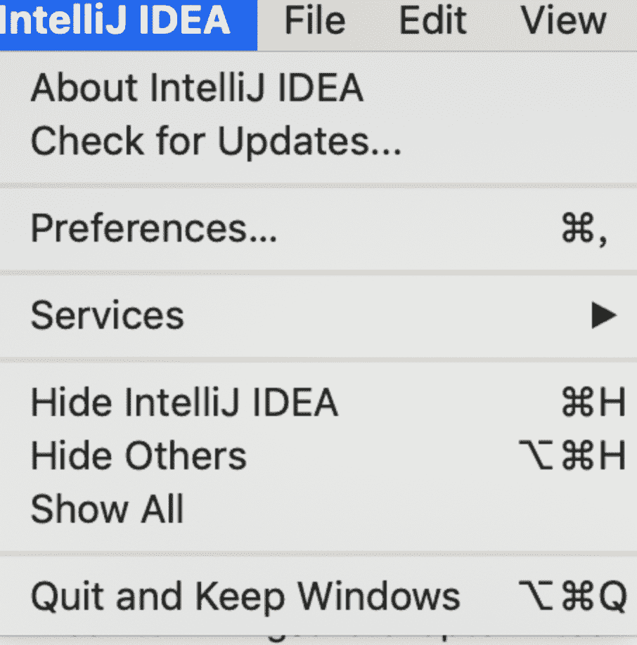

<!--yml
category: 未分类
date: 0001-01-01 00:00:00
--->

# @SuppressWarnings用法

> 原文：[https://zwmst.com/2772.html](https://zwmst.com/2772.html)

   [ *Java基础* ](https://zwmst.com/java%e5%9f%ba%e7%a1%80)*[ <time datetime="2021-09-09T09:12:39+08:00"> 2021-09-09 </time> ](https://zwmst.com/2772.html)  *   [@SuppressWarnings 用法](#suppresswarnings-用法)
    *   [Idea 设置泛型检查，变量、方法未使用检查](#idea-设置泛型检查变量方法未使用检查)
        *   [设置泛型检查](#设置泛型检查)
        *   [设置变量未使用提示](#设置变量未使用提示)
        *   [变量未使用产生的警告](#变量未使用产生的警告)

从Java 5.0起，您可以使用`java.lang.SuppressWarning`注释，来停用与编译单元子集相关的编译警告

**作用**：用于抑制编译器产生警告信息。

## Idea 设置泛型检查，变量、方法未使用检查

从 eclipse 转换到idea 发现有很多不习惯的地方，比如说

```
String s;
List list = new ArrayList();
```

没有未使用的变量，未检查泛型，未使用的方法提示，特意查找了一下相关资料

### 设置泛型检查

我使用的是mac电脑，windows电脑应该类似

打开如图



会出现如下页面


选择 editor —> inspections —> 搜索 Raw use of —> 勾上 Raw use of parameterized class

效果如图：


### 设置变量未使用提示

打开如图：


出现如下页面


在 Editor —> General —> Errors and Warnings —> 选择 Unused symbol

**右侧勾选上 Error stripe mark 和 Effects 下面选择 Underwaved波浪线**

参考：

[https://blog.csdn.net/Lovincc/article/details/80464782](https://blog.csdn.net/Lovincc/article/details/80464782)

[https://blog.csdn.net/codejas/article/details/78657560](https://blog.csdn.net/codejas/article/details/78657560)

### 变量未使用产生的警告

如上设置完成之后，变量未使用的提示应该是这样的：


如图 , list、set、map 都未被使用

**1.为未使用的变量设置SuppressWarning**

在方法前添加

```
@SuppressWarning("unused")
```

能够越过变量未使用检查，@SuppressWarning 中的属性我们稍后再讨论。


**2.对未使用的方法添加SuppressWarning跳过方法未调用检查**

可以在方法上添加SuppressWarning 跳过对方法未使用的检查


**3.为单行泛型添加SuppressWarning 跳过泛型检查**

在单个泛型代码上添加@SuppressWarning("rawtypes")可以跳过泛型检查，但是需要注意： 还需要在方法上添加

@SuppressWarning("unchecked")注释


如上图所示，可以对单个泛型设置@SuppressWarning 跳过类型检查

**4\. 为方法体上添加SuppressWarning 跳过泛型检查**

如果一个方法体上含有多个未被检查的泛型，需要在方法体上添加@SuppressWarning(value={"unchecked","rawtypes"}) 跳过泛型检查

如图所示:


也可以使用 @SuppressWarning("all") ，来跳过所有的检查。


**5.@SuppressWarning 中的属性介绍以及属性说明**

*   all，抑制所有警告
*   boxing，抑制与封装/拆装作业相关的警告
*   cast，抑制与强制转型作业相关的警告
*   dep-ann，抑制与淘汰注释相关的警告
*   deprecation，抑制与淘汰的相关警告
*   fallthrough，抑制与switch陈述式中遗漏break相关的警告
*   finally，抑制与未传回finally区块相关的警告
*   hiding，抑制与隐藏变数的区域变数相关的警告
*   incomplete-switch，抑制与switch陈述式(enum case)中遗漏项目相关的警告
*   javadoc，抑制与javadoc相关的警告
*   nls，抑制与非nls字串文字相关的警告
*   null，抑制与空值分析相关的警告
*   rawtypes，抑制与使用raw类型相关的警告
*   resource，抑制与使用Closeable类型的资源相关的警告
*   restriction，抑制与使用不建议或禁止参照相关的警告
*   serial，抑制与可序列化的类别遗漏serialVersionUID栏位相关的警告
*   static-access，抑制与静态存取不正确相关的警告
*   static-method，抑制与可能宣告为static的方法相关的警告
*   super，抑制与置换方法相关但不含super呼叫的警告
*   synthetic-access，抑制与内部类别的存取未最佳化相关的警告
*   sync-override，抑制因为置换同步方法而遗漏同步化的警告
*   unchecked，抑制与未检查的作业相关的警告
*   unqualified-field-access，抑制与栏位存取不合格相关的警告
*   unused，抑制与未用的程式码及停用的程式码相关的警告

文章参考： [https://www.ibm.com/support/knowledgecenter/zh-tw/SSQ2R2_9.1.1/org.eclipse.jdt.doc.user/tasks/task-suppress_warnings.htm](https://www.ibm.com/support/knowledgecenter/zh-tw/SSQ2R2_9.1.1/org.eclipse.jdt.doc.user/tasks/task-suppress_warnings.htm)

**后记: @SuppressWarning 注解的主要作用就是抑制编译时期所产生的警告，从而提高程序的可读性，对于上面 @SuppressWarning 的所有属性，读者不用全部记忆，读两遍加深印象即可。用到的时候从google或者本文章都可查询***