<!--yml
category: 未分类
date: 0001-01-01 00:00:00
--->

# 操作系统网站推荐

> 原文：[https://zwmst.com/4694.html](https://zwmst.com/4694.html)

   [ *Java基础* ](https://zwmst.com/java%e5%9f%ba%e7%a1%80)*[ <time datetime="2021-10-10T15:38:43+08:00"> 2021-10-10 </time> ](https://zwmst.com/4694.html)  *   [操作系统网站推荐](#操作系统网站推荐)
    *   [studytonight](#studytonight)
    *   [udacity](#udacity)
    *   [tutorialspoint](#tutorialspoint)
    *   [classcentral](#classcentral)
    *   [nptel](#nptel)
    *   [codescracker](#codescracker)
    *   [sciencedirect](#sciencedirect)
    *   [homepage](#homepage)
    *   [computer.howstuffworks.com](#computerhowstuffworkscom)
    *   [tldp.org](#tldporg)
    *   [bilibili](#bilibili)

一般很少有人推荐操作系统的网站吧。。。。。。这几个网站来源于我平常的学习总结，也有一些是来源于网上优秀的回答，希望这几个网站能够助力你对操作系统有更深的认识。

## studytonight

studytonight 简直太棒了！！！ studytonight 会包括 `operationg system`，但是并不是说 studytonight 就是一个单纯的 OS 学习网站，它是一个基础教程网，它的首页是这样的，不仅限于 os ，还会包括 **Java、C、CSS、OS、Computer network 等**。

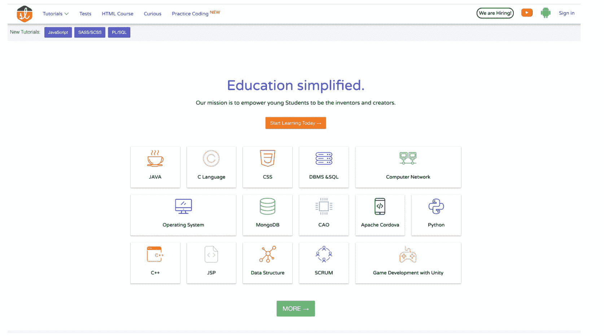

这个页面一看就爱上了，和国内很多页面做的硬风格不同，这样的教程才不那么生硬和让人讨厌。在所有的素材库里面，有各种各样的教程

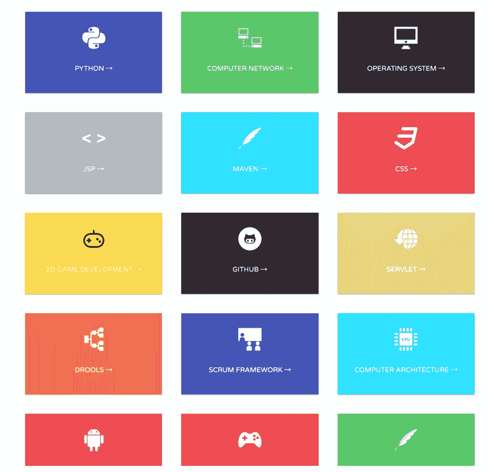

我们推荐的是操作系统，所以索性就点进去操作系统主页好了，点进去的页面就是这样的

studytonight 是一个对初学者来说学习操作系统的一个很友好的网站。

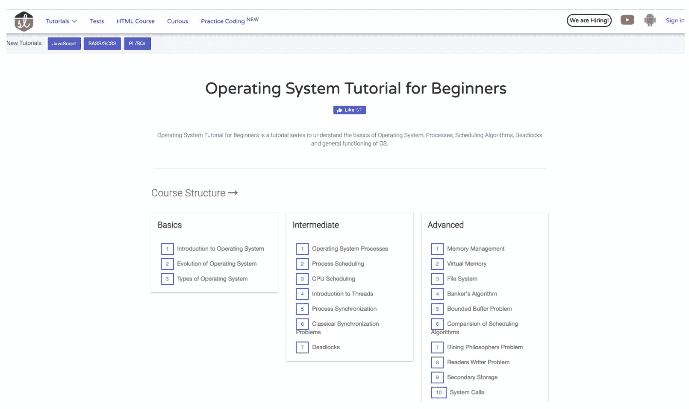

课程艺术主要分为三部分，由易到难分别是基础篇、中等篇、提高篇，我们点进去基础篇的第一篇

这一篇主要是对操作系统的介绍，操作系统的功能、操作系统任务等

通过简单的描述和图片来说明，让人感觉清晰易懂，很有目的性的学习，而且这些主题也可以作为面试题来考

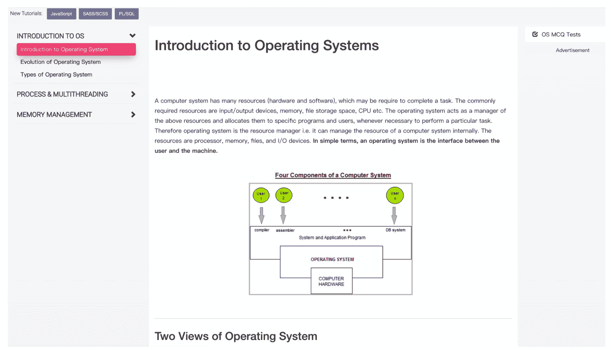

你还真说对了，studytonight 还真的就有面试题

我们在 Test 页签下面会发现有很多面试题

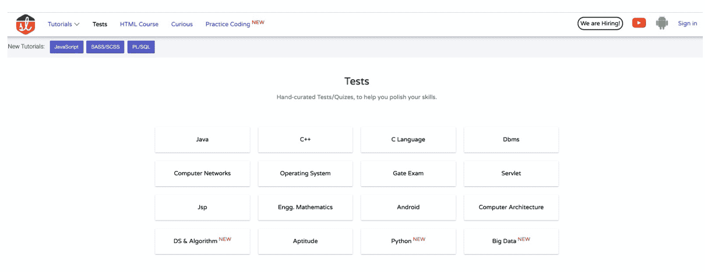

我们选择 **Operating System** 进去之后会发现有很多的测试

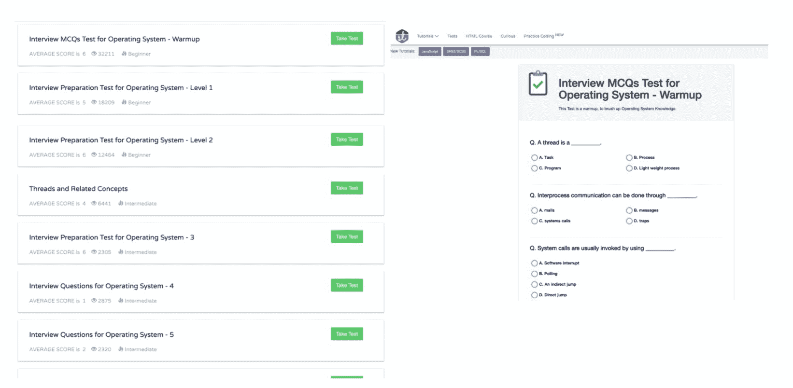

是一个一体化的学习平台，适用于新手，我大致翻看了一下，里面的东西比较基础，受众广，是大家学习必备的一个网站。

## udacity

udacity 是一个视频学习网站，界面看起来很清爽。

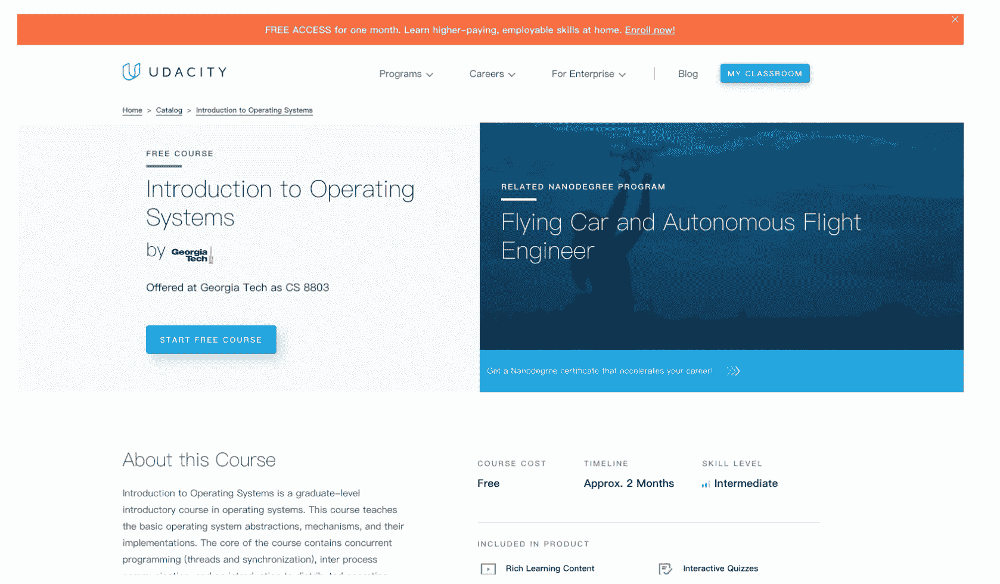

下面还有关于课程的介绍，同时你可以开始免费的课程，这个界面就是中文版了，让人眼前一亮

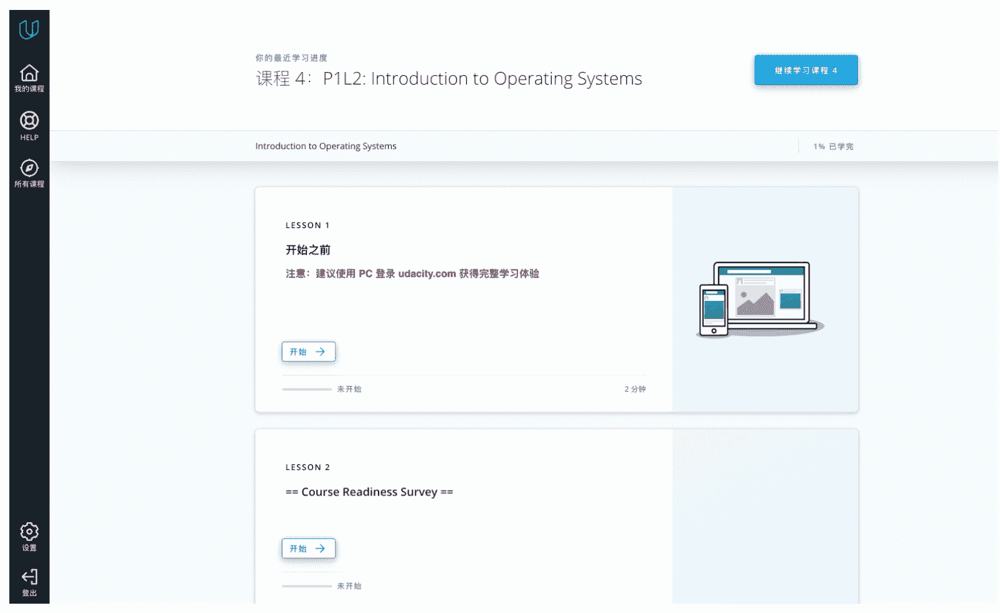

`我的课程` 就是你学过的所有课程，你可以在所有课程中搜索指定的课程，种类非常多

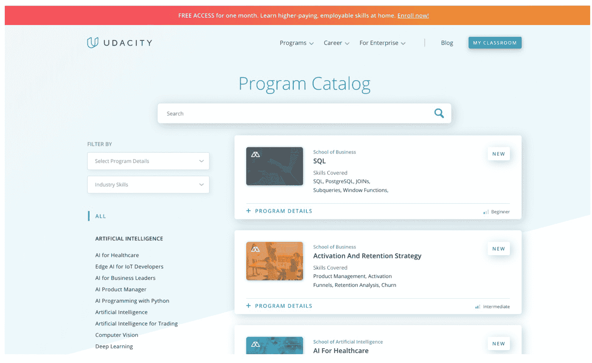

我们还是以操作系统为例，来看一下具体的课程

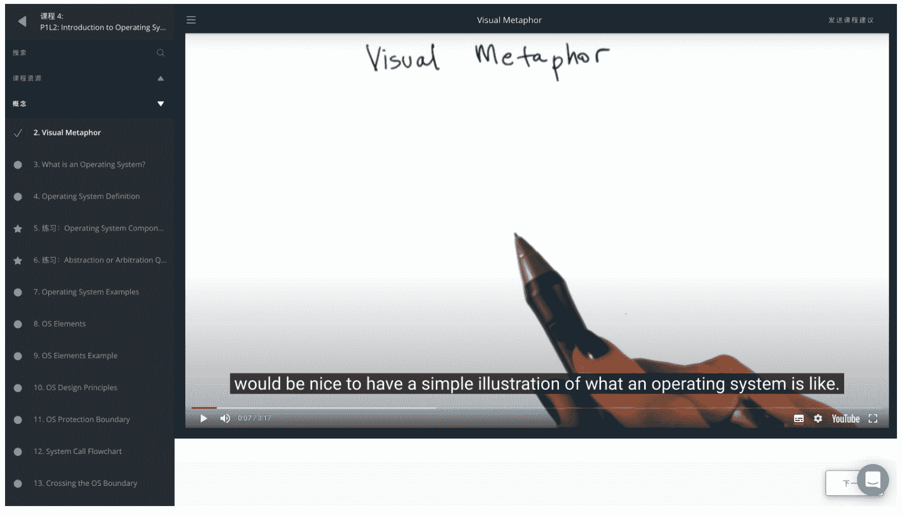

左面是具体的课程列表，右面是讲师授课部分，视频非常清晰，而且讲师吐字很清楚，可以锻炼英语。有一些小伙伴们说英文看不懂，对英文网而退却，这不是一个好习惯。英文在编程世界中的重要性不言而喻。所以英文是你一定要学好的一门语言。

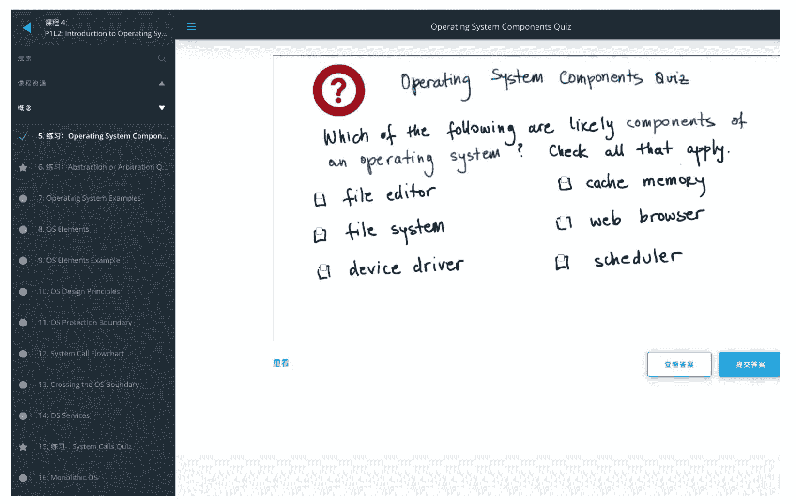

讲师讲完课程之后还有具体的练习环节，作为学习巩固，非常不错。

udacity 的课程要比 studytonight 更深一些，操作系统这门课就分成了 22 堂课，每一堂课还有很多小节，真是一个非常好的网站。**我现在在写文章，我巴不得不写字了，马上学习！**。 还是忍住了，那就写完了马上去看！！！

## tutorialspoint

tutorialspoint 这个网站也是一个资源教程网，这个网站的搜索指数非常高，基本上搜任何问题都有 tutorialspoint 的解释。

我们点进去 Library 之后发现，这就是教程宝库啊，罗列的非常清楚

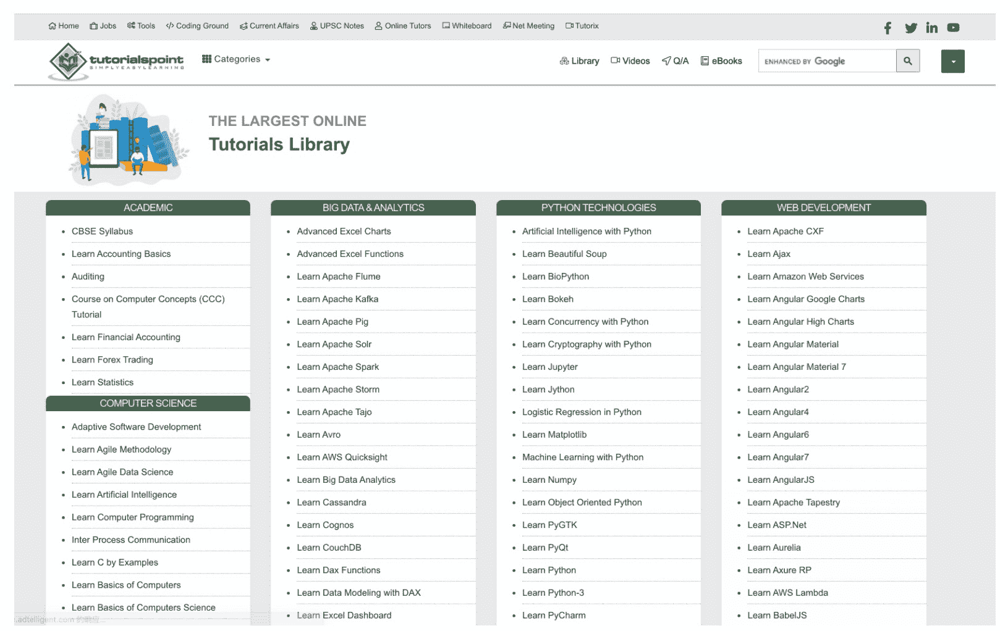

tutorialspoint 也有视频教程，不过大多都收费。

教程非常多，不仅限于编程，也包含 Excel 、SAP 等教程。

tutorialspoint 还有电子书教程，不过大部分也是收费的，应该是 tutorialspoint 自己制作的 PDF，不知道写的怎么样，如果有兴趣的小伙伴可以付费下载，到时候记得给我发一份哦，嘿嘿。

说了这么多，我们还没有看 tutorialspoint 操作系统的主页呢

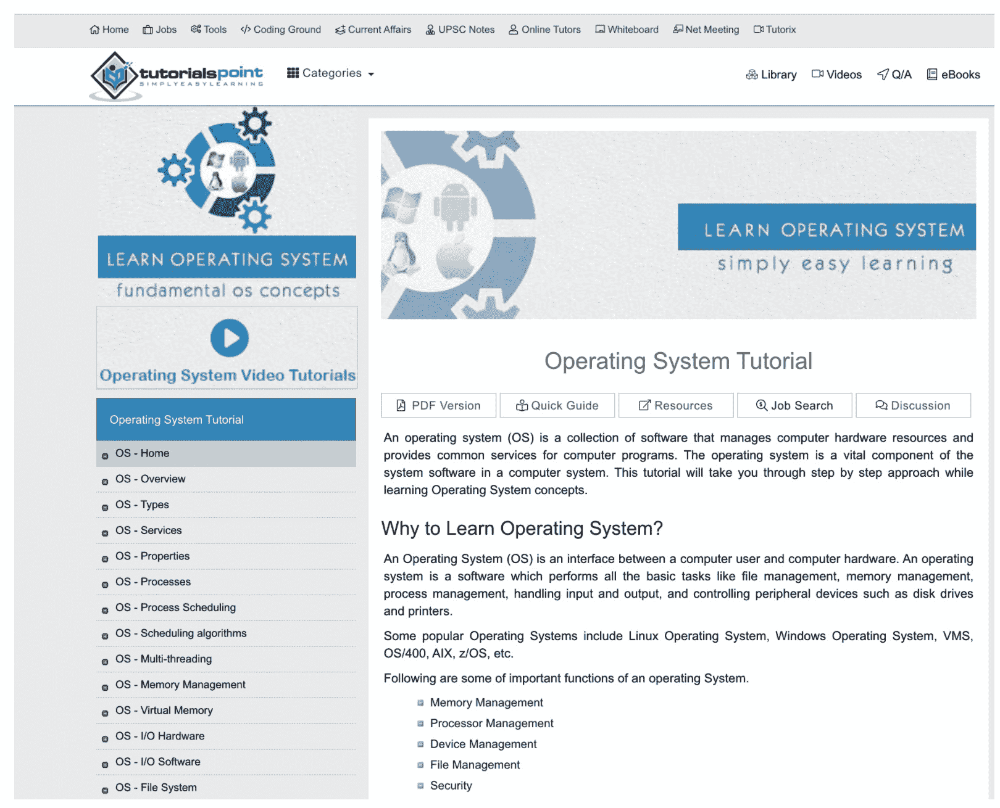

左边是导航栏，右边是具体的教程，这个样式感觉有些老，不过分类倒是很明确的，里面的内容要比 studytonight 差一些，也是一个入门非常好的教程网

## classcentral

classcentral 这个网站有点强啊，里面汇总了各大名校的教程

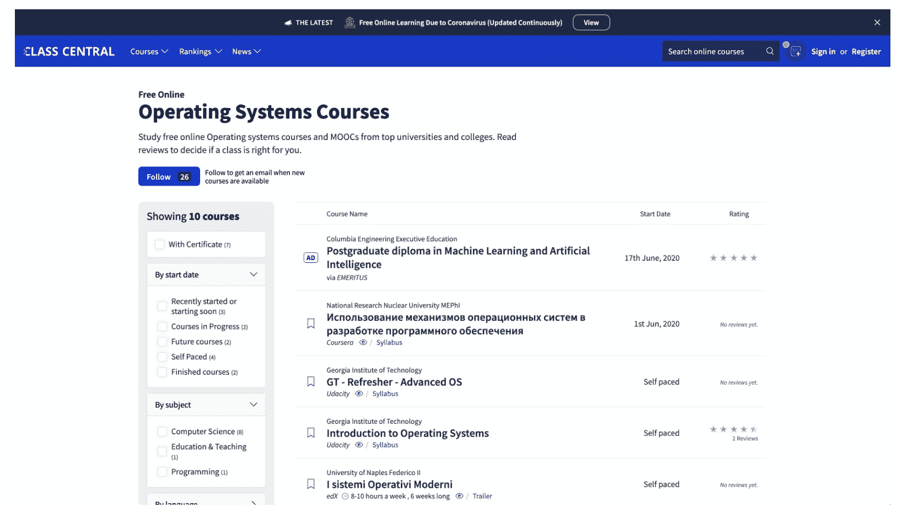

我们发现了一个中文教程，一看是 `南京大学` 的教程，南京大学也是非常牛逼的一所学校，小编也有南大的基友在搞影视，其实我是一个被编程耽误的导演，狗头保命。

不扯皮了，来看看南大的课程

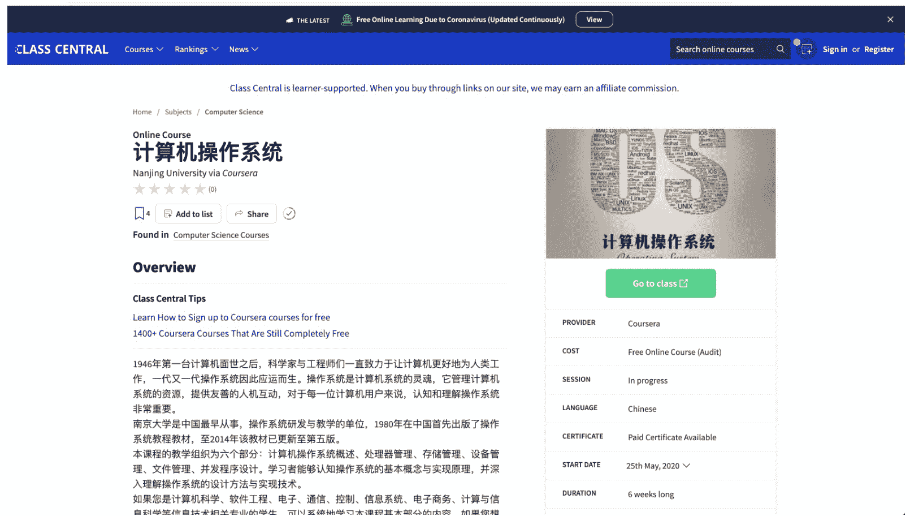

这么多牛逼的课程发现了中文大学，也侧面说明了我国大学在国际上的地位。`Overview` 是 OS 的总体介绍。

我们注册后点击开始课程，就进入讲课页面

课程分为 6 周，以视频的形式展开，我们开始 `计算机系统概览`。

终于能看到国人讲的操作系统了！！！

右边还可以随时做笔记进行查看，课程还支持 `下载` 功能，非常不错！

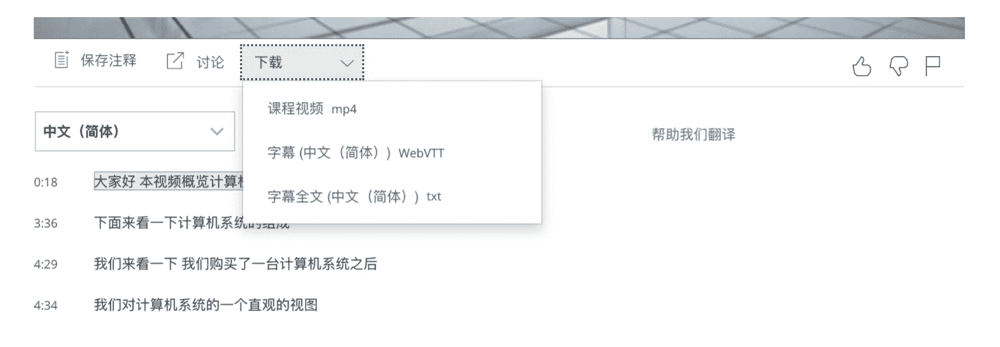

好了我们该退出来了，一会儿又忍不住听课了！

## nptel

仿佛见到了一个不得了的网站，这个网站的名字就隐隐的感觉有点牛逼。我们先看牛逼在哪，然后再看为什么牛逼

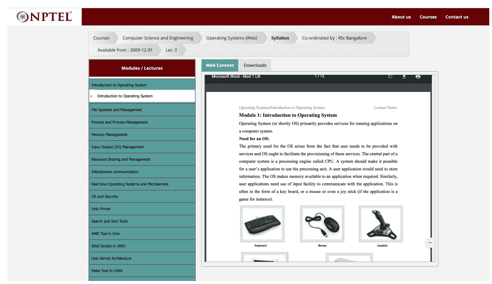

**你能感觉出来牛逼了吗**？

这每一个目录都 TM 是一本书啊，虽然页数不多，但这确确实实是宝贝啊。

从操作系统概述到文件系统、进程管理、文件管理、I/O 管理等等等等。这还不是最牛逼的，最牛逼的是右边能免费 `下载`，你说气人不气人

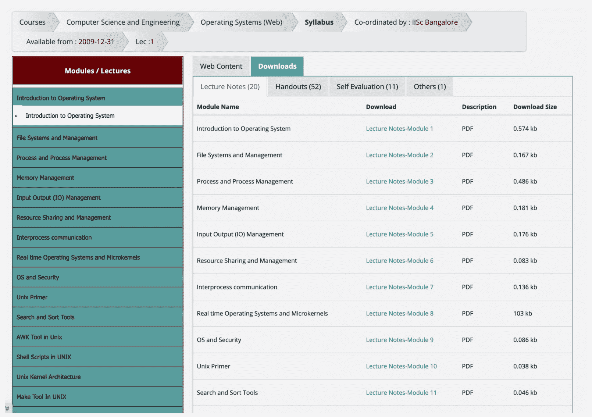

每一章节都支持下载 PDF 版本。

我们带着好奇心，点开了 `About Us`。

然后就看到了下面这段话

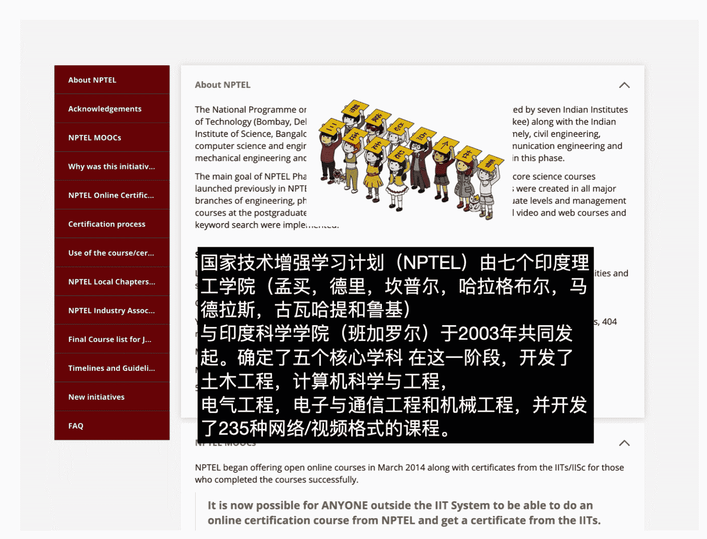

也就是说，这是一个 印度的国家增强型学习计划，也就是说，印度的各大名校联合推出的`免费`学习计划，这也能理解为什么印度人在电气、编程、通信方面能够越来越牛逼了。

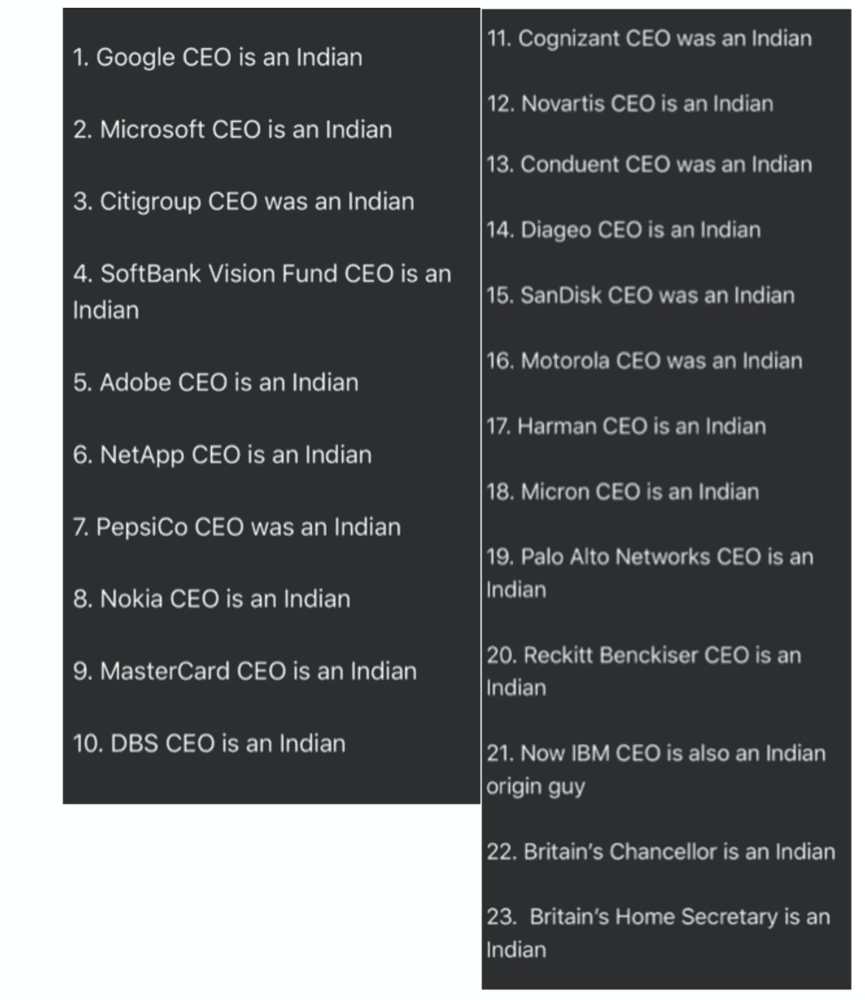

这个网站你一定要看，我认为可以和黑皮书系列平起平坐了。

## codescracker

codescracker 又是一个牛逼的网站，看完这个网站，我才觉得低调才是最牛逼的炫耀。。。

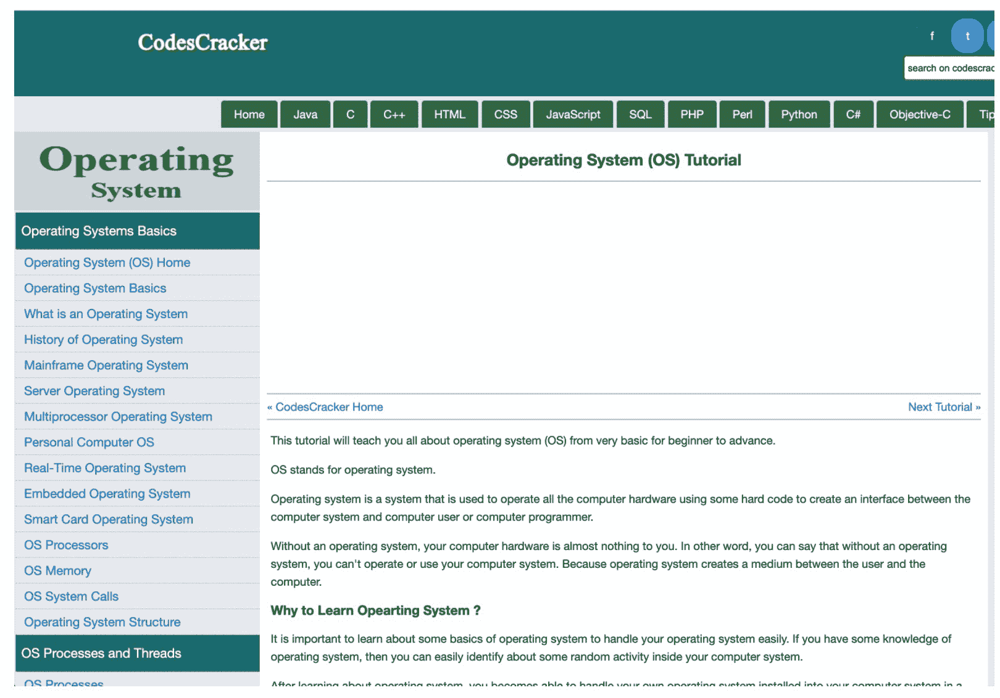

分类都非常全，解释的也很到位，但是 `codescracker` 并不只是一个 os 网站，它是一门编程语言的学习一站式平台，只不过网站比较简洁

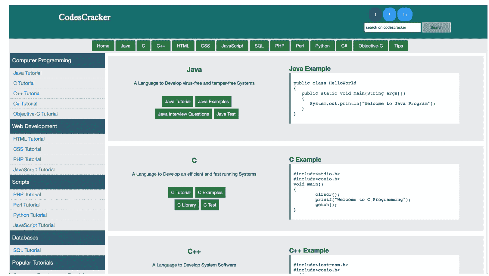

可以看到有各种各样的教程，下面还是有测试类的，基本上企业用的语言都涵盖到了。

你必须要珍藏的一个网站。

## sciencedirect

sciencedirect 这个网站真是太牛逼了。百度对 sciencedirect 的解释

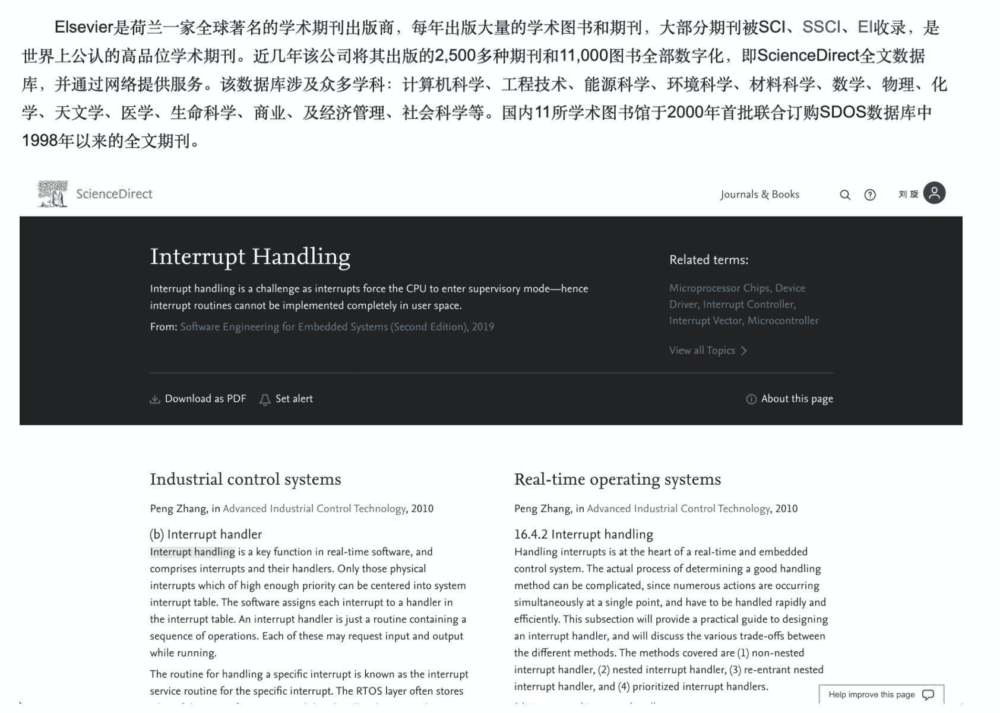

不过 sciencedirect 大部分的 PDF 下载是需要收费的，感兴趣的小伙伴们可以购买

## homepage

Homepage 是做什么的，一看主页就明白了

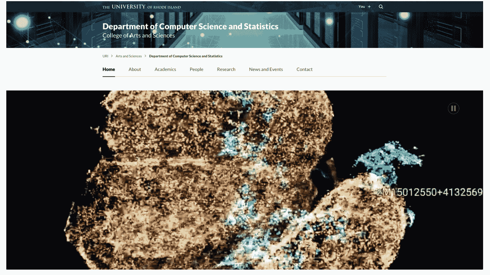

这是一个计算机科学和统计学的网站，然后我们点击 search 搜索 os 直接跳转到 os 的网站

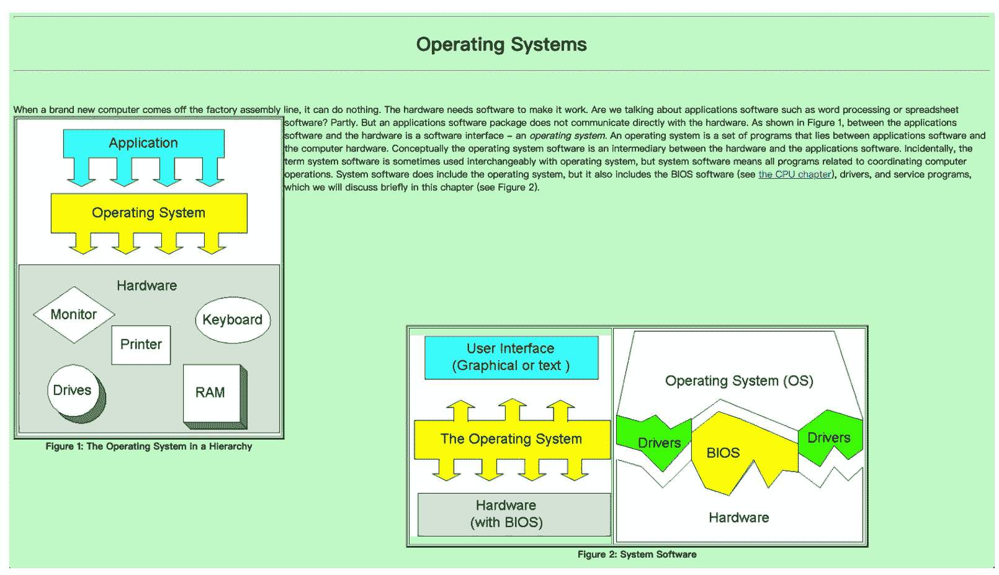

然后就呵呵呵呵了，这个网站比较奇葩，它没有后退和前进的按钮，那怎么访问？

我是直接通过 url 访问的，主页就是 [https://homepage.cs.uri.edu/faculty/wolfe/book/Readings/Reading01.htm](https://homepage.cs.uri.edu/faculty/wolfe/book/Readings/Reading01.htm)

但是网站太硬核了，很好的一个学习资料哦。

## computer.howstuffworks.com

computer.howstuffworks.com 就是一个计算机网站，它涵盖软件和硬件的方方面面。

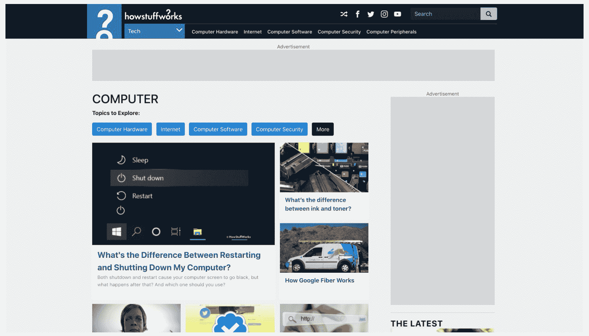

Computer 知识包括 **计算机硬件、网络、计算机软件、计算机秘密等等**

都是一些讲的非常好的文章，可以说是计算机的百科全书了。

老样子我们点开 COMPUTER OPERATING SYSTEMS 专题，可以看到都是一些非常好的文章

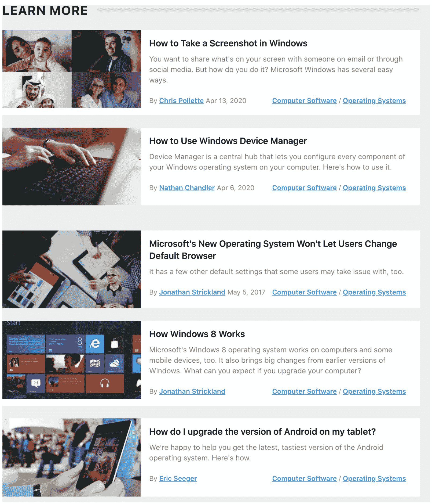

加入收藏夹！

## tldp.org

这个网站又是一个学习操作系统非常牛逼的网站，我都不知道今晚上说了多少次了，哈哈哈哈。

来看看主页是啥样的

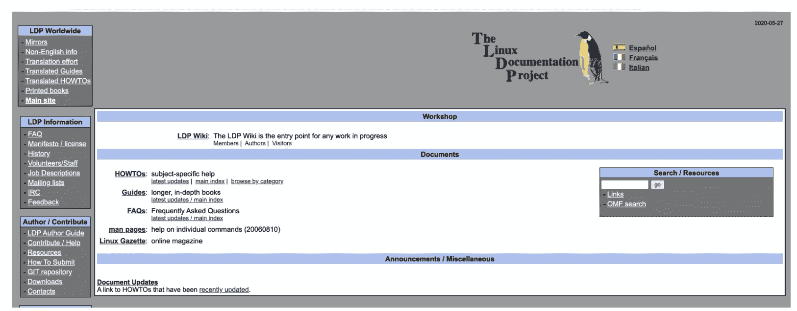

这一看就是一个牛逼的网站，不要问我为什么，OS 的页面是这样的

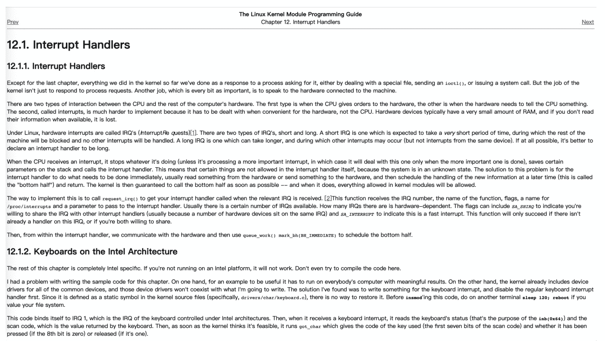

没有任何点缀和装饰，**成年人的生活就这么朴实无华**。*