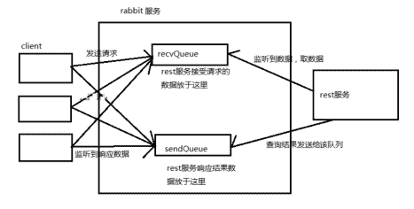

<!--yml
category: 未分类
date: 0001-01-01 00:00:00
--->

# 1235.使⽤RabbitMQ增加rest服务吞吐量。

> 原文：[https://zwmst.com/5776.html](https://zwmst.com/5776.html)

   [ *RabbitMQ* ](https://zwmst.com/rabbitmq)*[ <time datetime="2021-10-31T06:06:22+08:00"> 2021-10-30 </time> ](https://zwmst.com/5776.html)  *