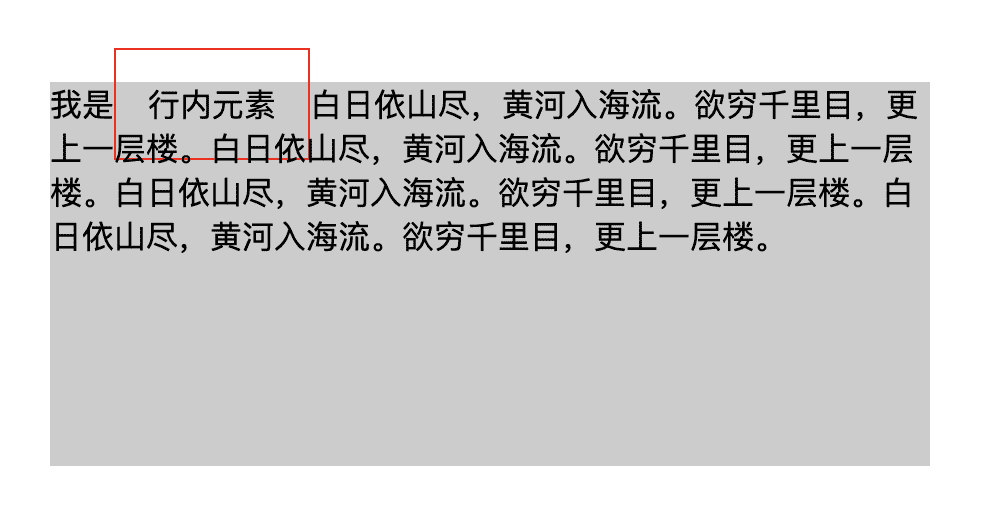
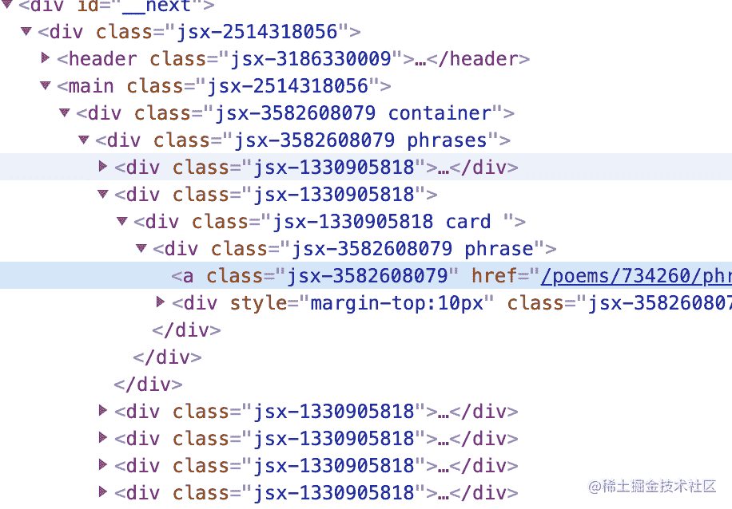
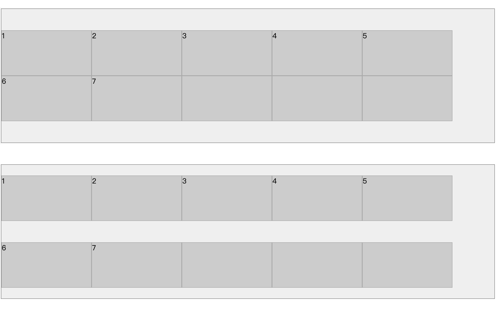

# css

# 如何实现一个元素的水平垂直居中

> 原文：[https://q.shanyue.tech/fe/css/10.html](https://q.shanyue.tech/fe/css/10.html)

更多描述

要求对行内元素、块状元素及不定宽高的块状元素均可适用：

可打开 codepen 进行调试: [https://codepen.io/shanyue/pen/XWMdabg(opens new window)](https://codepen.io/shanyue/pen/XWMdabg)，以下是布局代码

```
<div class="container">
  <div class="item" style="width: 100px; height: 100px; background: #999;">
    块状元素
  </div>
</div>

<div class="container">
  <div class="item">不定高宽的块状元素</div>
</div>

<div class="container">
  <span class="item">行内元素</span>
</div> 
```

```
.container {
  // 把代码写在这里
}

.container {
  height: 20rem;
  background: #ccc;
  margin: 1rem;
} 
```

Issue

欢迎在 Gtihub Issue 中回答此问题: [Issue 10(opens new window)](https://github.com/shfshanyue/Daily-Question/issues/10)

Author

回答者: [woohs(opens new window)](https://github.com/woohs)

绝对定位方法：

```
.box {
  postion: absolute;
  top: 50%;
  bottom: 50%;
  width: 50px;
  height: 50px;
  transform: translate(-50%, -50%);
}
<body>
<div class="box"><div>
</body> 
```

flex 方法：

```
body {
    display: flex;
    justify-content: center;
    align-items: center;
}
.box {
  width: 50px;
  height: 50px;
}

<body>
<div class="box"><div>
</body> 
```

Author

回答者: [shfshanyue(opens new window)](https://github.com/shfshanyue)

提供一些现代浏览器下使用 `flex/grid` 的方法，不仅支持块状元素，而且支持行内元素，对固定高宽与不固定高宽皆可使用。

使用 `flex`，以下是经典的垂直居中。

```
.container {
  display: flex;
  justify-content: center;
  align-items: center;
} 
```

使用 `grid`，它是做二维布局的，但是只有一个子元素时，一维布局与二维布局就一样了。

结合 `justify-content`/`justify-items` 和 `align-content/align-items` 就有四种方案

效果可以见 [codepen(opens new window)](https://codepen.io/shanyue/pen/XWMdabg)

```
.container {
  display: grid;
  justify-content: center;
  align-content: center;
} 
```

```
.container {
  display: grid;
  justify-content: center;
  align-items: center;
} 
```

```
.container {
  display: grid;
  justify-items: center;
  align-content: center;
} 
```

```
.container {
  display: grid;
  justify-items: center;
  align-items: center;
} 
```

三个属性略显啰嗦，其实只需两个属性即可:

```
.container {
  display: grid;
  place-items: center;
} 
```

```
.container {
  display: grid;
  place-content: center;
} 
```

Author

回答者: [SageSanyue(opens new window)](https://github.com/SageSanyue)

引自：https://css-tricks.com/centering-css-complete-guide/ 1 该元素的宽高固定吗？ 在将元素绝对定位为 top: 50%; left: 50%;后，可以使用值为宽的一半和高的一半的负 margin 实现垂直水平居中。（跨浏览器支持很不错）

```
.parent {
  position: relative;
}

.child {
  width: 300px;
  height: 100px;
  padding: 20px;

  position: absolute;
  top: 50%;
  left: 50%;

  margin: -70px 0 0 -170px;
} 
```

2 该元素宽高未知？ （1）如果宽高未知，在将元素绝对定位为 top: 50%; left: 50%;后，可以使用 transform 属性来做负的 50%移动（基于当前元素宽高）。

```
.parent {
  position: relative;
}
.child {
  position: absolute;
  top: 50%;
  left: 50%;
  transform: translate(-50%, -50%);
} 
```

（2）也可以元素相对父容器绝对定位(left: 0;right: 0;top: 0;bottom: 0;)并 margin: auto，不需要提前知道尺寸兼容性好。

```
.container {
  position: relative;
  height: 300px;
  border: 1px solid red;
}
.item {
  width: 100px;
  height: 50px;
  position: absolute;
  left: 0;
  top: 0;
  right: 0;
  bottom: 0;
  margin: auto;
  border: 1px solid green;
} 
```

3 你要用 flexbox 吗？ 对 flexbox 进行垂直水平居中，只需设置两个属性为 center: align-items、justify-content。

```
.parent {
  display: flex;
  justify-content: center;
  align-items: center;
} 
```

4 你要用 grid 布局吗？ 父容器设置为 grid 布局后，子元素直接 margin: auto;即可实现垂直水平居中。

```
body, html {
  height: 100%;
  display: grid;
}
span { /* thing to center */
  margin: auto;
} 
```

详细案例解释可参考：https://zhuanlan.zhihu.com/p/87134477

Author

回答者: [lastSeries(opens new window)](https://github.com/lastSeries)

你不知道的 flex 布局～

```
.box {
  display: flex;
}

.item {
  margin: auto;
} 
```

Author

回答者: [shfshanyue(opens new window)](https://github.com/shfshanyue)

> 你不知道的 flex 布局～
> 
> ```
> .box {
>   display: flex;
> }
> 
> .item {
>   margin: auto;
> } 
> ```

这个方法眼前一亮，试了一下: 行内元素与块状元素均可，学习了！

Author

回答者: [babycannotsay(opens new window)](https://github.com/babycannotsay)

> > 你不知道的 flex 布局～
> > 
> > ```
> > .box {
> >   display: flex;
> > }
> > 
> > .item {
> >   margin: auto;
> > } 
> > ```
> 
> 这个方法眼前一亮，试了一下: 行内元素与块状元素均可，学习了！

https://css-tricks.com/the-peculiar-magic-of-flexbox-and-auto-margins/

# css 如何实现左侧固定 300px，右侧自适应的布局

> 原文：[https://q.shanyue.tech/fe/css/18.html](https://q.shanyue.tech/fe/css/18.html)

Issue

欢迎在 Gtihub Issue 中回答此问题: [Issue 18(opens new window)](https://github.com/shfshanyue/Daily-Question/issues/18)

Author

回答者: [zhaochongzi(opens new window)](https://github.com/zhaochongzi)

css--- .box{ width:100%;; height:100%; display:flex; } .one{ width:300px; height:300px; background-color: #afa; } .two{ flex:1; height:300px; background-color: #ae5aca; } html----

12312313123

Author

回答者: [shfshanyue(opens new window)](https://github.com/shfshanyue)

> 代码见 [左侧固定，右侧自适应 - Codepen(opens new window)](https://codepen.io/shanyue/pen/GRWmbyb)

使用 `flex` 布局，左侧 `300px`，右侧 `flex-grow: 1`。`pug` 代码及 `css` 代码示例如下

```
.container
  .left
  .main 
```

```
.container {
  display: flex;
}

.left {
  flex-basis: 300px;
  flex-shrink: 0;
}

.main {
  flex-grow: 1;
} 
```

如果只使用 Grid 布局，则代码会更加简单，只需要控制容器的 CSS 属性

```
.container {
  display: grid;
  grid-template-columns: 300px 1fr;
} 
```

Author

回答者: [Uwah(opens new window)](https://github.com/Uwah)

左侧 300px；右侧 flex: 1; 采用 flex 的固比模型

Author

回答者: [bohancen(opens new window)](https://github.com/bohancen)

使用 calc 方法 .left{width:330px;} .right{width: calc(100% - 330px)}

Author

回答者: [szc-sun(opens new window)](https://github.com/szc-sun)

圣杯布局吧， float 也可以，不过很少用了
.container{padding-left: 300px;} .left,.main { float: left;position: relative;}
.left{width: 300px;right: 300px;margin-left: -100%}
.main{width: 100%;}

# 如何实现一个 loading 动画

> 原文：[https://q.shanyue.tech/fe/css/35.html](https://q.shanyue.tech/fe/css/35.html)

更多描述

如何实现一个 loading 动画，可用 css 或 svg

Issue

欢迎在 Gtihub Issue 中回答此问题: [Issue 35(opens new window)](https://github.com/shfshanyue/Daily-Question/issues/35)

Author

回答者: [chen-rongliang(opens new window)](https://github.com/chen-rongliang)

svg 比较实在

Author

回答者: [hellojackhui(opens new window)](https://github.com/hellojackhui)

## svg 实现方案

```
<svg classname="loading" viewbox="25 25 50 50">
  <circle cx="50" cy="50" r="25" classname="path" fill="none" />
</svg> 
```

```
.loading {
  width: 50px;
  height: 50px;
  animation: rotate 2s linear 0s infinite;
}
.path {
  animation: dash 2s ease-in-out infinite;
  stroke: #00b390;
  stroke-width: 2;
  stroke-dasharray: 90 150;
  stroke-dashoffset: 0;
  stroke-linecap: round;
}

@keyframes rotate {
  from {
    tranform: rotate(0deg);
  }
  to {
    tranform: rotate(360deg);
  }
}

@keyframes dash {
  0% {
    stroke-dasharray: 1 150;
    stroke-dashoffset: 0;
  }
  50% {
    stroke-dasharray: 90 150;
    stroke-dashoffset: -40px;
  }
  100% {
    stroke-dasharray: 90 150;
    stroke-dashoffset: -120px;
  }
} 
```

Author

回答者: [jak983464779(opens new window)](https://github.com/jak983464779)

transform 单词写错了吧

Author

回答者: [chen-rongliang(opens new window)](https://github.com/chen-rongliang)

> transform 单词写错了吧

应该是，随手写的，没留意拼写。

Author

回答者: [02220(opens new window)](https://github.com/02220)

我直接 copy，把错的单词更改了也不效果

Author

回答者: [chen-rongliang(opens new window)](https://github.com/chen-rongliang)

> 我直接 copy，把错的单词更改了也不效果

IDE 补全多填了些文字....你把 svg 和 circle 的 classname 改成 class 就好了

Author

回答者: [02220(opens new window)](https://github.com/02220)

> > 我直接 copy，把错的单词更改了也不效果
> 
> IDE 补全多填了些文字....你把 svg 和 circle 的 classname 改成 class 就好了

尴尬了，这么低级的错误

Author

回答者: [hwb2017(opens new window)](https://github.com/hwb2017)

通过 svg 实现的简单 Loading 动画
https://codepen.io/hwb2017/pen/XWgNVyr

# 如何使用 css 写一个魔方

> 原文：[https://q.shanyue.tech/fe/css/176.html](https://q.shanyue.tech/fe/css/176.html)

Issue

欢迎在 Gtihub Issue 中回答此问题: [Issue 176(opens new window)](https://github.com/shfshanyue/Daily-Question/issues/176)

Author

回答者: [dsize1(opens new window)](https://github.com/dsize1)

https://jsbin.com/xemaxovisa/edit?css,output

# 如何使用 css 写一个有 3D 效果的立方体

> 原文：[https://q.shanyue.tech/fe/css/179.html](https://q.shanyue.tech/fe/css/179.html)

Issue

欢迎在 Gtihub Issue 中回答此问题: [Issue 179(opens new window)](https://github.com/shfshanyue/Daily-Question/issues/179)

Author

回答者: [lihan1k(opens new window)](https://github.com/lihan1k)

`

123456` `* { margin: 0; padding: 0; }

body { perspective: none; perspective-origin: 50% 50%; }

.warp { width: 500px; height: 500px; margin: 100px auto; position: relative; transform-style: preserve-3d; transform: rotateX(45deg) rotateY(45deg); animation: play 5s linear infinite; }

.box { width: 200px; height: 200px; border: 2px solid #ccc; text-align: center; line-height: 200px; font-size: 150px; font-weight: bold; color: #fff; position: absolute; top: 150px; left: 150px; }

.box1 { background: rgba(135,135,135,.3); transform: rotateY(90deg) translateZ(100px); }

.box2 { background: rgba(135,0,255,.3); transform: rotateY(90deg) translateZ(-100px); }

.box3 { background: rgba(255,125,125,.3); transform: rotateX(90deg) translateZ(-100px); }

.box4 { background: rgba(125,255,125,.3); transform: rotateX(90deg) translateZ(100px); }

.box5 { background: rgba(30,150,189,.3); transform: translateZ(100px); }

.box6 { background: rgba(169,150,189,.3); transform: translateZ(-100px); }

@keyframes play { from{ transform: rotateX(0) rotateY(0) rotateZ(0);} to {transform: rotateX(360deg) rotateY(180deg) rotateZ(90deg);} }`

# 有没有使用过 css variable，它解决了哪些问题

> 原文：[https://q.shanyue.tech/fe/css/185.html](https://q.shanyue.tech/fe/css/185.html)

Issue

欢迎在 Gtihub Issue 中回答此问题: [Issue 185(opens new window)](https://github.com/shfshanyue/Daily-Question/issues/185)

Author

回答者: [Cicelychen(opens new window)](https://github.com/Cicelychen)

css 变量减少样式重复定义，比如同一个颜色值要在多个地方重复使用，以前通过 less 和 sass 预处理做到，现在 css 变量也可以做到，方便维护，提高可读性

```
:root{
  --bgcolor: blue;
  --color: red;
}
p {
  color: var(--color);
}
div {
  backgroung-color: var(--bgcolor);
  color: var(--color)
} 
```

在媒体查询中使用，精简代码，减少冗余

```
.box {
  --base-size: 10;
  width: calc(var(--base-size)* 10px);
  height: clac(var(--base-size)* 5px);
  padding:calc(var(--base-size) * 1px);
}
@media screen and (min-width: 1480px) {
  .box{
    --base-size: 8;
  }
} 
```

方便在 js 中使用

```
// 设置变量
document.getElementById("box").style.setPropertyValue('--color', 'pink')
// 读取变量
doucment.getElementById('box').style.getPropertyValue('--color').trim()    //pink
// 删除变量
document.getElementById('box').style.removeProperty('--color') 
```

Author

回答者: [shfshanyue(opens new window)](https://github.com/shfshanyue)

可在运行时控制 CSS 逻辑，与 less/sass 相比，更加灵活，因为它很容易通过 JS 来控制。

补充两个用途：

1.  可以减少 JavaScript 对 DOM 的介入，制作性能更高的动画
2.  配合 content 等通过 CSS 给 JS 传参，得到一些通过 JavaScript 难以获取的参数

https://www.zhangxinxu.com/wordpress/tag/css-var/

Author

回答者: [liusshuai(opens new window)](https://github.com/liusshuai)

对浏览器兼容性有要求吗

Author

回答者: [linlai163(opens new window)](https://github.com/linlai163)

> 对浏览器兼容性有要求吗

现在主流浏览器都支持了，可以 MDN 或者 Can I use 里面自己查一下

# 谈谈你对 styled-component 的看法

> 原文：[https://q.shanyue.tech/fe/css/186.html](https://q.shanyue.tech/fe/css/186.html)

Issue

欢迎在 Gtihub Issue 中回答此问题: [Issue 186(opens new window)](https://github.com/shfshanyue/Daily-Question/issues/186)

Author

回答者: [shfshanyue(opens new window)](https://github.com/shfshanyue)

最为流行的 CSS-in-JS 方案

Author

回答者: [leeleoo(opens new window)](https://github.com/leeleoo)

优点： 可维护性高， 易读性好， 可抽象， 可扩展性好。

缺点： runtime 对性能有一定的影响。 不能直接用 postcss

生态:

twin.macos tailwind

[babel-plugin-styled-components(opens new window)](https://link.juejin.cn/?target=https%3A%2F%2Fstyled-components.com%2Fdocs%2Ftooling%23better-debugging)  解决 className 是名随机字符串的问题

[typescript-styled-components-px2rem(opens new window)](https://github.com/xuyuanxiang/typescript-styled-components-px2rem)

# 使用 CSS 如何画一个三角形

> 原文：[https://q.shanyue.tech/fe/css/191.html](https://q.shanyue.tech/fe/css/191.html)

Issue

欢迎在 Gtihub Issue 中回答此问题: [Issue 191(opens new window)](https://github.com/shfshanyue/Daily-Question/issues/191)

Author

回答者: [Sumarina(opens new window)](https://github.com/Sumarina)

`.triangle { width: 0px; height: 0px; border: 100px solid; border-color: transparent transparent rgba(134, 241, 143,1) transparent; }`

Author

回答者: [senking2(opens new window)](https://github.com/senking2)

`.container{ width: 0; height:0; border-color: transparent; border-left: 100px solid #f00; }`

Author

回答者: [Innocentw(opens new window)](https://github.com/Innocentw)

```
 .triangle {
      width: 0;
      border: 100px solid transparent;
      border-bottom: 100px solid rgba(66, 142, 212, 0.4);
    } 
```

Author

回答者: [wangliang000(opens new window)](https://github.com/wangliang000)

```
 .container{
width:0;
border:100px solid transparent;
border-bottom-color:#000;
} 
```

# display: inline 的元素设置 margin 和 padding 会生效吗

> 原文：[https://q.shanyue.tech/fe/css/281.html](https://q.shanyue.tech/fe/css/281.html)

Issue

欢迎在 Gtihub Issue 中回答此问题: [Issue 281(opens new window)](https://github.com/shfshanyue/Daily-Question/issues/281)

Author

回答者: [shfshanyue(opens new window)](https://github.com/shfshanyue)

可参考文章 http://maxdesign.com.au/articles/inline/

inline 元素的 margin 与 padding 左右生效，上下生效，**准确说在上下方向不会使其它元素受到挤压，仿佛不生效**，如下图设置 border 会发现它其实生效了



代码为，可见于 [行内元素的 padding 与 margin - codepen(opens new window)](https://codepen.io/shanyue/pen/poeraWQ)

```
<div class="container">
  我是<span class="item">行内元素</span
  >白日依山尽，黄河入海流。欲穷千里目，更上一层楼。白日依山尽，黄河入海流。欲穷千里目，更上一层楼。白日依山尽，黄河入海流。欲穷千里目，更上一层楼。白日依山尽，黄河入海流。欲穷千里目，更上一层楼。
</div> 
```

为 `.item` 行内元素设置样式，观察效果:

```
.item {
  padding: 1rem;
  border: 1px solid red;
}

.container {
  margin: 3rem;
  background-color: #ccc;
  height: 10rem;
} 
```

Author

回答者: [fariellany(opens new window)](https://github.com/fariellany)

> inline 元素的 margin 与 padding 左右生效，上下不生效

不是 inline 下 margin 上下失效 ，padding 下 都生效吗 只不过不会撑大父元素而已

# html 的默认 display 属性是多少

> 原文：[https://q.shanyue.tech/fe/css/282.html](https://q.shanyue.tech/fe/css/282.html)

Issue

欢迎在 Gtihub Issue 中回答此问题: [Issue 282(opens new window)](https://github.com/shfshanyue/Daily-Question/issues/282)

Author

回答者: [fariellany(opens new window)](https://github.com/fariellany)

block

Author

回答者: [zzetao(opens new window)](https://github.com/zzetao)

内联元素: inline 块级元素: block

Author

回答者: [shfshanyue(opens new window)](https://github.com/shfshanyue)

`html` 根元素的默认 `display` 为 `block`

# 响应式布局需要注意哪一些

> 原文：[https://q.shanyue.tech/fe/css/283.html](https://q.shanyue.tech/fe/css/283.html)

Issue

欢迎在 Gtihub Issue 中回答此问题: [Issue 283(opens new window)](https://github.com/shfshanyue/Daily-Question/issues/283)

Author

回答者: [Innocentw(opens new window)](https://github.com/Innocentw)

栅格布局？

Author

回答者: [ZimTang(opens new window)](https://github.com/ZimTang)

media-query 媒体查询 rem 相对长度单位，相对于 html 根元素 vw/vh 网页视口高度和宽度

# 对一个非定长宽的块状元素如何做垂直水平居中

> 原文：[https://q.shanyue.tech/fe/css/284.html](https://q.shanyue.tech/fe/css/284.html)

Issue

欢迎在 Gtihub Issue 中回答此问题: [Issue 284(opens new window)](https://github.com/shfshanyue/Daily-Question/issues/284)

Author

回答者: [huxiamei(opens new window)](https://github.com/huxiamei)

flex 布局

Author

回答者: [XJHxjh0118(opens new window)](https://github.com/XJHxjh0118)

定位 `.parent{ position: relative; } .child{ position: absolute; top: 50%; left: 50%; transform: translate(-50%, -50%); }`

Author

回答者: [linlai163(opens new window)](https://github.com/linlai163)

css position

```
 .container {
            position: relative;
        }
        .container .item {
            width: 100px;
            height: 50px;
            position: absolute;
            top: 0;
            left: 0;
            bottom: 0;
            right: 0;
            margin: auto;
        } 
```

Author

回答者: [shfshanyue(opens new window)](https://github.com/shfshanyue)

> css position
> 
> ```
>  .container {
>             position: relative;
>         }
>         .container .item {
>             width: 100px;
>             height: 50px;
>             position: absolute;
>             top: 0;
>             left: 0;
>             bottom: 0;
>             right: 0;
>             margin: auto;
>         } 
> ```

非定宽了，你这个不行呀

Author

回答者: [linlai163(opens new window)](https://github.com/linlai163)

> > css position
> > 
> > ```
> >  .container {
> >             position: relative;
> >         }
> >         .container .item {
> >             width: 100px;
> >             height: 50px;
> >             position: absolute;
> >             top: 0;
> >             left: 0;
> >             bottom: 0;
> >             right: 0;
> >             margin: auto;
> >         } 
> > ```
> 
> 非定宽了，你这个不行呀

面试官说，做题前要好好读题。😭

Author

回答者: [jkLennon(opens new window)](https://github.com/jkLennon)

https://github.com/shfshanyue/Daily-Question/issues/10

# 如何实现左右固定，中间自适应布局

> 原文：[https://q.shanyue.tech/fe/css/308.html](https://q.shanyue.tech/fe/css/308.html)

Issue

欢迎在 Gtihub Issue 中回答此问题: [Issue 308(opens new window)](https://github.com/shfshanyue/Daily-Question/issues/308)

Author

回答者: [shfshanyue(opens new window)](https://github.com/shfshanyue)

可以参考 [【Q017】css 如何实现左侧固定 300px，右侧自适应的布局(opens new window)](https://github.com/shfshanyue/Daily-Question/issues/18)

```
.container
  .left
  .main
  .right 
```

```
.container {
  display: flex;
}

.left {
  flex-basis: 300px;
  flex-shrink: 0;
}

.right {
  flex-basis: 300px;
  flex-shrink: 0;
}

.main {
  flex-grow: 1;
} 
```

Author

回答者: [Innocentw(opens new window)](https://github.com/Innocentw)

```
.box {
display: flex
}

.left,.right {
width: 300px
}

.center {
flex: 1
} 
```

Author

回答者: [linlai163(opens new window)](https://github.com/linlai163)

以前还要用圣杯和双飞翼，现在都直接 flex 了。

Author

回答者: [WangKang1555(opens new window)](https://github.com/WangKang1555)

```
 <div class="container">
        <div class="left"></div>
        <div class="main"></div>
        <div class="right"></div>
  </div> 
```

```
<style>
    /* grid布局 */

    .container {
        height: 20rem;
        margin: 2rem;
        background-color: #eeeeee;
        display: grid;
        grid-template-columns: 300px 1fr 300px;
    }

    .left {
        height: 100%;
        border: 1px solid black;
    }

    .main {
        height: 100%;
    }

    .right {
        height: 100%;
        border: 1px solid;
    }
</style> 
```

Author

回答者: [YanCoeder1(opens new window)](https://github.com/YanCoeder1)

楼上应该去掉 height

# 如何实现表格单双行条纹样式

> 原文：[https://q.shanyue.tech/fe/css/309.html](https://q.shanyue.tech/fe/css/309.html)

Issue

欢迎在 Gtihub Issue 中回答此问题: [Issue 309(opens new window)](https://github.com/shfshanyue/Daily-Question/issues/309)

Author

回答者: [shfshanyue(opens new window)](https://github.com/shfshanyue)

通过 `css3` 中伪类 `:nth-child` 来实现。其中 `:nth-child(an+b)` 匹配下标 `{ an + b; n = 0, 1, 2, ...}` 且结果为整数的子元素

*   `nth-child(2n)`/`nth-child(even)`: 双行样式
*   `nth-child(2n+1)`/`nth-child(odd)`: 单行样式

其中 `tr` 在表格中代表行，实现表格中单双行样式就很简单了：

```
tr:nth-child(2n) {
  background-color: red;
}

tr:nth-child(2n + 1) {
  background-color: blue;
} 
```

同理：

1.  如何匹配最前三个子元素: `:nth-child(-n+3)`
2.  如何匹配最后三个子元素: `:nth-last-child(-n+3)`

# 简述下 css specificity

> 原文：[https://q.shanyue.tech/fe/css/311.html](https://q.shanyue.tech/fe/css/311.html)

Issue

欢迎在 Gtihub Issue 中回答此问题: [Issue 311(opens new window)](https://github.com/shfshanyue/Daily-Question/issues/311)

Author

回答者: [shfshanyue(opens new window)](https://github.com/shfshanyue)

`css specificity` 即 css 中关于选择器的权重，以下三种类型的选择器依次下降

1.  `id` 选择器，如 `#app`
2.  `class`、`attribute` 与 `pseudo-classes` 选择器，如 `.header`、`[type="radio"]` 与 `:hover`
3.  `type` 标签选择器和伪元素选择器，如 `h1`、`p` 和 `::before`

其中通配符选择器 `*`，组合选择器 `+ ~ >`，否定伪类选择器 `:not()` 对优先级无影响

另有内联样式 `<div class="foo" style="color: red;"></div>` 及 `!important`(最高) 具有更高的权重

> [`:not` 的优先级影响 - codepen(opens new window)](https://codepen.io/shanyue/pen/dyGQqBe) 可以看出 `:not` 对选择器的优先级无任何影响

> [CSS Specificity - codepen(opens new window)](https://codepen.io/shanyue/pen/XWMRQOw) 可以看出十几个 class 选择器也没有一个 id 选择器权重高

# '+' 与 '~' 选择器有什么不同

> 原文：[https://q.shanyue.tech/fe/css/317.html](https://q.shanyue.tech/fe/css/317.html)

Issue

欢迎在 Gtihub Issue 中回答此问题: [Issue 317(opens new window)](https://github.com/shfshanyue/Daily-Question/issues/317)

Author

回答者: [shfshanyue(opens new window)](https://github.com/shfshanyue)

*   `+` 选择器匹配紧邻的兄弟元素
*   `~` 选择器匹配随后的所有兄弟元素

# 有哪些 css 属性不能展示动画效果

> 原文：[https://q.shanyue.tech/fe/css/319.html](https://q.shanyue.tech/fe/css/319.html)

Issue

欢迎在 Gtihub Issue 中回答此问题: [Issue 319(opens new window)](https://github.com/shfshanyue/Daily-Question/issues/319)

Author

回答者: [ZimTang(opens new window)](https://github.com/ZimTang)

display,height css 不能在 display:none 和 display:block 之间进行动画，也不能在 height:0 和 height:auto 之间进行动画

# css 动画与 js 动画哪个性能更好

> 原文：[https://q.shanyue.tech/fe/css/321.html](https://q.shanyue.tech/fe/css/321.html)

Issue

欢迎在 Gtihub Issue 中回答此问题: [Issue 321(opens new window)](https://github.com/shfshanyue/Daily-Question/issues/321)

Author

回答者: [1178518969(opens new window)](https://github.com/1178518969)

CSS3 的动画： 　　 1.在性能上会稍微好一些，浏览器会对 CSS3 的动画做一些优化（比如专门新建一个图层用来跑动画） 　　 2.代码相对简单 　　 3.在动画控制上不够灵活 　　 4.兼容性不好 　　 5.部分动画功能无法实现（如滚动动画，视差滚动等） JavaScript 的动画： 正好弥补了 css 缺点，控制能力很强，可以单帧的控制、变换，同时写得好完全可以兼容 IE6，并且功能强大。 总结： 对于一些复杂控制的动画，使用 javascript 会比较好。而在实现一些小的交互动效的时候，可以多考虑 CSS

# css 中属性选择器及类选择器的权重哪个高

> 原文：[https://q.shanyue.tech/fe/css/323.html](https://q.shanyue.tech/fe/css/323.html)

Issue

欢迎在 Gtihub Issue 中回答此问题: [Issue 323(opens new window)](https://github.com/shfshanyue/Daily-Question/issues/323)

Author

回答者: [1178518969(opens new window)](https://github.com/1178518969)

.box 权重是 10 ，div[class=box]权重可以看成 11 div .box 和 div[class=box]权重是一样的

Author

回答者: [shfshanyue(opens new window)](https://github.com/shfshanyue)

参考 [css specificity(opens new window)](https://github.com/shfshanyue/Daily-Question/issues/311)，它俩选择器群众一样高

# 为什么会发生样式抖动

> 原文：[https://q.shanyue.tech/fe/css/327.html](https://q.shanyue.tech/fe/css/327.html)

Issue

欢迎在 Gtihub Issue 中回答此问题: [Issue 327(opens new window)](https://github.com/shfshanyue/Daily-Question/issues/327)

Author

回答者: [caro1xxx(opens new window)](https://github.com/caro1xxx)

因为没有指定元素具体高度和宽度,比如数据还没有加载进来时元素高度是 100px(假设这里是 100px),数据加载进来后,因为有了数据,然后元素被撑大,所有出现了抖动

# position: sticky 如何工作，适用于哪些场景

> 原文：[https://q.shanyue.tech/fe/css/337.html](https://q.shanyue.tech/fe/css/337.html)

Issue

欢迎在 Gtihub Issue 中回答此问题: [Issue 337(opens new window)](https://github.com/shfshanyue/Daily-Question/issues/337)

Author

回答者: [shfshanyue(opens new window)](https://github.com/shfshanyue)

`position: sticky` 可理解为 `relative` 与 `fixed` 的结合体

Author

回答者: [CsongL(opens new window)](https://github.com/CsongL)

MDN 的解释：position: sticky 在正常文档流中仍然保有位置，然后会相对于它的最近的滚动祖先和最近的块级祖先根据 top, left, right, bottom 的值进行偏移。元素偏移不会影响其他任何元素的位置，因为会为该元素创建一个新的层叠上下文，从而不会影响到页面上的其他元素

css-tricks 一篇文章的理解：在窗口的管轮向下滚动没有让该元素完全消失前，该元素的表现就与 postion:relative 的元素相同，之后该元素的表现就类似于 position: fixed 的元素， 只不过该元素是相对于离他最近的滚轮祖先

Reference: Docs: https://developer.mozilla.org/zh-CN/docs/Web/CSS/position Code: https://css-tricks.com/almanac/properties/p/position/

# 什么是层叠上下文 (stacking contect)，谈谈对它的理解

> 原文：[https://q.shanyue.tech/fe/css/338.html](https://q.shanyue.tech/fe/css/338.html)

Issue

欢迎在 Gtihub Issue 中回答此问题: [Issue 338(opens new window)](https://github.com/shfshanyue/Daily-Question/issues/338)

Author

回答者: [Fengjing95(opens new window)](https://github.com/Fengjing95)

https://www.zhangxinxu.com/wordpress/2016/01/understand-css-stacking-context-order-z-index/

# 你用 css 实现过什么不错的效果

> 原文：[https://q.shanyue.tech/fe/css/339.html](https://q.shanyue.tech/fe/css/339.html)

Issue

欢迎在 Gtihub Issue 中回答此问题: [Issue 339(opens new window)](https://github.com/shfshanyue/Daily-Question/issues/339)

# 你做前端有多少时间花在写 css 上

> 原文：[https://q.shanyue.tech/fe/css/340.html](https://q.shanyue.tech/fe/css/340.html)

Issue

欢迎在 Gtihub Issue 中回答此问题: [Issue 340(opens new window)](https://github.com/shfshanyue/Daily-Question/issues/340)

Author

回答者: [Innocentw(opens new window)](https://github.com/Innocentw)

非常多

如果说是开发阶段，我会用 20%-30% 的时间写 CSS。

比你想象的时间更少？

1.  我们开发的是一套内部的管理系统。
2.  其中一个原因是在 UI 设计时遵循了 element-ui 的规范，而开发使用的 UI 框架为 element-ui，因此大多数的界面并不需要写大量的 CSS，因为预设样式已足够使用。
3.  另外一个不得不提的原因是，针对业务场景，我们开发了一批公共组件，剩余的开发部分只需要对组件进行排列组合即可。
4.  最后是，我们的系统对动效的要求不高，不需要花费大量时间去调整动效。

# 伪类与伪元素有什么区别

> 原文：[https://q.shanyue.tech/fe/css/342.html](https://q.shanyue.tech/fe/css/342.html)

Issue

欢迎在 Gtihub Issue 中回答此问题: [Issue 342(opens new window)](https://github.com/shfshanyue/Daily-Question/issues/342)

Author

回答者: [shfshanyue(opens new window)](https://github.com/shfshanyue)

1.  伪类使用单冒号，而伪元素使用双冒号。如 `:hover` 是伪类，`::before` 是伪元素
2.  伪元素会在文档流生成一个新的元素，并且可以使用 `content` 属性设置内容

参考 [https://www.w3.org/TR/CSS2/selector.html#pseudo-elements(opens new window)](https://www.w3.org/TR/CSS2/selector.html#pseudo-elements)

# css 如何匹配前 N 个子元素及最后 N 个子元素

> 原文：[https://q.shanyue.tech/fe/css/369.html](https://q.shanyue.tech/fe/css/369.html)

Issue

欢迎在 Gtihub Issue 中回答此问题: [Issue 369(opens new window)](https://github.com/shfshanyue/Daily-Question/issues/369)

Author

回答者: [shfshanyue(opens new window)](https://github.com/shfshanyue)

见 [【Q307】如何实现表格单双行条纹样式(opens new window)](https://github.com/shfshanyue/Daily-Question/issues/309)

*   如何匹配最前三个子元素: `:nth-child(-n+3)`
*   如何匹配最后三个子元素: `:nth-last-child(-n+3)`

# 如何使用 CSS 实现网站的暗黑模式 (Dark Mode)

> 原文：[https://q.shanyue.tech/fe/css/375.html](https://q.shanyue.tech/fe/css/375.html)

更多描述

可参考以下文章:

1.  [Dark mode in 5 minutes, with inverted lightness variables(opens new window)](https://lea.verou.me/2021/03/inverted-lightness-variables/)

Issue

欢迎在 Gtihub Issue 中回答此问题: [Issue 375(opens new window)](https://github.com/shfshanyue/Daily-Question/issues/375)

Author

回答者: [shfshanyue(opens new window)](https://github.com/shfshanyue)

```
@media (prefers-color-scheme: dark) {
  :root {
  }
} 
```

Author

回答者: [CsongL(opens new window)](https://github.com/CsongL)

实现方式：

```
html[theme="dark-model"] {
  filter: invert(1) hue-rotate(180);
  transition: color 300ms, background-color 300ms; /*过渡动画*/
} 
```

解释： css 的 filter 属性 是将用于图片上的过滤，颜色变化等图形效果应用与元素上， 上面所使用到的 invert 可以用来反转应用程序的颜色; hue-rotate 是用来改变图像上的应用色颜色 通过 invert(1)将白色变成黑色，那么为了适配颜色的变化，网页上的图像的颜色应该也做一个改变，这个改变就是通过 hue-rotate(180edg)来实现的 filter 属性 其他著名的应用还有: _ blur() 模糊图像 _ opacity() 图像透明程度 _ drop-shadow() 对图像应用阴影效果 _ ...

## Reference

[MDN Docs(opens new window)](https://developer.mozilla.org/zh-CN/docs/Web/CSS/filter) [如何实现网页 dark-model(opens new window)](https://segmentfault.com/a/1190000023598551)

# 介绍 CSS 隐藏页面中某个元素的几种方法

> 原文：[https://q.shanyue.tech/fe/css/452.html](https://q.shanyue.tech/fe/css/452.html)

Issue

欢迎在 Gtihub Issue 中回答此问题: [Issue 452(opens new window)](https://github.com/shfshanyue/Daily-Question/issues/452)

Author

回答者: [borgle(opens new window)](https://github.com/borgle)

CSS 方法一： `display:none` CSS 方法二： `position:absolute;top:-1000px;left:-1000px;`

Author

回答者: [shfshanyue(opens new window)](https://github.com/shfshanyue)

> 更多的隐藏方案可查看: [10 Ways to Hide Elements in CSS(opens new window)](https://www.sitepoint.com/hide-elements-in-css/)

## 01 display: none

通过 CSS 操控 display，移出文档流

```
display: none; 
```

## 02 opacity: 0

透明度为 0，仍在文档流中，当作用于其上的事件(如点击)仍有效

```
opacity: 0; 
```

## 03 visibility: hidden

透明度为 0，仍在文档流中，**但作用于其上的事件(如点击)无效**，这也是 `visibility:hidden` 与 `opacity: 0` 的区别

```
visibility: hidden; 
```

## 04 content-visibility

移出文档流，但是再次显示时消耗性能低

```
content-visibility: hidden; 
```

## 05 绝对定位于当前页面的不可见位置

```
position: absolute;
top: -9000px;
left: -9000px; 
```

## 06 字体大小设置为 0

```
font-size: 0; 
```

# css 如何实现响应式布局大屏幕三等分、中屏幕二等分、小屏幕一等分

> 原文：[https://q.shanyue.tech/fe/css/473.html](https://q.shanyue.tech/fe/css/473.html)

Issue

欢迎在 Gtihub Issue 中回答此问题: [Issue 473(opens new window)](https://github.com/shfshanyue/Daily-Question/issues/473)

Author

回答者: [shfshanyue(opens new window)](https://github.com/shfshanyue)

页面布局元素如下，item 数量不固定

```
<div class="container">
  <div class="item"></div>
  <div class="item"></div>
  <div class="item"></div>
  <div class="item"></div>
  <div class="item"></div>
  <div class="item"></div>
</div> 
```

使用 Grid 布局可以轻松解决这个问题，如若使用其它方案，控制好等分的同时再控制好间距也是一个十分头疼的问题:

1.  `grid-template-columns`: 控制等分
2.  `gap`: 控制间隙

效果可见 [codepen(opens new window)](https://codepen.io/shanyue/pen/rNyLvBe)

```
@media (min-width: 768px) {
  .container {
    grid-template-columns: repeat(2, minmax(0, 1fr));
  }
}

@media (min-width: 1024px) {
  .container {
    grid-template-columns: repeat(3, minmax(0, 1fr));
  }
}

.container {
  display: grid;
}

.conainer {
  gap: 1rem;
} 
```

`TailwindCSS` 是一款非常方便的 CSS 原子类框架，只需要一行即可搞定

```
<div class="grid grid-cols-1 md:grid-cols-2 lg:grid-cols-3 gap-4"></div> 
```

但是这就够了吗？

这远远不够，这也足够复杂！

1.  需要媒体查询
2.  需要人为设置 breakpoint，设置大小屏幕的边界

## 终极解决方案

`Grid` 布局可以自动判断容器大小，无论大小屏幕自动撑满并均分，请看以下属性

```
.container {
  grid-template-columns: repeat(auto-fill, minmax(300px, 1fr));
} 
```

1.  `repeat`: 用以 N 整分
2.  `auto-fill`：表示自动填充
3.  `minmx`: 即书面意思，最小宽度为 `300px`

[使用终极解决方案的在线页面(opens new window)](https://devtool.tech/fe-logo)

Author

回答者: [qiutian00(opens new window)](https://github.com/qiutian00)

终极解决方案 正好在用。

Author

回答者: [nmsn(opens new window)](https://github.com/nmsn)

> 页面布局元素如下，item 数量不固定
> 
> ```
> <div class="container">
>   <div class="item"></div>
>   <div class="item"></div>
>   <div class="item"></div>
>   <div class="item"></div>
>   <div class="item"></div>
>   <div class="item"></div>
> </div> 
> ```
> 
> 使用 Grid 布局可以轻松解决这个问题，如若使用其它方案，控制好等分的同时再控制好间距也是一个十分头疼的问题:
> 
> 1.  `grid-template-columns`: 控制等分
> 2.  `gap`: 控制间隙
> 
> 效果可见 [codepen(opens new window)](https://codepen.io/shanyue/pen/rNyLvBe)
> 
> ```
> @media (min-width: 768px) {
>   .container {
>     grid-template-columns: repeat(2, minmax(0, 1fr));
>   }
> }
> 
> @media (min-width: 1024px) {
>   .container {
>     grid-template-columns: repeat(3, minmax(0, 1fr));
>   }
> }
> 
> .container {
>   display: grid;
> }
> 
> .conainer {
>   gap: 1rem;
> } 
> ```
> 
> `TailwindCSS` 是一款非常方便的 CSS 原子类框架，只需要一行即可搞定
> 
> ```
> <div class="grid grid-cols-1 md:grid-cols-2 lg:grid-cols-3 gap-4"></div> 
> ```
> 
> 但是这就够了吗？
> 
> 这远远不够，这也足够复杂！
> 
> 1.  需要媒体查询
> 2.  需要人为设置 breakpoint，设置大小屏幕的边界
> 
> ## 终极解决方案
> 
> `Grid` 布局可以自动判断容器大小，无论大小屏幕自动撑满并均分，请看以下属性
> 
> ```
> .container {
>   grid-template-columns: repeat(auto-fill, minmax(300px, 1fr));
> } 
> ```
> 
> 1.  `repeat`: 用以 N 整分
> 2.  `auto-fill`：表示自动填充
> 3.  `minmx`: 即书面意思，最小宽度为 `300px`
> 
> [使用终极解决方案的在线页面(opens new window)](https://devtool.tech/fe-logo)

链接跳过去是图标大全

Author

回答者: [shfshanyue(opens new window)](https://github.com/shfshanyue)

@nmsn 这是效果，查看源码即可

# 前端开发中如何进行多主题配置

> 原文：[https://q.shanyue.tech/fe/css/476.html](https://q.shanyue.tech/fe/css/476.html)

Issue

欢迎在 Gtihub Issue 中回答此问题: [Issue 476(opens new window)](https://github.com/shfshanyue/Daily-Question/issues/476)

# 如何自定义滚动条的样式

> 原文：[https://q.shanyue.tech/fe/css/479.html](https://q.shanyue.tech/fe/css/479.html)

Issue

欢迎在 Gtihub Issue 中回答此问题: [Issue 479(opens new window)](https://github.com/shfshanyue/Daily-Question/issues/479)

Author

回答者: [shfshanyue(opens new window)](https://github.com/shfshanyue)

滚动条相关样式都是伪元素，以 `scrollbar` 打头，有以下伪元素，从 `-webkit` 中可见兼容性一般，不过无所谓，现在 Chrome 浏览器占大头

*   `::-webkit-scrollbar` — 整个滚动条.
*   `::-webkit-scrollbar-button` — 滚动条上的按钮 (上下箭头).
*   `::-webkit-scrollbar-thumb` — 滚动条上的滚动滑块.
*   `::-webkit-scrollbar-track` — 滚动条轨道.
*   `::-webkit-scrollbar-track-piece` — 滚动条没有滑块的轨道部分.
*   `::-webkit-scrollbar-corner` — 当同时有垂直滚动条和水平滚动条时交汇的部分.
*   `::-webkit-resizer` — 某些元素的 corner 部分的部分样式(例:textarea 的可拖动按钮).

但其实最常用的是以下几个伪元素：**滚动条、滑块、轨道**，如下滚动条设置成功

```
::-webkit-scrollbar {
  width: 6px;
  height: 6px;
}

::-webkit-scrollbar-track {
  border-radius: 3px;
  background: rgba(0, 0, 0);
  box-shadow: inset 0 0 5px rgba(0, 0, 0, 0.08);
}

::-webkit-scrollbar-thumb {
  border-radius: 3px;
  background: rgba(0, 0, 1);
  box-shadow: inset 0 0 10px rgba(0, 0, 0, 0.2);
} 
```

# 如何实现容器中子元素三个三列布局，子元素两个则两列布局

> 原文：[https://q.shanyue.tech/fe/css/486.html](https://q.shanyue.tech/fe/css/486.html)

更多描述

及容器中有三个及以上元素，则三列布局 容器只有两个元素，两列布局平分 容器只有一个元素，一列布局全占

Issue

欢迎在 Gtihub Issue 中回答此问题: [Issue 486(opens new window)](https://github.com/shfshanyue/Daily-Question/issues/486)

Author

回答者: [9527YL(opens new window)](https://github.com/9527YL)

[代码演示(opens new window)](https://codepen.io/9527yl/pen/dyVyQJV)

css 布局阔以使用`flex`，`grid`.

关健在于如何判断有多少元素。我们只需要判断有 1 个，有 2 个的情况，其他都是三列布局

```
/* 有1个元素 */
.item:nth-last-child(1):first-child {
  flex: 1;
}

.item:nth-last-child(1):first-child ~ .item {
  flex: 1;
}

/* 有2个元素 */
.item:nth-last-child(2):first-child {
  flex: 1;
}

.item:nth-last-child(2):first-child ~ .item {
  flex: 1;
} 
```

Author

回答者: [Telanx(opens new window)](https://github.com/Telanx)

反过来，前 3 个设置`flex:1`，超过 3 个就重置为`none`

```
/*前3个flex：1*/
.item:nth-child(-n + 3) {
  flex: 1;
}

/*超过3个则none*/
.item:nth-last-child(4),
.item:nth-last-child(4) ~ .item {
  flex: none;
} 
```

# 网站设置字体时，如何设置优先使用系统默认字体

> 原文：[https://q.shanyue.tech/fe/css/489.html](https://q.shanyue.tech/fe/css/489.html)

Issue

欢迎在 Gtihub Issue 中回答此问题: [Issue 489(opens new window)](https://github.com/shfshanyue/Daily-Question/issues/489)

Author

回答者: [shfshanyue(opens new window)](https://github.com/shfshanyue)

```
font-family: system-ui; 
```

`system-ui` 将会自动选取系统默认字体作为字体，如 [`bootstrap` 的样式规则(opens new window)](https://github.com/twbs/bootstrap/blob/main/scss/_variables.scss#L419)

```
$font-family-sans-serif: system-ui, -apple-system, "Segoe UI", Roboto, "Helvetica Neue",
  Arial, "Noto Sans", "Liberation Sans", sans-serif, "Apple Color Emoji", "Segoe UI Emoji",
  "Segoe UI Symbol", "Noto Color Emoji" !default; 
```

# 写 CSS 时如何避免命名样式冲突

> 原文：[https://q.shanyue.tech/fe/css/493.html](https://q.shanyue.tech/fe/css/493.html)

Issue

欢迎在 Gtihub Issue 中回答此问题: [Issue 493(opens new window)](https://github.com/shfshanyue/Daily-Question/issues/493)

Author

回答者: [shfshanyue(opens new window)](https://github.com/shfshanyue)

## 1\. BEM 式: `.home-page .home-page-btn`

```
.home-page {
  .home-page-btn {
  }
} 
```

BEM 有一个缺点，就是有些太长，可适当简化，只包裹该页面组件的根类名，但有可能增加样式冲突的风险

```
.home-page {
  .btn {
  }
} 
```

## 2\. CSS Scoped

`scoped css` 会对当前组件(scope)下所有元素生成唯一的属性或类名，对所有 CSS 规则将携带唯一属性实现作用域的命名保护

```
// 手动写
.btn {
}

// 编译后
.btn .jsx-1287234 {
} 
```



## 3\. CSS Module

*   [css-modules repo(opens new window)](https://github.com/css-modules/css-modules)
*   [css-modules demo(opens new window)](https://css-modules.github.io/webpack-demo/)

`module css` 会对类名进行 hash 化


# CSS 如何设置方格背景

> 原文：[https://q.shanyue.tech/fe/css/501.html](https://q.shanyue.tech/fe/css/501.html)

Issue

欢迎在 Gtihub Issue 中回答此问题: [Issue 501(opens new window)](https://github.com/shfshanyue/Daily-Question/issues/501)

Author

回答者: [mrrs878(opens new window)](https://github.com/mrrs878)

```
background: linear-gradient(90deg, rgba(200, 200, 200, 0.1) 3%, transparent 0),
  linear-gradient(rgba(200, 200, 200, 0.1) 3%, transparent 0);
background-size: 20px 20px; 
```


# 如何更好地给元素设置 z-index

> 原文：[https://q.shanyue.tech/fe/css/505.html](https://q.shanyue.tech/fe/css/505.html)

Issue

欢迎在 Gtihub Issue 中回答此问题: [Issue 505(opens new window)](https://github.com/shfshanyue/Daily-Question/issues/505)

# 画一个 100x100 的方框，其中文字可以正常换行，文字过多超过方框显示滚动条

> 原文：[https://q.shanyue.tech/fe/css/514.html](https://q.shanyue.tech/fe/css/514.html)

Issue

欢迎在 Gtihub Issue 中回答此问题: [Issue 514(opens new window)](https://github.com/shfshanyue/Daily-Question/issues/514)

Author

回答者: [hwb2017(opens new window)](https://github.com/hwb2017)

主要使用 word-wrap: break-word 或 break-all 和 overflow: scroll 实现

[code pen 链接(opens new window)](https://codepen.io/hwb2017/pen/gOxabQG)

# Grid 布局如何实现类似 flex: row-reverse

> 原文：[https://q.shanyue.tech/fe/css/518.html](https://q.shanyue.tech/fe/css/518.html)

Issue

欢迎在 Gtihub Issue 中回答此问题: [Issue 518(opens new window)](https://github.com/shfshanyue/Daily-Question/issues/518)

Author

回答者: [CsongL(opens new window)](https://github.com/CsongL)

通过 grid-auto-flow 属性 和 direction 属性 来实现 grid 布局类似 flex: row-reverse 的样式

grid-auto-flow: [row | column] || dense 该属性指定采用 grid 布局的容器内部的元素如何排序 direction: rtl | ltr 指定文本, 表列的水平方向

[Code(opens new window)](https://codepen.io/csongl/pen/RwjegQL)

## Reference

[MDN(opens new window)](https://developer.mozilla.org/zh-CN/docs/Web/CSS/direction) [Article(opens new window)](https://blog.csdn.net/qq_42740797/article/details/113737171)

# HTML 标签有哪些行内元素

> 原文：[https://q.shanyue.tech/fe/css/529.html](https://q.shanyue.tech/fe/css/529.html)

Issue

欢迎在 Gtihub Issue 中回答此问题: [Issue 529(opens new window)](https://github.com/shfshanyue/Daily-Question/issues/529)

Author

回答者: [shfshanyue(opens new window)](https://github.com/shfshanyue)

常见的标签有以下几种，可参考 [inline element(opens new window)](https://developer.mozilla.org/en-US/docs/Web/HTML/Inline_elements)

*   a
*   img
*   picture
*   span
*   input
*   textarea
*   select
*   label

# CSS 如何设置一行超出显示省略号

> 原文：[https://q.shanyue.tech/fe/css/530.html](https://q.shanyue.tech/fe/css/530.html)

Issue

欢迎在 Gtihub Issue 中回答此问题: [Issue 530(opens new window)](https://github.com/shfshanyue/Daily-Question/issues/530)

Author

回答者: [shfshanyue(opens new window)](https://github.com/shfshanyue)

```
overflow: hidden;
text-overflow: ellipsis;
white-space: nowrap; 
```

# CSS 如何设置多行超出显示省略号

> 原文：[https://q.shanyue.tech/fe/css/531.html](https://q.shanyue.tech/fe/css/531.html)

Issue

欢迎在 Gtihub Issue 中回答此问题: [Issue 531(opens new window)](https://github.com/shfshanyue/Daily-Question/issues/531)

Author

回答者: [shfshanyue(opens new window)](https://github.com/shfshanyue)

使用 `-webkit-line-clamp` 来设置多行超出显示省略号

```
overflow: hidden;
display: -webkit-box;
-webkit-box-orient: vertical;
-webkit-line-clamp: 2; 
```

# flex 布局中 order 有何作用

> 原文：[https://q.shanyue.tech/fe/css/538.html](https://q.shanyue.tech/fe/css/538.html)

Issue

欢迎在 Gtihub Issue 中回答此问题: [Issue 538(opens new window)](https://github.com/shfshanyue/Daily-Question/issues/538)

Author

回答者: [shfshanyue(opens new window)](https://github.com/shfshanyue)

`order` 属性定义 Flex 布局中子元素的排列顺序，数值越小，排列越靠前，默认为 0。

# flex 布局中 align-content 与 align-items 有何区别

> 原文：[https://q.shanyue.tech/fe/css/539.html](https://q.shanyue.tech/fe/css/539.html)

Issue

欢迎在 Gtihub Issue 中回答此问题: [Issue 539(opens new window)](https://github.com/shfshanyue/Daily-Question/issues/539)

Author

回答者: [shfshanyue(opens new window)](https://github.com/shfshanyue)

> 示例代码见: [align-content 与 align-items(opens new window)](https://codepen.io/shanyue/pen/abJwoRp?editors=1100)

*   `align-content` 作用于纵轴多行元素，一行元素不起作用
*   `align-items` 作用于纵轴单行元素

下图，上部分为 `align-content`，下部分为 `align-items`



# 子元素垂直居中，并且该正方形的长度/宽度为父容器宽度(width)一半的正方形

> 原文：[https://q.shanyue.tech/fe/css/544.html](https://q.shanyue.tech/fe/css/544.html)

Issue

欢迎在 Gtihub Issue 中回答此问题: [Issue 544(opens new window)](https://github.com/shfshanyue/Daily-Question/issues/544)

Author

回答者: [shfshanyue(opens new window)](https://github.com/shfshanyue)

> [垂直居中长度为父容器一半的子元素 - Codepen(opens new window)](https://codepen.io/shanyue/pen/GRWmaVw?editors=1100)

```
<div class="container">
  <div class="item"></div>
</div> 
```

以前采用百分比撑高 `padding`，那这种方案已经过时，会挤压 Content 内容，无法在其中填充内容(需要绝对定位)。

可使用最新的属性 `aspect-ratio`，即长宽比

```
.container {
  display: grid;
  place-items: center;
}

.item {
  width: 50%;
  aspect-ratio: 1/1;
} 
```

# 简述 css 中 position 的值

> 原文：[https://q.shanyue.tech/fe/css/545.html](https://q.shanyue.tech/fe/css/545.html)

Issue

欢迎在 Gtihub Issue 中回答此问题: [Issue 545(opens new window)](https://github.com/shfshanyue/Daily-Question/issues/545)

Author

回答者: [shfshanyue(opens new window)](https://github.com/shfshanyue)

*   `static`: 默认值，无定位，`top`、`right`、`bottom`、`left` 不起任何作用
*   `relative`: 相对定位
*   `absolute`: 绝对定位，脱离文档流，上下左右以最近的定位父元素为参照系
*   `fixed`: 脱离文档流，上下左右以浏览器视口为参照系
*   `sticky`: `relative` 与 `fixed` 的结合体

# 什么是 BFC

> 原文：[https://q.shanyue.tech/fe/css/546.html](https://q.shanyue.tech/fe/css/546.html)

更多描述

*   它是如何生成的
*   它有什么作用及应用

Issue

欢迎在 Gtihub Issue 中回答此问题: [Issue 546(opens new window)](https://github.com/shfshanyue/Daily-Question/issues/546)

Author

回答者: [shfshanyue(opens new window)](https://github.com/shfshanyue)

块级格式化上下文，`Block Formatting Context`

Author

回答者: [hwb2017(opens new window)](https://github.com/hwb2017)

参考思否上的这篇 [前端面试题-BFC(块格式化上下文) (opens new window)](https://segmentfault.com/a/1190000013647777#:~:text=%E5%9D%97%E6%A0%BC%E5%BC%8F%E5%8C%96%E4%B8%8A%E4%B8%8B%E6%96%87%EF%BC%88Block%20Formatting,Context%EF%BC%8CBFC%EF%BC%89%E6%98%AFWeb%E9%A1%B5%E9%9D%A2%E7%9A%84%E5%8F%AF%E8%A7%86%E5%8C%96CSS%E6%B8%B2%E6%9F%93%E7%9A%84%E4%B8%80%E9%83%A8%E5%88%86%EF%BC%8C%E6%98%AF%E5%B8%83%E5%B1%80%E8%BF%87%E7%A8%8B%E4%B8%AD%E7%94%9F%E6%88%90%E5%9D%97%E7%BA%A7%E7%9B%92%E5%AD%90%E7%9A%84%E5%8C%BA%E5%9F%9F%EF%BC%8C%E4%B9%9F%E6%98%AF%E6%B5%AE%E5%8A%A8%E5%85%83%E7%B4%A0%E4%B8%8E%E5%85%B6%E4%BB%96%E5%85%83%E7%B4%A0%E7%9A%84%E4%BA%A4%E4%BA%92%E9%99%90%E5%AE%9A%E5%8C%BA%E5%9F%9F%E3%80%82%202.%E9%80%9A%E4%BF%97%E7%90%86%E8%A7%A3)

# CSS 如何实现固定长宽比的元素

> 原文：[https://q.shanyue.tech/fe/css/547.html](https://q.shanyue.tech/fe/css/547.html)

Issue

欢迎在 Gtihub Issue 中回答此问题: [Issue 547(opens new window)](https://github.com/shfshanyue/Daily-Question/issues/547)

Author

回答者: [shfshanyue(opens new window)](https://github.com/shfshanyue)

过去的解决方案是使用 `padding`。一个元素的 `padding` 如若设置为百分比，则代表的是以父元素宽度为基准，根据这个原理，可设置长宽比。但实际上意义有限，毕竟你把 padding 给占了，content 无任何区域。

现代化的解决方案是使用长宽比的 CSS 属性: `aspect-ratio`

Author

回答者: [hwb2017(opens new window)](https://github.com/hwb2017)

[codepen demo(opens new window)](https://codepen.io/hwb2017/pen/qBXbmpq)

另外 aspect-ratio 也可以用于媒体查询中，参考 [mdn(opens new window)](https://developer.mozilla.org/zh-CN/docs/Web/CSS/@media/aspect-ratio)

# rem、em、vw、vh 的值各是什么意思

> 原文：[https://q.shanyue.tech/fe/css/548.html](https://q.shanyue.tech/fe/css/548.html)

Issue

欢迎在 Gtihub Issue 中回答此问题: [Issue 548(opens new window)](https://github.com/shfshanyue/Daily-Question/issues/548)

Author

回答者: [shfshanyue(opens new window)](https://github.com/shfshanyue)

他们同属于 CSS Data Type 中的 `[length]`，见文档 [length - MDN(opens new window)](https://developer.mozilla.org/en-US/docs/Web/CSS/length)

*   `rem`: 根据根元素(即 `html`)的 `font-size`
*   `em`: 根据**自身元素**的 `font-size`
*   `vw`: viewport width
*   `vh`: viewport height

# normalize.css 与 reset.css 又何区别

> 原文：[https://q.shanyue.tech/fe/css/549.html](https://q.shanyue.tech/fe/css/549.html)

Issue

欢迎在 Gtihub Issue 中回答此问题: [Issue 549(opens new window)](https://github.com/shfshanyue/Daily-Question/issues/549)

Author

回答者: [shfshanyue(opens new window)](https://github.com/shfshanyue)

[What is the difference between Normalize.css and Reset CSS?(opens new window)](https://stackoverflow.com/questions/6887336/what-is-the-difference-between-normalize-css-and-reset-css)

*   [normalize.css(opens new window)](https://github.com/necolas/normalize.css/blob/master/normalize.css): 会保留有用的样式，比如 h1 的字体大小
*   [reset.css(opens new window)](https://github.com/jgthms/minireset.css/blob/master/minireset.css): 把所有样式都重置，比如 h1、h2、h3 的字体大小都进行了重置，保持了无样式

Author

回答者: [linlai163(opens new window)](https://github.com/linlai163)

那普通项目是哪一个更好使？ 我倾向 reset.css。

# line-height 的值分别取 [2, 2em, 200%] 有什么区别?

> 原文：[https://q.shanyue.tech/fe/css/550.html](https://q.shanyue.tech/fe/css/550.html)

Issue

欢迎在 Gtihub Issue 中回答此问题: [Issue 550(opens new window)](https://github.com/shfshanyue/Daily-Question/issues/550)

Author

回答者: [shfshanyue(opens new window)](https://github.com/shfshanyue)

> 代码见: [lineHeight - codepen(opens new window)](https://codepen.io/shanyue/pen/bGqRLxQ?editors=1100)

`line-height` 是相对于元素自身的字体大小来取值，但同时会被继承。在实际工作中，取值 `2em` 或者 `200%` 有可能遇到未预测的内容。

比如:

*   父元素: `fontSize: 18px; lineHeight: 1.5em(27px，150% 同理);` ，它的 lineHeight 计算下来为 27px，会被子元素继承
*   子元素: `fontSize: 30px`，子元素的 lineHeight 被继承为 27px，出现问题

以下为演示代码，见: [lineHeight - codepen(opens new window)](https://codepen.io/shanyue/pen/bGqRLxQ?editors=1100)

```
<div class="box green">
  <h1>lineHeight: 1.5; 这是没有问题的框框</h1>
  lineHeight: 1.5; 这是没有问题的框框 lineHeight: 1.5; 这是没有问题的框框
</div>

<div class="box red">
  <h1>lineHeight: 1.5em; 这是有问题的框框</h1>
  lineHeight: 1.5em; 这是有问题的框框 lineHeight: 1.5em; 这是有问题的框框
</div>

<div class="box orange">
  <h1>lineHeight: 150%; 这是有问题的框框</h1>
  lineHeight: 150%; 这是有问题的框框 lineHeight: 150%; 这是有问题的框框
</div> 
```

```
.green {
  line-height: 1.5;
  border: solid limegreen;
}

.red {
  line-height: 1.5em;
  border: solid red;
}

.orange {
  line-height: 150%;
  border: solid orange;
}

h1 {
  font-size: 30px;
}

.box {
  width: 18em;
  display: inline-block;
  vertical-align: top;
  font-size: 16px;
} 
```

# 某元素的 fontSize: 2rem; lineHeight: 1.5em; 此时 lineHeight 为多少像素

> 原文：[https://q.shanyue.tech/fe/css/561.html](https://q.shanyue.tech/fe/css/561.html)

Issue

欢迎在 Gtihub Issue 中回答此问题: [Issue 561(opens new window)](https://github.com/shfshanyue/Daily-Question/issues/561)

Author

回答者: [HunterXing(opens new window)](https://github.com/HunterXing)

font-size: 2rem. ----> 则该元素默认情况下，font-size: 32px line-height: 1.5em, em 相对于自身元素的 font-size， 则 line-height: 1.5 * 32 === 48px

# Grid 布局的优势在哪里

> 原文：[https://q.shanyue.tech/fe/css/567.html](https://q.shanyue.tech/fe/css/567.html)

Issue

欢迎在 Gtihub Issue 中回答此问题: [Issue 567(opens new window)](https://github.com/shfshanyue/Daily-Question/issues/567)

Author

回答者: [Kiera569(opens new window)](https://github.com/Kiera569)

Flex 布局是轴线布局，只能指定"项目"针对轴线的位置，可以看作是一维布局。 Grid 布局则是将容器划分成"行"和"列"，产生单元格，然后指定"项目所在"的单元格，可以看作是二维布局。 Grid 布局远比 Flex 布局强大

Author

回答者: [shfshanyue(opens new window)](https://github.com/shfshanyue)

响应式！

# 如何实现三列均分布局

> 原文：[https://q.shanyue.tech/fe/css/572.html](https://q.shanyue.tech/fe/css/572.html)

更多描述

布局代码如下所示，可见 [三列均分布局 - codepen(opens new window)](https://codepen.io/shanyue/pen/yLMzxqX)

> 注: 在第一个元素中设置文字，子元素不能因文字过长而挤压。

```
<div class="container">
  <div class="item">白日依山尽，黄河入海流。欲穷千里目，更上一层楼。</div>
  <div class="item"></div>
  <div class="item"></div>
</div> 
```

```
// 以下为样式代码，非核心功能代码
* {
  box-sizing: border-box;
}

.container {
  background-color: #eee;
  height: 10rem;
  width: 40rem;
  margin: 1rem;
}

.item {
  border: 1px solid #888;
} 
```

Issue

欢迎在 Gtihub Issue 中回答此问题: [Issue 572(opens new window)](https://github.com/shfshanyue/Daily-Question/issues/572)

Author

回答者: [shfshanyue(opens new window)](https://github.com/shfshanyue)

见代码 [三均分布局 - Codepen(opens new window)](https://codepen.io/shanyue/pen/yLMzxqX)

## 使用 Flex

注意使用 `calc(100% / 3)` 设置 `flex-basis`，同时它的缺陷是**不能够很好的为子元素设置左右间隙**

```
.flex-container {
  display: flex;
  flex-wrap: wrap;
  // gap: 1rem;

  .item {
    flex: 0 0 calc(100% / 3);
  }
} 
```

> 注意: 如果同时给子元素使用 `flex-grow: 1` 控制均分，当子元素拥有文字等内容时，会受到挤压，将无法实现均分布局。

## 使用 Grid

使用 Grid 直接操作容器即可，对于子元素之间的间隙也可以很好地控制，可看出 Grid 更为简单，更为高效，更为精确

```
.grid-container {
  display: grid;
  grid-template-columns: 1fr 1fr 1fr;
  gap: 1rem;
} 
```

# 什么是媒体查询，JS 可以监听媒体查询吗

> 原文：[https://q.shanyue.tech/fe/css/578.html](https://q.shanyue.tech/fe/css/578.html)

Issue

欢迎在 Gtihub Issue 中回答此问题: [Issue 578(opens new window)](https://github.com/shfshanyue/Daily-Question/issues/578)

Author

回答者: [haotie1990(opens new window)](https://github.com/haotie1990)

[MediaQueryList(opens new window)](https://developer.mozilla.org/zh-CN/docs/Web/API/MediaQueryList)

Author

回答者: [shfshanyue(opens new window)](https://github.com/shfshanyue)

TODO

# z-index: 999 元素一定会置于 z-index: 0 元素之上吗

> 原文：[https://q.shanyue.tech/fe/css/579.html](https://q.shanyue.tech/fe/css/579.html)

Issue

欢迎在 Gtihub Issue 中回答此问题: [Issue 579(opens new window)](https://github.com/shfshanyue/Daily-Question/issues/579)

Author

回答者: [shfshanyue(opens new window)](https://github.com/shfshanyue)

代码见 [zindex - codepen(opens new window)](https://codepen.io/shanyue/pen/XWMVpxJ)

不可，更复杂的示例见 [层叠上下文 - MDN(opens new window)](https://developer.mozilla.org/zh-CN/docs/Web/CSS/CSS_Positioning/Understanding_z_index/The_stacking_context)

# 请简介 CSS 的盒模型

> 原文：[https://q.shanyue.tech/fe/css/626.html](https://q.shanyue.tech/fe/css/626.html)

Issue

欢迎在 Gtihub Issue 中回答此问题: [Issue 626(opens new window)](https://github.com/shfshanyue/Daily-Question/issues/626)

Author

回答者: [linlai163(opens new window)](https://github.com/linlai163)

*   标准盒模型 width = content-width height = content-height
*   怪异盒模型 width = content-width + padding + border height = content-height + padding + border

> 但是我感觉怪异盒模型更好用 😂

# CSS 有哪些选择器

> 原文：[https://q.shanyue.tech/fe/css/638.html](https://q.shanyue.tech/fe/css/638.html)

Issue

欢迎在 Gtihub Issue 中回答此问题: [Issue 638(opens new window)](https://github.com/shfshanyue/Daily-Question/issues/638)

Author

回答者: [shfshanyue(opens new window)](https://github.com/shfshanyue)

*   `:hover`
*   `:active`
*   `:first-child`
*   `:last-child`
*   `:nth-child`
*   `:first-of-type`
*   `:last-of-type`
*   `:nth-of-type`
*   `:empty`
*   `:check`
*   `:disable`

# CSS 有哪些伪类与伪元素选择器

> 原文：[https://q.shanyue.tech/fe/css/639.html](https://q.shanyue.tech/fe/css/639.html)

Issue

欢迎在 Gtihub Issue 中回答此问题: [Issue 639(opens new window)](https://github.com/shfshanyue/Daily-Question/issues/639)

Author

回答者: [shfshanyue(opens new window)](https://github.com/shfshanyue)

[CSS 选择器 - MDN(opens new window)](https://developer.mozilla.org/zh-CN/docs/Web/CSS/CSS_Selectors)

## 伪元素

*   `::before`
*   `::after`
*   `::selection`
*   `::placeholder`
*   `::marker`

## 伪类

*   `:hover`
*   `:first-child`
*   `:last-child`
*   `:nth-child`

Author

回答者: [haotie1990(opens new window)](https://github.com/haotie1990)

| 选择器 | 例子 | 例子描述 |
| --- | --- | --- |
| :active | a:active | 选择活动的链接。 |
| :checked | input:checked | 选择每个被选中的 <input> 元素。 |
| :disabled | input:disabled | 选择每个被禁用的 <input> 元素。 |
| :empty | p:empty | 选择没有子元素的每个元素。 |
| :enabled | input:enabled | 选择每个已启用的 <input> 元素。 |
| :first-child | p:first-child | 选择作为其父的首个子元素的每个元素。 |
| :first-of-type | p:first-of-type | 选择作为其父的首个元素的每个元素。 |
| :focus | input:focus | 选择获得焦点的 <input> 元素。 |
| :hover | a:hover | 选择鼠标悬停其上的链接。 |
| :in-range | input:in-range | 选择具有指定范围内的值的 <input> 元素。 |
| :invalid | input:invalid | 选择所有具有无效值的 <input> 元素。 |
| :lang(language) | p:lang(it) | 选择每个 lang 属性值以 "it" 开头的元素。 |
| :last-child | p:last-child | 选择作为其父的最后一个子元素的每个元素。 |
| :last-of-type | p:last-of-type | 选择作为其父的最后一个元素的每个元素。 |
| :link | a:link | 选择所有未被访问的链接。 |
| :not(selector) | :not(p) | 选择每个非元素的元素。 |
| :nth-child(n) | p:nth-child(2) | 选择作为其父的第二个子元素的每个元素。 |
| :nth-last-child(n) | p:nth-last-child(2) | 选择作为父的第二个子元素的每个元素，从最后一个子元素计数。 |
| :nth-last-of-type(n) | p:nth-last-of-type(2) | 选择作为父的第二个元素的每个元素，从最后一个子元素计数 |
| :nth-of-type(n) | p:nth-of-type(2) | 选择作为其父的第二个元素的每个元素。 |
| :only-of-type | p:only-of-type | 选择作为其父的唯一元素的每个元素。 |
| :only-child | p:only-child | 选择作为其父的唯一子元素的元素。 |
| :optional | input:optional | 选择不带 "required" 属性的 <input> 元素。 |
| :out-of-range | input:out-of-range | 选择值在指定范围之外的 <input> 元素。 |
| :read-only | input:read-only | 选择指定了 "readonly" 属性的 <input> 元素。 |
| :read-write | input:read-write | 选择不带 "readonly" 属性的 <input> 元素。 |
| :required | input:required | 选择指定了 "required" 属性的 <input> 元素。 |
| :root | root | 选择元素的根元素。 |
| :target | #news:target | 选择当前活动的 #news 元素（单击包含该锚名称的 URL）。 |
| :valid | input:valid | 选择所有具有有效值的 <input> 元素。 |
| :visited | a:visited | 选择所有已访问的链接。 |

# css 加载会阻塞 DOM 树的解析和渲染吗

> 原文：[https://q.shanyue.tech/fe/css/672.html](https://q.shanyue.tech/fe/css/672.html)

Issue

欢迎在 Gtihub Issue 中回答此问题: [Issue 672(opens new window)](https://github.com/shfshanyue/Daily-Question/issues/672)

Author

回答者: [shfshanyue(opens new window)](https://github.com/shfshanyue)

TODO

Author

回答者: [hwb2017(opens new window)](https://github.com/hwb2017)

css 加载会直接影响网页的渲染，因为只有 css 加载完毕，构建完 CSSOM 后，渲染树(Render Tree)才会构建，然后渲染成位图

如果 html 中有加载 script 的话，还会间接影响 DOM 树的解析，因为 javascript 的下载、解析和执行和阻塞 DOM 树的解析，而 javascript 中有可能访问 CSSOM，比如 Element.getBoundingClientRect，因此 CSSOM 构建完毕以后才会开始 javascript 的执行，间接阻塞 dom 树的解析

# 在 CSS 中，使用 rem 作为单位有何缺点

> 原文：[https://q.shanyue.tech/fe/css/687.html](https://q.shanyue.tech/fe/css/687.html)

Issue

欢迎在 Gtihub Issue 中回答此问题: [Issue 687(opens new window)](https://github.com/shfshanyue/Daily-Question/issues/687)

Author

回答者: [illumi520(opens new window)](https://github.com/illumi520)

1.a11y 可访问性不友好,不跟随系统字体

Author

回答者: [shfshanyue(opens new window)](https://github.com/shfshanyue)

TODO

Author

回答者: [heretic-G(opens new window)](https://github.com/heretic-G)

不支持 iframe 而且有一个理念问题 大屏是为了更大更清晰还是为了承载更多内容

其实这也是现在很多舍弃 rem 的原因 1:1 还原之后 你希望 pad 也和手机一样？ 大屏手机也和普通手机一样？ 这个我觉得你体验过其实会发现这里其实不是一个好的展示逻辑

还有一个找到的 但是没有实际踩过得坑 就是在很高的高倍屏上 rem 会有展示问题 但是我没遇到过...

# Flex 布局中的 flex-basis 与 width 有何区别

> 原文：[https://q.shanyue.tech/fe/css/716.html](https://q.shanyue.tech/fe/css/716.html)

Issue

欢迎在 Gtihub Issue 中回答此问题: [Issue 716(opens new window)](https://github.com/shfshanyue/Daily-Question/issues/716)

Author

回答者: [shfshanyue(opens new window)](https://github.com/shfshanyue)

1.  当 `flex-direction` 为 `column` 时，主轴为纵轴，此时 `flex-basis` 与 `height` 对应
2.  `flex-basis` 的值为理想情况，而在实际情况中可能被压缩