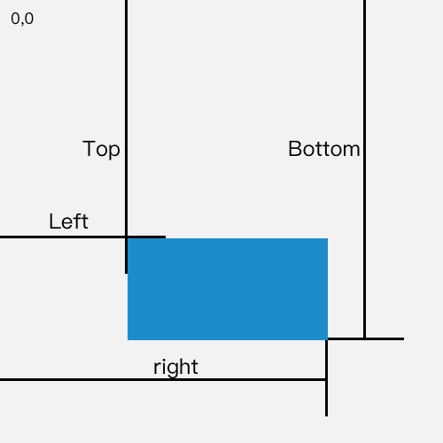
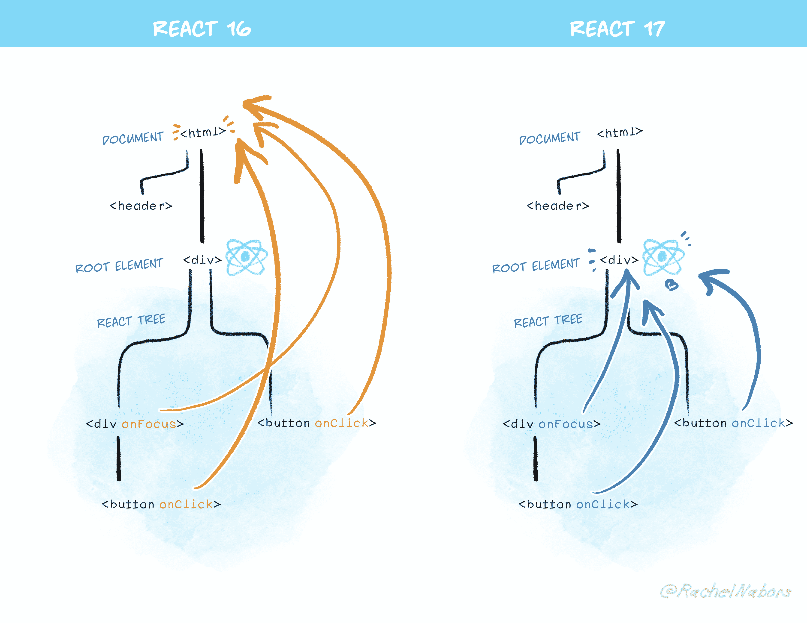

# 浏览器 DOM API

# 网站开发中，如何实现图片的懒加载

> 原文：[https://q.shanyue.tech/fe/dom/1.html](https://q.shanyue.tech/fe/dom/1.html)

更多描述

网站开发中，如何实现图片的懒加载，随着 web 技术的发展，他有没有一些更好的方案

Issue

欢迎在 Gtihub Issue 中回答此问题: [Issue 1(opens new window)](https://github.com/shfshanyue/Daily-Question/issues/1)

Author

回答者: [shfshanyue(opens new window)](https://github.com/shfshanyue)

懒加载，顾名思义，在当前网页，滑动页面到能看到图片的时候再加载图片

故问题拆分成两个：

1.  如何判断图片出现在了当前视口 （即如何判断我们能够看到图片）
2.  如何控制图片的加载

## 方案一: 位置计算 + 滚动事件 (Scroll) + DataSet API

### 如何判断图片出现在了当前视口

`clientTop`，`offsetTop`，`clientHeight` 以及 `scrollTop` 各种关于图片的高度作比对

这些高度都代表了什么意思？

这我以前有可能是知道的，那时候我比较单纯，喜欢死磕。我现在想通了，背不过的东西就不要背了

**所以它有一个问题：复杂琐碎不好理解！**

仅仅知道它静态的高度还不够，我们还需要知道动态的

**如何动态？监听 `window.scroll` 事件**

### 如何控制图片的加载

```
 
```

首先设置一个临时 Data 属性 `data-src`，控制加载时使用 `src` 代替 `data-src`，可利用 DataSet API 实现

```
img.src = img.datset.src 
```

## 方案二: getBoundingClientRect API + Scroll with Throttle + DataSet API

改进一下

### 如何判断图片出现在了当前视口

引入一个新的 API， **`Element.getBoundingClientRect()` 方法返回元素的大小及其相对于视口的位置。**



那如何判断图片出现在了当前视口呢，根据示例图示意，代码如下，这个就比较好理解了，就可以很容易地背会(就可以愉快地去面试了)。

```
// clientHeight 代表当前视口的高度
img.getBoundingClientRect().top < document.documentElement.clientHeight; 
```

**监听 `window.scroll` 事件也优化一下**

加个节流器，提高性能。工作中一般使用 `lodash.throttle` 就可以了，万能的 `lodash` 啊！

```
_.throttle(func, [(wait = 0)], [(options = {})]); 
```

参考 [什么是防抖和节流，他们的应用场景有哪些(opens new window)](https://github.com/shfshanyue/Daily-Question/issues/3)，或者[前端面试题(opens new window)](https://q.shanyue.tech/fe/js/3.html)

## 方案三: IntersectionObserver API + DataSet API

再改进一下

### 如何判断图片出现在了当前视口

**方案二使用的方法是: `window.scroll` 监听 `Element.getBoundingClientRect()` 并使用 `_.throttle` 节流**

**一系列组合动作太复杂了，于是浏览器出了一个三合一事件: `IntersectionObserver` API，一个能够监听元素是否到了当前视口的事件，一步到位！**

事件回调的参数是 [IntersectionObserverEntry(opens new window)](https://developer.mozilla.org/en-US/docs/Web/API/IntersectionObserverEntry) 的集合，代表关于是否在可见视口的一系列值

其中，`entry.isIntersecting` 代表目标元素可见

```
const observer = new IntersectionObserver((changes) => {
  // changes: 目标元素集合
  changes.forEach((change) => {
    // intersectionRatio
    if (change.isIntersecting) {
      const img = change.target;
      img.src = img.dataset.src;
      observer.unobserve(img);
    }
  });
});

observer.observe(img); 
```

**当然，`IntersectionObserver` 除了给图片做懒加载外，还可以对单页应用资源做预加载。**

如在 `next.js v9` 中，会对视口内的资源做预加载，可以参考 [next 9 production optimizations(opens new window)](https://nextjs.org/blog/next-9#production-optimizations)

```
<Link href="/about">  <a>关于山月</a>  </Link> 
```

## 方案四: LazyLoading 属性

浏览器觉得懒加载这事可以交给自己做，你们开发者加个属性就好了。实在是...！

```
 
```

不过目前浏览器兼容性不太好，关于 `loading` 属性的文章也可以查看 [Native image lazy-loading for the web!(opens new window)](https://addyosmani.com/blog/lazy-loading/)

Author

回答者: [hanhang123(opens new window)](https://github.com/hanhang123)

intersectionObserver

Author

回答者: [AgnesWY(opens new window)](https://github.com/AgnesWY)

比较单纯，喜欢死磕。我现在想通了，背不过的东西就不要背了！！！

Author

回答者: [Kiera569(opens new window)](https://github.com/Kiera569)

那时候我比较单纯，喜欢死磕。我现在想通了，背不过的东西就不要背了

Author

回答者: [haiifeng(opens new window)](https://github.com/haiifeng)

那时候我比较单纯，喜欢死磕。我现在想通了，背不过的东西就不要背了

Author

回答者: [hwb2017(opens new window)](https://github.com/hwb2017)

方案二的简单 Demo:

```
<!DOCTYPE html>
<html lang="en">
  <head>
    <meta charset="UTF-8" />
    <meta name="viewport" content="width=device-width, initial-scale=1.0" />
    <title>图片懒加载</title>
    <style> img {
        width: 100%;
        height: 600px;
      } </style>
  </head>
  <body>
    
    
    
    
    
    
    
    <script src="https://cdn.bootcdn.net/ajax/libs/lodash.js/4.17.20/lodash.js"></script>
    <script> const images = document.querySelectorAll("img");
      const lazyLoad = () => {
        images.forEach((item) => {
          // 触发条件为img元素的CSSOM对象到视口顶部的距离 < 100px + 视口高度，+100px为了提前触发图片加载
          if (
            item.getBoundingClientRect().top <
            document.documentElement.clientHeight + 100
          ) {
            if ("src" in item.dataset) {
              item.src = item.dataset.src;
            }
          }
        });
      };
      document.addEventListener("scroll", _.throttle(lazyLoad, 200)); </script>
  </body>
</html> 
```

Author

回答者: [shfshanyue(opens new window)](https://github.com/shfshanyue)

@hwb2017 可以在 codepen 里写一下，然后附个地址

Author

回答者: [hwb2017(opens new window)](https://github.com/hwb2017)

方案二的 Demo(CodePen) https://codepen.io/hwb2017/pen/BaZKeLa

Author

回答者: [Ha0ran2001(opens new window)](https://github.com/Ha0ran2001)

在 react hook 中要怎么应用？看到这篇文章https://juejin.cn/post/6844903768966856717，但是改成 useRef 不行，hook 不能在循环中使用

Author

回答者: [liucan233(opens new window)](https://github.com/liucan233)

方案一的实现[demo(opens new window)](https://codesandbox.io/s/manual-image-lazy-6zzhr?file=/index.html)，ScrollListener 类用于监听和处理滚动，在 Controller（实现 onEnterViewport 方法）元素出现在视窗内时调用 controller.onEnterViewport()，最后移除 controller。

```
<!DOCTYPE html>
<html lang="zh-CN">
  <head>
    <meta charset="UTF-8" />
    <meta name="viewport" content="width=device-width, initial-scale=1.0" />
    <meta http-equiv="X-UA-Compatible" content="ie=edge" />
    <title>offsetTop计算实现图片懒加载</title>
    <style> body {
        margin: 0;
      }
      .img {
        width: 100%;
        height: 100%;
        object-fit: cover;
        object-position: center;
      }

      .wrap {
        margin: 10px;
        display: inline-block;
        width: 480px;
        height: 270px;
      }

      .container {
        width: 100vw;
        height: 100vh;
        overflow: auto;
      }

      h1 {
        text-align: center;
      }

      .main {
        margin: 0;
        width: 2000px;
      } </style>
  </head>

  <body>
    <section class="container">
      <h1>请滚动页面查看效果</h1>
      <div class="main"></div>
    </section>
  </body>
  <script defer> "use strict";

    // 图片url列表
    const images = [
      "https://h2.ioliu.cn/bing/Latern2022_ZH-CN0112710917_640x480.jpg?imageslim",
      "https://h2.ioliu.cn/bing/MaldivesHeart_ZH-CN0032539727_640x480.jpg?imageslim",
      "https://h2.ioliu.cn/bing/FaceOff_ZH-CN9969100257_640x480.jpg?imageslim",
      "https://h2.ioliu.cn/bing/DarwinsArch_ZH-CN9740478501_640x480.jpg?imageslim",
      "https://h2.ioliu.cn/bing/TeaGardensMunnar_ZH-CN9587720369_640x480.jpg?imageslim",
      "https://h2.ioliu.cn/bing/SnowyBern_ZH-CN5472524801_640x480.jpg?imageslim",
      "https://h2.ioliu.cn/bing/SevenSistersCliffs_ZH-CN5362127173_640x480.jpg?imageslim",
      "https://h2.ioliu.cn/bing/SpeloncatoSnow_ZH-CN8115437163_640x480.jpg?imageslim",
      "https://h2.ioliu.cn/bing/WinterludeIce_ZH-CN7868524911_640x480.jpg?imageslim",
      "https://h2.ioliu.cn/bing/Oymyakon_ZH-CN7758768574_640x480.jpg?imageslim",
      "https://h2.ioliu.cn/bing/MexicoMonarchs_ZH-CN7526758236_640x480.jpg?imageslim",
      "https://h2.ioliu.cn/bing/WinterOlymics_ZH-CN7384614076_640x480.jpg?imageslim",
      "233",
    ];

    // 未加载时默认url
    const defaultUrl =
      "data:image/svg+xml;base64,PHN2ZyB0PSIxNjQ0ODk5MzI0NDgwIiBjbGFzcz0iaWNvbiIgdmlld0JveD0iMCAwIDEwMjQgMTAyNCIgdmVyc2lvbj0iMS4xIiB4bWxucz0iaHR0cDovL3d3dy53My5vcmcvMjAwMC9zdmciIHAtaWQ9IjIwOTMiIHdpZHRoPSIyMDAiIGhlaWdodD0iMjAwIj48cGF0aCBkPSJNODc0LjEgODEzLjc1SDE0OS45Yy0yMi4yMiAwLTQwLjIzLTE4LjAxLTQwLjIzLTQwLjIzVjI1MC40OWMwLTIyLjIyIDE4LjAxLTQwLjIzIDQwLjIzLTQwLjIzaDcyNC4yYzIyLjIyIDAgNDAuMjMgMTguMDEgNDAuMjMgNDAuMjN2NTIzLjAzYzAgMjIuMjEtMTguMDIgNDAuMjMtNDAuMjMgNDAuMjN6TTI4MC42NiAzMTAuODRjLTM4Ljg5IDAtNzAuNDEgMzEuNTItNzAuNDEgNzAuNDFzMzEuNTIgNzAuNDEgNzAuNDEgNzAuNDEgNzAuNDEtMzEuNTIgNzAuNDEtNzAuNDEtMzEuNTItNzAuNDEtNzAuNDEtNzAuNDF6IG01MTIuOTcgMTAwLjU4YzAtMjIuMjItMTguMDEtNDAuMjMtNDAuMjMtNDAuMjNoLTQwLjIzYy02Ni42NiAwLTEyMC43IDU0LjA0LTEyMC43IDEyMC43djQwLjIzYzAgMzMuMzMtMjcuMDIgNjAuMzUtNjAuMzUgNjAuMzUtMTguMjkgMC0zNC40Ny04LjMxLTQ1LjU0LTIxLjE1LTAuMDUtMC4wNi0wLjI1LTAuMjgtMC4yOS0wLjMzLTIyLjA5LTI0LjA1LTU5Ljc3LTM4Ljg2LTk0Ljk4LTM4Ljg2LTAuNDQgMC0wLjg0IDAuMTItMS4yOCAwLjEzbC0wLjA2LTAuMDZjLTg4LjI2IDAuNzMtMTU5LjU5IDcyLjQ0LTE1OS41OSAxNjAuODYgMCAyMi4yMiAxOC4wMSA0MC4yMyA0MC4yMyA0MC4yM0g3NTMuNGMyMi4yMiAwIDQwLjIzLTE4LjAxIDQwLjIzLTQwLjIzVjQxMS40MnoiIHAtaWQ9IjIwOTQiIGZpbGw9IiNjZGNkY2QiPjwvcGF0aD48L3N2Zz4=";

    // 加载错误时代替
    const errorUrl =
      "data:image/svg+xml;base64,PHN2ZyB0PSIxNjQ0ODk5ODEzMDQ1IiBjbGFzcz0iaWNvbiIgdmlld0JveD0iMCAwIDEwMjQgMTAyNCIgdmVyc2lvbj0iMS4xIiB4bWxucz0iaHR0cDovL3d3dy53My5vcmcvMjAwMC9zdmciIHAtaWQ9IjQ0OTEiIHdpZHRoPSIyMDAiIGhlaWdodD0iMjAwIj48cGF0aCBkPSJNNjQuMzgzMjM0IDUxMkM2NC4zODMyMzQgMjY0Ljc4NzgyOSAyNjQuNzg3ODI5IDY0LjM4MzIzNCA1MTIgNjQuMzgzMjM0IDc1OS4yMTIxNzEgNjQuMzgzMjM0IDk1OS42MTY3NjYgMjY0Ljc4NzgyOSA5NTkuNjE2NzY2IDUxMiA5NTkuNjE2NzY2IDc1OS4yMTIxNzEgNzU5LjIxMjE3MSA5NTkuNjE2NzY2IDUxMiA5NTkuNjE2NzY2IDI2NC43ODc4MjkgOTU5LjYxNjc2NiA2NC4zODMyMzQgNzU5LjIxMjE3MSA2NC4zODMyMzQgNTEyWk00NzQuMjMyMzc5IDc3MS4yNDUxMjRDNDc2LjQwODcxOCA3OTcuMzU1NTEyIDQ5MC41NTEzNzIgODEwLjQxMjEyMyA1MTYuNjYzMTc2IDgxMC40MTIxMjMgNTQyLjc3MzU2NCA4MTAuNDEyMTIzIDU1Ni45MTc2MzUgNzk3LjM1NTUxMiA1NTkuMDkyNTU2IDc3MS4yNDUxMjQgNTU2LjkxNzYzNSA3NDUuMTMzMzE5IDU0Mi43NzM1NjQgNzMwLjk5MDY2NiA1MTYuNjYzMTc2IDcyOC44MTQzMjcgNDkwLjU1MTM3MiA3MzAuOTkwNjY2IDQ3Ni40MDg3MTggNzQ1LjEzMzMxOSA0NzQuMjMyMzc5IDc3MS4yNDUxMjRaTTQ4MC43NTk5NzcgNjExLjMxNDc0OEM0ODAuNzU5OTc3IDYzNy40MjY1NTQgNDkyLjcyNzcxIDY1MC40ODE3NDcgNTE2LjY2MzE3NiA2NTAuNDgxNzQ3IDU0MC41OTcyMjYgNjUwLjQ4MTc0NyA1NTIuNTY0OTYgNjM3LjQyNjU1NCA1NTIuNTY0OTYgNjExLjMxNDc0OEw1NTIuNTY0OTYgMjQ5LjAyNDYxOEM1NTIuNTY0OTYgMjIyLjkxNDIzMSA1NDAuNTk3MjI2IDIwOS44NTc2MTkgNTE2LjY2MzE3NiAyMDkuODU3NjE5IDQ5Mi43Mjc3MSAyMDkuODU3NjE5IDQ4MC43NTk5NzcgMjIyLjkxNDIzMSA0ODAuNzU5OTc3IDI0OS4wMjQ2MThMNDgwLjc1OTk3NyA2MTEuMzE0NzQ4WiIgcC1pZD0iNDQ5MiIgZmlsbD0iI2NkY2RjZCI+PC9wYXRoPjwvc3ZnPg==";

    // 滚动监听和防抖
    class ScrollListener {
      entries = [];
      taskId = 0;

      constructor() {
        document.addEventListener("scroll", this.scrollDebounce.bind(this), {
          capture: true,
          passive: true,
        });
      }

      isInViewport(controller) {
        let offsetTop = 0,
          offsetLeft = 0,
          el = controller.el,
          scrollTop = 0,
          scrollLeft = 0,
          html = document.documentElement;
        while (el && el !== html) {
          offsetTop = offsetTop + el.offsetTop;
          offsetLeft = offsetLeft + el.offsetLeft;
          el = el.offsetParent;
        }

        el = controller.el;
        while (el) {
          scrollTop += el.scrollTop;
          scrollLeft += el.scrollLeft;
          el = el.parentElement;
        }
        offsetTop -= scrollTop;
        offsetLeft -= scrollLeft;

        el = controller.el;
        return (
          offsetTop < html.scrollTop + innerHeight &&
          offsetTop + el.clientHeight > html.scrollTop &&
          offsetLeft < html.scrollLeft + innerWidth &&
          offsetLeft + el.clientWidth > html.scrollLeft
        );
      }

      scrollDebounce() {
        if (this.taskId) {
          clearTimeout(this.taskId);
        }
        this.taskId = setTimeout(this.handleScroll.bind(this), 200);
      }

      addController(controller) {
        this.entries.push(controller);
        this.scrollDebounce();
      }

      handleScroll() {
        this.entries = this.entries.filter((controller) => {
          return !controller.blob;
        });
        this.entries.forEach((controller) => {
          if (this.isInViewport(controller)) {
            controller.onEnterViewport();
          }
        });
      }
    }

    // 图片控制对象
    class ImageController {
      img = "";
      blob = null;
      el = null;
      wrap = null;
      constructor(
        url = "",
        parent = document.body,
        className = "wrap",
        el = document.createElement("img")
      ) {
        el.src = defaultUrl;
        el.classList.add("img");

        this.el = el;
        this.img = url;

        this.wrap = document.createElement("div");
        this.wrap.classList.add(className);
        this.wrap.append(el);
        parent.append(this.wrap);
      }

      showImage() {
        const target = this;
        this.fetchImage().then(() => {
          target.el.src = this.blob;
        });
      }

      showLoading() {
        this.el.src = defaultUrl;
      }

      showError() {
        this.el.src = errorUrl;
      }

      onEnterViewport() {
        this.showImage();
      }

      async fetchImage() {
        if (typeof fetch !== "function") {
          this.thowError();
          throw new Error("浏览器不支持fetch接口");
        }

        // 如果已经加载过，直接返回
        if (!this.blob) {
          const target = this;
          return fetch(this.img)
            .then((res) => {
              if (res.status > 199 && res.status < 300) return res.blob();
              else return Promise.reject();
            })
            .then((blob) => {
              if (/image/.test(blob.type)) return URL.createObjectURL(blob);
              else return Promise.reject();
            })
            .then((url) => {
              target.blob = url;
            })
            .catch(() => {
              target.showError();
              throw new Error("URL不正确或MIME类型不正确");
            });
        }
      }
    }

    const scrollListener = new ScrollListener(),
      main = document.getElementsByClassName("main")[0],
      imageControllers = images.map((url) => {
        const controller = new ImageController(url, main);
        scrollListener.addController(controller);
      }); </script>
</html> 
```

Author

回答者: [LMW-lmw(opens new window)](https://github.com/LMW-lmw)

方案二有那么一点点抖动，这里重新实现了一下

```
<!DOCTYPE html>
<html lang="en">
  <head>
    <meta charset="UTF-8" />
    <meta http-equiv="X-UA-Compatible" content="IE=edge" />
    <meta name="viewport" content="width=device-width, initial-scale=1.0" />
    <title>Document</title>
    <style> * {
        margin: 0px;
        padding: 0px;
      }

      body {
        margin: 0px;
        padding: 0px;
      }

      img {
        display: block;
      } </style>
  </head>

  <body>
    <div class="demo">
      
      
      
      
      
    </div>
  </body>
  <script> const demo = document.querySelectorAll("img");
    function lazy() {
      for (let elem of demo) {
        if (
          elem.getBoundingClientRect().top <
          document.documentElement.clientHeight
        ) {
          if (elem.dataset.src && elem.src == "") {
            elem.src = elem.dataset.src;
          }
        }
      }
    }
    function throttle(t, fn) {
      let time;
      return function () {
        if (!time) {
          time = setTimeout(() => {
            time = null;
            fn();
          }, t);
        }
      };
    }
    lazy();
    window.addEventListener("scroll", throttle(500, lazy)); </script>
</html> 
```

# 如何设置一个 cookie

> 原文：[https://q.shanyue.tech/fe/dom/161.html](https://q.shanyue.tech/fe/dom/161.html)

Issue

欢迎在 Gtihub Issue 中回答此问题: [Issue 161(opens new window)](https://github.com/shfshanyue/Daily-Question/issues/161)

Author

回答者: [SageSanyue(opens new window)](https://github.com/SageSanyue)

HTTP Cookie（也叫 Web Cookie 或浏览器 Cookie）是服务器发送到用户浏览器并保存在本地的一小块数据，它会在浏览器下次向同一服务器再发起请求时被携带并发送到服务器上。通常，它用于告知服务端两个请求是否来自同一浏览器，如保持用户的登录状态。Cookie 使基于无状态的 HTTP 协议记录稳定的状态信息成为了可能。

服务端是通过 setCookie 的响应头来设置 cookie 的，要设置多个 cookie 时，得多写几个 setCookie。服务器如果希望在浏览器保存 Cookie，就要在 HTTP 回应的头信息里面，放置一个 Set-Cookie 字段。

前端使用 document.cookie 属性来读写当前网页的 Cookie。写入的时候，Cookie 的值必须写成 key=value 的形式。

Cookie 曾一度用于客户端数据的存储，因当时并没有其它合适的存储办法而作为唯一的存储手段，但现在随着现代浏览器开始支持各种各样的存储方式，Cookie 渐渐被淘汰。由于服务器指定 Cookie 后，浏览器的每次请求都会携带 Cookie 数据，会带来额外的性能开销（尤其是在移动环境下）。新的浏览器 API 已经允许开发者直接将数据存储到本地，如使用 Web storage API （本地存储和会话存储）或 IndexedDB 。 参考资料： [MDN(opens new window)](https://developer.mozilla.org/zh-CN/docs/Web/HTTP/Cookies) [把 cookie 聊清楚(opens new window)](https://juejin.im/post/59d1f59bf265da06700b0934) [阮一峰 JavaScript 教程(opens new window)](https://javascript.ruanyifeng.com/bom/cookie.html)

# 如何删除一个 cookie

> 原文：[https://q.shanyue.tech/fe/dom/162.html](https://q.shanyue.tech/fe/dom/162.html)

Issue

欢迎在 Gtihub Issue 中回答此问题: [Issue 162(opens new window)](https://github.com/shfshanyue/Daily-Question/issues/162)

Author

回答者: [shfshanyue(opens new window)](https://github.com/shfshanyue)

通过把该 `cookie` 的过期时间改为过去时即可删除成功，具体操作的话可以通过操作两个字段来完成

1.  `max-age`: 将要过期的最大秒数，设置为 `-1` 即可删除
2.  `expires`: 将要过期的绝对时间，存储到 `cookies` 中需要通过 `date.toUTCString()` 处理，设置为过期时间即可删除

很明显，`max-age` 更为简单，以下代码可在命令行控制台中进行测试

```
// max-age 设置为 -1 即可成功
document.cookie = "a=3; max-age=-1"; 
```

```
> document.cookie
< ""

> document.cookie = 'a=3'
< "a=3"

> document.cookie
< "a=3"

// 把该字段的 max-age 设置为 -1
> document.cookie = 'a=3; max-age=-1'
< "a=3; max-age=-1"

// 删除成功
> document.cookie
< "" 
```

同时，也可以使用最新关于 cookie 操作的 API: [CookieStore API(opens new window)](https://developer.mozilla.org/en-US/docs/Web/API/CookieStore) 其中的 `cookieStore.delete(name)` 删除某个 cookie

Author

回答者: [Carrie999(opens new window)](https://github.com/Carrie999)

前端一般不操作，server 来操作

# 如何判断当前环境是移动端还是 PC 端

> 原文：[https://q.shanyue.tech/fe/dom/211.html](https://q.shanyue.tech/fe/dom/211.html)

Issue

欢迎在 Gtihub Issue 中回答此问题: [Issue 211(opens new window)](https://github.com/shfshanyue/Daily-Question/issues/211)

Author

回答者: [shfshanyue(opens new window)](https://github.com/shfshanyue)

判断 `navigator.userAgent`，对于 Android/iPhone 可以匹配以下正则

```
const appleIphone = /iPhone/i;
const appleIpod = /iPod/i;
const appleTablet = /iPad/i;
const androidPhone = /\bAndroid(?:.+)Mobile\b/i; // Match 'Android' AND 'Mobile'
const androidTablet = /Android/i; 
```

当然，不要重复造轮子，推荐一个库: [https://github.com/kaimallea/isMobile(opens new window)](https://github.com/kaimallea/isMobile)

```
import isMobile from "ismobilejs";

const mobile = isMobile(); 
```

Author

回答者: [SageSanyue(opens new window)](https://github.com/SageSanyue)

```
isPc() {
    var userAgentInfo = navigator.userAgent
    var Agents = new Array(
      'Android',
      'iPhone',
      'SymbianOS',
      'Windows Phone',
      'iPad',
      'iPod'
    )
    var flag = true
    for (var v = 0; v < Agents.length; v++) {
      if (userAgentInfo.indexOf(Agents[v]) > 0) {
        flag = false
        break
      }
    }
    return flag
  } 
```

嘿嘿照搬了一段商用的

Author

回答者: [shfshanyue(opens new window)](https://github.com/shfshanyue)

@SageSanyue 直接用 `Array.prototype.some` 就简单多了

Author

回答者: [SageSanyue(opens new window)](https://github.com/SageSanyue)

> @SageSanyue 直接用 `Array.prototype.some` 就简单多了

确实噢 😯 我完全没动我的 zhu 脑子:(

```
isPc() {
    var userAgentInfo = navigator.userAgent
    var Agents = new Array(
      'Android',
      'iPhone',
      'SymbianOS',
      'Windows Phone',
      'iPad',
      'iPod'
    )
    var flag = true
    flag = !Agents.some((ele) => {
        return userAgentInfo.indexOf(ele) > 0
    })
    return flag
  } 
```

# input 中监听值的变化是在监听什么事件

> 原文：[https://q.shanyue.tech/fe/dom/215.html](https://q.shanyue.tech/fe/dom/215.html)

Issue

欢迎在 Gtihub Issue 中回答此问题: [Issue 215(opens new window)](https://github.com/shfshanyue/Daily-Question/issues/215)

Author

回答者: [shfshanyue(opens new window)](https://github.com/shfshanyue)

可以**实时**监听值的变化的事件有以下几种

*   keypress
*   keydown
*   keyup
*   input

注: `onChange` 无法做到实时监听，因为 onChange 需要失去焦点才能触发

Author

回答者: [sunhua-2217(opens new window)](https://github.com/sunhua-2217)

oninput 不用考虑是否失去焦点，不管 js 操作还是键盘鼠标手动操作，只要 HTML 元素属性发生改变即可立即捕获到

Author

回答者: [qixMan(opens new window)](https://github.com/qixMan)

**onchange:**

**Supported HTML tags:**

```
<input type="checkbox">, <input type="file">, <input type="password">, <input type="radio">, <input type="range">, <input type="search">, <input type="text">, <select> and <textarea> 
```

The onchange attribute fires the moment when the value of the element is changed.

Tip: This event is similar to the oninput event. The difference is that the oninput event occurs immediately after the value of an element has changed, **while onchange occurs when the element loses focus**. The other difference is that the onchange event also works on <select>elements.</select>

Author

回答者: [imondo(opens new window)](https://github.com/imondo)

@CaiyueDamowang 测试了好像不行

Author

回答者: [cy-98(opens new window)](https://github.com/cy-98)

> @CaiyueDamowang 测试了好像不行

嗯，不行。。 在 html 标签中 onchange 可以在失去焦点触发

Author

回答者: [XFwilliamii(opens new window)](https://github.com/XFwilliamii)

低版本浏览器 <input onpropertychange="onPropertyChange(event)"> function onPropertyChange(event){console.log(event.srcElement.value)}

ie10 以上 <input oninput="onInput(event)"> function onInput(event){console.log(event.srcElement.value)}

Author

回答者: [w1687021088(opens new window)](https://github.com/w1687021088)

input 事件

# 什么是跨域，如何解决跨域问题

> 原文：[https://q.shanyue.tech/fe/dom/216.html](https://q.shanyue.tech/fe/dom/216.html)

Issue

欢迎在 Gtihub Issue 中回答此问题: [Issue 216(opens new window)](https://github.com/shfshanyue/Daily-Question/issues/216)

Author

回答者: [shfshanyue(opens new window)](https://github.com/shfshanyue)

## 跨域

**协议**，**域名**，**端口**，三者有一不一样，就是跨域

案例一：`www.baidu.com` 与 `zhidao.baidu.com` 是跨域

## 如何解决跨域

目前有两种最常见的解决方案：

1.  CORS，在服务器端设置几个响应头，如 `Access-Control-Allow-Origin: *`
2.  Reverse Proxy，在 nginx/traefik/haproxy 等反向代理服务器中设置为同一域名
3.  JSONP，详解见 [JSONP 的原理是什么，如何实现(opens new window)](https://github.com/shfshanyue/Daily-Question/issues/447)

附代码: nginx 关于跨域的配置

```
server {
  listen 80;
  server_name shanyue.tech;

  location / {
    # 避免非root路径404
    try_files $uri $uri/ /index.html;
  }

  # 解决跨域
  location /api {
    # 或者是 http://localhost:8080
    proxy_pass http://api.shanyue.tech;
  }
} 
```

# CSP 是干什么用的了

> 原文：[https://q.shanyue.tech/fe/dom/269.html](https://q.shanyue.tech/fe/dom/269.html)

Issue

欢迎在 Gtihub Issue 中回答此问题: [Issue 269(opens new window)](https://github.com/shfshanyue/Daily-Question/issues/269)

Author

回答者: [DoubleRayWang(opens new window)](https://github.com/DoubleRayWang)

http://www.ruanyifeng.com/blog/2016/09/csp.html

Author

回答者: [shfshanyue(opens new window)](https://github.com/shfshanyue)

`CSP` **只允许加载指定的脚本及样式**，**最大限度地防止 `XSS` 攻击**，是解决 XSS 的最优解。CSP 的设置根据加载页面时 http 的响应头 `Content Security Policy` 在服务器端控制。

1.  外部脚本可以通过指定域名来限制：**`Content-Security-Policy: script-src 'self'`**，`self` 代表只加载当前域名
2.  如果网站必须加载内联脚本 (inline script) ，则可以提供一个 `nonce` 才能执行脚本，攻击者则无法注入脚本进行攻击。**`Content-Security-Policy: script-src 'nonce-xxxxxxxxxxxxxxxxxx'`**

通过 `devtools -> network` 可见 github 的 CSP 配置如下：

```
Content-Security-Policy: default-src 'none';
  base-uri 'self';
  block-all-mixed-content;
  connect-src 'self' uploads.github.com www.githubstatus.com collector.githubapp.com api.github.com www.google-analytics.com github-cloud.s3.amazonaws.com github-production-repository-file-5c1aeb.s3.amazonaws.com github-production-upload-manifest-file-7fdce7.s3.amazonaws.com github-production-user-asset-6210df.s3.amazonaws.com cdn.optimizely.com logx.optimizely.com/v1/events wss://alive.github.com;
  font-src github.githubassets.com;
  form-action 'self' github.com gist.github.com;
  frame-ancestors 'none';
  frame-src render.githubusercontent.com;
  img-src 'self' data: github.githubassets.com identicons.github.com collector.githubapp.com github-cloud.s3.amazonaws.com *.githubusercontent.com;
  manifest-src 'self';
  media-src 'none';
  script-src github.githubassets.com;
  style-src 'unsafe-inline' github.githubassets.com;
  worker-src github.com/socket-worker.js gist.github.com/socket-worker.js 
```

## 相关链接

*   [Content Security Policy 入门教程 - 阮一峰(opens new window)](http://www.ruanyifeng.com/blog/2016/09/csp.html)
*   [Content Security Policy - w3(opens new window)](https://www.w3.org/TR/CSP3/#directive-form-action)

Author

回答者: [zzetao(opens new window)](https://github.com/zzetao)

### Content Security Policy (CSP)

**介绍：**

1.  解决 XSS 最优办法
2.  可以设置信任域名才可以访问 script / audio / video / image ...

**防止 XSS 例子：** 攻击者通过 恶意脚本(假设有执行外部脚本) 注入到系统内，显示给访问用户，以此来获取用户信息 我们可以通过 CSP 来设置信任域名才可以执行 .js 脚本。

**如何设置：**

1.  HTTP 请求头
2.  Meta 标签

MDN：https://developer.mozilla.org/zh-CN/docs/Web/HTTP/CSP

兼容性：IE >= 10

# prefetch 与 preload 的区别是什么

> 原文：[https://q.shanyue.tech/fe/dom/286.html](https://q.shanyue.tech/fe/dom/286.html)

Issue

欢迎在 Gtihub Issue 中回答此问题: [Issue 286(opens new window)](https://github.com/shfshanyue/Daily-Question/issues/286)

Author

回答者: [shfshanyue(opens new window)](https://github.com/shfshanyue)

```
<link rel="prefetch" href="style.css" as="style" />
<link rel="preload" href="main.js" as="script" /> 
```

1.  `preload` 加载当前路由必需资源，优先级高。一般对于 Bundle Spliting 资源与 Code Spliting 资源做 preload
2.  `prefetch` 优先级低，在浏览器 idle 状态时加载资源。一般用以加载其它路由资源，如当页面出现 Link，可 prefetch 当前 Link 的路由资源。（next.js 默认会对 link 做懒加载+prefetch，即当某条 Link 出现页面中，即自动 prefetch 该 Link 指向的路由资源

> prefetch - Prefetch the page in the background. Defaults to true. Any <link> that is in the viewport (initially or through scroll) will be preloaded.

更多信息可参考以下链接：

*   [用 preload 预加载页面资源(opens new window)](https://juejin.im/post/5a7fb09bf265da4e8e785c38)
*   [Using Preload and Prefetch in Your HTML to Load Assets(opens new window)](https://alligator.io/html/preload-prefetch/)

# fetch 中 crendentials 指什么意思，可以取什么值

> 原文：[https://q.shanyue.tech/fe/dom/297.html](https://q.shanyue.tech/fe/dom/297.html)

Issue

欢迎在 Gtihub Issue 中回答此问题: [Issue 297(opens new window)](https://github.com/shfshanyue/Daily-Question/issues/297)

Author

回答者: [shfshanyue(opens new window)](https://github.com/shfshanyue)

`credentials` 指在使用 `fetch` 发送请求时是否应当发送 `cookie`

*   `omit`: 从不发送 `cookie`.
*   `same-origin`: 同源时发送 `cookie` (浏览器默认值)
*   `include`: 同源与跨域时都发送 `cookie`

# 当 cookie 没有设置 maxage 时，cookie 会存在多久

> 原文：[https://q.shanyue.tech/fe/dom/313.html](https://q.shanyue.tech/fe/dom/313.html)

Issue

欢迎在 Gtihub Issue 中回答此问题: [Issue 313(opens new window)](https://github.com/shfshanyue/Daily-Question/issues/313)

Author

回答者: [lznbuild(opens new window)](https://github.com/lznbuild)

不设置 max-age 和 expires，此 cookie 就是会话级别的，浏览器关闭就没了

# 在浏览器中如何监听剪切板中内容

> 原文：[https://q.shanyue.tech/fe/dom/315.html](https://q.shanyue.tech/fe/dom/315.html)

Issue

欢迎在 Gtihub Issue 中回答此问题: [Issue 315(opens new window)](https://github.com/shfshanyue/Daily-Question/issues/315)

Author

回答者: [shfshanyue(opens new window)](https://github.com/shfshanyue)

通过 `Clipboard API` 可以获取剪切板中内容，但需要获取到 `clipboard-read` 的权限，以下是关于读取剪贴板内容的代码：

```
// 是否能够有读取剪贴板的权限
// result.state == "granted" || result.state == "prompt"
const result = await navigator.permissions.query({ name: "clipboard-read" });

// 获取剪贴板内容
const text = await navigator.clipboard.readText(); 
```

> 注: 该方法在 `devtools` 中不生效

相关问题: [【Q019】如何实现选中复制的功能(opens new window)](https://github.com/shfshanyue/Daily-Question/issues/20)

# js 动画和 css 动画那个性能比较好

> 原文：[https://q.shanyue.tech/fe/dom/367.html](https://q.shanyue.tech/fe/dom/367.html)

Issue

欢迎在 Gtihub Issue 中回答此问题: [Issue 367(opens new window)](https://github.com/shfshanyue/Daily-Question/issues/367)

Author

回答者: [wuli-collov(opens new window)](https://github.com/wuli-collov)

能用 css 最好用 css 吧，js 比较耗性能

# 简单介绍 requestIdleCallback 及使用场景

> 原文：[https://q.shanyue.tech/fe/dom/379.html](https://q.shanyue.tech/fe/dom/379.html)

Issue

欢迎在 Gtihub Issue 中回答此问题: [Issue 379(opens new window)](https://github.com/shfshanyue/Daily-Question/issues/379)

Author

回答者: [shfshanyue(opens new window)](https://github.com/shfshanyue)

`requestIdleCallback` 维护一个队列，将在浏览器空闲时间内执行。它属于 [Background Tasks API(opens new window)](https://developer.mozilla.org/zh-CN/docs/Web/API/Background_Tasks_API)，你可以使用 `setTimeout` 来模拟实现

```
window.requestIdleCallback =
  window.requestIdleCallback ||
  function (handler) {
    let startTime = Date.now();

    return setTimeout(function () {
      handler({
        didTimeout: false,
        timeRemaining: function () {
          return Math.max(0, 50.0 - (Date.now() - startTime));
        },
      });
    }, 1);
  }; 
```

以上实现过于复杂以及细节化，也可以像 [swr(opens new window)](https://github.com/vercel/swr) 一样做一个简单的模拟实现，以下代码见 [https://github.com/vercel/swr/blob/8670be8072b0c223bc1c040deccd2e69e8978aad/src/use-swr.ts#L33(opens new window)](https://github.com/vercel/swr/blob/8670be8072b0c223bc1c040deccd2e69e8978aad/src/use-swr.ts#L33)

```
const rIC = window["requestIdleCallback"] || ((f) => setTimeout(f, 1)); 
```

在 `rIC` 中执行任务时需要注意以下几点：

1.  执行重计算而非紧急任务
2.  空闲回调执行时间应该小于 50ms，最好更少
3.  空闲回调中不要操作 DOM，因为它本来就是利用的重排重绘后的间隙空闲时间，重新操作 DOM 又会造成重排重绘

React 的时间分片便是基于类似 `rIC` 而实现，然而因为 `rIC` 的兼容性及 50ms 流畅问题，React 自制了一个实现: [scheduler(opens new window)](https://github.com/facebook/react/tree/master/packages/scheduler)

[use-swr(opens new window)](https://github.com/vercel/swr) 中进行资源的 `revalidate` 时，也是通过 `rIC` 来提高性能

## 参考

**强烈推荐 MDN 与 w3c 上的两篇介绍**

*   [Background Tasks API - MDN(opens new window)](https://developer.mozilla.org/zh-CN/docs/Web/API/Background_Tasks_API)
*   [requestIdleCallback - W3C(opens new window)](https://w3c.github.io/requestidlecallback/#idle-periods)

# 如何找到当前页面出现次数最多的 HTML 标签

> 原文：[https://q.shanyue.tech/fe/dom/418.html](https://q.shanyue.tech/fe/dom/418.html)

Issue

欢迎在 Gtihub Issue 中回答此问题: [Issue 418(opens new window)](https://github.com/shfshanyue/Daily-Question/issues/418)

Author

回答者: [shfshanyue(opens new window)](https://github.com/shfshanyue)

这是一道前端基础与编程功底具备的面试题：

*   如果你前端基础强会了解 `document.querySelector(*)` 能够列出页面内所有标签
*   如果你编程能力强能够用**递归**/**正则**快速实现同等的效果

有三种 API 可以列出页面所有标签：

1.  `document.querySelector('*')`，标准规范实现
2.  `$$('*')`，devtools 实现
3.  `document.all`，非标准规范实现

```
> document.querySelectorAll('*')
< NodeList(593) [html, head, meta, meta, meta, meta, meta, meta, meta, title, link#favicon, link, link#MainCss, link#mobile-style, link, link, link, script, script, script, script, script, script, script, link, script, link, link, script, input#_w_brink, body, a, div#home, div#header, div#blogTitle, a#lnkBlogLogo, img#blogLogo, h1, a#Header1_HeaderTitle.headermaintitle.HeaderMainTitle, h2, div#navigator, ul#navList, li, a#blog_nav_sitehome.menu, li, a#blog_nav_myhome.menu, li, a#blog_nav_newpost.menu, li, a#blog_nav_contact.menu, li, a#blog_nav_rss.menu, li, a#blog_nav_admin.menu, div.blogStats, span#stats_post_count, span#stats_article_count, span#stats-comment_count, div#main, div#mainContent, div.forFlow, div#post_detail, div#topics, div.post, h1.postTitle, a#cb_post_title_url.postTitle2.vertical-middle, span, div.clear, div.postBody, div#cnblogs_post_body.blogpost-body, p, p, strong, p, p, p, strong, div.cnblogs_code, pre, span, span, span, span, span, p, span, strong, pre, strong, span, strong, br, br, br, div.cnblogs_code, pre, span, span, p, p, …]
[0 … 99]
[100 … 199]
[200 … 299]
[300 … 399]
[400 … 499]
[500 … 592]
__proto__: NodeList 
```

使用 `document.querySelectorAll` 实现如下

```
// 实现一个 maxBy 方便找出出现次数最多的 HTML 标签
const maxBy = (list, keyBy) =>
  list.reduce((x, y) => (keyBy(x) > keyBy(y) ? x : y));

function getFrequentTag() {
  const tags = [...document.querySelectorAll("*")]
    .map((x) => x.tagName)
    .reduce((o, tag) => {
      o[tag] = o[tag] ? o[tag] + 1 : 1;
      return o;
    }, {});
  return maxBy(Object.entries(tags), (tag) => tag[1]);
} 
```

使用 `element.children` 递归迭代如下 (最终结果多一个 document)

```
function getAllTags(el = document) {
  const children = Array.from(el.children).reduce(
    (x, y) => [...x, ...getAllTags(y)],
    []
  );
  return children;
}

// 或者通过 flatMap 实现
function getAllTags(el = document) {
  const children = Array.prototype.flatMap.call(el.children, (x) =>
    getAllTags(x)
  );
  return [el, ...children];
} 
```

如果你已经快速答了上来，那么还有两道拓展的面试题在等着你

1.  如何找到当前页面出现次数前三多的 HTML 标签
2.  如过多个标签出现次数同样多，则取多个标签

Author

回答者: [Harry3014(opens new window)](https://github.com/Harry3014)

使用`document.querySelectorAll`实现如下（包括可能次数一样多的标签）

```
function getMostFrequentTag() {
  const counter = {};

  document.querySelectorAll("*").forEach((element) => {
    counter[element.tagName] = counter[element.tagName]
      ? counter[element.tagName] + 1
      : 1;
  });

  const orderedTags = Object.entries(counter).sort((tag1, tag2) => {
    if (tag1[1] < tag2[1]) {
      return 1;
    }
    if (tag1[1] > tag2[1]) {
      return -1;
    }
    return 0;
  });

  const result = [];
  for (const tag of orderedTags) {
    if (tag[1] < orderedTags[0][1]) {
      break;
    }
    result.push(tag[0]);
  }
  return result;
} 
```

Author

回答者: [Harry3014(opens new window)](https://github.com/Harry3014)

使用`Element.children`递归实现如下

```
function getMostFrequentTag() {
  const counter = {};

  const traversalElement = (parent) => {
    if (parent.tagName !== undefined) {
      counter[parent.tagName] = counter[parent.tagName]
        ? counter[parent.tagName] + 1
        : 1;
    }
    const children = parent.children;
    for (let i = 0, length = children.length; i < length; i++) {
      traversalElement(children[i]);
    }
  };

  traversalElement(document);

  const orderedTags = Object.entries(counter).sort((tag1, tag2) => {
    if (tag1[1] < tag2[1]) {
      return 1;
    }
    if (tag1[1] > tag2[1]) {
      return -1;
    }
    return 0;
  });

  const result = [];
  for (const tag of orderedTags) {
    if (tag[1] < orderedTags[0][1]) {
      break;
    }
    result.push(tag[0]);
  }
  return result;
} 
```

Author

回答者: [hwb2017(opens new window)](https://github.com/hwb2017)

[codepen demo(opens new window)](https://codepen.io/hwb2017/pen/vYZPPVw)

```
const allElements = document.querySelectorAll("*");
const elementFrequency = Array.from(allElements).reduce((a, b) => {
  a[b.tagName] = a[b.tagName] ? a[b.tagName] + 1 : 1;
  return a;
}, {});
console.log(elementFrequency);

const sortedElementFrequency = Object.entries(elementFrequency).sort(
  (a, b) => b[1] - a[1]
);
console.log(sortedElementFrequency);

const copiedElementFrequency = JSON.parse(
  JSON.stringify(sortedElementFrequency)
);
const mergedElementFrequency = copiedElementFrequency.reduce((a, b) => {
  if (a.length === 0) {
    a.push(b);
    return a;
  }
  let lastItem = a[a.length - 1];
  if (lastItem[1] === b[1]) {
    // if (Array.isArray(lastItem[0])) {
    //   lastItem[0].push(b[0])
    // } else {
    //   lastItem[0] = [lastItem[0], b[0]]
    // }
    lastItem[0] = Array.isArray(lastItem[0])
      ? lastItem[0].concat([b[0]])
      : [lastItem[0], b[0]];
  } else {
    a.push(b);
  }
  return a;
}, []);
console.log(mergedElementFrequency); 
```

# 什么是层叠上下文 (stacking context)

> 原文：[https://q.shanyue.tech/fe/dom/432.html](https://q.shanyue.tech/fe/dom/432.html)

Issue

欢迎在 Gtihub Issue 中回答此问题: [Issue 432(opens new window)](https://github.com/shfshanyue/Daily-Question/issues/432)

Author

回答者: [shfshanyue(opens new window)](https://github.com/shfshanyue)

> 我们假定用户正面向（浏览器）视窗或网页，而 HTML 元素沿着其相对于用户的一条虚构的 z 轴排开，层叠上下文就是对这些 HTML 元素的一个三维构想。众 HTML 元素基于其元素属性按照优先级顺序占据这个空间。

其中，`z-index` 会影响这个层级的优先性

Author

回答者: [haotie1990(opens new window)](https://github.com/haotie1990)

有一个问题，`z-index:999`，是不是一定可以展示出来？

但是：

普通元素的层叠水平优先由层叠上下文决定，因此，层叠水平的比较只有在当前层叠上下文元素中才有意义

# 如何把 DOM 转化为图片

> 原文：[https://q.shanyue.tech/fe/dom/437.html](https://q.shanyue.tech/fe/dom/437.html)

更多描述

可参考 npm package

1.  [html2canvas(opens new window)](https://html2canvas.hertzen.com/): Screenshots with JavaScript
2.  [dom-to-image(opens new window)](https://github.com/tsayen/dom-to-image): Generates an image from a DOM node using HTML5 canvas

Issue

欢迎在 Gtihub Issue 中回答此问题: [Issue 437(opens new window)](https://github.com/shfshanyue/Daily-Question/issues/437)

Author

回答者: [markgong-gd(opens new window)](https://github.com/markgong-gd)

https://www.zhangxinxu.com/study/201708/svg-foreignobject-dom-to-image.html 看到这样一篇文章

Author

回答者: [shfshanyue(opens new window)](https://github.com/shfshanyue)

DOM -> SVG -> Canvas -> JPEG/PNG

Author

回答者: [Kiera569(opens new window)](https://github.com/Kiera569)

核心 foreignObject

# 浏览器的剪切板中如何监听复制事件

> 原文：[https://q.shanyue.tech/fe/dom/444.html](https://q.shanyue.tech/fe/dom/444.html)

Issue

欢迎在 Gtihub Issue 中回答此问题: [Issue 444(opens new window)](https://github.com/shfshanyue/Daily-Question/issues/444)

Author

回答者: [nishuzumi(opens new window)](https://github.com/nishuzumi)

在 HTML 元素上

```
<input oncopy="cb" /> 
```

在 JS 中获取具体元素

```
document.querySelector("p").oncopy = cb;
document.oncopy = cb; 
```

或者

```
document.querySelector("p").addEventListener("copy", cb);
document.addEventListener("copy", cb); 
```

# JSONP 的原理是什么，如何实现

> 原文：[https://q.shanyue.tech/fe/dom/447.html](https://q.shanyue.tech/fe/dom/447.html)

Issue

欢迎在 Gtihub Issue 中回答此问题: [Issue 447(opens new window)](https://github.com/shfshanyue/Daily-Question/issues/447)

Author

回答者: [shfshanyue(opens new window)](https://github.com/shfshanyue)

摘自山月的博客，原文地址: [https://shanyue.tech/code/jsonp/(opens new window)](https://shanyue.tech/code/jsonp/)

## 一个正常的请求: JSON

正常发请求时，`curl` 示例:

```
$ curl https://shanyue.tech/api/user?id=100

{
  "id": 100,
  "name": "shanyue",
  "wechat": "xxxxx",
  "phone": "183xxxxxxxx"
} 
```

使用 `fetch` 发送请求，示例:

```
const data = await fetch("https://shanyue.tech/api/user?id=100", {
  headers: {
    "content-type": "application/json",
  },
  method: "GET",
}).then((res) => res.json()); 
```

请求数据后，使用一个函数来处理数据

```
handleData(data); 
```

## 一个 JSONP 请求

`JSONP`，全称 `JSON with Padding`，为了解决跨域的问题而出现。虽然它只能处理 GET 跨域，虽然现在基本上都使用 CORS 跨域，但仍然要知道它，毕竟**面试会问**。

`JSONP` 基于两个原理:

1.  动态创建 `script`，使用 `script.src` 加载请求跨过跨域
2.  `script.src` 加载的脚本内容为 JSONP: 即 `PADDING(JSON)` 格式

从上可知，使用 `JSONP` 跨域同样需要服务端的支持。`curl` 示例

```
$ curl https://shanyue.tech/api/user?id=100&callback=padding

padding({
  "id": 100,
  "name": "shanyue",
  "wechat": "xxxxx",
  "phone": "183xxxxxxxx"
}) 
```

对于正常的请求有何不同一目了然: **多了一个 callback=padding, 并且响应数据被 padding 包围**，这就是 JSONP

**那请求数据后，如何处理数据呢？此时的 padding 就是处理数据的函数**。我们只需要在前端实现定义好 padding 函数即可

```
window.padding = handleData; 
```

基于以上两个原理，这里实现一个简单 jsonp 函数：

```
function jsonp_simple({ url, onData, params }) {
  const script = document.createElement("script");

  // 一、默认 callback 函数为 padding
  script.src = `${url}?${stringify({ callback: "padding", ...params })}`;

  // 二、使用 onData 作为 window.padding 函数，接收数据
  window["padding"] = onData;

  // 三、动态加载脚本
  document.body.appendChild(script);
}

// 发送 JSONP 请求
jsonp_simple({
  url: "http://localhost:10010",
  params: { id: 10000 },
  onData(data) {
    console.log("Data:", data);
  },
}); 
```

此时会有一个问题: **window.padding 函数会污染全局变量，如果有多个 JSONP 请求发送如何处理？**

**使 jsonp 的回调函数名作为一个随机变量，避免冲突**，代码如下

```
function jsonp({ url, onData, params }) {
  const script = document.createElement("script");

  // 一、为了避免全局污染，使用一个随机函数名
  const cbFnName = `JSONP_PADDING_${Math.random().toString().slice(2)}`;

  // 二、默认 callback 函数为 cbFnName
  script.src = `${url}?${stringify({ callback: cbFnName, ...params })}`;

  // 三、使用 onData 作为 cbFnName 回调函数，接收数据
  window[cbFnName] = onData;

  document.body.appendChild(script);
}

// 发送 JSONP 请求
jsonp({
  url: "http://localhost:10010",
  params: { id: 10000 },
  onData(data) {
    console.log("Data:", data);
  },
}); 
```

## 服务器端代码

`JSONP` 需要服务端进行配合，返回 `JSON With Padding` 数据，代码如下:

```
const http = require("http");
const url = require("url");
const qs = require("querystring");

const server = http.createServer((req, res) => {
  const { pathname, query } = url.parse(req.url);
  const params = qs.parse(query);

  const data = { name: "shanyue", id: params.id };

  if (params.callback) {
    // 服务端将要返回的字符串
    str = `${params.callback}(${JSON.stringify(data)})`;
    res.end(str);
  } else {
    res.end();
  }
});

server.listen(10010, () => console.log("Done")); 
```

## 完整代码附录

完整代码可见[山月博客的 github 仓库(opens new window)](https://github.com/shfshanyue/blog/tree/master/code): [https://github.com/shfshanyue/blog/tree/master/code/jsonp/(opens new window)](https://github.com/shfshanyue/blog/tree/master/code/jsonp/)

**JSONP 实现完整代码:**

```
function stringify(data) {
  const pairs = Object.entries(data);
  const qs = pairs
    .map(([k, v]) => {
      let noValue = false;
      if (v === null || v === undefined || typeof v === "object") {
        noValue = true;
      }
      return `${encodeURIComponent(k)}=${noValue ? "" : encodeURIComponent(v)}`;
    })
    .join("&");
  return qs;
}

function jsonp({ url, onData, params }) {
  const script = document.createElement("script");

  // 一、为了避免全局污染，使用一个随机函数名
  const cbFnName = `JSONP_PADDING_${Math.random().toString().slice(2)}`;
  // 二、默认 callback 函数为 cbFnName
  script.src = `${url}?${stringify({ callback: cbFnName, ...params })}`;
  // 三、使用 onData 作为 cbFnName 回调函数，接收数据
  window[cbFnName] = onData;

  document.body.appendChild(script);
} 
```

**JSONP 服务端适配相关代码:**

```
const http = require("http");
const url = require("url");
const qs = require("querystring");

const server = http.createServer((req, res) => {
  const { pathname, query } = url.parse(req.url);
  const params = qs.parse(query);

  const data = { name: "shanyue", id: params.id };

  if (params.callback) {
    str = `${params.callback}(${JSON.stringify(data)})`;
    res.end(str);
  } else {
    res.end();
  }
});

server.listen(10010, () => console.log("Done")); 
```

**JSONP 页面调用相关代码**

```
<!DOCTYPE html>
<html lang="en">
  <head>
    <meta charset="UTF-8" />
    <title></title>
  </head>
  <body>
    <script src="./index.js" type="text/javascript"></script>
    <script type="text/javascript"> jsonp({
        url: "http://localhost:10010",
        params: { id: 10000 },
        onData(data) {
          console.log("Data:", data);
        },
      }); </script>
  </body>
</html> 
```

## JSONP 实现代码示例演示

*   从中克隆代码: [山月博客的 github 仓库(opens new window)](https://github.com/shfshanyue/blog/tree/master/code)
*   从中克隆代码: [山月博客的 github 仓库(opens new window)](https://github.com/shfshanyue/blog/tree/master/code)
*   从中克隆代码: [山月博客的 github 仓库(opens new window)](https://github.com/shfshanyue/blog/tree/master/code)

### 文件结构

*   `index.js`: jsonp 的简单与复杂实现
*   `server.js`: 服务器接口形式
*   `demo.html`: 前端如何调用 JSONP

### 快速演示

```
// 开启服务端
$ node server.js

// 对 demo.html 起一个服务，并且按照提示在浏览器中打开地址，应该是 http://localhost:5000
// 观察控制台输出 JSONP 的回调结果
$ serve . 
```

# 如何实现页面文本不可复制

> 原文：[https://q.shanyue.tech/fe/dom/454.html](https://q.shanyue.tech/fe/dom/454.html)

Issue

欢迎在 Gtihub Issue 中回答此问题: [Issue 454(opens new window)](https://github.com/shfshanyue/Daily-Question/issues/454)

Author

回答者: [ssruoyan(opens new window)](https://github.com/ssruoyan)

`user-select: none` 不可选中就不可复制 👀

Author

回答者: [shfshanyue(opens new window)](https://github.com/shfshanyue)

有 CSS 和 JS 两种方法，以下任选其一或结合使用

使用 CSS 如下：

```
user-select: none; 
```

或使用 JS 如下，监听 `selectstart` 事件，禁止选中。

当用户选中一片区域时，将触发 `selectstart` 事件，Selection API 将会选中一片区域。禁止选中区域即可实现页面文本不可复制。

```
document.body.onselectstart = (e) => {
  e.preventDefault();
};

document.body.oncopy = (e) => {
  e.preventDefault();
}; 
```

# 异步加载 JS 脚本时，async 与 defer 有何区别

> 原文：[https://q.shanyue.tech/fe/dom/456.html](https://q.shanyue.tech/fe/dom/456.html)

Issue

欢迎在 Gtihub Issue 中回答此问题: [Issue 456(opens new window)](https://github.com/shfshanyue/Daily-Question/issues/456)

Author

回答者: [shfshanyue(opens new window)](https://github.com/shfshanyue)

> 以下图片取自 whatwg 的规范，可以说是最权威的图文解释了，详细参考[原文(opens new window)](https://html.spec.whatwg.org/multipage/scripting.html#the-script-element)


在*正常情况下*，即 `<script>` 没有任何额外属性标记的情况下，有几点共识

1.  JS 的脚本分为**加载、解析、执行**几个步骤，简单对应到图中就是 `fetch` (加载) 和 `execution` (解析并执行)
2.  **JS 的脚本加载(fetch)且执行(execution)会阻塞 DOM 的渲染**，因此 JS 一般放到最后头

而 `defer` 与 `async` 的区别如下:

*   相同点: **异步加载 (fetch)**
*   不同点:
    *   async 加载(fetch)完成后立即执行 (execution)，因此可能会阻塞 DOM 解析；
    *   defer 加载(fetch)完成后延迟到 DOM 解析完成后才会执行(execution)**，但会在事件 `DomContentLoaded` 之前

## 拓展

当以下 `index.js` 加载时，属性是 `async` 与 `defer` 时，输出有何不同？

**index.html**

```
<!DOCTYPE html>
<html lang="en">
  <head>
    <meta charset="UTF-8" />
    <title></title>
  </head>
  <body>
    <script src="./defer.js" defer></script>
    <script src="./async.js" async></script>
    <script> console.log("Start");
      document.addEventListener("DOMContentLoaded", () => {
        console.log("DCL");
      }); </script>
  </body>
</html> 
```

**derfer.js**

```
console.log("Defer Script"); 
```

**async.js**

```
console.log("Async Script"); 
```

答：defer 总是在 DCL 之前输出，但是 async 有可能之前也有可能之后

Author

回答者: [zhujianxiong(opens new window)](https://github.com/zhujianxiong)

start/Async Script/DCL

# load 事件与 DomContentLoaded 事件的先后顺序

> 原文：[https://q.shanyue.tech/fe/dom/462.html](https://q.shanyue.tech/fe/dom/462.html)

Issue

欢迎在 Gtihub Issue 中回答此问题: [Issue 462(opens new window)](https://github.com/shfshanyue/Daily-Question/issues/462)

Author

回答者: [haotie1990(opens new window)](https://github.com/haotie1990)

当初始的 `HTML` 文档被完全加载和解析完成之后，`DOMContentLoaded` 事件被触发，而无需等待样式表、图像和子框架的完全加载.

当整个页面及所有依赖资源如样式表和图片都已完成加载时，将触发`load`事件

# React/Vue 中的 router 实现原理如何

> 原文：[https://q.shanyue.tech/fe/dom/463.html](https://q.shanyue.tech/fe/dom/463.html)

Issue

欢迎在 Gtihub Issue 中回答此问题: [Issue 463(opens new window)](https://github.com/shfshanyue/Daily-Question/issues/463)

Author

回答者: [buzuosheng(opens new window)](https://github.com/buzuosheng)

前端路由实现的本质是**监听 url 变化**，实现方式有两种：Hash 模式和 History 模式，无需刷新页面就能重新加载相应的页面。 Hash url 的格式为`www.a.com/#/`，当#后的哈希值发生变化时，通过 hashchange 事件监听，然后页面跳转。 History url 通过`history.pushState`和`history.replaceState`改变 url。 两种模式的区别：

*   hash 只能改变#后的值，而 history 模式可以随意设置同源 url；
*   hash 只能添加字符串类的数据，而 history 可以通过 API 添加多种类型的数据；
*   hash 的历史记录只显示之前的`www.a.com`而不会显示 hash 值，而 history 的每条记录都会进入到历史记录；
*   hash 无需后端配置且兼容性好，而 history 需要配置`index.html`用于匹配不到资源的情况。

Author

回答者: [shfshanyue(opens new window)](https://github.com/shfshanyue)

前端路由有两种实现方式:

## history API

*   通过 `history.pushState()` 跳转路由
*   通过 `popstate event` 监听路由变化，但无法监听到 `history.pushState()` 时的路由变化

## hash

*   通过 `location.hash` 跳转路由
*   通过 `hashchange event` 监听路由变化

# 前端如何实现文件上传功能

> 原文：[https://q.shanyue.tech/fe/dom/471.html](https://q.shanyue.tech/fe/dom/471.html)

Issue

欢迎在 Gtihub Issue 中回答此问题: [Issue 471(opens new window)](https://github.com/shfshanyue/Daily-Question/issues/471)

Author

回答者: [shfshanyue(opens new window)](https://github.com/shfshanyue)

Blob ->

Author

回答者: [hsq777(opens new window)](https://github.com/hsq777)

将 input 的类型设置为 file，再加一个按钮就行

```
<input type="file" ref="referenceUpload" @change="onUpload"></input>
<button type="primary" style="margin: 0px 0px 0px -83px;">上传文件</button> 
```

# 什么是 HTML 的实体编码 (HTML Entity Encode)

> 原文：[https://q.shanyue.tech/fe/dom/480.html](https://q.shanyue.tech/fe/dom/480.html)

Issue

欢迎在 Gtihub Issue 中回答此问题: [Issue 480(opens new window)](https://github.com/shfshanyue/Daily-Question/issues/480)

Author

回答者: [kglive(opens new window)](https://github.com/kglive)

*   不可分的空格:＆nbsp;
*   <(小于符号):＆lt;
*   (大于符号):＆gt;
*   ＆(与符号):＆amp;
*   ″(双引号):＆quot;
*   '(单引号):'＆apos;
*   ……

Author

回答者: [shfshanyue(opens new window)](https://github.com/shfshanyue)

HTML 实体是一段以连字号（&）开头、以分号（;）结尾的字符串。用以显示不可见字符及保留字符 (如 HTML 标签)

在前端，一般为了避免 XSS 攻击，会将 `<>` 编码为 `&lt;` 与 `&gt;`，这些就是 HTML 实体编码。

在 [whatwg(opens new window)](https://html.spec.whatwg.org/multipage/named-characters.html#named-character-references) 中可查看实体编码数据。

在 HTML 转义时，仅仅只需要对六个字符进行编码: `&`, `<`, `>`, `"`, `'`, ```。可使用 [he(opens new window)](https://npm.devtool.tech/he) 这个库进行编码及转义

```
// 实体编码
> he.encode('</img>')
< "&#x3C;img src=&#x22;&#x22;&#x3E;&#x3C;/img&#x3E;"

// 转义
> he.escape('</img>')
< "&lt;img src=&quot;&quot;&gt;&lt;/img&gt;" 
```

# 如何取消请求的发送

> 原文：[https://q.shanyue.tech/fe/dom/502.html](https://q.shanyue.tech/fe/dom/502.html)

Issue

欢迎在 Gtihub Issue 中回答此问题: [Issue 502(opens new window)](https://github.com/shfshanyue/Daily-Question/issues/502)

Author

回答者: [evle(opens new window)](https://github.com/evle)

根据发送网络请求的 API 不同，取消方法不同

*   xhr
*   fetch
*   axios

如果使用`XMLHttpRequest`发送请求可以使用`XMLHttpRequest.abort()`

如果使用`fetch`发送请求可以使用`AbortController`

```
const controller = new AbortController();
const signal = controller.signal;
fetch('https://somewhere', { signal })
controller.abort() 
```

如果使用`axios`，取消原理同 fetch

```
var CancelToken = axios.CancelToken;
var source = CancelToken.source();

axios.get('/https://somewhere', {
  cancelToken: source.token
}

source.cancel() 
```

Author

回答者: [shfshanyue(opens new window)](https://github.com/shfshanyue)

## 001 XHR 使用 `xhr.abort()`

```
const xhr = new XMLHttpRequest(),
  method = "GET",
  url = "https://developer.mozilla.org/";
xhr.open(method, url, true);

xhr.send();

// 取消发送请求
xhr.abort(); 
```

## 002 fetch 使用 `AbortController`

> `AbortController` 文档见 [AbortSignal - MDN(opens new window)](https://developer.mozilla.org/en-US/docs/Web/API/AbortSignal)，它不仅可以取消 Fetch 请求发送，同样也可以取消事件的监听(通过 `addEventListener` 的第三个参数 `signal` 控制)

1.  发送请求时使用一个 `signal` 选项控制 fetch 请求
2.  `control.abort()` 用以取消请求发送
3.  取消请求发送之后会得到异常 `AbortError`

```
const controller = new AbortController()
const signal = controller.signal

const downloadBtn = document.querySelector('.download');
const abortBtn = document.querySelector('.abort');

downloadBtn.addEventListener('click', fetchVideo);

// 点击取消按钮时，取消请求的发送
abortBtn.addEventListener('click', function() {
  controller.abort();
  console.log('Download aborted');
});

function fetchVideo() {
  ...
  fetch(url, {signal}).then(function(response) {
    ...
  }).catch(function(e) {
   // 请求被取消之后将会得到一个 AbortError
    reports.textContent = 'Download error: ' + e.message;
  })
} 
```

### 003 Axios: `xhr` 与 `http/https`

`Axios` 中通过 `cancelToken` 取消请求发送

```
const CancelToken = axios.CancelToken;
const source = CancelToken.source();

axios
  .get("/user/12345", {
    cancelToken: source.token,
  })
  .catch(function (thrown) {
    if (axios.isCancel(thrown)) {
      console.log("Request canceled", thrown.message);
    } else {
      // handle error
    }
  });

axios.post(
  "/user/12345",
  {
    name: "new name",
  },
  {
    cancelToken: source.token,
  }
);

// cancel the request (the message parameter is optional)
source.cancel("Operation canceled by the user."); 
```

而其中的原理可分为两部分

*   浏览器端: 基于 XHR，`xhr.abort()`，见源码[axios/lib/adapters/xhr.js(opens new window)](https://github.com/axios/axios/blob/v0.21.1/lib/adapters/xhr.js#L165)
*   Node 端: 基于 http/https/follow-redirects，使用 `request.abort()`，见源码[axios/lib/adapters/http.js(opens new window)](https://github.com/axios/axios/blob/v0.21.1/lib/adapters/http.js#L289)

Author

回答者: [shfshanyue(opens new window)](https://github.com/shfshanyue)

@evle 可以使用 js 代码高亮一下，其实 CancelToken 的底部原理是基于 xhr 的

# DOM 中如何阻止事件默认行为，如何判断事件否可阻止？

> 原文：[https://q.shanyue.tech/fe/dom/556.html](https://q.shanyue.tech/fe/dom/556.html)

更多描述

追问：

1.  有哪些事件可阻止，哪些事件不可阻止?

Issue

欢迎在 Gtihub Issue 中回答此问题: [Issue 556(opens new window)](https://github.com/shfshanyue/Daily-Question/issues/556)

Author

回答者: [shfshanyue(opens new window)](https://github.com/shfshanyue)

*   `e.preventDefault()`: 取消事件
*   `e.cancelable`: 事件是否可取消

Author

回答者: [heretic-G(opens new window)](https://github.com/heretic-G)

[补充] 如果 passive 设置为 true 那其实 preventDefault 就会无效 因为 passive 为 true 会导致初始化的时候 cancelable 为 false

event.preventDefault 不能取消的没有固定哪一个类 主要是在规范中有没有定义 Default Action 还有即使是定义了 Default Action 那在实际中可能也会在不同的触发时间存在或不存在默认行为 所以可以依赖 event.cancelable 来处理 Default Action

如果只是简单列举下 具体可以去 https://w3c.github.io/uievents/#events-wheelevents 自己看看 当然不是全部 event 这里都有我就不都粘这里了

UI Event

```
load
unload
abort
error
select 
```

Focus Event

```
blur
focus
focusin
focusout 
```

Mouse Event

```
dbclick
mousedown   部分情况
mouseenter
moouseleave
moousemove
mouseout
mouseleave
mouseup     鼠标左右 
```

Input Event

```
input 
```

Keyboard

```
keydown 部分情况
keyup 
```

Composition Event

```
compositionupdate
compositionend 
```

Touch Event

```
touchstart
touchend    部分情况
touchmove
touchcancel 
```

scroll 规范中没有定义他的 Event 归属 其实算是 wheel 的后续操作

检查能不能取消默认事件可以使用 cancelable

是否被取消了默认事件 defaultPrevented

取消默认 preventDefault 或者 e.returnValue = false

正常一个 event 是带有 7 个 tag

stop propagation flag => stopPropagation | cancelBubble | stopImmediatePropagation

stop immediate propagation flag => stopImmediatePropagation

canceled flag => returnValue 设置 false 会导致这里是 false | preventDefault

in passive listener flag => passive 是在 addEventListener 的第三个 config 里面可以设置

composed flag => 用来指示该事件是否可以从 Shadow DOM 传递到一般的 DOM

initialized flag 没有理解

dispatch flag

# 什么是事件冒泡和事件捕获

> 原文：[https://q.shanyue.tech/fe/dom/557.html](https://q.shanyue.tech/fe/dom/557.html)

Issue

欢迎在 Gtihub Issue 中回答此问题: [Issue 557(opens new window)](https://github.com/shfshanyue/Daily-Question/issues/557)

Author

回答者: [CsongL(opens new window)](https://github.com/CsongL)

个人记录 [事件冒泡与事件捕获(opens new window)](https://github.com/CsongL/javaScript-learning/blob/main/interviewJs/BrowserDom/%E4%BA%8B%E4%BB%B6%E5%86%92%E6%B3%A1%E4%BA%8B%E4%BB%B6%E6%8D%95%E8%8E%B7%E4%BA%8B%E4%BB%B6%E5%A7%94%E6%89%98.md)

# 什么是事件委托，e.currentTarget 与 e.target 有何区别

> 原文：[https://q.shanyue.tech/fe/dom/558.html](https://q.shanyue.tech/fe/dom/558.html)

Issue

欢迎在 Gtihub Issue 中回答此问题: [Issue 558(opens new window)](https://github.com/shfshanyue/Daily-Question/issues/558)

Author

回答者: [shfshanyue(opens new window)](https://github.com/shfshanyue)



事件委托指当有大量子元素触发事件时，将事件监听器绑定在父元素进行监听，此时数百个事件监听器变为了一个监听器，提升了网页性能。

另外，React 把所有事件委托在 Root Element，用以提升性能。

Author

回答者: [qiutian00(opens new window)](https://github.com/qiutian00)

666

Author

回答者: [nmsn(opens new window)](https://github.com/nmsn)

[event.currentTarget(opens new window)](https://developer.mozilla.org/zh-CN/docs/Web/API/Event/currentTarget)

> Event 接口的只读属性 currentTarget 表示的，标识是当事件沿着 DOM 触发时事件的当前目标。它总是指向事件绑定的元素，而 Event.target 则是事件触发的元素。

# 关于事件捕获和冒泡，以下代码输出多少

> 原文：[https://q.shanyue.tech/fe/dom/559.html](https://q.shanyue.tech/fe/dom/559.html)

更多描述

> 代码见: [事件捕获和冒泡 - Codepen(opens new window)](https://codepen.io/shanyue/pen/gOmxmqw?editors=1011)

以下代码输出多少:

```
<div class="container" id="container">
  <div class="item" id="item">
    <div class="btn" id="btn">Click me</div>
  </div>
</div> 
```

```
document.addEventListener(
  "click",
  (e) => {
    console.log("Document click");
  },
  {
    capture: true,
  }
);

container.addEventListener(
  "click",
  (e) => {
    console.log("Container click");
    // e.stopPropagation()
  },
  {
    capture: true,
  }
);

item.addEventListener("click", () => {
  console.log("Item click");
});

btn.addEventListener("click", () => {
  console.log("Btn click");
});

btn.addEventListener(
  "click",
  () => {
    console.log("Btn click When Capture");
  },
  {
    capture: true,
  }
); 
```

Issue

欢迎在 Gtihub Issue 中回答此问题: [Issue 559(opens new window)](https://github.com/shfshanyue/Daily-Question/issues/559)

Author

回答者: [shfshanyue(opens new window)](https://github.com/shfshanyue)

```
Document click
Container click
Btn click When Capture
Btn click
Item click 
```

# 浏览器中 cookie 有哪些字段

> 原文：[https://q.shanyue.tech/fe/dom/560.html](https://q.shanyue.tech/fe/dom/560.html)

Issue

欢迎在 Gtihub Issue 中回答此问题: [Issue 560(opens new window)](https://github.com/shfshanyue/Daily-Question/issues/560)

Author

回答者: [shfshanyue(opens new window)](https://github.com/shfshanyue)

*   Domain
*   Path
*   Expire/MaxAge
*   HttpOnly
*   Secure
*   SameSite

# DOM 中 Element 与 Node 有何区别

> 原文：[https://q.shanyue.tech/fe/dom/562.html](https://q.shanyue.tech/fe/dom/562.html)

Issue

欢迎在 Gtihub Issue 中回答此问题: [Issue 562(opens new window)](https://github.com/shfshanyue/Daily-Question/issues/562)

Author

回答者: [Asarua(opens new window)](https://github.com/Asarua)

Element 是 dom 元素，Node 是节点，包含 Element，还有其他节点

Author

回答者: [shfshanyue(opens new window)](https://github.com/shfshanyue)

TODO

Author

回答者: [haotie1990(opens new window)](https://github.com/haotie1990)

> Element 是 dom 元素，Node 是节点，包含 Element，还有其他节点

Element 继承于 Node，具有 Node 的方法，同时又拓展了很多自己的特有方法

Author

回答者: [haotie1990(opens new window)](https://github.com/haotie1990)

[浅析 Node 与 Element 的区别 (opens new window)](https://zhuanlan.zhihu.com/p/165422508)

# SameSite Cookie 有哪些值，是如何预防 CSRF 攻击的

> 原文：[https://q.shanyue.tech/fe/dom/569.html](https://q.shanyue.tech/fe/dom/569.html)

Issue

欢迎在 Gtihub Issue 中回答此问题: [Issue 569(opens new window)](https://github.com/shfshanyue/Daily-Question/issues/569)

Author

回答者: [shfshanyue(opens new window)](https://github.com/shfshanyue)

> 见文档 [SameSite Cookie - MDN(opens new window)](https://developer.mozilla.org/en-US/docs/Web/HTTP/Headers/Set-Cookie/SameSite) 见文章 [Cookie 的 SameSite 属性(opens new window)](http://www.ruanyifeng.com/blog/2019/09/cookie-samesite.html)

*   None: 任何情况下都会向第三方网站请求发送 Cookie
*   Lax: 只有导航到第三方网站的 Get 链接会发送 Cookie，跨域的图片、iframe、form 表单都不会发送 Cookie
*   Strict: 任何情况下都不会向第三方网站请求发送 Cookie

目前，主流浏览器 Same-Site 的默认值为 `Lax`，而在以前是 `None`，将会预防大部分 CSRF 攻击，如果需要手动指定 `Same-Site` 为 `None`，需要指定 Cookie 属性 `Secure`，即在 https 下发送

# sessionStorage 与 localStorage 有何区别

> 原文：[https://q.shanyue.tech/fe/dom/570.html](https://q.shanyue.tech/fe/dom/570.html)

Issue

欢迎在 Gtihub Issue 中回答此问题: [Issue 570(opens new window)](https://github.com/shfshanyue/Daily-Question/issues/570)

Author

回答者: [jkLennon(opens new window)](https://github.com/jkLennon)

localStorage 生命周期是永久除非自主清除 sessionStorage 生命周期为当前窗口或标签页，关闭窗口或标签页则会清除数据

他们均只能存储字符串类型的对象

不同浏览器无法共享 localStorage 或 sessionStorage 中的信息。相同浏览器的不同页面间可以共享相同的 localStorage（页面属于相同域名和端口），但是不同页面或标签页间无法共享 sessionStorage 的信息。这里需要注意的是，页面及标 签页仅指顶级窗口，如果一个标签页包含多个 iframe 标签且他们属于同源页面，那么他们之间是可以共享 sessionStorage 的。 [https://www.php.cn/faq/463215.html(opens new window)](https://www.php.cn/faq/463215.html)

# 如何设置一个支持过期时间的 localStorage

> 原文：[https://q.shanyue.tech/fe/dom/571.html](https://q.shanyue.tech/fe/dom/571.html)

Issue

欢迎在 Gtihub Issue 中回答此问题: [Issue 571(opens new window)](https://github.com/shfshanyue/Daily-Question/issues/571)

Author

回答者: [heretic-G(opens new window)](https://github.com/heretic-G)

```
function initLocalStorage() {
  localStorage.setItem = function (key, value, time = 1000) {
    const expiresTime = Date.now() + time * 1000;
    const payload = {
      __data: value,
      __expiresTime: expiresTime,
    };
    Storage.prototype.setItem.call(localStorage, key, JSON.stringify(payload));
  };
  localStorage.getItem = function (key) {
    const value = Storage.prototype.getItem.call(localStorage, key);
    if (typeof value === "string") {
      const jsonVal = JSON.parse(value);
      if (jsonVal.__expiresTime) {
        if (jsonVal.__expiresTime >= Date.now()) {
          return JSON.stringify(jsonVal.__data);
        } else {
          return null;
        }
      }
    }
    return value;
  };
}
initLocalStorage(); 
```

想了下 只能去改 api 去封装一层 不过存在一个问题就是别人在使用的时候 也需要遵循这个规则 没想到别的办法

# 如何统计当前页面出现的所有标签

> 原文：[https://q.shanyue.tech/fe/dom/573.html](https://q.shanyue.tech/fe/dom/573.html)

Issue

欢迎在 Gtihub Issue 中回答此问题: [Issue 573(opens new window)](https://github.com/shfshanyue/Daily-Question/issues/573)

Author

回答者: [shfshanyue(opens new window)](https://github.com/shfshanyue)

*   `document.querySelectorAll('*')`
*   `document.getElementsByTagName('*')`
*   `$$('*')`，可在浏览器控制台使用
*   `document.all`，已废弃，不建议使用

# 如何监听 localStorage 的变动

> 原文：[https://q.shanyue.tech/fe/dom/574.html](https://q.shanyue.tech/fe/dom/574.html)

Issue

欢迎在 Gtihub Issue 中回答此问题: [Issue 574(opens new window)](https://github.com/shfshanyue/Daily-Question/issues/574)

Author

回答者: [haotie1990(opens new window)](https://github.com/haotie1990)

[StorageEvent(opens new window)](https://developer.mozilla.org/zh-CN/docs/Web/API/StorageEvent)

[https://caniuse.com/?search=StorageEvent(opens new window)](https://caniuse.com/?search=StorageEvent)

Author

回答者: [shfshanyue(opens new window)](https://github.com/shfshanyue)

TODO

Author

回答者: [Asarua(opens new window)](https://github.com/Asarua)

window.onstorage

# Data URL 的应用场景及如何生成

> 原文：[https://q.shanyue.tech/fe/dom/575.html](https://q.shanyue.tech/fe/dom/575.html)

Issue

欢迎在 Gtihub Issue 中回答此问题: [Issue 575(opens new window)](https://github.com/shfshanyue/Daily-Question/issues/575)

Author

回答者: [shfshanyue(opens new window)](https://github.com/shfshanyue)

Data URLs 由四个部分组成：

1.  前缀(data:)
2.  指示数据类型的 MIME 类型
3.  如果二进制数据则为可选的 base64 标记，比如图片
4.  数据

```
data:[<mediatype>][;base64],<data> 
```

Author

回答者: [Asarua(opens new window)](https://github.com/Asarua)

1.  base 数据
2.  生成设备指纹

# 浏览器中事件有哪些属性与方法

> 原文：[https://q.shanyue.tech/fe/dom/580.html](https://q.shanyue.tech/fe/dom/580.html)

Issue

欢迎在 Gtihub Issue 中回答此问题: [Issue 580(opens new window)](https://github.com/shfshanyue/Daily-Question/issues/580)

# 浏览器中如何读取二进制信息

> 原文：[https://q.shanyue.tech/fe/dom/585.html](https://q.shanyue.tech/fe/dom/585.html)

Issue

欢迎在 Gtihub Issue 中回答此问题: [Issue 585(opens new window)](https://github.com/shfshanyue/Daily-Question/issues/585)

Author

回答者: [haotie1990(opens new window)](https://github.com/haotie1990)

[二进制数据，文件(opens new window)](https://zh.javascript.info/binary)

Author

回答者: [shfshanyue(opens new window)](https://github.com/shfshanyue)

TODO

# React 中监听 input 的 onChange 事件的原生事件是什么

> 原文：[https://q.shanyue.tech/fe/dom/611.html](https://q.shanyue.tech/fe/dom/611.html)

Issue

欢迎在 Gtihub Issue 中回答此问题: [Issue 611(opens new window)](https://github.com/shfshanyue/Daily-Question/issues/611)

Author

回答者: [shfshanyue(opens new window)](https://github.com/shfshanyue)

[React 中 onChange 的原生事件是什么？(opens new window)](https://codesandbox.io/s/input-onchange-1ybhw?file=/src/App.js)

```
import "./styles.css";

export default function App() {
  return (
    <div className="App">
      <input
        onChange={(e) => {
          console.log("Event: ", e);
          console.log("NativeEvent: ", e.nativeEvent);
          console.log("CurrentTarget: ", e.nativeEvent.currentTarget);
          console.log("NativeEvent Type: ", e.nativeEvent.type);
        }}
      />
    </div>
  );
} 
```

# 在浏览器中点击 a 标签保存为文件如何做

> 原文：[https://q.shanyue.tech/fe/dom/612.html](https://q.shanyue.tech/fe/dom/612.html)

Issue

欢迎在 Gtihub Issue 中回答此问题: [Issue 612(opens new window)](https://github.com/shfshanyue/Daily-Question/issues/612)

Author

回答者: [shfshanyue(opens new window)](https://github.com/shfshanyue)

有两种方式:

1.  `a.download` 当指定 a 标签的 `download` 属性时，点击该链接会直接保存为文件，文件名为 `download` 属性
2.  通过对 a 标签指定的 URL 在服务器设置响应头 `Content-Disposition: attachment; filename="filename.jpg"` 可直接下载

# 如何禁止打开浏览器控制台

> 原文：[https://q.shanyue.tech/fe/dom/664.html](https://q.shanyue.tech/fe/dom/664.html)

Issue

欢迎在 Gtihub Issue 中回答此问题: [Issue 664(opens new window)](https://github.com/shfshanyue/Daily-Question/issues/664)

Author

回答者: [shfshanyue(opens new window)](https://github.com/shfshanyue)

> https://github.com/AEPKILL/devtools-detector

# 简述下 WebWorker，它如何进行通信

> 原文：[https://q.shanyue.tech/fe/dom/685.html](https://q.shanyue.tech/fe/dom/685.html)

Issue

欢迎在 Gtihub Issue 中回答此问题: [Issue 685(opens new window)](https://github.com/shfshanyue/Daily-Question/issues/685)

Author

回答者: [shfshanyue(opens new window)](https://github.com/shfshanyue)

TODO

Author

回答者: [Asarua(opens new window)](https://github.com/Asarua)

js 多线程通信，只能访问 navigator、setTimeout 等有限的 api

通过 onmessage 和 postmessage 通信，全局对象是 self

# 浏览器中监听事件函数 addEventListener 第三个参数有那些值

> 原文：[https://q.shanyue.tech/fe/dom/689.html](https://q.shanyue.tech/fe/dom/689.html)

Issue

欢迎在 Gtihub Issue 中回答此问题: [Issue 689(opens new window)](https://github.com/shfshanyue/Daily-Question/issues/689)

Author

回答者: [buzuosheng(opens new window)](https://github.com/buzuosheng)

*   capture。监听器会在时间捕获阶段传播到 event.target 时触发。
*   passive。监听器不会调用 preventDefault()。
*   once。监听器只会执行一次，执行后移除。
*   singal。调用 abort()移除监听器。

# 浏览器中 Frame 与 Event Loop 的关系是什么

> 原文：[https://q.shanyue.tech/fe/dom/694.html](https://q.shanyue.tech/fe/dom/694.html)

Issue

欢迎在 Gtihub Issue 中回答此问题: [Issue 694(opens new window)](https://github.com/shfshanyue/Daily-Question/issues/694)

Author

回答者: [shfshanyue(opens new window)](https://github.com/shfshanyue)

TODO

Author

回答者: [hwb2017(opens new window)](https://github.com/hwb2017)

浏览器组成中有两大引擎，JS 引擎和渲染引擎。

Frame(帧)是渲染引擎每隔 16ms(默认 60fps)将渲染树渲染、合成成位图的结果

每次 Event Loop 是 JS 引擎执行的一个周期，执行过程中可能依赖渲染引擎的执行结果，比如访问 DOM 和 CSSOM，也可能影响渲染引擎绘制帧，比如调用 requestAnimationFrame，在每个帧开始绘制时执行一段回调函数(通常包含影响渲染结果的代码)

因此 Frame 和 Event Loop 是相对独立运行的，但是 Event Loop 中执行的代码可能依赖或影响 Frame

# 浏览器中如何使用原生的 ESM

> 原文：[https://q.shanyue.tech/fe/dom/752.html](https://q.shanyue.tech/fe/dom/752.html)

Issue

欢迎在 Gtihub Issue 中回答此问题: [Issue 752(opens new window)](https://github.com/shfshanyue/Daily-Question/issues/752)

Author

回答者: [shfshanyue(opens new window)](https://github.com/shfshanyue)

# Native Import: Import from URL

通过 `script[type=module]`，可直接在浏览器中使用原生 `ESM`。这也使得前端不打包 (`Bundless`) 成为可能。

```
<script type="module"> import lodash from "https://cdn.skypack.dev/lodash"; </script> 
```

由于前端跑在浏览器中，**因此它也只能从 URL 中引入 `Package`**

1.  绝对路径: `https://cdn.sykpack.dev/lodash`
2.  相对路径: `./lib.js`

现在打开浏览器控制台，把以下代码粘贴在控制台中。由于 `http import` 的引入，你发现你调试 `lodash` 此列工具库更加方便了。

```
> lodash = await import('https://cdn.skypack.dev/lodash')

> lodash.get({ a: 3 }, 'a') 
```


## ImportMap

但 `Http Import` 每次都需要输入完全的 URL，相对以前的裸导入 (`bare import specifiers`)，很不太方便，如下例:

```
import lodash from "lodash"; 
```

它不同于 `Node.JS` 可以依赖系统文件系统，层层寻找 `node_modules`

```
/home/app/packages/project-a/node_modules/lodash/index.js
/home/app/packages/node_modules/lodash/index.js
/home/app/node_modules/lodash/index.js
/home/node_modules/lodash/index.js 
```

在 ESM 中，可通过 `importmap` 使得裸导入可正常工作:

```
<script type="importmap"> {
    "imports": {
      "lodash": "https://cdn.skypack.dev/lodash",
      "ms": "https://cdn.skypack.dev/ms"
    }
  } </script> 
```

此时可与以前同样的方式进行模块导入

```
import lodash from 'lodash'

import("lodash").then(_ => ...) 
```

那么通过裸导入如何导入子路径呢？

```
<script type="importmap"> {
    "imports": {
      "lodash": "https://cdn.skypack.dev/lodash",
      "lodash/": "https://cdn.skypack.dev/lodash/"
    }
  } </script>
<script type="module"> import get from "lodash/get.js"; </script> 
```

## Import Assertion

通过 `script[type=module]`，不仅可引入 Javascript 资源，甚至可以引入 JSON/CSS，示例如下

```
<script type="module"> import data from "./data.json" assert { type: "json" };

  console.log(data); </script> 
```

Author

回答者: [heretic-G(opens new window)](https://github.com/heretic-G)

补充三点

1.module 默认是 defer 的加载和执行方式

2.这里会存在单独的 module 的域不会污染到全局

3.直接是 strict