<!--yml
category: 计算机网络
date: 0001-01-01 00:00:00
-->

# HTTP 面试题（山月）

# http 常见的状态码有哪些

> 原文：[https://q.shanyue.tech/base/http/36.html](https://q.shanyue.tech/base/http/36.html)

Issue

欢迎在 Gtihub Issue 中回答此问题: [Issue 36(opens new window)](https://github.com/shfshanyue/Daily-Question/issues/36)

Author

回答者: [jiayankai(opens new window)](https://github.com/jiayankai)

*   1XX 表示消息
*   2XX 表示成功
*   3XX 表示重定向
*   4XX 表示客户端错误
*   5XX 表示服务端错误

#### 常见的状态码

*   200

    > 最喜欢见到的状态码，表示请求成功

*   301

    > 永久重定向

*   302

    > 临时重定向

*   304

    > 自上次请求，未修改的文件

*   400

    > 错误的请求

*   401

    > 未被授权，需要身份验证，例如 token 信息等等

*   403

    > 请求被拒绝

*   404

    > 资源缺失，接口不存在，或请求的文件不存在等等

*   500

    > 服务器端的未知错误

*   502

    > 网关错误

*   503

    > 服务暂时无法使用

Author

回答者: [shfshanyue(opens new window)](https://github.com/shfshanyue)

原文地址: [https://shanyue.tech/post/http-status.html(opens new window)](https://shanyue.tech/post/http-status.html)

*   肯定会碰到: 101/200/301/302/304/400/404/502
*   可能会碰到: 101/200/201/204/206/301/304/307/400/401/403/404/405/413/418/422/429/500/501/502/503/504

## 101 Switch Protocol

升级协议，如从 http 到 ws，此时需要反向代理支持，如 Nginx，在 Nginx 配置 websockt 如下:

```
location / {
  proxy_http_version 1.1;
  proxy_set_header Upgrade $http_upgrade;
  proxy_set_header Connection  $connection_upgrade;
} 
```

示例:

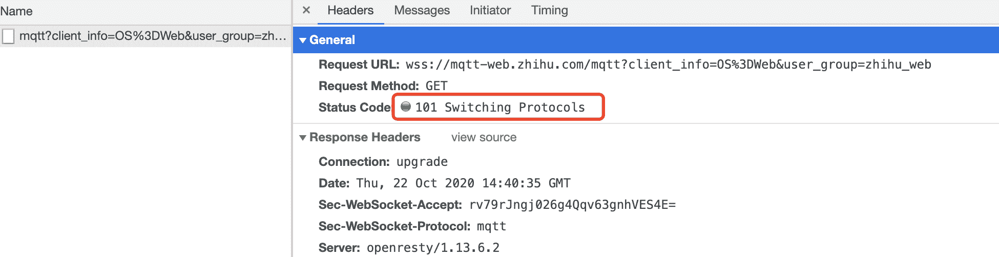

## 200 Ok

表示资源请求成功，也是最常见到的状态码

示例:

```
$ curl https://shanyue.tech --head
HTTP/2 200 
```

## 201 Created

资源创建成功，多用于 POST 请求

## 204 No Content

响应不会返回 Body，一般由以下两种情况

1.  与 Options/Delete 请求搭配
2.  打点类

示例一: 掘金为 Options 请求的状态码设置为 204

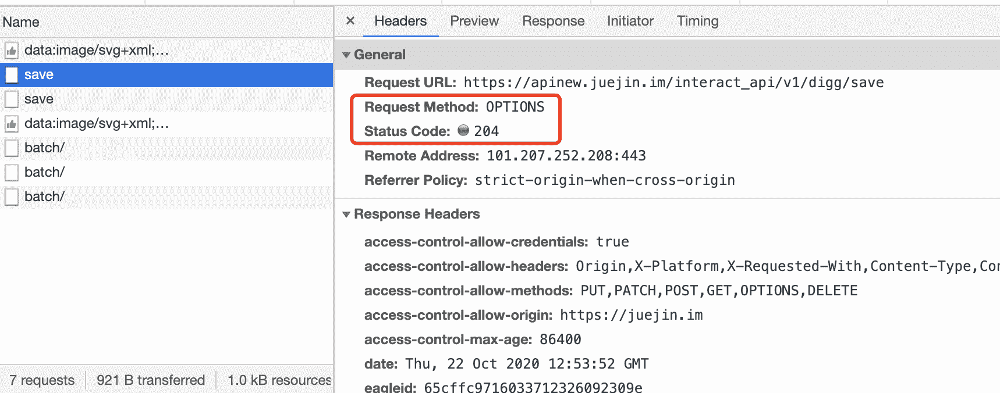

示例二: 知乎为 Delete 请求的状态码设置为 204，以下请求为取消关注

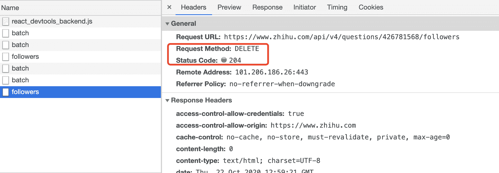

示例三: 当你在知乎看段子时，不妨打开控制台，会发现一个是 204 的状态码

```
 curl 'https://www.zhihu.com/sc-profiler' \
  -H 'content-type: application/json' \
  --data-binary '[["i","production.heifetz.main.desktop.v1.Collector.screen.1536_960.count",1,1]]' \
  --compressed -vvv
< HTTP/2 204
< server: CLOUD ELB 1.0.0
< date: Thu, 22 Oct 2020 07:46:30 GMT
< content-type: text/html
< vary: Accept-Encoding
< x-backend-response: 0.002
< cache-control: no-cache, no-store, must-revalidate, private, max-age=0 
```

## 206 Partial Content

当请求多媒体数据数据较大时，会进行分片传输。当你在 B 站观看视频，打开开发者工具，会发现许多 206 状态码以及响应头 Content-Range

示例:

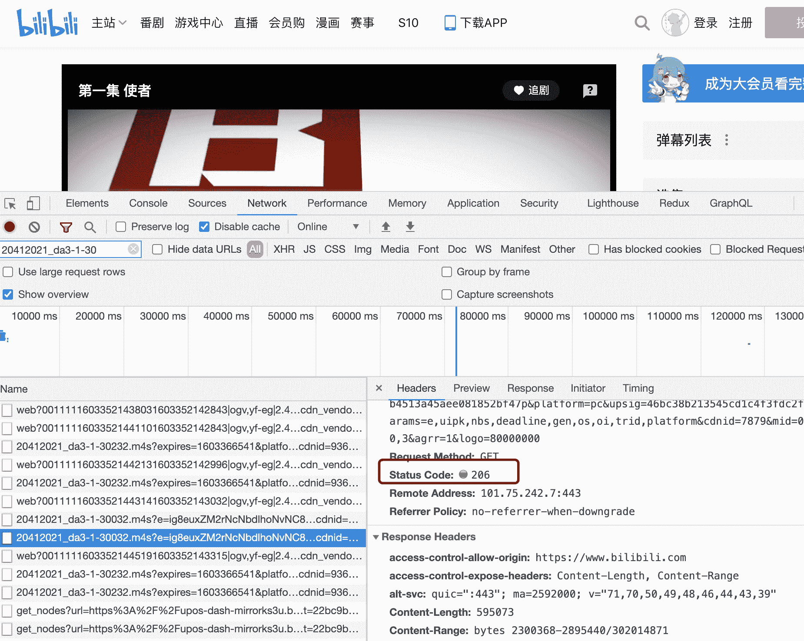

## 301 Moved Permanently

永久重定向。http 转向 https 时，有时会使用 301，如 B 站。

```
$ curl www.bilibili.com -vvv
< HTTP/1.1 301 Moved Permanently
< Server: Tengine
< Date: Thu, 22 Oct 2020 08:04:59 GMT
< Content-Type: text/html
< Content-Length: 239
< Connection: keep-alive
< Location: https://www.bilibili.com/ 
```

## 302 Found

暂时重定向。http 转向 https 时，有时也会使用 302，如知乎

```
$ curl www.zhihu.com -vvv
< HTTP/1.1 302 Found
< Location: https://www.zhihu.com/
< Content-Length: 0
< X-NWS-LOG-UUID: 16068764905156850032
< Connection: keep-alive
< Server: Lego Server
< Date: Thu, 22 Oct 2020 08:20:29 GMT
< X-Cache-Lookup: Return Directly 
```

## 304 Not Modified

资源已被缓存，与之相关的响应头部有：

*   `ETag`
*   `last-modified`/`if-modified-since`

一般用作 `index.html` 等不带 hash 的资源，由于示例太多，这里就不举例了

## 307 Temporary Redirect

暂时重定向。也可作为 http 到 https 的重定向。还有一种用途用作 HSTS，当谷歌浏览器发现某 http 资源已被加入到 HSTS 列表，浏览器内部会通过 307 作重定向

示例:

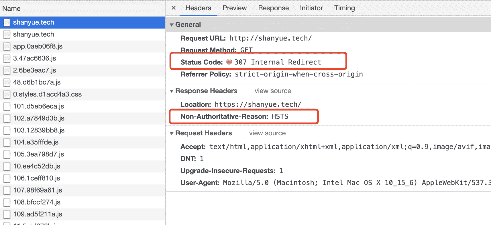

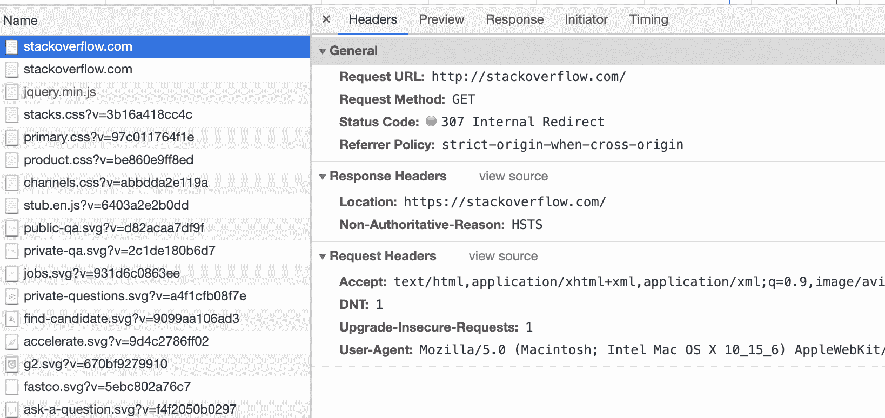

> [http 状态码中 301，302 和 307 有什么区别(opens new window)](https://github.com/shfshanyue/Daily-Question/issues/37)

*   301，Moved Permanently。永久重定向，该操作比较危险，需要谨慎操作：如果设置了 301，但是一段时间后又想取消，但是浏览器中已经有了缓存，还是会重定向。
*   302，Found。临时重定向，但是会在重定向的时候改变 method: 把 POST 改成 GET，于是有了 307
*   307，Temporary Redirect。临时重定向，在重定向时不会改变 method

## 400 Bad Request

对于服务器无法理解的参数，将会使用 400 作为返回码

示例一: 当 Content-Type: JSON 时，服务器解析 JSON 却失败

```
HTTP/1.1 400 Bad Request
Content-Length: 35

{"message":"Problems parsing JSON"} 
```

## 401 Unauthorized

当没有权限的用户请求需要带有权限的资源时，会返回 401，此时携带正确的权限凭证再试一次可以解决问题

有时认证失败也会返回 401

示例一: 知乎登录时密码不正确

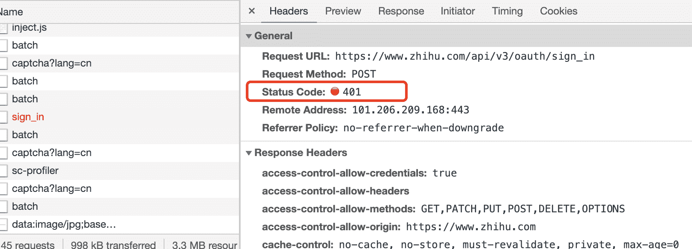

示例二: Github 中错误的凭证信息请求带权限资源

```
$ curl -i https://api.github.com -u foo:bar
> HTTP/1.1 401 Unauthorized

> {
>   "message": "Bad credentials",
>   "documentation_url": "https://developer.github.com/v3"
> } 
```

## 403 Forbidden

我就是不想让你访问，不管你的权限凭证是否正确！

> In summary, a 401 Unauthorized response should be used for missing or bad authentication, and a 403 Forbidden response should be used afterwards, when the user is authenticated but isn’t authorized to perform the requested operation on the given resource.

*   [403 与 401 状态码有什么区别(opens new window)](https://stackoverflow.com/questions/3297048/403-forbidden-vs-401-unauthorized-http-responses)

## 404 Not Found

未找到资源

## 405 Method Not Allowed

我需要 POST 这条资源，你去 GET 个锤子

## 413 Payload Too Large

不要给我扔这么大的 Body，我处理不过来

## 418 I'm A Teapot

我是一个茶壶

我要抛咖啡，你却扔给我一个茶壶？

也可以用来处理不合法的参数校验，我想要个字符串，你给了我一个整数？

## 422 Unprocessable Entity

常用来处理不合法的参数校验。

Github 上给某个项目点赞时，故意设置一个不正确的参数命名，会返回状态码 422

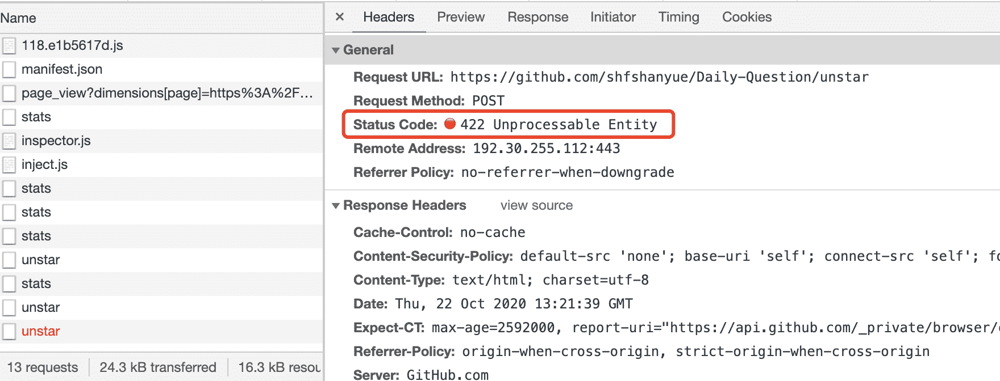

## 429 Too Many Request

请求过多被限流。

超过某一个 API 的 Rate Limit 规则，会被限流，返回 429 状态码

示例: 在 Sentry 中异常上报过于频繁被限流

## 500 Internal Server Error

服务器内部错误，很有可能是应用层未捕获错误而导致整个服务挂掉

## 502 Bad Gateway

Nginx 上常见，从上游应用层未返回响应，上游应用层挂了

## 503 Service Unavailable

由于大量流量造成服务忙，稍等一下说不定就能用了

## 504 Gateway Timeout

网关超时，上游应用层迟迟未响应

# http 状态码中 301，302 和 307 有什么区别

> 原文：[https://q.shanyue.tech/base/http/37.html](https://q.shanyue.tech/base/http/37.html)

Issue

欢迎在 Gtihub Issue 中回答此问题: [Issue 37(opens new window)](https://github.com/shfshanyue/Daily-Question/issues/37)

Author

回答者: [shfshanyue(opens new window)](https://github.com/shfshanyue)

*   301，Moved Permanently。永久重定向，该操作比较危险，需要谨慎操作：如果设置了 301，但是一段时间后又想取消，但是浏览器中已经有了缓存，还是会重定向。
*   302，Found。临时重定向，但是会在重定向的时候改变 method: 把 POST 改成 GET，于是有了 307
*   307，Temporary Redirect。临时重定向，在重定向时不会改变 method

# http 状态码 502 和 504 有什么区别

> 原文：[https://q.shanyue.tech/base/http/51.html](https://q.shanyue.tech/base/http/51.html)

Issue

欢迎在 Gtihub Issue 中回答此问题: [Issue 51(opens new window)](https://github.com/shfshanyue/Daily-Question/issues/51)

Author

回答者: [sjfkai(opens new window)](https://github.com/sjfkai)

*   502 Bad Gateway The server was acting as a gateway or proxy and received an invalid response from the upstream server. 收到了上游响应但无法解析

*   504 Gateway Timeout The server was acting as a gateway or proxy and did not receive a timely response from the upstream server. 上游响应超时

Author

回答者: [shfshanyue(opens new window)](https://github.com/shfshanyue)

这两种异常状态码都与网关 Gateway 有关，首先明确两个概念

*   Proxy (Gateway)，反向代理层或者网关层。在公司级应用中一般使用 Nginx 扮演这个角色
*   Application (upstream serrver)，应用层服务，作为 Proxy 层的上游服务。在公司中一般为各种语言编写的服务器应用，如 Go/Java/Python/PHP/Node 等

此时关于 502 与 504 的区别就很显而易见

*   `502 Bad Gateway`。一般表现为你自己写的应用层服务(Java/Go/PHP)挂了，网关层无法接收到响应
*   `504 Gateway Timeout`。一般表现为应用层服务 (upstream) 超时，如查库操作耗时十分钟，超过了 Nginx 配置的超时时间

# 简述 http 的缓存机制

> 原文：[https://q.shanyue.tech/base/http/80.html](https://q.shanyue.tech/base/http/80.html)

Issue

欢迎在 Gtihub Issue 中回答此问题: [Issue 80(opens new window)](https://github.com/shfshanyue/Daily-Question/issues/80)

Author

回答者: [xjx-me(opens new window)](https://github.com/xjx-me)

强缓存 协商缓存

Author

回答者: [shfshanyue(opens new window)](https://github.com/shfshanyue)

Http 缓存分为以下两种，两者都是通过 HTTP 响应头控制缓存

1.  强制缓存
2.  协商缓存

## 强制缓存

再次请求时无需再向服务器发送请求

```
 client         server
GET /a.ab389z.js ------->
                      <------- 200 OK
(再也不会发请求) 
```

与之相关的 Response Headers 有以下几个

*   `Expires`

    这个头部也是丧心病狂：使用绝对时间，且有固定的格式 [https://tools.ietf.org/html/rfc822#section-5.1(opens new window)](https://tools.ietf.org/html/rfc822#section-5.1)

    ```
    Expires: Mon, 25 Oct 2021 20:11:12 GMT 
    ```

*   `Cache-Control`，具有强大的缓存控制能力

    常用的有以下两个

    *   `no-cache`，每次请求需要校验服务器资源的新鲜度
    *   `max-age=31536000`，浏览器在一年内都不需要向服务器请求资源

## 协商缓存

再次请求时，需要向服务器校验新鲜度，如果资源是新鲜的，返回 304，从浏览器获取资源

```
 client         server
GET /a.js   ----------->
                   <----------- 200 OK
GET /a.js   ----------->
                   <----------- 304 Not Modified 
```

与之相关的 Request/Response Headers 有以下几个

*   `Last-Modified`/`If-Modified-Since`
*   `Etag`/`If-None-Match`

Author

回答者: [Harry3014(opens new window)](https://github.com/Harry3014)

今天在看这个问题的时候，发现一个关于强制缓存的意外情况。在刷新页面时，有的浏览器会重新验证缓存资源的新鲜度，有的不会。

假设第一次请求资源的 Response Heades 包含下列强制缓存信息

```
Date: Tue, 19 Jan 2021 08:37:05 GMT
Expires: Tue, 26 Jan 2021 08:37:05 GMT 
```

在有效期内，按照强制缓存的概念解释，再次请求资源时，不会发送请求，直接返回 200。 但是在 firefox 中(使用版本：84.0.2)，Request Headers 中包含`If-Modified-Since`头部，所以仍然会发送请求，返回 304。 在 chrome 中(使用版本：87.0.4280.141)，不会发送请求，会直接使用缓存的资源，返回 200。

在 stackoverflow 找到了一些关于这个问题的回答https://stackoverflow.com/questions/45829055/why-doesnt-chrome-re-validate-in-memory-cache-when-doing-a-normal-reload/57281076#57281076

# http proxy 的原理是什么

> 原文：[https://q.shanyue.tech/base/http/82.html](https://q.shanyue.tech/base/http/82.html)

更多描述

如 `webpack-dev-server` 可以设置 proxy，`nginx` 也可以设置

Issue

欢迎在 Gtihub Issue 中回答此问题: [Issue 82(opens new window)](https://github.com/shfshanyue/Daily-Question/issues/82)

Author

回答者: [shfshanyue(opens new window)](https://github.com/shfshanyue)

todo

Author

回答者: [Merlin218(opens new window)](https://github.com/Merlin218)

## HTTP 代理的原理

代理服务器会自动提取请求数据包中的`HTTP请求数据`发送给服务端，并服务端的`HTTP响应数据`转发给发送请求的客户端，HTTP 代理服务器使用的端口通常是 8080。

*   对于 Web 客户端来说，代理扮演的服务器角色，接收请求（Request），返回响应（Response）。
*   对于 Web 服务器来说，代理扮演的客户端角色，发送请求（Request），接收响应（Response）。

### HTTP 代理步骤

*   `客户端`向`代理`发起`TCP连接`；
*   代理接收客户端的连接，双方`建立连接`；
*   `客户端`向`代理`发送`HTTP请求`，请求内容和没有 HTTP 代理的内容完全相同；
*   代理`解析HTTP请求`；
*   `代理`向`服务器`发起`TCP连接`；
*   `服务器`接收`代理`的连接；
*   `代理`向`服务器`发送`HTTP`请求（这个 HTTP 请求是基于用户的 HTTP 请求，`可能会有修改`）
*   `服务器`发送`响应`给`代理`；
*   `代理`发送`响应`给发送请求的`客户端`；

### 不同 HTTP 代理的区别：

*   全匿名代理，不改变客户端的 request fields（请求信息），使服务器端看来就像有个真正的客户浏览器在访问。客户端的真实 IP 是隐藏起来的。
*   普通匿名代理，能隐藏客户端的真实 IP，但会更改客户端的 request fields（请求信息），服务器端有可能会被认为使用了代理。
*   透明代理（简单代理），改变客户端的 request fields（请求信息），并会传送真实 IP 地址。

## HTTPS 代理

HTTPS 代理有多种做法，通常使用`CONNECT method`，通过 proxy 建立一条隧道(隧道代理)，这样，`proxy无法解密数据`；此外，还有一种类似于中间人攻击的代理手法。

### CONNECT 方法代理步骤

*   `客户端`向`代理`发起`CONNECT`请求；
*   `代理`向`服务端`发起`TCP`连接请求；
*   当 TCP 连接建立完成后， `代理`向`客户端`返回`HTTP/1.0 OK`，隧道建立完成；
*   `代理`转发`客户端`的数据给`服务器`，转发`服务器`的数据给`客户端`，直到任何一方连接结束；

> 内容参考[HTTP、HTTPS 代理分析及原理(opens new window)](https://lilywei739.github.io/2017/01/25/principle_for_http_https.html)

# 随着 http2 的发展，前端性能优化中的哪些传统方案可以被替代

> 原文：[https://q.shanyue.tech/base/http/85.html](https://q.shanyue.tech/base/http/85.html)

Issue

欢迎在 Gtihub Issue 中回答此问题: [Issue 85(opens new window)](https://github.com/shfshanyue/Daily-Question/issues/85)

Author

回答者: [shfshanyue(opens new window)](https://github.com/shfshanyue)

1.  雪碧图
2.  资源文件合并

Author

回答者: [oldDirver001(opens new window)](https://github.com/oldDirver001)

我有一个不成熟的小想法：iconfont 是不是可以取代雪碧图？

Author

回答者: [kruzabc(opens new window)](https://github.com/kruzabc)

域名发散 资源内联

Author

回答者: [shfshanyue(opens new window)](https://github.com/shfshanyue)

@oldDirver001 可以，不过不能完全替代，比如多色

# http2 与 http1.1 有什么改进

> 原文：[https://q.shanyue.tech/base/http/86.html](https://q.shanyue.tech/base/http/86.html)

Issue

欢迎在 Gtihub Issue 中回答此问题: [Issue 86(opens new window)](https://github.com/shfshanyue/Daily-Question/issues/86)

Author

回答者: [shfshanyue(opens new window)](https://github.com/shfshanyue)

1.  二进制分帧
2.  请求多路复用 (Stream/Frame)
3.  头部压缩: (HPack)
4.  服务端推送: (PUSH_PROMISE)

可参考文章 [http2 详解(opens new window)](https://juejin.im/post/5b88a4f56fb9a01a0b31a67e)

# 什么是 Basic Auth 和 Digest Auth

> 原文：[https://q.shanyue.tech/base/http/108.html](https://q.shanyue.tech/base/http/108.html)

Issue

欢迎在 Gtihub Issue 中回答此问题: [Issue 108(opens new window)](https://github.com/shfshanyue/Daily-Question/issues/108)

# gzip 的原理是什么，如何配置

> 原文：[https://q.shanyue.tech/base/http/109.html](https://q.shanyue.tech/base/http/109.html)

Issue

欢迎在 Gtihub Issue 中回答此问题: [Issue 109(opens new window)](https://github.com/shfshanyue/Daily-Question/issues/109)

Author

回答者: [shfshanyue(opens new window)](https://github.com/shfshanyue)

一句话：`gzip` 的核心是 `Deflate`，而它使用了 `LZ77` 算法与 `Huffman` 编码来压缩文件，重复度越高的文件可压缩的空间就越大。

因此 `gzip` 用于 HTTP 文件传输中，比如 JS、CSS 等，**但一般不会压缩图片**。在 HTTP Response 报文中，用 `Content-Encoding` 指明使用 gzip 压缩，而以下响应头在大部分生产环境的响应报文中都可以看到！比如你现在立刻马上可以打开[我的网站(opens new window)](https://q.shanyue.tech)或者[百度(opens new window)](https://www.baidu.com)试一试。

```
# Request Header
Accept-Encoding: gzip, deflate, br

# Reponse Header
Content-Encoding: gzip 
```

`gzip` 一般在反向代理那一层，如 `nginx` 进行处理，直接使用 C 语言编写，具有更好的性能。

在 `nginx` 开启 `gzip`: 配置可参考 [gzip module(opens new window)](http://nginx.org/en/docs/http/ngx_http_gzip_module.html)

```
gzip on; 
```

## LZ77

## Huffman

## 相关阅读

*   [gzip 原理与实现(opens new window)](https://blog.csdn.net/imquestion/article/details/16439)

# 可以对图片开启 gzip 压缩吗，为什么

> 原文：[https://q.shanyue.tech/base/http/110.html](https://q.shanyue.tech/base/http/110.html)

Issue

欢迎在 Gtihub Issue 中回答此问题: [Issue 110(opens new window)](https://github.com/shfshanyue/Daily-Question/issues/110)

Author

回答者: [shfshanyue(opens new window)](https://github.com/shfshanyue)

不需要开启，如果开启的话，有可能使图片变的更大。如果你注意一些网站的 img 资源时，就会发现他们都没有开启 `gzip`

参考: https://webmasters.stackexchange.com/questions/8382/is-gzipping-images-worth-it-for-a-small-size-reduction-but-overhead-compressing

> **Don't use gzip for image or other binary files.**
> 
> Image file formats supported by the web, as well as videos, PDFs and other binary formats, are already compressed; using gzip on them won't provide any additional benefit, and can actually make them larger. To compress images, see Optimize images.

# http 的请求报文与响应报文的格式是什么

> 原文：[https://q.shanyue.tech/base/http/111.html](https://q.shanyue.tech/base/http/111.html)

Issue

欢迎在 Gtihub Issue 中回答此问题: [Issue 111(opens new window)](https://github.com/shfshanyue/Daily-Question/issues/111)

Author

回答者: [shfshanyue(opens new window)](https://github.com/shfshanyue)

以 `nc` 模拟 http 报文如下

```
$ nc www.baidu.com 80
GET / HTTP/1.1
Host: www.baidu.com

HTTP/1.1 200 OK
Accept-Ranges: bytes
Cache-Control: no-cache
Connection: Keep-Alive
Content-Length: 14615
Content-Type: text/html
Date: Tue, 10 Dec 2019 02:48:44 GMT
P3p: CP=" OTI DSP COR IVA OUR IND COM "
P3p: CP=" OTI DSP COR IVA OUR IND COM "
Pragma: no-cache
Server: BWS/1.1
Set-Cookie: BAIDUID=F0FC6B3A056DEA285F51A1F2F8A170BB:FG=1; expires=Thu, 31-Dec-37 23:55:55 GMT; max-age=2147483647; path=/; domain=.baidu.com
Set-Cookie: BIDUPSID=F0FC6B3A056DEA285F51A1F2F8A170BB; expires=Thu, 31-Dec-37 23:55:55 GMT; max-age=2147483647; path=/; domain=.baidu.com
Set-Cookie: PSTM=1575946124; expires=Thu, 31-Dec-37 23:55:55 GMT; max-age=2147483647; path=/; domain=.baidu.com
Set-Cookie: BAIDUID=F0FC6B3A056DEA287CB2B9422E09E30E:FG=1; max-age=31536000; expires=Wed, 09-Dec-20 02:48:44 GMT; domain=.baidu.com; path=/; version=1; comment=bd
Traceid: 1575946124058431156210725656341129791126
Vary: Accept-Encoding
X-Ua-Compatible: IE=Edge,chrome=1

<!DOCTYPE html><!--STATUS OK-->
........内容省略 
```

# http 响应头中的 ETag 值是如何生成的

> 原文：[https://q.shanyue.tech/base/http/112.html](https://q.shanyue.tech/base/http/112.html)

Issue

欢迎在 Gtihub Issue 中回答此问题: [Issue 112(opens new window)](https://github.com/shfshanyue/Daily-Question/issues/112)

Author

回答者: [shfshanyue(opens new window)](https://github.com/shfshanyue)

关于 `etag` 的生成需要满足几个条件，至少是宽松满足

1.  当文件更改时，`etag` 值必须改变。
2.  **尽量**便于计算，不会特别耗 CPU。这样子利用摘要算法生成 (MD5, SHA128, SHA256) 需要慎重考虑，因为他们是 CPU 密集型运算
3.  **必须**横向扩展，分布式部署时多个服务器节点上生成的 `etag` 值保持一致。这样子 `inode` 就排除了

> 关于服务器中 `etag` 如何生成可以参考 [HTTP: Generating ETag Header(opens new window)](https://stackoverflow.com/questions/4533/http-generating-etag-header)

以上几个条件是理论上的成立条件，那在真正实践中，应该如何处理？

我们来看一下 `nginx` 中是如何做的

## nginx 中 ETag 的生成

我翻阅了 `nginx` 的源代码，并翻译成伪代码如下：由 last_modified 与 content_length 拼接而成

```
etag = header.last_modified + header.content_lenth; 
```

可见源码位置，并在以下贴出: [ngx_http_core_modules.c(opens new window)](https://github.com/nginx/nginx/blob/6c3838f9ed45f5c2aa6a971a0da3cb6ffe45b61e/src/http/ngx_http_core_module.c#L1582)

```
etag->value.len = ngx_sprintf(etag->value.data, "\"%xT-%xO\"",
                                  r->headers_out.last_modified_time,
                                  r->headers_out.content_length_n)
                      - etag->value.data; 
```

**总结：`nginx` 中 `etag` 由响应头的 `Last-Modified` 与 `Content-Length` 表示为十六进制组合而成。**

随手在我的 k8s 集群里找个 `nginx` 服务测试一下

```
$ curl --head 10.97.109.49
HTTP/1.1 200 OK
Server: nginx/1.16.0
Date: Tue, 10 Dec 2019 06:45:24 GMT
Content-Type: text/html
Content-Length: 612
Last-Modified: Tue, 23 Apr 2019 10:18:21 GMT
Connection: keep-alive
ETag: "5cbee66d-264"
Accept-Ranges: bytes 
```

由 `etag` 计算 `Last-Modified` 与 `Content-Length`，使用 `js` 计算如下，结果相符

```
> new Date(parseInt('5cbee66d', 16) * 1000).toJSON()
"2019-04-23T10:18:21.000Z"
> parseInt('264', 16)
612 
```

## Nginx 中的 ETag 算法及其不足

协商缓存用来计算资源是否返回 304，我们知道协商缓存有两种方式

*   `Last-Modified`/`if-Modified-Since`
*   `ETag`/`If-None-Match`

既然在 `nginx` 中 `ETag` 由 `Last-Modified` 和 `Content-Length` 组成，那它便算是一个加强版的 `Last-Modified` 了，那加强在什么地方呢？

**`Last-Modified` 是由一个 `unix timestamp` 表示，则意味着它只能作用于秒级的改变，而 nginx 中的 ETag 添加了文件大小的附加条件**

那下一个问题：[如果 http 响应头中 ETag 值改变了，是否意味着文件内容一定已经更改(opens new window)](https://github.com/shfshanyue/Daily-Question/issues/113)

答案：不能。

**因此使用 nginx 计算 304 有一定局限性：在 1s 内修改了文件并且保持文件大小不变。但这种情况出现的概率极低就是了，因此在正常情况下可以容忍一个不太完美但是高效的算法。**

## 相关问题

*   [如果 http 响应头中 ETag 值改变了，是否意味着文件内容一定已经更改(opens new window)](https://github.com/shfshanyue/Daily-Question/issues/113)

Author

回答者: [jacintoface(opens new window)](https://github.com/jacintoface)

Last-Modified 变了，但是 Content-Length 没变（文件内容不变），是否意味着 etag 的缓存失效

Author

回答者: [shfshanyue(opens new window)](https://github.com/shfshanyue)

@jacintoface 也可以这么理解

# 如果 http 响应头中 ETag 值改变了，是否意味着文件内容一定已经更改

> 原文：[https://q.shanyue.tech/base/http/113.html](https://q.shanyue.tech/base/http/113.html)

Issue

欢迎在 Gtihub Issue 中回答此问题: [Issue 113(opens new window)](https://github.com/shfshanyue/Daily-Question/issues/113)

Author

回答者: [shfshanyue(opens new window)](https://github.com/shfshanyue)

不一定，由服务器中 `ETag` 的生成算法决定。详见 [#112(opens new window)](https://github.com/shfshanyue/Daily-Question/issues/112)

比如 `nginx` 中的 `etag` 由 `last_modified` 与 `content_length` 组成，而 `last_modified` 又由 `mtime` 组成

当编辑文件却未更改文件内容时，或者 `touch file`，`mtime` 也会改变，此时 `etag` 改变，但是文件内容没有更改。

Author

回答者: [collins999(opens new window)](https://github.com/collins999)

比如 nginx 中的 etag 由 last_modified 与 content_length 组成，而 last_modified 又由 mtime 组成。

那 Etag 是怎么解决 last_modified，当编辑文件却未更改文件时间的问题？

Author

回答者: [shfshanyue(opens new window)](https://github.com/shfshanyue)

> 比如 nginx 中的 etag 由 last_modified 与 content_length 组成，而 last_modified 又由 mtime 组成。
> 
> 那 Etag 是怎么解决 last_modified，当编辑文件却未更改文件时间的问题？

1.  此时文件大小有可能发生更改，ETag 会改变
2.  此时文件大小没有发生更改，ETag 不会改变。但这需要极其苛刻的条件：1s 内更改文件，并且保持文件大小不变。这种情况出现概率很低，因此忽略了

# http 服务中静态文件的 Last-Modified 是根据什么生成的

> 原文：[https://q.shanyue.tech/base/http/117.html](https://q.shanyue.tech/base/http/117.html)

Issue

欢迎在 Gtihub Issue 中回答此问题: [Issue 117(opens new window)](https://github.com/shfshanyue/Daily-Question/issues/117)

Author

回答者: [shfshanyue(opens new window)](https://github.com/shfshanyue)

一般会选文件的 `mtime`，表示文件内容的修改时间

`nginx` 也是这样处理的，源码见: [ngx_http_static_module.c(opens new window)](https://github.com/nginx/nginx/blob/4bf4650f2f10f7bbacfe7a33da744f18951d416d/src/http/modules/ngx_http_static_module.c#L217)

```
 r->headers_out.status = NGX_HTTP_OK;
    r->headers_out.content_length_n = of.size;
    r->headers_out.last_modified_time = of.mtime; 
```

关于为什么使用 `mtime` 而非 `ctime`，可以参考 [#116(opens new window)](https://github.com/shfshanyue/Daily-Question/issues/117)

# 既然 http 是无状态协议，那它是如何保持登录状态

> 原文：[https://q.shanyue.tech/base/http/118.html](https://q.shanyue.tech/base/http/118.html)

Issue

欢迎在 Gtihub Issue 中回答此问题: [Issue 118(opens new window)](https://github.com/shfshanyue/Daily-Question/issues/118)

Author

回答者: [shfshanyue(opens new window)](https://github.com/shfshanyue)

通过 cookie 或者 Authorization header 来传递凭证，在服务端进行认证

# https 是如何保证报文安全的

> 原文：[https://q.shanyue.tech/base/http/120.html](https://q.shanyue.tech/base/http/120.html)

Issue

欢迎在 Gtihub Issue 中回答此问题: [Issue 120(opens new window)](https://github.com/shfshanyue/Daily-Question/issues/120)

Author

回答者: [wython(opens new window)](https://github.com/wython)

https 主要解决三个安全问题：

1.  内容隐私
2.  防篡改
3.  确认对方身份

https 并不是直接通过非对称加密传输过程，而是有握手过程，握手过程主要是和服务器做通讯，生成私有秘钥，最后通过该秘钥对称加密传输数据。还有验证证书的正确性。 证书验证过程保证了对方是合法的，并且中间人无法通过伪造证书方式进行攻击。

# 我们如何从 http 的报文中得知该服务使用的技术栈

> 原文：[https://q.shanyue.tech/base/http/122.html](https://q.shanyue.tech/base/http/122.html)

Issue

欢迎在 Gtihub Issue 中回答此问题: [Issue 122(opens new window)](https://github.com/shfshanyue/Daily-Question/issues/122)

Author

回答者: [shfshanyue(opens new window)](https://github.com/shfshanyue)

一般有两个 response header，有时服务端为了隐蔽自己真实的技术栈会隐蔽这两个字段

*   `X-Powerd-By`
*   `Server`

# 在发送 http 请求报文时，Host 是必要的吗

> 原文：[https://q.shanyue.tech/base/http/123.html](https://q.shanyue.tech/base/http/123.html)

Issue

欢迎在 Gtihub Issue 中回答此问题: [Issue 123(opens new window)](https://github.com/shfshanyue/Daily-Question/issues/123)

Author

回答者: [Gloomysunday28(opens new window)](https://github.com/Gloomysunday28)

是有必要的，因为我们不知道会途径会不会有代理出现， 如果直接到达服务器的话，服务器是可以通过路径知道资源在哪，但是如果通过代理的话，代理无法得知具体服务器是什么地址

# http 响应头中如果 content-type 为 application/octet-stream，则代表什么意思

> 原文：[https://q.shanyue.tech/base/http/134.html](https://q.shanyue.tech/base/http/134.html)

Issue

欢迎在 Gtihub Issue 中回答此问题: [Issue 134(opens new window)](https://github.com/shfshanyue/Daily-Question/issues/134)

Author

回答者: [shfshanyue(opens new window)](https://github.com/shfshanyue)

代表二进制流，一般用以下载文件

# http 向 https 做重定向应该使用哪个状态码

> 原文：[https://q.shanyue.tech/base/http/137.html](https://q.shanyue.tech/base/http/137.html)

Issue

欢迎在 Gtihub Issue 中回答此问题: [Issue 137(opens new window)](https://github.com/shfshanyue/Daily-Question/issues/137)

Author

回答者: [shfshanyue(opens new window)](https://github.com/shfshanyue)

一般用作 `301` 的较为多，但是也有使用 `302`，如果开启了 `HSTS` 则会使用 `307`

如知乎使用了 302，淘宝使用了 301

```
$ curl --head www.zhihu.com
HTTP/1.1 302 Found
Date: Tue, 24 Dec 2019 00:13:54 GMT
Content-Length: 22
Connection: keep-alive
Server: NWS_TCloud_IPV6
Location: https://www.zhihu.com/
X-NWS-LOG-UUID: 0e28d9a1-6aeb-42cd-9f6b-00bd6cf11500

$ curl --head www.taobao.com
HTTP/1.1 301 Moved Permanently
Server: Tengine
Date: Tue, 24 Dec 2019 00:13:58 GMT
Content-Type: text/html
Content-Length: 278
Connection: keep-alive
Location: https://www.taobao.com/
Via: cache20.cn1480[,0]
Timing-Allow-Origin: *
EagleId: 6f3f38a815771464380412555e 
```

# http 响应头中的 Date 与 Last-Modified 有什么不同，网站部署时需要注意什么

> 原文：[https://q.shanyue.tech/base/http/142.html](https://q.shanyue.tech/base/http/142.html)

Issue

欢迎在 Gtihub Issue 中回答此问题: [Issue 142(opens new window)](https://github.com/shfshanyue/Daily-Question/issues/142)

Author

回答者: [shfshanyue(opens new window)](https://github.com/shfshanyue)

*   `Date`: 报文在源服务器的产生时间，由此可查看报文已缓存了多久时间
*   `Last-Modified`: 源服务器上资源的上次修改时间

`LM-Factor` 与它俩有关，它处于 [0, 1] 之间，以下使用 n 来替代。

简而言之，一个静态资源没有设置 `Cache-Control` 时会以这两个响应头来设置强制缓存时间：`(Date - LastModified) * n`，而非直接进行协商缓存。在涉及到 CDN 时，表现更为明显，体现在更新代码部署后，界面没有更新。

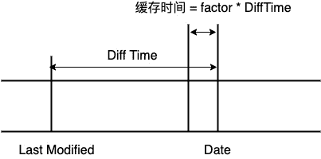

Author

回答者: [yuhaoz(opens new window)](https://github.com/yuhaoz)

(Date - LastModified) * n 这个 n 代表什么？

Author

回答者: [shfshanyue(opens new window)](https://github.com/shfshanyue)

@yuhaoz 就是那个 lm-factor

# http 1.1 中的 keep-alive 有什么作用

> 原文：[https://q.shanyue.tech/base/http/145.html](https://q.shanyue.tech/base/http/145.html)

Issue

欢迎在 Gtihub Issue 中回答此问题: [Issue 145(opens new window)](https://github.com/shfshanyue/Daily-Question/issues/145)

Author

回答者: [shfshanyue(opens new window)](https://github.com/shfshanyue)

在 `http 1.1` 中，在响应头中设置 `keep-alive` 可以在一个 TCP 连接上发送多个 http 请求

1.  避免了重开 TCP 连接的开销
2.  避免了刷新时重新建立 SSL 连接的开销
3.  避免了 QPS 过大时，服务器的连接数过大

在服务器端使用响应头开启 `keep-alive`

```
Connection: Keep-Alive
Keep-Alive: timeout=5, max=1000 
```

# 当在浏览器中看到某资源使用了 http2 后，使用 curl 为什么看到的仍是 http 1.1

> 原文：[https://q.shanyue.tech/base/http/148.html](https://q.shanyue.tech/base/http/148.html)

Issue

欢迎在 Gtihub Issue 中回答此问题: [Issue 148(opens new window)](https://github.com/shfshanyue/Daily-Question/issues/148)

Author

回答者: [vczx1994(opens new window)](https://github.com/vczx1994)

当前 curl 的版本及支持的协议以及功能特性没有支持 HTTP2

# 什么是队首阻塞，如何解决，原理如何

> 原文：[https://q.shanyue.tech/base/http/150.html](https://q.shanyue.tech/base/http/150.html)

Issue

欢迎在 Gtihub Issue 中回答此问题: [Issue 150(opens new window)](https://github.com/shfshanyue/Daily-Question/issues/150)

# 简述你们前端项目中资源的缓存配置策略

> 原文：[https://q.shanyue.tech/base/http/193.html](https://q.shanyue.tech/base/http/193.html)

Issue

欢迎在 Gtihub Issue 中回答此问题: [Issue 193(opens new window)](https://github.com/shfshanyue/Daily-Question/issues/193)

# no-cache 与 no-store 的区别是什么

> 原文：[https://q.shanyue.tech/base/http/207.html](https://q.shanyue.tech/base/http/207.html)

Issue

欢迎在 Gtihub Issue 中回答此问题: [Issue 207(opens new window)](https://github.com/shfshanyue/Daily-Question/issues/207)

Author

回答者: [lijiayi01(opens new window)](https://github.com/lijiayi01)

no-cache 可以在本地缓存，可以在代理服务器缓存，但是这个缓存要服务器验证才可以使用 no-store 是禁用缓冲，本地和代理服务器都不缓冲，每次都从服务器获取

Author

回答者: [shfshanyue(opens new window)](https://github.com/shfshanyue)

`no-cache` 和 `no-store` 用作控制缓存，被服务器通过响应头 `Cache-Control` 传递给客户端

## `no-store`

**永远都不要在客户端存储资源**，每次永远都要从原始服务器获取资源

## `no-cache`

可以在客户端存储资源，但每次都**必须去服务器做新鲜度校验**，来决定从服务器获取最新资源 (200) 还是从客户端读取缓存 (304)，即所谓的协商缓存

> [当服务器资源返回 304 时与那些 HTTP 响应头有关(opens new window)](https://github.com/shfshanyue/Daily-Question/issues/441)

一般情况下对于 `index.html` 或者现代构建环境下不加 hash 的静态资源都需要设置 `Cache-Control: no-cache`，用来强制每次在服务器端的新鲜度校验。

相当于以下响应头

```
Cache-Control: max-age=0, must-revalidate 
```

## 相关问题

*   [【Q434】当服务器资源返回 304 时与那些 HTTP 响应头有关(opens new window)](https://github.com/shfshanyue/Daily-Question/issues/441)
*   [【Q079】简述 HTTP 的缓存机制(opens new window)](https://github.com/shfshanyue/Daily-Question/issues/80)

# https 中如何保证证书是可信任的

> 原文：[https://q.shanyue.tech/base/http/254.html](https://q.shanyue.tech/base/http/254.html)

Issue

欢迎在 Gtihub Issue 中回答此问题: [Issue 254(opens new window)](https://github.com/shfshanyue/Daily-Question/issues/254)

# CSP 是干什么用的了

> 原文：[https://q.shanyue.tech/base/http/269.html](https://q.shanyue.tech/base/http/269.html)

Issue

欢迎在 Gtihub Issue 中回答此问题: [Issue 269(opens new window)](https://github.com/shfshanyue/Daily-Question/issues/269)

Author

回答者: [DoubleRayWang(opens new window)](https://github.com/DoubleRayWang)

http://www.ruanyifeng.com/blog/2016/09/csp.html

Author

回答者: [shfshanyue(opens new window)](https://github.com/shfshanyue)

`CSP` **只允许加载指定的脚本及样式**，**最大限度地防止 `XSS` 攻击**，是解决 XSS 的最优解。CSP 的设置根据加载页面时 http 的响应头 `Content Security Policy` 在服务器端控制。

1.  外部脚本可以通过指定域名来限制：**`Content-Security-Policy: script-src 'self'`**，`self` 代表只加载当前域名
2.  如果网站必须加载内联脚本 (inline script) ，则可以提供一个 `nonce` 才能执行脚本，攻击者则无法注入脚本进行攻击。**`Content-Security-Policy: script-src 'nonce-xxxxxxxxxxxxxxxxxx'`**

通过 `devtools -> network` 可见 github 的 CSP 配置如下：

```
Content-Security-Policy: default-src 'none';
  base-uri 'self';
  block-all-mixed-content;
  connect-src 'self' uploads.github.com www.githubstatus.com collector.githubapp.com api.github.com www.google-analytics.com github-cloud.s3.amazonaws.com github-production-repository-file-5c1aeb.s3.amazonaws.com github-production-upload-manifest-file-7fdce7.s3.amazonaws.com github-production-user-asset-6210df.s3.amazonaws.com cdn.optimizely.com logx.optimizely.com/v1/events wss://alive.github.com;
  font-src github.githubassets.com;
  form-action 'self' github.com gist.github.com;
  frame-ancestors 'none';
  frame-src render.githubusercontent.com;
  img-src 'self' data: github.githubassets.com identicons.github.com collector.githubapp.com github-cloud.s3.amazonaws.com *.githubusercontent.com;
  manifest-src 'self';
  media-src 'none';
  script-src github.githubassets.com;
  style-src 'unsafe-inline' github.githubassets.com;
  worker-src github.com/socket-worker.js gist.github.com/socket-worker.js 
```

## 相关链接

*   [Content Security Policy 入门教程 - 阮一峰(opens new window)](http://www.ruanyifeng.com/blog/2016/09/csp.html)
*   [Content Security Policy - w3(opens new window)](https://www.w3.org/TR/CSP3/#directive-form-action)

Author

回答者: [zzetao(opens new window)](https://github.com/zzetao)

### Content Security Policy (CSP)

**介绍：**

1.  解决 XSS 最优办法
2.  可以设置信任域名才可以访问 script / audio / video / image ...

**防止 XSS 例子：** 攻击者通过 恶意脚本(假设有执行外部脚本) 注入到系统内，显示给访问用户，以此来获取用户信息 我们可以通过 CSP 来设置信任域名才可以执行 .js 脚本。

**如何设置：**

1.  HTTP 请求头
2.  Meta 标签

MDN：https://developer.mozilla.org/zh-CN/docs/Web/HTTP/CSP

兼容性：IE >= 10

# http2 中的首部压缩的实现原理是什么

> 原文：[https://q.shanyue.tech/base/http/275.html](https://q.shanyue.tech/base/http/275.html)

Issue

欢迎在 Gtihub Issue 中回答此问题: [Issue 275(opens new window)](https://github.com/shfshanyue/Daily-Question/issues/275)

Author

回答者: [shfshanyue(opens new window)](https://github.com/shfshanyue)

`HPACK` 协议，其中原理是**哈夫曼编码**及**索引表** (看来常用的数据结构及算法要有所了解)，以下内容摘自 [谷歌开发者文档：http2(opens new window)](https://developers.google.com/web/fundamentals/performance/http2/)

> 每个 HTTP 传输都承载一组标头，这些标头说明了传输的资源及其属性。 在 HTTP/1.x 中，此元数据始终以纯文本形式，通常会给每个传输增加 500–800 字节的开销。如果使用 HTTP Cookie，增加的开销有时会达到上千字节。 （请参阅测量和控制协议开销。） 为了减少此开销和提升性能，HTTP/2 使用 HPACK 压缩格式压缩请求和响应标头元数据，这种格式采用两种简单但是强大的技术：
> 
> 1.  这种格式支持通过静态霍夫曼代码对传输的标头字段进行编码，从而减小了各个传输的大小。
> 2.  这种格式要求客户端和服务器同时维护和更新一个包含之前见过的标头字段的索引列表（换句话说，它可以建立一个共享的压缩上下文），此列表随后会用作参考，对之前传输的值进行有效编码。

实践出真知，通过 `wireshark` 抓包分析 http2 的报文对理解 http2 收益颇多。

> 你要有知识，你就得参加变革现实的实践。你要知道梨子的滋味，你就得变革梨子，亲口吃一吃。你要知道原子的组织同性质，你就得实行物理学和化学的实验，变革原子的情况。你要知道革命的理论和方法，你就得参加革命。

以下是关于抓包信息的截图

**http2 通过 `Settings` 帧设置 header table size，进行首部压缩**

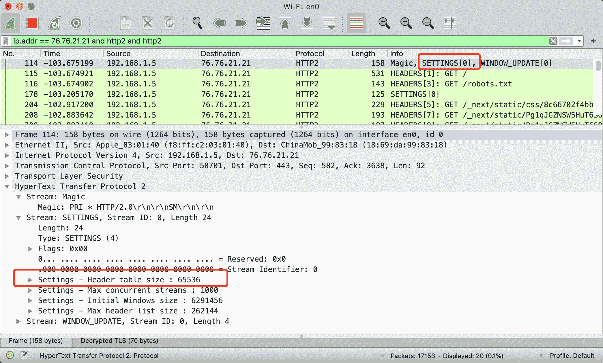

**http2 通过首部压缩后，:method 伪标头在索引表中的 Index 为 2**

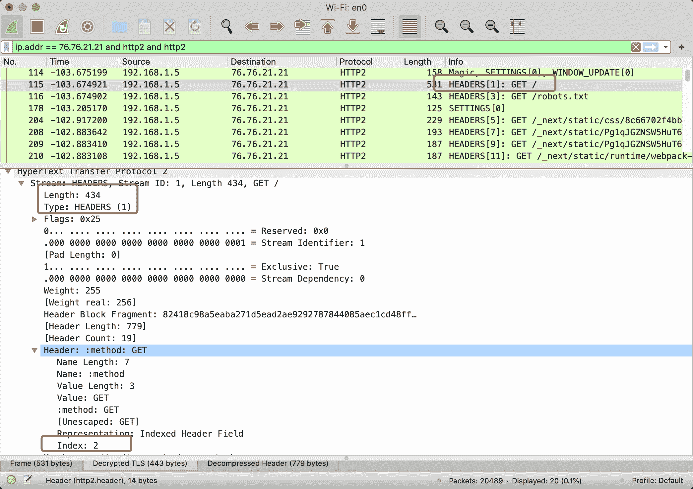

关于**常用的标头会存储在静态索引表固定的位置**，详见 [https://httpwg.org/specs/rfc7541.html#static.table.definition(opens new window)](https://httpwg.org/specs/rfc7541.html#static.table.definition)


# http 请求头中的 X-Forwarded-For 代表什么意思

> 原文：[https://q.shanyue.tech/base/http/285.html](https://q.shanyue.tech/base/http/285.html)

Issue

欢迎在 Gtihub Issue 中回答此问题: [Issue 285(opens new window)](https://github.com/shfshanyue/Daily-Question/issues/285)

Author

回答者: [shfshanyue(opens new window)](https://github.com/shfshanyue)

`X-Forwarded-For` 被反向代理器生成，如 nginx，traefik 等，一般用作标识客户端真实的 IP 地址，目前已成为事实上的标准。

# base64 由哪 64 个字符构成

> 原文：[https://q.shanyue.tech/base/http/303.html](https://q.shanyue.tech/base/http/303.html)

Issue

欢迎在 Gtihub Issue 中回答此问题: [Issue 303(opens new window)](https://github.com/shfshanyue/Daily-Question/issues/303)

Author

回答者: [shfshanyue(opens new window)](https://github.com/shfshanyue)

`A-Z`，`a-z`，`0-9`，`+`，`/`

Author

回答者: [haotie1990(opens new window)](https://github.com/haotie1990)

[https://www.ruanyifeng.com/blog/2008/06/base64.html(opens new window)](https://www.ruanyifeng.com/blog/2008/06/base64.html)

# 关于 cors 的响应头有哪些

> 原文：[https://q.shanyue.tech/base/http/328.html](https://q.shanyue.tech/base/http/328.html)

Issue

欢迎在 Gtihub Issue 中回答此问题: [Issue 328(opens new window)](https://github.com/shfshanyue/Daily-Question/issues/328)

Author

回答者: [shfshanyue(opens new window)](https://github.com/shfshanyue)

*   `Access-Control-Allow-Origin`
*   `Access-Control-Allow-Methods`
*   `Access-Control-Allow-Headers`
*   `Access-Control-Allow-Credentials`
*   `Access-Control-Expose-Headers`
*   `Access-Control-Max-Age`

关于如何写一个 `cors` 的中间件可以参考 [koajs/cors(opens new window)](https://github.com/koajs/cors)

# 如何避免 CDN 为 PC 端缓存移动端页面

> 原文：[https://q.shanyue.tech/base/http/330.html](https://q.shanyue.tech/base/http/330.html)

Issue

欢迎在 Gtihub Issue 中回答此问题: [Issue 330(opens new window)](https://github.com/shfshanyue/Daily-Question/issues/330)

Author

回答者: [shfshanyue(opens new window)](https://github.com/shfshanyue)

如果 PC 端和移动端是一套代码则不会出现这个问题。**这个问题出现在 PC 端和移动端是两套代码，却共用一个域名。**

使用 `nginx` 配置如下，根据 UA 判断是否移动端，而走不同的逻辑 (判断 UA 是否移动端容易出问题)

```
location / {
    // 默认 PC 端
    root /usr/local/website/web;

    # 判断 UA，访问移动端
    if ( $http_user_agent ~* "(Android|webOS|iPhone|iPad|BlackBerry)" ){
        root /usr/local/website/mobile;
    }

    index index.html index.htm;
} 
```

解决方案通常使用 `Vary` 响应头，来控制 CDN 对不同请求头的缓存。

**此处可以使用 `Vary: User-Agent` ，代表如果 User-Agent 不一样，则重新发起请求，而非从缓存中读取页面**

```
Vary: User-Agent 
```

当然，`User-Agent` 实在过多，此时缓存失效就会过多。

## 简答

使用 `Vary: User-Agent`，根据 UA 进行缓存。

```
Vary: User-Agent 
```

但最好不要出现这种情况，PC 端和移动端如果是两套代码，建议用两个域名，理由如下

1.  `nginx` 判断是否移动端容易出错
2.  对缓存不友好

# 在 node 端如何向服务器上传文件

> 原文：[https://q.shanyue.tech/base/http/360.html](https://q.shanyue.tech/base/http/360.html)

Issue

欢迎在 Gtihub Issue 中回答此问题: [Issue 360(opens new window)](https://github.com/shfshanyue/Daily-Question/issues/360)

# 什么情况下会发送 OPTIONS 请求

> 原文：[https://q.shanyue.tech/base/http/363.html](https://q.shanyue.tech/base/http/363.html)

Issue

欢迎在 Gtihub Issue 中回答此问题: [Issue 363(opens new window)](https://github.com/shfshanyue/Daily-Question/issues/363)

Author

回答者: [nextprops(opens new window)](https://github.com/nextprops)

[搬运地址(opens new window)](https://blog.csdn.net/kahhy/article/details/81563063) 1:请求的方法不是 GET/HEAD/POST 2:POST 请求的 Content-Type 异常 3:请求设置了自定义的 header 字段

Author

回答者: [shfshanyue(opens new window)](https://github.com/shfshanyue)

**当一个请求跨域且不是简单请求时就会发送 `OPTIONS` 请求**

满足以下条件就是一个简单请求:

1.  `Method`: 请求的方法是 `GET`、`POST` 及 `HEAD`
2.  `Header`: 请求头是 `Content-Type`、`Accept-Language`、`Content-Language` 等
3.  `Content-Type`: 请求类型是 `application/x-www-form-urlencoded`、`multipart/form-data` 或 `text/plain`

而在项目中常见的 `Content-Type: application/json` 及 `Authorization: <token>` 为典型的**非简单请求**，在发送请求时往往会带上 `Options`

> 更详细内容请参考 [CORS - MDN(opens new window)](https://developer.mozilla.org/zh-CN/docs/Web/HTTP/Access_control_CORS)

# CORS 如果需要指定多个域名怎么办

> 原文：[https://q.shanyue.tech/base/http/364.html](https://q.shanyue.tech/base/http/364.html)

Issue

欢迎在 Gtihub Issue 中回答此问题: [Issue 364(opens new window)](https://github.com/shfshanyue/Daily-Question/issues/364)

Author

回答者: [shfshanyue(opens new window)](https://github.com/shfshanyue)

`CORS` 通过控制 `Access-Control-Allow-Origin` 控制哪些域名可以共享资源，取值如下

```
Access-Control-Allow-Origin: <origin> | * 
```

其中 `*` 代表所有域名，`origin` 代表指定特定域名，那如何设置多个域名了？

此时需要通过代码实现，**根据请求头中的 `Origin` 来设置响应头 `Access-Control-Allow-Origin`**，那 Origin 又是什么东西？

## 请求头: Origin

并不是所有请求都会自动带上 `Origin`，在浏览器中带 `Origin` 的逻辑如下

1.  如果存在跨域，则带上 `Origin`，值为当前域名
2.  如果不存在跨域，则不带 `Origin`

逻辑理清楚后，关于服务器中对于 `Access-Control-Allow-Origin` 设置多域名的逻辑也很清晰了

1.  如果请求头不带有 `Origin`，证明未跨域，则不作任何处理
2.  如果请求头带有 `Origin`，证明跨域，根据 `Origin` 设置相应的 `Access-Control-Allow-Origin: <Origin>`

使用伪代码实现如下:

```
// 获取 Origin 请求头
const requestOrigin = ctx.get("Origin");

// 如果没有，则跳过
if (!requestOrigin) {
  return await next();
}

// 设置响应头
ctx.set("Access-Control-Allow-Origin", requestOrigin); 
```

## Vary: Origin

此时可以给多个域名控制 CORS，但此时假设有两个域名访问 `static.shanyue.tech` 的跨域资源

1.  `foo.shanyue.tech`，响应头中返回 `Access-Control-Allow-Origin: foo.shanyue.tech`
2.  `bar.shanyue.tech`，响应头中返回 `Access-Control-Allow-Origin: bar.shanyue.tech`

看起来一切正常，但如果中间有缓存怎么办？

1.  `foo.shanyue.tech`，响应头中返回 `Access-Control-Allow-Origin: foo.shanyue.tech`，被 CDN 缓存
2.  **`bar.shanyue.tech`，因由缓存，响应头中返回 `Access-Control-Allow-Origin: foo.shanyue.tech`，跨域出现问题**

此时，`Vary: Origin` 就上场了，代表为不同的 `Origin` 缓存不同的资源

## 总结 (简要答案)

CORS 如何指定多个域名？

**根据请求头中的 `Origin` 来设置响应头 `Access-Control-Allow-Origin`**，思路如下

1.  总是设置 `Vary: Origin`，避免 CDN 缓存破坏 CORS 配置
2.  如果请求头不带有 `Origin`，证明未跨域，则不作任何处理
3.  如果请求头带有 `Origin`，证明浏览器访问跨域，根据 `Origin` 设置相应的 `Access-Control-Allow-Origin: <Origin>`

使用伪代码实现如下

```
// 获取 Origin 请求头
const requestOrigin = ctx.get("Origin");

ctx.set("Vary", "Origin");

// 如果没有，则跳过
if (!requestOrigin) {
  return await next();
}

// 设置响应头
ctx.set("Access-Control-Allow-Origin", requestOrigin); 
```

> 相关问题：[如何避免 CDN 为 PC 端缓存移动端页面(opens new window)](https://github.com/shfshanyue/Daily-Question/issues/330)

# 既然 cors 配置可以做跨域控制，那可以防止 CSRF 攻击吗

> 原文：[https://q.shanyue.tech/base/http/366.html](https://q.shanyue.tech/base/http/366.html)

Issue

欢迎在 Gtihub Issue 中回答此问题: [Issue 366(opens new window)](https://github.com/shfshanyue/Daily-Question/issues/366)

Author

回答者: [shfshanyue(opens new window)](https://github.com/shfshanyue)

**对 CORS 一点用也没有**

1.  **`form` 提交不通过 `CORS` 检测**，你可以在本地进行测试
2.  即使通过 `xhr` 及 `fetch` 进行提交被 CORS 拦住，**但是对于简单请求而言，请求仍被发送**，已造成了攻击

# http2 中 server push 与 websocket 有什么区别

> 原文：[https://q.shanyue.tech/base/http/392.html](https://q.shanyue.tech/base/http/392.html)

Issue

欢迎在 Gtihub Issue 中回答此问题: [Issue 392(opens new window)](https://github.com/shfshanyue/Daily-Question/issues/392)

Author

回答者: [shfshanyue(opens new window)](https://github.com/shfshanyue)

*   HTTP2 Server Push，一般用以服务器根据解析 `index.html` 同时推送 `JPG/JS/CSS` 等资源，而免了服务器发送多次请求
*   websocket，用以服务器与客户端手动编写代码去推送进行数据通信

Author

回答者: [haotie1990(opens new window)](https://github.com/haotie1990)

[HTTP/2 服务器推送（Server Push）教程(opens new window)](http://www.ruanyifeng.com/blog/2018/03/http2_server_push.html)

# 简述下 TLS 握手过程

> 原文：[https://q.shanyue.tech/base/http/393.html](https://q.shanyue.tech/base/http/393.html)

Issue

欢迎在 Gtihub Issue 中回答此问题: [Issue 393(opens new window)](https://github.com/shfshanyue/Daily-Question/issues/393)

Author

回答者: [shfshanyue(opens new window)](https://github.com/shfshanyue)

TLS 握手的详细过程可参考下图：

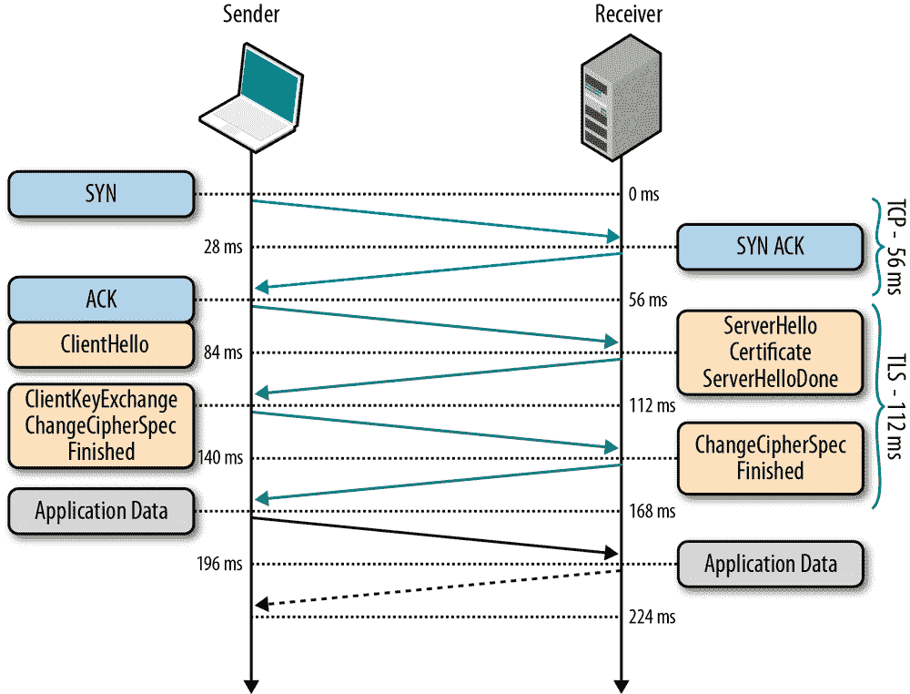

> 以上图片来自 [high-performance-browser(opens new window)](https://www.oreilly.com/library/view/high-performance-browser/9781449344757/ch04.html)

从 `wireshark` 抓包，也可以看到握手的详细流程，建议抓包加强理解，以下是抓包 `https://q.shanyue.tech` 时的握手流程

通过 `curl -vvv --head` 来查看握手信息:

```
$ curl -vvv --head  https://q.shanyue.tech
*   Trying 111.6.180.235...
* TCP_NODELAY set
* Connected to q.shanyue.tech (111.6.180.235) port 443 (#0)
* ALPN, offering h2
* ALPN, offering http/1.1
* successfully set certificate verify locations:
*   CAfile: /etc/ssl/cert.pem
  CApath: none
* TLSv1.2 (OUT), TLS handshake, Client hello (1):
* TLSv1.2 (IN), TLS handshake, Server hello (2):
* TLSv1.2 (IN), TLS handshake, Certificate (11):
* TLSv1.2 (IN), TLS handshake, Server key exchange (12):
* TLSv1.2 (IN), TLS handshake, Server finished (14):
* TLSv1.2 (OUT), TLS handshake, Client key exchange (16):
* TLSv1.2 (OUT), TLS change cipher, Change cipher spec (1):
* TLSv1.2 (OUT), TLS handshake, Finished (20):
* TLSv1.2 (IN), TLS change cipher, Change cipher spec (1):
* TLSv1.2 (IN), TLS handshake, Finished (20):
* SSL connection using TLSv1.2 / ECDHE-RSA-AES128-GCM-SHA256
* ALPN, server accepted to use h2
* Server certificate:
*  subject: CN=q.shanyue.tech
*  start date: Dec  2 00:00:00 2019 GMT
*  expire date: Dec  1 12:00:00 2020 GMT
*  subjectAltName: host "q.shanyue.tech" matched cert's "q.shanyue.tech"
*  issuer: C=US; O=DigiCert Inc; OU=www.digicert.com; CN=Encryption Everywhere DV TLS CA - G1
*  SSL certificate verify ok.
* Using HTTP2, server supports multi-use
* Connection state changed (HTTP/2 confirmed)
* Copying HTTP/2 data in stream buffer to connection buffer after upgrade: len=0
* Using Stream ID: 1 (easy handle 0x7f95ba80dc00) 
```

## 握手过程

在 TLS 1.2 中，握手协议过程需要耗费两个 RTT，过程如下

1.  [OUT] Client Hello，客户端选出自身支持的 TLS 版本号、`cipher suites`、一个随机数、SessionId 传送给服务器端 (有可能可服用 Session)
2.  [IN] Server Hello，服务器端选出双方都支持的 TLS 版本，`cipher suite` 、一个随机数、SeesionId 给客户端
3.  [IN] Certificate，服务器端给客户端发送证书，用以身份验证及提供公钥
4.  [IN] Server Key Exchange，服务器端给客户端发送秘钥交换算法的一些参数
5.  [IN] Server Finished
6.  [OUT] Client Key Exchange，客户端给服务器端发送秘钥交换算法的一些参数，计算出预备主密钥 (pre master key)，作为随机数传递给服务器端 (这个随机数是安全的)。双方根据三个随机数生成对称加密中的秘钥
7.  [OUT] Change Cipher Spec，告知对方以后的消息将要使用 TLS 记录层协议进行加密
8.  [OUT] Finished，发送第一条加密的消息并完整性验证
9.  [IN] Change Cipher Spec，告知以后的消息将要使用 TLS 记录层协议进行加密
10.  [IN] Finished，发送第一条加密的消息并完整性验证

## 相关链接

*   [https 握手流程详解(opens new window)](https://juejin.im/post/6844904135230390279#heading-10)
*   [Chapter 4\. Transport Layer Security (TLS)(opens new window)](https://www.oreilly.com/library/view/high-performance-browser/9781449344757/ch04.html)

# 简单介绍一下 RSA 算法

> 原文：[https://q.shanyue.tech/base/http/397.html](https://q.shanyue.tech/base/http/397.html)

Issue

欢迎在 Gtihub Issue 中回答此问题: [Issue 397(opens new window)](https://github.com/shfshanyue/Daily-Question/issues/397)

# https 层可以做哪些性能优化

> 原文：[https://q.shanyue.tech/base/http/398.html](https://q.shanyue.tech/base/http/398.html)

Issue

欢迎在 Gtihub Issue 中回答此问题: [Issue 398(opens new window)](https://github.com/shfshanyue/Daily-Question/issues/398)

Author

回答者: [shfshanyue(opens new window)](https://github.com/shfshanyue)

[https://time.geekbang.org/column/article/111287(opens new window)](https://time.geekbang.org/column/article/111287)

# ECDHE 与 RSA 有何区别

> 原文：[https://q.shanyue.tech/base/http/399.html](https://q.shanyue.tech/base/http/399.html)

Issue

欢迎在 Gtihub Issue 中回答此问题: [Issue 399(opens new window)](https://github.com/shfshanyue/Daily-Question/issues/399)

# https 中证书的格式化信息有哪些

> 原文：[https://q.shanyue.tech/base/http/401.html](https://q.shanyue.tech/base/http/401.html)

Issue

欢迎在 Gtihub Issue 中回答此问题: [Issue 401(opens new window)](https://github.com/shfshanyue/Daily-Question/issues/401)

Author

回答者: [shfshanyue(opens new window)](https://github.com/shfshanyue)

在 TLS 握手过程中，服务器端需要给客户端提供证书，**X.509 就是证书的标准格式。**

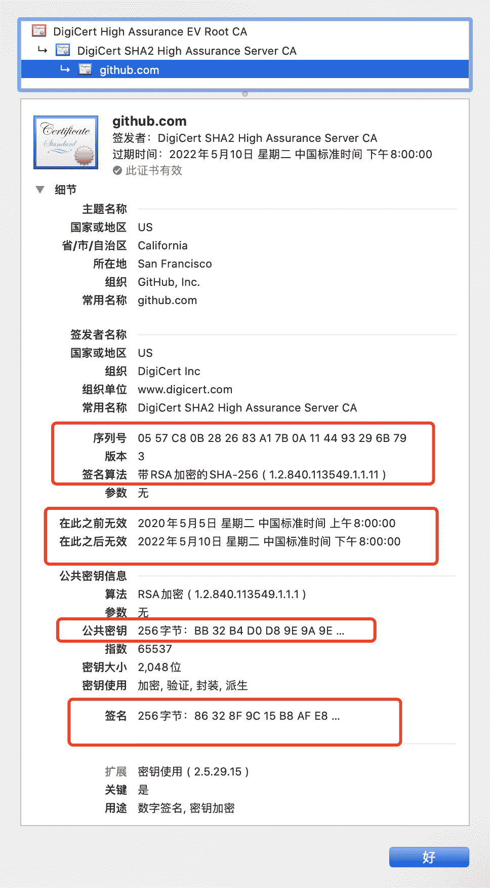

以下是 github 的证书在 Mac 上显示的内容，可见：

1.  序列号
2.  Subject Name
3.  Issuer Name
4.  电子签名
5.  签名算法
6.  公钥
7.  扩展

## 相关链接

*   [What Is an X.509 Certificate?(opens new window)](https://www.ssl.com/faqs/what-is-an-x-509-certificate/)

# https 连接时如何保证证书没被废弃掉

> 原文：[https://q.shanyue.tech/base/http/402.html](https://q.shanyue.tech/base/http/402.html)

Issue

欢迎在 Gtihub Issue 中回答此问题: [Issue 402(opens new window)](https://github.com/shfshanyue/Daily-Question/issues/402)

Author

回答者: [shfshanyue(opens new window)](https://github.com/shfshanyue)

两种方式：

1.  CRL（Certificate Revocation List，证书撤销名单）。PKI 体系中由 CA 维护的一个被撤销证书的列表，浏览器会定时拉取这个文件。但这个文件的实时性及性能都可能有问题
2.  OCSP（Online Certificate Status Protocol，在线证书状态协议）。客户端通过 OSCP 服务请求接口来判断某个证书是否有效

# TLS1.3 相比 TLS1.2 有何不同

> 原文：[https://q.shanyue.tech/base/http/403.html](https://q.shanyue.tech/base/http/403.html)

Issue

欢迎在 Gtihub Issue 中回答此问题: [Issue 403(opens new window)](https://github.com/shfshanyue/Daily-Question/issues/403)

Author

回答者: [shfshanyue(opens new window)](https://github.com/shfshanyue)

以下摘自 [RFC 5246: TLS 1.2(opens new window)](https://tools.ietf.org/html/rfc5246#section-7.3)

```
 Client                                               Server

      ClientHello                  -------->
                                                      ServerHello
                                                     Certificate*
                                               ServerKeyExchange*
                                              CertificateRequest*
                                   <--------      ServerHelloDone
      Certificate*
      ClientKeyExchange
      CertificateVerify*
      [ChangeCipherSpec]
      Finished                     -------->
                                               [ChangeCipherSpec]
                                   <--------             Finished
      Application Data             <------->     Application Data

             Figure 1\.  Message flow for a full handshake

   * Indicates optional or situation-dependent messages that are not
   always sent. 
```

以下摘自 [RFC 8446: TLS 1.3(opens new window)](https://tools.ietf.org/html/rfc8446)

```
 Client                                           Server

Key  ^ ClientHello
Exch | + key_share*
     | + signature_algorithms*
     | + psk_key_exchange_modes*
     v + pre_shared_key*       -------->
                                                  ServerHello  ^ Key
                                                 + key_share*  | Exch
                                            + pre_shared_key*  v
                                        {EncryptedExtensions}  ^  Server
                                        {CertificateRequest*}  v  Params
                                               {Certificate*}  ^
                                         {CertificateVerify*}  | Auth
                                                   {Finished}  v
                               <--------  [Application Data*]
     ^ {Certificate*}
Auth | {CertificateVerify*}
     v {Finished}              -------->
       [Application Data]      <------->  [Application Data]

              +  Indicates noteworthy extensions sent in the
                 previously noted message.

              *  Indicates optional or situation-dependent
                 messages/extensions that are not always sent.

              {} Indicates messages protected using keys
                 derived from a [sender]_handshake_traffic_secret.

              [] Indicates messages protected using keys
                 derived from [sender]_application_traffic_secret_N.

               Figure 1: Message Flow for Full TLS Handshake 
```

1.  握手时间从以前的 2RTT 缩短到 1RTT，通过 `Pre shared-key` 减少了单独的 ServerKeyExchange 与 ClientKeyExchange 消耗的一个 RTT
2.  0-RTT Resumption

# 在 wireshark 中如何抓包 https/http2

> 原文：[https://q.shanyue.tech/base/http/405.html](https://q.shanyue.tech/base/http/405.html)

Issue

欢迎在 Gtihub Issue 中回答此问题: [Issue 405(opens new window)](https://github.com/shfshanyue/Daily-Question/issues/405)

Author

回答者: [shfshanyue(opens new window)](https://github.com/shfshanyue)

参考: [https://imququ.com/post/http2-traffic-in-wireshark.html(opens new window)](https://imququ.com/post/http2-traffic-in-wireshark.html)

# 在 TLS 层如何优化网站性能

> 原文：[https://q.shanyue.tech/base/http/408.html](https://q.shanyue.tech/base/http/408.html)

Issue

欢迎在 Gtihub Issue 中回答此问题: [Issue 408(opens new window)](https://github.com/shfshanyue/Daily-Question/issues/408)

Author

回答者: [shfshanyue(opens new window)](https://github.com/shfshanyue)

1.  OSCP Stapling
2.  TLS 1.3

# DV、OV、EV 类的证书有何区别

> 原文：[https://q.shanyue.tech/base/http/426.html](https://q.shanyue.tech/base/http/426.html)

Issue

欢迎在 Gtihub Issue 中回答此问题: [Issue 426(opens new window)](https://github.com/shfshanyue/Daily-Question/issues/426)

Author

回答者: [shfshanyue(opens new window)](https://github.com/shfshanyue)

*   `Domain Validation`，最低级别的证书校验，Lets Encrypt 就是这种，因此也不怎么需要花钱
*   `Organization Validation`，校验证书中组织身份，从中可以看出公司名称，所在地等信息
*   `Extended Validation`，最高级别的证书校验

# https 中是如何进行身份认证的

> 原文：[https://q.shanyue.tech/base/http/427.html](https://q.shanyue.tech/base/http/427.html)

Issue

欢迎在 Gtihub Issue 中回答此问题: [Issue 427(opens new window)](https://github.com/shfshanyue/Daily-Question/issues/427)

Author

回答者: [shfshanyue(opens new window)](https://github.com/shfshanyue)

电子签名

# http 状态码 401 和 403 有什么区别

> 原文：[https://q.shanyue.tech/base/http/438.html](https://q.shanyue.tech/base/http/438.html)

Issue

欢迎在 Gtihub Issue 中回答此问题: [Issue 438(opens new window)](https://github.com/shfshanyue/Daily-Question/issues/438)

Author

回答者: [Kiera569(opens new window)](https://github.com/Kiera569)

401 --- unAuthorized
403 --- forbidden 区别：前者需要用户验证，验证成功之后服务器会执行请求。 后者是服务器理解请求，但是拒绝执行。跟用户验证没有关系，服务器主动拒绝执行请求。

# 当服务器资源返回 304 时与那些 HTTP 响应头有关

> 原文：[https://q.shanyue.tech/base/http/441.html](https://q.shanyue.tech/base/http/441.html)

Issue

欢迎在 Gtihub Issue 中回答此问题: [Issue 441(opens new window)](https://github.com/shfshanyue/Daily-Question/issues/441)

Author

回答者: [buzuosheng(opens new window)](https://github.com/buzuosheng)

304 Not Modified，表示资源没有发生过改变。 与协商缓存有关，也就是 Last-Modify 和 Etag 两个 http 响应头，在获取资源之前先判断缓存资源是否发生过改变。 no-cache 表示使用缓存资源时，都向服务器请求验证。 no-store 才表示不使用任何形式的缓存。

# http3 解决了什么问题

> 原文：[https://q.shanyue.tech/base/http/450.html](https://q.shanyue.tech/base/http/450.html)

Issue

欢迎在 Gtihub Issue 中回答此问题: [Issue 450(opens new window)](https://github.com/shfshanyue/Daily-Question/issues/450)

Author

回答者: [shfshanyue(opens new window)](https://github.com/shfshanyue)

`http3` 基于 `UDP` 协议，这是与以前版本的 http 最大的不同，可以解决 http2 TCP 连接阻塞的问题。

Author

回答者: [marsk6(opens new window)](https://github.com/marsk6)

我们都知道 `UDP` 不可靠，那么如何保证连接传输的`可靠性`？

# SameSite Cookie 有哪些值，是如何预防 CSRF 攻击的

> 原文：[https://q.shanyue.tech/base/http/569.html](https://q.shanyue.tech/base/http/569.html)

Issue

欢迎在 Gtihub Issue 中回答此问题: [Issue 569(opens new window)](https://github.com/shfshanyue/Daily-Question/issues/569)

Author

回答者: [shfshanyue(opens new window)](https://github.com/shfshanyue)

> 见文档 [SameSite Cookie - MDN(opens new window)](https://developer.mozilla.org/en-US/docs/Web/HTTP/Headers/Set-Cookie/SameSite) 见文章 [Cookie 的 SameSite 属性(opens new window)](http://www.ruanyifeng.com/blog/2019/09/cookie-samesite.html)

*   None: 任何情况下都会向第三方网站请求发送 Cookie
*   Lax: 只有导航到第三方网站的 Get 链接会发送 Cookie，跨域的图片、iframe、form 表单都不会发送 Cookie
*   Strict: 任何情况下都不会向第三方网站请求发送 Cookie

目前，主流浏览器 Same-Site 的默认值为 `Lax`，而在以前是 `None`，将会预防大部分 CSRF 攻击，如果需要手动指定 `Same-Site` 为 `None`，需要指定 Cookie 属性 `Secure`，即在 https 下发送

# Data URL 的应用场景及如何生成

> 原文：[https://q.shanyue.tech/base/http/575.html](https://q.shanyue.tech/base/http/575.html)

Issue

欢迎在 Gtihub Issue 中回答此问题: [Issue 575(opens new window)](https://github.com/shfshanyue/Daily-Question/issues/575)

Author

回答者: [shfshanyue(opens new window)](https://github.com/shfshanyue)

Data URLs 由四个部分组成：

1.  前缀(data:)
2.  指示数据类型的 MIME 类型
3.  如果二进制数据则为可选的 base64 标记，比如图片
4.  数据

```
data:[<mediatype>][;base64],<data> 
```

Author

回答者: [Asarua(opens new window)](https://github.com/Asarua)

1.  base 数据
2.  生成设备指纹

# HTTP 响应头 cache-control: s-maxage=0 是什么意思

> 原文：[https://q.shanyue.tech/base/http/594.html](https://q.shanyue.tech/base/http/594.html)

Issue

欢迎在 Gtihub Issue 中回答此问题: [Issue 594(opens new window)](https://github.com/shfshanyue/Daily-Question/issues/594)

Author

回答者: [maya1900(opens new window)](https://github.com/maya1900)

缓存立即失效

# http 缓存控制中 Cach-Control 为 public 与 private 有何区别

> 原文：[https://q.shanyue.tech/base/http/595.html](https://q.shanyue.tech/base/http/595.html)

Issue

欢迎在 Gtihub Issue 中回答此问题: [Issue 595(opens new window)](https://github.com/shfshanyue/Daily-Question/issues/595)

Author

回答者: [Kiera569(opens new window)](https://github.com/Kiera569)

cache-control:默认值是 private, privite 响应只能为私有缓存，不能在用户间共享 public 公有缓存，可以在多用户间共享

# http 方法 get 与 post 有何区别

> 原文：[https://q.shanyue.tech/base/http/596.html](https://q.shanyue.tech/base/http/596.html)

Issue

欢迎在 Gtihub Issue 中回答此问题: [Issue 596(opens new window)](https://github.com/shfshanyue/Daily-Question/issues/596)

Author

回答者: [haotie1990(opens new window)](https://github.com/haotie1990)

*   GET 在浏览器回退时是无害的，而 POST 会再次提交请求。

*   GET 产生的 URL 地址可以被 Bookmark，而 POST 不可以。

*   GET 请求会被浏览器主动 cache，而 POST 不会，除非手动设置。

*   GET 请求只能进行 url 编码，而 POST 支持多种编码方式。

*   GET 请求参数会被完整保留在浏览器历史记录里，而 POST 中的参数不会被保留。

*   GET 请求在 URL 中传送的参数是有长度限制的，而 POST 么有。

*   对参数的数据类型，GET 只接受 ASCII 字符，而 POST 没有限制。

*   GET 比 POST 更不安全，因为参数直接暴露在 URL 上，所以不能用来传递敏感信息。

*   GET 参数通过 URL 传递，POST 放在 Request body 中。

*   **GET 产生一个 TCP 数据包；POST 产生两个 TCP 数据包**。

Author

回答者: [shfshanyue(opens new window)](https://github.com/shfshanyue)

TODO

Author

回答者: [shfshanyue(opens new window)](https://github.com/shfshanyue)

@haotie1990 GET 产生一个 TCP 数据包；POST 产生两个 TCP 数据包。这句话不准确吧

Author

回答者: [haotie1990(opens new window)](https://github.com/haotie1990)

> @haotie1990 GET 产生一个 TCP 数据包；POST 产生两个 TCP 数据包。这句话不准确吧

POST 请求，header 和 body 时分两次发送的

[https://blog.josephscott.org/2009/08/27/xmlhttprequest-xhr-uses-multiple-packets-for-http-post/(opens new window)](https://blog.josephscott.org/2009/08/27/xmlhttprequest-xhr-uses-multiple-packets-for-http-post/)

# http 状态码 204 使用在什么场景

> 原文：[https://q.shanyue.tech/base/http/599.html](https://q.shanyue.tech/base/http/599.html)

Issue

欢迎在 Gtihub Issue 中回答此问题: [Issue 599(opens new window)](https://github.com/shfshanyue/Daily-Question/issues/599)

Author

回答者: [shfshanyue(opens new window)](https://github.com/shfshanyue)

1.  `Head Method`
2.  `Options Method`
3.  打点

# 现代前端应用应如何配置 HTTP 缓存机制

> 原文：[https://q.shanyue.tech/base/http/600.html](https://q.shanyue.tech/base/http/600.html)

Issue

欢迎在 Gtihub Issue 中回答此问题: [Issue 600(opens new window)](https://github.com/shfshanyue/Daily-Question/issues/600)

Author

回答者: [shfshanyue(opens new window)](https://github.com/shfshanyue)

> 参考: [前端项目中的缓存配置(opens new window)](https://shanyue.tech/frontend-engineering/http-cache.html)

关于 http 缓存配置的最佳实践为以下两条：

1.  文件路径中带有 hash 值：一年的强缓存。因为该文件的内容发生变化时，会生成一个带有新的 hash 值的 URL。前端将会发起一个新的 URL 的请求。配置响应头 `Cache-Control: public,max-age=31536000,immutable`
2.  文件路径中不带有 hash 值：协商缓存。大部分为 `public` 下文件。配置响应头 `Cache-Control: no-cache` 与 `etag/last-modified`

但是当处理永久缓存时，切记不可打包为一个大的 `bundle.js`，此时一行业务代码的改变，将导致整个项目的永久缓存失效，此时需要按代码更新频率分为多个 chunk 进行打包，可细粒度控制缓存。


1.  `webpack-runtime`: 应用中的 `webpack` 的版本比较稳定，分离出来，保证长久的永久缓存
2.  `react/react-dom`: `react` 的版本更新频次也较低
3.  `vendor`: 常用的第三方模块打包在一起，如 `lodash`，`classnames` 基本上每个页面都会引用到，但是它们的更新频率会更高一些。另外对低频次使用的第三方模块不要打进来
4.  `pageA`: A 页面，当 A 页面的组件发生变更后，它的缓存将会失效
5.  `pageB`: B 页面
6.  `echarts`: 不常用且过大的第三方模块单独打包
7.  `mathjax`: 不常用且过大的第三方模块单独打包
8.  `jspdf`: 不常用且过大的第三方模块单独打包

在 `webpack5` 中可以使用以下配置:

```
{
  // Automatically split vendor and commons
  // https://twitter.com/wSokra/status/969633336732905474
  // https://medium.com/webpack/webpack-4-code-splitting-chunk-graph-and-the-splitchunks-optimization-be739a861366
  splitChunks: {
    chunks: 'all',
  },
  // Keep the runtime chunk separated to enable long term caching
  // https://twitter.com/wSokra/status/969679223278505985
  // https://github.com/facebook/create-react-app/issues/5358
  runtimeChunk: {
    name: entrypoint => `runtime-${entrypoint.name}`,
  },
} 
```

# 如何确保你们的项目开启了 gzip

> 原文：[https://q.shanyue.tech/base/http/601.html](https://q.shanyue.tech/base/http/601.html)

更多描述

当你们的项目上线后，如何查看它是否开启了 gzip

Issue

欢迎在 Gtihub Issue 中回答此问题: [Issue 601(opens new window)](https://github.com/shfshanyue/Daily-Question/issues/601)

Author

回答者: [shfshanyue(opens new window)](https://github.com/shfshanyue)

在响应头中查看是否有以下值：

```
content-encoding: gzip 
```

# HTTP 有哪些常见的请求头和响应头

> 原文：[https://q.shanyue.tech/base/http/602.html](https://q.shanyue.tech/base/http/602.html)

Issue

欢迎在 Gtihub Issue 中回答此问题: [Issue 602(opens new window)](https://github.com/shfshanyue/Daily-Question/issues/602)

# 什么是 HSTS

> 原文：[https://q.shanyue.tech/base/http/604.html](https://q.shanyue.tech/base/http/604.html)

Issue

欢迎在 Gtihub Issue 中回答此问题: [Issue 604(opens new window)](https://github.com/shfshanyue/Daily-Question/issues/604)

Author

回答者: [haotie1990(opens new window)](https://github.com/haotie1990)

HSTS 是 HTTP 严格传输安全（HTTP Strict Transport Security） 的缩写。 这是一种网站用来声明他们只能使用安全连接（HTTPS）访问的方法。 如果一个网站声明了 HSTS 策略，浏览器必须拒绝所有的 HTTP 连接并阻止用户接受不安全的 SSL 证书

[https://zhuanlan.zhihu.com/p/130946490(opens new window)](https://zhuanlan.zhihu.com/p/130946490)

Author

回答者: [shfshanyue(opens new window)](https://github.com/shfshanyue)

TODO

# http 中 referer 请求头是做什么的

> 原文：[https://q.shanyue.tech/base/http/605.html](https://q.shanyue.tech/base/http/605.html)

Issue

欢迎在 Gtihub Issue 中回答此问题: [Issue 605(opens new window)](https://github.com/shfshanyue/Daily-Question/issues/605)

Author

回答者: [shfshanyue(opens new window)](https://github.com/shfshanyue)

判断该网页的来源地址

1.  打点
2.  防盗链

# 在 nginx 中如何配置 HTTP 协商缓存

> 原文：[https://q.shanyue.tech/base/http/634.html](https://q.shanyue.tech/base/http/634.html)

Issue

欢迎在 Gtihub Issue 中回答此问题: [Issue 634(opens new window)](https://github.com/shfshanyue/Daily-Question/issues/634)

Author

回答者: [shfshanyue(opens new window)](https://github.com/shfshanyue)

Nginx 中在 1.3.3 后已默认开启了协商缓存，手动配置如下：

```
location /public {
    add_header Cache-Control no-cache;
    etag on;
    if_modified_since exact;
} 
```

# 什么是 base64 与 URL Safe base64

> 原文：[https://q.shanyue.tech/base/http/635.html](https://q.shanyue.tech/base/http/635.html)

Issue

欢迎在 Gtihub Issue 中回答此问题: [Issue 635(opens new window)](https://github.com/shfshanyue/Daily-Question/issues/635)

Author

回答者: [shfshanyue(opens new window)](https://github.com/shfshanyue)

`base64` 由 `0-9`、`A-Z`、`a-z` 及 `+`、`/` 组成，但是在 URL 中使用 `base64` 时，`/` 容易与路径符号发生冲突。

因此，URL Safe Base64 将 `+` 替换为 `_`，`/` 替换为 `-`。

# HTTP 与 TCP 中的 keep-alive 各是什么

> 原文：[https://q.shanyue.tech/base/http/657.html](https://q.shanyue.tech/base/http/657.html)

Issue

欢迎在 Gtihub Issue 中回答此问题: [Issue 657(opens new window)](https://github.com/shfshanyue/Daily-Question/issues/657)

# http 各个版本间各有什么改进

> 原文：[https://q.shanyue.tech/base/http/668.html](https://q.shanyue.tech/base/http/668.html)

Issue

欢迎在 Gtihub Issue 中回答此问题: [Issue 668(opens new window)](https://github.com/shfshanyue/Daily-Question/issues/668)

# 简述 http3，http3 解决了什么问题

> 原文：[https://q.shanyue.tech/base/http/669.html](https://q.shanyue.tech/base/http/669.html)

Issue

欢迎在 Gtihub Issue 中回答此问题: [Issue 669(opens new window)](https://github.com/shfshanyue/Daily-Question/issues/669)

Author

回答者: [mingshengxiao(opens new window)](https://github.com/mingshengxiao)

http3 是基于 UDP 协议的。 它主要解决了 http1.1 和 http2 都存在的队头阻塞，TCP 和 TLS 的握手时延问题。

# http2 中 Stream 与 Frame 是什么关系

> 原文：[https://q.shanyue.tech/base/http/670.html](https://q.shanyue.tech/base/http/670.html)

Issue

欢迎在 Gtihub Issue 中回答此问题: [Issue 670(opens new window)](https://github.com/shfshanyue/Daily-Question/issues/670)

Author

回答者: [shfshanyue(opens new window)](https://github.com/shfshanyue)

*   Stream 为 Request/Response 报文的双向通道，一个完整资源的请求与相应是一个 stream，特殊的 stream 作为 Settings、Window_Update 等 Frame 发送的通道
*   Frame 为 http2 通信的最小单位，有 Data、Headers 等，一个 Stream 包含多个 Frame，如一条 http 请求包含 Header、Data Frame 等

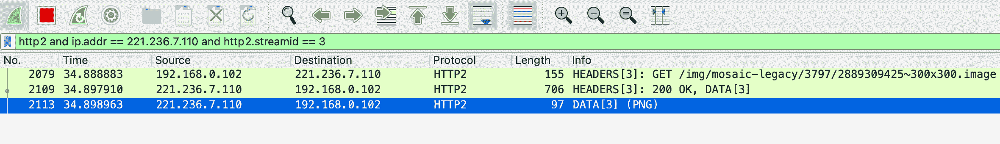


# 什么是点击劫持(ClickJacking)，如何预防

> 原文：[https://q.shanyue.tech/base/http/676.html](https://q.shanyue.tech/base/http/676.html)

Issue

欢迎在 Gtihub Issue 中回答此问题: [Issue 676(opens new window)](https://github.com/shfshanyue/Daily-Question/issues/676)

Author

回答者: [shfshanyue(opens new window)](https://github.com/shfshanyue)

可以使用 HTTP X-Frame-Options 响应头以及 `CSP: frame-ancestors` 指令，避免**自己网站被当做 iframe 嵌入到非法网站引导用户点击**

```
X-Frame-Options: DENY
X-Frame-Options: SAMEORIGIN 
```

或者使用 CSP 的指令 `frame-ancestors` 进行预防

```
Content-Security-Policy: frame-ancestors 'none';
Content-Security-Policy: frame-ancestors 'self' https://www.example.org; 
```

同时，也可以使用 Javascript 进行控制，当发现自身网站置于 iframe 中时，将不予展现

```
<head> </head>
<body>
  <script> // 如果发现现在是在 iframe 中
    if (self !== top) {
      document.write("");
    } </script>
</body> 
```

Author

回答者: [shfshanyue(opens new window)](https://github.com/shfshanyue)

# https 如何被抓包，原理是什么

> 原文：[https://q.shanyue.tech/base/http/706.html](https://q.shanyue.tech/base/http/706.html)

Issue

欢迎在 Gtihub Issue 中回答此问题: [Issue 706(opens new window)](https://github.com/shfshanyue/Daily-Question/issues/706)

Author

回答者: [shfshanyue(opens new window)](https://github.com/shfshanyue)

TODO

# OSCP Stapling 是什么

> 原文：[https://q.shanyue.tech/base/http/718.html](https://q.shanyue.tech/base/http/718.html)

Issue

欢迎在 Gtihub Issue 中回答此问题: [Issue 718(opens new window)](https://github.com/shfshanyue/Daily-Question/issues/718)

# http client 中如何得知已接收完所有响应数据

> 原文：[https://q.shanyue.tech/base/http/722.html](https://q.shanyue.tech/base/http/722.html)

Issue

欢迎在 Gtihub Issue 中回答此问题: [Issue 722(opens new window)](https://github.com/shfshanyue/Daily-Question/issues/722)

# websocket 和短轮询有什么区别

> 原文：[https://q.shanyue.tech/base/http/765.html](https://q.shanyue.tech/base/http/765.html)

Issue

欢迎在 Gtihub Issue 中回答此问题: [Issue 765(opens new window)](https://github.com/shfshanyue/Daily-Question/issues/765)

Author

回答者: [zhiyuan5985(opens new window)](https://github.com/zhiyuan5985)

短轮询是每隔一段时间发送一次 HTTP 请求，WebSocket 是全双工通讯的协议，允许服务端主动向客户端推送数据。短轮询的实时性不高，而且影响性能，而 WebSocket 做到了真正意义上的实时。

# 我们上传图片为 Blob/File 对象时，是如何向服务器端传送数据的

> 原文：[https://q.shanyue.tech/base/http/773.html](https://q.shanyue.tech/base/http/773.html)

Issue

欢迎在 Gtihub Issue 中回答此问题: [Issue 773(opens new window)](https://github.com/shfshanyue/Daily-Question/issues/773)