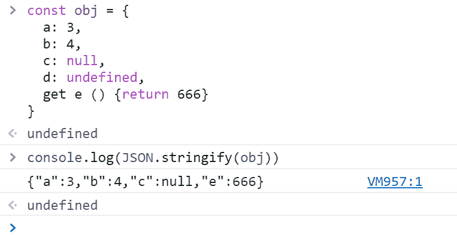
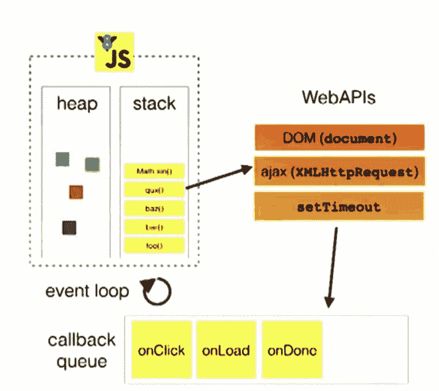
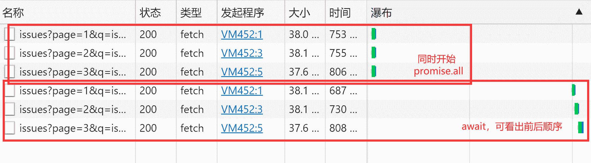
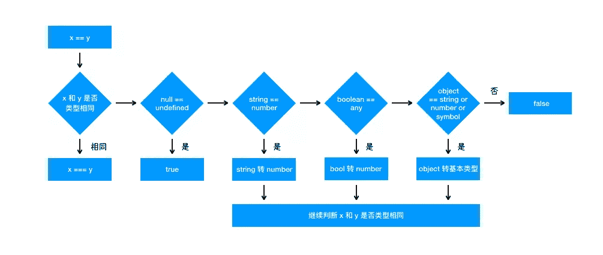
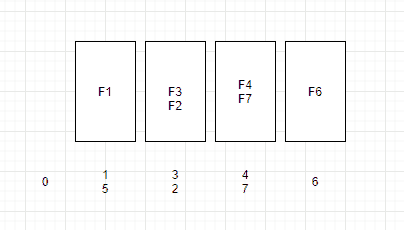
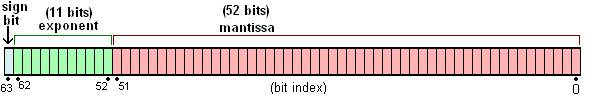
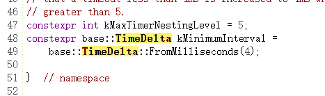

<!--yml
category: 前端
date: 0001-01-01 00:00:00
-->

# JavaScript 面试题（山月）

# 什么是防抖和节流，他们的应用场景有哪些

> 原文：[https://q.shanyue.tech/fe/js/3.html](https://q.shanyue.tech/fe/js/3.html)

Issue

欢迎在 Gtihub Issue 中回答此问题: [Issue 3(opens new window)](https://github.com/shfshanyue/Daily-Question/issues/3)

Author

回答者: [xiaoai7904(opens new window)](https://github.com/xiaoai7904)

#### 防抖(debounce)

触发高频事件后 n 秒内函数只会执行一次，如果 n 秒内高频事件再次被触发，则重新计算时间

##### 示例代码

```
// 防抖函数
function debounce(fn, wait) {
  let timer;
  return function () {
    let _this = this;
    let args = arguments;
    if (timer) {
      clearTimeout(timer);
    }
    timer = setTimeout(function () {
      fn.apply(_this, args);
    }, wait);
  };
}
// 使用
window.onresize = debounce(function () {
  console.log("resize");
}, 500); 
```

#### 节流(throttle)

高频事件触发，但在 n 秒内只会执行一次，所以节流会稀释函数的执行频率

##### 示例代码

```
// 方式1: 使用时间戳
function throttle1(fn, wait) {
  let time = 0;
  return function () {
    let _this = this;
    let args = arguments;
    let now = Date.now();
    if (now - time > wait) {
      fn.apply(_this, args);
      time = now;
    }
  };
}
// 方式2: 使用定时器
function thorttle2(fn, wait) {
  let timer;
  return function () {
    let _this = this;
    let args = arguments;

    if (!timer) {
      timer = setTimeout(function () {
        timer = null;
        fn.apply(_this, args);
      }, wait);
    }
  };
} 
```

上面`节流`和`防抖`实现方式比较简单，但是已经可以满足日常使用，如果想更近一步了解可以查看[underscore(opens new window)](https://www.bootcss.com/p/underscore/)和[lodash(opens new window)](https://www.lodashjs.com/docs/latest)文档中`debounce`和`thorttle`

Author

回答者: [shfshanyue(opens new window)](https://github.com/shfshanyue)

## 防抖 (debounce)

防抖，顾名思义，防止抖动，以免把一次事件误认为多次，敲键盘就是一个每天都会接触到的防抖操作。

想要了解一个概念，必先了解概念所应用的场景。在 JS 这个世界中，有哪些防抖的场景呢

1.  登录、发短信等按钮避免用户点击太快，以致于发送了多次请求，需要防抖
2.  调整浏览器窗口大小时，resize 次数过于频繁，造成计算过多，此时需要一次到位，就用到了防抖
3.  文本编辑器实时保存，当无任何更改操作一秒后进行保存

代码如下，可以看出来**防抖重在清零 `clearTimeout(timer)`**

```
function debounce(f, wait) {
  let timer;
  return (...args) => {
    clearTimeout(timer);
    timer = setTimeout(() => {
      f(...args);
    }, wait);
  };
} 
```

## 节流 (throttle)

节流，顾名思义，控制水的流量。控制事件发生的频率，如控制为 1s 发生一次，甚至 1 分钟发生一次。与服务端(server)及网关(gateway)控制的限流 (Rate Limit) 类似。

1.  `scroll` 事件，每隔一秒计算一次位置信息等
2.  浏览器播放事件，每个一秒计算一次进度信息等
3.  input 框实时搜索并发送请求展示下拉列表，每隔一秒发送一次请求 (也可做防抖)

代码如下，可以看出来**节流重在加锁 `timer=timeout`**

```
function throttle(f, wait) {
  let timer;
  return (...args) => {
    if (timer) {
      return;
    }
    timer = setTimeout(() => {
      f(...args);
      timer = null;
    }, wait);
  };
} 
```

## 总结 (简要答案)

*   防抖：防止抖动，单位时间内事件触发会被重置，避免事件被误伤触发多次。**代码实现重在清零 `clearTimeout`**。防抖可以比作等电梯，只要有一个人进来，就需要再等一会儿。业务场景有避免登录按钮多次点击的重复提交。
*   节流：控制流量，单位时间内事件只能触发一次，与服务器端的限流 (Rate Limit) 类似。**代码实现重在开锁关锁 `timer=timeout; timer=null`**。节流可以比作过红绿灯，每等一个红灯时间就可以过一批。

Author

回答者: [Janezhang650(opens new window)](https://github.com/Janezhang650)

你好，向请问一下防抖函数的`let _this = this`的作用是什么，这里的`this`不是都指向 window 吗？小白求指教，谢谢！！！

Author

回答者: [0124z(opens new window)](https://github.com/0124z)

防抖函数里面有可能有 this 相关的语句，this 必须指向调用它的对象，而定时器里面指向全局对象 window 是不合适的。

# 如何实现一个简单的 Promise

> 原文：[https://q.shanyue.tech/fe/js/23.html](https://q.shanyue.tech/fe/js/23.html)

Issue

欢迎在 Gtihub Issue 中回答此问题: [Issue 23(opens new window)](https://github.com/shfshanyue/Daily-Question/issues/23)

Author

回答者: [shfshanyue(opens new window)](https://github.com/shfshanyue)

一个简单的 `Promise` 的粗糙实现，关键点在于

1.  当 `pending` 时， `thenable` 函数由一个队列维护
2.  当状态变为 `resolved(fulfilled)` 时，队列中所有 `thenable` 函数执行
3.  当 `resolved` 时， `thenable` 函数直接执行

`rejected` 状态同理

```
class Prom {
  static resolve(value) {
    if (value && value.then) {
      return value;
    }
    return new Prom((resolve) => resolve(value));
  }

  constructor(fn) {
    this.value = undefined;
    this.reason = undefined;
    this.status = "PENDING";

    // 维护一个 resolve/pending 的函数队列
    this.resolveFns = [];
    this.rejectFns = [];

    const resolve = (value) => {
      // 注意此处的 setTimeout
      setTimeout(() => {
        this.status = "RESOLVED";
        this.value = value;
        this.resolveFns.forEach(({ fn, resolve: res, reject: rej }) =>
          res(fn(value))
        );
      });
    };

    const reject = (e) => {
      setTimeout(() => {
        this.status = "REJECTED";
        this.reason = e;
        this.rejectFns.forEach(({ fn, resolve: res, reject: rej }) =>
          rej(fn(e))
        );
      });
    };

    fn(resolve, reject);
  }

  then(fn) {
    if (this.status === "RESOLVED") {
      const result = fn(this.value);
      // 需要返回一个 Promise
      // 如果状态为 resolved，直接执行
      return Prom.resolve(result);
    }
    if (this.status === "PENDING") {
      // 也是返回一个 Promise
      return new Prom((resolve, reject) => {
        // 推进队列中，resolved 后统一执行
        this.resolveFns.push({ fn, resolve, reject });
      });
    }
  }

  catch(fn) {
    if (this.status === "REJECTED") {
      const result = fn(this.value);
      return Prom.resolve(result);
    }
    if (this.status === "PENDING") {
      return new Prom((resolve, reject) => {
        this.rejectFns.push({ fn, resolve, reject });
      });
    }
  }
}

Prom.resolve(10)
  .then((o) => o * 10)
  .then((o) => o + 10)
  .then((o) => {
    console.log(o);
  });

return new Prom((resolve, reject) => reject("Error")).catch((e) => {
  console.log("Error", e);
}); 
```

Author

回答者: [heretic-G(opens new window)](https://github.com/heretic-G)

```
function MyPromise(executor) {
  if (typeof executor !== "function") {
    // throw new Error('Promise resolver 1 is not a function')
  }
  if (this instanceof MyPromise) {
    // throw new Error(`${this} is not a promise`)
  }
  this.PromiseState = "pending";
  this.PromiseFulfillReactions = [];
  this.PromiseRejectReactions = [];
  this.PromiseIsHandled = false;
  this.AlreadyResolved = false;

  let resolve = _Resolve(this);
  let reject = _Reject(this);

  try {
    executor(resolve, reject);
  } catch (e) {
    reject(e);
  }
}

MyPromise.prototype.then = function (onFulfilled, onRejected) {
  let promise = this;
  let capability = NewPromiseCapability();
  return PerformPromiseThen(promise, onFulfilled, onRejected, capability);
};

function _Resolve(promise) {
  return function __Resolve(resolution) {
    if (promise.AlreadyResolved) {
      return undefined;
    }
    promise.AlreadyResolved = true;
    if (resolution === promise) {
      return RejectPromise(promise, TypeError("is same"));
    }
    if (
      (typeof resolution !== "function" && typeof resolution !== "object") ||
      resolution === null
    ) {
      return FulfillPromise(promise, resolution);
    }
    let then;
    try {
      then = resolution.then;
    } catch (e) {
      return RejectPromise(promise, e);
    }
    if (typeof then !== "function") {
      return FulfillPromise(promise, resolution);
    } else {
      let job = NewPromiseResolveThenableJob(promise, resolution, then);
      HostEnqueuePromiseJob(job);
    }
    return undefined;
  };
}

function _Reject(promise) {
  return function __Reject(reason) {
    if (promise.AlreadyResolved) {
      return undefined;
    }
    promise.AlreadyResolved = true;
    RejectPromise(promise, reason);
  };
}

function executor(resolve, reject) {
  this.resolve = resolve;
  this.reject = reject;
}

function NewPromiseCapability() {
  let capability = {
    resolve: undefined,
    reject: undefined,
    promise: undefined,
  };
  capability.promise = new MyPromise(executor.bind(capability));
  return capability;
}

function PerformPromiseThen(
  promise,
  onFulfilled,
  onRejected,
  resultCapability
) {
  let fulfillReaction = {
    Capability: resultCapability,
    Type: "Fulfill",
    Handler: onFulfilled,
  };
  let rejectReaction = {
    Capability: resultCapability,
    Type: "Reject",
    Handler: onRejected,
  };
  if (promise.PromiseState === "pending") {
    promise.PromiseFulfillReactions.push(fulfillReaction);
    promise.PromiseRejectReactions.push(rejectReaction);
  } else if (promise.PromiseState === "fulfilled") {
    let resolution = promise.PromiseResult;
    let job = NewPromiseReactionJob(fulfillReaction, resolution);
    HostEnqueuePromiseJob(job);
  } else {
    if (!promise.PromiseIsHandled) {
    }
    let reason = promise.PromiseResult;
    let job = NewPromiseReactionJob(rejectReaction, reason);
    HostEnqueuePromiseJob(job);
  }
  promise.PromiseIsHandled = true;
  if (!resultCapability) return undefined;
  return resultCapability.promise;
}

function FulfillPromise(promise, resolution) {
  if (promise.PromiseState !== "pending") {
    return undefined;
  }
  let reactions = promise.PromiseFulfillReactions;
  promise.PromiseResult = resolution;
  promise.PromiseRejectReactions = [];
  promise.PromiseFulfillReactions = [];
  promise.PromiseState = "fulfilled";
  TriggerPromiseReactions(reactions, resolution);
}

function RejectPromise(promise, reason) {
  if (promise.PromiseState !== "pending") {
    return undefined;
  }
  let reactions = promise.PromiseRejectReactions;
  promise.PromiseResult = reason;
  promise.PromiseRejectReactions = [];
  promise.PromiseFulfillReactions = [];
  promise.PromiseState = "rejected";
  if (!promise.PromiseIsHandled) {
  }
  TriggerPromiseReactions(reactions, reason);
}

function TriggerPromiseReactions(reactions, argument) {
  reactions.forEach((curr) => {
    let job = NewPromiseReactionJob(curr, argument);
    HostEnqueuePromiseJob(job);
  });
}

function NewPromiseReactionJob(reaction, argument) {
  return function () {
    let capability = reaction.Capability;
    let type = reaction.Type;
    let handler = reaction.Handler;
    let handlerResult;
    let isError = false;
    if (typeof handler !== "function") {
      if (type === "Fulfill") {
        handlerResult = argument;
      } else {
        isError = true;
        handlerResult = argument;
      }
    } else {
      try {
        handlerResult = handler(argument);
      } catch (e) {
        isError = true;
        handlerResult = e;
      }
    }
    if (!capability) return undefined;
    let status;
    if (!isError) {
      status = capability.resolve(handlerResult);
    } else {
      status = capability.reject(handlerResult);
    }
    return status;
  };
}

function NewPromiseResolveThenableJob(promiseToResolve, thenable, then) {
  return function () {
    let resolve = _Resolve(promiseToResolve);
    let reject = _Reject(promiseToResolve);
    promiseToResolve.AlreadyResolved = false;
    let result;
    try {
      result = then.call(thenable, resolve, reject);
    } catch (e) {
      return reject(e);
    }
    return result;
  };
}

function HostEnqueuePromiseJob(job) {
  setTimeout(job, 0);
}

MyPromise.deferred = function () {
  let dfd = {};
  dfd.promise = new MyPromise((resolve, reject) => {
    dfd.resolve = resolve;
    dfd.reject = reject;
  });
  return dfd;
};

module.exports = MyPromise; 
```

Author

回答者: [hsq777(opens new window)](https://github.com/hsq777)

> 一个简单的 `Promise` 的粗糙实现，关键点在于
> 
> 1.  当 `pending` 时， `thenable` 函数由一个队列维护
> 2.  当状态变为 `resolved(fulfilled)` 时，队列中所有 `thenable` 函数执行
> 3.  当 `resolved` 时， `thenable` 函数直接执行
> 
> `rejected` 状态同理
> 
> ```
> class Prom {
>   static resolve(value) {
>     if (value && value.then) {
>       return value;
>     }
>     return new Prom((resolve) => resolve(value));
>   }
> 
>   constructor(fn) {
>     this.value = undefined;
>     this.reason = undefined;
>     this.status = "PENDING";
> 
>     // 维护一个 resolve/pending 的函数队列
>     this.resolveFns = [];
>     this.rejectFns = [];
> 
>     const resolve = (value) => {
>       // 注意此处的 setTimeout
>       setTimeout(() => {
>         this.status = "RESOLVED";
>         this.value = value;
>         this.resolveFns.forEach(({ fn, resolve: res, reject: rej }) =>
>           res(fn(value))
>         );
>       });
>     };
> 
>     const reject = (e) => {
>       setTimeout(() => {
>         this.status = "REJECTED";
>         this.reason = e;
>         this.rejectFns.forEach(({ fn, resolve: res, reject: rej }) =>
>           rej(fn(e))
>         );
>       });
>     };
> 
>     fn(resolve, reject);
>   }
> 
>   then(fn) {
>     if (this.status === "RESOLVED") {
>       const result = fn(this.value);
>       // 需要返回一个 Promise
>       // 如果状态为 resolved，直接执行
>       return Prom.resolve(result);
>     }
>     if (this.status === "PENDING") {
>       // 也是返回一个 Promise
>       return new Prom((resolve, reject) => {
>         // 推进队列中，resolved 后统一执行
>         this.resolveFns.push({ fn, resolve, reject });
>       });
>     }
>   }
> 
>   catch(fn) {
>     if (this.status === "REJECTED") {
>       const result = fn(this.value);
>       return Prom.resolve(result);
>     }
>     if (this.status === "PENDING") {
>       return new Prom((resolve, reject) => {
>         this.rejectFns.push({ fn, resolve, reject });
>       });
>     }
>   }
> }
> 
> Prom.resolve(10)
>   .then((o) => o * 10)
>   .then((o) => o + 10)
>   .then((o) => {
>     console.log(o);
>   });
> 
> return new Prom((resolve, reject) => reject("Error")).catch((e) => {
>   console.log("Error", e);
> }); 
> ```

catch 里面应该是`return Prom.reject(result)`吧

# 在前端开发中，如何获取浏览器的唯一标识

> 原文：[https://q.shanyue.tech/fe/js/28.html](https://q.shanyue.tech/fe/js/28.html)

更多描述

如何获取浏览器的唯一标识，原理是什么

Issue

欢迎在 Gtihub Issue 中回答此问题: [Issue 28(opens new window)](https://github.com/shfshanyue/Daily-Question/issues/28)

Author

回答者: [shfshanyue(opens new window)](https://github.com/shfshanyue)

由于不同的系统显卡绘制 `canvas` 时渲染参数、抗锯齿等算法不同，因此绘制成图片数据的 `CRC` 校验也不一样。

```
function getCanvasFp() {
  const canvas = document.getElementById("canvas");
  const ctx = canvas.getContext("2d");
  ctx.font = "14px Arial";
  ctx.fillStyle = "#ccc";
  ctx.fillText("hello, shanyue", 2, 2);
  return canvas.toDataURL("image/jpeg");
} 
```

因此根据 `canvas` 可以获取浏览器指纹信息。

1.  绘制 `canvas`，获取 `base64` 的 dataurl
2.  对 dataurl 这个字符串进行 `md5` 摘要计算，得到指纹信息

但是对于常见的需求就有成熟的解决方案，若在生产环境使用，可以使用以下库

*   [fingerprintjs2(opens new window)](https://github.com/Valve/fingerprintjs2)

它依据以下信息，获取到浏览器指纹信息，**而这些信息，则成为 `component`**

1.  `canvas`
2.  `webgl`
3.  `UserAgent`
4.  `AudioContext`
5.  对新式 API 的支持程度等

```
requestIdleCallback(function () {
  Fingerprint2.get((components) => {
    const values = components.map((component) => component.value);
    const fp = Fingerprint2.x64hash128(values.join(""), 31);
  });
}); 
```

在 `fingerprintjs2` 中，对于 `component` 也有分类

*   [browser independent component(opens new window)](https://github.com/Valve/fingerprintjs2/wiki/Browser-independent-components)：有些 `component` 同一设备跨浏览器也可以得到相同的值，有些独立浏览器，得到不同的值
*   [stable component(opens new window)](https://github.com/Valve/fingerprintjs2/wiki/Stable-components): 有些 `component` 刷新后值就会发生变化，称为不稳定组件

在实际业务中，可根据业务选择合适的组件

```
const options = {
  excludes: { userAgent: true, language: true },
}; 
```

## 简答

根据 `canvas` 可以获取浏览器指纹信息

1.  绘制 `canvas`，获取 `base64` 的 dataurl
2.  对 dataurl 这个字符串进行 `md5` 摘要计算，得到指纹信息

若在生产环境使用，可以使用 [fingerprintjs2(opens new window)](https://github.com/Valve/fingerprintjs2)，根据业务需求，如单设备是否可跨浏览器，以此选择合适的 `component`

Author

回答者: [minza(opens new window)](https://github.com/minza)

canvas 指纹

# js 中如何实现 bind

> 原文：[https://q.shanyue.tech/fe/js/32.html](https://q.shanyue.tech/fe/js/32.html)

更多描述

提供以下测试用例，注意第二条测试用例，因此 bind 可实现 `_.partial(func, [partials])` 类似功能

```
function f(b) {
  console.log(this.a, b);
}

//=> 3, 4
f.fakeBind({ a: 3 })(4);

//=> 3, 10
f.fakeBind({ a: 3 }, 10)(11); 
```

相关问题:

*   [【Q032】js 中什么是 softbind，如何实现(opens new window)](https://github.com/shfshanyue/Daily-Question/issues/33)
*   [【Q656】JS 中如何实现 call/apply (代码集合)(opens new window)](https://github.com/shfshanyue/Daily-Question/issues/674)

Issue

欢迎在 Gtihub Issue 中回答此问题: [Issue 32(opens new window)](https://github.com/shfshanyue/Daily-Question/issues/32)

Author

回答者: [shfshanyue(opens new window)](https://github.com/shfshanyue)

**最简单的 `bind` 一行就可以实现，而在实际面试过程中也不会考察你太多的边界条件**

```
Function.prototype.fakeBind = function (obj, ...args) {
  return (...rest) => this.call(obj, ...args, ...rest);
}; 
```

测试一下

```
function f(arg) {
  console.log(this.a, arg);
}

// output: 3, 4
f.bind({ a: 3 })(4);

// output: 3, 4
f.fakeBind({ a: 3 })(4); 
```

Author

回答者: [SageSanyue(opens new window)](https://github.com/SageSanyue)

那我再抄一个加强版吧嘻嘻 《JavaScript 权威指南》P191 ES3 实现 bind

```
if (!Function.prototype.bind) {
  Function.prototype.bind = function(o /*, args */) {
    var self = this, boundArgs = arguments;
    return function () {
      var i, args = [];
      for (i = 1; i < boundArgs.length; i++) {
        args.push(boundArgs[i])
      }
      for (i = 0; i < arguments.length; i++) {
        args.push(arguments[i])
     }
     return self.apply(o, args)
    }
  }
} 
```

# js 中什么是 softbind，如何实现

> 原文：[https://q.shanyue.tech/fe/js/33.html](https://q.shanyue.tech/fe/js/33.html)

更多描述

相关问题:

*   [如何实现 bind(opens new window)](https://github.com/shfshanyue/Daily-Question/issues/32)

Issue

欢迎在 Gtihub Issue 中回答此问题: [Issue 33(opens new window)](https://github.com/shfshanyue/Daily-Question/issues/33)

Author

回答者: [newwangyiyang(opens new window)](https://github.com/newwangyiyang)

bind 函数多次调用会已第一次绑定的 this 为准，softbind 已最后一次绑定传入的 this 为准；

Author

回答者: [miaooow(opens new window)](https://github.com/miaooow)

```
 Function.prototype.softBind = function(obj, ...rest) {
    const fn = this
    const bound = function(...args) {
      const o = !this || this === (window || global) ? obj : this
      return fn.apply(o, [...rest, ...args])
    }

    bound.prototype = Object.create(fn.prototype)
    return bound
  } 
```

function foo() { console.log(`name: ${this.name}`); }

```
let obj = {name: "obj"};
obj2 = {name: "obj2"};
obj3 = {name: "obj3"};

let fooBJ = foo.softBind(obj);
fooBJ();  // name: obj   这个时候软绑定已经生效了，this绑定到obj上
obj2.foo = foo.softBind(obj);
obj2.foo(); //name: obj2   这里已经的this隐式绑定到obj2上了
fooBJ.call(obj3); // name: obj3  这里this被硬绑定到obj3上了
setTimeout(obj2.foo, 100); // name: obj  软绑定了最初的obj 
```

Author

回答者: [shfshanyue(opens new window)](https://github.com/shfshanyue)

TODO

# 如何实现 promise.map，限制 promise 并发数

> 原文：[https://q.shanyue.tech/fe/js/89.html](https://q.shanyue.tech/fe/js/89.html)

更多描述

实现一个 promise.map，进行并发数控制，有以下测试用例

```
pMap([1, 2, 3, 4, 5], (x) => Promise.resolve(x + 1));

pMap([Promise.resolve(1), Promise.resolve(2)], (x) => x + 1);

// 注意输出时间控制
pMap([1, 1, 1, 1, 1, 1, 1, 1], (x) => sleep(1000), { concurrency: 2 }); 
```

Issue

欢迎在 Gtihub Issue 中回答此问题: [Issue 89(opens new window)](https://github.com/shfshanyue/Daily-Question/issues/89)

Author

回答者: [dmwin72015(opens new window)](https://github.com/dmwin72015)

没人回答

Author

回答者: [shfshanyue(opens new window)](https://github.com/shfshanyue)

以下代码见 [如何实现 promise.map - codepen(opens new window)](https://codepen.io/shanyue/pen/zYwZXPN?editors=0012)

```
function pMap(list, mapper, concurrency = Infinity) {
  // list 为 Iterator，先转化为 Array
  list = Array.from(list);
  return new Promise((resolve, reject) => {
    let currentIndex = 0;
    let result = [];
    let resolveCount = 0;
    let len = list.length;
    function next() {
      const index = currentIndex;
      currentIndex++;
      Promise.resolve(list[index])
        .then((o) => mapper(o, index))
        .then((o) => {
          result[index] = o;
          resolveCount++;
          if (resolveCount === len) {
            resolve(result);
          }
          if (currentIndex < len) {
            next();
          }
        });
    }
    for (let i = 0; i < concurrency && i < len; i++) {
      next();
    }
  });
} 
```

Author

回答者: [heretic-G(opens new window)](https://github.com/heretic-G)

```
Promise.map = function (queue = [], opt = {}) {
  let limit = opt.limit || 5;
  let queueIndex = 0;
  let completeCount = 0;
  let _resolve;
  let result = Array(queue.length);

  for (let i = 0; i < limit; i++) {
    next(queueIndex++);
  }

  function next(index) {
    if (queue.length === 0) return;
    let curr = queue.shift();
    if (typeof curr === "function") {
      curr = curr();
    }
    Promise.resolve(curr)
      .then(
        (res) => {
          result[index] = res;
        },
        (res) => {
          result[index] = res;
        }
      )
      .finally(() => {
        completeCount += 1;
        if (completeCount === result.length) {
          return _resolve(result);
        }
        next(queueIndex++);
      });
  }
  return new Promise((resolve) => {
    _resolve = resolve;
  });
};

function add(a, b) {
  return Promise.resolve(a + b);
}

function sum(arr) {
  if (arr.length <= 2) {
    return add(arr[0] || 0, arr[1] || 0);
  }
  let mid = (arr.length / 2) | 0;
  let promiseArr = [];
  for (let i = 0; i < mid; i++) {
    promiseArr.push(add(arr[i], arr[mid + i]));
  }
  return Promise.map(promiseArr).then((res) => {
    if (arr.length % 2 !== 0) {
      res.push(arr.pop());
    }
    return sum(res);
  });
} 
```

Author

回答者: [spike2044(opens new window)](https://github.com/spike2044)

```
function pMap(list, mapper, cur) {
  cur = cur || list.length;
  let step = Promise.resolve();
  do {
    let temp = list.splice(0, cur);
    step = step.then(() =>
      Promise.all(
        temp.map((i, index) => Promise.resolve(i).then((e) => mapper(e, index)))
      )
    );
  } while (list.length); 
```

# 有没有用 npm 发布过 package，如何发布

> 原文：[https://q.shanyue.tech/fe/js/103.html](https://q.shanyue.tech/fe/js/103.html)

Issue

欢迎在 Gtihub Issue 中回答此问题: [Issue 103(opens new window)](https://github.com/shfshanyue/Daily-Question/issues/103)

Author

回答者: [wangkailang(opens new window)](https://github.com/wangkailang)

## 步骤

1.  注册 npm 账号 https://www.npmjs.com/
2.  本地通过命令行 `npm login` 登陆
3.  进入到项目目录下（与 package.json 同级），在 package.json 中指定发布文件、文件夹

```
{
  "name": "pkg-xxx",
  "version": "0.0.1",
  "main": "lib/index.js",
  "module": "esm/index.js",
  "typings": "types/index.d.ts",
  "files": [
    "CHANGELOG.md",
    "lib",
    "esm",
    "dist",
    "types",
  ],
  ...
} 
```

执行 `npm publish --registry=https://registry.npmjs.org/` 即可发布

## 其他

还可以配合 [GitHub Packages(opens new window)](https://docs.github.com/en/free-pro-team@latest/packages/using-github-packages-with-your-projects-ecosystem/configuring-npm-for-use-with-github-packages) 发布

Author

回答者: [Carrie999(opens new window)](https://github.com/Carrie999)

我还会发布 vscode 主题呢，https://marketplace.visualstudio.com/items?itemName=carrie999.cyberpunk-2020 ，看下载量 8k 呢

# js 代码压缩 minify 的原理是什么

> 原文：[https://q.shanyue.tech/fe/js/138.html](https://q.shanyue.tech/fe/js/138.html)

* * *

## title: "【Q137】js 代码压缩 minify 的原理是什么 | js,前端工程化高频面试题" description: "【Q137】js 代码压缩 minify 的原理是什么 字节跳动面试题、阿里腾讯面试题、美团小米面试题。"

更多描述

我们知道 `javascript` 代码经压缩 (uglify) 后，可以使体积变得更小，那它代码压缩的原理是什么。

如果你来做这么一个功能的话，你会怎么去压缩一段 `js` 代码的体积

Issue

欢迎在 Gtihub Issue 中回答此问题: [Issue 138(opens new window)](https://github.com/shfshanyue/Daily-Question/issues/138)

Author

回答者: [shfshanyue(opens new window)](https://github.com/shfshanyue)

https://github.com/mishoo/UglifyJS2

Author

回答者: [libin1991(opens new window)](https://github.com/libin1991)

@shfshanyue 问的是原理，你贴UglifyJS2的地址干嘛

Author

回答者: [everlose(opens new window)](https://github.com/everlose)

uglify 包里有 ast.js 所以它一定是生成了抽象语法树 接着遍历语法树并作出优化，像是替换语法树中的变量，变成a，b，c那样的看不出意义的变量名。还有把 if/else 合并成三元运算符等。 最后输出代码的时候，全都输出成一行。

Author

回答者: [fariellany(opens new window)](https://github.com/fariellany)

> uglify 包里有 ast.js 所以它一定是生成了抽象语法树 接着遍历语法树并作出优化，像是替换语法树中的变量，变成a，b，c那样的看不出意义的变量名。还有把 if/else 合并成三元运算符等。 最后输出代码的时候，全都输出成一行。

非常nice

Author

回答者: [shfshanyue(opens new window)](https://github.com/shfshanyue)

通过 AST 分析，根据选项配置一些策略，来生成一颗更小体积的 AST 并生成代码。

目前前端工程化中使用 [terser(opens new window)](https://terser.org/docs/api-reference#compress-options) 和 [swc(opens new window)](https://swc.rs/docs/configuration/minification) 进行 JS 代码压缩，他们拥有相同的 API。

常见用以压缩 AST 的几种方案如下:

## 去除多余字符: 空格，换行及注释

```
// 对两个数求和
function sum (a, b) {
  return a + b;
} 
```

此时文件大小是 `62 Byte`， **一般来说中文会占用更大的空间。**

多余的空白字符会占用大量的体积，如空格，换行符，另外注释也会占用文件体积。当我们把所有的空白符合注释都去掉之后，代码体积会得到减少。

**去掉多余字符之后，文件大小已经变为 `30 Byte`。** 压缩后代码如下:

```
function sum(a,b){return a+b} 
```

替换掉多余字符后会有什么问题产生呢？

**有，比如多行代码压缩到一行时要注意行尾分号。**

## 压缩变量名：变量名，函数名及属性名

```
function sum (first, second) {
  return first + second;  
} 
```

如以上 `first` 与 `second` 在函数的作用域中，在作用域外不会引用它，此时可以让它们的变量名称更短。但是如果这是一个 `module` 中，`sum` 这个函数也不会被导出呢？那可以把这个函数名也缩短。

```
// 压缩: 缩短变量名
function sum (x, y) {
  return x + y;  
}

// 再压缩: 去除空余字符
function s(x,y){return x+y} 
```

在这个示例中，当完成代码压缩 (`compress`) 时，代码的混淆 (`mangle`) 也捎带完成。 **但此时缩短变量的命名也需要 AST 支持，不至于在作用域中造成命名冲突。**

## 解析程序逻辑：合并声明以及布尔值简化

通过分析代码逻辑，可对代码改写为更精简的形式。

合并声明的示例如下：

```
// 压缩前
const a = 3;
const b = 4;

// 压缩后
const a = 3, b = 4; 
```

布尔值简化的示例如下：

```
// 压缩前
!b && !c && !d && !e

// 压缩后
!(b||c||d||e) 
```

## 解析程序逻辑: 编译预计算

在编译期进行计算，减少运行时的计算量，如下示例:

```
// 压缩前
const ONE_YEAR = 365 * 24 * 60 * 60

// 压缩后
const ONE_YAAR = 31536000 
```

以及一个更复杂的例子，简直是杀手锏级别的优化。

```
// 压缩前
function hello () {
  console.log('hello, world')
}

hello()

// 压缩后
console.log('hello, world') 
```

# 关于 JSON，以下代码输出什么

> 原文：[https://q.shanyue.tech/fe/js/149.html](https://q.shanyue.tech/fe/js/149.html)

更多描述

```
const obj = {
  a: 3,
  b: 4,
  c: null,
  d: undefined,
  get e() {},
};

console.log(JSON.stringify(obj)); 
```

Issue

欢迎在 Gtihub Issue 中回答此问题: [Issue 149(opens new window)](https://github.com/shfshanyue/Daily-Question/issues/149)

Author

回答者: [shfshanyue(opens new window)](https://github.com/shfshanyue)

> ```
> const obj = {
>   a: 3,
>   b: 4,
>   c: null,
>   d: undefined,
>   get e() {},
> }; 
> ```
> 
> console.log(JSON.stringify(obj))
> 
> 输出什么？

```
{"a":3,"b":4,"c":null} 
```

对其中的 `undefined`，`function` 将在 `JSON.stringify` 时会忽略掉

Author

回答者: [qiushangzhe(opens new window)](https://github.com/qiushangzhe)

666

> > ```
> > const obj = {
> >   a: 3,
> >   b: 4,
> >   c: null,
> >   d: undefined,
> >   get e() {},
> > }; 
> > ```
> > 
> > console.log(JSON.stringify(obj)) 输出什么？
> 
> ```
> {"a":3,"b":4,"c":null} 
> ```
> 
> 对其中的 `undefined`，`function` 将在 `JSON.stringify` 时会忽略掉

`const obj` 中的 `get e () {}` 并不是函数，此处应该是重写了 `obj.e` 的 `get` 方法，因为 `get` 方法未定义返回值，因此在执行 `JSON.stringify` 时，执行 `obj.e` 的 `get` 方法，返回 `undefined`，因此被忽略

让我们更改 `get` 方法的返回值 

看到 666 了吧？

# 什么是 CSRF 攻击

> 原文：[https://q.shanyue.tech/fe/js/160.html](https://q.shanyue.tech/fe/js/160.html)

Issue

欢迎在 Gtihub Issue 中回答此问题: [Issue 160(opens new window)](https://github.com/shfshanyue/Daily-Question/issues/160)

Author

回答者: [DoubleRayWang(opens new window)](https://github.com/DoubleRayWang)

跨站请求伪造（英语：Cross-site request forgery），也被称为 one-click attack 或者 session riding，通常缩写为 CSRF 或者 XSRF， 是一种挟制用户在当前已登录的 Web 应用程序上执行非本意的操作的攻击方法。跟跨网站脚本（XSS）相比，XSS 利用的是用户对指定网站的信任，CSRF 利用的是网站对用户网页浏览器的信任。

来源：[维基百科(opens new window)](https://zh.wikipedia.org/wiki/%E8%B7%A8%E7%AB%99%E8%AF%B7%E6%B1%82%E4%BC%AA%E9%80%A0)

Author

回答者: [shfshanyue(opens new window)](https://github.com/shfshanyue)

CSRF (Cross-site request forgery)，跨站请求伪造，又称为 `one-click attack`，顾名思义，通过恶意引导用户一次点击劫持 cookie 进行攻击。

1.  使用 JSON API。当进行 CSRF 攻击时，请求体通过 `<form>` 构建，请求头为 `application/www-form-urlencoded`。它难以发送 JSON 数据被服务器所理解。
2.  CSRF Token。生成一个随机的 token，切勿放在 cookie 中，每次请求手动携带该 token 进行校验。
3.  SameSite Cookie。设置为 Lax 或者 Strict，禁止发送第三方 Cookie。

> 参考以下链接：
> 
> 1.  [理解 CSRF(opens new window)](https://github.com/pillarjs/understanding-csrf/blob/master/README_zh.md)
> 2.  [Cross-Site Request Forgery Prevention Cheat Sheet(opens new window)](https://cheatsheetseries.owasp.org/cheatsheets/Cross-Site_Request_Forgery_Prevention_Cheat_Sheet.html)

# 在 js 中如何把类数组转化为数组

> 原文：[https://q.shanyue.tech/fe/js/169.html](https://q.shanyue.tech/fe/js/169.html)

Issue

欢迎在 Gtihub Issue 中回答此问题: [Issue 169(opens new window)](https://github.com/shfshanyue/Daily-Question/issues/169)

Author

回答者: [shfshanyue(opens new window)](https://github.com/shfshanyue)

首先，什么是类数组(Array Like)？

**一个简单的定义，如果一个对象有 `length` 属性值，则它就是类数组**

那常见的类数组有哪些呢？

这在 DOM 中甚为常见，如各种元素检索 API 返回的都是类数组，如 `document.getElementsByTagName`，`document.querySelectorAll` 等等。除了 DOM API 中，常见的 `function` 中的 `arguments` 也是类数组

那如何把类数组转化为数组呢？这是类数组操作时一个典型的场景，也是一个典型的面试题

以下我们将以 `{ length: 3 }` 来指代类数组，来作为演示

## ES6+

`ES6` 中有现成的 API：`Array.from`，极为简单

```
// [undefined, undefined, undefined]
Array.from({ length: 3 }); 
```

除了 `Array.from` 还有更简单的运算符 `...` 扩展运算符，不过它只能作用于 `iterable` 对象，即拥有 `Symbol(Symbol.iterator)` 属性值

拥有 `Symbol(Symbol.iterator)` 属性值，意味着可以使用 `for of` 来循环迭代

```
// 适用于 iterable 对象
[...document.querySelectorAll("div")]; 
```

但是严格意义上来说，它不能把类数组转化为数组，如 `{ length: 3 }`。它将会抛出异常

```
// Uncaught TypeError: object is not iterable (cannot read property Symbol(Symbol.iterator))
[...{ length: 3 }]; 
```

## ES5

在此之前，我们先不使用 `{ length: 3 }`，使用以下数据来代表类数组

```
const arrayLike = {
  0: 3,
  1: 4,
  2: 5,
  length: 3,
}; 
```

在 `ES5` 中可以借用 `Array API` 通过 `call/apply` 改变 `this` 或者 `arguments` 来完成转化。

最常见的转换是 `Array.prototype.slice`

```
Array.prototype.slice.call(arrayLike); 
```

**当然由于借用 `Array API`，一切以数组为输入，并以数组为输出的 API 都可以来做数组转换，如**

*   `Array` (借用 arguments)
*   `Array.prototype.concat` (借用 arguments)
*   `Array.prototype.slice` (借用 this)
*   `Array.prototype.map` (借用 this)
*   `Array.prototype.filter` (借用 this)

```
Array.apply(null, arrayLike);
Array.prototype.concat.apply([], arrayLike);
Array.prototype.slice.call(arrayLike);
Array.prototype.map.call(arrayLike, (x) => x);
Array.prototype.filter.call(arrayLike, (x) => 1); 
```

此时一切正常，但是忘了一个特例，稀疏数组。在此之前，先做一个题，以下代码输出多少

```
// 该代码输出多少
Array(100).map((x) => 1); 
```

> 参考 [Array(100).map(x => 1) 结果是多少(opens new window)](https://github.com/shfshanyue/Daily-Question/issues/170)

## 稀疏数组 (sparse array)

使用 `Array(n)` 将会创建一个稀疏数组，为了节省空间，稀疏数组内含非真实元素，在控制台上将以 `empty` 显示，如下所示

`[,,,]` 与 `Array(3)` 都将返回稀疏数组

```
> [,,,]
[empty × 3]
> Array(3)
[empty × 3] 
```

当类数组为 `{ length: 3 }` 时，一切将类数组做为 `this` 的方法将都返回稀疏数组，而将类数组做为 `arguments` 的方法将都返回密集数组

## 总结

由上总结，把类数组转化成数组最靠谱的方式是以下三个

```
Array.from(arrayLike);
Array.apply(null, arrayLike);
Array.prototype.concat.apply([], arrayLike); 
```

以下几种方式需要考虑稀疏数组的转化

```
Array.prototype.filter.call(divs, (x) => 1);
Array.prototype.map.call(arrayLike, (x) => x);
Array.prototype.filter.call(arrayLike, (x) => 1); 
```

以下方法要注意是否是 `iterable object`

```
[...arrayLike]; 
```

# Array(100).map(x => 1) 结果是多少

> 原文：[https://q.shanyue.tech/fe/js/170.html](https://q.shanyue.tech/fe/js/170.html)

Issue

欢迎在 Gtihub Issue 中回答此问题: [Issue 170(opens new window)](https://github.com/shfshanyue/Daily-Question/issues/170)

Author

回答者: [shfshanyue(opens new window)](https://github.com/shfshanyue)

`Array(100)` 将会创建一个稀疏数组 (sparse array)，即不存在真实元素，节省内存空间。在控制台上显示为 `[empty]`

```
// [empty × 100]
Array(100); 
```

正因为没有元素，所以它也不会有 `map` 操作，所以 `Array(100).map(x => 1)` 仍然返回为 `[empty]`

**那如何生成 100 个元素为 1 的数组呢？**

可以使用 `Array.from`

```
Array.from(Array(100), (x) => 1); 
```

而在 `ES5` 中借用 `apply`

```
Array.apply(null, Array(100)).map((x) => 1); 
```

根据楼下提示，再添加一个 `fill`

```
Array(100).fill(1); 
```

Author

回答者: [Chersquwn(opens new window)](https://github.com/Chersquwn)

> 那如何生成 100 个元素为 1 的数组呢？

```
Array(100).fill(1); 
```

# 如何在 url 中传递数组

> 原文：[https://q.shanyue.tech/fe/js/178.html](https://q.shanyue.tech/fe/js/178.html)

更多描述

可以参考 [arrays in query params(opens new window)](https://medium.com/raml-api/arrays-in-query-params-33189628fa68)

Issue

欢迎在 Gtihub Issue 中回答此问题: [Issue 178(opens new window)](https://github.com/shfshanyue/Daily-Question/issues/178)

Author

回答者: [shfshanyue(opens new window)](https://github.com/shfshanyue)

在 URL 中如何传递数组这种复杂的数据，完全**取决于项目中前后端成员关于复杂数据在 URL 中传输的约定**，一般情况下可以使用以下方式来传递数组

```
a=3&a=4&a=5

a=3,4,5

a[]=3&a[]=4&a[]=5

a[0]=3&a[1]=4&a[2]=5 
```

但同样，需要后端开发者写一个 `querystring.parse` 来对指定的格式解析进行支持，同时也有对各种复杂 qs 支持较好的 package，比如：

*   [qs: 据说是对 querystring 复杂对象解析最好的库(opens new window)](https://github.com/ljharb/qs#parsing-arrays)

# 如何实现 compose 函数，进行函数合成

> 原文：[https://q.shanyue.tech/fe/js/182.html](https://q.shanyue.tech/fe/js/182.html)

更多描述

实现一个 compose 函数，进行函数合成，比如 redux 中的 compose，react 高阶组件连续调用时的 compose

```
const add10 = (x) => x + 10;
const mul10 = (x) => x * 10;
const add100 = (x) => x + 100;

// (10 + 100) * 10 + 10 = 1110
compose(add10, mul10, add100)(10); 
```

Issue

欢迎在 Gtihub Issue 中回答此问题: [Issue 182(opens new window)](https://github.com/shfshanyue/Daily-Question/issues/182)

Author

回答者: [RainMaker-Q(opens new window)](https://github.com/RainMaker-Q)

```
function compose() {

  let fns = [...arguments];

  return function() {
    let args = [...arguments];
    let result = fns.reduce((ret, fn) => {
      ret = fn.apply(this, ret);
      return Array.isArray(ret) ? ret : [ret];
    }, args);

    return result;
  }
}

let toUpperCase = (x) => x.toUpperCase();
let exclaim = (x) => x + '!';
let shout = compose(toUpperCase,exclaim);
let str = shout('hello world');
console.log(str); 
```

第一次试着写，简单查了一下 compose 是什么意思，竟然拼凑出来了。请各位指正。 😄

Author

回答者: [RainMaker-Q(opens new window)](https://github.com/RainMaker-Q)

看到一种新实现

```
function compose(...fns) {
  fns.reduce( (a, b) => (...args) => a(b(...args)));
} 
```

Author

回答者: [nieyao(opens new window)](https://github.com/nieyao)

const compose = (...fns) => (...params) => fns.reduce((prev, current) => current(prev), ...params);

Author

回答者: [shfshanyue(opens new window)](https://github.com/shfshanyue)

实现一个**从右向左**(right to left)计算的组合函数:

```
const compose = (...fns) =>
  // 注意 f、g 的位置，如果实现从左到右计算，则置换顺序
  fns.reduce(
    (f, g) =>
      (...args) =>
        f(g(...args))
  ); 
```

跑一个示例

```
const add5 = (x) => x + 5;
const multiply = (x) => x * 10;
const multiply10AndAdd5 = compose(add5, multiply);
multiply10AndAdd5(10); // 105 
```

在 `Redux` 中广泛使用了 `compose` 函数，其中的实现如下

*   [源码位置(opens new window)](https://github.com/reduxjs/redux/blob/master/src/compose.ts)

```
export default function compose(...funcs: Function[]) {
  if (funcs.length === 0) {
    // infer the argument type so it is usable in inference down the line
    return <T>(arg: T) => arg;
  }

  if (funcs.length === 1) {
    return funcs[0];
  }

  return funcs.reduce(
    (a, b) =>
      (...args: any) =>
        a(b(...args))
  );
} 
```

Author

回答者: [shfshanyue(opens new window)](https://github.com/shfshanyue)

@nieyao params 应该置后，测试示例时没有通过

Author

回答者: [nieyao(opens new window)](https://github.com/nieyao)

> @nieyao params 应该置后，测试示例时没有通过

确实，忘了 compose 是从右往左执行的，那加个 reverse 好了。 const compose = (...fns) => (...params) => fns.reverse().reduce((prev, current) => current(prev), ...params) 或者用 reduceRight const compose = (...fns) => (...params) => fns.reduceRight((prev, current) => current(prev), ...params)

Author

回答者: [Kiera569(opens new window)](https://github.com/Kiera569)

```
function compose(...fn) {
  return (...args) =>
    fn
      .reverse()
      .slice(1)
      .reduce((acc, cur) => cur(acc), fn[0](...args));
} 
```

# 前端中遇到过处理二进制的场景吗

> 原文：[https://q.shanyue.tech/fe/js/197.html](https://q.shanyue.tech/fe/js/197.html)

Issue

欢迎在 Gtihub Issue 中回答此问题: [Issue 197(opens new window)](https://github.com/shfshanyue/Daily-Question/issues/197)

Author

回答者: [DoubleRayWang(opens new window)](https://github.com/DoubleRayWang)

[JavaScript 二进制数据处理(opens new window)](http://coinfaces.me/posts/handling-binary-data-using-javascript/)

1.  读取二进制文件，绘制波形图。
2.  文件转储。

# 什么是 TypedArray

> 原文：[https://q.shanyue.tech/fe/js/198.html](https://q.shanyue.tech/fe/js/198.html)

Issue

欢迎在 Gtihub Issue 中回答此问题: [Issue 198(opens new window)](https://github.com/shfshanyue/Daily-Question/issues/198)

Author

回答者: [haotie1990(opens new window)](https://github.com/haotie1990)

[ArrayBuffer，二进制数组(opens new window)](https://zh.javascript.info/arraybuffer-binary-arrays)

# 如何实现类似 lodash.get 函数

> 原文：[https://q.shanyue.tech/fe/js/199.html](https://q.shanyue.tech/fe/js/199.html)

更多描述

使用 `get` 函数可避免长链的 key 时获取不到属性而出现问题，此时进行异常避免时及其服务，如 `o.a && o.a.b && o.a.b.c && o.a.b.c.d`

实现类似[lodash.get(opens new window)](https://lodash.com/docs/4.17.15#get)，有以下测试用例:

```
const object = { a: [{ b: { c: 3 } }] };

//=> 3
get(object, "a[0].b.c");

//=> 3
get(object, 'a[0]["b"]["c"]');

//=> 10086
get(object, "a[100].b.c", 10086); 
```

问题追问:

**1\. 如何使用 ts 写法来实现 lodash.get 函数？**

Issue

欢迎在 Gtihub Issue 中回答此问题: [Issue 199(opens new window)](https://github.com/shfshanyue/Daily-Question/issues/199)

Author

回答者: [miaooow(opens new window)](https://github.com/miaooow)

function lodashGet(obj,exps){ if(typeof exps !== 'string') return obj if(typeof obj !== 'object') return obj let res = obj const arr = exps.split('.') for(let i=0;i<arr.length;i++){ const exp = arr[i] if(res[exp]){ res = res[exp] } else{ return undefined } } return res }

var obj = {test:{arr:[{name:1}]}}

lodashGet(obj,'test.arr.0.name')

Author

回答者: [shfshanyue(opens new window)](https://github.com/shfshanyue)

代码见 [如何实现类似 lodash.get 函数 - codepen(opens new window)](https://codepen.io/shanyue/pen/jOmxwMv?editors=0012)

```
function get(source, path, defaultValue = undefined) {
  // a[3].b -> a.3.b -> [a, 3, b]
  const paths = path
    .replace(/\[(\w+)\]/g, ".$1")
    .replace(/\["(\w+)"\]/g, ".$1")
    .replace(/\['(\w+)'\]/g, ".$1")
    .split(".");
  let result = source;
  for (const p of paths) {
    result = result?.[p];
  }
  return result === undefined ? defaultValue : result;
} 
```

```
const object = { a: [{ b: { c: 3 } }] };
const result = _.get(object, "a[0].b.c", 1); 
```

Author

回答者: [haotie1990(opens new window)](https://github.com/haotie1990)

```
function getValue(context, path, defaultValue) {
  if (
    Object.prototype.toString.call(context) !== "[object Object]" &&
    Object.prototype.toString.call(context) !== "[object Array]"
  ) {
    return context;
  }
  let paths = [];
  if (Array.isArray(path)) {
    paths = [...path];
  } else if (Object.prototype.toString.call(path) === "[object String]") {
    paths = path
      .replace(/\[/g, ".")
      .replace(/\]/g, "")
      .split(".")
      .filter(Boolean);
  } else {
    paths = [String(path)];
  }
  let result = undefined;
  for (let i = 0; i < paths.length; i++) {
    const key = paths[i];
    result = result ? result[key] : context[key];
    if (result !== null && typeof result !== "undefined") {
      continue;
    }
    return defaultValue || undefined;
  }
  return result;
} 
```

Author

回答者: [heretic-G(opens new window)](https://github.com/heretic-G)

```
// 其实原本是按照lodash实现的 但是这里有个差异是如果属性存在就返回其实没有把目标元素是`undefined`的时候设置回default
function get(arm, params = "", defaultVal) {
  if (typeof params !== "string" && !Array.isArray(params)) {
    throw new Error(`${params} is not string or array`);
  }
  if (!Array.isArray(params)) {
    params = params.split(/\].|[\[.]/);
  }
  for (let i = 0; i < params.length; i++) {
    if (Object.prototype.hasOwnProperty.call(arm, params[i])) {
      arm = arm[params[i]];
    } else {
      return defaultVal;
    }
  }
  return arm;
}

function get(obj, keyStr, defVal = undefined) {
  let matchArr = Array.from(
    keyStr.matchAll(/(\[).*?(\])|(?<=\.).*?(?=\.)|(?<=\.).*?$/g)
  );
  let val = obj;
  for (let i = 0; i < matchArr.length; i++) {
    if (
      (typeof val === "object" && val !== null) ||
      typeof val === "function"
    ) {
      let key = matchArr[i][0];
      if (key[0] === "[") {
        key = key.slice(1, key.length - 1);
      }
      val = obj[key];
    } else {
      return defVal;
    }
  }
  if (val === undefined) {
    return defVal;
  } else {
    return val;
  }
} 
```

```
type strToPoint<S> = S extends `${infer F}["${infer M}`
  ? strToPoint<`${F}.${M}`>
  : S extends `${infer F}"]${infer M}`
  ? strToPoint<`${F}${M}`>
  : S extends `${infer F}['${infer M}`
  ? strToPoint<`${F}.${M}`>
  : S extends `${infer F}']${infer M}`
  ? strToPoint<`${F}${M}`>
  : S extends `${infer F}[${infer M}`
  ? strToPoint<`${F}.${M}`>
  : S extends `${infer F}]${infer M}`
  ? strToPoint<`${F}${M}`>
  : S;

type strPointToArr<
  S,
  A extends string[] = []
> = S extends `${infer F}.${infer M}`
  ? strPointToArr<M, [...A, F]>
  : S extends ""
  ? A
  : [...A, S];

type getReturnType<
  O extends unknown,
  K extends string[],
  D extends unknown = undefined
> = K extends []
  ? O extends undefined
    ? D
    : O
  : O extends Record<string, any>
  ? getReturnType<
      K[0] extends keyof O ? O[K[0]] : undefined,
      K extends [first: infer F, ...args: infer L] ? L : [],
      D
    >
  : D;

let obj = {
  a: [
    1,
    "lisi",
    {
      b: {
        c: 4,
      },
      f: {
        g: "wangwu",
      },
    },
  ],
} as const;

type get<
  O extends Record<string, any>,
  K extends string,
  Def extends unknown = undefined
> = (
  obj: O,
  keyStr: K,
  defVal: Def
) => getReturnType<O, strPointToArr<strToPoint<K>>, Def>;

type zz = get<typeof obj, "a[2][b].c", "123">;
type zzz = get<typeof obj, "d[e]", "defaultVal">; 
```

Author

回答者: [hwb2017(opens new window)](https://github.com/hwb2017)

```
const lodashGet = (
  object: { [key: string]: any },
  path: Array<string> | string,
  defaultValue?: any
): any => {
  let result: any;
  const findArrayPath = (path: Array<string>): any => {
    if (path.length === 0) {
      return (result = defaultValue);
    }
    result = object;
    for (const p of path) {
      if (p in result) {
        result = result[p];
      } else {
        result = defaultValue;
        break;
      }
    }
    return result;
  };
  if (Array.isArray(path)) {
    result = findArrayPath(path);
  } else {
    path.replace;
    let normalizedPath = path.replace(/\.|\[|\]/g, " ").split(/\s+/);
    result = findArrayPath(normalizedPath);
  }
  return result;
};

const object = { a: [{ b: { c: 3 } }] };

console.log(lodashGet(object, "a[0].b.c"));
console.log(lodashGet(object, ["a", "0", "b", "c"]));
console.log(lodashGet(object, "a.b.c", "default")); 
```

Author

回答者: [spike2044(opens new window)](https://github.com/spike2044)

```
function get(obj, keys, defaultValue) {
  let tempObj = obj;
  let arr = [];
  if (typeof keys === "string") {
    let key = "";
    let index = 0;

    while (index < keys.length) {
      const k = keys[index];
      if (["[", "'", '"', ".", "]"].includes(k)) {
        if (key.length) {
          arr.push(key);
        }
        key = "";
      } else {
        key = key + k;
      }
      index = index + 1;
    }
    key && arr.push(key);
  } else {
    arr = keys;
  }

  while (arr.length) {
    tempObj = tempObj[arr.shift()];
    if (tempObj === undefined || tempObj === null) {
      return defaultValue;
    }
  }
  return tempObj;
} 
```

# js 中什么是可选链操作符，如何访问数组

> 原文：[https://q.shanyue.tech/fe/js/202.html](https://q.shanyue.tech/fe/js/202.html)

Issue

欢迎在 Gtihub Issue 中回答此问题: [Issue 202(opens new window)](https://github.com/shfshanyue/Daily-Question/issues/202)

Author

回答者: [shfshanyue(opens new window)](https://github.com/shfshanyue)

> 文档见 [可选链操作符 - MDN(opens new window)](https://developer.mozilla.org/zh-CN/docs/Web/JavaScript/Reference/Operators/Optional_chaining)

`?.` 操作符，可以嵌套获取对象的属性值。通过获取对象属性获得的值可能是 undefined 或 null 时，可选链操作符提供了一种方法来简化被连接对象的值访问。

```
const o = {};

// 添加可选链之前
o && o.a && o.a.b && o.a.b.c && o.a.b.c.d;

// 添加可选链之后
o?.a?.b?.c?.d; 
```

Author

回答者: [1415333545(opens new window)](https://github.com/1415333545)

```
const obj = { a: [1, 2], b() {} };
// 访问数组
obj?.a?.[0];
//使用方法
obj?.b?.(); 
```

# 如何实现一个深拷贝 (cloneDeep)

> 原文：[https://q.shanyue.tech/fe/js/203.html](https://q.shanyue.tech/fe/js/203.html)

更多描述

```
const obj = {
  re: /hello/,
  f() {},
  date: new Date(),
  map: new Map(),
  list: [1, 2, 3],
  a: 3,
  b: 4,
};

cloneDeep(obj); 
```

Issue

欢迎在 Gtihub Issue 中回答此问题: [Issue 203(opens new window)](https://github.com/shfshanyue/Daily-Question/issues/203)

Author

回答者: [coderwuhe(opens new window)](https://github.com/coderwuhe)

```
const oldJson = { a: 1 };
const newJson = JSON.parse(JSON.stringify(oldJson));
oldJson.a = 2;
console.log(oldJson); // {a: 2}
console.log(newJson); // {a: 1} 
```

Author

回答者: [kucy(opens new window)](https://github.com/kucy)

const oldJson = { a: 1} const newJson = {} Object.assign(newJson, oldJson) oldJson.a = 2 console.log(oldJson) // {a: 2} console.log(newJson) // {a: 1}

Author

回答者: [miaooow(opens new window)](https://github.com/miaooow)

function getType(obj){ return Object.prototype.toString.call(obj).slice(8,-1); } function cloneDeep(obj){ let target = {}; if(getType(obj)==='Object'){ for(let key in obj){ let item = obj[key]; target[key]=cloneDeep(item); } return target; }else if(getType(obj)==='Array'){ return obj.map(item => cloneDeep(item) ) }else{ return obj; } }

var obj = {foo:function(){},bar:1,name:'cat'}

var objClone = cloneDeep(obj)

Author

回答者: [shfshanyue(opens new window)](https://github.com/shfshanyue)

参考: [clone(opens new window)](https://npm.devtool.tech/clone)

1.  如何处理复杂对象，如 `Date`、`Regexp` 等
2.  如何处理循环引用

Author

回答者: [haiifeng(opens new window)](https://github.com/haiifeng)

> const oldJson = { a: 1} const newJson = {} Object.assign(newJson, oldJson) oldJson.a = 2 console.log(oldJson) // {a: 2} console.log(newJson) // {a: 1}

对于深层的复杂类型，assign 其实是浅拷贝 

Author

回答者: [haotie1990(opens new window)](https://github.com/haotie1990)

```
/**
 * 深拷贝关注点:
 * 1\. JavaScript内置对象的复制: Set、Map、Date、Regex等
 * 2\. 循环引用问题
 * @param {*} object
 * @returns
 */
function deepClone(source, memory) {
  const isPrimitive = (value) => {
    return /Number|Boolean|String|Null|Undefined|Symbol|Function/.test(
      Object.prototype.toString.call(value)
    );
  };
  let result = null;

  memory || (memory = new WeakMap());
  // 原始数据类型及函数
  if (isPrimitive(source)) {
    console.log("current copy is primitive", source);
    result = source;
  }
  // 数组
  else if (Array.isArray(source)) {
    result = source.map((value) => deepClone(value, memory));
  }
  // 内置对象Date、Regex
  else if (Object.prototype.toString.call(source) === "[object Date]") {
    result = new Date(source);
  } else if (Object.prototype.toString.call(source) === "[object Regex]") {
    result = new RegExp(source);
  }
  // 内置对象Set、Map
  else if (Object.prototype.toString.call(source) === "[object Set]") {
    result = new Set();
    for (const value of source) {
      result.add(deepClone(value, memory));
    }
  } else if (Object.prototype.toString.call(source) === "[object Map]") {
    result = new Map();
    for (const [key, value] of source.entries()) {
      result.set(key, deepClone(value, memory));
    }
  }
  // 引用类型
  else {
    if (memory.has(source)) {
      result = memory.get(source);
    } else {
      result = Object.create(null);
      memory.set(source, result);
      Object.keys(source).forEach((key) => {
        const value = source[key];
        result[key] = deepClone(value, memory);
      });
    }
  }
  return result;
} 
```

Author

回答者: [iceycc(opens new window)](https://github.com/iceycc)

```
(function (done) {
  if (!done) return;
  // 如何实现一个深拷贝 (cloneDeep)
  const obj = {
    re: /hello/,
    f() {},
    date: new Date(),
    map: new Map(),
    set: new Set(),
    list: [1, 2, 3],
    a: 3,
    b: 4,
    h: {
      name: "wby",
      age: 29,
    },
    e: undefined,
    d: null,
  };
  let utils = getTypes();
  const newObj = cloneDeep(obj);
  console.log(newObj);
  console.log(obj.map === newObj.map);

  function getTypes() {
    let isTypes = {};
    function isTyping(typing) {
      return function (value) {
        return Object.prototype.toString.call(value) === `[object ${typing}]`;
      };
    }
    let types = [
      "Object",
      "Function",
      "RegExp",
      "Map",
      "Set",
      "Date",
      "Array",
      "String",
    ];
    for (let type of types) {
      isTypes[`is${type}`] = isTyping(type);
    }
    return isTypes;
  }

  function cloneDeep(obj, memory) {
    let target = Object.create(null);
    memory || (memory = new WeakMap());
    for (let key in obj) {
      let value = obj[key];
      if (typeof value !== "object" || value === null) {
        target[key] = value;
      } else {
        if (utils.isSet(value)) {
          target[key] = new Set();
          for (const v of value) {
            target[key].add(cloneDeep(v, memory));
          }
        } else if (utils.isMap(value)) {
          target[key] = new Map();
          for (const [k, v] of value.entries()) {
            target[key].set(k, cloneDeep(v, memory));
          }
        } else if (utils.isObject(value)) {
          target[key] = cloneDeep(value);
        } else {
          target[key] = new Object.prototype.constructor(value);
        }
      }
    }
    return target;
  }
})(1); 
```

Author

回答者: [illumi520(opens new window)](https://github.com/illumi520)

```
 function deepCopy(obj) {
          var result = Array.isArray(obj) ? [] : {};
          for (var key in obj) {
            if (obj.hasOwnProperty(key)) {
              if (typeof obj[key] === 'object') {
                result[key] = deepCopy(obj[key]);   //递归复制
              } else {
                result[key] = obj[key];
              }
            }
          }
          return result;
        } 
```

Author

回答者: [jkLennon(opens new window)](https://github.com/jkLennon)

> const oldJson = { a: 1} const newJson = {} Object.assign(newJson, oldJson) oldJson.a = 2 console.log(oldJson) // {a: 2} console.log(newJson) // {a: 1} @kucy 对于数组等引用类型的属性值，Object.assign 还是浅拷贝

# 什么是跨域，如何解决跨域问题

> 原文：[https://q.shanyue.tech/fe/js/216.html](https://q.shanyue.tech/fe/js/216.html)

Issue

欢迎在 Gtihub Issue 中回答此问题: [Issue 216(opens new window)](https://github.com/shfshanyue/Daily-Question/issues/216)

Author

回答者: [shfshanyue(opens new window)](https://github.com/shfshanyue)

## 跨域

**协议**，**域名**，**端口**，三者有一不一样，就是跨域

案例一：`www.baidu.com` 与 `zhidao.baidu.com` 是跨域

## 如何解决跨域

目前有两种最常见的解决方案：

1.  CORS，在服务器端设置几个响应头，如 `Access-Control-Allow-Origin: *`
2.  Reverse Proxy，在 nginx/traefik/haproxy 等反向代理服务器中设置为同一域名
3.  JSONP，详解见 [JSONP 的原理是什么，如何实现(opens new window)](https://github.com/shfshanyue/Daily-Question/issues/447)

附代码: nginx 关于跨域的配置

```
server {
  listen 80;
  server_name shanyue.tech;

  location / {
    # 避免非root路径404
    try_files $uri $uri/ /index.html;
  }

  # 解决跨域
  location /api {
    # 或者是 http://localhost:8080
    proxy_pass http://api.shanyue.tech;
  }
} 
```

# 请简述一下 event loop

> 原文：[https://q.shanyue.tech/fe/js/221.html](https://q.shanyue.tech/fe/js/221.html)

Issue

欢迎在 Gtihub Issue 中回答此问题: [Issue 221(opens new window)](https://github.com/shfshanyue/Daily-Question/issues/221)

Author

回答者: [martin-yin(opens new window)](https://github.com/martin-yin)



heap（堆）：对象被分配在堆中，堆是一个用来表示一大块（通常是非结构化的）内存区域的计算机术语。 stack（栈）：函数调用形成了一个由若干帧组成的栈。 WebAPIS：囊括 Web 强大脚本能力的每个 API 参考资料， 包括 DOM 、所有相关的 APIs 及可以用来构建 Web 的相关接口。 队列（event queue || Callback Queue）：一个 JavaScript 运行时包含了一个待处理消息的消息队列。每一个消息都关联着一个用以处理这个消息的回调函数

[event loop 运行图解(opens new window)](http://latentflip.com/loupe/?code=c2V0VGltZW91dChmdW5jdGlvbigpewogICAgY29uc29sZS5sb2coJzEnKQp9LDApOwoKbmV3oCBQcm9taXNlKGZ1bmN0aW9uKHJlc29sdmUpewoKoCBjb25zb2xlLmxvZygnMicpOwoKoCByZXNvbHZlKCk7Cgp9KS50aGVuKGZ1bmN0aW9uKCl7Cgpjb25zb2xlLmxvZygnMycpCgp9KTsKCmNvbnNvbGUubG9nKCc0Jyk7Cg%3D%3D!!!PGJ1dHRvbj5DbGljayBtZSE8L2J1dHRvbj4%3D)

```
setTimeout(() => {
    console.log(1)
}, 100)
console.log(2);
setTimeout(() => {
    console.log(3)
}, 0)
// 2
// 1
// 3 
```


看图我们可以了解到，setTimeout(() => {console.log(1)}, 0) 会在 Stack 执行，在放入 WebAPIs 中当成一个匿名函数执行，匿名函数执行完毕之后会放入 Callback Queue 中。 console.log(2) 则直接被推入 Stack 中执行。

setTimeout(() => {console.log(3)}, 0) 同样的执行后放入 WebAPIs 中当成一个匿名函数执行，在放入 Callback Queue 中。当同步任务执行完之后，才会将 Callback Queue 队列中的方法推入 Stack 中。

**因为 JS 是单线程的，单线程就意味着，所有任务需要排队，前一个任务结束，才会执行后一个任务。为了解决排除等待问题，JS 的任务分为同步任务（synchronous）和异步任务（asynchronous）。 所有同步任务都在主线程上执行，形成一个 Stac）。异步任务（如果是 WebAPI 则会进入 WebAPI，例如 ajax setTimeout）不进入主线程，而是进入另一 Callback Queue。同步任务顺序执行，只有执行栈中的同步任务执行完了，系统才回读取任务队列中可以执行的异步任务，才会把此异步任务从事件队列中放入执行栈中执行，如此循环，直至所有任务执行完毕。**

**这就是 EventLoop**

Author

回答者: [shfshanyue(opens new window)](https://github.com/shfshanyue)

@martin-yin 这个网站好评啊！

# 如何实现一个 flatMap 函数 (头条)

> 原文：[https://q.shanyue.tech/fe/js/229.html](https://q.shanyue.tech/fe/js/229.html)

Issue

欢迎在 Gtihub Issue 中回答此问题: [Issue 229(opens new window)](https://github.com/shfshanyue/Daily-Question/issues/229)

Author

回答者: [DoubleRayWang(opens new window)](https://github.com/DoubleRayWang)

没说不让用 flat；所以有个取巧的办法 const flatMap = arr => arr.flat().map(_ => _);

Author

回答者: [guanwanxiao(opens new window)](https://github.com/guanwanxiao)

```
function flatMap(arr){
    let list = []
    arr.forEach(item=>{
        if(Array.isArray(item)){
            const l = flatMap(item)
            list.push(...l)
        }else{
            list.push(item)
        }
    })
    return list
} 
```

Author

回答者: [shfshanyue(opens new window)](https://github.com/shfshanyue)

`Array.prototype.flatMap` 已经是 EcmaScript 的标准，看一个例子，它的输出是多少？

```
[1, 2, [3], 4].flatMap((x) => x + 1);
//=> [2, 3, '31', 5] 
```

很可惜，不是 `[2, 3, 4, 5]`，原因在于 `flatMap` 实际上是先 `map` 再 `flat`，实现如下

```
Array.prototype.flatMap = function (mapper) {
  return this.map(mapper).flat();
}; 
```

而 `flat` 可以如下实现

```
const flat = (list) => list.reduce((a, b) => a.concat(b), []); 
```

Author

回答者: [haotie1990(opens new window)](https://github.com/haotie1990)

```
Array.prototype.FlatMap = function (callback, thisArgs) {
  return this.reduce((acc, value) => {
    return (acc = acc.concat(callback.call(thisArgs, value)));
  });
}; 
```

Author

回答者: [719676340(opens new window)](https://github.com/719676340)

https://developer.mozilla.org/zh-CN/docs/Web/JavaScript/Reference/Global_Objects/Array/flat

# 如何裁剪图片 (情景：选择头像)

> 原文：[https://q.shanyue.tech/fe/js/231.html](https://q.shanyue.tech/fe/js/231.html)

Issue

欢迎在 Gtihub Issue 中回答此问题: [Issue 231(opens new window)](https://github.com/shfshanyue/Daily-Question/issues/231)

Author

回答者: [guanwanxiao(opens new window)](https://github.com/guanwanxiao)

```
var path = 'https://static-zh.wxb.com.cn/customer/form/2020/11/1758696796d.jpg'
function clipImage(path){
    const canvas = document.createElement('canvas')
    canvas.width = 200
    canvas.height = 100
    const ctx = canvas.getContext('2d')
    const img = document.createElement('img')
    img.src = path
    img.setAttribute("crossOrigin",'Anonymous')
    img.onload = function (){
        ctx.drawImage(this,0,0,200,100)
        console.log(canvas.toDataURL())
    }
}
clipImage(path) 
```

Author

回答者: [jkLennon(opens new window)](https://github.com/jkLennon)

使用 ctx.arc()和 ctx.clip()进行裁剪 ctx.arc(x, y, radius, startAngle, endAngle); ctx.clip(); ctx.drawImage(img, x, y, width, height)

# 如何实现一个 async/await

> 原文：[https://q.shanyue.tech/fe/js/241.html](https://q.shanyue.tech/fe/js/241.html)

Issue

欢迎在 Gtihub Issue 中回答此问题: [Issue 241(opens new window)](https://github.com/shfshanyue/Daily-Question/issues/241)

Author

回答者: [sl1673495(opens new window)](https://github.com/sl1673495)

```
/**
 * async的执行原理
 * 其实就是自动执行generator函数
 * 暂时不考虑genertor的编译步骤（更复杂）
 */

const getData = () =>
  new Promise((resolve) => setTimeout(() => resolve("data"), 1000));

// 这样的一个async函数 应该再1秒后打印data
async function test() {
  const data = await getData();
  console.log("data: ", data);
  const data2 = await getData();
  console.log("data2: ", data2);
  return "success";
}

// async函数会被编译成generator函数 (babel会编译成更本质的形态，这里我们直接用generator)
function* testG() {
  // await被编译成了yield
  const data = yield getData();
  console.log("data: ", data);
  const data2 = yield getData();
  console.log("data2: ", data2);
  return "success";
}

function asyncToGenerator(generatorFunc) {
  return function () {
    const gen = generatorFunc.apply(this, arguments);

    return new Promise((resolve, reject) => {
      function step(key, arg) {
        let generatorResult;
        try {
          generatorResult = gen[key](arg);
        } catch (error) {
          return reject(error);
        }

        const { value, done } = generatorResult;

        if (done) {
          return resolve(value);
        } else {
          return Promise.resolve(value).then(
            function onResolve(val) {
              step("next", val);
            },
            function onReject(err) {
              step("throw", err);
            }
          );
        }
      }
      step("next");
    });
  };
}

const testGAsync = asyncToGenerator(testG);
testGAsync().then((result) => {
  console.log(result);
}); 
```

Author

回答者: [crossz(opens new window)](https://github.com/crossz)

公众号里这篇文章留的 github 网址有误，那个 url 打开 404 ：）

Author

回答者: [shfshanyue(opens new window)](https://github.com/shfshanyue)

参考 `@bebel/runtime` 的实现代码如下，可在 [asyncToGenerator.js(opens new window)](https://cdn.jsdelivr.net/npm/@babel/runtime@7.13.9/helpers/esm/asyncToGenerator.js) 查看源代码

```
function asyncGeneratorStep(gen, resolve, reject, _next, _throw, key, arg) {
  try {
    var info = gen[key](arg);
    var value = info.value;
  } catch (error) {
    reject(error);
    return;
  }

  if (info.done) {
    resolve(value);
  } else {
    Promise.resolve(value).then(_next, _throw);
  }
}

export default function _asyncToGenerator(fn) {
  return function () {
    var self = this,
      args = arguments;
    return new Promise(function (resolve, reject) {
      var gen = fn.apply(self, args);

      function _next(value) {
        asyncGeneratorStep(gen, resolve, reject, _next, _throw, "next", value);
      }

      function _throw(err) {
        asyncGeneratorStep(gen, resolve, reject, _next, _throw, "throw", err);
      }

      _next(undefined);
    });
  };
} 
```

Author

回答者: [qiutian00(opens new window)](https://github.com/qiutian00)

赞赞赞。

Author

回答者: [iceycc(opens new window)](https://github.com/iceycc)

```
(function (done) {
  if (!done) return;
  const getData = () => {
    return new Promise((resolve) => setTimeout(() => resolve("data"), 1000));
  };
  function* testG() {
    // await被编译成了yield
    const data = yield getData();
    console.log("data: ", data);
    const data2 = yield getData();
    console.log("data2: ", data2);
    return "success";
  }
  function genratorWarp(testG) {
    return new Promise((resolve, reject) => {
      let it = testG();
      function next(val) {
        let { value, done } = it.next(val);
        if (done) {
          resolve(value);
        } else {
          Promise.resolve(value).then((data) => {
            next(data);
          }, reject);
        }
      }
      next();
    });
  }
  genratorWarp(testG).then((data) => {
    console.log(data);
  });
})(1); 
```

# 如何使用 async/await 实现 Promise.all 的效果

> 原文：[https://q.shanyue.tech/fe/js/242.html](https://q.shanyue.tech/fe/js/242.html)

更多描述

如获取三个用户的信息，使用 `Promise.all` 的写法

```
const users = await Promise.all(getUser(1), getUser(2), getUser(3)); 
```

那如何不使用 `Promise.all` 实现以上效果

Issue

欢迎在 Gtihub Issue 中回答此问题: [Issue 242(opens new window)](https://github.com/shfshanyue/Daily-Question/issues/242)

Author

回答者: [shfshanyue(opens new window)](https://github.com/shfshanyue)

使用 `async`/`await` 实现

```
const user1 = getUser(1);
const user2 = getUser(2);
const user3 = getUser(3);

const u1 = await user1;
const u2 = await user2;
const u3 = await user3; 
```

Author

回答者: [Misxiao(opens new window)](https://github.com/Misxiao)

```
const all = (list) => {
    const res = new Promise((resolve, reject) => {
        let length = list && list.length
        let count = 0
        let result = []
        if(!list || list.length === 0) {
            resolve(result)
        }
        list.forEach(async (item, index) => {
            try {
                const res = await item
                result[index] = res
                count ++
                if(count === length) {
                    resolve(result)
                }
            } catch(err) {
                reject(err)
            }
        });
    })
    return res
} 
```

> 使用 `async`/`await` 实现
> 
> ```
> const user1 = getUser(1);
> const user2 = getUser(2);
> const user3 = getUser(3);
> 
> const u1 = await user1;
> const u2 = await user2;
> const u3 = await user3; 
> ```

这个和上面的 `Promise.all` 并不一样吧。`Promise.all` 是并行操作，`await` 这个是串行操作

> 如获取三个用户的信息，使用 `Promise.all` 的写法
> 
> ```
> const users = await Promise.all(getUser(1), getUser(2), getUser(3)); 
> ```
> 
> 那如何不使用 `Promise.all` 实现以上效果

Promise.all 后面的参数为数组。。。

```
let req1 = () =>
  fetch(
    `https://github.com/shfshanyue/Daily-Question/issues?page=1&q=is%3Aissue+is%3Aopen`
  );

let req2 = () =>
  fetch(
    `https://github.com/shfshanyue/Daily-Question/issues?page=2&q=is%3Aissue+is%3Aopen`
  );

let req3 = () =>
  fetch(
    `https://github.com/shfshanyue/Daily-Question/issues?page=3&q=is%3Aissue+is%3Aopen`
  );

// promise.all
const res = await Promise.all([req1(), req2(), req3()]);

const res1 = req1();
const res2 = req2();
const res3 = req3();

// await
const u1 = await res1;
const u2 = await res2;
const u3 = await res3; 
```



所以这个题的答案是

tan90° 不存在

Author

回答者: [jeff-wangzhen(opens new window)](https://github.com/jeff-wangzhen)

看了一篇这个，好像可以 https://blog.csdn.net/github_38589282/article/details/79268484

# 有没有遇到 js 捕捉不到异常堆栈信息的情况

> 原文：[https://q.shanyue.tech/fe/js/245.html](https://q.shanyue.tech/fe/js/245.html)

Issue

欢迎在 Gtihub Issue 中回答此问题: [Issue 245(opens new window)](https://github.com/shfshanyue/Daily-Question/issues/245)

Author

回答者: [Carrie999(opens new window)](https://github.com/Carrie999)

有啊，网络错误，就捕捉不到

# 有没有用过 Promise.allSettled() ，它是干什么的

> 原文：[https://q.shanyue.tech/fe/js/247.html](https://q.shanyue.tech/fe/js/247.html)

Issue

欢迎在 Gtihub Issue 中回答此问题: [Issue 247(opens new window)](https://github.com/shfshanyue/Daily-Question/issues/247)

Author

回答者: [mrrs878(opens new window)](https://github.com/mrrs878)

接收一个可迭代对象，其中每个成员都是`Promise`。在所有给定的`Promise`都已经`fulfilled`或`rejected`后返回一个`Promise`，并带有一个对象数组，每个对象表示对应的`Promise`结果 相较于`Promise.all`，后者会在任何一个`Promise`为`rejected`时立即结束 简单实现

```
const myPromiseSettled = (items) => {
  const onResolved = (value) => ({ status: "fulfilled", value });
  const onRejected = (reason) => ({ status: "rejected", reason });
  return Promise.all(
    items.map((item) => Promise.resolve(item).then(onResolved, onRejected))
  );
}; 
```

Author

回答者: [shfshanyue(opens new window)](https://github.com/shfshanyue)

@mrrs878 代码相当简洁了！

# 使用 js 实现一个 lru cache

> 原文：[https://q.shanyue.tech/fe/js/251.html](https://q.shanyue.tech/fe/js/251.html)

Issue

欢迎在 Gtihub Issue 中回答此问题: [Issue 251(opens new window)](https://github.com/shfshanyue/Daily-Question/issues/251)

Author

回答者: [mrrs878(opens new window)](https://github.com/mrrs878)

可以借助`Map`实现

```
class LRUCache {
  constructor(limit) {
    this.limit = limit;
    this.cache = new Map();
  }

  get(key) {
    if (!this.cache.has(key)) return undefined;
    const value = this.cache.get(key);
    this.cache.delete(key);
    this.cache.set(key, value);
    return value;
  }

  put(key, value) {
    if (this.cache.has(key)) this.cache.delete(key);
    else if (this.cache.size >= this.limit) {
      this.cache.delete(this.cache.keys().next().value);
    }
    this.cache.set(key, value);
  }
}

// ["LRUCache","put","put","get","put","get","put","get","get","get"]
// [[2],[1,1],[2,2],[1],[3,3],[2],[4,4],[1],[3],[4]]
const lruCache = new LRUCache(2);
lruCache.put(1, 1);
lruCache.put(2, 2);
const res1 = lruCache.get(1);
lruCache.put(3, 3);
const res2 = lruCache.get(2);
lruCache.put(4, 4);
const res3 = lruCache.get(1);
const res4 = lruCache.get(3);
const res5 = lruCache.get(4);

console.log(res1, res2, res3, res4, res5);
// 1 undefined undefined 3 4 
```

Author

回答者: [haotie1990(opens new window)](https://github.com/haotie1990)

LRU (最近最少使用) 缓存机制

*   使用 Map 做数据保存
*   自建双向链表做元素使用频率保存及空间大小控制

# cookie 有哪些字段

> 原文：[https://q.shanyue.tech/fe/js/255.html](https://q.shanyue.tech/fe/js/255.html)

Issue

欢迎在 Gtihub Issue 中回答此问题: [Issue 255(opens new window)](https://github.com/shfshanyue/Daily-Question/issues/255)

Author

回答者: [shfshanyue(opens new window)](https://github.com/shfshanyue)

*   path
*   domain
*   key
*   value
*   httpOnly
*   simeSite

Author

回答者: [chenheng-cmd(opens new window)](https://github.com/chenheng-cmd)

name cookie 名称 value cookie 值 domain 可以访问 cookie 的域名 path 可以访问此 cookie 的页面路径 expires/Max-Age 超时时间 size 这个 cookie 的大小 http 字段 cookie 的 httponly 属性 secure 设置是否只能通过 https 来传递此条 cookie

# 你们项目的测试覆盖率是怎么做的

> 原文：[https://q.shanyue.tech/fe/js/265.html](https://q.shanyue.tech/fe/js/265.html)

Issue

欢迎在 Gtihub Issue 中回答此问题: [Issue 265(opens new window)](https://github.com/shfshanyue/Daily-Question/issues/265)

# bind 与 call/apply 的区别是什么

> 原文：[https://q.shanyue.tech/fe/js/268.html](https://q.shanyue.tech/fe/js/268.html)

Issue

欢迎在 Gtihub Issue 中回答此问题: [Issue 268(opens new window)](https://github.com/shfshanyue/Daily-Question/issues/268)

Author

回答者: [shfshanyue(opens new window)](https://github.com/shfshanyue)

他们都是绑定 this 的，但是

1.  `bind` 返回函数
2.  `call/apply` 直接执行函数

# 如何查看你们 JS 项目中应采用的 node 版本

> 原文：[https://q.shanyue.tech/fe/js/274.html](https://q.shanyue.tech/fe/js/274.html)

更多描述

当入职新公司，接手一个新的项目时，如何知道这个项目需要的 node 版本是多少

Issue

欢迎在 Gtihub Issue 中回答此问题: [Issue 274(opens new window)](https://github.com/shfshanyue/Daily-Question/issues/274)

Author

回答者: [DoubleRayWang(opens new window)](https://github.com/DoubleRayWang)

如果项目使用的 yarn 和 typescript，可以查看 yarn.lock 里的@types/node@* 的 version

Author

回答者: [shfshanyue(opens new window)](https://github.com/shfshanyue)

1.  `packageJson.engines`，第三方模块都会有，自己的项目中有可能有
2.  `pm2.app[].interpreter`，如果采用 `pm2` 部署，可以查看 interpreter 选项，但不保证该项存在
3.  `FROM`，如果采用 `docker` 部署，查看基础镜像 `Dockerfile` 中 node 的版本号
4.  如果以上方式都不可以，那只有问人了

Author

回答者: [shfshanyue(opens new window)](https://github.com/shfshanyue)

@DoubleRayWang 我试了一下，这种方法应该是不靠谱的

# 有没有做过裁剪头像图片的需求，如何实现

> 原文：[https://q.shanyue.tech/fe/js/287.html](https://q.shanyue.tech/fe/js/287.html)

Issue

欢迎在 Gtihub Issue 中回答此问题: [Issue 287(opens new window)](https://github.com/shfshanyue/Daily-Question/issues/287)

# 简述 node/v8 中的垃圾回收机制

> 原文：[https://q.shanyue.tech/fe/js/293.html](https://q.shanyue.tech/fe/js/293.html)

Issue

欢迎在 Gtihub Issue 中回答此问题: [Issue 293(opens new window)](https://github.com/shfshanyue/Daily-Question/issues/293)

Author

回答者: [shfshanyue(opens new window)](https://github.com/shfshanyue)

`v8` 中的垃圾回收机制分为三种

1.  `Scavenge`，工作在新生代，把 `from space` 中的存活对象移至 `to space`
2.  `Mark-Sweep`，标记清除。新生代的某些对象由于过度活跃会被移至老生代，此时对老生代中活对象进行标记，并清理死对象
3.  `Mark-Compact`，标记整理。

## 相关链接

1.  [主流的垃圾回收机制都有哪些?(opens new window)](https://www.zhihu.com/question/32373436)
2.  [各种编程语言的实现都采用了哪些垃圾回收算法(opens new window)](https://www.zhihu.com/question/20018826)

Author

回答者: [wjw-gavin(opens new window)](https://github.com/wjw-gavin)

当一个函数执行结束之后，JavaScript 引擎会通过向下移动 ESP 来销毁该函数保存在栈中的执行上下文。 要回收堆中的垃圾数据，就需要用到 JavaScript 中的垃圾回收器了。 代际假说（The Generational Hypothesis），是垃圾回收领域中一个重要的术语，后续垃圾回收的策略都是建立在该假说的基础之上的，所以很是重要。 代际假说有以下两个特点：

1.  大部分对象在内存中存在的时间很短，简单来说，就是很多对象一经分配内存，很快就变得不可访问；
2.  是不死的对象，会活得更久。 在 V8 中会把堆分为新生代和老生代两个区域，新生代中存放的是生存时间短的对象，老生代中存放的生存时间久的对象。 ● 副垃圾回收器，主要负责新生代的垃圾回收。 ● 主垃圾回收器，主要负责老生代的垃圾回收。

全停顿 

增量标记 

使用增量标记算法，可以把一个完整的垃圾回收任务拆分为很多小的任务，这些小的任务执行时间比较短，可以穿插在其他的 JavaScript 任务中间执行，增强用户体验。

参考： [浏览器工作原理与实践(opens new window)](https://time.geekbang.org/column/article/131233)

# fetch 中 crendentials 指什么意思，可以取什么值

> 原文：[https://q.shanyue.tech/fe/js/297.html](https://q.shanyue.tech/fe/js/297.html)

Issue

欢迎在 Gtihub Issue 中回答此问题: [Issue 297(opens new window)](https://github.com/shfshanyue/Daily-Question/issues/297)

Author

回答者: [shfshanyue(opens new window)](https://github.com/shfshanyue)

`credentials` 指在使用 `fetch` 发送请求时是否应当发送 `cookie`

*   `omit`: 从不发送 `cookie`.
*   `same-origin`: 同源时发送 `cookie` (浏览器默认值)
*   `include`: 同源与跨域时都发送 `cookie`

# 如何删除项目中没有使用到的 package

> 原文：[https://q.shanyue.tech/fe/js/307.html](https://q.shanyue.tech/fe/js/307.html)

Issue

欢迎在 Gtihub Issue 中回答此问题: [Issue 307(opens new window)](https://github.com/shfshanyue/Daily-Question/issues/307)

Author

回答者: [shfshanyue(opens new window)](https://github.com/shfshanyue)

可以采用 [depcheck(opens new window)](https://github.com/depcheck/depcheck) 来完成这件事

```
$ npm install depcheck -g

$ depcheck
Unused dependencies
* underscore
Unused devDependencies
* jasmine
Missing dependencies
* lodash 
```

# 如何实现 Promise.race

> 原文：[https://q.shanyue.tech/fe/js/314.html](https://q.shanyue.tech/fe/js/314.html)

Issue

欢迎在 Gtihub Issue 中回答此问题: [Issue 314(opens new window)](https://github.com/shfshanyue/Daily-Question/issues/314)

Author

回答者: [codelou(opens new window)](https://github.com/codelou)

`Promise.race = function (promises) { return new Promise((resolve, reject) => { promises.forEach((p,index) => { Promise.resolve(p).then( value => {resolve(value)}, reason => { reject(reason) } ) }) }) }`

Author

回答者: [hwb2017(opens new window)](https://github.com/hwb2017)

```
Promise.race = (promiseArray) => {
  return new Promise((resolve, reject) => {
    promiseArray.forEach((item) => {
      Promise.resolve(item).then(
        (val) => {
          resolve(val);
        },
        (reason) => {
          reject(reason);
        }
      );
    });
  });
}; 
```

# js 中在 new 的时候发生了什么

> 原文：[https://q.shanyue.tech/fe/js/341.html](https://q.shanyue.tech/fe/js/341.html)

Issue

欢迎在 Gtihub Issue 中回答此问题: [Issue 341(opens new window)](https://github.com/shfshanyue/Daily-Question/issues/341)

Author

回答者: [XJHxjh0118(opens new window)](https://github.com/XJHxjh0118)

1.  创建了一个新对象
2.  链接到原型
3.  绑定 this 指向 4.返回这个对象

```
function _new() {
  let obj = {};
  let Con = [].shift.call(arguments);
  obj.__proto__ = Con.prototype;
  let result = Con.apply(obj, arguments);
  return typeof obj === "object" ? obj : {};
} 
```

Author

回答者: [shfshanyue(opens new window)](https://github.com/shfshanyue)

1.  创建一个新的对象
2.  this 指向实例，并且执行函数
3.  如果没有显式返回，则默认返回这个实例

# 什么是 Iterable 对象，与 Array 有什么区别

> 原文：[https://q.shanyue.tech/fe/js/358.html](https://q.shanyue.tech/fe/js/358.html)

Issue

欢迎在 Gtihub Issue 中回答此问题: [Issue 358(opens new window)](https://github.com/shfshanyue/Daily-Question/issues/358)

Author

回答者: [shfshanyue(opens new window)](https://github.com/shfshanyue)

实现了 `[Symbol.iterator]` 属性的对象即是 `Iterable` 对象，然后可以使用操作符 `for...of` 进行迭代

```
> l = [1, 2, 3, 4]
< (4) [1, 2, 3, 4]
> l[Symbol.iterator]
< ƒ values() { [native code] } 
```

详细参考 [https://javascript.info/iterable(opens new window)](https://javascript.info/iterable)

# js 如何全部替代一个子串为另一个子串

> 原文：[https://q.shanyue.tech/fe/js/361.html](https://q.shanyue.tech/fe/js/361.html)

更多描述

假设有一个字符串 `hello. hello. hello.` 需要替换为 `AAA`，即把 `hello.` 替换为 `A`

Issue

欢迎在 Gtihub Issue 中回答此问题: [Issue 361(opens new window)](https://github.com/shfshanyue/Daily-Question/issues/361)

Author

回答者: [shfshanyue(opens new window)](https://github.com/shfshanyue)

如果需要全量替换字符串，可以使用 `String.prototype.replace(re, replacer)`，其中正则表达式需要开启 `global` flag

```
const s = "foo foo foo";
s.replce(/foo/g, "bar"); 
```

那如题中，**是否可以使用正则表达式来替代子串**

答：**不可以，因为使用子串构建正则时，有可能有特殊字符，就有可能出现问题**，如下

```
// 期待结果: 'AhelloX hello3 '
> 'hello. helloX hello3 '.replace(new RegExp('hello. ', 'g'), 'A')
< "AAA" 
```

而在 `javascript` 中替换子串只能使用一种巧妙的办法：`str.split('foo').join('bar')`

```
> 'hello. hello. hello. '.split('hello. ').join('A')
< "AAA" 
```

真是一个巧(笨)妙(拙)的办法啊！！！！！**大概 TC39 也意识到了一个问题，于是出了一个新的 API**，在 `ESNext` 中

```
String.prototype.replaceAll();

"aabbcc".replaceAll("b", ".");
// 'aa..cc' 
```

详细文档在 [String.prototype.replaceAll(opens new window)](https://developer.mozilla.org/docs/Web/JavaScript/Reference/Global_Objects/String/replaceAll)

## 总结(及直接答案)

两种办法

*   `str.split('foo').join('bar')`
*   `str.replaceAll('foo', 'bar')`，在 `ESNext` 中，目前支持性不好

Author

回答者: [Humilitas(opens new window)](https://github.com/Humilitas)

正则表达式中有特殊字符的话，可以将其转译：

```
>  'hello. helloX hello3 '.replace(new RegExp('hello\\. ', 'g'), 'A')
< "AhelloX hello3 " 
```

Author

回答者: [shfshanyue(opens new window)](https://github.com/shfshanyue)

> 正则表达式中有特殊字符的话，可以将其转译：
> 
> ```
> >  'hello. helloX hello3 '.replace(new RegExp('hello\\. ', 'g'), 'A')
> < "AhelloX hello3 " 
> ```

如果需要正则转义的话，得提前实现一个 `escapeReg` 函数来进行转义，工作量有些大易出错，我试着实现一下

```
const escapeReg = (str) =>
  str.replace(/[|\\{}()[\]^$+*?.]/g, "\\$&").replace(/-/g, "\\x2d"); 
```

# 在 js 中如何实现继承

> 原文：[https://q.shanyue.tech/fe/js/382.html](https://q.shanyue.tech/fe/js/382.html)

Issue

欢迎在 Gtihub Issue 中回答此问题: [Issue 382(opens new window)](https://github.com/shfshanyue/Daily-Question/issues/382)

Author

回答者: [shfshanyue(opens new window)](https://github.com/shfshanyue)

有以下两种方法可实现继承

## `class`/`extends`

```
class Animal {
  constructor(name) {
    this.name = name;
  }

  hello() {
    console.log("hello");
  }
}

class Dog extends Animal {
  constructor(name, say) {
    super(name);
    this.say = say;
  }
} 
```

## `function`/`new`

```
function Animal(name) {
  this.name = name;
}

Animal.prototype.hello = () => {
  console.log("hello");
};

function Dog(name, say) {
  // 01 继承属性
  Animal.call(this, name);
  this.say = say;
}

// 02 通过连接原型链完成继承
Dog.prototype = Object.create(Animal.prototype);

// 03 再加上 constructor
Dog.prototype.constructor = Dog;
// Reflect.defineProperty(Dog.prototype, "constructor", {
//  value: Dog,
//  enumerable: false, // 不可枚举
//  writable: true
// }) 
```

# python 中的 self 与 javascript 中的 this 有何不同

> 原文：[https://q.shanyue.tech/fe/js/389.html](https://q.shanyue.tech/fe/js/389.html)

Issue

欢迎在 Gtihub Issue 中回答此问题: [Issue 389(opens new window)](https://github.com/shfshanyue/Daily-Question/issues/389)

# 以下输出顺序多少 (setTimeout 与 promise 顺序)

> 原文：[https://q.shanyue.tech/fe/js/396.html](https://q.shanyue.tech/fe/js/396.html)

更多描述

```
setTimeout(() => console.log(0));
new Promise((resolve) => {
  console.log(1);
  resolve(2);
  console.log(3);
}).then((o) => console.log(o));

new Promise((resolve) => {
  console.log(4);
  resolve(5);
})
  .then((o) => console.log(o))
  .then(() => console.log(6)); 
```

Issue

欢迎在 Gtihub Issue 中回答此问题: [Issue 396(opens new window)](https://github.com/shfshanyue/Daily-Question/issues/396)

1 => 3 => 4 => 2 => 5 => 6 => 0

# 实现一个 once 函数，记忆返回结果只执行一次

> 原文：[https://q.shanyue.tech/fe/js/406.html](https://q.shanyue.tech/fe/js/406.html)

更多描述

类似于 `lodash.once`

```
const f = (x) => x;

const onceF = once(f);

//=> 3
onceF(3);

//=> 3
onceF(4); 
```

Issue

欢迎在 Gtihub Issue 中回答此问题: [Issue 406(opens new window)](https://github.com/shfshanyue/Daily-Question/issues/406)

Author

回答者: [shfshanyue(opens new window)](https://github.com/shfshanyue)

简单实现如下：

```
function once(f) {
  let result;
  let revoked = false;

  return (...args) => {
    if (revoked) return result;
    const r = f(...args);
    revoked = true;
    result = r;
    return r;
  };
} 
```

测试一下

```
> const f = () => {console.log('call'); return 3;}
< undefined

> once_f = once(f)
< (...args) => {
    if (revoked) return result
    const r = f(...args)
    revoked = true
    result = r
  }

// 第一次调用
> once_f()
< call
< 3

// 第二次调用，没有打印 call
> once_f()
< 3 
```

[once(opens new window)](https://npm.devtool.tech/once) 是社区使用最广泛的一个库，代码实现与上大同小异，然而每月下载量可达上亿，比 vue/react/angular 三者一个月的下载量加起来还要高一倍

# 如何实现一个函数 isPlainObject 判断是否为纯对象

> 原文：[https://q.shanyue.tech/fe/js/409.html](https://q.shanyue.tech/fe/js/409.html)

Issue

欢迎在 Gtihub Issue 中回答此问题: [Issue 409(opens new window)](https://github.com/shfshanyue/Daily-Question/issues/409)

Author

回答者: [shfshanyue(opens new window)](https://github.com/shfshanyue)

```
function isPlainObject(obj: any): boolean {
  if (typeof obj !== 'object' || obj === null) return false

  let proto = obj
  while (Object.getPrototypeOf(proto) !== null) {
    proto = Object.getPrototypeOf(proto)
  }

  return Object.getPrototypeOf(obj) === proto                                                  }
} 
```

Author

回答者: [Lstoryc(opens new window)](https://github.com/Lstoryc)

纯对象 如何定义？

Author

回答者: [haotie1990(opens new window)](https://github.com/haotie1990)

> 纯对象 如何定义？

通过`Object`构造函数创建或`__proto__`是`null`

# 如何实现一个无限累加的 sum 函数

> 原文：[https://q.shanyue.tech/fe/js/428.html](https://q.shanyue.tech/fe/js/428.html)

更多描述

实现一个 sum 函数如下所示：

```
sum(1, 2, 3).valueOf(); //6
sum(2, 3)(2).valueOf(); //7
sum(1)(2)(3)(4).valueOf(); //10
sum(2)(4, 1)(2).valueOf(); //9
sum(1)(2)(3)(4)(5)(6).valueOf(); // 21 
```

追问:

如果不使用 `valueOf`，可直接进行计算，如下示例，应如何处理。

```
//=> 15
sum(1, 2, 3) + sum(4, 5);

//=> 100
sum(10) * sum(10); 
```

Issue

欢迎在 Gtihub Issue 中回答此问题: [Issue 428(opens new window)](https://github.com/shfshanyue/Daily-Question/issues/428)

Author

回答者: [shfshanyue(opens new window)](https://github.com/shfshanyue)

> 这还是字节、快手、阿里一众大厂最为偏爱的题目，实际上有一点技巧问题。

这是一个关于懒计算的函数，使用 `sum` 收集所有累加项，使用 `valueOf` 进行计算

1.  sum 返回一个函数，收集所有的累加项，使用递归实现
2.  返回函数带有 `valueOf` 属性，用于统一计算

代码见 [【Q421】如何实现无限累加的一个函数(opens new window)](https://codepen.io/shanyue/pen/LYymamZ?editors=0012)，方便测试与调试

```
function sum(...args) {
  const f = (...rest) => sum(...args, ...rest);
  f.valueOf = () => args.reduce((x, y) => x + y, 0);
  return f;
} 
```

Author

回答者: [haiifeng(opens new window)](https://github.com/haiifeng)

> 这是一个关于懒计算的函数，使用 `sum` 收集所有累加项，使用 `valueOf` 进行计算
> 
> 1.  sum 返回一个函数，收集所有的累加项，使用递归实现
> 2.  返回函数带有 `valueOf` 属性，用于统一计算
> 
> ```
> function sum(...args) {
>   const f = (...rest) => sum(...args, ...rest);
>   f.valueOf = () => args.reduce((x, y) => x + y, 0);
>   return f;
> } 
> ```

看了好多遍才理解，大佬果然是大佬。 关键点在于每次调用后返回自己所返回的东西，也就是函数 f。 同时收集每次传进来的参数并做对应的操作。

# JS 如何实现一个同步的 sleep 函数

> 原文：[https://q.shanyue.tech/fe/js/429.html](https://q.shanyue.tech/fe/js/429.html)

Issue

欢迎在 Gtihub Issue 中回答此问题: [Issue 429(opens new window)](https://github.com/shfshanyue/Daily-Question/issues/429)

Author

回答者: [shfshanyue(opens new window)](https://github.com/shfshanyue)

```
const sleep = (ms) =>
  Atomics.wait(new Int32Array(new SharedArrayBuffer(4)), 0, 0, milliseconds); 
```

Author

回答者: [kissshot(opens new window)](https://github.com/kissshot)

[SharedArrayBuffer(opens new window)](https://developer.mozilla.org/zh-CN/docs/Web/JavaScript/Reference/Global_Objects/SharedArrayBuffer)被禁用了。。。

Author

回答者: [shfshanyue(opens new window)](https://github.com/shfshanyue)

@kissshot 貌似是因为有安全问题...

Author

回答者: [Hishengs(opens new window)](https://github.com/Hishengs)

```
function sleep (t = 1000) {
    console.log('>>> sleep start');
    let startTime = +(new Date());
    let curTime = startTime;
    while (true) {
        curTime = +(new Date());
        if (curTime - startTime >= t) break;
    }
    console.log('>>> sleep finish');
}

// test
sleep(3000);
console.log('>>> hi');

// output
>>> sleep start
// 3s later
>>> sleep finish
>>> hi 
```

# 实现一个函数用来解析 URL 的 querystring

> 原文：[https://q.shanyue.tech/fe/js/436.html](https://q.shanyue.tech/fe/js/436.html)

更多描述

示例，如

```
const url = "https://shanyue.tech?a=3&b=4&c=5";

// 解析后得到 qs 如下
const qs = {
  a: 3,
  b: 4,
  c: 5,
}; 
```

镜像问题: [【Q440】实现一个函数用来对 URL 的 querystring 进行编码(opens new window)](https://github.com/shfshanyue/Daily-Question/issues/448)

Issue

欢迎在 Gtihub Issue 中回答此问题: [Issue 436(opens new window)](https://github.com/shfshanyue/Daily-Question/issues/436)

Author

回答者: [shfshanyue(opens new window)](https://github.com/shfshanyue)

关于路由中解析 querystring，无论前端开发还是后端开发都无时无刻在使用这项功能，即使几乎没有人手动解析过它。这里来实现一个简单粗暴的解析函数

1.  如何使用正则解析 qs
2.  如何正确转义汉字
3.  如何正确处理数组
4.  **如何处理各种复杂的嵌套对象**

> 关于如何实现复杂嵌套对象，边界条件过多，强烈推荐一个 npm 库 [qs(opens new window)](https://github.com/ljharb/qs)

为此总结出以下用例用以检查解析函数的正确性

```
// {}
"https://shanyue.tech";

// {a: ''}
"https://shanyue.tech?a";

// {name: '山月'}
"https://shanyue.tech?name=%E5%B1%B1%E6%9C%88";

// {name: '山月', a: 3}
"https://shanyue.tech?name=%E5%B1%B1%E6%9C%88&a=3";

// {name: '山月', a: [3, 4]}
"https://shanyue.tech?name=%E5%B1%B1%E6%9C%88&a=3&a=4";

// {name: '山月', a: 3}
"https://shanyue.tech?name=%E5%B1%B1%E6%9C%88&a=3#hash";

// {name: '1+1=2'}
"https://shanyue.tech?name=1%2B1%3D2"; 
```

纯碎使用 `javascript` 完成解析函数，而不利用浏览器 DOM 特性 API，代码如下所示，细节在注释中体现

```
function parse(url) {
  // 一、夹杂在 ? 与 # 之前的字符就是 qs，使用 /\?([^/?#:]+)#?/ 正则来抽取
  // 使用正则从 URL 中解析出 querystring
  // 二、通过 Optional Chain 来避免空值错误
  const queryString = url.match(/\?([^/?#:]+)#?/)?.[1];

  if (!queryString) {
    return {};
  }

  queryObj = queryString.split("&").reduce((params, block) => {
    // 三、如果未赋值，则默认为空字符串
    const [_k, _v = ""] = block.split("=");
    // 四、通过 decodeURIComponent 来转义字符，切记不可出现在最开头，以防 ?tag=test&title=1%2B1%3D2 出错
    const k = decodeURIComponent(_k);
    const v = decodeURIComponent(_v);

    if (params[k] !== undefined) {
      // 处理 key 出现多次的情况，设置为数组
      params[k] = [].concat(params[k], v);
    } else {
      params[k] = v;
    }
    return params;
  }, {});
  return queryObj;
} 
```

如果引入浏览器特性 API，问题就简单很多迎刃而解，所涉及到的 API 有两个，这里不做展开

1.  `new URL(url)`
2.  `new URLSearchParams(paramsString)`

Author

回答者: [ly023(opens new window)](https://github.com/ly023)

一开始`decodeURIComponent(url)`是否不妥，如果 query string 中的 value 带有`=`等字符并且已经被`encodeURIComponent`，如`http://example.com?tag=test&title=1%2B1%3D2`中`title=1+1=2`，使用 parse 解析的结果是错误的。使用`params[k] = decodeURIComponent(v)`是不是更好

Author

回答者: [shfshanyue(opens new window)](https://github.com/shfshanyue)

@ly023 感谢老哥指正

# JS 如何实现一个 sleep/delay 函数

> 原文：[https://q.shanyue.tech/fe/js/442.html](https://q.shanyue.tech/fe/js/442.html)

更多描述

`sleep` 函数实现较为简单，也常作为对 `Promise` 的代码考察。在日常工作中，特别是 Node 写脚本时，常用它控制频率。

实现一个 sleep 函数格式如下：

```
type sleep = (s: number) => Promise<void>; 
```

**追问:**

实现一个 delay 函数格式如下，在 N 毫秒之后执行函数，并以函数结果作为返回值

```
function delay(func, seconds, ...args) {}

// 在 3s 之后返回 hello, world
await delay((str) => str, 3000, "hello, world");

// 在 3s 之后返回 hello, world，第一个函数可返回 promise
await delay((str) => Promise.resolve(str), 3000, "hello, world"); 
```

Issue

欢迎在 Gtihub Issue 中回答此问题: [Issue 442(opens new window)](https://github.com/shfshanyue/Daily-Question/issues/442)

Author

回答者: [yuuk(opens new window)](https://github.com/yuuk)

```
function delay(time) {
  return new Promise((resolve) => {
    setTimeout(() => {
      resolve();
    }, time);
  });
} 
```

Author

回答者: [canvascat(opens new window)](https://github.com/canvascat)

```
const sleep = (t = 0) => new Promise((resolve) => setTimeout(resolve, t)); 
```

Author

回答者: [canvascat(opens new window)](https://github.com/canvascat)

```
function sleep(milliseconds) {
  var start = new Date().getTime();
  for (var i = 0; i < 1e7; i++) {
    if (new Date().getTime() - start > milliseconds) {
      break;
    }
  }
} 
```

from: [kurento-utils-js(opens new window)](https://github.com/Kurento/kurento-utils-js/blob/1a9d1720f89540a6beae7b1236788a2ee0b9c379/lib/WebRtcPeer.js#L189-L196)

Author

回答者: [shfshanyue(opens new window)](https://github.com/shfshanyue)

`sleep` 函数既是面试中常问到的一道代码题，也是日常工作，特别是测试中常用的一个工具函数。

实现起来较为简单，一行即可实现，代码如下

```
const sleep = (seconds) =>
  new Promise((resolve) => setTimeout(resolve, seconds)); 
```

实现一个 delay 稍微复杂点，代码见 [【Q435】JS 如何实现一个 sleep/delay 函数(opens new window)](https://codepen.io/shanyue/pen/qBmoNRq?editors=0012)

```
function delay(func, seconds, ...args) {
  return new Promise((resolve, reject) => {
    setTimeout(() => {
      Promise.resolve(func(...args))
        .then(resolve)
        .catch(reject);
    }, seconds);
  });
} 
```

使用代码测试：

```
console.log(new Date());
delay(
  (str) => {
    console.log(new Date());
    return str;
  },
  3000,
  "shanyue"
).then((o) => console.log(o)); 
```

Author

回答者: [heretic-G(opens new window)](https://github.com/heretic-G)

```
type resolving<P = any> = (res: P) => void;

function delay<P extends any[], T extends (...args: P) => any = () => null>(
  func: T,
  seconds: number = 0,
  ...args: P
): Promise<ReturnType<T>> {
  let _resolve: resolving<ReturnType<T>>;
  let _reject: resolving;
  setTimeout(() => {
    try {
      _resolve(func(...args));
    } catch (e) {
      _reject(e);
    }
  }, seconds);
  return new Promise((resolve, reject) => {
    _resolve = resolve;
    _reject = reject;
  });
} 
```

Author

回答者: [shfshanyue(opens new window)](https://github.com/shfshanyue)

@heretic-G 如果写成 TS 的话，如何标记 type

Author

回答者: [hengistchan(opens new window)](https://github.com/hengistchan)

```
async function delay(func, second, ...args) {
  return await new Promise((resolve) => {
    setTimeout(() => {
      resolve(func(...args));
    }, second);
  });
}

delay((str) => str, 3000, "Hello world").then((res) => {
  console.log(res);
}); 
```

Author

回答者: [shfshanyue(opens new window)](https://github.com/shfshanyue)

@HengistChan 如果 return promise 的话，应该可以不需要加 async/await

Author

回答者: [shengrongchun(opens new window)](https://github.com/shengrongchun)

使用 setTimeout 有意义吗

# 如何实现一个 sample 函数，从数组中随机取一个元素

> 原文：[https://q.shanyue.tech/fe/js/443.html](https://q.shanyue.tech/fe/js/443.html)

Issue

欢迎在 Gtihub Issue 中回答此问题: [Issue 443(opens new window)](https://github.com/shfshanyue/Daily-Question/issues/443)

Author

回答者: [eriksyuan(opens new window)](https://github.com/eriksyuan)

function sample(arr){ const index = Math.floor(Math.random() * arr.length ) return arr[index] }

Author

回答者: [reveriesMeng(opens new window)](https://github.com/reveriesMeng)

```
Array.prototype.sample = function () {
  if (!Array.isArray(this)) {
    throw new Error("not a Array");
  }

  return this[Math.floor(Math.random() * this.length)];
}; 
```

Author

回答者: [271853754(opens new window)](https://github.com/271853754)

```
function random(n, m) {
  var result = Math.random() * (m + 1 - n) + n;
  while (result > m) {
    result = Math.random() * (m + 1 - n) + n;
  }
  return Math.round(result);
}

Array.prototype.sample = function () {
  if (!Array.isArray(this)) {
    throw new Error("not a Array");
  }

  return this[random(0, this.length - 1)];
}; 
```

Author

回答者: [shfshanyue(opens new window)](https://github.com/shfshanyue)

> Math.random() 函数返回一个浮点, 伪随机数在范围从 0 到小于 1，用数学表示就是 [0, 1)，可以利用它来实现 `sample` 函数

```
Array.prototype.sample = function () {
  return this[Math.floor(Math.random() * this.length)];
}; 
```

Author

回答者: [tangli06(opens new window)](https://github.com/tangli06)

Math.random() 函数返回一个浮点, 伪随机数在范围从 0 到小于 1，用数学表示就是 [0, 1)，可以利用它来实现 sample 函数 Array.prototype.sample = function() { return this[Math.floor(Math.random()*this.length)] }; @shfshanyue 调用时箭头函数 this 不是指向调用数组，写成普通函数有效

Author

回答者: [shfshanyue(opens new window)](https://github.com/shfshanyue)

@tangli06 大意了

# 浏览器的剪切板中如何监听复制事件

> 原文：[https://q.shanyue.tech/fe/js/444.html](https://q.shanyue.tech/fe/js/444.html)

Issue

欢迎在 Gtihub Issue 中回答此问题: [Issue 444(opens new window)](https://github.com/shfshanyue/Daily-Question/issues/444)

Author

回答者: [nishuzumi(opens new window)](https://github.com/nishuzumi)

在 HTML 元素上

```
<input oncopy="cb" /> 
```

在 JS 中获取具体元素

```
document.querySelector("p").oncopy = cb;
document.oncopy = cb; 
```

或者

```
document.querySelector("p").addEventListener("copy", cb);
document.addEventListener("copy", cb); 
```

# JSONP 的原理是什么，如何实现

> 原文：[https://q.shanyue.tech/fe/js/447.html](https://q.shanyue.tech/fe/js/447.html)

Issue

欢迎在 Gtihub Issue 中回答此问题: [Issue 447(opens new window)](https://github.com/shfshanyue/Daily-Question/issues/447)

Author

回答者: [shfshanyue(opens new window)](https://github.com/shfshanyue)

摘自山月的博客，原文地址: [https://shanyue.tech/code/jsonp/(opens new window)](https://shanyue.tech/code/jsonp/)

## 一个正常的请求: JSON

正常发请求时，`curl` 示例:

```
$ curl https://shanyue.tech/api/user?id=100

{
  "id": 100,
  "name": "shanyue",
  "wechat": "xxxxx",
  "phone": "183xxxxxxxx"
} 
```

使用 `fetch` 发送请求，示例:

```
const data = await fetch("https://shanyue.tech/api/user?id=100", {
  headers: {
    "content-type": "application/json",
  },
  method: "GET",
}).then((res) => res.json()); 
```

请求数据后，使用一个函数来处理数据

```
handleData(data); 
```

## 一个 JSONP 请求

`JSONP`，全称 `JSON with Padding`，为了解决跨域的问题而出现。虽然它只能处理 GET 跨域，虽然现在基本上都使用 CORS 跨域，但仍然要知道它，毕竟**面试会问**。

`JSONP` 基于两个原理:

1.  动态创建 `script`，使用 `script.src` 加载请求跨过跨域
2.  `script.src` 加载的脚本内容为 JSONP: 即 `PADDING(JSON)` 格式

从上可知，使用 `JSONP` 跨域同样需要服务端的支持。`curl` 示例

```
$ curl https://shanyue.tech/api/user?id=100&callback=padding

padding({
  "id": 100,
  "name": "shanyue",
  "wechat": "xxxxx",
  "phone": "183xxxxxxxx"
}) 
```

对于正常的请求有何不同一目了然: **多了一个 callback=padding, 并且响应数据被 padding 包围**，这就是 JSONP

**那请求数据后，如何处理数据呢？此时的 padding 就是处理数据的函数**。我们只需要在前端实现定义好 padding 函数即可

```
window.padding = handleData; 
```

基于以上两个原理，这里实现一个简单 jsonp 函数：

```
function jsonp_simple({ url, onData, params }) {
  const script = document.createElement("script");

  // 一、默认 callback 函数为 padding
  script.src = `${url}?${stringify({ callback: "padding", ...params })}`;

  // 二、使用 onData 作为 window.padding 函数，接收数据
  window["padding"] = onData;

  // 三、动态加载脚本
  document.body.appendChild(script);
}

// 发送 JSONP 请求
jsonp_simple({
  url: "http://localhost:10010",
  params: { id: 10000 },
  onData(data) {
    console.log("Data:", data);
  },
}); 
```

此时会有一个问题: **window.padding 函数会污染全局变量，如果有多个 JSONP 请求发送如何处理？**

**使 jsonp 的回调函数名作为一个随机变量，避免冲突**，代码如下

```
function jsonp({ url, onData, params }) {
  const script = document.createElement("script");

  // 一、为了避免全局污染，使用一个随机函数名
  const cbFnName = `JSONP_PADDING_${Math.random().toString().slice(2)}`;

  // 二、默认 callback 函数为 cbFnName
  script.src = `${url}?${stringify({ callback: cbFnName, ...params })}`;

  // 三、使用 onData 作为 cbFnName 回调函数，接收数据
  window[cbFnName] = onData;

  document.body.appendChild(script);
}

// 发送 JSONP 请求
jsonp({
  url: "http://localhost:10010",
  params: { id: 10000 },
  onData(data) {
    console.log("Data:", data);
  },
}); 
```

## 服务器端代码

`JSONP` 需要服务端进行配合，返回 `JSON With Padding` 数据，代码如下:

```
const http = require("http");
const url = require("url");
const qs = require("querystring");

const server = http.createServer((req, res) => {
  const { pathname, query } = url.parse(req.url);
  const params = qs.parse(query);

  const data = { name: "shanyue", id: params.id };

  if (params.callback) {
    // 服务端将要返回的字符串
    str = `${params.callback}(${JSON.stringify(data)})`;
    res.end(str);
  } else {
    res.end();
  }
});

server.listen(10010, () => console.log("Done")); 
```

## 完整代码附录

完整代码可见[山月博客的 github 仓库(opens new window)](https://github.com/shfshanyue/blog/tree/master/code): [https://github.com/shfshanyue/blog/tree/master/code/jsonp/(opens new window)](https://github.com/shfshanyue/blog/tree/master/code/jsonp/)

**JSONP 实现完整代码:**

```
function stringify(data) {
  const pairs = Object.entries(data);
  const qs = pairs
    .map(([k, v]) => {
      let noValue = false;
      if (v === null || v === undefined || typeof v === "object") {
        noValue = true;
      }
      return `${encodeURIComponent(k)}=${noValue ? "" : encodeURIComponent(v)}`;
    })
    .join("&");
  return qs;
}

function jsonp({ url, onData, params }) {
  const script = document.createElement("script");

  // 一、为了避免全局污染，使用一个随机函数名
  const cbFnName = `JSONP_PADDING_${Math.random().toString().slice(2)}`;
  // 二、默认 callback 函数为 cbFnName
  script.src = `${url}?${stringify({ callback: cbFnName, ...params })}`;
  // 三、使用 onData 作为 cbFnName 回调函数，接收数据
  window[cbFnName] = onData;

  document.body.appendChild(script);
} 
```

**JSONP 服务端适配相关代码:**

```
const http = require("http");
const url = require("url");
const qs = require("querystring");

const server = http.createServer((req, res) => {
  const { pathname, query } = url.parse(req.url);
  const params = qs.parse(query);

  const data = { name: "shanyue", id: params.id };

  if (params.callback) {
    str = `${params.callback}(${JSON.stringify(data)})`;
    res.end(str);
  } else {
    res.end();
  }
});

server.listen(10010, () => console.log("Done")); 
```

**JSONP 页面调用相关代码**

```
<!DOCTYPE html>
<html lang="en">
  <head>
    <meta charset="UTF-8" />
    <title></title>
  </head>
  <body>
    <script src="./index.js" type="text/javascript"></script>
    <script type="text/javascript"> jsonp({
        url: "http://localhost:10010",
        params: { id: 10000 },
        onData(data) {
          console.log("Data:", data);
        },
      }); </script>
  </body>
</html> 
```

## JSONP 实现代码示例演示

*   从中克隆代码: [山月博客的 github 仓库(opens new window)](https://github.com/shfshanyue/blog/tree/master/code)
*   从中克隆代码: [山月博客的 github 仓库(opens new window)](https://github.com/shfshanyue/blog/tree/master/code)
*   从中克隆代码: [山月博客的 github 仓库(opens new window)](https://github.com/shfshanyue/blog/tree/master/code)

### 文件结构

*   `index.js`: jsonp 的简单与复杂实现
*   `server.js`: 服务器接口形式
*   `demo.html`: 前端如何调用 JSONP

### 快速演示

```
// 开启服务端
$ node server.js

// 对 demo.html 起一个服务，并且按照提示在浏览器中打开地址，应该是 http://localhost:5000
// 观察控制台输出 JSONP 的回调结果
$ serve . 
```

# 实现一个函数用来对 URL 的 querystring 进行编码

> 原文：[https://q.shanyue.tech/fe/js/448.html](https://q.shanyue.tech/fe/js/448.html)

更多描述

示例，如

```
const data = {
  a: 3,
  b: 4,
  c: 5,
};

// 对 data 编码后得到 querystring 如下
//=> 'a=3&b=4&c=5'
stringify(data); 
```

镜像问题: [【Q429】实现一个函数用来解析 URL 的 querystring(opens new window)](https://github.com/shfshanyue/Daily-Question/issues/436)

Issue

欢迎在 Gtihub Issue 中回答此问题: [Issue 448(opens new window)](https://github.com/shfshanyue/Daily-Question/issues/448)

Author

回答者: [shfshanyue(opens new window)](https://github.com/shfshanyue)

先上几个测试用例:

```
// a=3&b=4
stringify({ a: 3, b: 4 });

// a=3&b=
stringify({ a: 3, b: null });

// a=3&%E5%B1%B1=%E6%9C%88
stringify({ a: 3, 山: "月" }); 
```

只做一些基本的功能，满足以下条件

1.  对 null/undefined/object 编码为空字符
2.  对 key/value 记得 encodeURIComponent
3.  不考虑数组及嵌套对象等复杂操作

```
function stringify(data) {
  const pairs = Object.entries(data);
  const qs = pairs
    .map(([k, v]) => {
      let noValue = false;
      if (v === null || v === undefined || typeof v === "object") {
        noValue = true;
      }
      return `${encodeURIComponent(k)}=${noValue ? "" : encodeURIComponent(v)}`;
    })
    .join("&");
  return qs;
} 
```

这是一个最简单对 querystring 进行编码的函数，如果需要更复杂的需求如嵌套对象与数组可以参考 [qs(opens new window)](https://github.com/ljharb/qs)

# v8 是如何执行一段 JS 代码的

> 原文：[https://q.shanyue.tech/fe/js/449.html](https://q.shanyue.tech/fe/js/449.html)

Issue

欢迎在 Gtihub Issue 中回答此问题: [Issue 449(opens new window)](https://github.com/shfshanyue/Daily-Question/issues/449)

Author

回答者: [shfshanyue(opens new window)](https://github.com/shfshanyue)

## 参考几篇文章

*   [V8 是如何执行 JavaScript 代码的？(opens new window)](https://zhuanlan.zhihu.com/p/96502646)
*   [[译]JavaScript 是如何工作的：深入 V8 引擎&编写优化代码的 5 个技巧(opens new window)](https://zhuanlan.zhihu.com/p/57898561)
*   [JavaScript 引擎 V8 执行流程概述(opens new window)](https://zhuanlan.zhihu.com/p/111386872)

# 实现一个数组扁平化的函数 flatten

> 原文：[https://q.shanyue.tech/fe/js/451.html](https://q.shanyue.tech/fe/js/451.html)

更多描述

`flatten` 模拟 `Array.prototype.flat` 实现，默认展开一层，可传递参数用以展开多层

```
// [1, 2, 3, 4, [5, 6]]
flatten([1, 2, 3, [4, [5, 6]]]);

// [1, 2, 3, 4, 5, 6]
flatten([1, 2, 3, [4, [5, 6]]], 2); 
```

Issue

欢迎在 Gtihub Issue 中回答此问题: [Issue 451(opens new window)](https://github.com/shfshanyue/Daily-Question/issues/451)

Author

回答者: [shfshanyue(opens new window)](https://github.com/shfshanyue)

在 ES2019 之前，可通过 **`reduce` + `concat`** 实现，由于 `Array.prototype.concat` 既可以连接数组又可以连接单项，十分巧妙

```
const flatten = (list) => list.reduce((a, b) => a.concat(b), []); 
```

一个更简单的实现方式是 `Array.prototype.concat` 与 `...` 运算符

```
const flatten = (list) => [].concat(...list); 
```

如果要求深层数组打平，则如下实现

```
const flatten = (list) =>
  list.reduce((a, b) => a.concat(Array.isArray(b) ? flatten(b) : b), []); 
```

如果要求如同原生 API `Array.prototype.flat` 一致的 API，可传入可扁平的深度。代码可见 [【Q443】实现一个数组扁平化的函数 flatten(opens new window)](https://codepen.io/shanyue/pen/xxdjQXG?editors=0012)

```
function flatten(list, depth = 1) {
  if (depth === 0) return list;
  return list.reduce(
    (a, b) => a.concat(Array.isArray(b) ? flatten(b, depth - 1) : b),
    []
  );
} 
```

在 ES2019 之后，可通过 **`Array.prototype.flat`** 直接实现！

Author

回答者: [reveriesMeng(opens new window)](https://github.com/reveriesMeng)

您好作者，您的实现方式最多只能降维一层深度。

```
const flatten = (list) =>
  list.reduce((a, b) => a.concat(Array.isArray(b) ? flatten(b) : b), []); 
```

不仅如此，ES2019 的 flat 还支持传入***depth***来降维指定的深度。

Author

回答者: [shfshanyue(opens new window)](https://github.com/shfshanyue)

@reveriesMeng 好的

Author

回答者: [demon-zhonglin(opens new window)](https://github.com/demon-zhonglin)

```
const flatten = (arr, d = 1) => d > 0 ? arr.reduce((acc, val) => acc.concat(Array.isArray(val) ? flatten(val, d - 1) : val), []) : arr.slice() 
```

Author

回答者: [haotie1990(opens new window)](https://github.com/haotie1990)

```
function flat(array, depth = Number.MAX_VALUE) {
  let result = [...array];
  while (result.some((i) => Array.isArray(i) && depth > 0)) {
    // 注意concat方法的参数valueN，即可是数值也可以是数组，当时数组时存在隐形的展开操作
    // concat方法不改变原数组，返回一个新数组
    result = [].concat(...result);
    depth--;
  }
  return result;
} 
```

Author

回答者: [shfshanyue(opens new window)](https://github.com/shfshanyue)

@haotie1990 原生 API 默认是 1，当然这个题目我也没有规定，不过 depth 用 MAX_SAFE_INTEGER 或者 Infinity 好一些？

而且该 API 也不涉及对数组自身的操作，应该无需 `[...array]`

Author

回答者: [illumi520(opens new window)](https://github.com/illumi520)

function flatten(arr) {
return arr.reduce((result, item)=> { return result.concat(Array.isArray(item) ? flatten(item) : item); }, []); }

Author

回答者: [illumi520(opens new window)](https://github.com/illumi520)

function flatten(arr) { return arr.toString().split(',').map(function(item) { return Number(item); }) }

Author

回答者: [3fuyang(opens new window)](https://github.com/3fuyang)

一种使用迭代器的实现：

```
const flatten = function(target, depth = 1) {
  const copy = [...target]
  for(let i = 0; i < depth; ++i){
    const iter = copy[Symbol.iterator]()
    let item = null
    for(item = iter.next(); !item.done; ){
      // 注意：迭代器并不与可迭代对象某个时刻的快照绑定，而仅仅是用游标来记录遍历可迭代对象的历程，
      // 如果可迭代对象在迭代期间被修改了，那么迭代器也会反映相应的变化
      if(Array.isArray(item.value)){
        const temp = [...item.value]
        let size = temp.length
        for(let j = 0; j < size; ++j){
          item = iter.next()
        }
        copy.splice(copy.indexOf(item.value), 1, ...temp)
      }else{
        item = iter.next()
      }
    }
    /* for(let item of copy){
      if(Array.isArray(item)){
        const temp = [...item]
        copy.splice(copy.indexOf(item), 1, ...temp)
      }
    } */
  }
  return copy
} 
```

# 介绍 CSS 隐藏页面中某个元素的几种方法

> 原文：[https://q.shanyue.tech/fe/js/452.html](https://q.shanyue.tech/fe/js/452.html)

Issue

欢迎在 Gtihub Issue 中回答此问题: [Issue 452(opens new window)](https://github.com/shfshanyue/Daily-Question/issues/452)

Author

回答者: [borgle(opens new window)](https://github.com/borgle)

CSS 方法一： `display:none` CSS 方法二： `position:absolute;top:-1000px;left:-1000px;`

Author

回答者: [shfshanyue(opens new window)](https://github.com/shfshanyue)

> 更多的隐藏方案可查看: [10 Ways to Hide Elements in CSS(opens new window)](https://www.sitepoint.com/hide-elements-in-css/)

## 01 display: none

通过 CSS 操控 display，移出文档流

```
display: none; 
```

## 02 opacity: 0

透明度为 0，仍在文档流中，当作用于其上的事件(如点击)仍有效

```
opacity: 0; 
```

## 03 visibility: hidden

透明度为 0，仍在文档流中，**但作用于其上的事件(如点击)无效**，这也是 `visibility:hidden` 与 `opacity: 0` 的区别

```
visibility: hidden; 
```

## 04 content-visibility

移出文档流，但是再次显示时消耗性能低

```
content-visibility: hidden; 
```

## 05 绝对定位于当前页面的不可见位置

```
position: absolute;
top: -9000px;
left: -9000px; 
```

## 06 字体大小设置为 0

```
font-size: 0; 
```

# 实现一个数组去重函数 unique

> 原文：[https://q.shanyue.tech/fe/js/453.html](https://q.shanyue.tech/fe/js/453.html)

Issue

欢迎在 Gtihub Issue 中回答此问题: [Issue 453(opens new window)](https://github.com/shfshanyue/Daily-Question/issues/453)

Author

回答者: [justable(opens new window)](https://github.com/justable)

```
function unique(arr) {
  if (!Array.isArray(arr)) throw new TypeError();
  return [...new Set(arr)];
} 
```

Author

回答者: [guanwanxiao(opens new window)](https://github.com/guanwanxiao)

```
function unique(arr){
    const map = new Map()
    arr.forEach(value=>{
        map.set(value,value)
    })
    const list = []
    for (let key of map.keys()) {
      list.push(key)
    }
    return list
} 
```

Author

回答者: [shfshanyue(opens new window)](https://github.com/shfshanyue)

```
const unique = (list) => [...new Set(list)]; 
```

Author

回答者: [haotie1990(opens new window)](https://github.com/haotie1990)

```
function unique(array) {
  return array.filter((item, index) => array.indexOf(item) === index);
} 
```

# 如何实现页面文本不可复制

> 原文：[https://q.shanyue.tech/fe/js/454.html](https://q.shanyue.tech/fe/js/454.html)

Issue

欢迎在 Gtihub Issue 中回答此问题: [Issue 454(opens new window)](https://github.com/shfshanyue/Daily-Question/issues/454)

Author

回答者: [ssruoyan(opens new window)](https://github.com/ssruoyan)

`user-select: none` 不可选中就不可复制 👀

Author

回答者: [shfshanyue(opens new window)](https://github.com/shfshanyue)

有 CSS 和 JS 两种方法，以下任选其一或结合使用

使用 CSS 如下：

```
user-select: none; 
```

或使用 JS 如下，监听 `selectstart` 事件，禁止选中。

当用户选中一片区域时，将触发 `selectstart` 事件，Selection API 将会选中一片区域。禁止选中区域即可实现页面文本不可复制。

```
document.body.onselectstart = (e) => {
  e.preventDefault();
};

document.body.oncopy = (e) => {
  e.preventDefault();
}; 
```

# 如何实现一个数组洗牌函数 shuffle

> 原文：[https://q.shanyue.tech/fe/js/455.html](https://q.shanyue.tech/fe/js/455.html)

更多描述

参考链接：https://en.wikipedia.org/wiki/Fisher%E2%80%93Yates_shuffle

```
// 打乱数组，有可能是 [1, 3, 2, 4]，但对原数组没有影响
shuffle([1, 2, 3, 4]); 
```

Issue

欢迎在 Gtihub Issue 中回答此问题: [Issue 455(opens new window)](https://github.com/shfshanyue/Daily-Question/issues/455)

Author

回答者: [shfshanyue(opens new window)](https://github.com/shfshanyue)

先来一个利用 `Array.prototype.sort` 的技巧解法

```
const shuffle = (list) => list.sort((x, y) => Math.random() - 0.5); 
```

使用以下算法可实现洗牌算法:

1.  第 N 项数字与前 N 项数字随机选一相互交换
2.  第 N-1 项数字与前 N-1 项数字随机选一相互交换
3.  ...
4.  第 2 项数字与前 2 项数字随机选一相互交换

代码调试及测试可见 [【Q447】如何实现一个数组洗牌函数 shuffle - codepen(opens new window)](https://codepen.io/shanyue/pen/KKmRqZJ?editors=0012)

```
function shuffle(list) {
  const len = list.length;
  let result = [...list];
  for (let i = len - 1; i > 0; i--) {
    const swapIndex = Math.floor(Math.random() * (i + 1));
    [result[i], result[swapIndex]] = [result[swapIndex], result[i]];
  }
  return result;
} 
```

Author

回答者: [haotie1990(opens new window)](https://github.com/haotie1990)

```
function shuffle(array) {
  let len = array.length;
  let _array = [...array];
  while (len) {
    let index = Math.floor(Math.random() * len--);
    [_array[index], _array[len]] = [_array[len], _array[index]];
  }
  return _array;
} 
```

# 异步加载 JS 脚本时，async 与 defer 有何区别

> 原文：[https://q.shanyue.tech/fe/js/456.html](https://q.shanyue.tech/fe/js/456.html)

Issue

欢迎在 Gtihub Issue 中回答此问题: [Issue 456(opens new window)](https://github.com/shfshanyue/Daily-Question/issues/456)

Author

回答者: [shfshanyue(opens new window)](https://github.com/shfshanyue)

> 以下图片取自 whatwg 的规范，可以说是最权威的图文解释了，详细参考[原文(opens new window)](https://html.spec.whatwg.org/multipage/scripting.html#the-script-element)


在*正常情况下*，即 `<script>` 没有任何额外属性标记的情况下，有几点共识

1.  JS 的脚本分为**加载、解析、执行**几个步骤，简单对应到图中就是 `fetch` (加载) 和 `execution` (解析并执行)
2.  **JS 的脚本加载(fetch)且执行(execution)会阻塞 DOM 的渲染**，因此 JS 一般放到最后头

而 `defer` 与 `async` 的区别如下:

*   相同点: **异步加载 (fetch)**
*   不同点:
    *   async 加载(fetch)完成后立即执行 (execution)，因此可能会阻塞 DOM 解析；
    *   defer 加载(fetch)完成后延迟到 DOM 解析完成后才会执行(execution)**，但会在事件 `DomContentLoaded` 之前

## 拓展

当以下 `index.js` 加载时，属性是 `async` 与 `defer` 时，输出有何不同？

**index.html**

```
<!DOCTYPE html>
<html lang="en">
  <head>
    <meta charset="UTF-8" />
    <title></title>
  </head>
  <body>
    <script src="./defer.js" defer></script>
    <script src="./async.js" async></script>
    <script> console.log("Start");
      document.addEventListener("DOMContentLoaded", () => {
        console.log("DCL");
      }); </script>
  </body>
</html> 
```

**derfer.js**

```
console.log("Defer Script"); 
```

**async.js**

```
console.log("Async Script"); 
```

答：defer 总是在 DCL 之前输出，但是 async 有可能之前也有可能之后

Author

回答者: [zhujianxiong(opens new window)](https://github.com/zhujianxiong)

start/Async Script/DCL

# vue3 中，如何监听数组的变化

> 原文：[https://q.shanyue.tech/fe/js/457.html](https://q.shanyue.tech/fe/js/457.html)

更多描述

比如深层数组如何监听

Issue

欢迎在 Gtihub Issue 中回答此问题: [Issue 457(opens new window)](https://github.com/shfshanyue/Daily-Question/issues/457)

Author

回答者: [18sby(opens new window)](https://github.com/18sby)

不需要额外监听，因为 Proxy 代理后的数据，数组的修改也是可以监听到的，reactive 之后直接修改即可。

Author

回答者: [shfshanyue(opens new window)](https://github.com/shfshanyue)

TODO

Author

回答者: [illumi520(opens new window)](https://github.com/illumi520)

let list = [] const listProxy = new Proxy(list, { set(target, property, value) { console.log('set', property, value) //property 指下标 value 值 target[property] = value return true //表示设置成功 } })

listProxy.push(100)

# 现代框架如 React、Vue 相比原生开发有什么优势

> 原文：[https://q.shanyue.tech/fe/js/460.html](https://q.shanyue.tech/fe/js/460.html)

Issue

欢迎在 Gtihub Issue 中回答此问题: [Issue 460(opens new window)](https://github.com/shfshanyue/Daily-Question/issues/460)

Author

回答者: [illumi520(opens new window)](https://github.com/illumi520)

render（UI）

Author

回答者: [jkLennon(opens new window)](https://github.com/jkLennon)

react、vue： 1、一套代码维护 Android 和 ios 两个平台，减少开发成本 2、相同功能可以使用组件复用 3、两个平台可以同时更新，原生代码更新时需要审核

# typeof 与 instanceof 的区别

> 原文：[https://q.shanyue.tech/fe/js/461.html](https://q.shanyue.tech/fe/js/461.html)

Issue

欢迎在 Gtihub Issue 中回答此问题: [Issue 461(opens new window)](https://github.com/shfshanyue/Daily-Question/issues/461)

Author

回答者: [shfshanyue(opens new window)](https://github.com/shfshanyue)

1.  `typeof` 用以**判断基础数据类型** (null 除外)
2.  `instanceOf` 借助原型链**判断复杂数据类型**

如以下示例：

```
> typeof 3
< "number"
> [] instanceof Array
< true 
```

`typeof` 能够准确检查除了 null 之外的基础数据类型(number, string, symbol, bigInt, undefined, boolean, null)

```
> typeof null
"object" 
```

`instanceof` 的语义是检查操作符右边的函数原型是否存在于左边对象的原型链中

知识来源: [JavaScript 忍者秘籍(opens new window)](https://book.douban.com/subject/30143702/)

Author

回答者: [shfshanyue(opens new window)](https://github.com/shfshanyue)

> `typeof` 能够准确检查除了 null 之外的基础数据类型(number, string, symbol, bingInt, undefined, boolean, null)
> 
> ```
> > typeof null
> "object" 
> ```
> 
> `instanceof` 的语义是检查操作符右边的函数原型是否存在于左边对象的原型链中
> 
> 知识来源: [JavaScript 忍者秘籍(opens new window)](https://book.douban.com/subject/30143702/)

@liweinandever 真是学习了，今天我才注意到 `bigint` 也是基本数据类型，见文档 [Primitive(opens new window)](https://developer.mozilla.org/en-US/docs/Glossary/Primitive)，另外你这里的 `bigint` 有个 typoerror

# JS 如何翻转一个字符串

> 原文：[https://q.shanyue.tech/fe/js/470.html](https://q.shanyue.tech/fe/js/470.html)

Issue

欢迎在 Gtihub Issue 中回答此问题: [Issue 470(opens new window)](https://github.com/shfshanyue/Daily-Question/issues/470)

Author

回答者: [shfshanyue(opens new window)](https://github.com/shfshanyue)

```
const reverse = (s) => s.split("").reverse().join(""); 
```

Author

回答者: [Bulandent(opens new window)](https://github.com/Bulandent)

```
const reverse = (s) => [...s].reduceRight((acc, cur) => acc + cur); 
```

# 前端如何实现文件上传功能

> 原文：[https://q.shanyue.tech/fe/js/471.html](https://q.shanyue.tech/fe/js/471.html)

Issue

欢迎在 Gtihub Issue 中回答此问题: [Issue 471(opens new window)](https://github.com/shfshanyue/Daily-Question/issues/471)

Author

回答者: [shfshanyue(opens new window)](https://github.com/shfshanyue)

Blob ->

Author

回答者: [hsq777(opens new window)](https://github.com/hsq777)

将 input 的类型设置为 file，再加一个按钮就行

```
<input type="file" ref="referenceUpload" @change="onUpload"></input>
<button type="primary" style="margin: 0px 0px 0px -83px;">上传文件</button> 
```

# 关于模块化，什么是 amd 和 umd

> 原文：[https://q.shanyue.tech/fe/js/481.html](https://q.shanyue.tech/fe/js/481.html)

Issue

欢迎在 Gtihub Issue 中回答此问题: [Issue 481(opens new window)](https://github.com/shfshanyue/Daily-Question/issues/481)

Author

回答者: [shfshanyue(opens new window)](https://github.com/shfshanyue)

`amd` 是一种浏览器中的模块格式，关键字为 `define`，`cjs` 是一种 Node 中的模块格式，也是广为人所熟悉的 `require/exports`。

而 `umd` 是 `amd` 与 `cjs` 两种格式的兼容。既可以跑在浏览器，又可以跑在 Node 中

**amd**

```
define(["jquery", "underscore"], function ($, _) {}); 
```

**umd**

```
(function (root, factory) {
  if (typeof define === "function" && define.amd) {
    // AMD
    define(["jquery"], factory);
  } else if (typeof exports === "object") {
    // CommonJS
    module.exports = factory(require("jquery"));
  } else {
    // 全局变量
    root.returnExports = factory(root.jQuery);
  }
})(this, function ($) {
  // ...
}); 
```

# 简单介绍以下浏览器中的 module

> 原文：[https://q.shanyue.tech/fe/js/482.html](https://q.shanyue.tech/fe/js/482.html)

Issue

欢迎在 Gtihub Issue 中回答此问题: [Issue 482(opens new window)](https://github.com/shfshanyue/Daily-Question/issues/482)

Author

回答者: [haotie1990(opens new window)](https://github.com/haotie1990)

`<script type="module">`

*   模块自动使用严格模式
*   需要使用 defer 属性，模块会自动延迟加载

# 什么是 commonjs2

> 原文：[https://q.shanyue.tech/fe/js/483.html](https://q.shanyue.tech/fe/js/483.html)

Issue

欢迎在 Gtihub Issue 中回答此问题: [Issue 483(opens new window)](https://github.com/shfshanyue/Daily-Question/issues/483)

# 前端上传文件时如何读取文件内容

> 原文：[https://q.shanyue.tech/fe/js/487.html](https://q.shanyue.tech/fe/js/487.html)

Issue

欢迎在 Gtihub Issue 中回答此问题: [Issue 487(opens new window)](https://github.com/shfshanyue/Daily-Question/issues/487)

Author

回答者: [shfshanyue(opens new window)](https://github.com/shfshanyue)

```
<input type="file" id="input" onchange="handleFiles(this.files)" /> 
```

在浏览器中，通过 `input[type=file]` 来点击上传文件，此时监听 `onChange` 事件，可以获取到 `File` 对象，其中从中可以读取文件内容

而读取文件内容，需要转化 `File/Blob` 到 `Text`，一般使用以下两种方案

## FileReader API

这是最常用处理上传文件的 API，但是却繁琐冗余难记，每次使用基本上都要查文档！

`FileReader API` 用以读取 File/Blob 内容，正因为繁琐难记，以下实现一个 `readBlob` 函数读取内容。

```
function readBlob(blob) {
  return new Promise((resolve) => {
    const reader = new FileReader();
    reader.onload = function (e) {
      resolve(e.target.result);
    };
    reader.readAsText(blob);
  });
} 
```

## Response API

而是用 `Response API` 只需要一行内容

```
const readBlob = (blob) => new Response(blob).text(); 
```

# 你最喜欢的三个 js 库是什么

> 原文：[https://q.shanyue.tech/fe/js/488.html](https://q.shanyue.tech/fe/js/488.html)

Issue

欢迎在 Gtihub Issue 中回答此问题: [Issue 488(opens new window)](https://github.com/shfshanyue/Daily-Question/issues/488)

Author

回答者: [shfshanyue(opens new window)](https://github.com/shfshanyue)

这三个库是我喜欢也用的相当多的库，如果是自己的项目基本上都用了:

1.  [next(opens new window)](https://npm.devtool.tech/next)
2.  [swr(opens new window)](https://npm.devtool.tech/swr)
3.  [graphql(opens new window)](https://npm.devtool.tech/graphql)

此外，[npm.devtool(opens new window)](https://npm.devtool.tech/) 中收集了最流行的 1000 个库，可以去瞧瞧

## next

Vercel 出品

> The React Framework for Production.

好用！一点基于它的 SSR，一点基于它的开箱即用。

1.  SSR，如果你想提高你的前端水平，那就使用 Next 做一个同构的项目吧，其中遇到的问题比纯客户端渲染更有挑战力，更加棘手。严格来说这是一个需要部署在服务器上的服务器项目，你需要对服务器端开始了解，可能遇到内存爆掉，需要记录服务器日志，需要 Metric 监控内存、CPU 等，需要报警等。而这些在平常的前端项目接触不到。同构要求一份代码既能在 Node 环境中运行，又能在浏览器中运行，其中也会遇到一些问题，比如一个库客户端可以加载服务端不行，或者相反。或者一个疏忽让客户端打包了一个特别大的包(其实仅仅服务端需要)，造成页面加载过慢。
2.  开箱即用，内置路由、ts 支持、webpack 配置等等。即使你想扩展你的 webpack 配置，仅仅需要在 `next.config.js` 添加几行代码。而不像 `create-react-app` 基本上都要 `eject`，从而需要管理许多配置

## swr

```
const { data: projects, error } = useSWR("/api/projects"); 
```

或者一个可选的库: `React-Query`。

同样也是 Vercel 出品

最大的好处就是通过 `hooks` 形式加载数据，简单方便。与 `React-Query` 相比，个人感觉:

1.  `react-query` 对于 `mutation` 可使用 hooks，支持更多选项 (如 keepPreviousData)，功能更多，更适合 API 复杂的项目
2.  `swr` 相对轻量，可随处使用，不像 react-query 需要在父组件设置 Provider 等，只有读请求的小项目可以用 swr

## graphql

GraphQL，按需请求数据。可以简单对接数据库、第三方服务，并扔到客户端，由于面向字段(field)，所以更容易针对字段进行缓存。

同时也更有利于客户端，`graphql` 的强类型很容易通过 AST 转化为 types，因此客户端请求数据时的 ts 可以根据 query 自动生成。

现在，Github 最新的 API 也是 graphql 形式的

Author

回答者: [illumi520(opens new window)](https://github.com/illumi520)

lodash 封装了很多有用的库 axios 体积小，比原生好用太多 react-query 通过 hooks 封装，把请求还做了缓存

# 现代化前端框架中如何进行调试

> 原文：[https://q.shanyue.tech/fe/js/490.html](https://q.shanyue.tech/fe/js/490.html)

Issue

欢迎在 Gtihub Issue 中回答此问题: [Issue 490(opens new window)](https://github.com/shfshanyue/Daily-Question/issues/490)

# 如何实现一个函数 lodash.merge

> 原文：[https://q.shanyue.tech/fe/js/498.html](https://q.shanyue.tech/fe/js/498.html)

Issue

欢迎在 Gtihub Issue 中回答此问题: [Issue 498(opens new window)](https://github.com/shfshanyue/Daily-Question/issues/498)

Author

回答者: [shfshanyue(opens new window)](https://github.com/shfshanyue)

`Array.prototype.flatMap` 已经是 EcmaScript 的标准，看一个例子，它的输出是多少？

```
[1, 2, [3], 4].flatMap((x) => x + 1);
//=> [2, 3, '31', 5] 
```

很可惜，不是 `[2, 3, 4, 5]`，原因在于 `flatMap` 实际上是先 `map` 再 `flat`，实现如下

```
Array.prototype.flatMap = function (mapper) {
  return this.map(mapper).flat();
}; 
```

Author

回答者: [hwb2017(opens new window)](https://github.com/hwb2017)

```
const getRawType = (val) => {
  return Object.prototype.toString.call(val).slice(8, -1);
};
const isPlainObject = (val) => {
  return getRawType(val) === "Object";
};

const isPlainObjectOrArray = (val) => {
  return isPlainObject(val) || Array.isArray(val);
};

const merge = (object, ...sources) => {
  for (const source of sources) {
    for (const key in source) {
      if (source[key] === undefined && key in object) {
        continue;
      }
      if (isPlainObjectOrArray(source[key])) {
        if (
          isPlainObjectOrArray(object[key]) &&
          getRawType(object[key]) === getRawType(source[key])
        ) {
          if (isPlainObject(object[key])) {
            merge(object[key], source[key]);
          } else {
            object[key] = object[key].concat(source[key]);
          }
        } else {
          object[key] = source[key];
        }
      } else {
        object[key] = source[key];
      }
    }
  }
};

// merge array
var object = {
  a: [{ b: 2 }, { d: 4 }],
};
merge(object, { a: [{ c: 3 }, { e: 5 }] });
console.log(object);

// merge object
var object = {
  a: { b: { c: 1 } },
};
merge(object, { a: { b: { d: 2 } } });
console.log(object);

// overwrite primitive value
object = {
  a: { b: 1 },
};
merge(object, { a: { b: 2 } });
console.log(object);

// skip undefined
object = {
  a: { b: 1 },
};
merge(object, { a: { b: undefined } });
console.log(object);

// multiple sources
var object = {
  a: { b: { c: 1, d: [1] } },
};
merge(object, { a: { b: { e: 2 } } }, { a: { b: { d: [2] } } });
console.log(JSON.stringify(object)); 
```

# 如何实现一个 promise.any

> 原文：[https://q.shanyue.tech/fe/js/499.html](https://q.shanyue.tech/fe/js/499.html)

Issue

欢迎在 Gtihub Issue 中回答此问题: [Issue 499(opens new window)](https://github.com/shfshanyue/Daily-Question/issues/499)

Author

回答者: [hwb2017(opens new window)](https://github.com/hwb2017)

Promise.any 的行为跟 Promise.all 刚好相反

```
Promise.any = (promiseArray) => {
  return new Promise((resolve, reject) => {
    const _promiseArray = Array.from(promiseArray);
    const length = _promiseArray.length;
    const rejectedArray = [];
    _promiseArray.forEach((item) => {
      Promise.resolve(item).then(
        (val) => {
          resolve(val);
        },
        (reason) => {
          rejectedArray.push(reason);
          if (rejectedArray.length === length) {
            reject(new AggregateError(rejectedArray));
          }
        }
      );
    });
  });
}; 
```

# 如何实现一个 Promise.all

> 原文：[https://q.shanyue.tech/fe/js/500.html](https://q.shanyue.tech/fe/js/500.html)

更多描述

```
await Promise.all([1, 2, 3]);
//-> [1, 2, 3]

await Promise.all([1, Promise.resolve(2), 3]);
//-> [1, 2, 3]

await Promise.all([1, Promise.resolve(2)]);
//-> [1, 2]

await Promise.all([1, Promise.reject(2)]);
//-> Throw Error: 2 
```

Issue

欢迎在 Gtihub Issue 中回答此问题: [Issue 500(opens new window)](https://github.com/shfshanyue/Daily-Question/issues/500)

Author

回答者: [shfshanyue(opens new window)](https://github.com/shfshanyue)

> 代码可在线调试: [如何实现一个 Promise.all - codepen(opens new window)](https://codepen.io/shanyue/pen/JjWEqBL?editors=0012)

有一次头条面试，一道手写题目是：如何手写实现 `promise.all`。

我从来没有想过要手写实现 promise.all 函数，稍微一想，大概就是维护一个数组，把所有 promise 给 resolve 了之后都扔进去，这有啥子好问的。没想到，一上手还稍微有点棘手。

先来看一个示例吧:

```
await Promise.all([1, Promise.resolve(2)]);
//-> [1, 2]

await Promise.all([1, Promise.reject(2)]);
//-> Throw Error: 2 
```

1.  传入一个 Iterable，但大部分情况下是数组，以下以数组代替
2.  传入一个数组，其中可包含 Promise，也可包含普通数据
3.  数组中 Prmise 并行执行
4.  但凡有一个 Promise 被 Reject 掉，Promise.all 失败
5.  保持输出数组位置与输入数组一致
6.  所有数据 resolve 之后，返回结果

```
function pAll(_promises) {
  return new Promise((resolve, reject) => {
    // Iterable => Array
    const promises = Array.from(_promises);
    // 结果用一个数组维护
    const r = [];
    const len = promises.length;
    let count = 0;
    for (let i = 0; i < len; i++) {
      // Promise.resolve 确保把所有数据都转化为 Promise
      Promise.resolve(promises[i])
        .then((o) => {
          // 因为 promise 是异步的，保持数组一一对应
          r[i] = o;

          // 如果数组中所有 promise 都完成，则返回结果数组
          if (++count === len) {
            resolve(r);
          }
          // 当发生异常时，直接 reject
        })
        .catch((e) => reject(e));
    }
  });
} 
```

为了测试，实现一个 sleep 函数

```
const sleep = (seconds) =>
  new Promise((resolve) => setTimeout(() => resolve(seconds), seconds)); 
```

以下示例进行测试，没有问题

```
pAll([1, 2, 3]).then((o) => console.log(o));
pAll([sleep(3000), sleep(2000), sleep(1000)]).then((o) => console.log(o));
pAll([sleep(3000), sleep(2000), sleep(1000), Promise.reject(10000)])
  .then((o) => console.log(o))
  .catch((e) => console.log(e, "<- Error")); 
```

Author

回答者: [haotie1990(opens new window)](https://github.com/haotie1990)

```
Promise.all = function (promises) {
  const len = promises.length;
  const result = new Array(len);
  let countDone = 0;
  return new Promise((resolve, reject) => {
    if (len === 0) {
      resolve(result);
    }
    for (let i = 0; i < len; i++) {
      const promise = promises[i];
      Promise.resolve(promise).then(
        (data) => {
          result[i] = data;
          countDone++;
          if (countDone === len) {
            resolve(result);
          }
        },
        (error) => {
          reject(error);
        }
      );
    }
  });
}; 
```

# 如何过滤数组中的 falsy value

> 原文：[https://q.shanyue.tech/fe/js/503.html](https://q.shanyue.tech/fe/js/503.html)

Issue

欢迎在 Gtihub Issue 中回答此问题: [Issue 503(opens new window)](https://github.com/shfshanyue/Daily-Question/issues/503)

Author

回答者: [shfshanyue(opens new window)](https://github.com/shfshanyue)

falsy value 包含：`false`, `null`, `0`, `""`, `undefined`, `NaN`

使用以下即可过滤

```
function compact(array) {
  return array.filter(Boolean);
} 
```

# 如何把一个数组随机打乱

> 原文：[https://q.shanyue.tech/fe/js/504.html](https://q.shanyue.tech/fe/js/504.html)

Issue

欢迎在 Gtihub Issue 中回答此问题: [Issue 504(opens new window)](https://github.com/shfshanyue/Daily-Question/issues/504)

Author

回答者: [shfshanyue(opens new window)](https://github.com/shfshanyue)

使用原生实现，Math.rondom() - 0.5 有时大于 0，有时小于 0 会达成这样的效果

```
[1, 2, 3, 4].sort((x, y) => Math.random() - 0.5); 
```

借用 `lodash` 可更方便

```
_.shuffle([1, 2, 3, 4]);
//-> [3, 2, 4, 1] 
```

# JS 中基础数据类型有哪些

> 原文：[https://q.shanyue.tech/fe/js/515.html](https://q.shanyue.tech/fe/js/515.html)

Issue

欢迎在 Gtihub Issue 中回答此问题: [Issue 515(opens new window)](https://github.com/shfshanyue/Daily-Question/issues/515)

Author

回答者: [shfshanyue(opens new window)](https://github.com/shfshanyue)

七种，文档见 [基本数据类型 - MDN(opens new window)](https://developer.mozilla.org/zh-CN/docs/Glossary/Primitive)

*   number
*   bigint: **这个常常会忽略，最新加入的**
*   string
*   undefined
*   null
*   symbol
*   bool

# 如何创建一个数组大小为 100，每个值都为 0 的数组

> 原文：[https://q.shanyue.tech/fe/js/520.html](https://q.shanyue.tech/fe/js/520.html)

Issue

欢迎在 Gtihub Issue 中回答此问题: [Issue 520(opens new window)](https://github.com/shfshanyue/Daily-Question/issues/520)

Author

回答者: [janyin(opens new window)](https://github.com/janyin)

`const arr = new Array(100); arr.fill(0)`

Author

回答者: [shfshanyue(opens new window)](https://github.com/shfshanyue)

列举三种方法:

```
// 方法一:
Array(100).fill(0);

// 方法二:
// 注: 如果直接使用 map，会出现稀疏数组
Array.from(Array(100), (x) => 0);

// 方法二变体:
Array.from({ length: 100 }, (x) => 0); 
```

Author

回答者: [shfshanyue(opens new window)](https://github.com/shfshanyue)

> `const arr = new Array(100); arr.fill(0)`

可以省略 `new` 操作符，较为简洁

# 有没有使用过 async/await，他们的原理是什么

> 原文：[https://q.shanyue.tech/fe/js/526.html](https://q.shanyue.tech/fe/js/526.html)

Issue

欢迎在 Gtihub Issue 中回答此问题: [Issue 526(opens new window)](https://github.com/shfshanyue/Daily-Question/issues/526)

Author

回答者: [shfshanyue(opens new window)](https://github.com/shfshanyue)

原理: 一个 Generator 与一个自动执行器

Author

回答者: [haotie1990(opens new window)](https://github.com/haotie1990)

只支持`yield`表达式后面跟着`thunk`函数

```
function runGenPromise(gen) {
  let _resolve = null;
  let _reject = null;
  let isReturnPromise = arguments.length === 1;
  let callback = !isReturnPromise
    ? arguments[1]
    : new Promise((resolve, reject) => {
        _resolve = resolve;
        _reject = reject;
      });

  let g = gen();
  const next = function (err, ...args) {
    if (err) {
      isReturnPromise ? _reject(err) : callback(err);
    }
    let result = g.next(...args);
    if (!result.done) {
      result.value(next);
    } else {
      isReturnPromise ? _resolve(result.value) : callback(null, result.value);
    }
  };
  next();
  return callback;
} 
```

# 什么是闭包，闭包的应用有哪些地方

> 原文：[https://q.shanyue.tech/fe/js/527.html](https://q.shanyue.tech/fe/js/527.html)

Issue

欢迎在 Gtihub Issue 中回答此问题: [Issue 527(opens new window)](https://github.com/shfshanyue/Daily-Question/issues/527)

闭包是一个函数, 其可以记住并访问外部变量.

在函数被创建时, 函数的隐藏属性 [[Environment]] 会记住函数被创建时的位置, 即当时的词法环境 Lexical Environment

这样, 无论在哪里调用函数, 都会去到 [[Environment]] 所引用的词法环境

当查找变量时, 先在词法环境内部查找, 当没有找到局部变量时, 前往当前词法环境所记录的外部词法环境查找

我知道的闭包的应用: 封装私有变量和处理回调函数

前端新人, 理解浅薄, 如果有错希望您指出

学习来源为 [JavaScript.info/Closure(opens new window)](https://javascript.info/closure)

Author

回答者: [shfshanyue(opens new window)](https://github.com/shfshanyue)

TODO

Author

回答者: [shfshanyue(opens new window)](https://github.com/shfshanyue)

> 闭包是一个函数, 其可以记住并访问外部变量.
> 
> 在函数被创建时, 函数的隐藏属性 [[Environment]] 会记住函数被创建时的位置, 即当时的词法环境 Lexical Environment
> 
> 这样, 无论在哪里调用函数, 都会去到 [[Environment]] 所引用的词法环境
> 
> 当查找变量时, 先在词法环境内部查找, 当没有找到局部变量时, 前往当前词法环境所记录的外部词法环境查找
> 
> 我知道的闭包的应用: 封装私有变量和处理回调函数
> 
> 前端新人, 理解浅薄, 如果有错希望您指出
> 
> 学习来源为 [JavaScript.info/Closure(opens new window)](https://javascript.info/closure)

很专业了，像 once 这种记忆缓存数据的是否也算是一种应用

请问 once 指的是什么?

Author

回答者: [shfshanyue(opens new window)](https://github.com/shfshanyue)

@liweinandever

[onetime(opens new window)](https://npm.devtool.tech/onetime) 或者 [_.once(opens new window)](https://lodash.com/docs/4.17.15#once)，再加上 throttle/debounce 这种应该都是利用了闭包

> > 闭包是一个函数, 其可以记住并访问外部变量. 在函数被创建时, 函数的隐藏属性 [[Environment]] 会记住函数被创建时的位置, 即当时的词法环境 Lexical Environment 这样, 无论在哪里调用函数, 都会去到 [[Environment]] 所引用的词法环境 当查找变量时, 先在词法环境内部查找, 当没有找到局部变量时, 前往当前词法环境所记录的外部词法环境查找 我知道的闭包的应用: 封装私有变量和处理回调函数 前端新人, 理解浅薄, 如果有错希望您指出 学习来源为 [JavaScript.info/Closure(opens new window)](https://javascript.info/closure)
> 
> 封装私有变量
> 
> ```
> function Ninja() {
>   // 私有变量
>   let feints = 0;
> 
>   this.getFeints = () => {
>     return feints;
>   };
>   this.feint = () => {
>     feints++;
>   };
> }
> const ninja1 = new Ninja();
> const ninja2 = new Ninja(); // ninja1 和 ninja2 有自己的词法环境
> 
> console.log("Ninja", Ninja);
> 
> console.log("ninja1 not access feints", ninja1.feints === undefined); // true
> console.log("get feints", ninja1.getFeints()); // 0
> ninja1.feint(); // +1
> console.log("get feints", ninja1.getFeints()); // 1 
> ```

处理回调函数

```
function fn() {
  // tick 在这里被修改
  // Interval 的回调函数, 通过闭包找到这里
  let tick = 0;
  console.log("tick init", tick);

  const timer = setInterval(() => {
    if (tick < 100) {
      tick += 1;
      console.log("tick change", tick);
    } else {
      clearInterval(timer);
      console.log("tick equal 100", tick === 100);
      console.log("access timer by closure", timer);
    }
  }, 10);
}
fn(); 
```

来源: [JavaScript 忍者秘籍(opens new window)](https://book.douban.com/subject/30143702/) 可以直接编辑的, 我忘记了, 引用了三次.

Author

回答者: [illumi520(opens new window)](https://github.com/illumi520)

从作用域的角度理解，每创建一个函数会创建一个作用域，闭包里面的函数没有要释放，但是在外层却返回了本函数，导致变量不能被释放而留存下来，应用就是对于有存储变量的需求可以用

# 关于事件循环，一道异步代码执行输出顺序问题

> 原文：[https://q.shanyue.tech/fe/js/528.html](https://q.shanyue.tech/fe/js/528.html)

更多描述

```
setTimeout(() => {
  console.log("A");
  Promise.resolve().then(() => {
    console.log("B");
  });
}, 1000);

Promise.resolve().then(() => {
  console.log("C");
});

new Promise((resolve) => {
  console.log("D");
  resolve("");
}).then(() => {
  console.log("E");
});

async function sum(a, b) {
  console.log("F");
}

async function asyncSum(a, b) {
  await Promise.resolve();
  console.log("G");
  return Promise.resolve(a + b);
}

sum(3, 4);
asyncSum(3, 4);
console.log("H"); 
```

Issue

欢迎在 Gtihub Issue 中回答此问题: [Issue 528(opens new window)](https://github.com/shfshanyue/Daily-Question/issues/528)

Author

回答者: [shfshanyue(opens new window)](https://github.com/shfshanyue)

`D F H C E G A B`

# 解构赋值一个数组，a 取第一项默认值为 3，c 取剩下的值组成数组

> 原文：[https://q.shanyue.tech/fe/js/540.html](https://q.shanyue.tech/fe/js/540.html)

Issue

欢迎在 Gtihub Issue 中回答此问题: [Issue 540(opens new window)](https://github.com/shfshanyue/Daily-Question/issues/540)

Author

回答者: [shfshanyue(opens new window)](https://github.com/shfshanyue)

```
const list = [1, 2, 3, 4, 5];
const [a, ...c] = list; 
```

Author

回答者: [JoeWrights(opens new window)](https://github.com/JoeWrights)

```
function getTargetAndRest(target, originList) {
  let targetArr = [];
  for (let i = 0; i < originList.length; i++) {
    if (originList[i] === target) {
      targetArr = originList.splice(i, 1);
      break;
    }
  }
  return targetArr.concat(originList);
}

const list = [1, 2, 3, 4, 5];
let [a, ...c] = getTargetAndRest(3, list); 
```

# 解构赋值以下对象，他们的值是多少

> 原文：[https://q.shanyue.tech/fe/js/541.html](https://q.shanyue.tech/fe/js/541.html)

更多描述

* * *

```
const { a: aa, b } = { a: 3, b: 4 }; 
```

分别打印 `a`、`aa`、`b`，他们的值是多少

* * *

```
function move({ x = 0, y = 0 } = {}) {
  return [x, y];
}

function move({ x, y } = { x: 0, y: 0 }) {
  return [x, y];
} 
```

以下几个表达式返回的结果是什么

```
move({ x: 3, y: 8 });
move({ x: 3 });
move({});
move(); 
```

Issue

欢迎在 Gtihub Issue 中回答此问题: [Issue 541(opens new window)](https://github.com/shfshanyue/Daily-Question/issues/541)

Author

回答者: [shfshanyue(opens new window)](https://github.com/shfshanyue)

```
const { a: aa, b } = { a: 3, b: 4 };

// 其中 a 报错、aa 为3, b 为 4 
```

# Map 与 WeakMap 有何区别

> 原文：[https://q.shanyue.tech/fe/js/542.html](https://q.shanyue.tech/fe/js/542.html)

Issue

欢迎在 Gtihub Issue 中回答此问题: [Issue 542(opens new window)](https://github.com/shfshanyue/Daily-Question/issues/542)

Author

回答者: [shfshanyue(opens new window)](https://github.com/shfshanyue)

*   `Map`: 可使用任何数据类型作为 key，但因其在内部实现原理中需要维护两个数组，存储 key/value，因此垃圾回收机制无法回收
*   `WeakMap`: 只能使用引用数据类型作为 key。弱引用，不在内部维护两个数组，可被垃圾回收，但因此无法被遍历！即没有与枚举相关的 API，如 `keys`、`values`、`entries` 等

Author

回答者: [haotie1990(opens new window)](https://github.com/haotie1990)

`WeakMap`与 `Map`在 API 上的区别主要是两个，一是没有遍历操作（即没有`keys()`、`values()`和`entries()`方法），也没有`size`属性。因为没有办法列出所有键名，某个键名是否存在完全不可预测，跟垃圾回收机制是否运行相关。这一刻可以取到键名，下一刻垃圾回收机制突然运行了，这个键名就没了，为了防止出现不确定性，就统一规定不能取到键名。二是无法清空，即不支持`clear`方法。因此，`WeakMap`只有四个方法可用：`get()`、`set()`、`has()`、`delete()`

# Javascript 数组中有那些方法可以改变自身，那些不可以

> 原文：[https://q.shanyue.tech/fe/js/553.html](https://q.shanyue.tech/fe/js/553.html)

Issue

欢迎在 Gtihub Issue 中回答此问题: [Issue 553(opens new window)](https://github.com/shfshanyue/Daily-Question/issues/553)

Author

回答者: [shfshanyue(opens new window)](https://github.com/shfshanyue)

不可改变自身的 Array API

*   Array.prototype.map

Author

回答者: [Kiera569(opens new window)](https://github.com/Kiera569)

不改变原数组的方法：concat/join/reduce/map/forEach/filter/slice/findIndex

改变原数组的方法：push/unshift/pop/shift/sort/splice/reverse

# 如何判断一个数组是否包含某个值

> 原文：[https://q.shanyue.tech/fe/js/554.html](https://q.shanyue.tech/fe/js/554.html)

Issue

欢迎在 Gtihub Issue 中回答此问题: [Issue 554(opens new window)](https://github.com/shfshanyue/Daily-Question/issues/554)

Author

回答者: [shfshanyue(opens new window)](https://github.com/shfshanyue)

```
Array.prototype.includes(); 
```

# 如何判断字符串包含某个子串

> 原文：[https://q.shanyue.tech/fe/js/555.html](https://q.shanyue.tech/fe/js/555.html)

Issue

欢迎在 Gtihub Issue 中回答此问题: [Issue 555(opens new window)](https://github.com/shfshanyue/Daily-Question/issues/555)

Author

回答者: [shfshanyue(opens new window)](https://github.com/shfshanyue)

```
String.prototype.includes(); 
```

Author

回答者: [haotie1990(opens new window)](https://github.com/haotie1990)

```
String.prototype.IndexOf = function (searchValue, fromIndex) {
  const string = this;
  const len = string.length;

  // 默认值为 0
  let n = fromIndex | 0;
  // 如果 fromIndex 的值小于 0，或者大于 str.length ，那么查找分别从 0 和str.length 开始
  let k = n <= 0 ? 0 : n >= len ? len : n;
  while (k < len) {
    const subStr = string.substring(k, k + searchValue.length);
    if (subStr === searchValue) {
      return k;
    }
    k++;
  }
  return -1;
};

console.log("hello world".IndexOf("ll") + "/" + "hello world".indexOf("ll"));
console.log(
  "hello world".IndexOf("ll", -1) + "/" + "hello world".indexOf("ll", -1)
);
console.log(
  "hello world".IndexOf("or", -6) + "/" + "hello world".indexOf("or", -6)
);
console.log(
  "hello world".IndexOf("wo", 12) + "/" + "hello world".indexOf("wo", 12)
); 
```

# 如何判断某一个值是数组

> 原文：[https://q.shanyue.tech/fe/js/563.html](https://q.shanyue.tech/fe/js/563.html)

Issue

欢迎在 Gtihub Issue 中回答此问题: [Issue 563(opens new window)](https://github.com/shfshanyue/Daily-Question/issues/563)

Author

回答者: [shfshanyue(opens new window)](https://github.com/shfshanyue)

完美实现一个月下载量超过一个亿的包: [isarray(opens new window)](https://npm.devtool.tech/isarray)

```
const isArray = Array.isArray || list => ({}).toString.call(list) === '[object Array]' 
```

Author

回答者: [illumi520(opens new window)](https://github.com/illumi520)

a instanceof Array

Author

回答者: [illumi520(opens new window)](https://github.com/illumi520)

const a = []; console.log(a.constructor == Array);//true

# 简述 Object.defineProperty

> 原文：[https://q.shanyue.tech/fe/js/564.html](https://q.shanyue.tech/fe/js/564.html)

Issue

欢迎在 Gtihub Issue 中回答此问题: [Issue 564(opens new window)](https://github.com/shfshanyue/Daily-Question/issues/564)

Author

回答者: [shfshanyue(opens new window)](https://github.com/shfshanyue)

与直接为一个对象的属性赋值(`o.a = 3`)不同，`Object.defineProperty` 可更为精确，拥有更多选项地为对象属性赋值

属性描述符拥有两种: 数据描述符与存取描述符

## 数据描述符 (data descriptor)

决定该属性值是否可写

```
const o = {};
Object.defineProperty(o, "a", {
  configurable: false,
  enumerable: false,
  writable: true,
  value: 3,
}); 
```

*   `configurable`: 是否可被删除
*   `enumerable`: 是否可被枚举，不可枚举属性无法通过 `Object.keys` 获取到
*   `writable`: 是否可更改该属性值
*   `value`: 该属性值的值

当我们使用赋值运算符为对象添加属性时，实际上是添加了一个数据描述符

```
> o.c = 5
> Object.getOwnPropertyDescriptor(o, 'c')
< {value: 5, writable: true, enumerable: true, configurable: true} 
```

## 存取描述符 (accessor descriptor)

可对对象属性进行拦截，Vue2 的数据绑定原理便是基于此

```
const o = {};
Object.defineProperty(o, "a", {
  configurable: false,
  enumerable: false,
  get() {
    return this._a;
  },
  set(a) {
    this._a = a * 10;
  },
}); 
```

# Object.keys 与 Object.getOwnPropertyNames() 有何区别

> 原文：[https://q.shanyue.tech/fe/js/565.html](https://q.shanyue.tech/fe/js/565.html)

Issue

欢迎在 Gtihub Issue 中回答此问题: [Issue 565(opens new window)](https://github.com/shfshanyue/Daily-Question/issues/565)

Author

回答者: [shfshanyue(opens new window)](https://github.com/shfshanyue)

*   `Object.keys`: 列出可枚举的属性值
*   `Object.getOwnPropertyNames`: 列出所有属性值(包括可枚举与不可枚举)

同时 `Object.defineProperty` 中的选项 `enumerable` 可定义属性是否可枚举

# 如何统计当前页面出现的所有标签

> 原文：[https://q.shanyue.tech/fe/js/573.html](https://q.shanyue.tech/fe/js/573.html)

Issue

欢迎在 Gtihub Issue 中回答此问题: [Issue 573(opens new window)](https://github.com/shfshanyue/Daily-Question/issues/573)

Author

回答者: [shfshanyue(opens new window)](https://github.com/shfshanyue)

*   `document.querySelectorAll('*')`
*   `document.getElementsByTagName('*')`
*   `$$('*')`，可在浏览器控制台使用
*   `document.all`，已废弃，不建议使用

# 实现一个 inherits 函数进行继承

> 原文：[https://q.shanyue.tech/fe/js/576.html](https://q.shanyue.tech/fe/js/576.html)

更多描述

使用方法如 `inherits(Dog, Animal);`，`Dog` 对 `Animal` 进行了继承

Issue

欢迎在 Gtihub Issue 中回答此问题: [Issue 576(opens new window)](https://github.com/shfshanyue/Daily-Question/issues/576)

Author

回答者: [mrrs878(opens new window)](https://github.com/mrrs878)

```
function inherits(SuperType, SubType) {
  const pro = Object.create(SuperType.prototype);
  pro.constructor = SubType;
  SubType.prototype = pro;
}
function SuperType(friends) {
  this.friends = friends;
}
SuperType.prototype.getFriends = function () {
  console.log(this.friends);
};
function SubType(name, friends) {
  this.name = name;
  SuperType.call(this, friends);
}
inherits(SuperType, SubType);
SubType.prototype.getName = function () {
  console.log(this.name);
};

const tom = new SubType("tom", ["jerry"]);
tom.getName();
// 'tom'
tom.getFriends();
// ['jerry']
tom.friends.push("jack");
tom.getFriends();
// ['jerry', 'jack'] 
```

Author

回答者: [haotie1990(opens new window)](https://github.com/haotie1990)

```
function objectCreate(prototype) {
  const F = function () {};
  F.prototype = prototype || Object.prototype;
  return new F();
}
function inheritPrototype(child, parent) {
  child.prototype = objectCreate(parent.prototype);
  child.prototype.constructor = child;
} 
```

Author

回答者: [shfshanyue(opens new window)](https://github.com/shfshanyue)

TODO

# WeakMap 与垃圾回收有何关系

> 原文：[https://q.shanyue.tech/fe/js/577.html](https://q.shanyue.tech/fe/js/577.html)

Issue

欢迎在 Gtihub Issue 中回答此问题: [Issue 577(opens new window)](https://github.com/shfshanyue/Daily-Question/issues/577)

Author

回答者: [shfshanyue(opens new window)](https://github.com/shfshanyue)

`WeakMap` 与 `Map` 有亮点不同

1.  键值只能为引用对象，无法使用基础数据类型
2.  弱引用，无法枚举，因此无 `.entries()` 方法

Author

回答者: [illumi520(opens new window)](https://github.com/illumi520)

WeakSet 不能遍历，是因为成员都是弱引用，随时可能消失，遍历机制无法保证成员的存在，很可能刚刚遍历结束，成员就取不到了。WeakSet 的一个用处，是储存 DOM 节点，而不用担心这些节点从文档移除时，会引发内存泄漏。

# 什么是媒体查询，JS 可以监听媒体查询吗

> 原文：[https://q.shanyue.tech/fe/js/578.html](https://q.shanyue.tech/fe/js/578.html)

Issue

欢迎在 Gtihub Issue 中回答此问题: [Issue 578(opens new window)](https://github.com/shfshanyue/Daily-Question/issues/578)

Author

回答者: [haotie1990(opens new window)](https://github.com/haotie1990)

[MediaQueryList(opens new window)](https://developer.mozilla.org/zh-CN/docs/Web/API/MediaQueryList)

Author

回答者: [shfshanyue(opens new window)](https://github.com/shfshanyue)

TODO

# 关于块级作用域，以下代码输出多少，在何时间输出

> 原文：[https://q.shanyue.tech/fe/js/581.html](https://q.shanyue.tech/fe/js/581.html)

更多描述

```
for (var i = 0; i < 5; i++) {
  setTimeout(() => console.log(i), 1000);
} 
```

Issue

欢迎在 Gtihub Issue 中回答此问题: [Issue 581(opens new window)](https://github.com/shfshanyue/Daily-Question/issues/581)

Author

回答者: [shfshanyue(opens new window)](https://github.com/shfshanyue)

一秒之后连续输出五个 5，以下可输出预期效果

```
for (let i = 0; i < 5; i++) {
  setTimeout(() => console.log(i), 1000 * i);
}

for (var i = 0; i < 5; i++) {
  setTimeout(console.log, 1000 * i, i);
} 
```

Author

回答者: [aotushi(opens new window)](https://github.com/aotushi)

> 一秒之后连续输出五个 5，以下可输出预期效果
> 
> ```
> for (let i = 0; i < 5; i++) {
>   setTimeout(() => console.log(i), 1000 * i);
> }
> 
> for (var i = 0; i < 5; i++) {
>   setTimeout(console.log, 1000 * i, i);
> } 
> ```

为什么 setTimeout 格式不同,输出的结果也不同.例如:当 for 循环采用 var 声明变量,但 setTimeout(console.log,1000*i,i)与 setTimeout(()=>console.log(i),0)输出的结果不一样.

是因为函数作用域?

Author

回答者: [hwb2017(opens new window)](https://github.com/hwb2017)

第一种使用 var 的方式:

```
for (var i = 0; i < 5; i++) {
  setTimeout(() => console.log(i), 1000);
} 
```

第二种使用 var 的方式:

```
for (var i = 0; i < 5; i++) {
  setTimeout(console.log, 1000 * i, i);
} 
```

var 声明的变量是在函数作用域或者全局作用域的，在第一种方式中，由于 setTimeout 是异步执行，且它是从闭包中获取 i 变量，由于 i 是在函数/全局作用域中声明的，所以 5 次循环中 i 不断被赋值，最后 i 的值为 5，执行的结果为连续的 5 个 5。

在第二种方式中，通过给 setTimeout 的回调函数传参的方式，保存了每次循环中 i 的值，因此执行结果符合预期

let 声明的变量是在块级作用域(花括号)中的，因此可以认为每次执行循环语句块中的 i 变量是互相独立的，所以执行结果也符合预期

# 如何逆序一个字符串

> 原文：[https://q.shanyue.tech/fe/js/582.html](https://q.shanyue.tech/fe/js/582.html)

更多描述

可以使用 `Array.prototype.reverse.call(s)` 逆序字符串吗

Issue

欢迎在 Gtihub Issue 中回答此问题: [Issue 582(opens new window)](https://github.com/shfshanyue/Daily-Question/issues/582)

Author

回答者: [shfshanyue(opens new window)](https://github.com/shfshanyue)

可以直接调用 API 进行实现:

```
const reverse = (s) => s.split("").reverse().join("");

reverse("hello");
//=> "olleh" 
```

如果不调用 API 实现的话，参考以下代码:

```
function reverse(s) {
  let r = "";
  for (const c of s) {
    r = c + r;
  }
  return r;
}

reverse("hello");
//=> "olleh" 
```

# 为何 0.1+0.2 不等于 0.3，应如何做相等比较

> 原文：[https://q.shanyue.tech/fe/js/583.html](https://q.shanyue.tech/fe/js/583.html)

Issue

欢迎在 Gtihub Issue 中回答此问题: [Issue 583(opens new window)](https://github.com/shfshanyue/Daily-Question/issues/583)

Author

回答者: [shfshanyue(opens new window)](https://github.com/shfshanyue)

0.1，0.2 表示为二进制会有精度的损失，比较时可引入一个很小的数值 `Number.EPSILON` 容忍误差，其值为 2^-52。

```
function equal(a, b) {
  return Math.abs(a - b) < Number.EPSILON;
} 
```

Author

回答者: [illumi520(opens new window)](https://github.com/illumi520)

https://zhuanlan.zhihu.com/p/87672024

Author

回答者: [illumi520(opens new window)](https://github.com/illumi520)

十进制转二进制计算后再转十进制输出导致的误差

# 关于 this 与包装对象，以下输出多少

> 原文：[https://q.shanyue.tech/fe/js/584.html](https://q.shanyue.tech/fe/js/584.html)

更多描述

```
function foo() {
  console.log(this);
}

foo.call(3); 
```

Issue

欢迎在 Gtihub Issue 中回答此问题: [Issue 584(opens new window)](https://github.com/shfshanyue/Daily-Question/issues/584)

Author

回答者: [mrrs878(opens new window)](https://github.com/mrrs878)

如果处于非严格模式下，要绑定的`this`指定为`null`或`undefined`时会自动替换为全局对象，原始值则会被包装

严格模式：

```
"use strict";

function test() {
  console.log(this);
}

test.call(2);
// 2 
```

非严格模式

```
function test() {
  console.log(this);
}
test.call(2);
// Number {2} 
```

# 关于类型转化，判断以下代码输出

> 原文：[https://q.shanyue.tech/fe/js/586.html](https://q.shanyue.tech/fe/js/586.html)

更多描述

```
Boolean(new Boolean(false));
Boolean(document.all);

[] == "";
[3] == 3;
[] == false;
42 == true; 
```

Issue

欢迎在 Gtihub Issue 中回答此问题: [Issue 586(opens new window)](https://github.com/shfshanyue/Daily-Question/issues/586)

Author

回答者: [mrrs878(opens new window)](https://github.com/mrrs878)

在`==`时，会强制类型转换并比较转换后的结果

比较过程如下：

*   如果两个变量都是对象，则当都引用同一对象时才返回`true`
*   `null == undefined` ? 返回`true`
*   当两个变量类型不一致时会进行类型转换：
    *   `string == number` ? `string`转换为`number`后再进行比较
    *   `boolean == any` ? `boolean`转换为`number`后再进行比较
    *   `object == string/number/symbol` ? 尝试调用`object`的`valueOf`或`toString`将其转换为原始类型后再进行比较
*   当两个变量类型一致时：
    *   `number == number` ? 其中有一个为`NaN`时返回`false`; `+0 == -0`时返回`true`



所以`[] == 0`时：

1.  `[]`先调用`Array.prototype.toString`转为原始值

```
Array.prototype.toString.call([]);
// "" 
```

2.  `"" == 0`，`""`转为`number`即 0

3.  `0 == 0`，返回`true`

其他几行代码同理

# 关于暂时性死域，判断以下代码输出

> 原文：[https://q.shanyue.tech/fe/js/587.html](https://q.shanyue.tech/fe/js/587.html)

更多描述

**第一段代码如下**

```
var a = 3;
let a; 
```

**第二段代码如下**

```
var x = 3;

function foo(x = x) {
  // ..
}

foo(); 
```

Issue

欢迎在 Gtihub Issue 中回答此问题: [Issue 587(opens new window)](https://github.com/shfshanyue/Daily-Question/issues/587)

Author

回答者: [shfshanyue(opens new window)](https://github.com/shfshanyue)

暂时性死域的问题，对于 `let`/`const` 声明变量之前被使用的话会报错

# 关于词法作用域，判断以下代码输出

> 原文：[https://q.shanyue.tech/fe/js/588.html](https://q.shanyue.tech/fe/js/588.html)

更多描述

```
var scope = "global scope";
function checkScope() {
  var scope = "local scope";
  function f() {
    return scope;
  }
  return f;
}

checkScope()(); 
```

Issue

欢迎在 Gtihub Issue 中回答此问题: [Issue 588(opens new window)](https://github.com/shfshanyue/Daily-Question/issues/588)

Author

回答者: [shfshanyue(opens new window)](https://github.com/shfshanyue)

`local scope`

由于 js 为词法作用域(Lexical Scope)，访问某个变量时，先在当前作用域中查找，如果查找不到则在嵌套作用域中查找，直到找到。如果找不到，则报 ReferenceError。

# 关于 this，判断以下代码输出

> 原文：[https://q.shanyue.tech/fe/js/589.html](https://q.shanyue.tech/fe/js/589.html)

更多描述

```
function foo() {
  console.log(this.a);
}

var a = 2;

(function () {
  "use strict";

  foo();
})(); 
```

Issue

欢迎在 Gtihub Issue 中回答此问题: [Issue 589(opens new window)](https://github.com/shfshanyue/Daily-Question/issues/589)

Author

回答者: [shfshanyue(opens new window)](https://github.com/shfshanyue)

输出: 2

**只有在存在 this 的函数中设置严格模式**，this 为 undefined。因此此时会正常输出。

# 关于 new，判断以下代码输出

> 原文：[https://q.shanyue.tech/fe/js/590.html](https://q.shanyue.tech/fe/js/590.html)

更多描述

```
function F () {
 this.a = 3;
 return {
   a: 4;
 }
}

const f = new F();
console.log(f.a); 
```

Issue

欢迎在 Gtihub Issue 中回答此问题: [Issue 590(opens new window)](https://github.com/shfshanyue/Daily-Question/issues/590)

Author

回答者: [hsk863hh(opens new window)](https://github.com/hsk863hh)

输出 4 new 操作符，默认返回 this 对象。如果手动指定返回对象，则 new 出来的实例指向的是 return 的对象，而不是 this

Author

回答者: [shfshanyue(opens new window)](https://github.com/shfshanyue)

`4`

# 关于简单的事件循环，判断以下代码输出

> 原文：[https://q.shanyue.tech/fe/js/592.html](https://q.shanyue.tech/fe/js/592.html)

更多描述

判断以下代码输出次序

```
setTimeout(() => console.log("A"));

Promise.resolve().then(() => console.log("B"));

console.log("C"); 
```

[复杂题在此(opens new window)](https://github.com/shfshanyue/Daily-Question/issues/528)

Issue

欢迎在 Gtihub Issue 中回答此问题: [Issue 592(opens new window)](https://github.com/shfshanyue/Daily-Question/issues/592)

Author

回答者: [shfshanyue(opens new window)](https://github.com/shfshanyue)

`C B A`

C 在主线程执行栈 B 在 microtask A 在 macrotask

# 箭头函数和普通函数的区别

> 原文：[https://q.shanyue.tech/fe/js/597.html](https://q.shanyue.tech/fe/js/597.html)

Issue

欢迎在 Gtihub Issue 中回答此问题: [Issue 597(opens new window)](https://github.com/shfshanyue/Daily-Question/issues/597)

Author

回答者: [shfshanyue(opens new window)](https://github.com/shfshanyue)

箭头函数无 this，无 prototype

Author

回答者: [haotie1990(opens new window)](https://github.com/haotie1990)

箭头函数有几个使用注意点。

*   箭头函数没有自己的`this`对象。

*   不可以当作构造函数，也就是说，不可以对箭头函数使用`new`命令，否则会抛出一个错误。

*   不可以使用`arguments`对象，该对象在函数体内不存在。如果要用，可以用 `rest`参数代替。

*   不可以使用`yield`命令，因此箭头函数不能用作 `Generator`函数

# 什么是纯函数

> 原文：[https://q.shanyue.tech/fe/js/607.html](https://q.shanyue.tech/fe/js/607.html)

Issue

欢迎在 Gtihub Issue 中回答此问题: [Issue 607(opens new window)](https://github.com/shfshanyue/Daily-Question/issues/607)

Author

回答者: [shfshanyue(opens new window)](https://github.com/shfshanyue)

1.  输出仅由输入决定，每一个固定的输入总是返回相同的输出
2.  不产生副作用

```
function push(list, x) {
  list.push(x);
  return list;
}

const l = [];
push(l, 3); 
```

Author

回答者: [Asarua(opens new window)](https://github.com/Asarua)

引用透明

Author

回答者: [heretic-G(opens new window)](https://github.com/heretic-G)

他只使用或者操作输入的参数 相同参数输出相同结果 不能存在语义化的副作用

# 给数字添加千位符

> 原文：[https://q.shanyue.tech/fe/js/610.html](https://q.shanyue.tech/fe/js/610.html)

更多描述

```
//=> '123'
numberThousands(123);

//=> '1,234,567'
numberThousands(1234567); 
```

问题追问：

*   如果考虑小数应该如何处理?

Issue

欢迎在 Gtihub Issue 中回答此问题: [Issue 610(opens new window)](https://github.com/shfshanyue/Daily-Question/issues/610)

Author

回答者: [shfshanyue(opens new window)](https://github.com/shfshanyue)

千位符替换可由正则 `/(\d)(?=(\d\d\d)+(?!\d))/` 进行匹配

```
function numberThousands(number, thousandsSeperator = ",") {
  return String(number).replace(
    /(\d)(?=(\d\d\d)+(?!\d))/g,
    "$1" + thousandsSeperator
  );
} 
```

删除的正则或许有点复杂，如果对字符串反转，可以来一个简单的正则

```
function numberThousands(number, thousandsSeperator = ",") {
  const reverse = (str) => str.split("").reverse().join("");
  const str = reverse(String(number)).replace(
    /\d\d\d(?!\d)/g,
    "$1" + thousandsSeperator
  );
  return reverse(str);
} 
```

如果你写不出来正则，也可由一段简单的代码实现

```
function numberThousands(number, thousandsSeperator = ",") {
  const s = String(number);
  let r = "";
  for (let i = s.length - 1; i >= 0; i--) {
    const seperator = (s.length - i - 1) % 3 ? "" : thousandsSeperator;
    r = `${s[i]}${seperator}${r}`;
  }
  return r.slice(0, -1);
} 
```

Author

回答者: [haotie1990(opens new window)](https://github.com/haotie1990)

> 如果你写不出来正则，也可由一段简单的代码实现
> 
> ```
> function toString(number, thousandsSeperator = ",") {
>   const s = String(number);
>   let r = "";
>   for (let i = s.length - 1; i >= 0; i--) {
>     const seperator = (s.length - i - 1) % 3 ? "" : thousandsSeperator;
>     r = `${s[i]}${seperator}${r}`;
>   }
>   return r.slice(0, -1);
> } 
> ```

这个有点问题，如果是带有小数的数字，会有转换异常

Author

回答者: [Asarua(opens new window)](https://github.com/Asarua)

```
function toString(number) {
  return number.toLocaleString();
} 
```

哈哈哈哈，取个巧

Author

回答者: [haotie1990(opens new window)](https://github.com/haotie1990)

```
function numberThousands(number) {
  const numberStr = String(number);
  let result = "";
  let [interger, decimal] = numberStr.split(".");
  while (interger.length > 3) {
    // 倒数三位数字
    let subStr = interger.substring(interger.length - 3);
    interger = interger.replace(subStr, "");
    result = `,${subStr}${result}`;
  }
  if (interger.length) {
    result = `${interger}${result}`;
  }
  return result + (decimal ? `.${decimal}` : "");
} 
```

# 如何实现一个深比较的函数 deepEqual

> 原文：[https://q.shanyue.tech/fe/js/614.html](https://q.shanyue.tech/fe/js/614.html)

Issue

欢迎在 Gtihub Issue 中回答此问题: [Issue 614(opens new window)](https://github.com/shfshanyue/Daily-Question/issues/614)

Author

回答者: [haotie1990(opens new window)](https://github.com/haotie1990)

```
function isEqual(x, y) {
  if (x === y) {
    return true;
  } else if (
    typeof x === "object" &&
    x !== null &&
    typeof y === "object" &&
    y !== null
  ) {
    const keysX = Object.keys(x);
    const keysY = Object.keys(y);
    if (keysX.length !== keysY.length) {
      return false;
    }
    for (const key of keysX) {
      if (!isEqual(x[key], y[key])) {
        return false;
      }
    }
    return true;
  } else {
    return false;
  }
} 
```

Author

回答者: [shfshanyue(opens new window)](https://github.com/shfshanyue)

TODO

# Object.is 与全等运算符(===)有何区别

> 原文：[https://q.shanyue.tech/fe/js/615.html](https://q.shanyue.tech/fe/js/615.html)

Issue

欢迎在 Gtihub Issue 中回答此问题: [Issue 615(opens new window)](https://github.com/shfshanyue/Daily-Question/issues/615)

Author

回答者: [shfshanyue(opens new window)](https://github.com/shfshanyue)

> https://developer.mozilla.org/zh-CN/docs/Web/JavaScript/Reference/Global_Objects/Object/is

1.  +0/-0
2.  NaN/NaN

```
if (!Object.is) {
  Object.is = function (x, y) {
    // SameValue algorithm
    if (x === y) {
      // Steps 1-5, 7-10
      // Steps 6.b-6.e: +0 != -0
      return x !== 0 || 1 / x === 1 / y;
    } else {
      // Step 6.a: NaN == NaN
      return x !== x && y !== y;
    }
  };
} 
```

# 如何把对象转化为 key/value 的二维数组

> 原文：[https://q.shanyue.tech/fe/js/619.html](https://q.shanyue.tech/fe/js/619.html)

Issue

欢迎在 Gtihub Issue 中回答此问题: [Issue 619(opens new window)](https://github.com/shfshanyue/Daily-Question/issues/619)

Author

回答者: [shfshanyue(opens new window)](https://github.com/shfshanyue)

```
Object.entries({ a: 3 }); 
```

# 在 JS 中如何监听 Object 某个属性值的变化

> 原文：[https://q.shanyue.tech/fe/js/620.html](https://q.shanyue.tech/fe/js/620.html)

Issue

欢迎在 Gtihub Issue 中回答此问题: [Issue 620(opens new window)](https://github.com/shfshanyue/Daily-Question/issues/620)

Author

回答者: [txd688(opens new window)](https://github.com/txd688)

```
let obj = {
    a:'元素a',
    b:'元素b'
}
const handle = {
    get:(obj,prop)=>{
        console.log(`正在获取：${prop}`);
        return obj[prop];
    },
    set:(obj,prop,value)=>{
        console.log(`正在修改元素：将${prop}属性设置为${value}`);
        obj[prop] = value;
    }
}

const proxy = new Proxy(obj,handle);

console.log(proxy.a)
//正在获取：a
// 元素a

proxy.a='123'
// 正在修改元素：将a属性设置为123

console.log(proxy);
//Proxy {a: "123", b: "元素b"} 
```

Author

回答者: [shfshanyue(opens new window)](https://github.com/shfshanyue)

在 JS 中可以使用两种方式监听属性值变化

## Proxy

## Object.defineProperty

# js 中什么是 AsyncIterable

> 原文：[https://q.shanyue.tech/fe/js/622.html](https://q.shanyue.tech/fe/js/622.html)

Issue

欢迎在 Gtihub Issue 中回答此问题: [Issue 622(opens new window)](https://github.com/shfshanyue/Daily-Question/issues/622)

Author

回答者: [shfshanyue(opens new window)](https://github.com/shfshanyue)

```
for await (const x of data) {
} 
```

# 关于事件循环，仅有 Promise，判断以下代码输出

> 原文：[https://q.shanyue.tech/fe/js/624.html](https://q.shanyue.tech/fe/js/624.html)

更多描述

> 代码见 [Promise 事件循环代码输出顺序题目 - CodePen(opens new window)](https://codepen.io/shanyue/pen/XWRJjwz)

```
Promise.resolve(console.log(0))
  .then(() => {
    console.log(1);
    Promise.resolve(console.log(5))
      .then(() => console.log(3))
      .then(() => console.log(4))
      .then(() => console.log(6));
  })
  .then(() => console.log(2))
  .then(() => console.log(7)); 
```

Issue

欢迎在 Gtihub Issue 中回答此问题: [Issue 624(opens new window)](https://github.com/shfshanyue/Daily-Question/issues/624)

Author

回答者: [xiaoxiaohuayu(opens new window)](https://github.com/xiaoxiaohuayu)

按照我的理解应该是 0,1,2,7,5,3,4,6

Author

回答者: [shfshanyue(opens new window)](https://github.com/shfshanyue)

`0 1 5 3 2 4 7 6`

以上代码可以看做以下代码的简写，此时思路就会清晰很多

```
Promise.resolve(console.log(0))
  .then(() => {
    console.log(1);
    const r = console.log(5);
    Promise.resolve(r)
      .then(() => {
        const r = console.log(3);
        return r;
      })
      .then(() => {
        const r = console.log(4);
        return r;
      })
      .then(() => {
        const r = console.log(6);
        return r;
      });
    return r;
  })
  .then(() => {
    const r = console.log(2);
    return r;
  })
  .then(() => {
    const r = console.log(7);
    return r;
  }); 
```

Author

回答者: [xjxujing(opens new window)](https://github.com/xjxujing)

为了方便说明执行思路，把箭头函数换成了普通函数，起了名字，然后加上默认返回值 return undefined

```
Promise.resolve(console.log(0))
  .then(function F1() {
    console.log(1);
    Promise.resolve(console.log(5))
      .then(function F3() {
        console.log(3);
        return undefined;
      })
      .then(function F4() {
        console.log(4);
        return undefined;
      })
      .then(function F6() {
        console.log(6);
        return undefined;
      });

    return undefined;
  })
  .then(function F2() {
    console.log(2);
    return undefined;
  })
  .then(function F7() {
    console.log(7);
    return undefined;
  }); 
```

执行过程： 打印 0, **F1 放入 microtask** 调用栈空了, 从 microtask 拿 F1 执行 打印 1, 遇到 Promise.resolve 打印 5, 遇到 then, **F3 放入 microtask** 继续执行同步的代码 也就是 return undefined, 然后看到 then **然后把 F2 放入 microtask** 调用栈空了, 从 microtask 按顺序拿 F3 执行 打印 3, 再遇到 return undefined, 然后看到 then, **再把 F4 放入 microtask** 从 microtask 按顺序拿 F2 执行 打印 2, 再遇到 return undefined, 然后看到 then, **再把 F7 放入 microtask** 从 microtask 按顺序拿 F4 执行 打印 4, 再遇到 return undefined, 然后看到 then, **再把 F6 放入 microtask** 从 microtask 按顺序拿 F7 执行 打印 7 再遇到 return undefined, 没有 then 了 从 microtask 按顺序拿 F6 执行 打印 6

画个图大概是这样： 

Author

回答者: [illumi520(opens new window)](https://github.com/illumi520)

多个 promise then 的执行顺序是

1.  按同步的运行顺序，执行 Promise 的构造函数

2.  将所有 Promise 构造函数后的第一个 then() 函数放入异步队列中（如果存在的话）

3.  将所有 Promise 构造函数后的第二个 then() 函数放入异步队列中（如果存在的话）

Author

回答者: [liweinanone(opens new window)](https://github.com/liweinanone)

> 为了方便说明执行思路，把箭头函数换成了普通函数，起了名字，然后加上默认返回值 return undefined
> 
> ```
> Promise.resolve(console.log(0))
>   .then(function F1() {
>     console.log(1);
>     Promise.resolve(console.log(5))
>       .then(function F3() {
>         console.log(3);
>         return undefined;
>       })
>       .then(function F4() {
>         console.log(4);
>         return undefined;
>       })
>       .then(function F6() {
>         console.log(6);
>         return undefined;
>       });
> 
>     return undefined;
>   })
>   .then(function F2() {
>     console.log(2);
>     return undefined;
>   })
>   .then(function F7() {
>     console.log(7);
>     return undefined;
>   }); 
> ```
> 
> 执行过程： 打印 0, **F1 放入 microtask** 调用栈空了, 从 microtask 拿 F1 执行 打印 1, 遇到 Promise.resolve 打印 5, 遇到 then, **F3 放入 microtask** 继续执行同步的代码 也就是 return undefined, 然后看到 then **然后把 F2 放入 microtask** 调用栈空了, 从 microtask 按顺序拿 F3 执行 打印 3, 再遇到 return undefined, 然后看到 then, **再把 F4 放入 microtask** 从 microtask 按顺序拿 F2 执行 打印 2, 再遇到 return undefined, 然后看到 then, **再把 F7 放入 microtask** 从 microtask 按顺序拿 F4 执行 打印 4, 再遇到 return undefined, 然后看到 then, **再把 F6 放入 microtask** 从 microtask 按顺序拿 F7 执行 打印 7 再遇到 return undefined, 没有 then 了 从 microtask 按顺序拿 F6 执行 打印 6
> 
> 画个图大概是这样： 

very nice

# 了解什么是 JSBridge 吗

> 原文：[https://q.shanyue.tech/fe/js/628.html](https://q.shanyue.tech/fe/js/628.html)

Issue

欢迎在 Gtihub Issue 中回答此问题: [Issue 628(opens new window)](https://github.com/shfshanyue/Daily-Question/issues/628)

Author

回答者: [haotie1990(opens new window)](https://github.com/haotie1990)

JSBridge 就是 JavaScript 和 Native(IOS/Android)之间的桥梁，提供两者相互调用的能力

Author

回答者: [shfshanyue(opens new window)](https://github.com/shfshanyue)

TODO

Author

回答者: [Asarua(opens new window)](https://github.com/Asarua)

url schema intent universal link

# 列举 Number、String、Array、Object、Promise 有哪些 API

> 原文：[https://q.shanyue.tech/fe/js/636.html](https://q.shanyue.tech/fe/js/636.html)

Issue

欢迎在 Gtihub Issue 中回答此问题: [Issue 636(opens new window)](https://github.com/shfshanyue/Daily-Question/issues/636)

Author

回答者: [shfshanyue(opens new window)](https://github.com/shfshanyue)

## Number

*   Number.isNaN()
*   Number.isInteger()
*   Number.isInfinite()
*   Number.isSafeInteger()
*   Number.prototype.toFixed()

## String

*   String.fromCharCode()
*   String.raw()
*   String.prototype.charAt()
*   String.prototype.charCodeAt()
*   String.prototype.concat()
*   String.prototype.startsWith()
*   String.prototype.endsWith()
*   String.prototype.includes()
*   String.prototype.indexOf()
*   String.prototype.lastIndexOf()
*   String.prototype.charAt()
*   String.prototype.charCodeAt()
*   String.prototype.trim()
    *   如何手写实现 trim
*   String.prototype.trimStart()
*   String.prototype.trimEnd()
*   String.prototype.repeat()
*   String.prototype.replace()
*   String.prototype.slice()
*   String.prototype.split()
*   String.prototype.substring()
*   String.prototype.padStart()
*   String.prototype.padEnd()
*   String.prototype.search()
*   String.prototype.match()
*   String.prototype.toLowerCase()
*   String.prototype.toUpperCase()

## Array

*   Array.isArray()
*   Array.from()
    *   如何生成 `[0, 1, 2, ..., 99]` 的数组
*   Array.of()
*   Array.prototype.slice()
*   Array.prototype.splice()
*   Array.prototype.sort()
*   Array.prototype.reverse()
*   Array.prototype.indexOf
*   Array.prototype.lastIndexOf()
*   Array.prototype.includes()
*   Array.prototype.push()
*   Array.prototype.pop()
*   Array.prototype.shift()
*   Array.prototype.unshift()
    *   如何给数组首项添加元素
*   Array.prototype.map()
*   Array.prototype.reduce()
*   Array.prototype.forEach()
*   Array.prototype.filter()
*   Array.prototype.every()
*   Array.prototype.some()
*   Array.prototype.flat()
*   Array.prototype.flatMap()
*   Array.prototype.toString()

## Object

*   Object.create()
*   Object.assign()
*   Object.defineProperties()
*   Object.defineProperty()
*   Object.keys()
*   Object.values()
*   Object.entries()
*   Object.fromEntries()
*   Object.is()

# 使用 JS 如何生成一个随机字符串

> 原文：[https://q.shanyue.tech/fe/js/637.html](https://q.shanyue.tech/fe/js/637.html)

更多描述

`random` 接收一个整数作为随机数的个数，最多生成 8 个随机数

```
// 'a839ac'
random(6);

// '8abc'
random(4); 
```

Issue

欢迎在 Gtihub Issue 中回答此问题: [Issue 637(opens new window)](https://github.com/shfshanyue/Daily-Question/issues/637)

Author

回答者: [shfshanyue(opens new window)](https://github.com/shfshanyue)

```
const random = (n) =>
  Math.random()
    .toString(36)
    .slice(2, 2 + n);

random();
// => "c1gdm2"
random();
// => "oir5pp" 
```

# Number.isNaN 与 globalThis.isNaN 有何区别

> 原文：[https://q.shanyue.tech/fe/js/640.html](https://q.shanyue.tech/fe/js/640.html)

Issue

欢迎在 Gtihub Issue 中回答此问题: [Issue 640(opens new window)](https://github.com/shfshanyue/Daily-Question/issues/640)

Author

回答者: [shfshanyue(opens new window)](https://github.com/shfshanyue)

```
Number.isNaN(NaN);
isNaN(NaN);

Number.isNaN("NaN");
isNaN("NaN"); 
```

Author

回答者: [nmsn(opens new window)](https://github.com/nmsn)

> ```
> Number.isNaN(NaN);
> isNaN(NaN);
> 
> Number.isNaN("NaN");
> isNaN("NaN"); 
> ```

试了下 `Number.isNaN('NaN')` 是 `false`，其他都是 `true`

# 如何判断一个数值为整数

> 原文：[https://q.shanyue.tech/fe/js/641.html](https://q.shanyue.tech/fe/js/641.html)

Issue

欢迎在 Gtihub Issue 中回答此问题: [Issue 641(opens new window)](https://github.com/shfshanyue/Daily-Question/issues/641)

Author

回答者: [shfshanyue(opens new window)](https://github.com/shfshanyue)

```
// ES6
Number.isInteger(num);

// ES5
if (!Number.isInteger) {
  Number.isInteger = function (num) {
    return typeof num == "number" && num % 1 == 0;
  };
} 
```

# 什么是安全整数，如何判断一个整数是安全整数

> 原文：[https://q.shanyue.tech/fe/js/648.html](https://q.shanyue.tech/fe/js/648.html)

Issue

欢迎在 Gtihub Issue 中回答此问题: [Issue 648(opens new window)](https://github.com/shfshanyue/Daily-Question/issues/648)

Author

回答者: [shfshanyue(opens new window)](https://github.com/shfshanyue)

根据 MDN 的文档描述：[https://developer.mozilla.org/zh-CN/docs/Web/JavaScript/Reference/Global_Objects/Number/isSafeInteger(opens new window)](https://developer.mozilla.org/zh-CN/docs/Web/JavaScript/Reference/Global_Objects/Number/isSafeInteger)

> 一个安全整数是一个符合下面条件的整数：
> 
> 1.  可以准确地表示为一个 IEEE-754 双精度数字,
> 2.  其 IEEE-754 表示不能是舍入任何其他整数以适应 IEEE-754 表示的结果。.

可以使用 `Number.isSafeInteger()` 来判断一个数值是否为安全整数

# 如何把字符串全部转化为小写格式

> 原文：[https://q.shanyue.tech/fe/js/656.html](https://q.shanyue.tech/fe/js/656.html)

Issue

欢迎在 Gtihub Issue 中回答此问题: [Issue 656(opens new window)](https://github.com/shfshanyue/Daily-Question/issues/656)

Author

回答者: [cyio(opens new window)](https://github.com/cyio)

```
const convert = (str) => str.replace(/[A-Z]/g, (l) => l.toLowerCase());

// test
convert("aCd");
convert("aCd123"); 
```

Author

回答者: [shfshanyue(opens new window)](https://github.com/shfshanyue)

在 ES6+ 中，可直接使用原生 API `String.prototype.toLowerCase()` 实现

如果手写实现，如下所示

```
const lowerCase = (str) => {
  let result = "";
  for (let char of str) {
    const charAt = char.charCodeAt();
    if (charAt <= "Z".charCodeAt() && charAt >= "A".charCodeAt()) {
      char = String.fromCharCode(charAt + 32);
    }
    result += char;
  }
  return result;
};

//=> 'hello'
lowerCase("HELLO");

//=> '山月'
lowerCase("山月"); 
```

Author

回答者: [shfshanyue(opens new window)](https://github.com/shfshanyue)

> ```
> const convert = (str) => str.replace(/[A-Z]/g, (l) => l.toLowerCase());
> 
> // test
> convert("aCd");
> convert("aCd123"); 
> ```

如果不使用 API 如何做

Author

回答者: [Asarua(opens new window)](https://github.com/Asarua)

不使用 API 是指什么

> > ```
> > const convert = (str) => str.replace(/[A-Z]/g, (l) => l.toLowerCase());
> > 
> > // test
> > convert("aCd");
> > convert("aCd123"); 
> > ```
> 
> 如果不使用 API 如何做

Author

回答者: [shfshanyue(opens new window)](https://github.com/shfshanyue)

@Asarua 就是 `toLowerCase`

Author

回答者: [Asarua(opens new window)](https://github.com/Asarua)

> @Asarua 就是 `toLowerCase`

原来如此，那还好，我以为不让用字符串所有的 api

# Array 中那些 API 可改变自身

> 原文：[https://q.shanyue.tech/fe/js/665.html](https://q.shanyue.tech/fe/js/665.html)

Issue

欢迎在 Gtihub Issue 中回答此问题: [Issue 665(opens new window)](https://github.com/shfshanyue/Daily-Question/issues/665)

Author

回答者: [oooooooyk(opens new window)](https://github.com/oooooooyk)

增删改 push，pop，shift，unshift，splice

# 如何把一个数组 Array 转化为迭代器 Iterable

> 原文：[https://q.shanyue.tech/fe/js/666.html](https://q.shanyue.tech/fe/js/666.html)

Issue

欢迎在 Gtihub Issue 中回答此问题: [Issue 666(opens new window)](https://github.com/shfshanyue/Daily-Question/issues/666)

Author

回答者: [shfshanyue(opens new window)](https://github.com/shfshanyue)

```
const list = [1, 2, 3, 4, 5, 6, 7, 8, 9, 10];

const it = list[Symbol.iterator]();

it.next(); 
```

# JS 中如何实现 call/apply

> 原文：[https://q.shanyue.tech/fe/js/674.html](https://q.shanyue.tech/fe/js/674.html)

更多描述

在 JS 中如何实现 call/apply?

相关问题:

*   [【Q033】如何实现一个 bind(opens new window)](https://github.com/shfshanyue/Daily-Question/issues/32)
*   [【Q034】如何实现一个 softbind(opens new window)](https://github.com/shfshanyue/Daily-Question/issues/33)

Issue

欢迎在 Gtihub Issue 中回答此问题: [Issue 674(opens new window)](https://github.com/shfshanyue/Daily-Question/issues/674)

Author

回答者: [shfshanyue(opens new window)](https://github.com/shfshanyue)

```
const call = (fn, thisObj, ...args) => {
  thisObj.fn = fn;
  const r = thisObj.fn(...args);
  delete thisObj.fn;
  return r;
}; 
```

Author

回答者: [wussss(opens new window)](https://github.com/wussss)

bind/softBind/apply/call 都是 this 显式绑定的方法

*   bind 会返回一个硬绑定的新函数，新函数会使用指定的第一个 thisCtx 去调用原始函数，并将其它参数传给原始函数。 硬绑定会降低函数的灵活性，在绑定之后不能通过显式或硬绑定的方式改变 this，只能通过 new 改变
*   softBind 会对指定的函数进行封装，首先检查调用时的 this，如果 this 绑定到全局对象或者 undefined，那就用指定的 thisCtx 去调用函数，否则不会修改 this
*   apply 和 call 功能相同，都是以指定的 thisCtx 和参数去执行方法，并返回原方法的返回值，只是 apply 中参数以数组传递

```
Function.prototype.myBind = function (ctx = globalThis) {
  const fn = this;
  const args = Array.from(arguments).slice(1);
  function bound() {
    if (this instanceof bound) {
      fn.apply(this, args);
    } else {
      fn.apply(ctx, args);
    }
  }
  bound.prototype = fn.prototype;
  return bound;
}; 
```

```
Function.prototype.mySoftBind = function (ctx = globalThis) {
  const fn = this;
  const args = Array.from(arguments).slice(1);
  function bound() {
    if (!this || this === globalThis) {
      fn.apply(ctx, args);
    } else {
      fn.apply(this, args);
    }
  }
  bound.prototype = fn.prototype;
  return bound;
}; 
```

```
Function.prototype.myCall = function (ctx = globalThis) {
  const args = Array.from(arguments).slice(1);
  const key = Symbol("key");
  ctx[key] = this;
  const res = ctx[key](...args);
  delete ctx[key];
  return res;
}; 
```

```
Function.prototype.myApply = function (ctx = globalThis) {
  const args = arguments[1];
  const key = Symbol("key");
  ctx[key] = this;
  const res = ctx[key](...args);
  delete ctx[key];
  return res;
}; 
```

Author

回答者: [heretic-G(opens new window)](https://github.com/heretic-G)

```
Function.prototype.call = function call(arm, ...args) {
  let fun = this;
  if (typeof fun !== "function") throw TypeError("must is function");
  let armObj = arm;
  if (typeof arm !== "object") {
    armObj = Object(arm);
  }

  let symbolKey = Symbol("tempKey");
  armObj[symbolKey] = fun;
  let result = armObj[symbolKey](...args);
  delete armObj[symbolKey];
  return result;
};

Function.prototype.apply = function call(arm, ...args) {
  let fun = this;
  if (typeof fun !== "function") throw TypeError("must is function");
  let armObj = arm;
  if (typeof arm !== "object") {
    armObj = Object(arm);
  }

  let symbolKey = Symbol("tempKey");
  armObj[symbolKey] = fun;
  let result = armObj[symbolKey](args);
  delete armObj[symbolKey];
  return result;
};

// TODO 完善bind 这里其实还有很多问题
Function.prototype.bind = function aBind(that, ...args) {
  let armFun = this;
  if (typeof armFun !== "function") throw TypeError("must a function");
  function BoundFun(...other) {
    if (new.target) {
      return new armFun(...args, ...other);
    } else {
      return armFun.call(that, ...args, ...other);
    }
  }
  BoundFun.__proto__ = armFun.__proto__;
  BoundFun.prototype = undefined;

  return BoundFun;
}; 
```

Author

回答者: [iceycc(opens new window)](https://github.com/iceycc)

```
let person1 = {
  name: "Tom",
  sayHi(to, ...args) {
    console.log(
      `Hi,${to}, my name is ${this.name}。${args && args.toString()}`
    );
  },
};
person1.sayHi();

let person2 = {
  name: "Jerry",
};
// call
person1.sayHi.call(person2, "Heydi");
// apply
person1.sayHi.apply(person2, ["Heydi"]);
// bind
let sayHiToJark = person1.sayHi.bind(person2, "Heydi"); // 柯里化
sayHiToJark("Wellcom to you");
// my call
Function.prototype.myCall = function (ctx, ...args) {
  let fn = this;
  if (typeof fn !== "function") throw TypeError("must is fucntion");
  let thisObj = ctx;
  if (typeof ctx !== "object") {
    thisObj = Object(ctx);
  }
  const key = Symbol("key");
  thisObj[key] = fn;
  const res = thisObj[key](...args);
  delete thisObj[key];
  return res;
};
person1.sayHi.myCall(person2, "Tim");
// my apply
Function.prototype.myApply = function (ctx, args) {
  let fn = this;
  if (typeof fn !== "function") throw TypeError("must is fucntion");
  let thisObj = ctx;
  if (typeof ctx !== "object") {
    thisObj = Object(ctx);
  }
  if (!Array.isArray(args)) throw TypeError("must is array");
  const key = Symbol("key");
  thisObj[key] = fn;
  const res = thisObj[key](...args);
  delete thisObj[key];
  return res;
};
person1.sayHi.myApply(person2, ["Tim"]);
// my bind
Function.prototype.myBind = function (ctx, ...args) {
  const fn = this;
  return function (...args2) {
    const key = Symbol("key");
    ctx[key] = fn;
    const res = ctx[key](...args, ...args2);
    delete ctx[key];
    return res;
  };
};
let sayHiToMary = person1.sayHi.bind(person2, "Mary");
sayHiToMary("Wellcom to you"); 
```

# Number 中最大数、最大安全整数、EPSILON 都是多少，原理是什么

> 原文：[https://q.shanyue.tech/fe/js/679.html](https://q.shanyue.tech/fe/js/679.html)

更多描述

可参考 IEEE754 规范

Issue

欢迎在 Gtihub Issue 中回答此问题: [Issue 679(opens new window)](https://github.com/shfshanyue/Daily-Question/issues/679)

Author

回答者: [shfshanyue(opens new window)](https://github.com/shfshanyue)

> https://zh.wikipedia.org/zh-cn/%E9%9B%99%E7%B2%BE%E5%BA%A6%E6%B5%AE%E9%BB%9E%E6%95%B8



# JS 如何检测到对象中有循环引用

> 原文：[https://q.shanyue.tech/fe/js/683.html](https://q.shanyue.tech/fe/js/683.html)

更多描述

示例，如下数据为循环结构/循环引用

```
const user = { id: 10086, name: "山月" };
user._user = user; 
```

追问:

1.  由于 `JSON.stringify` 序列化对象时，将跳过不枚举的 key，因此此时可不考虑不可枚举的 key
2.  如果考虑不可枚举 key 与 Symbol 如何处理

Issue

欢迎在 Gtihub Issue 中回答此问题: [Issue 683(opens new window)](https://github.com/shfshanyue/Daily-Question/issues/683)

Author

回答者: [shfshanyue(opens new window)](https://github.com/shfshanyue)

TODO

Author

回答者: [yoyou(opens new window)](https://github.com/yoyou)

```
const a = {
a:1,
c: 3
}

const b = {
  a: a,
  c: 3
}
a.b = b;

//JSON.stringify(a);

const keyMap = new Map();
keyMap.set(a, "1");
keyMap.set(b, "2");
function circle(target) {
  const keys = Object.keys(target);
  for(let i = 0; i < keys.length; i++) {
    const key = keys[i];
    const val = target[key];
    if(keyMap.has(val)) {
      return true
    }else {
      keyMap.set(val, key)
      if(typeof val === 'object') {
        circle(val)
      }
    }
  }
  return false;
}
console.log(circle(a)) 
```

Author

回答者: [iotale(opens new window)](https://github.com/iotale)

> ```
> const a = {
> a:1,
> c: 3
> }
> 
> const b = {
>   a: a,
>   c: 3
> }
> a.b = b;
> 
> //JSON.stringify(a);
> 
> const keyMap = new Map();
> keyMap.set(a, "1");
> keyMap.set(b, "2");
> function circle(target) {
>   const keys = Object.keys(target);
>   for(let i = 0; i < keys.length; i++) {
>     const key = keys[i];
>     const val = target[key];
>     if(keyMap.has(val)) {
>       return true
>     }else {
>       keyMap.set(val, key)
>       if(typeof val === 'object') {
>         circle(val)
>       }
>     }
>   }
>   return false;
> }
> console.log(circle(a)) 
> ```

可以将 `Object.keys()` 替换为 `Reflect.ownKeys()`

Author

回答者: [haotie1990(opens new window)](https://github.com/haotie1990)

```
function isCircularReference(value) {
  const isObject = (value) =>
    Object.prototype.toString.call(value) === "[object Object]";
  const memory = new WeakMap();
  let isCycled = false;
  const traverse = function (value) {
    if (isObject(value)) {
      if (memory.has(value)) {
        isCycled = true;
        return;
      }
      memory.set(value, true);
      const keys = Object.keys(value);
      for (const key of keys) {
        traverse(value[key]);
      }
    }
  };
  traverse(value);
  return isCycled;
} 
```

Author

回答者: [haotie1990(opens new window)](https://github.com/haotie1990)

> ```
> function isCircularReference(value) {
>   const isObject = (value) =>
>     Object.prototype.toString.call(value) === "[object Object]";
>   const memory = new WeakMap();
>   let isCycled = false;
>   const traverse = function (value) {
>     if (isObject(value)) {
>       if (memory.has(value)) {
>         isCycled = true;
>         return;
>       }
>       memory.set(value, true);
>       const keys = Object.keys(value);
>       for (const key of keys) {
>         traverse(value[key]);
>       }
>     }
>   };
>   traverse(value);
>   return isCycled;
> } 
> ```

```
// isObject改为isPrimitive
const isPrimitive = (value) =>
  /Number|Boolean|String|Undefined|Null|Symbol/.test(
    Object.prototype.toString.call(value)
  ); 
```

Author

回答者: [heretic-G(opens new window)](https://github.com/heretic-G)

希望不可枚举和 Symbol 可以 Reflect.ownKeys(obj).map(curr => obj[curr]) 获取全部的 key 对应的 values Object 上面也有 不过是分开的 两个 API

```
function checkObj(obj, set = new Set()) {
  if ((typeof obj === "object" && obj !== null) || Array.isArray(obj)) {
    if (set.has(obj)) {
      return true;
    } else {
      set.add(obj);
    }
    return Object.values(obj).some((curr) => {
      return checkObj(curr, set);
    });
  }
  return false;
} 
```

Author

回答者: [Hishengs(opens new window)](https://github.com/Hishengs)

```
function isCircular(obj) {
  try {
    JSON.stringify(obj);
  } catch (e) {
    return e.message.includes("Converting circular structure to JSON");
  }
  return false;
} 
```

# 实现二进制与十进制的互相转化的两个函数

> 原文：[https://q.shanyue.tech/fe/js/684.html](https://q.shanyue.tech/fe/js/684.html)

Issue

欢迎在 Gtihub Issue 中回答此问题: [Issue 684(opens new window)](https://github.com/shfshanyue/Daily-Question/issues/684)

Author

回答者: [shfshanyue(opens new window)](https://github.com/shfshanyue)

代码见：[实现二进制与十进制的互相转化的两个函数(opens new window)](https://codepen.io/shanyue/pen/GRmMQgy)

```
function integerToBin(num) {
  // 64
  const result = [];
  while (num / 2) {
    next = num % 2;
    num = Math.floor(num / 2);
    result.unshift(next);
  }
  return result;
}

function fractionalToBin(num) {
  const result = [];
  let i = 0;
  while (num !== 0 && i < 54) {
    num = num * 2;

    next = num >= 1 ? 1 : 0;
    num = num % 1;
    i++;
    result.push(next);
  }
  return result;
}

function decToBinary(num) {
  // 1.5
  const [int, fraction] = String(num)
    .split(/(?=\.)/)
    .map((x, i) => {
      return i === 0 ? integerToBin(x) : fractionalToBin(x);
    });
  return [int, fraction];
}

function binToDec(num) {
  const [_int, _fraction] = String(num).split(".");
  const int = _int.split("").reduceRight((acc, x, i) => {
    return acc + x * 2 ** i;
  }, 0);
  const fraction = _fraction
    ? _fraction.split("").reduce((acc, x, i) => {
        return acc + x * 2 ** -(i + 1);
      }, 0)
    : 0;
  return `${int}${fraction ? "." + fraction.toString().slice(2) : ""}`;
}

console.log(16, integerToBin(16), Number(16).toString(2));
console.log(18, integerToBin(18), Number(18).toString(2));
console.log(0.5, fractionalToBin(0.5), Number(0.5).toString(2));
console.log(0.1, fractionalToBin(0.1), Number(0.1).toString(2));
console.log(1.1, decToBinary(1.1), Number(1.1).toString(2));

console.log(7.875, decToBinary(7.875), Number(7.875).toString(2));
console.log("111.111", binToDec("111.111"), parseInt("111.111", 2)); 
```

Author

回答者: [heretic-G(opens new window)](https://github.com/heretic-G)

```
// 二进制转十进制

function binaryToDecimal(num) {
  let negative = false;
  if (num < 0) {
    num = -num;
    negative = true;
  }
  num += "";
  let point = num.indexOf(".");
  let int;
  let intDecimal = 0;
  let float;
  let floatDecimal = 0;

  if (point > -1) {
    int = num.slice(0, point);
    float = `${num.slice(point + 1)}`;
  } else {
    int = num;
  }
  if (int) {
    for (let i = 0; i < int.length; i++) {
      intDecimal += int[int.length - i - 1] * Math.pow(2, i);
    }
  }

  if (float) {
    for (let i = 0; i < float.length; i++) {
      floatDecimal += float[i] * Math.pow(2, -(i + 1));
    }
  }
  let result = "";
  if (negative) {
    result += "-";
  }
  result += intDecimal + floatDecimal;
  return +result;
} 
```

```
// 十进制转二进制

function decimalToBinary(num) {
  let negative = false;
  if (num < 0) {
    num = -num;
    negative = true;
  }
  num += "";
  let point = num.indexOf(".");
  let int;
  let intBinary = "";
  let float;
  let floatBinary = "";

  if (point > -1) {
    int = num.slice(0, point);
    float = Number(`0${num.slice(point)}`);
  } else {
    int = num;
  }
  if (int) {
    int = +int;
    while (int >= 1) {
      intBinary = (int % 2) + intBinary;
      int = (int / 2) | 0;
    }
  }

  if (float) {
    while (float) {
      float *= 2;
      if (float >= 1) {
        floatBinary += 1;
      } else {
        floatBinary += 0;
      }
      float = float % 1;
    }
  }
  let result = "";
  if (negative) {
    result += "-";
  }
  result += `${intBinary || 0}.${floatBinary}`;
  return result;
} 
```

# JS 中异步任务为何分为微任务与宏任务

> 原文：[https://q.shanyue.tech/fe/js/686.html](https://q.shanyue.tech/fe/js/686.html)

Issue

欢迎在 Gtihub Issue 中回答此问题: [Issue 686(opens new window)](https://github.com/shfshanyue/Daily-Question/issues/686)

Author

回答者: [shfshanyue(opens new window)](https://github.com/shfshanyue)

TODO

Author

回答者: [CheckLee(opens new window)](https://github.com/CheckLee)

转一下知乎的回答。 为了插队。 一个 Event Loop，Microtask 是在 Macrotask 之后调用，Microtask 会在下一个 Event Loop 之前执行调用完，并且其中会将 Microtask 执行当中新注册的 Microtask 一并调用执行完，然后才开始下一次 Event loop，所以如果有新的 Macrotask 就需要一直等待，等到上一个 Event loop 当中 Microtask 被清空为止。 由此可见， 我们可以在下一次 Event loop 之前进行插队。如果不区分 Microtask 和 Macrotask，那就无法在下一次 Event loop 之前进行插队，其中新注册的任务得等到下一个 Macrotask 完成之后才能进行，这中间可能你需要的状态就无法在下一个 Macrotask 中得到同步。状态的同步对于视图来说至关重要，这也就牵扯到了为什么 javascript 是单线程的原因所在。

作者：evan 链接：https://www.zhihu.com/question/316514618/answer/1311354630 来源：知乎 著作权归作者所有。商业转载请联系作者获得授权，非商业转载请注明出处。

写了代码很容易理解

```
console.log("in");
Promise.resolve()
  .then(() => {
    console.log("promise out1");
    setTimeout(() => {
      console.log("settimeout in");
    });
    Promise.resolve()
      .then(() => {
        console.log("promise in1");
      })
      .then(() => {
        console.log("promise in2");
      });
  })
  .then(() => {
    console.log("promise out2");
  });
setTimeout(() => {
  console.log("settimeout out");
});
console.log("out");
// 执行结果：
// in
// out
// promise out1
// promise in1
// promise out2
// promise in2
// settimeout out
// settimeout in 
```

Author

回答者: [heretic-G(opens new window)](https://github.com/heretic-G)

首先很重要的一个概念是那俩叫做 task 和 job...

我觉得其实就是为了处理回调地狱的 然后 error 在 job 中都是在链中的 不需要在去 try，能够保存值在后面 then 出来 等等优势

调用时机的优势在我们的开发中 ....基本无意义 你真会去单纯使用 job 去处理吗... 不还是要么和 io 关联要么和 task 关联去使用 所以我暂时还没有理解 job 的设计为啥需要和 task 又这么大的差异

Author

回答者: [illumi520(opens new window)](https://github.com/illumi520)

为了减少锁的使用和锁的范围，Chromium 采用了一个比较巧妙的方法：简单来讲，MessageLoop 维护有两个队列，一个 work_queue，一个 incoming_queue。消息循环不断从 work_queue 取任务并执行，新加入任务放入 incoming_queue。当 work_queue 中的任务都执行完后，再把 incoming_queue 拷贝到 work_queue（需要加锁）。这样避免了每执行一个任务都要去加锁。

原文链接：https://blog.csdn.net/wy5761/article/details/44095089

# 什么是原码、补码与反码

> 原文：[https://q.shanyue.tech/fe/js/690.html](https://q.shanyue.tech/fe/js/690.html)

Issue

欢迎在 Gtihub Issue 中回答此问题: [Issue 690(opens new window)](https://github.com/shfshanyue/Daily-Question/issues/690)

Author

回答者: [shfshanyue(opens new window)](https://github.com/shfshanyue)

*   原码:
*   反码: 反码按位取反
*   补码: 正数和 0 的补码就是该数字本身，负数的补码则是反码加一

## 补码

| 符 |  |  |  |  |  |  |  |  |  |
| --- | --- | --- | --- | --- | --- | --- | --- | --- | --- |
| 0 | 1 | 1 | 1 | 1 | 1 | 1 | 1 | = | 127 |
| 0 | 0 | 0 | 0 | 0 | 0 | 1 | 0 | = | 2 |
| 0 | 0 | 0 | 0 | 0 | 0 | 0 | 1 | = | 1 |
| 0 | 0 | 0 | 0 | 0 | 0 | 0 | 0 | = | 0 |
| 1 | 1 | 1 | 1 | 1 | 1 | 1 | 1 | = | −1 |
| 1 | 1 | 1 | 1 | 1 | 1 | 1 | 0 | = | −2 |
| 1 | 0 | 0 | 0 | 0 | 0 | 0 | 1 | = | −127 |
| 1 | 0 | 0 | 0 | 0 | 0 | 0 | 0 | = | −128 |

# 如何遍历一个对象

> 原文：[https://q.shanyue.tech/fe/js/704.html](https://q.shanyue.tech/fe/js/704.html)

Issue

欢迎在 Gtihub Issue 中回答此问题: [Issue 704(opens new window)](https://github.com/shfshanyue/Daily-Question/issues/704)

Author

回答者: [shfshanyue(opens new window)](https://github.com/shfshanyue)

1.  `Reflect.ownKeys({ a: 3, b: 4})`
2.  `Object.keys({ a: 3, b: 4 })`

Author

回答者: [DanielLeefu(opens new window)](https://github.com/DanielLeefu)

1.  for in
2.  object.keys()
3.  object.entries()

Author

回答者: [Yand-hi(opens new window)](https://github.com/Yand-hi)

普通对象可以通过添加一个`Symbol.iterator`属性，实现使用 `for of` 遍历

```
const obj = { a: 1, b: 2, c: 3 };

obj[Symbol.iterator] = function () {
  let i = 0;
  const keys = Object.keys(this);
  return {
    next: () => {
      return i <= keys.length - 1
        ? { value: this[keys[i++]], done: false }
        : { value: undefined, done: true };
    },
  };
};

for (let item of obj) {
  console.log(item);
}

//   1
//   2
//   3 
```

`for of` 遍历每次都会调用 `Symbol.iterator` 中的 `next` 方法

# setTimeout 为什么最小只能设置 4ms，如何实现一个 0ms 的 setTimeout?

> 原文：[https://q.shanyue.tech/fe/js/708.html](https://q.shanyue.tech/fe/js/708.html)

更多描述

可参考两篇文章

1.  [为什么 setTimeout 有最小时延 4ms ?(opens new window)](https://juejin.cn/post/6846687590616137742)
2.  [如何实现一个 0ms 的 setTimeout?(opens new window)](https://zhuanlan.zhihu.com/p/379637806)

Issue

欢迎在 Gtihub Issue 中回答此问题: [Issue 708(opens new window)](https://github.com/shfshanyue/Daily-Question/issues/708)

Author

回答者: [shfshanyue(opens new window)](https://github.com/shfshanyue)

postMessage

Author

回答者: [hengistchan(opens new window)](https://github.com/hengistchan)

[blink 引擎的 DOMTimer 类源码(opens new window)](https://source.chromium.org/chromium/chromium/src/+/main:third_party/blink/renderer/core/frame/dom_timer.cc;l=47) 前几天刚好找了一下源码，在 47-49 行设置了`kMaxTimerNestingLevel` 和 `kMinimumInterval` 两个变量分别为 5 和 4， 分别表示最大的嵌套层数和最小的毫秒数  截取一下 DOMTimer 类的部分代码

```
DOMTimer::DOMTimer(ExecutionContext* context,
                   ScheduledAction* action,
                   base::TimeDelta timeout,
                   bool single_shot,
                   int timeout_id)
    : ExecutionContextLifecycleObserver(context),
      TimerBase(nullptr),
      timeout_id_(timeout_id),
      // Step 9:
      nesting_level_(context->Timers()->TimerNestingLevel()),
      action_(action) {
  DCHECK_GT(timeout_id, 0);

  // Step 10:
  if (timeout < base::TimeDelta())
    timeout = base::TimeDelta();

  // Steps 12 and 13:
  // Note: The implementation increments the nesting level before using it to
  // adjust timeout, contrary to what the spec requires crbug.com/1108877.
  IncrementNestingLevel();

  // Step 11:
  // Note: The implementation uses >= instead of >, contrary to what the spec
  // requires crbug.com/1108877.
  if (nesting_level_ >= kMaxTimerNestingLevel && timeout < kMinimumInterval)
    timeout = kMinimumInterval;

  // Select TaskType based on nesting level.
  TaskType task_type;
  if (timeout.is_zero()) {
    task_type = TaskType::kJavascriptTimerImmediate;
    DCHECK_LT(nesting_level_, kMaxTimerNestingLevel);
  } else if (nesting_level_ >= kMaxTimerNestingLevel) {
    task_type = TaskType::kJavascriptTimerDelayedHighNesting;
  } else {
    task_type = TaskType::kJavascriptTimerDelayedLowNesting;
  }
  MoveToNewTaskRunner(context->GetTaskRunner(task_type));

  // Clamping up to 1ms for historical reasons crbug.com/402694.
  timeout = std::max(timeout, base::TimeDelta::FromMilliseconds(1)); 
```

看代码中 setp11 的那部分，当嵌套层数大于 5 且 timeout 小于 4ms 时，timeout 才会等于 4ms 然后（代码最后一行），timeout 还会和 1ms 作比较取最大值，作为最终的 timeout

Author

回答者: [DanielLeefu(opens new window)](https://github.com/DanielLeefu)

```
let timeouts = [];
const messageName = 'zero-settimeout'

function setTimeoutZero(fn) {
  timeouts.push(fn);
  window.postMessage(messageName, '*')
}

function handleMessage (evt) {
  if (evt.source == window && evt.data === messageName ) {
    if (timeouts.length > 0) {
      const f = timeouts.shift()
      f()
    }
  }
}

window.addEventListener('message', handleMessage)

window.zeroSettimeout = setTimeoutZero; 
```

# JS 中如何原生实现 instanceOf

> 原文：[https://q.shanyue.tech/fe/js/710.html](https://q.shanyue.tech/fe/js/710.html)

更多描述

```
function fakeInstanceOf(instance, parent): Boolean {}

//=> true
fakeInstanceOf([], Array);

//=> true
fakeInstanceOf([], Object);

//=> true
fakeInstanceOf((x) => x, Object);

//=> false
fakeInstanceOf("hello", Object); 
```

Issue

欢迎在 Gtihub Issue 中回答此问题: [Issue 710(opens new window)](https://github.com/shfshanyue/Daily-Question/issues/710)

Author

回答者: [shfshanyue(opens new window)](https://github.com/shfshanyue)

```
function fakeInstanceOf(instance, parent) {
  if (typeof instance !== "object" && typeof instance !== "function") {
    return false;
  }
  let proto = instance?.__proto__ || null;
  while (true) {
    if (proto === null) {
      return false;
    }
    if (proto === parent.prototype) {
      return true;
    }
    proto = proto.__proto__;
  }
} 
```

Author

回答者: [ywang305(opens new window)](https://github.com/ywang305)

```
function fakeInstanceOf (instance, parent) {
  if(! instance?.__proto__ ||  ! parent.prototype) return false;
  if( instance.__proto__ === parent.prototype ) return true;
  return fakeInstanceOf(instance, parent.prototype
} 
```

Author

回答者: [heretic-G(opens new window)](https://github.com/heretic-G)

```
function typeObj(val) {
  if ((typeof val === "function" || typeof val === "object") && val !== null) {
    return true;
  } else {
    return false;
  }
}

function instanceOf(left, right) {
  if (!typeObj(right)) {
    throw new Error("error info");
  }
  let hasInstance = right[Symbol.hasInstance];
  if (hasInstance !== undefined && typeof hasInstance === "function") {
    return !!hasInstance.call(right, left);
  } else {
    if (typeof right !== "function") {
      throw new Error("error info");
    }
    if (!typeObj(left)) return false;
    let proto = right.prototype;
    if (!typeObj(proto)) throw new Error("error Info");
    let leftProto = left.prototype;
    while (leftProto !== null) {
      if (leftProto === proto) return true;
      leftProto = leftProto.prototype;
    }
    return false;
  }
} 
```

Author

回答者: [lizheng0515(opens new window)](https://github.com/lizheng0515)

```
// left instanceof right
function _instanceof(left, right) {
  // 构造函数原型
  const prototype = right.prototype;
  // 实列对象属性，指向其构造函数原型
  left = left.__proto__;
  // 查实原型链
  while (true) {
    // 如果为null，说明原型链已经查找到最顶层了，真接返回false
    if (left === null) {
      return false;
    }
    // 查找到原型
    if (prototype === left) {
      return true;
    }
    // 继续向上查找
    left = left.__proto__;
  }
}

const str = "abc";
_instanceof(str, String); // true 
```

Author

回答者: [vandvassily(opens new window)](https://github.com/vandvassily)

```
function fakeInstanceOf(left, right) {
  if (!left) return false;
  if (typeof left !== "object" && typeof left !== "function") return false;
  let proto = left.__proto__;
  const prototype = right.prototype;

  while (proto) {
    if (proto === prototype) {
      return true;
    }
    proto = proto.__proto__;
  }

  return false;
} 
```

# return promise 与 return await promise 有何区别

> 原文：[https://q.shanyue.tech/fe/js/724.html](https://q.shanyue.tech/fe/js/724.html)

更多描述

如

```
async function p1() {
  return 3;
}

async function p2() {
  return Promise.resolve(3);
}

async function p3() {
  return await Promise.resolve(3);
} 
```

Issue

欢迎在 Gtihub Issue 中回答此问题: [Issue 724(opens new window)](https://github.com/shfshanyue/Daily-Question/issues/724)

Author

回答者: [liweinanone(opens new window)](https://github.com/liweinanone)

return promise:

返回结果为 Promise {fulfilled 或者 rejected}

return await promise:

返回结果为 Promise {pending}, 因为 async 函数总是返回一个 promise (resolved promise?

希望可以得到山月的反馈

Author

回答者: [shfshanyue(opens new window)](https://github.com/shfshanyue)

```
async function p1() {
  return 3;
}

async function p2() {
  return Promise.resolve(3);
}

async function p3() {
  return await Promise.resolve(3);
}

// Output: p1、p3、p2
p3().then((o) => console.log(o, "p3"));
p2().then((o) => console.log(o, "p2"));
p1().then((o) => console.log(o, "p1")); 
```

@liweinanone 最终返回得到的结果是相同的，但是有些顺序的变化，可看此例

# 在 ES6 Class 中，super 的过程中做了什么

> 原文：[https://q.shanyue.tech/fe/js/725.html](https://q.shanyue.tech/fe/js/725.html)

Issue

欢迎在 Gtihub Issue 中回答此问题: [Issue 725(opens new window)](https://github.com/shfshanyue/Daily-Question/issues/725)

Author

回答者: [illumi520(opens new window)](https://github.com/illumi520)

本质就是 call（this）

Author

回答者: [illumi520(opens new window)](https://github.com/illumi520)

```
class Super {
  constructor() {
    //do something
  }
}

class Sub extends Super {
  constructor() {
    super();
    //do something else
  }
}

//=========等价于=========

function Super() {
  //do something
}

function Sub() {
  Sub.prototype.__proto__ = Super.prototype; //extends
  Super.call(this); //constructor中的super
  //但是其实这个地方严格讲是有问题的
  //在使用ES6 class的时候，constructor并不负责创建成员函数
  //但是在用Constructor function时，一个function要管所有的
  //成员变量和函数的创建。
  //而Super里的所有东西都释放到当前上下文this中是不合适的
  //会出现命名冲突之类的
  //babel的具体的实现要比这个复杂很多。

  //do something else
}``` 
```

# 关于 Promise，判断以下代码的输出

> 原文：[https://q.shanyue.tech/fe/js/727.html](https://q.shanyue.tech/fe/js/727.html)

更多描述

```
Promise.resolve()
  .then(() => {
    console.log(0);
    return Promise.resolve(4);
  })
  .then((res) => {
    console.log(res);
  });

Promise.resolve()
  .then(() => {
    console.log(1);
  })
  .then(() => {
    console.log(2);
  })
  .then(() => {
    console.log(3);
  })
  .then(() => {
    console.log(5);
  })
  .then(() => {
    console.log(6);
  }); 
```

Issue

欢迎在 Gtihub Issue 中回答此问题: [Issue 727(opens new window)](https://github.com/shfshanyue/Daily-Question/issues/727)

Author

回答者: [okbug(opens new window)](https://github.com/okbug)

0 1 2 3 4 5 6 ?

Author

回答者: [liweinanone(opens new window)](https://github.com/liweinanone)

> 可以解释一下为什么吗? 我的错误答案是: 0 1 2 3 5 6 4

Author

回答者: [mengliren666(opens new window)](https://github.com/mengliren666)

0142356

Author

回答者: [9527YL(opens new window)](https://github.com/9527YL)

`0 1 2 3 4 5 6`

Author

回答者: [wangjs-jacky(opens new window)](https://github.com/wangjs-jacky)

之前看过 PromiseA+源码，结果碰上这道题还是理解，我给大家找到了相应的知乎解答：https://www.zhihu.com/question/453677175。 这边，我来阐述下我的理解： 顺序执行 0 和 1 应该大家都没什么问题，所以现在问题变成了为什么 return Promise 为什么产生了 2 次微任务？ 知乎评论里有人说：根据 promise/A+ ，结果应该为 0 1 2 4 3 5 6 ，也就是根据 Promise/A++ 标准只产生了 1 次微任务。 按照 PromiseA+的规范，此处应该是 2.3.2 标准：`If x is a promise` ,根据 A+准则的源码是以这么处理的：

1.  遇到.then 就创建一 pending 状态的 Promise 保存起来。
2.  如果是一个普通的 number 类型，则直接用 Promise.resolve(number)即可。 如果是 promise 类型的话，需要做一个状态同步操作，代码如下： 其中 x 是接收的已经 resolved 的 Promise，即(Promise.resolve(4))，而 this 指向我们刚创建的 pending 状态的 Promise

```
resolveWithPromise(x) {
    x.then(
      result => {
        this.resolve(result); // promise将结果给resolve
      },
      reason => {
        this.reject(reason);
      }
    ); 
```

也就是说，这 1 个 micro task 的作用就是同步状态。

至于还有一个微任务的产生原因是来自：v8 和 PromiseA+规范的差异。 v8 中的 Promie 实现是通过 C++编写的，与 promise/A+规范的不同之处在于，v8 并没有对`x is a promise` 的情况做处理，而是只有对`x is an object`的处理。所以多了一步 micro task：作用就是将 resolveWithPromise => resolveWithThenableObject，伪代码如下：

```
if(x instanceOf MyPromise){
    createPromiseResolveThenableJob // + micro task
} 
```

======================================================================== 以上仅仅只是我阅读知乎后的粗略理解，如果有说的不对的望指正！ 面试的时候只需要简单记住：如果 resolve()的括号内的结果是一个 promise 的话，会多执行两个`micro task` 类似的题目有：

```
new Promise((resolve) => {
  let resolvedPromise = Promise.resolve();
  resolve(resolvedPromise);
}).then(() => {
  console.log("resolvePromise resolved");
});

Promise.resolve()
  .then(() => {
    console.log("promise1");
  })
  .then(() => {
    console.log("promise2");
  })
  .then(() => {
    console.log("promise3");
  }); 
```

结果是：'resolvePromise resolved' 是在 'promise2' 后面打印出来的。

# 如何取得一个数字的小数部分与整数部分

> 原文：[https://q.shanyue.tech/fe/js/764.html](https://q.shanyue.tech/fe/js/764.html)

更多描述

试举几例

*   `1.3e-19`
*   `1.6`

引用一些第三方包处理也可以

Issue

欢迎在 Gtihub Issue 中回答此问题: [Issue 764(opens new window)](https://github.com/shfshanyue/Daily-Question/issues/764)

Author

回答者: [heretic-G(opens new window)](https://github.com/heretic-G)

```
function splitNum(data: unknown): [string, string] {
  if (typeof data === "number" && !isNaN(data)) {
    const dataStr = data.toString();
    const eIndex = dataStr.indexOf("e-");
    if (eIndex > -1) {
      const result = dataStr.split("e-");
      return [
        "0",
        `0.${"0".repeat(Number(result[1]) - 1)}${result[0].replace(".", "")}`,
      ];
    } else {
      const result = dataStr.split(".");
      if (result.length === 1) {
        result.push("0");
      }
      return [result[0], `0.${result[1]}`];
    }
  }
  return ["0", "0"];
} 
```

Author

回答者: [Feahter(opens new window)](https://github.com/Feahter)

```
/**科学计数法兼容*/
const SNFn = (val: string) => {
  let state = val.includes("e-");
  let splitStr = `e${state ? "-" : "+"}`;
  let data = val.split(splitStr);
  let fixBit = Number(data[1]);
  let temp = data[0];
  if (temp.includes(".")) {
    let poinitPosition = temp.indexOf(".");
    let len = temp.length;
    fixBit = fixBit + (poinitPosition + (state ? 0 : 1)) - len;
    temp = `${temp}`.replace(".", "");
  }
  let result = state
    ? `0.${`0`.repeat(fixBit)}${temp}`
    : `${temp}${`0`.repeat(fixBit)}`;
  if (state && result.includes("-")) {
    result = `-${result.replace("-", "")}`;
  }
  return state ? [`0`, result] : [result, `0`];
};

/**main*/
const splitFn = (val: number) => {
  const valStr = `${val}`;
  /**完全整数返回*/
  if (!valStr.includes(".") && !valStr.includes("e")) return [valStr, `0`];
  /**科学计数法兼容*/
  if (valStr.includes("e")) {
    let result = SNFn(valStr);
    return result;
  }
  /**正常含小数返回*/
  const result = valStr.split(".");
  let state = result[0].includes("-");
  return [`${result[0]}`, `${state ? "-" : ""}0.${result[1]}`];
}; 
```

https://stackblitz.com/edit/typescript-hr1bbp