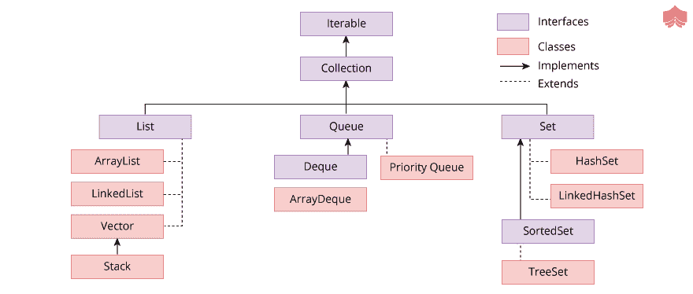

<!--yml
category: Java
date: 2022-11-19 13:21:41
-->

# Java基础面试指南三 - 分布式编程

> 来源：[https://zthinker.com/archives/java-basic-interview-3](https://zthinker.com/archives/java-basic-interview-3)

1.  [Java内存管理面试指南一](https://zthinker.com/archives/java-memory-interview-1)
2.  [Java基础面试指南一](https://zthinker.com/archives/java-basic-interview-1)
3.  [Java基础面试指南二](https://zthinker.com/archives/java-basic-interview-2)
4.  [Java基础面试指南三](https://zthinker.com/archives/java-basic-interview-3)
5.  [Java基础面试指南四](https://zthinker.com/archives/java-basic-interview-4)
6.  [Java线程面试指南一](https://zthinker.com/archives/java-thread-interview-1)
7.  [Java线程面试指南二](https://zthinker.com/archives/java-thread-interview-2)
8.  [Redis面试指南一](https://zthinker.com/archives/redis-interview-1)
9.  [Kafka面试指南一](https://zthinker.com/archives/kafka-interview-1)
10.  [Spring面试指南一](https://zthinker.com/archives/spring-interview-1)
11.  [SpringBoot面试指南一](https://zthinker.com/archives/springboot-interview-1)
12.  [微服务面试指南一](https://zthinker.com/archives/microservice-interview-1)

不,Java并不完全使用指针. 指针是将另一个变量的确切地址存储在其内存中的变量. 由于其安全性和健壮性的特点,Java避开了指针这一概念,而指针是内存寻址中C和C ++的主要组成部分.

如果我们知道一个变量的地址,我们可以从任何地方访问和修改它,即使它是私有的,这是自相矛盾的,因此Java不使用指针. Java坚持使用更安全的选项,称为引用,而不是使用指针**. **

引用是一个地址,它显示对象的变量和方法的存储位置. 将对象分配给变量或方法时,我们从不实际使用对象或对象副本. 相反,我们使用对那些对象的引用.

虽然参考

*   无法执行算术运算
*   无法分配地址
*   不能设置为指向没有对象的变量

要显示当前年份的最后两位数字,请使用日期字符y,如以下示例所示:

```
import java.util.Date;
public class Example {
 public static void main(String[] args) throws Exception {
    Date date = new Date();
    System.out.printf("Two-digit Year = %ty\n",date);
 }
}

**当前2020年的输出显示20:**

Two-digit Year = 20 
```

startsWith()方法用于检查字符串是否以特定字符串开头.

在这里,我们正在检查给定的字符串是否以子字符串“ one”开头:

```
public class Example {
 public static void main(String[] args) {
    String s = "OneAndOnly";
    if(s.startsWith("one")) {
      System.out.println("Begins with the specified word!");
    }
    else {
      System.out.println("Does not begin with the specified word!");   
    }
 }
}

**输出:**

Begins with the specified word! 
```

Java中的局部变量是在方法,代码块,构造函数等中局部声明的变量. 当程序控件输入方法,代码块,构造函数等时,则创建局部变量,并且当程序控件离开方法,代码块,构造函数时等等,然后销毁局部变量.

局部变量在Java中没有任何默认值. 这意味着应在首次使用变量之前声明它们并为其分配值. 否则,编译器将引发错误.

给出了一个演示Java局部变量的程序,如下所示:

```
public class Demo
{
  public void func()
  {
     int num;
     System.out.println("The number is : " + num);
  }
  public static void main(String args[])
  {
     Demo obj = new Demo();
     obj.func();
  }
} 
```

上面的程序包含一个局部变量num. 导致错误“变量num可能尚未初始化”

上面程序的正确版本如下:

```
public class Demo
{
  public void func()
  {
     int num = 50;
     System.out.println("The number is : " + num);
  }
  public static void main(String args[])
  {
     Demo obj = new Demo();
     obj.func();
  }
}

**上面程序的输出如下:**

The number is : 50 
```

可以使用Java的Collections API提供的体系结构来存储和操作一组对象. 可以使用Java集合执行Java中所有可能的操作,例如搜索,排序,删除,插入等.

Java中的集合层次结构如下:



Java中的Collections API的一些特征如下:

1.  有些集合不允许重复的元素.
2.  一些集合可能使用链接列表来存储元素. 链表中的所有元素都有对链表中上一个和下一个元素的引用. 与ArrayList相比,在LinkedList中插入元素更加容易和快捷.
3.  一些集合可能使用数组来存储元素. 可以动态调整数组的大小,以根据需要存储越来越多的元素.
4.  一些集合可能使用哈希表来存储元素. 这些表包含它们存储的所有元素的特定键.
5.  一些集合可能使用树来存储元素. 基于树的存储对于存储元素非常有用.

不包含任何字段或方法的空接口称为标记接口. 标记器接口的实际示例是Serializable接口,Cloneable接口和Remote接口. 这些接口的详细信息如下:

### 可序列化的接口

可序列化的接口使对象有资格将其状态保存在文件中. 该接口存储在java.io包中. 未实现可序列化接口的类未对其状态进行序列化或反序列化.

### 可克隆的接口

可克隆接口由一个类实现,该类指示允许Object类中的clone()方法对类实例进行字段到字段的复制. java.lang软件包包含可克隆的接口.

如果为没有可克隆接口的实现的类调用clone()方法,则抛出CloneNotSupportedException异常. 具有此接口的实现的类通常会按惯例覆盖Object.clone()方法.

### 远端介面

存储在计算机上并且可以从另一台计算机访问的对象称为远程对象. 需要远程接口来标记对象并将其转换为远程对象. java.rmi软件包包含远程接口.

可以使用非本地虚拟机调用其方法的接口也可以由远程接口标识. 同样,远程方法调用(RMI)具有一些方便类,可以使用远程对象实现来扩展这些方便类,这些便利类有助于创建远程对象.

异常处理是处理计算过程中异常发生的过程. Java中异常处理的一些最佳实践如下:

尝试块中使用了许多资源,之后需要关闭它们. 但是,不应在try块的末尾关闭这些资源,因为如果引发任何异常,则可能永远无法访问这些资源. 因此,所有清理代码都应放在finally块中,以获得更好的结果.

所有异常和错误的超类都是可抛出的. 绝对不要在catch子句中使用它,因为它将捕获所有异常和错误,其中某些异常和错误可能不在应用程序的控制范围内,因此无法处理.

描述性消息应提供例外,以帮助理解为什么将例外报告给监视工具或日志文件. 描述性消息应准确,并尽可能清晰地描述异常事件问题.

方法签名中指定的所有异常也应记录在Javadoc中. 这非常有用,因为它为调用者提供了更多信息,有助于按需处理或避免异常.

在永远不会发生的假设下,切勿忽略异常. 这是有缺陷的,因为将来代码可能会以无法预料的方式更改,并且可能永远不会发生认为不需要的异常(因为特定事件永远不会发生).

应该首先捕获最具体的异常类,然后在执行与异常匹配的第一个捕获块时,提供较不具体的捕获块. 因此,如果首先给出不太具体的异常捕获块,则控件可能永远不会到达更具体的异常捕获块.

最好有尽可能特殊的异常,因为它们会使API易于理解. 这意味着应使用最适合异常事件的类,并应避免未指定的异常.

不要记录并重新抛出异常,因为它会导致同一异常的多个错误消息. 这些额外的错误消息非常有用,因为它们不提供任何额外的信息. 如果需要任何其他信息,则应捕获异常并将其包装在定制的异常中.

Java中的线程有助于在程序中实现并行性. 这意味着可以使用多线程同时执行多个操作.

使用多线程可以实现线程最重要的用法. 这意味着可以使用多线程同时完成多个任务. Java中多线程的一些主要用途如下:

通过将特定问题分解为较小的块并将每个这些块分配给一个线程,可以减少响应时间. 这意味着可以使用多个线程在相对较短的时间内解决问题.

可以使用多线程并行运行多个任务. 一个示例是事件处理或绘制,可以使用多个线程同时执行该事件处理或绘制.

此外,由于一个线程正在执行特定功能,因此在图形用户界面中需要多个线程,因为无法冻结GUI,因此更多线程需要其他线程来执行更多用户任务.

在客户端服务器应用程序中,许多客户端可以使用多个线程连接到服务器. 这意味着客户端不必等到服务器已满足先前客户端的请求.

线程可用于充分利用CPU的能力并增加系统的吞吐量. 如果CPU有多个内核,则需要多个线程在这些内核上并行运行以优化系统性能.

在多线程中,每个线程都被分配一个优先级. 调度程序根据优先级将处理器分配给线程,即,优先级最高的线程首先分配给处理器,依此类推.

Thread类中为线程优先级定义的三个静态值如下:

这是值为10的最大线程优先级.

这是默认的线程优先级,值为5.

这是值为1的最小线程优先级.

给出了一个演示Java线程优先级的程序,如下所示:

```
import java.lang.*;
public class ThreadPriorityDemo extends Thread
{
   public static void main(String[]args)
   {
       ThreadPriorityDemo thread1 = new ThreadPriorityDemo();
       ThreadPriorityDemo thread2 = new ThreadPriorityDemo();
       ThreadPriorityDemo thread3 = new ThreadPriorityDemo();
       System.out.println("Default thread priority of thread1: " + thread1.getPriority());
       System.out.println("Default thread priority of thread2: " + thread2.getPriority());
       System.out.println("Default thread priority of thread3: " + thread3.getPriority());
       thread1.setPriority(8);
       thread2.setPriority(3);
       thread3.setPriority(6);
       System.out.println("New thread priority of thread1: " + thread1.getPriority());
       System.out.println("New thread priority of thread2: " + thread2.getPriority());
       System.out.println("New thread priority of thread3: " + thread3.getPriority());
   }
}

**上面程序的输出如下:**

Default thread priority of thread1: 5
Default thread priority of thread2: 5
Default thread priority of thread3: 5
New thread priority of thread1: 8
New thread priority of thread2: 3
New thread priority of thread3: 6 
```

内存管理是Java的重要组成部分,理解它非常重要. Java中的内存分为两个主要部分,堆栈和堆. 演示此过程的图如下所示:


Java中有关堆栈和堆内存的详细信息如下:

### Java中的堆栈内存

Java中的堆栈内存用于线程执行. 特定值存储在线程堆栈中,这些值在短时间内可用. 同样,堆栈存储器可能包含对从堆存储器中的方法引用的对象的数据引用.

线程堆栈内存中的顺序为后进先出(LIFO). 调用该方法时,会在堆栈存储器中为所有原始值和对该方法中其他对象的引用创建一个块. 方法结束后,堆栈存储器中的存储块将释放,并且可以由另一种方法使用.

### Java中的堆内存

Java中的堆内存是Java运行时分配给Objects和JRE类的内存. 应用程序中的所有对象都在堆内存中创建. 堆内存中的对象可从应用程序中的任何位置全局访问,因此它们对于整个应用程序执行都有生命周期.

super和this都是Java中的关键字. 有关这些的详细信息如下:

### super关键字

super关键字是Java中的保留关键字,用于引用直接父类. super关键字还可以调用直接父类的方法和构造函数.

给出了一个演示super关键字的程序,如下所示:

```
class A
{
   int x = 26;
   static int y = 15;
}
public class B extends A
{
   void display()
   {
       System.out.println(super.x);
       System.out.println(super.y);
   }
   public static void main(String[] args)
   {
       B obj = new B();
       obj.display();
   }
}

**上面程序的输出如下:**

26
15 
```

### this关键字

this关键字是Java中的保留关键字,用于引用当前的类实例变量. this关键字还可以调用当前类的方法和构造函数. 也可以在方法或构造函数调用中将其作为参数传递.

给出了一个演示super关键字的程序,如下所示:

```
public class Demo
{
   int x = 25;
   static int y = 12;
   void display()
   {
       this.x = 250;
       System.out.println(x);
       this.y = 120;
       System.out.println(y);
   }
   public static void main(String[] args)
   {
       Demo obj = new Demo();
       obj.display();
   }
}

**上面程序的输出如下:**

250
120 
```

Java中的序列化涉及将对象状态写入字节流,以便可以将其发送到数据库或磁盘. 反序列化是逆向过程,其中流被转换为对象.

默认情况下,String.class和所有包装器类都实现java.io.Serializable接口. ObjectOutputStream类的writeObject()方法提供了序列化对象的功能. 使用ObjectInputStream对对象和原始数据进行反序列化.

给出了一个演示Java中的序列化和反序列化的程序,如下所示:

```
import java.io.*;
class Employee implements Serializable
{
   int empID;
   String name;
   Employee(int e, String n)
   {
       this.empID = e;
       this.name = n;
   }
}
public class Demo
{
   public static void main(String[] args)
   {
       Employee emp1 = new Employee(251,"Jason Scott");  
       FileOutputStream f = new FileOutputStream("file.txt");  
       ObjectOutputStream o = new ObjectOutputStream(f);  
       o.writeObject(emp1);  
       o.flush();  
       ObjectInputStream i = new ObjectInputStream(new FileInputStream("file.txt"));  
       Employee emp2 = (Employee)i.readObject();  
       System.out.println(emp2.empID + " " + emp2.name);  
       i.close();  
   }
}

**上面程序的输出如下:**

251 Jason Scott 
```

在Java中停止线程可能有点复杂,因为没有有效的stop方法. 这与在Java中启动线程完全不同,因为有可用的start()方法. 首次发布Java时,Thread类中有一个stop()方法,但此方法已被弃用.

给出了一个演示如何使用个人stop()方法停止Java中的线程的程序,如下所示:

```
import static java.lang.Thread.currentThread;
import java.util.concurrent.TimeUnit;
public class Demo
{
   public static void main(String args[]) throws InterruptedException
   {
       Server ser = new Server();
       Thread thread = new Thread(ser, "T1");
       thread.start();
       System.out.println(currentThread().getName() + " is stopping Server thread");
       ser.stop();
       TimeUnit.MILLISECONDS.sleep(200);
       System.out.println(currentThread().getName() + " is finished now");
   }
}
class Server implements Runnable
{
   private volatile boolean exit = false;
   public void run()
   {
       while(!exit)
     {
         System.out.println("The Server is running");
     }
     System.out.println("The Server is now stopped");
   }
   public void stop()
   {
       exit = true;  
   }
}

**上面程序的输出如下:**

main is stopping Server thread
The Server is running
The Server is now stopped
main is finished now 
```

Java中的字符串是不可变的. 这意味着它们不可更改或不可修改. 有几个原因. 其中一些如下:

通过将Java中的字符串设为不可变,可以解决同步问题. 这是因为如果它们是不可变的,它们将自动变为线程安全的.

类加载具有字符串参数. 如果字符串是可变的,那么当可变对象更改其状态时,可能会加载错误的类.

网络连接,URL,数据库连接,用户名/密码等具有以字符串表示的参数. 如果字符串是可变的,则可以轻松更改这些参数,这将构成安全漏洞.

演示字符串的程序如下所示:

```
public class Demo
{  
public static void main(String args[])
{  
  String str = "Snow";  
  str.concat("White");  
  System.out.println(str);
}  
}  

**上面程序的输出如下:**

Snow 
```

在上述程序中,仅打印Snow,因为Strings是不可变的对象.

线程间通信涉及Java线程之间的通信. Java的三种用于实现线程间通信的方法如下:

此方法使当前线程释放锁. 直到完成特定时间段或另一个线程为此对象调用notify()或notifyAll()方法,该操作才完成.

此方法从当前对象的监视器上的多个线程中唤醒一个线程. 线程的选择是任意的.

此方法唤醒当前对象监视器上的所有线程.

给出了一个演示Java中线程间通信的程序,如下所示:

```
class BankCustomer
{  
   int balAmount = 10000;  
   synchronized void withdrawMoney(int amount)
   {
       System.out.println("Withdrawing money");  
       balAmount -= amount;  
       System.out.println("The balance amount is: " + balAmount);  
   }
   synchronized void depositMoney(int amount)
   {
       System.out.println("Depositing money");  
       balAmount += amount;  
       System.out.println("The balance amount is: " + balAmount);  
       notify();  
   }
}  
public class Demo
{  
   public static void main(String args[])
   {
       final BankCustomer cust = new BankCustomer();  
       new Thread()
       {
           public void run()
           {
               cust.withdrawMoney(5000);
           }
       }.start();  
       new Thread()
       {
           public void run()
           {
               cust.depositMoney(2000);
           }
       }.start();  
   }
}

**上面程序的输出如下:**

Withdrawing money
The balance amount is: 5000
Depositing money
The balance amount is: 7000 
```

死锁是通常在多线程或多任务处理中发生的情况. 这意味着两个或更多线程正在无限期地等待彼此释放它们完成执行所需的资源.

通过尝试避免产生死锁的可能性,可以在Java中避免死锁. 这些可能性无法完全消除,但绝对可以减少.

避免Java中死锁的一些方法如下:

使用不必要的锁可能导致死锁,因此仅应锁定实际需要的那些成员.

嵌套锁到多个线程是死锁的主要原因. 因此,如果一个线程已被锁定,则应避免锁定多个线程.

如果一个线程正在等待另一个线程,则会发生死锁. 因此,如果死锁条件出现在执行所需的最长时间内,则可以使用Thread.join.

在Java 7之前,当我们需要处理多个异常时,我们需要多个catch块来处理这些异常.

让我们看一个例子:

```
import java.util.*;
public class Example
{
   public static void main(String args[])
   {
       Scanner sc = new Scanner(System.in);
       try
       {
           int n=Integer.parseInt(sc.next());
           System.out.println(n/0);
       }
       catch (ArithmeticException ex)
       {
           System.out.println("Exception caught " + ex);
       }
       catch (NumberFormatException ex)
       {
           System.out.println("Exception caught " + ex);
       }
   }
}

这里的输出取决于输入. 

当我们输入整数时,它将生成算术异常. 

对于以下输入:

3

**输出如下:**

$javac Example.java
$java Example

Exception caught java.lang.ArithmeticException: / by zero

对于字符串或字符输入,输出将不同. 

对于以下输入:

Hello

**输出如下:**

$javac Example.java
$java Example
Exception caught java.lang.NumberFormatException: For input string: "Hello" 
```

从Java 7开始,Java 中引入了**多捕获 **块

一个catch块可以捕获多个分开的异常**. **符号.

让我们看一个多捕获块的例子:

```
import java.util.*;
public class Example
{
   public static void main(String args[])
   {
       Scanner sc = new Scanner(System.in);
       try
       {
           int n=Integer.parseInt(sc.next());
           System.out.println(n/0);
       }
       catch (NumberFormatException | ArithmeticException ex)
       {
           System.out.println("Exception caught " + ex);
       }
   }
}

当我们输入整数时,它将生成算术异常. 

对于以下输入:

3

**输出如下:**

$javac Example.java
$java Example
Exception caught java.lang.ArithmeticException: / by zero

对于字符串或字符输入,输出将不同. 

对于以下输入:

Hello

**输出如下:**

$javac Example.java
$java Example
Exception caught java.lang.NumberFormatException: For input string: "Hello" 
```

Java中的注释是一种形式语法元数据,用于传达有关程序元素(如构造函数,方法,实例变量和类)的其他信息.

它们始终以**@ **符号开头. 注释在程序的编译中没有直接作用.

另一方面,注释并不完全像注释,因为它们可以改变编译器对程序的看法.

让我们看一个示例,其中注释会影响程序的输出. 我们正在尝试重写私有方法. 这将产生一个错误.

```
class Parent
{
  private void display()
 {
    System.out.println("Super class");      
 }
}
public class Example extends Parent
{   
   //using the Override annotation
   @Override
 void display()   // trying to override display()
 {
    System.out.println("Sub class");   
 }
 public static void main(String[] args)
 {
     Parent obj = new Example();  
     obj.display();
 }  
}

**输出如下:**

$javac Example.java
Example.java:11: error: method does not override or implement a method from a supertype
   @Override
   ^
Example.java:19: error: display() has private access in Parent
     obj.display();
        ^
2 errors 
```

基本上,注释分为三类

1.  标记注释
2.  完整注释
3.  单值注释

标记注释:它们用于指出声明. 这些注释没有任何参数.

例如:

@ExampleAnnotation()

**@Override **是标记注释的示例.

**完整注释**:这些注释由多个变量的名称,值,对组成.

例如:

@ExampleAnnotation(name=”Program”, value=”Java”)

**单一值注释**:这些注释仅包含一个带有简写值的成员.

例如:

@ExampleAnnotation(“running”)

Java中有一些内置/原始注释.

java.lang包中包含3个内置注释. 他们如下

*   @Deprecated
*   @Override
*   @SuppressWarnings

其中的4个导入了java.lang.annotation类,即:

*   @Retention
*   @Documented
*   @Inherited
*   @Target

| 注解 | 描述 |
| --- | --- |
| @Deprecated | 标记注释,指示声明已过时且已更新 |
| @Override | 当方法覆盖父类的另一个方法时使用的标记注释 |
| @SuppressWarnings | 它用于生成编译器警告 |
| @Documented | 它是一个标记注释,告诉工具注释将被记录 |
| @Inherited | 它仅在声明注释时使用 |
| @Target | 它充当另一个注释的注释 |

Java中的Lambda表达式是实现功能接口的表达式. 功能接口是只有一种抽象方法的那些接口.

创建这些表达式是为了减少匿名类的繁琐的开销代码. 匿名类是没有名称的本地类,并且在同时声明和实例化.

直到Java 8为止,即使是最简单的操作,都使用匿名类编写了其他语法代码. 引入Lambda表达式以消除此缺点.

语法:

lambda operator->body

lambda运算符是一个参数列表,可以具有0、1或多个参数.

**零参数:**

()->System.out.println(“I have no argument”);

**一个参数:**

(arg)->System.out.println(“I have one argument”+arg)

**多个参数:**

(arg1,arg2)->System.out.println(“I have many arguments”+arg1+“ ”+arg2)

让我们使用lambda表达式从列表中打印偶数个整数:

```
import java.util.*;
public class Example
{
   public static void main(String args[])
   {
       List<Integer> list = new ArrayList<Integer>();
       for(int i=1;i<=10;i++)  // adding 1 to 10 in the integer ArrayList
       {
           list.add(i);
       }
      // printing even elements in list using lambda expression
       list.forEach(arg -> { if (arg%2 == 0) System.out.println(arg); });
   }
}

**输出如下:**

$javac Example.java
$java Example
2
4
6
8
10 
```

**使用比较方法**

使用compareTo()和compareToIgnoreCase()方法比较Java中的两个字符串. compareTo()方法用于按字典顺序或字典顺序比较两个字符串. 每个字符都转换为Unicode值以进行比较. 如果两个字符串相等,则返回0,否则返回正值或负值.

如果第一个字符串在字典上大于第二个字符串,则compareTo()方法返回正值;如果第一个字符串在字典上小于第二个字符串,则返回负值. compareToIgnoreCase()方法按字典顺序比较两个字符串,而不考虑它们的大小写.

让我们看一个示例,其中compareTo()和compareToIgnoreCase()方法用于比较两个字符串:

```
public class Example
{
  public static void main(String args[])
  {
     String s1 = "Same string";
     String s2 = "same string";
     int a1= s1.compareTo(s2);
     int a2=s1.compareToIgnoreCase(s2);
     if(a1<0)
       System.out.println("String s2 is greater");
     else if(a1>0)
       System.out.println("String s1 is greater");
     else
       System.out.println("String s1 is equal to String s2");
    if(a2==0)
       System.out.println("After Ignoring the case, s1 and s2 are equal");
     else
       System.out.println("Even after ignoring the case, s1 and s2 are not equal");
  }
}

**输出如下:**

$javac Example.java
$java Example
String s2 is greater
After Ignoring the case, s1 and s2 are equal 
```

使用equals()和equalsIgnoreCase()

equals()方法将字符串与特定对象进行比较. 它返回布尔值true或false. 当arguments不为null且字符串与对象的字符匹配时,它将返回true. equalsIgnoreCase()进行相同的操作,但没有考虑字符串的大小写和对象的字符序列.

让我们看一个示例,其中equals()和equalsIgnoreCase()用于比较两个字符串.

```
public class Example
{
  public static void main(String []args)
  {
     String s1 = "Same String";
     String s2 = "same string";
     System.out.println(s1.equals(s2));
     System.out.println(s1.equalsIgnoreCase(s2));
  }
}

**输出如下:**

$javac Example.java
$java Example
false
true 
```

**使用==运算符**

我们可以使用==运算符比较两个字符串. 此运算符的行为类似于equals()方法,并返回布尔值作为结果.

让我们看一下==运算符在两个字符串比较中的应用:

```
public class Example
{
  public static void main(String []args)
  {
     String s1 = "Same String";
     String s2 = "same string";
     String s3 = "Same String";
     System.out.println(s1==s2);
     System.out.println(s1==s3);
  }
}

**输出如下:**

$javac Example.java
$java Example
false
true 
```

Java中的main()方法很可能会重载,因为它不是地面上的方法. main()方法与其他任何方法一样,可以像其他方法一样重载.

由于public static void main(String [] args)充当main方法的方法签名,因此JVM首先调用它. public static void main(String [] args)充当Java程序的入口点.

我们可以重载Java中的main方法. 由于程序执行时程序不会执行重载的main方法,因此我们需要从具有方法签名的实际main方法中调用重载的main方法.

让我们看一下Java中main方法重载的示例

```
public class Example
{   
  public static void main(String x)
  {
      System.out.println(x+" World");
  }
  public static void main(String a, int b)
  {
      System.out.println(a+","+b);
  }
  public static void main(String []args)
  {
    System.out.println("Hello from public static void main(String []args)!");
     main("Hello");
     main("Hello",2);
  }
}

**输出如下:**

$javac Example.java
$java -Xmx128M -Xms16M Example
Hello from public static void main(String []args)!
Hello World
Hello,2 
```

在J2SE 5中引入了泛型来处理类型安全的对象. 在泛型的强制下,只能将特定类型的对象存储在Collection中.

Java中的泛型的一些优点如下:

**消除类型转换**

泛型出现后,不需要类型转换. 演示此的示例如下:

```
Before generics type casting was required.
List l = new ArrayList();  
l.add("apple");  
String str = (String) list.get(0);     // type casting  
After generics type casting was no longer needed.
List<String> l = new ArrayList<String>();  
list.add("apple");  
String str = list.get(0);                  // no type casting 
```

**编译时检查**

提供了编译时检查,以便在运行时没有问题,因为在编译时处理问题比在运行时处理问题要好得多. 演示此的示例如下:

```
List<String> l = new ArrayList<String>();  
l.add("apple");  
l.add("mango");  
l.add(98);            // This will lead to a Compile Time Error 
```

**类型安全**

泛型导致类型安全,因为只能在其中保留一种类型的对象. 这意味着不允许使用其他类型的对象.

编译后,Java类以字节代码的形式存储在.class文件中. 需要时,ClassLoader将Java程序的类加载到内存中.

ClassLoader是分层的,因此,如果有加载类的请求,则会将其委派给父类加载器. 使用此方法可以维护Java Runtime Environment中的唯一性.

Java中内置的ClassLoader的类型如下:

1.  Bootstrap类加载器
2.  扩展类加载器
3.  系统类加载器

给出了一个用Java演示ClassLoader的程序,如下所示:

```
public class Demo {
public static void main(String[] args) {
   System.out.println("class loader for this class: " + Demo.class.getClassLoader());
   System.out.println("class loader for DNSNameService: " + sun.net.spi.nameservice.dns.DNSNameService.class.getClassLoader());
  System.out.println("class loader for HashMap: " +
  java.util.HashMap.class.getClassLoader());
}
}

上面程序的输出如下:

class loader for this class: sun.misc.Launcher$AppClassLoader@4e0e2f2a
class loader for DNSNameService: sun.misc.Launcher$ExtClassLoader@5c647e05
class loader for HashMap: null 
```

在Java中,Calendar.DAY_OF_WEEK常量用于获取星期几.

该示例显示相同的内容:

```
import java.util.Calendar;
public class Example {
 public static void main(String[] args) {
   Calendar c = Calendar.getInstance();
   System.out.println(c.getTime().toString());
   System.out.println("Day = " + c.get(Calendar.DAY\_OF\_WEEK));
 }
}

该示例显示星期几:

Sun Dec 16 21:32:34 UTC 2018
Day = 1 
```

反转整数涉及反转其所有数字. 下面是一个示例:

Integer = 123
Reverse of the integer = 321

给出了一个演示用Java反转整数的程序,如下所示:

```
public class Demo
{
  public static void main(String args[])
  {
     int num = 2413, rev = 0;
     System.out.println("The number is " + num);
     while(num != 0)
     {
         rev = rev \* 10;
         rev = rev + num % 10;
         num = num / 10;
     }
     System.out.println("Reverse of the above number is " + rev);
  }
} 
```

**上面程序的输出如下:**

The number is 2413
Reverse of the above number is 3142

在上面的程序中,数字2413使用while循环反转,结果存储在rev中,然后显示出来.

当给变量分配的值大于该变量的最大允许值时,就会发生溢出. 如果发生溢出,JVM不会抛出任何异常,并且程序员有责任处理溢出情况.

给出了一个检查Java中溢出的程序,如下所示:

```
public class Demo {
    public static void main(String[] args)
    {
        int num1 = 2147483647;
        int num2 = 1;
        System.out.println("Number 1: " + num1);
        System.out.println("Number 2: " + num2);
        long sum = (long)num1 + (long)num2;
        if (sum > Integer.MAX_VALUE)
        {
            throw new ArithmeticException("Overflow occurred!");
        }
        System.out.println("The sum of two numbers is: " + (int)sum);
    }
}

**上面程序的输出如下:**

Number 1: 2147483647
Number 2: 1
Exception in thread "main" java.lang.ArithmeticException: Overflow occurred!
at Demo.main(Demo.java:14) 
```