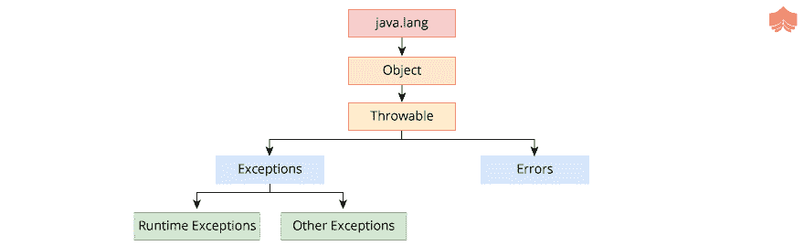
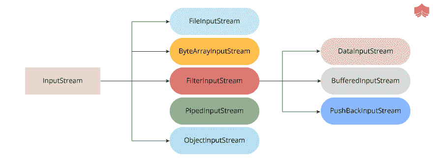
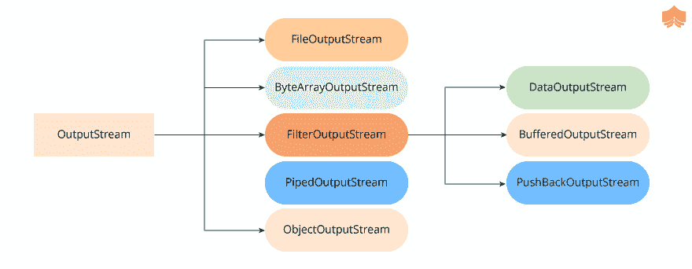
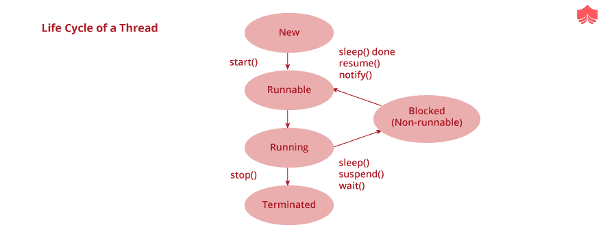

<!--yml
category: Java
date: 2022-11-19 13:21:37
-->

# Java基础面试指南二 - 分布式编程

> 来源：[https://zthinker.com/archives/java-basic-interview-2](https://zthinker.com/archives/java-basic-interview-2)

1.  [Java内存管理面试指南一](https://zthinker.com/archives/java-memory-interview-1)
2.  [Java基础面试指南一](https://zthinker.com/archives/java-basic-interview-1)
3.  [Java基础面试指南二](https://zthinker.com/archives/java-basic-interview-2)
4.  [Java基础面试指南三](https://zthinker.com/archives/java-basic-interview-3)
5.  [Java基础面试指南四](https://zthinker.com/archives/java-basic-interview-4)
6.  [Java线程面试指南一](https://zthinker.com/archives/java-thread-interview-1)
7.  [Java线程面试指南二](https://zthinker.com/archives/java-thread-interview-2)
8.  [Redis面试指南一](https://zthinker.com/archives/redis-interview-1)
9.  [Kafka面试指南一](https://zthinker.com/archives/kafka-interview-1)
10.  [Spring面试指南一](https://zthinker.com/archives/spring-interview-1)
11.  [SpringBoot面试指南一](https://zthinker.com/archives/springboot-interview-1)
12.  [微服务面试指南一](https://zthinker.com/archives/microservice-interview-1)

Java支持面向对象范例中的编程,但是它不是完全面向对象的. Java具有一组原始数据类型-字节,短型,字符,整数,长型,浮点型,双精度型,布尔型. 此类型的任何变量都不是对象. 这就是Java不纯粹是面向对象的原因.  

包装器类包装原始数据类型以将它们作为对象引入. 原始值不是对象,开发人员需要编写许多样板代码以将它们彼此转换并在集合中使用它们. 为了克服这些问题,Java引入了包装器类. 这些类提供了用于数据类型转换的多态API和诸如hashCode()和equals()之类的实用程序方法. 这些使值在面向对象的环境中非常有用.  

多态性是面向对象编程范式的一个属性,它表示对象或方法在不同的上下文中可以具有不同的形式. 在Java中,我们可以根据其参数在具有不同实现的类中定义一个方法. 这样,当客户端代码使用具有不同参数集的相同接口调用该方法时,但在内部它决定需要调用哪种实现. 让我们举个例子: 

```
class AreaCalculator {

    double calculate(Circle c) {
        return 3.14 * c.getRadius() * c.getRadius();
    }

    double calculate(Square s) {
        return s.getLength() * s.getLength();
    }
}
    //Client code
    AreaCalculator ac = new AreaCalculator();
    ac.calculate(new Circle(10));
    ac.calculate(new Square(5)); 
```

如您所见,在AreaCalculator类中,calculate()有单独的实现,但是从客户端的角度来看,接口是相同的.  

我们可以通过几种方法在Java中创建对象.  

1.可以在类中使用new运算符创建新对象,该运算符调用以下项之一 

它的构造函数.  MyClass o = new MyClass(); 

2.如果类具有默认构造函数,则可以使用Java反射API-Class.newInstance()创建对象. 如果该类具有使用参数的多个构造函数,则可以使用Class.getConstructor()方法获取相应的构造函数,然后调用该方法来创建一个新对象.

```
MyClass o=MyClass.class.newInstance();
MyClass o=MyClass.class.getConstructor(int.class).newInstance(10); 
```

3.我们可以在一个对象上调用clone方法来创建一个重复的对象.  

```
MyClass o = new MyClass(); 
MyClass b =(MyClass)o.clone(); 
```

4.如果该对象的状态以序列化形式可用,我们可以将其反序列化为 

创建一个具有相同状态的新对象.

```
ObjectInputStream is= new ObjectInputStream(anIStream); 
MyClass o =(MyClass)is.readObject(); 
```

多态或静态多态决定在编译时需要调用哪个方法,并将方法调用与调用绑定在一起. 但是,在某些情况下静态绑定不起作用. 众所周知,父类引用可以指向父对象以及子对象. 现在,如果在父类和子类中都存在一个具有相同签名的方法,并且我们从父类引用中调用该方法,则编译器无法确定该方法与该调用绑定. 这将取决于引用在运行时所指向的对象类型. 如果引用指向父对象,则将调用父类中的方法. 如果指向的对象是Child类的实例,则将调用child类实现. 这就是为什么将其称为动态绑定或运行时多态性,并且据说子类方法已覆盖父类方法. 让我们举个例子:

```
class Animal {
    public void makeSound() {
        System.out.println("My sound varies based on my type");
    }
}

class Dog extends Animal {
    @Override
    public void makeSound() {
        System.out.println("I bark");
    }
}
Animal a = new Animal();
a.makeSound();
a=new Dog();
a.makeSound(); 
```

如果运行代码段,我们会发现a.makeSound()根据引用指向的对象类型打印不同的消息. 请注意,子类中需要Override批注,以通知编译器此方法将覆盖父实现.  

StringBuffer和StringBuilder公开相同类型的API以构建String,它们都是可变类. 但是,它们之间有很大的不同. StringBuffer是线程安全的,这意味着它可以用作多个线程之间的共享对象. 另一方面,StringBuilder不是线程安全的,如果没有适当的同步技术,则不允许多个线程修改StringBuilder. 这就是StringBuilder比StringBuffer更快的原因. 在需要构建方法本地或特定线程本地的String对象的情况下,我们应该使用StringBuilder而不是StringBuffer.  

一个类既可以继承抽象类又可以继承接口,但是有一些区别. 一个类只能扩展一个抽象类,而可以实现多个接口. 接口不能具有构造函数,而抽象类可以具有子类需要在其构造函数中调用的构造函数. 抽象类可能包含子类可以访问以更改其状态的字段. 另一方面,接口只能包含最终变量. 因此,抽象类允许子类继承状态和行为,而接口主要用于在子类中实现一组行为. 如果父级和子级之间存在直接IS-A关系,则应该首选抽象类. 当不同的实现具有大多数常见行为并由抽象类定义时,我们将使用抽象类. 在将公共API公开给客户端代码以及类在不同上下文中的行为不同时,最好使用接口.  

Java不完全支持多重继承,因为一个类只能扩展一个类. 不支持此功能,因为如果另一个父类中存在相同的成员,则这可能导致在访问继承的字段或方法时产生歧义. 但是,该工具是通过接口部分提供的.  

如果成员不依赖于该类的任何实例,即独立于任何对象,则将其声明为静态成员. 这些成员绑定到类型,通常使用类型名称(而不是对象引用)进行访问. 静态方法和字段在类的所有对象之间共享,并且可以从任何一个对象中访问,而我们不能从静态方法访问非静态成员. 由于静态方法未绑定到对象,因此无法覆盖它们. 静态字段是通过静态块初始化的,该静态块在类加载器加载类时执行. 让我们来看一个例子: 

```
public class Countable {
    private static int count;
    private int x;

    static {
        count = 0; // initialize static member
    }

    public Countable(int x) {
        this.x = x;
        count++; // non-static can access static member
    }

    public int getX() {
        return x;
    }

    public static int getCount() {
        return count; // only static can access static member
    }
}
    Countable c1 = new Countable(10);
    Countable c2 = new Countable(20);
    System.out.println("Object count "+Countable.getCount());
// should print 2 
```

ArrayList和LinkedList都是列表,但内部实现不同. ArrayList在内部使用一个数组来存储添加到其中的元素. 当元素的数量即将超过数组的大小时,它将分配一个新的数组并将元素复制到新的位置. 它为添加(如果不需要扩展)和获取元素提供恒定的时间访问时间,但是对于删除,由于需要将其元素向左移动,它提供了线性的时间复杂度. 另一方面,LinkedList在内部维护用于存储元素的一系列链接节点. 因此,以线性时间检索元素,而添加和删除则需要一定的时间才能执行.

HashTable和HashMap都存储键-值对,并花费固定的时间进行放置或获取操作. 但是,Hashtable是同步的,可以共享以供多个线程修改,而HashMap不同步且性能更好,但不适合作为共享对象的多线程环境. HashTable不允许Null键或值,但HashMap允许Null键和多个Null值.

为了检索或存储值,HashMap使用其Key类的两个方法-hashCode()和equals(). HashMap将其条目存储在大量的存储桶中,可以使用索引对其进行随机访问. 要检索值,首先,将调用Key的hashCode()方法以获取哈希值. 此哈希值用于标识将从中检索值的存储桶. 在存储条目时,可能存在某些情况,其中多个密钥计算出的哈希值相同. 这导致在同一存储桶中输入多个键值对.  

存储桶将其条目保留为链接列表. 因此,在检索时,在找到适当的存储桶之后,需要遍历此链接列表以找到密钥的实际条目. 这次,equals()方法用于比较列表中每个条目的键. 一旦找到相等的键,则返回条目中的值. 这两个方法之间有一个约定,即如果两个对象基于equals()方法相等,则它们的hashCode()值必须相同. 因此,如果我们计划将类的对象用作HashMap的键,则应该覆盖方法hashCode()和equals(),以便保持此协定.  

公共静态void main(String args [])是Java程序的主要方法. 它是任何Java程序的入口. 没有main方法,则无法执行Java程序.

main方法的语法如下:

public static void main(String args[])

只能将args更改为不同的名称,但是该方法的其余部分具有相同的语法.

让我们通过分解来分析主要方法:

*   **public**:这是main方法的访问说明符/访问修饰符. 应该公开允许类访问它. 如有违反,程序将显示错误.
*   **static**:在运行时开始时,该类没有任何对象. 因此,main方法必须是静态的,以便Java虚拟机可以将类设置为内存并调用main方法. 如果main方法不是静态的,那么由于缺少对象,JVM将无法调用它.
*   **void**:这是main方法的返回类型. Java中的每个方法都必须具有返回类型. main方法不返回任何其他方法可以访问的值,因为main方法不能在任何其他方法中调用. 一旦main方法完成执行,程序就会终止. 因此,返回值没有任何用处.
*   **main**:这是main方法的名称. 此名称已设置,无法更改. 如果对main关键字进行了任何更改,则编译器会告知找不到main方法.
*   **String args []**:main方法可以接受一个String类型的参数. 它们也称为命令行参数. 在main方法编写的代码中,可以将它们用作常规参数来使用和操纵. 它们与执行语句一起编写.

自定义异常只不过是用户定义的异常. Java自定义异常用于根据用户的要求进行和修改异常.

在创建自定义异常之前,让我们看一下它的先决条件

*   创建的所有异常必须是Throwable类的子类
*   使用extend关键字并扩展Exception类
*   如果要编写运行时异常,则需要扩展RuntimeException类.

现在让我们创建一个父自定义异常,如果数字不能被3整除,则该异常将生成一个异常:

```
 class CustomException extends Exception {
    CustomException(String errormsg) {
        super(errormsg);
    }
}

public class Example {
    static void validate(int num) throws CustomException {
        if (num % 3 != 0)
            throw new CustomException("Not divisible by 3");
        else
            System.out.println("Divisible by 3");
    }

    public static void main(String args[]) {
        try {
            validate(10);
        } catch (Exception e) {
            System.out.println("Exception caught: " + e);
        }
        System.out.println("Outside the try-catch block");
    }
} 
```

**上面程序的输出如下:**

```
$javac Example.java
$java Example
Exception caught: CustomException: Not divisible by 3
Outside the try-catch block 
```

公共静态void main(String args [])是Java程序的主要方法. 这是最重要的Java方法. 它是任何Java程序的入口. 没有main方法,则无法执行Java程序.

static关键字充当访问修饰符. 当Java虚拟机调出main方法时,它没有对象可以调用. 因此,我们使用static来允许类调用它.

如果我们不在公共static void main(String args [])中使用static,则编译器将给出错误消息.

```
public class Example
{
   public void main(String args[])
   {
       System.out.println("Hello");
   }
}

**输出窗口如下**

$javac Example.java
$java Example
Error: Main method is not static in class Example, please define the main method as:
  public static void main(String[] args) 
```

在编译期间,Java编译器会将源代码转换为ByteCode.

ByteCode是一组高度发达的指令,提供给Java虚拟机以生成机器代码. 它是.class文件形式的机器代码. 可以用C ++进行类比. 之所以称为ByteCode,是因为每个指令为1-2个字节.

Java与其他面向对象语言的区别之一是它与平台无关. 该平台独立性是通过Java ByteCode实现的.

Java虚拟机提供了执行字节码所需的组件,该虚拟机调用处理器分配所需的资源. JVM基于堆栈,因此它们实现堆栈来读取和处理字节码.

某些ByteCode指令如下:

1:istore_1 2:iload_1 3:sipush 1000 6:if_icmpge 44 9:iconst_2 10:istore_2

代码段是保存ByteCode的内存段.

以下是比较:
| 基础 | 编译时多态 | 运行时多态 |
|----|--------------|--------------|
| 定义 | | |
| 别名 | 编译时多态也称为静态多态 | 运行时多态也称为动态多态 |
| 发生 | 它在编译时发生 | 它在运行时发生 |
| 实作 | 通过方法重载实现 | 它是通过方法重写实现的 |
| 速度 | 方法执行更快 | 方法执行速度较慢 |
| 特征 | 它增加了程序的可读性 | 它为程序提供了特定的实现 |

下面给出了使用方法重载实现编译时多态的示例:

```
class Overload
{
   public void display(char c)
   {
        System.out.println(c);
   }
   public void display(char c, int num)  
   {
        System.out.println(c + " "+num);
   }
}
public class Example
{
  public static void main(String args[])
  {
      Overload obj = new Overload();
      obj.display('s');
      obj.display('s',12);
  }
}

上面程序的输出是:

$javac Example.java
$java Example
s
s 12 
```

给出了使用方法覆盖实现运行时多态的示例,如下所示:

```
class SuperClass
{
   void display() { System.out.println("SuperClass"); }
}
class SubClass extends SuperClass
{
   void display()
   {
       System.out.println("Subclass");
   }
}
public class Example
{
   public static void main(String[] args)
   {
       SuperClass obj1 = new SuperClass();
       obj1.display();
       SuperClass obj2 = new SubClass();
       obj2.display();
   }
}

**输出如下:**

$javac Example.java
$java Example
SuperClass
Subclass 
```

Java中的字符串池是存储在Java堆内存中的字符串池或字符串集合. 使用双引号初始化String时,它将首先在String池中搜索具有相同值的String. 如果匹配,则仅返回引用,否则,它将在字符串池中生成一个新的字符串,然后返回其引用.

字符串池的可能性仅由于Java中字符串的不可变性而存在.

如果使用**new **运算符创建String ,则String类有权在字符串池中创建新的String.

例如,

```
public class Example
{
   public static void main(String[] args)
   {
       String s1 = "Hello";
       String s2 = "Hello";
       String s3 = new String("Hello");
       System.out.println("Do s1 and s2 have the same address? "+ (s1==s2));
       System.out.println("Do s1 and s2 have the same address? "+ (s1==s3));
   }
}

由于字符串池的实现,输出将显示s1和s2具有相同的地址. 但是,由于使用了new关键字,因此字符串s3将具有不同的地址. 

$javac Example.java
$java Example
Do s1 and s2 have the same address? true
Do s1 and s2 have the same address? false 
```

不,finally块将不会执行. System.exit()方法是java.lang包的预定义方法. 通过终止Java虚拟机的运行,它将退出当前程序.

System.exit()方法具有一个由整数值表示的状态代码. 通常状态码为0\. 非零状态码表示Java程序异常终止.

java.lang包中exit方法的语法如下所示

public static void exit(int status_code);

Java中的finally块通常执行所有操作,而与try和catch块中编写的内容无关. 当在try块中写入System.exit()函数时,会产生像差.

**例如,**

```
public class Example
{
   public static void main(String[] args)
   {
       try
       {
        System.out.println("In try block");
        System.exit(0);
        int a=1/0;
       }
       catch(ArithmeticException e)
       {
           System.out.println("Exception Caught");
       }
       finally
       {
           System.out.println("In finally block");
       }
   }
}

**输出如下:**

$javac Example.java
$java Example
In try block 
```

创建对象时将调用类的构造函数. 每次使用**new**关键字创建对象时,都会调用构造函数. 构造函数初始化同一类的数据成员.

```
class Example
{
 Example() // constructor
 {
  }
}
Example obj=new Example(); // invokes above constructor 
```

构造函数用于初始化对象的状态. 它包含在创建对象时执行的语句列表.

例如,

```
public class Example
{
   Example()  // constructor of class Example
   {
       System.out.println("This is a constructor");
   }
   public static void main(String []args)
   {
       Example e=new Example();
       // constructor Example() is invoked by creation of new object e        
   }
}

**上面的输出如下:**

$javac Example.java
$java Example
This is a constructor 
```

Thread类的yield()方法用于暂时停止线程的执行并执行.

对于java.lang.Thread类,yield方法的语法如下:

public static void yield()

通过三种方式阻止执行线程,即yield(),sleep(),join().

在某些情况下,一个线程要花费更多的时间来完成其执行,我们需要找到一种解决方案来延迟线程的执行,如果有重要的事情待解决,则可以在两个线程之间快速完成其执行. yield()提供了此问题的答案.

例如,

```
import java.lang.*;
class ExampleThread extends Thread
{
   public void run()
   {
       for (int i=0; i<2 ; i++)
           System.out.println(Thread.currentThread().getName() + " in control");
   }
}
public class Example
{
   public static void main(String[]args)
   {
       ExampleThread t = new ExampleThread();
       t.start();  // this calls the run() method
       for (int i=0; i<2; i++)
       {
           Thread.yield();
           System.out.println(Thread.currentThread().getName()  + " in control");
       }
   }
}

**上面程序的输出是:**

$javac Example.java
$java Example
Thread-0 in control
Thread-0 in control
main in control
main in control 
```

每个系统的输出可能不同,但是yield()线程执行的可能性更大.

final,finalize和final 之间有很多差异.

*   **final**是用于减少应用类,方法或变量的关键字. 最终类不能被子类继承,声明为final的方法不能被覆盖,声明为final的变量不能被更新.
*   **finalize**是一种用于在Java中进行垃圾回收之前清理处理的方法. 没有对象的进一步引用时,该对象将由该对象的垃圾收集器调用.
*   **finally** 它是try-catch-finally流块的一部分,用于执行代码,而与try和catch块中的异常处理无关.

与final和final不同,finalize不是Java中的保留关键字. 可以显式调用finalize方法,这导致它作为常规方法调用执行,并且不会导致对象的破坏.

让我们看一个违反使用final关键字的程序:

```
public class Example
{  
   public static void main(String[] args)
   {
           final int x=1;  
           x++;
    }
}

该程序将生成一个编译时错误,因为最终变量无法更新:

$javac Example.java
Example.java:6: error: cannot assign a value to final variable x
           x++;//Compile Time Error  
           ^
1 error 
```

 现在让我们看看Java中的finally关键字的用法:

```
public class Example
{
   public static void main(String[] args)
   {
       try
       {
        System.out.println("In try block");
        int a=1/0;
       }
       catch(ArithmeticException e)
       {
           System.out.println("Exception Caught");
       }
       finally
       {
           System.out.println("In finally block");
       }
   }
}

**该程序将给出以下输出:**

$javac Example.java
$java Example
In try block
Exception Caught
In finally block 
```

现在让我们看一下Java中finalize方法的重载:

```
public class Example
{
   public static void main(String[] args)
   {
       String str = new String("Example");
       str = null;
       System.gc(); // prompts the JVM to call the Garbage Collector
       System.out.println("End of main method");
   }
   public void finalize()
   {
       System.out.println("This is the finalize method");
   }
}

**输出如下:**

$javac Example.java
$java Example
End of main method 
```

Java为我们提供了三种生成随机数的方法. 三种方式是:

*   使用java.util.Random类
*   使用java.util.Math.random()方法
*   使用java.util.concurrent.ThreadLocalRandom类

**java.util.Random类**

我们创建此类的对象,并使用该对象调用预定义的方法,例如nextInt()和nextDouble().

通过这种方法可以产生几种数据类型的随机数.

假设如果将参数x传递给nextInt(),那么我们将获得从0到x-1的任何随机整数.

例如,

```
import java.util.Random;
public class Example
{
     public static void main(String args[])
   {
       Random r= new Random();
       int r1 = r.nextInt(20);   // generates random integers from 0 to 19
       int r2 = r.nextInt(100); // generates random integers from 0 to 99
       System.out.println("The first random number generated is: "+r1);
       System.out.println("The second random number generated is "+r2);
   }
}

随后的输出如下:

$javac Example.java
$java Example
The first random number generated is: 2
The second random number generated is 23 
```

**Math.random()方法**

Math.random()是java.util.Math类的方法. 它返回介于0.0(含)和1.0(不含)之间的正double值.

```
import java.util.*;
public class Example
{   
   public static void main(String args[])
   {
       double x=Math.random();
       System.out.println("Random number between 0.0 and 1.0 is "+x);
   }
}

以下内容的随机输出如下:

$javac Example.java
$java Example
Random number between 0.0 and 1.0 is 0.7534013549366972 
```

**ThreadLocalRandom类**

这是JDK 1.7中引入的相对较新的功能.

ThreadLocalRandom给出整数,双精度数,浮点数和布尔值的随机值.

例如,

```
import java.util.concurrent.ThreadLocalRandom;
public class Example
{
   public static void main(String args[])
   {
       int intVal = ThreadLocalRandom.current().nextInt();
       System.out.println("A random integer : " + intVal);
       double doubVal = ThreadLocalRandom.current().nextDouble();
       System.out.println("A random double number : "+doubVal);
   }
}

输出如下:

$javac Example.java
$java Example
A random integer : 1700060375
A random double number : 0.24593329857940383 
```

JVM代表Java虚拟机. 是提供运行时环境的驱动力. 它将Java ByteCode转换为机器代码. 它是一种抽象机器,提供了在运行时执行Java程序的规范.

当我们编译一个.java文件时,Java编译器会以扩展名.class创建与该类具有相同名称的文件. 这些文件包含字节码. 执行.class文件时,涉及许多步骤. 这些步骤提供了Java虚拟机的详细说明.

JVM中通常分配6种类型的内存区域.

*   **Classloader**:Classloader是JVM的子系统,并且是Java Runtime Environment的一部分,可在JVM中动态加载类.
*   **方法区域**:方法区域在所有线程中都是公用的. 它由每个类的元素组成,例如常量池,字段,方法数据和代码以及构造函数代码. 该区域是在JVM启动期间创建的. 如果内存不足,则会给出OutOfMemoryError.
*   **堆**:分配给该内存结构的变量可以在运行时进行管理. 这导致动态内存分配.
*   **堆栈**:如果事先知道所需的内存量,则使用堆栈分配内存.
*   **程序计数器寄存器**:它包含当前正在执行的Java虚拟机指令的地址. 程序是计算机执行少量特定任务的一组指令. 程序计数器寄存器包含即将到来的指令的地址.
*   **本机方法堆栈**:它是应用程序中使用的所有本机方法的集合.

finalize()是一种用于在Java中进行垃圾回收之前清理处理的方法. 没有对象的进一步引用时,该对象将由该对象的垃圾收集器调用.

子类将finalize()覆盖,以摆脱系统资源或进行其他清理. 此方法引发的异常称为Throwable异常.

java.lang.Object.finalize()方法不带任何参数,也不返回值.

现在让我们看一下Java中finalize()方法的重载,

```
public class Example
{
   public static void main(String[] args)
   {
       String str = new String("Example");
       str = null;
       System.gc(); // prompts the JVM to call the Garbage Collector
       System.out.println("End of main method");
   }
   public void finalize()
   {
       System.out.println("This is the finalize method");
   }
}

**输出如下**

$javac Example.java
$java Example
End of main method 
```

JIT代表准时制. JIT编译器是将Java ByteCode转换为处理器级指令的程序.

JIT编译器在程序启动后运行,并在程序运行到更快,更本地的处理器级别指令集中时编译字节码.

完成编写Java程序后,Java编译器会将源代码编译为字节码. 然后,字节码由JIT编译器转换为处理器级指令. 因此,JIT编译器充当第二个编译器.

JIT编译器与程序执行同时运行. 它将字节码编译为立即执行的平台特定的可执行代码.

一旦代码由JIT编译器重新编译,它就可以在系统上相对较快地运行.

Java中的NumberFormatException是java.lang包的异常,当我们尝试将String转换为数字数据类型(例如int,float,double,long和short)时,抛出该异常. 当字符串没有适当的格式时,会发生这种情况.

例如,我们尝试将非数字类型的字符串解析为整数:

```
public class Example
{
   public static void main(String[] args)
   {
           String str = "Number";
           int intVal = Integer.parseInt(str);
           System.out.println(intVal);
   }
}

上面的代码将引发NumberFormatException:

$javac Example.java
$java -Xmx128M -Xms16M Example
Exception in thread "main" java.lang.NumberFormatException: For input string: "Number"
at java.lang.NumberFormatException.forInputString(NumberFormatException.java:65)
at java.lang.Integer.parseInt(Integer.java:580)
at java.lang.Integer.parseInt(Integer.java:615)
at Example.main(Example.java:8) 
```

但是,如果String为数字类型,它将成功将其解析为整数

```
public class Example
{
   public static void main(String[] args)
   {
           String str = "12";
           int intVal = Integer.parseInt(str);
           System.out.println(intVal);
   }
}

**输出如下:**

$javac Example.java
$java -Xmx128M -Xms16M Example
12 
```

堆栈跟踪是特定时刻调用堆栈的特征,每个元素都描述一个方法调用语句. 堆栈跟踪包含从线程开始到生成异常为止的所有调用语句.

打印堆栈跟踪时,首先要打印出生成点是异常,然后打印方法调用语句,这有助于我们确定失败的根本原因.

**这是在Java中打印堆栈跟踪的示例:**

```
public class Example
{
  public static void main (String args[])
  {
      int arr[] = {1,2,3,4};
      int num1=10, num2=0;
      int ans;
      try
      {
         System.out.println("The output is...");
         ans = num1/num2;
         System.out.println("The result is " +ans);
       }
      catch (ArithmeticException ex)
      {
        ex.printStackTrace();
      }
  }
}

**输出如下:**

$javac Example.java
$java Example
The output is...
java.lang.ArithmeticException: / by zero
at Example.main(Example.java:11) 
```

parseInt()方法将十六进制转换为十进制. 它甚至可以将八进制转换为十进制. 您只需要设置基数即可. 对于十六进制,基数为16.

下面是一个示例:

```
public class Demo
{
  public static void main( String args[] )
  {
      // hexadecimal string
      String str = "298";
      // hex to decimal
      System.out.println("Decimal = "+Integer.parseInt(str, 16));
  }
}

**输出:**

Decimal = 664 
```

要减去小时数,您需要使用HOUR_OF_DAY常量. 在其中包括带负号的数字. 这就是您要减少的时间. 所有这些都是在Calendar add()方法下完成的.

以下是一个示例:

```
import java.util.Calendar;
public class Example {
 public static void main(String[] args) {
   Calendar c = Calendar.getInstance();
   System.out.println("Date : " + c.getTime());
   // 2 hours subtracted
   c.add(Calendar.HOUR\_OF\_DAY, -2);
   System.out.println("After subtracting 2 hrs : " + c.getTime());
 }
}

**这是输出:**

Date : Sun Dec 16 16:28:53 UTC 2018
After subtracting 2 hrs : Sun Dec 16 14:28:53 UTC 2018 
```

我们可以在Java中将前导零添加到数字中. 让我们看看如何:

我们以数字为例:

15

我们将使用以下代码将6个前导零添加到上述数字中. 在这里,我们正在研究String.format()方法以实现相同的目的:

```
import java.util.Formatter;
public class Example {
   public static void main(String args[]) {
     int a = 15;
     System.out.println("Value = "+a);
     // adding leading zeros
     String res = String.format("%08d", a);
     System.out.println("Updated = " + res);
   }
}

**输出:**
Value = 15
Updated = 00000015 
```

split()方法用于根据正则表达式拆分字符串. 第一个参数是相同的正则表达式,而如果第二个参数为零,则它返回所有与正则表达式匹配的字符串.

我们的示例字符串:

The TV, and the remote

要用逗号分割字符串,下面是示例:

```
public class Example {
 public static void main(String[] args) {
     String s = "The TV, and the remote";
     System.out.println("Initial String = "+s);
     String[] str = s.split("\[,\]", 0);
     System.out.println("\\nSplitted string: ");
     for(String val: str){
       System.out.println(val);
     }
  }
}

**输出:**

Initial String = The TV, and the remote
Splitted string:
The TV
and the remote 
```

不,Java中不存在sizeof运算符.

Java中的所有原始数据类型(例如int,char,float,double,long,short)在Java中均具有预定义的大小. 因此,对sizeof运算符没有特殊要求.

同样,在Java中,原始数据类型的大小与平台(即Windows,Linux)无关.

在32位和64位以及Windows和Linux操作系统中,int变量都将占用4个字节.

布尔值的大小不是固定的,取决于JVM. 不同的JVM可能具有不同的布尔值. 通常,布尔值的大小为1位.

以下是一些具有固定大小的原始数据类型
| Data type | Default size |
|-----------|--------------|
| char | 2 bytes |
| byte | 1 byte |
| short | 2 byte |
| int | 4 bytes |
| long | 8 bytes |
| float | 4 bytes |
| double | 8 bytes |
| boolean | 1 bit |

从Java 8开始,所有原始包装器类均以位为单位提供SIZE常量. 由于1个字节= 8位,因此我们将常数除以8,以获得包装类的大小(以字节为单位).

```
public class Example
{
 public static void main (String[] args)
 {
   System.out.println(" char: " + (Character.SIZE/8) + " bytes");
   System.out.println(" byte: " + (Byte.SIZE/8) + " bytes");
   System.out.println(" short: " + (Short.SIZE/8) + " bytes");
   System.out.println(" int: " + (Integer.SIZE/8) + " bytes");
   System.out.println(" long: " + (Long.SIZE/8) + " bytes");
   System.out.println(" float: " + (Float.SIZE/8) + " bytes");
   System.out.println(" double: " + (Double.SIZE/8) + " bytes");
 }
}

**该程序的输出如下:**

$javac Example.java
$java Example
char: 2 bytes
byte: 1 bytes
short: 2 bytes
int: 4 bytes
long: 8 bytes
float: 4 bytes
double: 8 bytes 
```

语言环境类用于执行语言环境操作,并将语言环境信息提供给客户端或用户.

语言环境定义为一组参数,这些参数代表发生某些操作的地理位置或地点.

**语言环境类声明如下:**

public final class Locale
  extends Object
  implements Cloneable, Serializable

**Locale类使用以下构造函数:**

*   **Locale(String L): **根据作为参数传递的语言代码初始化语言环境.   
*   **Locale(String L,String C): **从作为参数传递的语言,国家/地区代码初始化语言环境.                
*   **Locale(String L,String C,String V): **从作为参数传递的语言,国家/地区,变体初始化语言环境.

以下程序是实现语言环境类的示例:

```
import java.text.SimpleDateFormat;
import java.util.Locale;
public class Example
{
    public static void main(String[] args) {
        Locale arr[] = SimpleDateFormat.getAvailableLocales();
        for (int i = 1; i <= 15; i++) {
            System.out.printf("\n%s (%s) ", arr[i].getDisplayName(), arr[i].toString());
        }
    }
}

**下面的输出如下**

javac Example.java
$java Example
Arabic (United Arab Emirates) (ar\_AE)
Arabic (Jordan) (ar\_JO)
Arabic (Syria) (ar\_SY)
Croatian (Croatia) (hr\_HR)
French (Belgium) (fr\_BE)
Spanish (Panama) (es\_PA)
Maltese (Malta) (mt\_MT)
Spanish (Venezuela) (es\_VE)
Bulgarian (bg)
Chinese (Taiwan) (zh\_TW)
Italian (it)
Korean (ko)
Ukrainian (uk)
Latvian (lv)
Danish (Denmark) (da\_DK) 
```

#### [35.

如何制作单身人士课程

](#collapse-beginner-1982)

Singleton类是只有一个对象的类. 这意味着您只能实例化该类一次,当我们将该类的构造函数声明为private时,它将限制对象创建的范围;如果我们将该对象的实例返回给静态方法,则可以处理类本身内部的对象创建.

我们为创建对象创建一个静态块.

例如,

```
 public class Example {

    private static Example obj;

    static {
        obj = new Example(); // creation of object in a static block
    }

    private Example() {
    }   // declaring the constructor as private

    public static Example getObject() {
        return obj;
    }

    public void print() {
        System.out.println("Just for checking");
    }

    public static void main(String[] args) {
        Example e = getObject();
        e.print();
    }
} 
```

Java中的异常是java.lang.Exception类的一部分. 这是在程序执行期间出现的一个问题.

Java中的所有Exception类都是java.lang.Exception类的从属. java.lang.Exception类是Throwable类的子类.

Throwable类的另一个子类是java.lang.Error类. 错误是由于许多失败而在Java程序中发生的异常情况. Java程序无法处理它们. 通常,程序无法从错误中恢复.



InputStream是java.io包的抽象类. 它是以字节序列的形式与输入有关的所有子类的父类.



*   FileInputStream包含来自文件的输入字节.
*   ByteArrayInputStream从输入流中读取下一个数据字节.
*   FilterInputStream返回可以从输入流读取的大约字节数. 它由DataInputStream,BufferedInputStream和PushBackInputStream类组成.
*   PipedInputStream可用于读取数据,并通过PipedOutputStream进行管道传输. 据说管道是同时在JVM中运行的两个线程之间的链接.
*   ObjectInputStream用于反序列化先前由ObjectOutputStream编写的原始数据类型和对象.

OutputStream是java.io包的抽象类. 它是父级中与输入有关的所有子类的字节序列形式.



*   FileOutputStream是用于将数据写入文件的输出流.
*   ByteArrayOutputStream允许我们抓住写入数组中流的数据.
*   FilterOutputStream是所有过滤输出流的类的父类. 它由许多子类扩展,包括DataOutputStream,BufferedOutputStream和PrintStream.
*   PipedOutputStream与PipedInputStream通过管道传输.
*   ObjectOutputStream将原始对象,数据类型和图形写入OutputStream.

Java中有关JDK,JRE和JVM的详细信息如下:

### Java开发套件(JDK)

Java SE,Jakarta EE或Java Me是平台,其实现由Java开发工具包完成. JDK的基本内容是Java应用程序和JVM的资源. 下面列出了一些JDK编程工具:

1.  pack200-这是一个JAR压缩工具.
2.  appletviewer-无需运行Web浏览器即可运行和调试Java applet.
3.  javah-用于编写本机方法,它是存根生成器以及C头.
4.  JConsole-这是一个图形管理工具.
5.  jstack-打印Java线程的堆栈跟踪

### Java运行时环境(JRE)

Java运行时环境由Java虚拟机组成,支持文件和核心类. 这基本上是执行Java应用程序的最低要求. JRE实际上是JDK的一个组件,但可以与其他组件分开下载.

JRE的某些组件如下所示:

1.  Java虚拟机和服务器虚拟机.
2.  用户界面工具包,例如Java 2D,AWT,声音,Swing等.
3.  基础库,例如I / O,Bean,JNI,网络等.
4.  Lang和Util基本库,例如Zip,Collections,Versioning等.
5.  部署技巧

### Java虚拟机(JVM)

Java虚拟机允许计算机运行Java程序. 它还可以运行其他语言的程序,这些程序事先已编译为Java字节码. JVM是虚拟机.

JVM执行的一些操作如下:

1.  该代码可以由Java虚拟机加载和执行.
2.  JVM还提供了运行时环境.
3.  通过使用JVM验证代码.

Java运行时将Java中的堆空间分配给对象和JRE类. 应用程序中的所有对象都是在堆空间中创建的. 堆空间中的对象可从应用程序中的任何位置全局访问,因此它们对于整个应用程序执行都有生命周期.

堆空间的内存模型分为几部分,称为世代. 有关这些的详细信息如下:

**1.年轻代**

所有新对象都分配给了年轻一代,并且在这里老化. 当这个地方装满后,便会进行少量垃圾收集.

**2.老年代**

所有更长的现有对象都存储在旧版本中. 当年轻一代中的对象达到某个年龄阈值时,它们将移至老一代.

**3.永久代**

运行时类的Java元数据存储在永久代中.

Java中堆空间的一些重要功能如下:

1.  堆空间包含年轻代,老年代和永久代.
2.  堆栈内存比Java中的堆空间快.
3.  如果堆空间已满,将引发错误java.lang.OutOfMemoryError.
4.  堆空间不是线程安全的. 为了安全起见,需要同步方法

堆栈内存和堆内存之间的一些区别如下:

1.  堆栈内存比堆内存快,因为它的内存分配过程要简单得多.
2.  堆栈内存仅由线程使用,而所有应用程序部分均需要堆内存.
3.  堆栈内存只能由单个线程访问,但是堆内存对象可以全局访问.
4.  堆栈内存的生存时间相对较短,而堆内存存在于整个应用程序执行过程中.
5.  堆栈内存管理是使用LIFO完成的,但是对于堆内存来说,它更为复杂,因为整个应用程序都在使用它.

Java中的Garbage集合将销毁所有不再使用的对象. 因此,基本上,垃圾回收通过删除无法访问的对象(即没有任何引用的对象)来帮助释放堆内存.

程序员使对象符合垃圾收集条件的方式如下:

1.  对象的引用变量已重新分配.
2.  该对象的引用变量设置为null.
3.  孤岛(和跟对象无关联)
4.  在方法内部创建对象.

在对象可以进行垃圾回收之后,可以通过请求Java虚拟机来运行垃圾回收器. 可以使用以下方法完成此操作:

1.  可以通过请求Java虚拟机来调用Runtime.getRuntime().gc()方法来运行垃圾收集器.
2.  通过请求Java虚拟机,可以调用System.gc()方法来运行垃圾回收器.

给出了一个通过请求Java虚拟机来演示运行垃圾收集器的程序,如下所示:

```
public class Demo
{
   public static void main(String[] args) throws InterruptedException
   {
       Demo obj = new Demo();
       obj = null;
       System.gc();
   }
   @Override
   protected void finalize() throws Throwable
   {
       System.out.println("The garbage collector is called...");
       System.out.println("The object that is garbage collected is: " + this);
   }
}

**上面程序的输出如下:**

The garbage collector is called...
The object that is garbage collected is: Demo@7978f9b4 
```

Java中的equals()方法和==运算符都用于查找两个对象是否相等. 但是,虽然equals()是一种方法,但==是运算符. 同样,equals()比较对象值,而==检查对象是否指向相同的内存位置.

演示==运算符的程序如下:

```
public class Demo
{
   public static void main(String[] args)
   {      
       System.out.println(67 == 67);
       System.out.println('u' == 'v');
       System.out.println('A' == 65.0);
       System.out.println(false == true);   
   }
}

**上面程序的输出如下:**

true
false
true
false 
```

给出了一个演示equals()方法的程序,如下所示:

```
public class Demo
{
   public static void main(String[] args)
   {
       String str1 = new String("apple");
       String str2 = new String("apple");
       String str3 = new String("mango");
       System.out.println(str1.equals(str2));
       System.out.println(str1.equals(str3));
   }
}

**上面程序的输出如下:**

true
false 
```

Java中的线程生命周期包含5个状态. 这意味着线程可以处于这5种状态中的任何一种. 下面给出了一个了解线程生命周期状态的图表:



线程生命周期中的5个状态是:

创建线程类的实例但未调用start()方法时,线程将处于新状态.

如果已经调用了start()方法,但是线程调度程序尚未选择要执行的线程,则该线程处于可运行状态.

如果线程调度程序选择了一个线程,并且该线程当前正在运行,则它处于运行状态.

当一个线程不符合运行条件,但仍处于活动状态时,则处于阻塞状态.

当线程的run()方法退出时,它处于终止状态.

Java中的throw和throws关键字都与异常处理相关. 这两个关键字之间的区别如下:

| Throw | Throws |
| --- | --- |
| 使用throw关键字显式抛出异常. | 使用throws关键字声明异常. |
| throw关键字后跟一个实例. | throws关键字后跟一个类. |
| throw关键字仅不能传播已检查的异常. | throws关键字可以传播已检查的异常. |
| 不可能引发多个异常. | 可以使用throws关键字声明多个异常. |
| throw关键字在方法中使用. | throws关键字与方法签名一起使用. |

给出了一个演示Java中throw关键字的程序,如下所示:

```
public class Demo
{  
  static void checkMarks(int marks)
  {
    if(marks < 40)  
     throw new ArithmeticException("You failed");  
    else
     System.out.println("Congratulations! You passed");  
  }
  public static void main(String args[])
  {
     System.out.println("Test Report");
     checkMarks(29);  
 }
}

**上面程序的输出如下:**

Test Report
Exception in thread "main" java.lang.ArithmeticException: You failed
at Demo.checkMarks(Demo.java:6)
at Demo.main(Demo.java:16) 
```

给出了一个在Java中演示throws关键字的程序,如下所示:

```
public class Demo
{
   public static void main(String[] args) throws InterruptedException
   {
       Thread.sleep(1000);
       System.out.println("Demonstration of throws keyword");
   }
}

**上面程序的输出如下:**

Demonstration of throws keyword 
```

Java 11的一些新功能如下:

**1\. Lambda参数的局部变量语法**

JDK 10引入了Local-Variable Type Inference,它简化了代码,因为不需要显式声明局部变量的类型. JEP 32扩展了此语法,以用于Lambda表达式的参数.

**2.单文件源代码程序**

Java被批评为一种非常复杂的语言. 但是,JEP 330通过消除编译单个文件应用程序的需求,将其简化了一点.

**3\. HTTP客户端(标准)**

Java SE 11标准包含HTTP客户端API作为其一部分. 引入了新的模块和包,即java.net.http. 在此定义的一些主要类型如下:

*   HttpRequest
*   HttpResponse
*   HttpClient
*   WebSocket

**4.删除Java EE和CORBA模块**

java.se.ee元模块中包含6个模块,这些模块不属于Java SE 11标准. 受影响的模块是:

*   transaction
*   activation
*   corba
*   xml.ws
*   xml.ws.annotation
*   xml.bind

**5.新的API**

JDK 11结果中包含许多APA. 由于HTTP是标准的一部分,并且因为包含了Flight Recorder,因此可以使用.