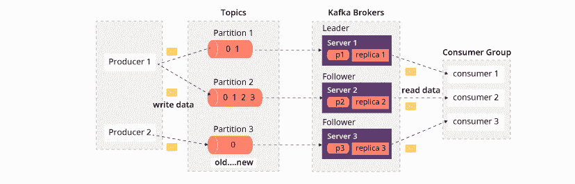
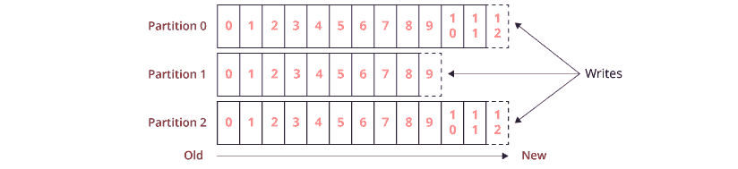

<!--yml
category: 微服务
date: 2022-11-19 13:21:54
-->

# Kafka面试指南一（zthinker）

> 来源：[https://zthinker.com/archives/kafka-interview-1](https://zthinker.com/archives/kafka-interview-1)

1.  [Java内存管理面试指南一](https://zthinker.com/archives/java-memory-interview-1)
2.  [Java基础面试指南一](https://zthinker.com/archives/java-basic-interview-1)
3.  [Java基础面试指南二](https://zthinker.com/archives/java-basic-interview-2)
4.  [Java基础面试指南三](https://zthinker.com/archives/java-basic-interview-3)
5.  [Java基础面试指南四](https://zthinker.com/archives/java-basic-interview-4)
6.  [Java线程面试指南一](https://zthinker.com/archives/java-thread-interview-1)
7.  [Java线程面试指南二](https://zthinker.com/archives/java-thread-interview-2)
8.  [Redis面试指南一](https://zthinker.com/archives/redis-interview-1)
9.  [Kafka面试指南一](https://zthinker.com/archives/kafka-interview-1)
10.  [Spring面试指南一](https://zthinker.com/archives/spring-interview-1)
11.  [SpringBoot面试指南一](https://zthinker.com/archives/springboot-interview-1)
12.  [微服务面试指南一](https://zthinker.com/archives/microservice-interview-1)

Kafka是由Apache基金会开发的消息传递框架,该框架将创建创建消息传递系统以及可提供容错群集以及低延迟系统,以确保端到端交付.

以下是要点:

*   Kafka是一个消息传递系统,它提供了容错功能以防止消息丢失.  
*   在public-subscribe 模型上进行设计.
*   Kafka cab支持Java和Scala.
*   Kafka起源于LinkedIn,后来在2011年成为开源Apache项目
*   与Spark和其他大数据技术无缝协作.
*   支持集群模式操作
*   Kafka消息传递系统可以用于Web服务体系结构或大数据体系结构.  
*   与其他消息传递框架相比,Kafka易于编码和配置.

      Kafka需要其他组件(例如zookeeper)来创建集群并充当协调服务器

除了具有其他关键功能之外,Kafka还为从生产者到消费者的信息提供了可靠的传递方式.

*   Kafka旨在实现高吞吐量和容错消息服务.
*   Kafka提供了在Topic上构建patriation.
*   还提供复制功能.
*   Kafka提供了一个队列,该队列可以处理大量数据,并最终将消息从一个发送者传输到接收者.  
*   Kafka还将消息保留在磁盘中,并具有跨群集复制消息的功能
*   Kafka与Zookeeper合作,与其他服务进行协调和同步.
*   Kafka具有良好的内置支持Apache Spark.

要利用所有这些关键功能,我们需要与Zookeeper配置一起正确配置Kafka集群.

如今,kafka是一个基于Key的消息传递框架,它有以下几个关键点.

*   **可靠性** -Kafka提供了从发布者到订阅者的可靠传递,而消息丢失为零.
*   **可伸缩性** -Kafka通过与Zookeeper协调服务器一起使用群集来实现此功能
*   **耐用性** -通过使用分布式日志,消息可以保留在磁盘上.
*   **性能** -Kafka在发布和订阅应用程序中提供高吞吐量和低延迟.

考虑到上述功能,Kafka是Bigdata Technologies用来处理大量消息以实现平稳传递的最佳选择之一.

有很多用例,Kafka适合实际工作应用程序,但是下面列出的是经常使用的实际工作用例.

*   **指标**:用于监视操作数据,可用于分析或对从分布式系统中收集的数据进行统计操作 
*   **日志聚合解决方案**:可以在整个组织中使用,以收集来自多个服务的日志,消费者服务使用这些日志来执行分析操作.
*   **流处理**:Kafka的强大耐用性在流处理方面也非常有用.
*   **异步通信**:在微服务中,使这个庞大的系统保持同步是不希望的,因为它会使整个应用程序无响应. 而且,它一开始可能会破坏划分为微服务的整个目的. 因此,那时使用Kafka可使整个数据流变得更容易. 因为它是分布式的,所以具有很高的容错能力,并且可以通过Zookeeper等服务对代理节点进行持续监控. 因此,它使工作效率更高.
*   **聊天机器人**:当我们需要可靠的消息传递服务以顺利交付时,聊天机器人是最受欢迎的用例之一.  
*   **多租户解决方案**. 通过配置哪些主题可以产生或使用数据来启用多租户. 配额也有运营支持

上面是主要需要Kafka框架的用例,除此之外,还有其他一些情况取决于需求和设计.

现在让我们谈论一些现代的数据源,它是一种数据-诸如订单,库存和购物车之类的交易数据-诸如单击,点赞,推荐和在网页上的搜索之类的内容正在得到增强. 所有这些数据对于分析消费者的行为非常重要,并且可以提供一组预测分析引擎,这些引擎可以成为公司的与众不同之处.  

*   支持低延迟消息传递.
*   处理实时流量.
*   保证容错能力.
*   易于与Spark应用程序集成,以处理大量消息数据.
*   能够创建消息传递容器集群,该集群由诸如Zookeeper之类的协调服务器进行监视和监督.

因此,当我们需要处理这种数据量时,我们需要Kafka来解决此问题.  

Kafka流程图包含以下基本组件,这是设置消息传递基础结构所必需的.  

*   Topic
*   Broker
*   Zookeeper
*   Partition 
*   Producer
*   Consume

客户端和服务器之间的通信是通过简单,高性能,与语言无关的TCP协议完成的. 该协议已版本化,并与旧版本保持向后兼容性

主题是将记录发布到的逻辑名称. Kafka中的主题支持多用户模型,因此该主题可以有零个,一个或多个使用者来订阅写入该主题的数据.

*   主题是保留消息流的特定类别.
*   主题分为多个分区.
*   对于每个Kafka,至少应有一个分区.
*   每个分区均以未修改的有序顺序包含消息或有效负载.  
*   分区中的每个消息都有一个标识符,称为偏移量.
*   主题具有名称,并且在整个集群中必须唯一.  
*   生产者需要主题来发布有效负载.  
*   消费者从消费者那里提取了相同的有效载荷.  
*   对于每个主题,群集维护的日志如下所示.

每个分区都有一个有序且不可变的记录序列,该记录序列被连续附加到一个结构化的提交日志中. Kafka集群使用可配置的保留期限持久地保留所有已发布记录(无论是否已被使用).

Kafka主题被共享到分区中,该分区以不可修改的顺序包含消息.

*   分区是数据的逻辑分组.
*   分区允许您通过跨多个代理将主题中的数据拆分来并行化主题.  
*   主题中可以分组有一个或多个分区.
*   分区允许通过跨多个群集在多个主题中拆分数据来并行化主题.  
*   每个分区都有一个名为offset的标识符.
*   每个分区都可以放置在单独的计算机上,以允许多个用户并行读取主题.  

偏移量是分区内记录的唯一标识符. 它表示使用者在分区中的位置. 消费者可以从特定的偏移量开始读取消息,也可以从他们选择的任何偏移量点进行读取.

*   分区偏移具有唯一的序列ID,称为偏移.
*   每个分区应具有一个分区偏移量.  

主题还可以具有多个分区日志,如右侧图像中的click-topic一样. 这允许多个使用者并行地从一个主题中阅读.

*   Broker是负责维护发布数据的系统.
*   每个代理可以具有一个或多个分区.  
*   Kafka包含多个代理来维护负载均衡器.
*   Kafka Broker是无状态的 
*   例如:假设一个主题中有N个分区,并且有N个代理,那么每个代理都有1个分区.