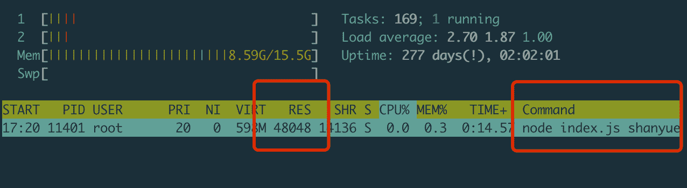

# linux

# 如何获取一个进程的内存并监控

> 原文：[https://q.shanyue.tech/base/linux/4.html](https://q.shanyue.tech/base/linux/4.html)

更多描述

在编写脚本时，有时会出现内存过大发生 OOM 的事情，那我们如何得知某个进程的内存？另外又如何监控它

Issue

欢迎在 Gtihub Issue 中回答此问题: [Issue 4(opens new window)](https://github.com/shfshanyue/Daily-Question/issues/4)

Author

回答者: [shfshanyue(opens new window)](https://github.com/shfshanyue)

通过 `ps` 可以获知一个进程所占用的内存

```
$ ps -O rss -p 3506
  PID   RSS S TTY          TIME COMMAND
 3506  6984 S pts/1    00:00:00 vim 
```

如果要**监控**内存，需要使用对进程万能的命令 `pidstat` （PS: 这名字一听就知道是干嘛的）

```
# -r 显示内存信息
# -p 指定 pid
# 1: 每个一秒打印一次
$ pidstat -r -p 3506 1
Linux 3.10.0-957.21.3.el7.x86_64 (shanyue)      11/04/19        _x86_64_        (2 CPU)

20:47:35      UID       PID  minflt/s  majflt/s     VSZ    RSS   %MEM  Command
20:47:36        0      3506      0.00      0.00  139940   6984   0.18  vim
20:47:37        0      3506      0.00      0.00  139940   6984   0.18  vim
20:47:38        0      3506      0.00      0.00  139940   6984   0.18  vim
20:47:39        0      3506      0.00      0.00  139940   6984   0.18  vim
20:47:40        0      3506      0.00      0.00  139940   6984   0.18  vim
20:47:41        0      3506      0.00      0.00  139940   6984   0.18  vim 
```

`pidstat` 是属于 `sysstat` 下的 linux 性能工具，但在 mac 中，如何定位内存的变化？此时可以使用万能的 `top/htop`

```
$ htop -p 31796 
```



## 总结

简而言之，有以下三个命令

1.  `pidstat -r`，只在 linux 环境下使用
2.  `htop/top -p`
3.  `ps -O rss -p`

关于更多指标的监控可以参考我的文章: [linux 各项监控指标小记(opens new window)](https://shanyue.tech/op/linux-monitor.html)

# 在 linux 中如何获取登录的用户

> 原文：[https://q.shanyue.tech/base/linux/29.html](https://q.shanyue.tech/base/linux/29.html)

Issue

欢迎在 Gtihub Issue 中回答此问题: [Issue 29(opens new window)](https://github.com/shfshanyue/Daily-Question/issues/29)

Author

回答者: [shfshanyue(opens new window)](https://github.com/shfshanyue)

```
$ who

$ last 
```

# linux 中如何打印所有网络接口

> 原文：[https://q.shanyue.tech/base/linux/31.html](https://q.shanyue.tech/base/linux/31.html)

Issue

欢迎在 Gtihub Issue 中回答此问题: [Issue 31(opens new window)](https://github.com/shfshanyue/Daily-Question/issues/31)

Author

回答者: [shfshanyue(opens new window)](https://github.com/shfshanyue)

## ifconfig

`ifconfig` 是最简单最常用，但是打印信息太多了

```
$ ifconfig
cni0: flags=4163<UP,BROADCAST,RUNNING,MULTICAST>  mtu 1450
        inet 10.244.0.1  netmask 255.255.255.0  broadcast 0.0.0.0
        ether 9e:f3:9e:47:9d:55  txqueuelen 1000  (Ethernet)
        RX packets 14733665  bytes 1007493238 (960.8 MiB)
        RX errors 0  dropped 0  overruns 0  frame 0
        TX packets 15040396  bytes 4534954611 (4.2 GiB)
        TX errors 0  dropped 0 overruns 0  carrier 0  collisions 0

docker0: flags=4099<UP,BROADCAST,MULTICAST>  mtu 1500
        inet 172.18.0.1  netmask 255.255.0.0  broadcast 172.18.255.255
        ether 02:42:09:fe:1d:e5  txqueuelen 0  (Ethernet)
        RX packets 0  bytes 0 (0.0 B)
        RX errors 0  dropped 0  overruns 0  frame 0
        TX packets 0  bytes 0 (0.0 B)
        TX errors 0  dropped 0 overruns 0  carrier 0  collisions 0 
```

## netstat

`netstat` 与 `ip` 也挺好用，特别是它们还可以打印路由表

```
$ netstat -i
Kernel Interface table
Iface             MTU    RX-OK RX-ERR RX-DRP RX-OVR    TX-OK TX-ERR TX-DRP TX-OVR Flg
cni0             1450 14733471      0      0 0      15040202      0      0      0 BMRU
docker0          1500        0      0      0 0             0      0      0      0 BMU
eth0             1500 42833038      0      0 0      40961577      0      0      0 BMRU
flannel.1        1450  4761436      0      0 0       4091581      0      0      0 BMRU
lo              65536 376447249      0      0 0      376447249      0      0      0 LRU
veth2052e2d6     1450  7358995      0      0 0       7518642      0      0      0 BMRU
veth3190806e     1450  7363232      0      0 0       7510100      0      0      0 BMRU 
```

## ip

```
$ ip link

$ ip addr 
```

# linux 有哪些发行版，你最喜欢哪一个

> 原文：[https://q.shanyue.tech/base/linux/38.html](https://q.shanyue.tech/base/linux/38.html)

Issue

欢迎在 Gtihub Issue 中回答此问题: [Issue 38(opens new window)](https://github.com/shfshanyue/Daily-Question/issues/38)

Author

回答者: [zhangzl419(opens new window)](https://github.com/zhangzl419)

我最喜欢的 Linux 发行版是 Centos，第二喜欢的是 Ubuntu。Centos 在服务器上很好用，Ubuntu 做开发环境很好用。

Author

回答者: [shfshanyue(opens new window)](https://github.com/shfshanyue)

> 我最喜欢的 Linux 发行版是 Centos，第二喜欢的是 Ubuntu。Centos 在服务器上很好用，Ubuntu 做开发环境很好用。

用的人多，就好用了。（不过我装 `tmux` 和 `vim` 都需要从源码编译

linux 的发行版，可以在 https://distrowatch.com 查询

因为平常工作都在 windows 环境下，只有部署的时候才会用到 linux 我司用到的 linux 为 centos 7 版本，比较稳定 我最喜欢的是 deepin，在业余时间接触过这个，图形化的界面很舒服，唯二的缺点是驱动问题和软件源问题

# CoW 策略指什么，docker 中有哪些应用

> 原文：[https://q.shanyue.tech/base/linux/42.html](https://q.shanyue.tech/base/linux/42.html)

Issue

欢迎在 Gtihub Issue 中回答此问题: [Issue 42(opens new window)](https://github.com/shfshanyue/Daily-Question/issues/42)

# 如何使用命令查看一个文件有多少字符以及多少行

> 原文：[https://q.shanyue.tech/base/linux/44.html](https://q.shanyue.tech/base/linux/44.html)

Issue

欢迎在 Gtihub Issue 中回答此问题: [Issue 44(opens new window)](https://github.com/shfshanyue/Daily-Question/issues/44)

Author

回答者: [shfshanyue(opens new window)](https://github.com/shfshanyue)

wc，及 `word count`，用以统计一个文件的行数、单词数、字符数及文件大小

```
# 97 - lines
# 177 - words
# 5087 - bytes
$ wc Readme.md
97  177 5087 Readme.md

# -m 用以统计字符数
$ wc -m Readme.md
3107 Readme.md 
```

相关问题：

*   [Vim 中如何查看文件的行数及字符数(opens new window)](https://github.com/shfshanyue/Daily-Question/issues/45)

# 如何在 linux 中打印所有环境变量

> 原文：[https://q.shanyue.tech/base/linux/56.html](https://q.shanyue.tech/base/linux/56.html)

Issue

欢迎在 Gtihub Issue 中回答此问题: [Issue 56(opens new window)](https://github.com/shfshanyue/Daily-Question/issues/56)

Author

回答者: [shfshanyue(opens new window)](https://github.com/shfshanyue)

```
$ printenv
XDG_SESSION_ID=10536
HOSTNAME=shanyue
TERM=xterm-256color
SHELL=/bin/bash
HISTSIZE=1000
SSH_CLIENT=124.200.184.74 16003 22
SSH_TTY=/dev/pts/0 
```

# 如何用 linux 命令输出文件的特定行

> 原文：[https://q.shanyue.tech/base/linux/71.html](https://q.shanyue.tech/base/linux/71.html)

Issue

欢迎在 Gtihub Issue 中回答此问题: [Issue 71(opens new window)](https://github.com/shfshanyue/Daily-Question/issues/71)

Author

回答者: [shfshanyue(opens new window)](https://github.com/shfshanyue)

通常使用 `sed` 命令打印特定行，如

```
# -n: 按特定格式打印
# 100p: 指打印第一百行
$ sed -n 100p Readme.md 
```

但 `sed` 打印的本领，远不止于此，除了打印特定行，还可以打印一段范围的行，如

```
# 打印文件中第 100-120 行
$ sed -n 100,120p Readme.md

# 打印文件中第 100-120 行
$ sed -n 100,+20p Readme.md 
```

还有一种本办法，`head`/`tail` 的组合命令，以要输出第 100 行为例

```
# 输出前100行，再通过 pipe，输出最后一行
$ head -100 Readme.md | tail -1 
```

关于 `sed` 更多的用法可以参考我的文章: [sed 命令详解及示例(opens new window)](https://shanyue.tech/op/linux-sed.html)

## 总结

两种方法

1.  `sed -n 100p Readme.md`
2.  `head -100 Readme.md | tail -1`

# cron 表达式 (_ 10 _ * *) 会如何触发

> 原文：[https://q.shanyue.tech/base/linux/97.html](https://q.shanyue.tech/base/linux/97.html)

Issue

欢迎在 Gtihub Issue 中回答此问题: [Issue 97(opens new window)](https://github.com/shfshanyue/Daily-Question/issues/97)

Author

回答者: [shfshanyue(opens new window)](https://github.com/shfshanyue)

每天十点，每分钟都会执行一次

# cron 表达式 (30 10 * * *) 会如何触发

> 原文：[https://q.shanyue.tech/base/linux/98.html](https://q.shanyue.tech/base/linux/98.html)

Issue

欢迎在 Gtihub Issue 中回答此问题: [Issue 98(opens new window)](https://github.com/shfshanyue/Daily-Question/issues/98)

Author

回答者: [shfshanyue(opens new window)](https://github.com/shfshanyue)

每天十点半执行一次

# 在 linux 中如何查看 cron 执行的情况

> 原文：[https://q.shanyue.tech/base/linux/99.html](https://q.shanyue.tech/base/linux/99.html)

Issue

欢迎在 Gtihub Issue 中回答此问题: [Issue 99(opens new window)](https://github.com/shfshanyue/Daily-Question/issues/99)

Author

回答者: [shfshanyue(opens new window)](https://github.com/shfshanyue)

在 `centos` 中，查看日志文件

```
$ tail -f /var/log/cron
Dec  5 19:30:01 8 CROND[24068]: (root) CMD (echo hello, world)
Dec  5 19:31:01 8 CROND[24084]: (root) CMD (echo hello, world)
Dec  5 19:31:01 8 CROND[24083]: (root) CMD (echo hello)
Dec  5 19:32:01 8 CROND[24094]: (root) CMD (echo hello, world)
Dec  5 19:32:01 8 CROND[24093]: (root) CMD (echo hello)
Dec  5 19:33:01 8 CROND[24104]: (root) CMD (echo hello, world)
Dec  5 19:33:01 8 CROND[24103]: (root) CMD (echo hello)
Dec  5 19:34:01 8 CROND[24113]: (root) CMD (echo hello)
Dec  5 19:34:01 8 CROND[24114]: (root) CMD (echo hello, world) 
```

# 如何查看一个文件的 inode number

> 原文：[https://q.shanyue.tech/base/linux/115.html](https://q.shanyue.tech/base/linux/115.html)

Issue

欢迎在 Gtihub Issue 中回答此问题: [Issue 115(opens new window)](https://github.com/shfshanyue/Daily-Question/issues/115)

Author

回答者: [shfshanyue(opens new window)](https://github.com/shfshanyue)

可以使用 `ls` 或者 `stat`

```
$ stat hello.txt
  File: ‘hello.txt’
  Size: 30              Blocks: 8          IO Block: 4096   regular file
Device: fd01h/64769d    Inode: 917526      Links: 1
Access: (0644/-rw-r--r--)  Uid: (    0/    root)   Gid: (    0/    root)
Access: 2019-12-10 16:15:55.253325208 +0800
Modify: 2019-12-10 16:15:52.740653330 +0800
Change: 2019-12-10 16:15:52.742653069 +0800

$ ls -i hello.txt
917526 hello.txt 
```

# 文件系统中 mtime、ctime 和 atime 指什么，都有什么不同

> 原文：[https://q.shanyue.tech/base/linux/116.html](https://q.shanyue.tech/base/linux/116.html)

Issue

欢迎在 Gtihub Issue 中回答此问题: [Issue 116(opens new window)](https://github.com/shfshanyue/Daily-Question/issues/116)

Author

回答者: [shfshanyue(opens new window)](https://github.com/shfshanyue)

在 `linux` 中，

*   `mtime`：`modified time` 指文件内容改变的时间戳
*   `ctime`：`change time` 指文件属性改变的时间戳，属性包括 `mtime`。而在 windows 上，它表示的是 `creation time`

所以 `ctime` 会比 `mtime` 要大一些，使用 `stat` 查看文件属性如下

```
$ stat hello.txt
  File: ‘hello.txt’
  Size: 30              Blocks: 8          IO Block: 4096   regular file
Device: fd01h/64769d    Inode: 917526      Links: 1
Access: (0644/-rw-r--r--)  Uid: (    0/    root)   Gid: (    0/    root)
Access: 2019-12-10 16:15:55.253325208 +0800
Modify: 2019-12-10 16:15:52.740653330 +0800
Change: 2019-12-10 16:15:52.742653069 +0800
 Birth: - 
```

而 http 服务选择 `Last_Modified` 时一般会选择 `mtime`