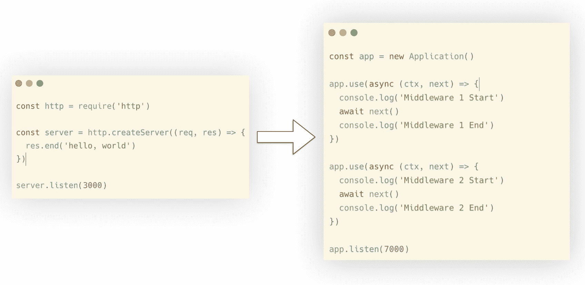
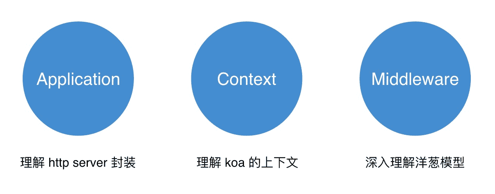
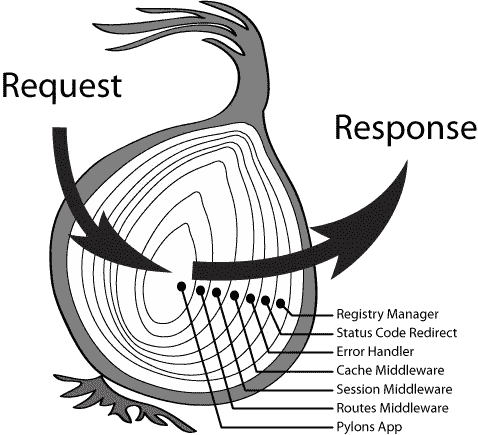
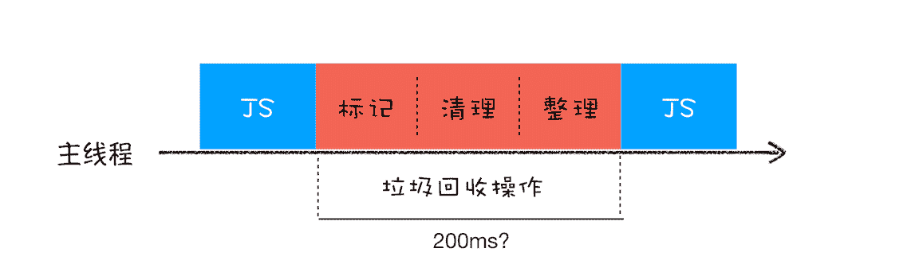
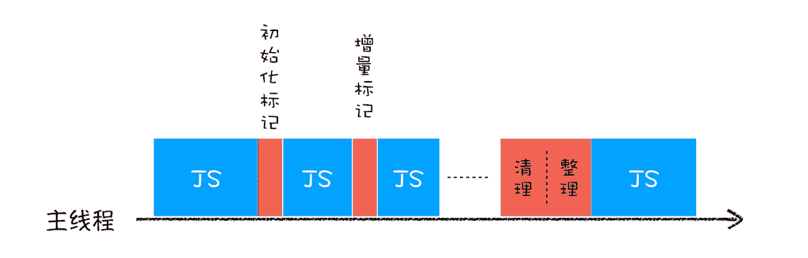
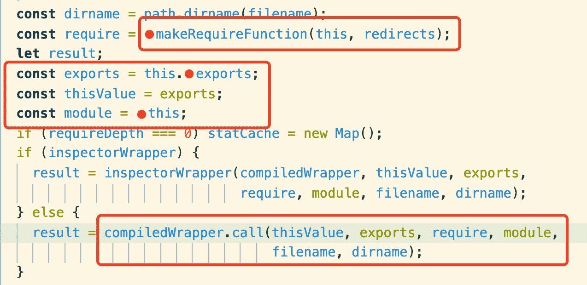

<!--yml
category: NodeJS
date: 0001-01-01 00:00:00
-->

# NodeJS 面试题（山月）

# 有没有读过 koa 的源码，什么是洋葱模型呢

> 原文：[https://q.shanyue.tech/fe/node/119.html](https://q.shanyue.tech/fe/node/119.html)

Issue

欢迎在 Gtihub Issue 中回答此问题: [Issue 119(opens new window)](https://github.com/shfshanyue/Daily-Question/issues/119)

Author

回答者: [shfshanyue(opens new window)](https://github.com/shfshanyue)

# 四十行代码实现一个 koa

当我们在深入学习一个框架或者库时，为了了解它的思想及设计思路，也为了更好地使用和避免无意的 Bug，有时很有必要研究源码。对于 koa 这种极为简单，而应用却很广泛的框架/库更应该了解它的源码。

而为了验证我们是否已足够了解它，可以实现一个仅仅具备核心功能的迷你的库。正所谓，麻雀虽小，五脏俱全。

`删繁就简三秋树`，这里只用四十行代码实现一个小型的却具有其核心功能的 koa。

> **源码实现：[https://github.com/shfshanyue/koa-mini(opens new window)](https://github.com/shfshanyue/koa-mini)**



这是一个拥有 koa 几乎所有核心功能最简化的示例：

```
const Koa = require("koa");
const app = new Koa();

app.use(async (ctx, next) => {
  console.log("Middleware 1 Start");
  await next();
  console.log("Middleware 1 End");
});

app.use(async (ctx, next) => {
  console.log("Middleware 2 Start");
  await next();
  console.log("Middleware 2 End");

  ctx.body = "hello, world";
});

app.listen(3000);

// output
// Middleware 1 Start
// Middleware 2 Start
// Middleware 2 End
// Middleware 1 End 
```

在这个最简化的示例中，可以看到有三个清晰的模块，分别如下：

*   Application: 基本服务器框架
*   Context: 服务器框架基本数据结构的封装，用以 http 请求解析及响应
*   Middleware: 中间件，也是洋葱模型的核心机制



我们开始逐步实现这三个模块：

## 抛开框架，来写一个简单的 server

我们先基于 node 最基本的 `http API` 来启动一个 http 服务，并通过它来实现最简版的 koa：

```
const http = require("http");

const server = http.createServer((req, res) => {
  res.end("hello, world");
});

server.listen(3000); 
```

而要实现最简版的 `koa` 示例如下，我把最简版的这个 koa 命名为 `koa-mini`

```
const Koa = require("koa-mini");
const app = new Koa();

app.use(async (ctx, next) => {
  console.log("Middleware 1 Start");
  await next();
  console.log("Middleware 1 End");
});

app.use(async (ctx, next) => {
  console.log("Middleware 2 Start");
  await next();
  console.log("Middleware 2 End");

  ctx.body = "hello, world";
});

app.listen(3000); 
```

## 构建 Application

首先完成 `Appliacation` 的大体框架：

*   `app.listen`: 处理请求及响应，并且监听端口
*   `app.use`: 中间件函数，处理请求并完成响应

只有简单的十几行代码，示例如下：

```
const http = require("http");

class Application {
  constructor() {
    this.middleware = null;
  }

  listen(...args) {
    const server = http.createServer(this.middleware);
    server.listen(...args);
  }

  // 这里依旧调用的是原生 http.createServer 的回调函数
  use(middleware) {
    this.middleware = middleware;
  }
} 
```

此时调用 `Application` 启动服务的代码如下:

```
const app = new Appliacation();

app.use((req, res) => {
  res.end("hello, world");
});

app.listen(3000); 
```

由于 `app.use` 的回调函数依然是原生的 `http.crateServer` 回调函数，而在 `koa` 中回调参数是一个 `Context` 对象。

下一步要做的将是构建 `Context` 对象。

## 构建 Context

在 koa 中，`app.use` 的回调参数为一个 `ctx` 对象，而非原生的 `req/res`。因此在这一步要构建一个 `Context` 对象，并使用 `ctx.body` 构建响应：

*   `app.use(ctx => ctx.body = 'hello, world')`: 通过在 `http.createServer` 回调函数中进一步封装 `Context` 实现
*   `Context(req, res)`: 以 `request/response` 数据结构为主体构造 Context 对象

核心代码如下，注意注释部分：

```
const http = require("http");

class Application {
  constructor() {}
  use() {}

  listen(...args) {
    const server = http.createServer((req, res) => {
      // 构造 Context 对象
      const ctx = new Context(req, res);

      // 此时处理为与 koa 兼容 Context 的 app.use 函数
      this.middleware(ctx);

      // ctx.body 为响应内容
      ctx.res.end(ctx.body);
    });
    server.listen(...args);
  }
}

// 构造一个 Context 的类
class Context {
  constructor(req, res) {
    this.req = req;
    this.res = res;
  }
} 
```

此时 `koa` 被改造如下，`app.use` 可以正常工作：

```
const app = new Application();

app.use((ctx) => {
  ctx.body = "hello, world";
});

app.listen(7000); 
```

实现以上的代码都很简单，现在就剩下一个最重要也是最核心的功能：洋葱模型

## 洋葱模型及中间件改造

上述工作只有简单的一个中间件，然而在现实中中间件会有很多个，如错误处理，权限校验，路由，日志，限流等等。因此我们要改造下 `app.middlewares`

*   `app.middlewares`: 收集中间件回调函数数组，并并使用 `compose` 串联起来

对所有中间件函数通过 `compose` 函数来达到抽象效果，它将对 `Context` 对象作为参数，来接收请求及处理响应：

```
// this.middlewares 代表所有中间件
// 通过 compose 抽象
const fn = compose(this.middlewares);
await fn(ctx);

// 当然，也可以写成这种形式，只要带上 ctx 参数
await compose(this.middlewares, ctx); 
```

此时完整代码如下：

```
const http = require("http");

class Application {
  constructor() {
    this.middlewares = [];
  }

  listen(...args) {
    const server = http.createServer(async (req, res) => {
      const ctx = new Context(req, res);

      // 对中间件回调函数串联，形成洋葱模型
      const fn = compose(this.middlewares);
      await fn(ctx);

      ctx.res.end(ctx.body);
    });
    server.listen(...args);
  }

  use(middleware) {
    // 中间件回调函数变为了数组
    this.middlewares.push(middleware);
  }
} 
```

接下来，着重完成 `compose` 函数

### 完成 compose 函数的封装



koa 的洋葱模型指出每一个中间件都像是洋葱的每一层，当从洋葱中心穿过时，每层都会一进一出穿过两次，且最先穿入的一层最后穿出。

*   `middleware`: 第一个中间件将会执行
*   `next`: 每个中间件将会通过 next 来执行下一个中间件

我们如何实现所有的中间件的洋葱模型呢?

我们看一看每一个 middleware 的 API 如下

```
middleware(ctx, next); 
```

而每个中间件中的 `next` 是指执行下一个中间件，我们来把 `next` 函数提取出来，而 `next` 函数中又有 `next`，这应该怎么处理呢？

```
const next = () => nextMiddleware(ctx, next);
middleware(ctx, next(0)); 
```

是了，使用一个递归完成中间件的改造，并把中间件给连接起来，如下所示:

```
// dispatch(i) 代表执行第 i 个中间件

const dispatch = (i) => {
  return middlewares[i](ctx, () => dispatch(i + 1));
};
dispatch(0); 
```

`dispatch(i)` 代表执行第 i 个中间件，而 `next()` 函数将会执行下一个中间件 `dispatch(i+1)`，于是我们使用递归轻松地完成了洋葱模型

此时，再把递归的终止条件补充上: 当最后一个中间件函数执行 `next()` 时，直接返回

```
const dispatch = (i) => {
  const middleware = middlewares[i];
  if (i === middlewares.length) {
    return;
  }
  return middleware(ctx, () => dispatch(i + 1));
};
return dispatch(0); 
```

最终的 `compose` 函数代码如下:

```
function compose(middlewares) {
  return (ctx) => {
    const dispatch = (i) => {
      const middleware = middlewares[i];
      if (i === middlewares.length) {
        return;
      }
      return middleware(ctx, () => dispatch(i + 1));
    };
    return dispatch(0);
  };
} 
```

至此，koa 的核心功能洋葱模型已经完成，写个示例来体验一下吧:

```
const app = new Application();

app.use(async (ctx, next) => {
  ctx.body = "hello, one";
  await next();
});

app.use(async (ctx, next) => {
  ctx.body = "hello, two";
  await next();
});

app.listen(7000); 
```

此时还有一个小小的但不影响全局的不足：异常处理，下一步将会完成异常捕获的代码

## 异常处理

如果在你的后端服务中因为某一处报错，而把整个服务给挂掉了怎么办？

我们只需要对中间件执行函数进行一次异常处理即可：

```
try {
  const fn = compose(this.middlewares);
  await fn(ctx);
} catch (e) {
  console.error(e);
  ctx.res.statusCode = 500;
  ctx.res.write("Internel Server Error");
} 
```

然而在日常项目中使用时，我们**必须**在框架层的异常捕捉之前就需要捕捉到它，来做一些异常结构化及异常上报的任务，此时会使用一个异常处理的中间件：

```
// 错误处理中间件
app.use(async (ctx, next) => {
  try {
    await next();
  } catch (err) {
    // 1\. 异常结构化
    // 2\. 异常分类
    // 3\. 异常级别
    // 4\. 异常上报
  }
}); 
```

## 小结

`koa` 的核心代码特别简单，如果你是一个 Node 工程师，非常建议在业务之余研究一下 koa 的源码，并且自己也实现一个最简版的 koa。

我源码实现的仓库为：[koa-mini(opens new window)](https://github.com/shfshanyue/koa-mini)

Author

回答者: [Carrie999(opens new window)](https://github.com/Carrie999)

我读过，大概是用 promise 来实现，一个这个 promise 一直在等下一个 promise 所以就像洋葱模型了

# 如何监控文件的变动

> 原文：[https://q.shanyue.tech/fe/node/124.html](https://q.shanyue.tech/fe/node/124.html)

更多描述

当一个文件或者一个目录下的文件有所变动时能够监控到。

如一些前端和后端项目在开发环境下会根据项目目录变动而重启或者重新编译

Issue

欢迎在 Gtihub Issue 中回答此问题: [Issue 124(opens new window)](https://github.com/shfshanyue/Daily-Question/issues/124)

Author

回答者: [shfshanyue(opens new window)](https://github.com/shfshanyue)

1.  在 node 中调用 API `fs.watch`
2.  在 linux 中原理是 `inotify`，macos 中原理是 `FSEvents`，windows 中原理是 `ReadDirectoryChangesW`
3.  由于内核对文件监控更加细粒度，更加敏感，当每次修改文件时可能触发内核多次调用，需要防抖
4.  注意软链接，读写权限等文件系统属性

可参考文章 [How to Watch for Files Changes in Node.js(opens new window)](https://thisdavej.com/how-to-watch-for-files-changes-in-node-js/) 及 [精读《如何利用 Nodejs 监听文件夹》(opens new window)](https://github.com/dt-fe/weekly/blob/v2/059.%E7%B2%BE%E8%AF%BB%E3%80%8A%E5%A6%82%E4%BD%95%E5%88%A9%E7%94%A8%20Nodejs%20%E7%9B%91%E5%90%AC%E6%96%87%E4%BB%B6%E5%A4%B9%E3%80%8B.md)

Author

回答者: [everlose(opens new window)](https://github.com/everlose)

我不太清楚问这个的目的，是 fs.watch 吧？若要问的深一点底层怎么做的监听，我就不会了。贴一下答案？

Author

回答者: [shfshanyue(opens new window)](https://github.com/shfshanyue)

@everlose 简单的总结了以下，见楼上

# 在 Node 应用中如何利用多核心 CPU 的优势

> 原文：[https://q.shanyue.tech/fe/node/140.html](https://q.shanyue.tech/fe/node/140.html)

Issue

欢迎在 Gtihub Issue 中回答此问题: [Issue 140(opens new window)](https://github.com/shfshanyue/Daily-Question/issues/140)

Author

回答者: [shfshanyue(opens new window)](https://github.com/shfshanyue)

使用 `cluster` 模块

[Node 中 cluster 的原理是什么(opens new window)](https://github.com/shfshanyue/Daily-Question/issues/141)

# Node 中 cluster 的原理是什么

> 原文：[https://q.shanyue.tech/fe/node/141.html](https://q.shanyue.tech/fe/node/141.html)

Issue

欢迎在 Gtihub Issue 中回答此问题: [Issue 141(opens new window)](https://github.com/shfshanyue/Daily-Question/issues/141)

Author

回答者: [shfshanyue(opens new window)](https://github.com/shfshanyue)

1.  `fork` 子进程
2.  `Load Balance`
3.  多进程共享端口

## 相关文章

*   [Node 官方文档: cluster(opens new window)](https://nodejs.org/api/cluster.html)
*   [深入浅出 node cluster(opens new window)](https://juejin.im/post/5c87760fe51d4507534c88e5)
*   [Node.js 进阶：cluster 模块深入剖析(opens new window)](https://github.com/chyingp/nodejs-learning-guide/blob/master/%E6%A8%A1%E5%9D%97/cluster.md)

# Node 中如何判断一个路径是文件还是文件夹

> 原文：[https://q.shanyue.tech/fe/node/205.html](https://q.shanyue.tech/fe/node/205.html)

Issue

欢迎在 Gtihub Issue 中回答此问题: [Issue 205(opens new window)](https://github.com/shfshanyue/Daily-Question/issues/205)

Author

回答者: [PlutoCA(opens new window)](https://github.com/PlutoCA)

const statInfo = fs.lstatSync("./xx"). statInfo.isDirectory()

# 以下代码，koa 会返回什么数据

> 原文：[https://q.shanyue.tech/fe/node/238.html](https://q.shanyue.tech/fe/node/238.html)

更多描述

根据有无 `await next()` 判断以下代码输出结果

```
const Koa = require("koa");
const app = new Koa();

app.use(async (ctx, next) => {
  ctx.body = "hello, 1";
});

app.use((ctx) => {
  ctx.body = "hello, 2";
});

app.listen(3000); 
```

```
const Koa = require("koa");
const app = new Koa();

app.use(async (ctx, next) => {
  ctx.body = "hello, 1";
  await next();
});

app.use((ctx) => {
  ctx.body = "hello, 2";
});

app.listen(3000); 
```

```
const Koa = require("koa");
const app = new Koa();

app.use(async (ctx, next) => {
  await next();
  ctx.body = "hello, 1";
});

app.use((ctx) => {
  ctx.body = "hello, 2";
});

app.listen(3000); 
```

Issue

欢迎在 Gtihub Issue 中回答此问题: [Issue 238(opens new window)](https://github.com/shfshanyue/Daily-Question/issues/238)

Author

回答者: [shfshanyue(opens new window)](https://github.com/shfshanyue)

根据 koa 的洋葱模型，返回结果是

```
hello, 1

hello, 2

hello, 1 
```

# Node 如何进行进程间通信

> 原文：[https://q.shanyue.tech/fe/node/240.html](https://q.shanyue.tech/fe/node/240.html)

Issue

欢迎在 Gtihub Issue 中回答此问题: [Issue 240(opens new window)](https://github.com/shfshanyue/Daily-Question/issues/240)

Author

回答者: [shfshanyue(opens new window)](https://github.com/shfshanyue)

对于 spawn/fork 出来的父子进程来说，可以通过 pipe 的方式

*   `process.on('message')`/`process.send`
*   `stdin.on/stdout.write`

对于并无相关的进程

*   `socket`
*   `message queue`

# 有没有用过 continuous local storage，用在了哪里

> 原文：[https://q.shanyue.tech/fe/node/244.html](https://q.shanyue.tech/fe/node/244.html)

Issue

欢迎在 Gtihub Issue 中回答此问题: [Issue 244(opens new window)](https://github.com/shfshanyue/Daily-Question/issues/244)

# Promise 在异步资源的生命周期 (async_hooks) 中是如何被销毁的

> 原文：[https://q.shanyue.tech/fe/node/246.html](https://q.shanyue.tech/fe/node/246.html)

Issue

欢迎在 Gtihub Issue 中回答此问题: [Issue 246(opens new window)](https://github.com/shfshanyue/Daily-Question/issues/246)

# 在 node 中如何监听异步资源的生命周期

> 原文：[https://q.shanyue.tech/fe/node/249.html](https://q.shanyue.tech/fe/node/249.html)

Issue

欢迎在 Gtihub Issue 中回答此问题: [Issue 249(opens new window)](https://github.com/shfshanyue/Daily-Question/issues/249)

# 测试中 TDD 与 BDD 有什么区别

> 原文：[https://q.shanyue.tech/fe/node/250.html](https://q.shanyue.tech/fe/node/250.html)

Issue

欢迎在 Gtihub Issue 中回答此问题: [Issue 250(opens new window)](https://github.com/shfshanyue/Daily-Question/issues/250)

# node --max-old-space-size=4096 是什么意思

> 原文：[https://q.shanyue.tech/fe/node/253.html](https://q.shanyue.tech/fe/node/253.html)

Issue

欢迎在 Gtihub Issue 中回答此问题: [Issue 253(opens new window)](https://github.com/shfshanyue/Daily-Question/issues/253)

# 如何理解 Node 的异步非阻塞 IO

> 原文：[https://q.shanyue.tech/fe/node/258.html](https://q.shanyue.tech/fe/node/258.html)

Issue

欢迎在 Gtihub Issue 中回答此问题: [Issue 258(opens new window)](https://github.com/shfshanyue/Daily-Question/issues/258)

# 当 Node 应用发生 gc 时，如何监控

> 原文：[https://q.shanyue.tech/fe/node/266.html](https://q.shanyue.tech/fe/node/266.html)

Issue

欢迎在 Gtihub Issue 中回答此问题: [Issue 266(opens new window)](https://github.com/shfshanyue/Daily-Question/issues/266)

# Node 应用中如何查看 gc 的日志

> 原文：[https://q.shanyue.tech/fe/node/267.html](https://q.shanyue.tech/fe/node/267.html)

Issue

欢迎在 Gtihub Issue 中回答此问题: [Issue 267(opens new window)](https://github.com/shfshanyue/Daily-Question/issues/267)

Author

回答者: [shfshanyue(opens new window)](https://github.com/shfshanyue)

通过开启参数 `--trace-gc` 与 `--trace-gc-verbose`

```
$ node --trace-gc index.js

[10711:0x3507b20]    36425 ms: Mark-sweep 28.6 (48.2) -> 19.3 (46.7) MB, 3.9 / 0.0 ms  (+ 10.4 ms in 8 steps since start of marking, biggest step 6.9 ms, walltime since start of marking 77 ms) (average mu = 0.997, current mu = 0.997) finalize incremental marking via task GC in old space requested
[10711:0x3507b20]    36434 ms: Scavenge 21.0 (46.7) -> 5.7 (46.7) MB, 1.0 / 0.0 ms  (average mu = 0.997, current mu = 0.997) allocation failure
[10711:0x3507b20]    36494 ms: Scavenge 21.1 (46.7) -> 6.2 (46.7) MB, 2.3 / 0.0 ms  (average mu = 0.997, current mu = 0.997) allocation failure
[10711:0x3507b20]    36562 ms: Scavenge 21.1 (46.7) -> 6.0 (46.7) MB, 2.8 / 0.0 ms  (average mu = 0.997, current mu = 0.997) allocation failure 
```

# 如何获取你们 Node 项目的 cpu profile 快照

> 原文：[https://q.shanyue.tech/fe/node/276.html](https://q.shanyue.tech/fe/node/276.html)

Issue

欢迎在 Gtihub Issue 中回答此问题: [Issue 276(opens new window)](https://github.com/shfshanyue/Daily-Question/issues/276)

# Node 中循环引用会发生什么

> 原文：[https://q.shanyue.tech/fe/node/291.html](https://q.shanyue.tech/fe/node/291.html)

Issue

欢迎在 Gtihub Issue 中回答此问题: [Issue 291(opens new window)](https://github.com/shfshanyue/Daily-Question/issues/291)

Author

回答者: [mrrs878(opens new window)](https://github.com/mrrs878)

在 CommonJS 规范中，当遇到`require()`语句时，会执行`require`模块中的代码，并缓存执行的结果，当下次再次加载时不会重复执行，而是直接取缓存的结果。正因为此，出现循环依赖时才不会出现无限循环调用的情况。

```
// a.js
const { b } = require("./b");

const a = 11;

console.log("b in a.js", b);

module.exports = { a }; 
```

```
// b.js
const { a } = require("./a");

const b = 12;

console.log("a in b.js", a);
setTimeout(() => {
  console.log("a in b.js", a);
}, 1000);

module.exports = { b }; 
```

当执行`node a.js`时：

```
a in b.js is undefined
b in a.js is 12
(node:23352) Warning: Accessing non-existent property 'a' of module exports inside circular dependency
(Use `node --trace-warnings ...` to show where the warning was created)
a in b.js is undefined 
```

Author

回答者: [shfshanyue(opens new window)](https://github.com/shfshanyue)

@mrrs878 在 b.js 代码示例中有一个拼写错误

Author

回答者: [mrrs878(opens new window)](https://github.com/mrrs878)

@shfshanyue 感谢老哥指正，已修改

# Node 中 require 时发生了什么

> 原文：[https://q.shanyue.tech/fe/node/292.html](https://q.shanyue.tech/fe/node/292.html)

Issue

欢迎在 Gtihub Issue 中回答此问题: [Issue 292(opens new window)](https://github.com/shfshanyue/Daily-Question/issues/292)

Author

回答者: [haotie1990(opens new window)](https://github.com/haotie1990)

[http://nodejs.cn/api/modules.html#modules_all_together(opens new window)](http://nodejs.cn/api/modules.html#modules_all_together)

# 简述 node/v8 中的垃圾回收机制

> 原文：[https://q.shanyue.tech/fe/node/293.html](https://q.shanyue.tech/fe/node/293.html)

Issue

欢迎在 Gtihub Issue 中回答此问题: [Issue 293(opens new window)](https://github.com/shfshanyue/Daily-Question/issues/293)

Author

回答者: [shfshanyue(opens new window)](https://github.com/shfshanyue)

`v8` 中的垃圾回收机制分为三种

1.  `Scavenge`，工作在新生代，把 `from space` 中的存活对象移至 `to space`
2.  `Mark-Sweep`，标记清除。新生代的某些对象由于过度活跃会被移至老生代，此时对老生代中活对象进行标记，并清理死对象
3.  `Mark-Compact`，标记整理。

## 相关链接

1.  [主流的垃圾回收机制都有哪些?(opens new window)](https://www.zhihu.com/question/32373436)
2.  [各种编程语言的实现都采用了哪些垃圾回收算法(opens new window)](https://www.zhihu.com/question/20018826)

Author

回答者: [wjw-gavin(opens new window)](https://github.com/wjw-gavin)

当一个函数执行结束之后，JavaScript 引擎会通过向下移动 ESP 来销毁该函数保存在栈中的执行上下文。 要回收堆中的垃圾数据，就需要用到 JavaScript 中的垃圾回收器了。 代际假说（The Generational Hypothesis），是垃圾回收领域中一个重要的术语，后续垃圾回收的策略都是建立在该假说的基础之上的，所以很是重要。 代际假说有以下两个特点：

1.  大部分对象在内存中存在的时间很短，简单来说，就是很多对象一经分配内存，很快就变得不可访问；
2.  是不死的对象，会活得更久。 在 V8 中会把堆分为新生代和老生代两个区域，新生代中存放的是生存时间短的对象，老生代中存放的生存时间久的对象。 ● 副垃圾回收器，主要负责新生代的垃圾回收。 ● 主垃圾回收器，主要负责老生代的垃圾回收。

全停顿 

增量标记 

使用增量标记算法，可以把一个完整的垃圾回收任务拆分为很多小的任务，这些小的任务执行时间比较短，可以穿插在其他的 JavaScript 任务中间执行，增强用户体验。

参考： [浏览器工作原理与实践(opens new window)](https://time.geekbang.org/column/article/131233)

# node 中 exec，fork 与 spawn 有何区别

> 原文：[https://q.shanyue.tech/fe/node/302.html](https://q.shanyue.tech/fe/node/302.html)

Issue

欢迎在 Gtihub Issue 中回答此问题: [Issue 302(opens new window)](https://github.com/shfshanyue/Daily-Question/issues/302)

# node 中 dns.resolve 及 dns.lookup 有什么区别

> 原文：[https://q.shanyue.tech/fe/node/310.html](https://q.shanyue.tech/fe/node/310.html)

Issue

欢迎在 Gtihub Issue 中回答此问题: [Issue 310(opens new window)](https://github.com/shfshanyue/Daily-Question/issues/310)

Author

回答者: [thundernet8(opens new window)](https://github.com/thundernet8)

`dns.resolve` 返回指定类型或全部类型的 dns 解析记录，如`A记录`, `CNAME`记录, `MX`记录 `dns.lookup`返回`A记录`(IPv4)或`AAAA记录`(IPv6)

Author

回答者: [paul-wj(opens new window)](https://github.com/paul-wj)

dns.resolve 为内核 api，无需占用 thread pool，优先级更高 dns.lookup 为 thread pool api，占用 thread pool，影响线程池方法（例如 fs 模块方法等）

# Node 中 require json 文件数据时，如何当文件更新时，重新 require

> 原文：[https://q.shanyue.tech/fe/node/312.html](https://q.shanyue.tech/fe/node/312.html)

Issue

欢迎在 Gtihub Issue 中回答此问题: [Issue 312(opens new window)](https://github.com/shfshanyue/Daily-Question/issues/312)

Author

回答者: [thundernet8(opens new window)](https://github.com/thundernet8)

```
function requireUncached(module) {
  delete require.cache[require.resolve(module)];
  return require(module);
} 
```

# node 中如何查看函数异步调用栈

> 原文：[https://q.shanyue.tech/fe/node/318.html](https://q.shanyue.tech/fe/node/318.html)

Issue

欢迎在 Gtihub Issue 中回答此问题: [Issue 318(opens new window)](https://github.com/shfshanyue/Daily-Question/issues/318)

# 有没有接触过 fs-extra，它是解决什么问题的

> 原文：[https://q.shanyue.tech/fe/node/324.html](https://q.shanyue.tech/fe/node/324.html)

Issue

欢迎在 Gtihub Issue 中回答此问题: [Issue 324(opens new window)](https://github.com/shfshanyue/Daily-Question/issues/324)

# 在 node 中如何开启 https

> 原文：[https://q.shanyue.tech/fe/node/350.html](https://q.shanyue.tech/fe/node/350.html)

Issue

欢迎在 Gtihub Issue 中回答此问题: [Issue 350(opens new window)](https://github.com/shfshanyue/Daily-Question/issues/350)

Author

回答者: [shfshanyue(opens new window)](https://github.com/shfshanyue)

在 `express` 中开启 https，如下代码所示

```
import path from "path";
import fs from "fs";
import express from "express";
import http from "http";
import https from "https";

const app = express();

const cred = {
  key: fs.readFileSync(path.resolve(__dirname, "../key.pem")),
  cert: fs.readFileSync(path.resolve(__dirname, "../cert.pem")),
};
const httpServer = http.createServer(app);
const httpsServer = https.createServer(cred, app);

httpServer.listen(8000);
httpsServer.listen(8888); 
```

# node 中 module.exports 与 exports 有什么区别

> 原文：[https://q.shanyue.tech/fe/node/351.html](https://q.shanyue.tech/fe/node/351.html)

Issue

欢迎在 Gtihub Issue 中回答此问题: [Issue 351(opens new window)](https://github.com/shfshanyue/Daily-Question/issues/351)

Author

回答者: [shfshanyue(opens new window)](https://github.com/shfshanyue)

**一句话：`exports` 是 `module.exports` 的引用，如果 `exports` 没有重赋值，则二者没有任何区别**

类似如下所示

```
const exports = module.exports; 
```

那如下结果会如何导出？

```
module.exports = 100;
exports = 3; 
```

很显然会导出 100，毕竟 `exports` 进行了重赋值。

**那在 node 源码中如何实现的呢？** 从源码里可以看出 **exports** 的实质



详见源码: [https://github.com/nodejs/node/blob/master/lib/internal/modules/cjs/loader.js#L1252(opens new window)](https://github.com/nodejs/node/blob/master/lib/internal/modules/cjs/loader.js#L1252)，可以看出符合猜想

众所周知，node 中所有的模块代码都被包裹在这个函数中

```
exports = module.exports(function (
  exports,
  require,
  module,
  __filename,
  __dirname
) {
  exports.a = 3;
}); 
```

而以下源码指出，`exports` 是如何得来

```
const dirname = path.dirname(filename);
const require = makeRequireFunction(this, redirects);
let result;
// 从这里可以看出来 exports 的实质
const exports = this.exports;
const thisValue = exports;
const module = this;
if (requireDepth === 0) statCache = new Map();
if (inspectorWrapper) {
  result = inspectorWrapper(
    compiledWrapper,
    thisValue,
    exports,
    require,
    module,
    filename,
    dirname
  );
} else {
  // 这里是模块包装函数
  result = compiledWrapper.call(
    thisValue,
    exports,
    require,
    module,
    filename,
    dirname
  );
} 
```

# 如何实现一个 timeout 的中间件

> 原文：[https://q.shanyue.tech/fe/node/353.html](https://q.shanyue.tech/fe/node/353.html)

Issue

欢迎在 Gtihub Issue 中回答此问题: [Issue 353(opens new window)](https://github.com/shfshanyue/Daily-Question/issues/353)

# 如何得知目前 node 版本的 v8 版本号

> 原文：[https://q.shanyue.tech/fe/node/354.html](https://q.shanyue.tech/fe/node/354.html)

Issue

欢迎在 Gtihub Issue 中回答此问题: [Issue 354(opens new window)](https://github.com/shfshanyue/Daily-Question/issues/354)

Author

回答者: [shfshanyue(opens new window)](https://github.com/shfshanyue)

在 `process.versions` 中可以查看 node 及相关依赖的版本号

```
> process.versions
{
  node: '12.16.3',
  v8: '7.8.279.23-node.35',
  uv: '1.34.2',
  zlib: '1.2.11',
  brotli: '1.0.7',
  ares: '1.16.0',
  modules: '72',
  nghttp2: '1.40.0',
  napi: '5',
  llhttp: '2.0.4',
  http_parser: '2.9.3',
  openssl: '1.1.1g',
  cldr: '36.0',
  icu: '65.1',
  tz: '2019c',
  unicode: '12.1'
} 
```

# 在 node 中如何判断一个对象是 stream

> 原文：[https://q.shanyue.tech/fe/node/357.html](https://q.shanyue.tech/fe/node/357.html)

Issue

欢迎在 Gtihub Issue 中回答此问题: [Issue 357(opens new window)](https://github.com/shfshanyue/Daily-Question/issues/357)

Author

回答者: [shfshanyue(opens new window)](https://github.com/shfshanyue)

`stream` 可以通过缓冲区来高效利用内存，从而提高性能。常用场景如读写大文件、http-server 中的大静态文件渲染。

**每一个 stream 都有 `pipe` 函数，可以用来判断一个对象是否 `stream`**。

代码如下，摘自 [is-stream(opens new window)](https://github.com/sindresorhus/is-stream/blob/master/index.js): 一个周下载量两千万的 npm package。

```
const isStream = (stream) =>
  stream !== null &&
  typeof stream === "object" &&
  typeof stream.pipe === "function";

isStream.writable = (stream) =>
  isStream(stream) &&
  stream.writable !== false &&
  typeof stream._write === "function" &&
  typeof stream._writableState === "object";

isStream.readable = (stream) =>
  isStream(stream) &&
  stream.readable !== false &&
  typeof stream._read === "function" &&
  typeof stream._readableState === "object";

isStream.duplex = (stream) =>
  isStream.writable(stream) && isStream.readable(stream);

isStream.transform = (stream) =>
  isStream.duplex(stream) &&
  typeof stream._transform === "function" &&
  typeof stream._transformState === "object"; 
```

鸭子判断？

# 在 node 端如何向服务器上传文件

> 原文：[https://q.shanyue.tech/fe/node/360.html](https://q.shanyue.tech/fe/node/360.html)

Issue

欢迎在 Gtihub Issue 中回答此问题: [Issue 360(opens new window)](https://github.com/shfshanyue/Daily-Question/issues/360)

# node 中 nextTick 与 setTimeout 有什么区别

> 原文：[https://q.shanyue.tech/fe/node/370.html](https://q.shanyue.tech/fe/node/370.html)

Issue

欢迎在 Gtihub Issue 中回答此问题: [Issue 370(opens new window)](https://github.com/shfshanyue/Daily-Question/issues/370)

Author

回答者: [thundernet8(opens new window)](https://github.com/thundernet8)

`nextTick`属于微任务，`setTimeout`属于宏任务，在事件循环中执行的优先级不一样

# 如何在生产环境部署一个 Node 应用

> 原文：[https://q.shanyue.tech/fe/node/420.html](https://q.shanyue.tech/fe/node/420.html)

Issue

欢迎在 Gtihub Issue 中回答此问题: [Issue 420(opens new window)](https://github.com/shfshanyue/Daily-Question/issues/420)

# express 中间件的原理是什么

> 原文：[https://q.shanyue.tech/fe/node/492.html](https://q.shanyue.tech/fe/node/492.html)

Issue

欢迎在 Gtihub Issue 中回答此问题: [Issue 492(opens new window)](https://github.com/shfshanyue/Daily-Question/issues/492)

# 如何检测并避免循环依赖

> 原文：[https://q.shanyue.tech/fe/node/525.html](https://q.shanyue.tech/fe/node/525.html)

Issue

欢迎在 Gtihub Issue 中回答此问题: [Issue 525(opens new window)](https://github.com/shfshanyue/Daily-Question/issues/525)

Author

回答者: [haotie1990(opens new window)](https://github.com/haotie1990)

```
function isCircularReference(value) {
  const isObject = (value) =>
    Object.prototype.toString.call(value) === "[object Object]";
  const isPrimitive = (value) =>
    /Number|Boolean|String|Undefined|Null|Symbol/.test(
      Object.prototype.toString.call(value)
    );
  const memory = new WeakMap();
  let isCycled = false;
  const traverse = function (value) {
    if (!isPrimitive(value)) {
      if (memory.has(value)) {
        isCycled = true;
        return;
      }
      memory.set(value, true);
      const keys = Object.keys(value);
      for (const key of keys) {
        traverse(value[key]);
      }
    }
  };
  traverse(value);
  return isCycled;
} 
```

# 如何发布一个全局可执行命令的 npm package

> 原文：[https://q.shanyue.tech/fe/node/532.html](https://q.shanyue.tech/fe/node/532.html)

Issue

欢迎在 Gtihub Issue 中回答此问题: [Issue 532(opens new window)](https://github.com/shfshanyue/Daily-Question/issues/532)

Author

回答者: [Asarua(opens new window)](https://github.com/Asarua)

在 package.json 中增加 bin，对应脚本，脚本文件头部 #! usr/local/bin node

emm，头部大概是这个，可能有拼写错误

Author

回答者: [shfshanyue(opens new window)](https://github.com/shfshanyue)

TODO

# 如何正确得知某张图片的 MIME 格式

> 原文：[https://q.shanyue.tech/fe/node/591.html](https://q.shanyue.tech/fe/node/591.html)

Issue

欢迎在 Gtihub Issue 中回答此问题: [Issue 591(opens new window)](https://github.com/shfshanyue/Daily-Question/issues/591)

# 判断以下路由，将会响应哪一个路由

> 原文：[https://q.shanyue.tech/fe/node/621.html](https://q.shanyue.tech/fe/node/621.html)

更多描述

代码见: [多匹配路由 - codesandbox(opens new window)](https://codesandbox.io/s/node-server-duopipeiluyou-lr2l4)

```
const app = new Koa();
const router = new Router();

router.get("/", (ctx, next) => {
  ctx.body = "hello, world";
});

router.get("/api/users/10086", (ctx, next) => {
  console.log(ctx.router);
  ctx.body = {
    userId: 10086,
    direct: true,
  };
});

router.get("/api/users/:userId", (ctx, next) => {
  console.log(ctx.router);
  ctx.body = {
    userId: ctx.params.userId,
  };
});

app.use(router.routes()); 
```

Issue

欢迎在 Gtihub Issue 中回答此问题: [Issue 621(opens new window)](https://github.com/shfshanyue/Daily-Question/issues/621)

Author

回答者: [shfshanyue(opens new window)](https://github.com/shfshanyue)

TODO

# 请简述重新登录 refresh token 的原理

> 原文：[https://q.shanyue.tech/fe/node/627.html](https://q.shanyue.tech/fe/node/627.html)

Issue

欢迎在 Gtihub Issue 中回答此问题: [Issue 627(opens new window)](https://github.com/shfshanyue/Daily-Question/issues/627)

Author

回答者: [haotie1990(opens new window)](https://github.com/haotie1990)

Refresh Token，将会话管理流程改进如下。

*   客户端使用用户名密码进行认证

*   服务端生成有效时间较短的 Access Token（例如 10 分钟），和有效时间较长的 Refresh Token（例如 7 天）

*   客户端访问需要认证的接口时，携带 Access Token

*   如果 Access Token 没有过期，服务端鉴权后返回给客户端需要的数据

*   如果携带 Access Token 访问需要认证的接口时鉴权失败（例如返回 401 错误），则客户端使用 Refresh Token 向刷新接口申请新的 Access Token

*   如果 Refresh Token 没有过期，服务端向客户端下发新的 Access Token

*   客户端使用新的 Access Token 访问需要认证的接口

Refresh Token 提供了服务端禁用用户 Token 的方式，当用户需要登出或禁用用户时，只需要将服务端的 Refresh Token 禁用或删除，用户就会在 Access Token 过期后，由于无法获取到新的 Access Token 而再也无法访问需要认证的接口。这样的方式虽然会有一定的窗口期（取决于 Access Token 的失效时间），但是结合用户登出时客户端删除 Access Token 的操作，基本上可以适应常规情况下对用户认证鉴权的精度要求。

Author

回答者: [shfshanyue(opens new window)](https://github.com/shfshanyue)

TODO

# 简述 koa 的中间件原理，手写 koa-compose 代码

> 原文：[https://q.shanyue.tech/fe/node/643.html](https://q.shanyue.tech/fe/node/643.html)

Issue

欢迎在 Gtihub Issue 中回答此问题: [Issue 643(opens new window)](https://github.com/shfshanyue/Daily-Question/issues/643)

Author

回答者: [shfshanyue(opens new window)](https://github.com/shfshanyue)

```
function compose(middlewares) {
  return (ctx) => {
    const dispatch = (i) => {
      const middleware = middlewares[i];
      if (i === middlewares.length) {
        return;
      }
      return middleware(ctx, () => dispatch(i + 1));
    };
    return dispatch(0);
  };
} 
```

Author

回答者: [haotie1990(opens new window)](https://github.com/haotie1990)

```
const middlewares = [];

middlewares.push(async function (ctx, next) {
  console.log("1");
  await next();
  console.log("6");
});

middlewares.push(async function (ctx, next) {
  console.log("2");
  await next();
  console.log("5");
});

middlewares.push(async function (ctx, next) {
  console.log("3");
  await next();
  console.log("4");
});

async function run() {
  const middleware = middlewares.shift();
  await (middleware && middleware({}, run));
}

run(); // expect output: 1 2 3 4 5 6 
```

Author

回答者: [shfshanyue(opens new window)](https://github.com/shfshanyue)

@haotie1990 你这种实现，简洁多了！

Author

回答者: [Asarua(opens new window)](https://github.com/Asarua)

这个好棒

# 在 Node 中如何读写文件

> 原文：[https://q.shanyue.tech/fe/node/649.html](https://q.shanyue.tech/fe/node/649.html)

Issue

欢迎在 Gtihub Issue 中回答此问题: [Issue 649(opens new window)](https://github.com/shfshanyue/Daily-Question/issues/649)

Author

回答者: [shfshanyue(opens new window)](https://github.com/shfshanyue)

1.  open
2.  read
3.  close

# 在 Node 中如何发送请求

> 原文：[https://q.shanyue.tech/fe/node/650.html](https://q.shanyue.tech/fe/node/650.html)

Issue

欢迎在 Gtihub Issue 中回答此问题: [Issue 650(opens new window)](https://github.com/shfshanyue/Daily-Question/issues/650)

Author

回答者: [shfshanyue(opens new window)](https://github.com/shfshanyue)

如果使用原生 API，可使用 `http/https` 核心模块

```
const https = require("https");

https
  .get("https://icanhazip.com", (res) => {
    console.log("statusCode:", res.statusCode);
    console.log("headers:", res.headers);
    let data = "";

    res.on("data", (chunk) => {
      data += chunk;
    });

    res.on("end", () => {
      console.log(data);
    });
  })
  .on("error", (e) => {
    console.error(e);
  }); 
```

如果使用第三方库的话，可使用 `axios` 等。

目前，Node 团队抛弃了核心模块 http/https 从头开发了一个新的 http client，名为 [undeci(opens new window)](https://github.com/nodejs/undici)，将有可能成为以后默认的 http client

```
import { request } from "undici";

const { statusCode, headers, trailers, body } = await request(
  "http://localhost:3000/foo"
);

console.log("response received", statusCode);
console.log("headers", headers);

for await (const data of body) {
  console.log("data", data);
} 
```

# Node 中服务端框架如何解析 http 的请求体 body

> 原文：[https://q.shanyue.tech/fe/node/651.html](https://q.shanyue.tech/fe/node/651.html)

Issue

欢迎在 Gtihub Issue 中回答此问题: [Issue 651(opens new window)](https://github.com/shfshanyue/Daily-Question/issues/651)

Author

回答者: [shfshanyue(opens new window)](https://github.com/shfshanyue)

在 Node 服务中，通过 `http.createServer` 接收到的 req 为可读流，对流进行读取数据

```
const server = http.createServer((req, res) => {
  let body = "";
  req.on("data", (chunk) => (body += chunk));
  req.on("end", () => {
    data = body;
    res.end(data);
  });
}); 
```

Author

回答者: [Asarua(opens new window)](https://github.com/Asarua)

body-parser?

# 在 Node 中流 (stream) 分为几类，有哪些应用场景

> 原文：[https://q.shanyue.tech/fe/node/660.html](https://q.shanyue.tech/fe/node/660.html)

Issue

欢迎在 Gtihub Issue 中回答此问题: [Issue 660(opens new window)](https://github.com/shfshanyue/Daily-Question/issues/660)

Author

回答者: [haotie1990(opens new window)](https://github.com/haotie1990)

Node.js 中有四种基本的流类型：

*   Writable: 可以写入数据的流（例如，`fs.createWriteStream()`）。

*   Readable: 可以从中读取数据的流（例如，`fs.createReadStream()`）。

*   Duplex: Readable 和 Writable 的流（例如，`net.Socket`）。

*   Transform: 可以在写入和读取数据时修改或转换数据的 Duplex 流（例如，`zlib.createDeflate()`）

Author

回答者: [shfshanyue(opens new window)](https://github.com/shfshanyue)

*   [Node 中流的类型(opens new window)](https://nodejs.org/api/stream.html#stream_types_of_streams)

# 请简述下 Node 与浏览器环境中的事件循环

> 原文：[https://q.shanyue.tech/fe/node/682.html](https://q.shanyue.tech/fe/node/682.html)

Issue

欢迎在 Gtihub Issue 中回答此问题: [Issue 682(opens new window)](https://github.com/shfshanyue/Daily-Question/issues/682)

Author

回答者: [shfshanyue(opens new window)](https://github.com/shfshanyue)

TODO

# 在 Node 中如何读取可读流的内容

> 原文：[https://q.shanyue.tech/fe/node/693.html](https://q.shanyue.tech/fe/node/693.html)

Issue

欢迎在 Gtihub Issue 中回答此问题: [Issue 693(opens new window)](https://github.com/shfshanyue/Daily-Question/issues/693)

Author

回答者: [Asarua(opens new window)](https://github.com/Asarua)

fs.createReadStream 吗，有人知道了踢我一下

Author

回答者: [shfshanyue(opens new window)](https://github.com/shfshanyue)

```
let data = "";
stream.on("data", (chunk) => (data += chunk));
stream.on("end", () => console.log(data)); 
```

# 在 Node 中如何读取大文件的内容

> 原文：[https://q.shanyue.tech/fe/node/699.html](https://q.shanyue.tech/fe/node/699.html)

Issue

欢迎在 Gtihub Issue 中回答此问题: [Issue 699(opens new window)](https://github.com/shfshanyue/Daily-Question/issues/699)

Author

回答者: [shfshanyue(opens new window)](https://github.com/shfshanyue)

```
import { createReadStream } from "fs";

const stream = createReadStream("bigfile.json"); 
```

# 有没有使用过 Node 的 inspect 这个核心模块

> 原文：[https://q.shanyue.tech/fe/node/720.html](https://q.shanyue.tech/fe/node/720.html)

更多描述

文档：[Node Inspector API(opens new window)](https://nodejs.org/api/inspector.html)

```
const inspector = require("inspector"); 
```

Issue

欢迎在 Gtihub Issue 中回答此问题: [Issue 720(opens new window)](https://github.com/shfshanyue/Daily-Question/issues/720)

Author

回答者: [shfshanyue(opens new window)](https://github.com/shfshanyue)

```
const session = new inspector.Session();
session.connect();
session.post("Profiler.enable", () => {
  session.post("Profiler.start", start);
}); 
```

Author

回答者: [iceycc(opens new window)](https://github.com/iceycc)

inspector 模块提供了与 V8 检查器交互的 API。