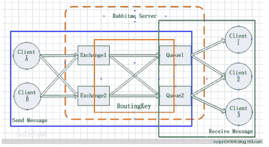

<!--yml
category: 未分类
date: 0001-01-01 00:00:00
-->

# 什么是RabbitMQ？为什么使用RabbitMQ？

> 原文：[https://zwmst.com/1797.html](https://zwmst.com/1797.html)

RabbitMQ是一款开源的，Erlang编写的，基于AMQP协议的，消息中间件；

可以用它来：解耦、异步、削峰。*
<!--yml
category: 未分类
date: 0001-01-01 00:00:00
-->

# RabbitMQ有什么优缺点？

> 原文：[https://zwmst.com/1799.html](https://zwmst.com/1799.html)

优点：解耦、异步、削峰；

缺点：降低了系统的稳定性：本来系统运行好好的，现在你非要加入个消息队列进去，那消息 队列挂了，你的系统不是呵呵了。因此，系统可用性会降低；

增加了系统的复杂性：加入了消息队列，要多考虑很多方面的问题，比如：一致性问题、如何 保证消息不被重复消费、如何保证消息可靠性传输等。因此，需要考虑的东西更多，复杂性增 大。*
<!--yml
category: 未分类
date: 0001-01-01 00:00:00
-->

# 什么是元数据？元数据分为哪些类型？包括哪些内容？与cluster相关的元数据有哪 些？元数据是如何保存的？元数据在cluster中是如何分布的？

> 原文：[https://zwmst.com/1801.html](https://zwmst.com/1801.html)

在非cluster模式下，元数据主要分为Queue元数据（queue名字和属性 等）、Exchange元数 据（exchange名字、类型和属性等）、Binding元数据 （存放路由关系的查找表）、Vhost 元数据（vhost范围内针对前三者的名字空 间约束和安全属性设置）。

在cluster模式下，还包括cluster中node位置信息和node关系信息。元数据按照erlang node 的类型确定是仅保存于RAM中，还是同时保存在RAM和disk上。元数据在cluster中是全 node 分布的。*
<!--yml
category: 未分类
date: 0001-01-01 00:00:00
-->

# 在单node系统和多node构成的cluster系统中声明queue、exchange，以及进行 binding会有什么不同？

> 原文：[https://zwmst.com/1803.html](https://zwmst.com/1803.html)

当你在单node上声明queue时，只要该node上相关元数据进行了变 更，你就会得到 Queue.Declare-ok回应；而在cluster上声明queue，则要 求cluster上的全部node都要进行 元数据成功更新，才会得到 Queue.Declare-ok回应。另外，若node类型为RAM node则变更 的数据 仅保存在内存中，若类型为disk node则还要变更保存在磁盘上的数据。*
<!--yml
category: 未分类
date: 0001-01-01 00:00:00
-->

# 客户端连接到cluster中的任意node上是否都能正常工作？

> 原文：[https://zwmst.com/1805.html](https://zwmst.com/1805.html)

是的。客户端感觉不到有何不同。*
<!--yml
category: 未分类
date: 0001-01-01 00:00:00
-->

# 若cluster中拥有某个queue的owner node失效了，且该queue 被声明具有 durable属性，是否能够成功从其他node上重新声明该 queue ？

> 原文：[https://zwmst.com/1807.html](https://zwmst.com/1807.html)

不能，在这种情况下，将得到404 NOT_FOUND错误。只能等queue所 属的node恢复后才能 使用该queue。但若该queue本身不具有durable 属性，则可在其他node上重新声明。*
<!--yml
category: 未分类
date: 0001-01-01 00:00:00
-->

# RabbitMQ 的消息是怎么发送的？

> 原文：[https://zwmst.com/1809.html](https://zwmst.com/1809.html)

首先客户端必须连接到 RabbitMQ 服务器才能发布和消费消息，客户端和 rabbit server 之间 会创建一个 tcp 连接，一旦 tcp 打开并通过了认证（认证就是你发送给 rabbit 服务器的用户名 和密码），你的客户端和 RabbitMQ 就创建了一条 amqp 信道（channel），信道是创建在 “真实” tcp 上的虚拟连接，amqp 命令都是通过信道发送出去的，每个信道都会有一个唯一的 id，不论是发布消息，订阅队列都是通过这个信道完成的。*
<!--yml
category: 未分类
date: 0001-01-01 00:00:00
-->

# RabbitMQ 怎么避免消息丢失？

> 原文：[https://zwmst.com/1811.html](https://zwmst.com/1811.html)

①消息持久化;

②ACK确认机制;

③设置集群镜像模式;

④消息补偿机制。*
<!--yml
category: 未分类
date: 0001-01-01 00:00:00
-->

# RabbitMQ的使用场景有哪些?

> 原文：[https://zwmst.com/1813.html](https://zwmst.com/1813.html)

①跨系统的异步通信，所有需要异步交互的地方都可以使用消息队列。就像我们除了打电话(同 步)以外，还需要发短信，发电子邮件(异步)的通讯方式。

②多个应用之间的耦合，由于消息是平台无关和语言无关的，而且语义上也不再是函数调用， 因此更适合作为多个应用之间的松耦合的接口。基于消息队列的耦合，不需要发送方和接收方 同时在线。在企业应用集成(EAI)中，文件传输，共享数据库，消息队列，远程过程调用都可 以作为集成的方法。

③应用内的同步变异步，比如订单处理，就可以由前端应用将订单信息放到队列，后端应用从 队列里依次获得消息处理，高峰时的大量订单可以积压在队列里慢慢处理掉。由于同步通常意 味着阻塞，而大量线程的阻塞会降低计算机的性能。

④消息驱动的架构(EDA)，系统分解为消息队列，和消息制造者和消息消费者，一个处理流程 可以根据需要拆成多个阶段(Stage)，阶段之间用队列连接起来，前一个阶段处理的结果放入 队列，后一个阶段从队列中获取消息继续处理。

⑤应用需要更灵活的耦合方式，如发布订阅，比如可以指定路由规则。

⑥跨局域网，甚至跨城市的通讯(CDN行业)，比如北京机房与广州机房的应用程序的通信。*
<!--yml
category: 未分类
date: 0001-01-01 00:00:00
-->

# RabbitMQ有哪些重要的角色?

> 原文：[https://zwmst.com/1815.html](https://zwmst.com/1815.html)

RabbitMQ中重要的角色有：生产者、消费者和代理：

①生产者：消息的创建者，负责创建和推送数据到消息服务器;

②消费者：消息的接收方，用于处理数据和确认消息;

③代理：就是RabbitMQ本身，用于扮演“快递”的角色，本身不生产消息，只是扮演“快递”的 角色。*
<!--yml
category: 未分类
date: 0001-01-01 00:00:00
-->

# 如何确保消息正确地发送至RabbitMQ?如何确保消息接收方消费了消息?

> 原文：[https://zwmst.com/1817.html](https://zwmst.com/1817.html)

1、发送方确认模式

①将信道设置成confirm模式(发送方确认模式)，则所有在信道上发布的消息都会被指派一个 唯一的ID。

②一旦消息被投递到目的队列后，或者消息被写入磁盘后(可持久化的消息)，信道会发送一个 确认给生产者(包含消息唯一 ID)。

③如果RabbitMQ发生内部错误从而导致消息丢失，会发送一条 nack(notacknowledged， 未确认)消息。

④发送方确认模式是异步的，生产者应用程序在等待确认的同时，可以继续发送消息。当确认 消息到达生产者应用程序，生产者应用程序的回调方法就会被触发来处理确认消息。

2、接收方确认机制

①消费者接收每一条消息后都必须进行确认(消息接收和消息确认是两个不同操作)。只有消费 者确认了消息，RabbitMQ 才能安全地把消息从队列中删除。

②这里并没有用到超时机制，RabbitMQ仅通过Consumer的连接中断来确认是否需要重新发 送消息。也就是说，只要连接不中断，RabbitMQ给了Consumer足够长的时间来处理消息。 保证数据的最终一致性。

3、下面罗列几种特殊情况

①如果消费者接收到消息，在确认之前断开了连接或取消订阅，RabbitMQ会认为消息没有被 分发，然后重新分发给下一个订阅的消费者。(可能存在消息重复消费的隐患，需要去重)

②如果消费者接收到消息却没有确认消息，连接也未断开，则RabbitMQ认为该消费者繁忙， 将不会给该消费者分发更多的消息。*
<!--yml
category: 未分类
date: 0001-01-01 00:00:00
-->

# 要保证消息持久化成功的条件有哪些?

> 原文：[https://zwmst.com/1819.html](https://zwmst.com/1819.html)

①声明队列必须设置持久化durable设置为 true。

②消息推送投递模式必须设置持久化，deliveryMode设置为2(持久)。

③消息已经到达持久化交换器。

④消息已经到达持久化队列。

以上四个条件都满足才能保证消息持久化成功。*
<!--yml
category: 未分类
date: 0001-01-01 00:00:00
-->

# RabbitMQ 有几种广播类型?

> 原文：[https://zwmst.com/1821.html](https://zwmst.com/1821.html)

三种广播模式：

①fanout：所有bind到此exchange的queue都可以接收消息(纯广播，绑定到RabbitMQ的接 受者都能收到消息);

②direct：通过routingKey和exchange决定的那个唯一的queue可以接收消息;

③topic：所有符合routingKey(此时可以是一个表达式)的routingKey所bind的queue可以接 收消息;*
<!--yml
category: 未分类
date: 0001-01-01 00:00:00
-->

# vhost 是什么？起什么作用？

> 原文：[https://zwmst.com/1823.html](https://zwmst.com/1823.html)

vhost 可以理解为虚拟 broker ，即 mini-RabbitMQ server。其内部均含有独立的 queue、 exchange 和 binding 等，但最最重要的是，其拥有独立的权限系统，可以做到 vhost 范围的 用户控制。当然，从 RabbitMQ 的全局角度，vhost 可以作为不同权限隔离的手段（一个典型 的例子就是不同的应用可以跑在不同的 vhost 中）。*
<!--yml
category: 未分类
date: 0001-01-01 00:00:00
-->

# 消息基于什么传输？

> 原文：[https://zwmst.com/1825.html](https://zwmst.com/1825.html)

由于TCP连接的创建和销毁开销较大，且并发数受系统资源限制，会造成性能瓶颈。 RabbitMQ使用信道的方式来传输数据。信道是建立在真实的TCP连接内的虚拟连接，且每条 TCP连接上的信道数量没有限制。*
<!--yml
category: 未分类
date: 0001-01-01 00:00:00
-->

# 消息如何分发？

> 原文：[https://zwmst.com/1827.html](https://zwmst.com/1827.html)

若该队列至少有一个消费者订阅，消息将以循环（round-robin）的方式发送给消费者。每条 消息只会分发给一个订阅的消费者（前提是消费者能够正常处理消息并进行确认）。*
<!--yml
category: 未分类
date: 0001-01-01 00:00:00
-->

# 消息怎么路由？

> 原文：[https://zwmst.com/1829.html](https://zwmst.com/1829.html)

从概念上来说，消息路由必须有三部分：交换器、路由、绑定。生产者把消息发布到交换器 上；绑定决定了消息如何从路由器路由到特定的队列；消息最终到达队列，并被消费者接收。 消息发布到交换器时，消息将拥有一个路由键（routing key），在消息创建时设定。 通过队列路由键，可以把队列绑定到交换器上。 消息到达交换器后，RabbitMQ会将消息的路由键与队列的路由键进行匹配（针对不同的交换 器有不同的路由规则）。如果能够匹配到队列，则消息会投递到相应队列中；如果不能匹配到 任何队列，消息将进入 “黑洞”。 常用的交换器主要分为一下三种：

direct：如果路由键完全匹配，消息就被投递到相应的队列 fanout：如果交换器收到消息，将会广播到所有绑定的队列上 topic：可以使来自不同源头的消息能够到达同一个队列。 使用topic交换器时，可以使用通配 符，比如：“*” 匹配特定位置的任意文本， “.” 把路由键分为了几部分，“#” 匹配所有规则 等。特别注意：发往topic交换器的消息不能随意的设置选择键（routing_key），必须是 由"."隔开的一系列的标识符组成。*
<!--yml
category: 未分类
date: 0001-01-01 00:00:00
-->

# 如何确保消息接收方消费了消息？

> 原文：[https://zwmst.com/1831.html](https://zwmst.com/1831.html)

接收方消息确认机制：消费者接收每一条消息后都必须进行确认（消息接收和消息确认是两个 不同操作）。只有消费者确认了消息，RabbitMQ才能安全地把消息从队列中删除。这里并没 有用到超时机制，RabbitMQ仅通过Consumer的连接中断来确认是否需要重新发送消息。也 就是说，只要连接不中断，RabbitMQ给了Consumer足够长的时间来处理消息。

下面罗列几种特殊情况：

如果消费者接收到消息，在确认之前断开了连接或取消订阅，RabbitMQ会认为消息没有被分 发，然后重新分发给下一个订阅的消费者。（可能存在消息重复消费的隐患，需要根据bizId 去重） 如果消费者接收到消息却没有确认消息，连接也未断开，则RabbitMQ认为该消费者繁忙，将 不会给该消费者分发更多的消息。*
<!--yml
category: 未分类
date: 0001-01-01 00:00:00
-->

# 如何避免消息重复投递或重复消费？

> 原文：[https://zwmst.com/1833.html](https://zwmst.com/1833.html)

在消息生产时，MQ内部针对每条生产者发送的消息生成一个inner-msg-id，作为去重和幂 等的依据（消息投递失败并重传），避免重复的消息进入队列；在消息消费时，要求消息体中 必须要有一个bizId（对于同一业务全局唯一，如支付ID、订单ID、帖子ID等）作为去重和幂 等的依据，避免同一条消息被重复消费。

这个问题针对业务场景来答分以下几点：

1.比如，你拿到这个消息做数据库的insert操作。那就容易了，给这个消息做一个唯一主键， 那么就算出现重复消费的情况，就会导致主键冲突，避免数据库出现脏数据。

2.再比如，你拿到这个消息做redis的set的操作，那就容易了，不用解决，因为你无论set几次 结果都是一样的，set操作本来就算幂等操作。

3.如果上面两种情况还不行，上大招。准备一个第三方介质,来做消费记录。以redis为例，给 消息分配一个全局id，只要消费过该消息，将<id,message>以K-V形式写入redis。那消费者 开始消费前，先去redis中查询有没消费记录即可。*
<!--yml
category: 未分类
date: 0001-01-01 00:00:00
-->

# 死信队列和延迟队列的使用

> 原文：[https://zwmst.com/1835.html](https://zwmst.com/1835.html)

死信消息：

消息被拒绝（Basic.Reject或Basic.Nack）并且设置 requeue 参数的值为 false 消息过期了 队列达到最大的长度 过期消息：

在 rabbitmq 中存在2种方可设置消息的过期时间，第一种通过对队列进行设置，这种设置 后，该队列中所有的消息都存在相同的过期时间，第二种通过对消息本身进行设置，那么每条 消息的过期时间都不一样。如果同时使用这2种方法，那么以过期时间小的那个数值为准。当 消息达到过期时间还没有被消费，那么那个消息就成为了一个 死信 消息。

队列设置：在队列申明的时候使用 x-message-ttl 参数，单位为 毫秒

单个消息设置：是设置消息属性的 expiration 参数的值，单位为 毫秒

延时队列：在rabbitmq中不存在延时队列，但是我们可以通过设置消息的过期时间和死信队 列来模拟出延时队列。消费者监听死信交换器绑定的队列，而不要监听消息发送的队列。

有了以上的基础知识，我们完成以下需求：

需求：用户在系统中创建一个订单，如果超过时间用户没有进行支付，那么自动取消订单。

分析：

1、上面这个情况，我们就适合使用延时队列来实现，那么延时队列如何创建

2、延时队列可以由 过期消息+死信队列 来时间 3、过期消息通过队列中设置 x-message-ttl 参数实现 4、死信队列通过在队列申明时，给队列设置 x-dead-letter-exchange 参数，然后另外申明 一个队列绑定x-dead-letter-exchange对应的交换器。

```
ConnectionFactory factory = new ConnectionFactory();
factory.setHost("127.0.0.1");
factory.setPort(AMQP.PROTOCOL.PORT);
factory.setUsername("guest");
factory.setPassword("guest");
Connection connection = factory.newConnection();
Channel channel = connection.createChannel();

// 声明一个接收被删除的消息的交换机和队列 String EXCHANGE_DEAD_NAME = "exchange.dead"; String QUEUE_DEAD_NAME = "queue_dead"; channel.exchangeDeclare(EXCHANGE_DEAD_NAME, BuiltinExchangeType.DIRECT); channel.queueDeclare(QUEUE_DEAD_NAME, false, false, false, null); channel.queueBind(QUEUE_DEAD_NAME, EXCHANGE_DEAD_NAME, "routingkey.dead");

String EXCHANGE_NAME = "exchange.fanout";

String QUEUE_NAME = "queue_name";

channel.exchangeDeclare(EXCHANGE_NAME, BuiltinExchangeType.FANOUT);

Map<String, Object> arguments = new HashMap<String, Object>();

// 统一设置队列中的所有消息的过期时间 arguments.put("x-message-ttl", 30000); // 设置超过多少毫秒没有消费者来访问队列，就删除队列的时间 arguments.put("x-expires", 20000); // 设置队列的最新的N条消息，如果超过N条，前面的消息将从队列中移除掉 arguments.put("x-max-length", 4); // 设置队列的内容的最大空间，超过该阈值就删除之前的消息 arguments.put("x-max-length-bytes", 1024); // 将删除的消息推送到指定的交换机，一般x-dead-letter-exchange和x-dead-letterrouting-key需要同时设置 arguments.put("x-dead-letter-exchange", "exchange.dead"); // 将删除的消息推送到指定的交换机对应的路由键 arguments.put("x-dead-letter-routing-key", "routingkey.dead"); // 设置消息的优先级，优先级大的优先被消费 arguments.put("x-max-priority", 10); channel.queueDeclare(QUEUE_NAME, false, false, false, arguments); channel.queueBind(QUEUE_NAME, EXCHANGE_NAME, ""); String message = "Hello RabbitMQ: ";

for (int i = 1; i <= 5; i++) {

  // expiration: 设置单条消息的过期时间 AMQP.BasicProperties.Builder properties = new AMQP.BasicProperties().builder() .priority(i).expiration( i * 1000 + "");

  channel.basicPublish(EXCHANGE_NAME, "", properties.build(), (message + i).getBytes("UTF-8"));
}
channel.close();
connection.close();
```*
<!--yml
category: 未分类
date: 0001-01-01 00:00:00
-->

# 372.RabbitMQ概念

> 原文：[https://zwmst.com/3779.html](https://zwmst.com/3779.html)

RabbitMQ 是一个由 Erlang 语言开发的 AMQP 的开源实现。
AMQP ：Advanced Message Queue，高级消息队列协议。它是应用层协议的一个开放标准，为面向消息的中间件设计，基于此协议的客户端与消息中间件可传递消息，并不受产品、开发语言等条件的限制。
RabbitMQ 最初起源于金融系统，用于在分布式系统中存储转发消息，在易用性、扩展性、高可用性等方面表现不俗。具体特点包括：

1.  可靠性（Reliability）：RabbitMQ 使用一些机制来保证可靠性，如持久化、传输确认、发布确认。
2.  灵活的路由（Flexible Routing）：在消息进入队列之前，通过 Exchange 来路由消息的。对于典型的路由功能，RabbitMQ 已经提供了一些内置的 Exchange 来实现。针对更复杂的路由功能，可以将多个 Exchange 绑定在一起，也通过插件机制实现自己的 Exchange 。
3.  消息集群（Clustering）：多个 RabbitMQ 服务器可以组成一个集群，形成一个逻辑 Broker 。
4.  高可用（Highly Available Queues）：队列可以在集群中的机器上进行镜像，使得在部分节点出问题的情况下队列仍然可用。
5.  多种协议（Multi-protocol）：RabbitMQ 支持多种消息队列协议，比如 STOMP、MQTT 等等。
6.  多语言客户端（Many Clients）：RabbitMQ 几乎支持所有常用语言，比如 Java、.NET、Ruby 等等。
7.  管理界面（Management UI）:RabbitMQ 提供了一个易用的用户界面，使得用户可以监控和管理消息 Broker 的许多方面。
8.  跟踪机制（Tracing）:如果消息异常，RabbitMQ 提供了消息跟踪机制，使用者可以找出发生了什么。
9.  插件机制（Plugin System）:RabbitMQ 提供了许多插件，来从多方面进行扩展，也可以编写自己的插件。*
<!--yml
category: 未分类
date: 0001-01-01 00:00:00
-->

# 373.RabbitMQ 架构

> 原文：[https://zwmst.com/3781.html](https://zwmst.com/3781.html)

*
<!--yml
category: 未分类
date: 0001-01-01 00:00:00
-->

# 374.Message

> 原文：[https://zwmst.com/3784.html](https://zwmst.com/3784.html)

消息，消息是不具名的，它由消息头和消息体组成。消息体是不透明的，而消息头则由一系列的可选属性组成，这些属性包括 routing-key（路由键）、priority（相对于其他消息的优先权）、delivery-mode（指出该消息可能需要持久性存储）等。*
<!--yml
category: 未分类
date: 0001-01-01 00:00:00
-->

# 375.Publisher

> 原文：[https://zwmst.com/3786.html](https://zwmst.com/3786.html)

消息的生产者，也是一个向交换器发布消息的客户端应用程序*
<!--yml
category: 未分类
date: 0001-01-01 00:00:00
-->

# 376.Exchange（将消息路由给队列 ）

> 原文：[https://zwmst.com/3788.html](https://zwmst.com/3788.html)

交换器，用来接收生产者发送的消息并将这些消息路由给服务器中的队列。*
<!--yml
category: 未分类
date: 0001-01-01 00:00:00
-->

# 377.Binding（消息队列和交换器之间的关联）

> 原文：[https://zwmst.com/3790.html](https://zwmst.com/3790.html)

绑定，用于消息队列和交换器之间的关联。一个绑定就是基于路由键将交换器和消息队列连接起来的路由规则，所以可以将交换器理解成一个由绑定构成的路由表。*
<!--yml
category: 未分类
date: 0001-01-01 00:00:00
-->

# 378.Queue

> 原文：[https://zwmst.com/3792.html](https://zwmst.com/3792.html)

消息队列，用来保存消息直到发送给消费者。它是消息的容器，也是消息的终点。一个消息可投入一个或多个队列。消息一直在队列里面，等待消费者连接到这个队列将其取走。*
<!--yml
category: 未分类
date: 0001-01-01 00:00:00
-->

# 379.Connection

> 原文：[https://zwmst.com/3794.html](https://zwmst.com/3794.html)

网络连接，比如一个 TCP 连接。*
<!--yml
category: 未分类
date: 0001-01-01 00:00:00
-->

# 380.Channel

> 原文：[https://zwmst.com/3796.html](https://zwmst.com/3796.html)

信道，**多路复用连接中的一条独立的双向数据流通道**。信道是建立在真实的 TCP 连接内地虚拟连接，AMQP 命令都是通过信道发出去的，不管是发布消息、订阅队列还是接收消息，这些动作都是通过信道完成。因为对于操作系统来说建立和销毁 TCP 都是非常昂贵的开销，所以引入了信道的概念，以复用一条 TCP 连接。*
<!--yml
category: 未分类
date: 0001-01-01 00:00:00
-->

# 381.Consumer

> 原文：[https://zwmst.com/3798.html](https://zwmst.com/3798.html)

消息的消费者，表示一个从消息队列中取得消息的客户端应用程序。*
<!--yml
category: 未分类
date: 0001-01-01 00:00:00
-->

# 382.Virtual Host

> 原文：[https://zwmst.com/3800.html](https://zwmst.com/3800.html)

虚拟主机，表示一批交换器、消息队列和相关对象。虚拟主机是共享相同的身份认证和加密环境的独立服务器域。*
<!--yml
category: 未分类
date: 0001-01-01 00:00:00
-->

# 383.Broker

> 原文：[https://zwmst.com/3802.html](https://zwmst.com/3802.html)

表示消息队列服务器实体。*
<!--yml
category: 未分类
date: 0001-01-01 00:00:00
-->

# 384.Exchange 类型

> 原文：[https://zwmst.com/3804.html](https://zwmst.com/3804.html)

Exchange 分发消息时根据类型的不同分发策略有区别，目前共四种类型：direct、fanout、topic、headers 。

headers 匹配 AMQP 消息的 header 而不是路由键，此外headers 交换器和direct 交换器完全一致，但性能差很多，目前几乎用不到了.*
<!--yml
category: 未分类
date: 0001-01-01 00:00:00
-->

# 385.Direct 键（routing key）分布

> 原文：[https://zwmst.com/3806.html](https://zwmst.com/3806.html)

Direct：消息中的路由键（routing key）如果和 Binding 中的 binding key 一致，交换器就将消息发到对应的队列中。它是完全匹配、单播的模式。*
<!--yml
category: 未分类
date: 0001-01-01 00:00:00
-->

# 386.Fanout（广播分发）

> 原文：[https://zwmst.com/3808.html](https://zwmst.com/3808.html)

Fanout：每个发到 fanout 类型交换器的消息都会分到所有绑定的队列上去。很像子网广播，每台子网内的主机都获得了一份复制的消息。fanout 类型转发消息是最快的。*
<!--yml
category: 未分类
date: 0001-01-01 00:00:00
-->

# 387.topic 交换器（模式匹配）

> 原文：[https://zwmst.com/3811.html](https://zwmst.com/3811.html)

topic 交换器：topic 交换器通过模式匹配分配消息的路由键属性，将路由键和某个模式进行匹配，此时队列需要绑定到一个模式上。它将路由键和绑定键的字符串切分成单词，这些单词之间用点隔开。它同样也会识别两个通配符：符号“#”和符号“”。#匹配 0 个或多个单词，匹配不多不少一个单词。*
<!--yml
category: 未分类
date: 0001-01-01 00:00:00
-->

# 1219.上千万条消息在mq中积压了⼏个⼩时还没解决

> 原文：[https://zwmst.com/5743.html](https://zwmst.com/5743.html)

1.  先修复consumer的问题，确保其恢复消费速度，然后将现有consumer都停掉；
2.  新建⼀个topic，partition是原来的10倍，临时建⽴好原先10倍或者20倍的queue数量；
3.  然后写⼀个临时的分发数据的consumer程序，这个程序部署上去消费积压的数据；消费之后不做耗时的处理，直接均匀轮询写⼊临时建⽴好的10倍数量的queue；
4.  接着临时征⽤10倍的机器来部署consumer，每⼀批consumer消费⼀个临时queue的数据；
5.  这种做法相当于是临时将queue资源和consumer资源扩⼤10倍，以正常的10倍速度来消费数据；
6.  等快速消费完积压数据之后，得恢复原先部署架构，重新⽤原先的consumer机器来消费消息。

## 总结：

1.  修复并停掉consumer；
2.  新建⼀个topic，partition是原来的10倍，建⽴临时queue，数量是原来的10倍或20倍；
3.  写临时consumer程序，临时征⽤10倍的机器去消费数据；
4.  消费完成之后，恢复原先consumer；*
<!--yml
category: 未分类
date: 0001-01-01 00:00:00
-->

# 1220.rabbitmq设置过期时间，部分消息丢失

> 原文：[https://zwmst.com/5746.html](https://zwmst.com/5746.html)

采取批量重导⽅法：将丢失的那批数据查询导⼊到mq⾥⾯。*
<!--yml
category: 未分类
date: 0001-01-01 00:00:00
-->

# 1221.RabbitMQ 上的⼀个 queue 中存放的 message 是否有数量限制？

> 原文：[https://zwmst.com/5748.html](https://zwmst.com/5748.html)

可以认为是⽆限制，因为限制取决于机器的内存，但是消息过多会导致处理效率的下降。*
<!--yml
category: 未分类
date: 0001-01-01 00:00:00
-->

# 1222.分布式部署

> 原文：[https://zwmst.com/5750.html](https://zwmst.com/5750.html)

RabbitMQ⽆法容忍不同数据中⼼之间⽹络延迟，但是可以通过3种⽅式实现分布式部署：Federation和Shovel。*
<!--yml
category: 未分类
date: 0001-01-01 00:00:00
-->

# 1223.如何确保消息正确地发送⾄RabbitMQ？

> 原文：[https://zwmst.com/5752.html](https://zwmst.com/5752.html)

RabbitMQ使⽤发送⽅确认模式，确保消息正确地发送到RabbitMQ。
发送⽅确认模式：将信道设置成confirm模式（发送⽅确认模式），则所有在信道上发布的消息都会被指派⼀个唯⼀的ID。⼀旦消息被投递到⽬的队列后，或者消息被写⼊磁盘后（可持久化的消息），信道会发送⼀个确认给⽣产者（包含消息唯⼀ID）。如果RabbitMQ发⽣内部错误从⽽导致消息丢失，会发送⼀条nack（not acknowledged，未确认）消息。

发送⽅确认模式是异步的，⽣产者应⽤程序在等待确认的同时，可以继续发送消息。当确认消息到达⽣产者应⽤程序，⽣产者应⽤程序的回调⽅法就会被触发来处理确认消息*
<!--yml
category: 未分类
date: 0001-01-01 00:00:00
-->

# 1224.如何确保消息接收⽅消费了消息？

> 原文：[https://zwmst.com/5754.html](https://zwmst.com/5754.html)

接收⽅消息确认机制：消费者接收每⼀条消息后都必须进⾏确认（消息接收和消息确认是两个不同操作）。只有消费者确认了消息，RabbitMQ才能安全地把消息从队列中删除。

这⾥并没有⽤到超时机制，RabbitMQ仅通过Consumer的连接中断来确认是否需要重新发送消息。也就是说，只要连接不中断，RabbitMQ给了Consumer⾜够⻓的时间来处理消息。

## 特殊情况：

1.  如果消费者接收到消息，在确认之前断开了连接或取消订阅，RabbitMQ会认为消息没有被分发，然后重新分发给下⼀个订阅的消费者。（可能存在消息重复消费的隐患，需要根据bizId去重）
2.  如果消费者接收到消息却没有确认消息，连接也未断开，则RabbitMQ认为该消费者繁忙，将不会给该消费者分发更多的消息。*
<!--yml
category: 未分类
date: 0001-01-01 00:00:00
-->

# 1225.如何避免消息重复投递或重复消费？

> 原文：[https://zwmst.com/5756.html](https://zwmst.com/5756.html)

在消息⽣产时，MQ内部针对每条⽣产者发送的消息⽣成⼀个inner-msg-id，作为去重和幂等的依据（消息投递失败并重传），避免重复的消息进⼊队列；在消息消费时，要求消息体中必须要有⼀个bizId（对于同⼀业务全局唯⼀，如⽀付ID、订单ID、帖⼦ID等）作为去重和幂等的依据，避免同⼀条消息被重复消费。*
<!--yml
category: 未分类
date: 0001-01-01 00:00:00
-->

# 1226.消息基于什么传输？

> 原文：[https://zwmst.com/5758.html](https://zwmst.com/5758.html)

由于TCP连接的创建和销毁开销较⼤，且并发数受系统资源限制，会造成性能瓶颈。RabbitMQ使⽤信道的⽅式来传输数据。信道是建⽴在真实的TCP连接内的虚拟连接，且每条TCP连接上的信道数量没有限制。

1.  RabbitMQ采⽤类似NIO（Non-blocking I/O）做法，选择TCP连接复⽤，不仅可以减少性能开销，同时也便于管理。
2.  每个线程把持⼀个信道，所以信道服⽤了Connection的TCP连接。同时RabbitMQ可以确保每个线程的私密性，就像拥有独⽴的连接⼀样。*
<!--yml
category: 未分类
date: 0001-01-01 00:00:00
-->

# 1227.消息如何分发？

> 原文：[https://zwmst.com/5760.html](https://zwmst.com/5760.html)

若该队列⾄少有⼀个消费者订阅，消息将以循环（round-robin）的⽅式发送给消费者。每条消息只会分发给⼀个订阅的消费者（前提是消费者能够正常处理消息并进⾏确认）。*
<!--yml
category: 未分类
date: 0001-01-01 00:00:00
-->

# 1228.消息怎么路由？

> 原文：[https://zwmst.com/5762.html](https://zwmst.com/5762.html)

从概念上来说，消息路由必须有三部分：交换器、路由、绑定。⽣产者把消息发布到交换器上；绑定决定了消息如何从交换器路由到特定的队列；消息最终到达队列，并被消费者接收。

1.  消息发布到交换器时，消息将拥有⼀个路由键（routing key），在消息创建时设定。
2.  通过队列路由键，可以把队列绑定到交换器上。
3.  消息到达交换器后，RabbitMQ会将消息的路由键与队列的路由键进⾏匹配（针对不同的交换器有不同的路由规则）。
4.  如果能够匹配到队列，则消息会投递到相应队列中；如果不能匹配到任何队列，消息将进⼊ “⿊洞”。*
<!--yml
category: 未分类
date: 0001-01-01 00:00:00
-->

# 1229.如何确保消息不丢失？

> 原文：[https://zwmst.com/5764.html](https://zwmst.com/5764.html)

消息持久化的前提是：将交换器/队列的durable属性设置为true，表示交换器/队列是持久交换器/队列，在服务器崩溃或重启之后不需要重新创建交换器/队列（交换器/队列会⾃动创建）。
如果消息想要从Rabbit崩溃中恢复，那么消息必须：

1.  在消息发布前，通过把它的 “投递模式” 选项设置为2（持久）来把消息标记成持久化
2.  将消息发送到持久交换器
3.  消息到达持久队列

    RabbitMQ确保持久性消息能从服务器重启中恢复的⽅式是，将它们写⼊磁盘上的⼀个持久化⽇志⽂件，当发布⼀条持久性消息到持久交换器上时，Rabbit会在消息提交到⽇志⽂件后才发送响应（如果消息路由到了⾮持久队列，它会⾃动从持久化⽇志中移除）。⼀旦消费者从持久队列中消费了⼀条持久化消息，RabbitMQ会在持久化⽇志中把这条消息标记为等待垃圾收集。如果持久化消息在被消费之前RabbitMQ重启，那么Rabbit会⾃动重建交换器和队列（以及绑定），并重播持久化⽇志⽂件中的消息到合适的队列或者交换器上。*
<!--yml
category: 未分类
date: 0001-01-01 00:00:00
-->

# 1230.使⽤RabbitMQ有什么好处？

> 原文：[https://zwmst.com/5766.html](https://zwmst.com/5766.html)

1.  应⽤解耦（系统拆分）
2.  异步处理（预约挂号业务处理成功后，异步发送短信、推送消息、⽇志记录等，可以⼤⼤减⼩响应时间）
3.  消息分发
4.  流量削峰：将请求发送到队列中，短暂的⾼峰期积压是允许的。
5.  消息缓冲
    …*
<!--yml
category: 未分类
date: 0001-01-01 00:00:00
-->

# 1231.消息队列有什么缺点？

> 原文：[https://zwmst.com/5768.html](https://zwmst.com/5768.html)

1.  系统可⽤性降低：消息队列出问题影响业务；
2.  系统复杂性增加：加⼊消息队列，需要考虑很多⽅⾯的问题，⽐如：⼀致性问题、如何保证消息不被重复消费、如何保证消息可靠性传输等。*
<!--yml
category: 未分类
date: 0001-01-01 00:00:00
-->

# 1232.MQ如何选型？

> 原文：[https://zwmst.com/5770.html](https://zwmst.com/5770.html)

| 特性 | ActiveMQ | RabbitMQ | RocketMQ | kafka |
| --- | --- | --- | --- | --- |
| 开发语⾔ | java | erlang | java | scala |
| 单机吞吐量 | 万级 | 万级 | 10万级 | 10万级 |
| 时效性 | ms级 | us级 | ms级 | ms级以内 |
| 可⽤性 | ⾼(主从架构) | ⾼(主从架构) | ⾮常⾼(分布式架构) | ⾮常⾼(分布式架构) |
| 功能特性 | 成熟的产品，在很多公司得到应⽤；有较多的⽂档；各种协议⽀持较好 | 基于erlang开发，所以并发能⼒很强，性能极其好，延时很低;管理界⾯较丰富 | MQ功能⽐较完备，扩展性佳 | 只⽀持主要的MQ功能，像⼀些消息查询，消息回溯等功能没有提供，毕竟是为⼤数据准备的，在⼤数据领域应⽤⼴。 |

1.  中⼩型公司⾸选RabbitMQ：管理界⾯简单，⾼并发。
2.  ⼤型公司可以选择RocketMQ：更⾼并发，可对rocketmq进⾏定制化开发。
3.  ⽇志采集功能，⾸选kafka，专为⼤数据准备。*
<!--yml
category: 未分类
date: 0001-01-01 00:00:00
-->

# 1233.如何保证消息队列⾼可⽤？

> 原文：[https://zwmst.com/5772.html](https://zwmst.com/5772.html)

1.  集群：
    集群可以扩展消息通信的吞吐量，但是不会备份消息，备份消息要通过镜像队列的⽅式解决。队列存储在单个节点、交换器存储在所有节点。
2.  镜像队列：
    将需要消费的队列变为镜像队列，存在于多个节点，这样就可以实现RabbitMQ的HA⾼可⽤性。作⽤就是消息实体会主动在镜像节点之间实现同步，⽽不是像普通模式那样，在consumer消费数据时临时读取。缺点就是，集群内部的同步通讯会占⽤⼤量的⽹络带宽。*
<!--yml
category: 未分类
date: 0001-01-01 00:00:00
-->

# 1234.如何保证消息的顺序性？

> 原文：[https://zwmst.com/5774.html](https://zwmst.com/5774.html)

1.  通过某种算法，将需要保持先后顺序的消息放到同⼀个消息队列中(kafka中就是partition,rabbitMq中就是queue)。然后只⽤⼀个消费者去消费该队列。
2.  可以在消息体内添加全局有序标识来实现。*
<!--yml
category: 未分类
date: 0001-01-01 00:00:00
-->

# 1235.使⽤RabbitMQ增加rest服务吞吐量。

> 原文：[https://zwmst.com/5776.html](https://zwmst.com/5776.html)

*
<!--yml
category: 未分类
date: 0001-01-01 00:00:00
-->

# 1236.RabbitMQ交换器有哪些类型？

> 原文：[https://zwmst.com/5779.html](https://zwmst.com/5779.html)

1.  fanout交换器：它会把所有发送到该交换器的消息路由到所有与该交换器绑定的队列中；
2.  direct交换器：direct类型的交换器路由规则很简单，它会把消息路由到哪些BindingKey和RoutingKey完全匹配的队列中；
3.  topic交换器：匹配规则⽐direct更灵活。
4.  headers交换器：根据发送消息内容的headers属性进⾏匹配（由于性能很差，不实⽤）。

## 常⽤的交换器主要分为以下三种：

1.  direct：如果路由键完全匹配，消息就被投递到相应的队列
2.  fanout：如果交换器收到消息，将会⼴播到所有绑定的队列上
3.  topic：可以使来⾃不同源头的消息能够到达同⼀个队列。 使⽤topic交换器时，可以使⽤通配符，⽐如：“*” 匹配特定位置的任意⽂本， “.” 把路由键分为了⼏部分，“#” 匹配所有规则等。特别注意：发往topic交换器的消息不能随意的设置选择键（routing_key），必须是由"."隔开的⼀系列的标识符组成。*
<!--yml
category: 未分类
date: 0001-01-01 00:00:00
-->

# 1237.RabbitMQ如何保证数据⼀致性？

> 原文：[https://zwmst.com/5781.html](https://zwmst.com/5781.html)

1.  ⽣产者确认机制：消息持久化后异步回调通知⽣产者，保证消息已经发出去；
2.  消息持久化：设置消息持久化；
3.  消费者确认机制：消费者成功消费消息之后，⼿动确认，保证消息已经消费。*
<!--yml
category: 未分类
date: 0001-01-01 00:00:00
-->

# 1238.RabbitMQ消费者⾃动扩展数量

> 原文：[https://zwmst.com/5783.html](https://zwmst.com/5783.html)

SimpleMessageListenerContainer可根据RabbitMQ消息堆积情况⾃动扩展消费者数量。*
<!--yml
category: 未分类
date: 0001-01-01 00:00:00
-->

# 1239.RabbitMQ结构

> 原文：[https://zwmst.com/5785.html](https://zwmst.com/5785.html)



1.  Broker：简单来说就是消息队列服务器实体。
2.  Exchange：消息交换机，它指定消息按什么规则，路由到哪个队列。
3.  Queue：消息队列载体，每个消息都会被投⼊到⼀个或多个队列。
4.  Binding：绑定，它的作⽤就是把exchange和queue按照路由规则绑定起来。
5.  Routing Key：路由关键字，exchange根据这个关键字进⾏消息投递。
6.  vhost：虚拟主机，⼀个broker⾥可以开设多个vhost，⽤作不同⽤户的权限分离。
7.  producer：消息⽣产者，就是投递消息的程序。
8.  consumer：消息消费者，就是接受消息的程序。
9.  channel：消息通道，在客户端的每个连接⾥，可建⽴多个channel，每个channel代表⼀个会话任务。*
<!--yml
category: 未分类
date: 0001-01-01 00:00:00
-->

# 1240.rabbitmq队列与消费者的关系？

> 原文：[https://zwmst.com/5788.html](https://zwmst.com/5788.html)

1.  ⼀个队列可以绑定多个消费者；
2.  消息默认以循环的⽅式发送给消费者；
3.  消费者收到消息默认⾃动确认，也可以改成⼿动确认*