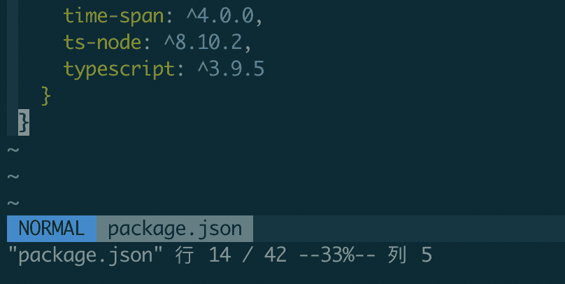

# git 相关

# git 如何查看某个文件的提交历史

> 原文：[https://q.shanyue.tech/base/git/100.html](https://q.shanyue.tech/base/git/100.html)

Issue

欢迎在 Gtihub Issue 中回答此问题: [Issue 100(opens new window)](https://github.com/shfshanyue/Daily-Question/issues/100)

Author

回答者: [shfshanyue(opens new window)](https://github.com/shfshanyue)

```
git log -p file 
```

Author

回答者: [viyoung(opens new window)](https://github.com/viyoung)

git log -p filename

# 如何列出所有已合并到 master 的分支并删除

> 原文：[https://q.shanyue.tech/base/git/347.html](https://q.shanyue.tech/base/git/347.html)

Issue

欢迎在 Gtihub Issue 中回答此问题: [Issue 347(opens new window)](https://github.com/shfshanyue/Daily-Question/issues/347)

Author

回答者: [shfshanyue(opens new window)](https://github.com/shfshanyue)

```
# 列出所有已合并到 master 的分支
$ git branch --merged master

# 删除所有已合并到 master 的分支
$ git branch --merged master | grep -v '^\*' | xargs git branch -d 
```

# git 如何添加与删除一个 submodule

> 原文：[https://q.shanyue.tech/base/git/421.html](https://q.shanyue.tech/base/git/421.html)

Issue

欢迎在 Gtihub Issue 中回答此问题: [Issue 421(opens new window)](https://github.com/shfshanyue/Daily-Question/issues/421)

Author

回答者: [shfshanyue(opens new window)](https://github.com/shfshanyue)

**添加 submodule**

```
$ git submodule add :git-url dep 
```

**删除 submodule**

*   `vim .gitmodules`，找到该模块位置，删掉
*   `vim .git/config`，找到该模块位置，删除
*   `rm -rf .git/module/dep`
*   `git rm --cached dep`

# vim

# 如何使用 vim 查看文件有多少个字符以及多少行

> 原文：[https://q.shanyue.tech/base/vim/45.html](https://q.shanyue.tech/base/vim/45.html)

Issue

欢迎在 Gtihub Issue 中回答此问题: [Issue 45(opens new window)](https://github.com/shfshanyue/Daily-Question/issues/45)

Author

回答者: [shfshanyue(opens new window)](https://github.com/shfshanyue)

在 `Normal` 模式下，可以通过快捷键 `g + <Ctrl-g>` 查看文件行数、列数、字符数及所占字节大小，此时状态栏(即 vim 最底下一行)显示如下：

```
Col 1 of 10; Line 28 of 161; Word 71 of 377; Char 636 of 4315; Byte 768 of 4969 
```

如果**仅仅想要了解文件行数及列数**，可以通过快捷键 `<Ctrl-g>` 查看，此时状态栏如下

```
"package.json" 行 14 / 42 --33%-- 列 5 
```



如果**仅仅想要了解文件行数**，可以通过快捷键 `G` 直接移动到文件最后一行来查看行数

## 相关问题：

*   [Linux 中如何使用命令查看文件的行数及字符数(opens new window)](https://github.com/shfshanyue/Daily-Question/issues/44)