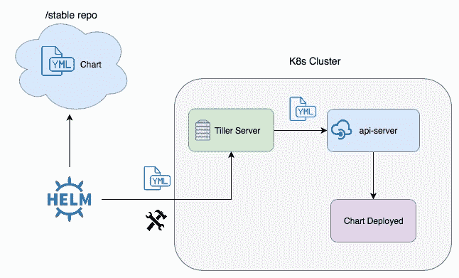

<!--yml
category: DevOps
date: 0001-01-01 00:00:00
-->

# k8s 面试题（山月）

# helm v3 中为什么要弃用 tiller

> 原文：[https://q.shanyue.tech/devops/k8s/13.html](https://q.shanyue.tech/devops/k8s/13.html)

Issue

欢迎在 Gtihub Issue 中回答此问题: [Issue 13(opens new window)](https://github.com/shfshanyue/Daily-Question/issues/13)

Author

回答者: [shfshanyue(opens new window)](https://github.com/shfshanyue)

`helm` v2 中，`helm client` 通过 gRPC 把 `Chart` 交给 `tiller`。`tiller` 是 k8s 中的一个 `pod`，在 `k8s` 集群中根据 `Chart` 以及配置信息部署资源，架构图如下



这有一个问题，`tiller` 有一个最高权限的 RBAC，而运维，开发众多权限不同的人都可以通过 `tiller` 这个最高权限来部署新的应用，会产生相应的安全问题。

于是，`helm v3` 去掉了 `tiller`，它的权限控制基于操作人员的 `kubeconfig`

# k8s 由那些组件组成

> 原文：[https://q.shanyue.tech/devops/k8s/41.html](https://q.shanyue.tech/devops/k8s/41.html)

Issue

欢迎在 Gtihub Issue 中回答此问题: [Issue 41(opens new window)](https://github.com/shfshanyue/Daily-Question/issues/41)

# k8s 中的 QoS 有哪几种类型

> 原文：[https://q.shanyue.tech/devops/k8s/96.html](https://q.shanyue.tech/devops/k8s/96.html)

Issue

欢迎在 Gtihub Issue 中回答此问题: [Issue 96(opens new window)](https://github.com/shfshanyue/Daily-Question/issues/96)

Author

回答者: [shfshanyue(opens new window)](https://github.com/shfshanyue)

参考官方文档：[Configure Quality of Service for Pods (opens new window)](https://kubernetes.io/docs/tasks/configure-pod-container/quality-service-pod/)，总结如下

有三种类型 `Guaranteed`，`Burstable` 与 `BestEffort`

*   `Guaranteed`
    *   Pod 里的每个容器都必须有内存 `resources.limits` 和 `resources.requests`，而且必须是一样的
    *   Pod 里的每个容器都必须有 CPU `resources.limits` 和 `resources.requests`，而且必须是一样的
*   `Burstable`
    *   Pod 里至少有一个容器有内存或者 CPU `resources.requests`
*   `BestEffort`
    *   不设置 `resources.requests` 和 `resources.limits`

# 在 k8s 中如何自定义 CRD 资源

> 原文：[https://q.shanyue.tech/devops/k8s/305.html](https://q.shanyue.tech/devops/k8s/305.html)

Issue

欢迎在 Gtihub Issue 中回答此问题: [Issue 305(opens new window)](https://github.com/shfshanyue/Daily-Question/issues/305)

# service mesh 是什么，能够解决什么问题

> 原文：[https://q.shanyue.tech/devops/k8s/306.html](https://q.shanyue.tech/devops/k8s/306.html)

Issue

欢迎在 Gtihub Issue 中回答此问题: [Issue 306(opens new window)](https://github.com/shfshanyue/Daily-Question/issues/306)

# 在 k8s 中如何通过日志查看某条请求进入的 pod

> 原文：[https://q.shanyue.tech/devops/k8s/325.html](https://q.shanyue.tech/devops/k8s/325.html)

Issue

欢迎在 Gtihub Issue 中回答此问题: [Issue 325(opens new window)](https://github.com/shfshanyue/Daily-Question/issues/325)

# k8s 中如何删除所有 Evicted 状态的 pod

> 原文：[https://q.shanyue.tech/devops/k8s/355.html](https://q.shanyue.tech/devops/k8s/355.html)

Issue

欢迎在 Gtihub Issue 中回答此问题: [Issue 355(opens new window)](https://github.com/shfshanyue/Daily-Question/issues/355)

Author

回答者: [shfshanyue(opens new window)](https://github.com/shfshanyue)

```
$ kubectl get pods
NAME                                             READY   STATUS             RESTARTS   AGE
cert-manager-5d8fd69d88-4nxw5                    1/1     Running            0          63d
cert-manager-5d8fd69d88-f7f2w                    0/1     Evicted            0          63d
cert-manager-5d8fd69d88-mpgqq                    0/1     Evicted            0          63d
cert-manager-5d8fd69d88-s7dtg                    0/1     Evicted            0          232d
cert-manager-5d8fd69d88-vdmrx                    0/1     Evicted            0          63d
cert-manager-5d8fd69d88-zlpv4                    0/1     Evicted            0          63d
cert-manager-cainjector-755bbf9c6b-455nm         0/1     Evicted            0          63d 
```

可通过 `kubectl get pods` 来找到 `Evicted` 状态的 POD，通过 `awk` 和 `kubectl delete pod` 选中目标 pod 并删除，命令如下

```
$  kubectl get pods | grep Evicted | awk '{print $1}' | xargs kubectl delete pod 
```

Author

回答者: [wi1dcard(opens new window)](https://github.com/wi1dcard)

```
kubectl delete po --field-selector status.phase=Evicted 
```

更加精确。

# k8s 中 Deployment 与 StatefulSet 有什么区别

> 原文：[https://q.shanyue.tech/devops/k8s/356.html](https://q.shanyue.tech/devops/k8s/356.html)

Issue

欢迎在 Gtihub Issue 中回答此问题: [Issue 356(opens new window)](https://github.com/shfshanyue/Daily-Question/issues/356)