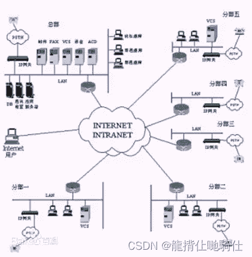
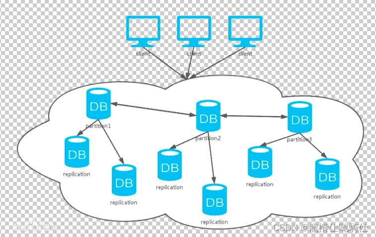
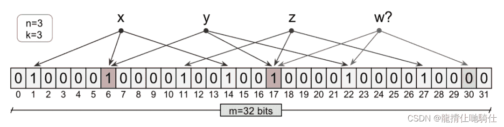
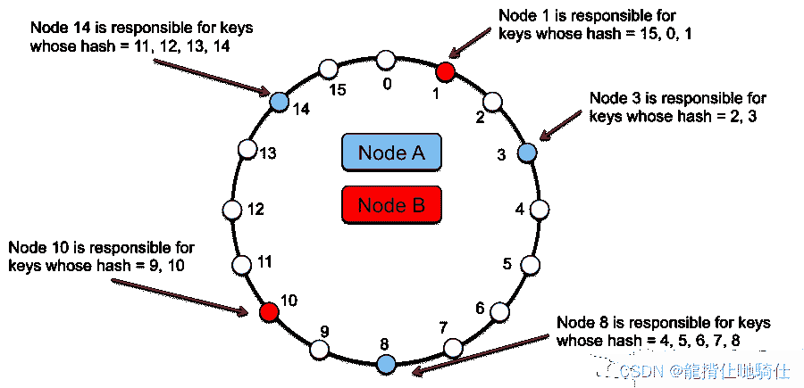
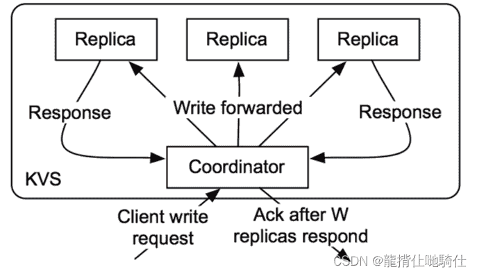
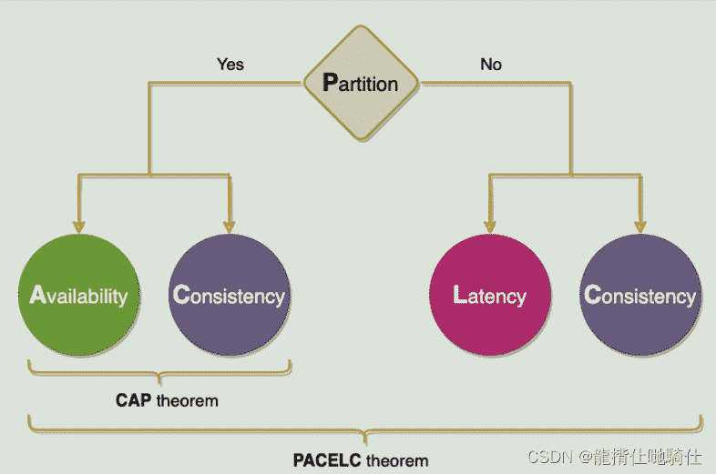
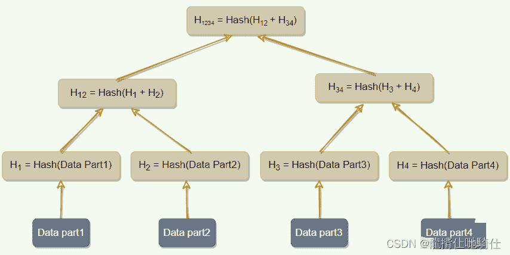

<!--yml
category: 微服务
date: 2022-11-20 02:49:01
-->

# 分布式系统19种设计模式（荣耀典藏版）

> 来源：[https://blog.csdn.net/weixin_48321993/article/details/125855431](https://blog.csdn.net/weixin_48321993/article/details/125855431)

 

**目录**

[前言](#%E5%89%8D%E8%A8%80)

[一、前置知识点](#%E4%B8%80%E3%80%81%E5%89%8D%E7%BD%AE%E7%9F%A5%E8%AF%86%E7%82%B9)

[1、分类](#1%E3%80%81%E5%88%86%E7%B1%BB)

[2、特征](#2%E3%80%81%E7%89%B9%E5%BE%81)

[3、优缺点](#3%E3%80%81%E4%BC%98%E7%BC%BA%E7%82%B9)

[3.1优点](#3.1%E4%BC%98%E7%82%B9)

[3.2、缺点](#3.2%E3%80%81%E7%BC%BA%E7%82%B9)

[4、应用](#4%E3%80%81%E5%BA%94%E7%94%A8)

[4.1、并行](#4.1%E3%80%81%E5%B9%B6%E8%A1%8C)

[4.2、容错应用](#4.2%E3%80%81%E5%AE%B9%E9%94%99%E5%BA%94%E7%94%A8)

[4.3、固有的应用](#4.3%E3%80%81%E5%9B%BA%E6%9C%89%E7%9A%84%E5%BA%94%E7%94%A8)

[5、与计算机网络异同](#5%E3%80%81%E4%B8%8E%E8%AE%A1%E7%AE%97%E6%9C%BA%E7%BD%91%E7%BB%9C%E5%BC%82%E5%90%8C)

[6、系统设计难点](#6%E3%80%81%E7%B3%BB%E7%BB%9F%E8%AE%BE%E8%AE%A1%E9%9A%BE%E7%82%B9)

[二、分布式系统重要组成技术](#)

[1、布隆过滤器](#1%E3%80%81%E5%B8%83%E9%9A%86%E8%BF%87%E6%BB%A4%E5%99%A8)

[2、一致性哈希](#2%E3%80%81%E4%B8%80%E8%87%B4%E6%80%A7%E5%93%88%E5%B8%8C)

[3、Quorum](#3%E3%80%81Quorum)

[4、领导者（Leader）和追随者（Follower）](#4%E3%80%81%E9%A2%86%E5%AF%BC%E8%80%85%EF%BC%88Leader%EF%BC%89%E5%92%8C%E8%BF%BD%E9%9A%8F%E8%80%85%EF%BC%88Follower%EF%BC%89)

[5、心跳](#5%E3%80%81%E5%BF%83%E8%B7%B3)

[6、Fencing](#6%E3%80%81Fencing)

[7、WAL（预写日志Write-ahead Log）](#7%E3%80%81WAL%EF%BC%88%E9%A2%84%E5%86%99%E6%97%A5%E5%BF%97Write-ahead%20Log%EF%BC%89)

[8、分段日志](#8%E3%80%81%E5%88%86%E6%AE%B5%E6%97%A5%E5%BF%97)

[9、高水位线（High-Water mark）](#9%E3%80%81%E9%AB%98%E6%B0%B4%E4%BD%8D%E7%BA%BF%EF%BC%88High-Water%20mark%EF%BC%89)

[10、租约（Lease）](#10%E3%80%81%E7%A7%9F%E7%BA%A6%EF%BC%88Lease%EF%BC%89)

[11、Gossip协议](#11%E3%80%81Gossip%E5%8D%8F%E8%AE%AE)

[12、Phi 累计故障检测（Phi Accrual Failure Detection）](#12%E3%80%81Phi%20%E7%B4%AF%E8%AE%A1%E6%95%85%E9%9A%9C%E6%A3%80%E6%B5%8B%EF%BC%88Phi%20Accrual%20Failure%20Detection%EF%BC%89)

[13、脑裂](#13%E3%80%81%E8%84%91%E8%A3%82)

[14、校验和（checksum）](#14%E3%80%81%E6%A0%A1%E9%AA%8C%E5%92%8C%EF%BC%88checksum%EF%BC%89)

[15、CAP定理](#15%E3%80%81CAP%E5%AE%9A%E7%90%86)

[16、PACELEC定理](#16%E3%80%81PACELEC%E5%AE%9A%E7%90%86)

[17、提示交接（Hinted Handoff）](#17%E3%80%81%E6%8F%90%E7%A4%BA%E4%BA%A4%E6%8E%A5%EF%BC%88Hinted%20Handoff%EF%BC%89)

[18、读取时修复](#18%E3%80%81%E8%AF%BB%E5%8F%96%E6%97%B6%E4%BF%AE%E5%A4%8D)

[19、默克尔树（Merkle Trees）](#19%E3%80%81%E9%BB%98%E5%85%8B%E5%B0%94%E6%A0%91%EF%BC%88Merkle%20Trees%EF%BC%89)

* * *

# 前言

        1.什么是分布式系统？

        在一个分布式系统中，一组独立的计算机展现给用户的是一个统一的整体，就好像是一个系统似的。系统拥有多种通用的物理和逻辑资源，可以动态的分配任务，分散的物理和逻辑资源通过[计算机网络](https://baike.baidu.com/item/%E8%AE%A1%E7%AE%97%E6%9C%BA%E7%BD%91%E7%BB%9C "计算机网络")实现信息交换。系统中存在一个以全局的方式管理计算机资源的[分布式操作系统](https://baike.baidu.com/item/%E5%88%86%E5%B8%83%E5%BC%8F%E6%93%8D%E4%BD%9C%E7%B3%BB%E7%BB%9F "分布式操作系统")。

在[计算机网络](https://baike.baidu.com/item/%E8%AE%A1%E7%AE%97%E6%9C%BA%E7%BD%91%E7%BB%9C "计算机网络")中，这种统一性、模型以及其中的[软件](https://baike.baidu.com/item/%E8%BD%AF%E4%BB%B6 "软件")都不存在。用户看到的是实际的机器，[计算机网络](https://baike.baidu.com/item/%E8%AE%A1%E7%AE%97%E6%9C%BA%E7%BD%91%E7%BB%9C "计算机网络")并没有使这些机器看起来是统一的。如果这些机器有不同的硬件或者不同的[操作系统](https://baike.baidu.com/item/%E6%93%8D%E4%BD%9C%E7%B3%BB%E7%BB%9F "操作系统")，那么，这些差异对于用户来说都是完全可见的。如果一个用户希望在一台远程机器上运行一个程序，那么，他必须登陆到远程机器上，然后在那台机器上运行该程序。

分布式系统和计算机网络系统的共同点是：多数分布式系统是建立在计算机网络之上的，所以分布式系统与计算机网络在[物理结构](https://baike.baidu.com/item/%E7%89%A9%E7%90%86%E7%BB%93%E6%9E%84 "物理结构")上是基本相同的。

他们的区别在于：分布式操作系统的设计思想和[网络操作系统](https://baike.baidu.com/item/%E7%BD%91%E7%BB%9C%E6%93%8D%E4%BD%9C%E7%B3%BB%E7%BB%9F "网络操作系统")是不同的，这决定了他们在结构、工作方式和功能上也不同。[网络操作系统](https://baike.baidu.com/item/%E7%BD%91%E7%BB%9C%E6%93%8D%E4%BD%9C%E7%B3%BB%E7%BB%9F "网络操作系统")要求网络用户在使用[网络资源](https://baike.baidu.com/item/%E7%BD%91%E7%BB%9C%E8%B5%84%E6%BA%90 "网络资源")时首先必须了解网络资源，网络用户必须知道网络中各个计算机的功能与配置、[软件](https://baike.baidu.com/item/%E8%BD%AF%E4%BB%B6 "软件")资源、网络文件结构等情况，在网络中如果用户要读一个[共享文件](https://baike.baidu.com/item/%E5%85%B1%E4%BA%AB%E6%96%87%E4%BB%B6 "共享文件")时，用户必须知道这个文件放在哪一台计算机的哪一个目录下；[分布式操作系统](https://baike.baidu.com/item/%E5%88%86%E5%B8%83%E5%BC%8F%E6%93%8D%E4%BD%9C%E7%B3%BB%E7%BB%9F "分布式操作系统")是以全局方式管理系统资源的，它可以为用户任意调度网络资源，并且调度过程是“透明”的。当用户提交一个作业时，[分布式操作系统](https://baike.baidu.com/item/%E5%88%86%E5%B8%83%E5%BC%8F%E6%93%8D%E4%BD%9C%E7%B3%BB%E7%BB%9F "分布式操作系统")能够根据需要在系统中选择最合适的[处理器](https://baike.baidu.com/item/%E5%A4%84%E7%90%86%E5%99%A8 "处理器")，将用户的作业提交到该处理[程序](https://baike.baidu.com/item/%E7%A8%8B%E5%BA%8F "程序")，在处理器完成作业后，将结果传给用户。在这个过程中，用户并不会意识到有多个[处理器](https://baike.baidu.com/item/%E5%A4%84%E7%90%86%E5%99%A8 "处理器")的存在，这个系统就像是一个处理器一样。 

[内聚性](https://baike.baidu.com/item/%E5%86%85%E8%81%9A%E6%80%A7/4973441 "内聚性")是指每一个[数据库](https://baike.baidu.com/item/%E6%95%B0%E6%8D%AE%E5%BA%93/103728 "数据库")分布节点[高度自治](https://baike.baidu.com/item/%E9%AB%98%E5%BA%A6%E8%87%AA%E6%B2%BB/3379318 "高度自治")，有本地的[数据库管理系统](https://baike.baidu.com/item/%E6%95%B0%E6%8D%AE%E5%BA%93%E7%AE%A1%E7%90%86%E7%B3%BB%E7%BB%9F/1239101 "数据库管理系统")。透明性是指每一个[数据库](https://baike.baidu.com/item/%E6%95%B0%E6%8D%AE%E5%BA%93/103728 "数据库")分布节点对用户的应用来说都是透明的，看不出是本地还是远程。在[分布式数据库系统](https://baike.baidu.com/item/%E5%88%86%E5%B8%83%E5%BC%8F%E6%95%B0%E6%8D%AE%E5%BA%93%E7%B3%BB%E7%BB%9F/5389644 "分布式数据库系统")中，用户感觉不到数据是分布的，即用户不须知道关系是否分割、有无[副本](https://baike.baidu.com/item/%E5%89%AF%E6%9C%AC/3512540 "副本")、数据存于哪个站点以及[事务](https://baike.baidu.com/item/%E4%BA%8B%E5%8A%A1/5945882 "事务")在哪个站点上执行等。 

# 一、前置知识点

## 1、分类

分布式计算机系统的体系结构可用处理机之间的耦合度为主要标志来加以描述。耦合度是系统模块之间互联的紧密程度，它是[数据传输率](https://baike.baidu.com/item/%E6%95%B0%E6%8D%AE%E4%BC%A0%E8%BE%93%E7%8E%87/603683 "数据传输率")、响应时间、并行处理能力等性能指标的综合反映，主要取决于所选用体系结构的互联拓扑结构和通信链路的类型。 [2]

按地理环境衡量耦合度，分布式系统可以分为机体内系统、建筑物内系统、建筑物间系统和不同地理范围的区域系统等，它们的耦合度依次由高到低按应用领域的性质决定耦合度，可以分成三类： [2] 

第一种是面向计算任务的分布并行计算机系统和分布式多用户计算机系统，它们要求尽可能高的耦合度，以便发展成为能分担大型计算机和分时计算机系统所完成的工作。 [2] 

第二种是面向管理信息的分布式数据处理系统。耦合度可以适当降低。 [2] 

第三种是面向过程控制的分布式[计算机控制系统](https://baike.baidu.com/item/%E8%AE%A1%E7%AE%97%E6%9C%BA%E6%8E%A7%E5%88%B6%E7%B3%BB%E7%BB%9F/5708 "计算机控制系统")。耦合度要求适中，当然对于某些实时应用，其耦合度的要求可能很高。 [2] 

## 2、特征

分布式系统是多个处理机通过通信线路互联而构成的松散耦合的系统。从系统中某台处理机来看，其余的处理机和相应的资源都是远程的，只有它自己的资源才是本地的。至今，对分布式系统的定义尚未形成统一的见解。一般认为，分布式系统应具有以下四个特征： [3]

(1)分布性。分布式系统由多台计算机组成，它们在地域上是分散的，可以散布在一个单位、一个城市、一个国家，甚至全球范围内。整个系统的功能是分散在各个节点上实现的，因而分布式系统具有数据处理的分布性。 [3] 

(2)自治性。分布式系统中的各个节点都包含自己的处理机和内存，各自具有独立的处理数据的功能。通常，彼此在地位上是平等的，无主次之分，既能自治地进行工作，又能利用共享的通信线路来传送信息，协调任务处理。 [3] 

(3)并行性。一个大的任务可以划分为若干个子任务，分别在不同的主机上执行。 [3] 

(4)全局性。分布式系统中必须存在一个单一的、全局的进程通信机制，使得任何一个进程都能与其他进程通信，并且不区分本地通信与远程通信。同时，还应当有全局的保护机制。系统中所有机器上有统一的系统调用集合，它们必须适应分布式的环境。在所有CPU上运行同样的内核，使协调工作更加容易。 [3] 

## 3、优缺点

### 3.1优点

(1)资源共享。若干不同的节点通过通信网络彼此互联，一个节点上的用户可以使用其他节点上的资源，如分布式系统允许设备共享，使众多用户共享昂贵的外部设备，如[彩色打印机](https://baike.baidu.com/item/%E5%BD%A9%E8%89%B2%E6%89%93%E5%8D%B0%E6%9C%BA/9508717 "彩色打印机")；允许数据共享，使众多用户访问共用的数据库；可以共享远程文件，使用远程特有的硬件设备（如高速阵列处理器），以及执行其他操作。 [3] 

(2)加快计算速度。如果一个特定的计算任务可以划分为若干个并行运行的子任务，则可把这些子任务分散到不同的节点上，使它们同时在这些节点上运行，从而加快计算速度。另外，分布式系统具有计算迁移功能，如果某个节点上的负载太重，则可把其中一些作业移到其他节点去执行，从而减轻该节点的负载。这种作业迁移称为负载平衡。 [3] 

(3)可靠性高。分布式系统具有高可靠性。如果其中某个节点失效了，则其余的节点可以继续操作，整个系统不会因为一个或少数几个节点的故障而全体崩溃。因此，分布式系统有很好的容错性能。 [3] 

系统必须能够检测节点的故障，采取适当的手段，使它从故障中恢复过来。系统确定故障所在的节点后，就不再利用它来提供服务，直至其恢复正常工作。如果失效节点的功能可由其他节点完成，则系统必须保证功能转移的正确实施。当失效节点被恢复或者修复时，系统必须把它平滑地集成到系统中。 [3] 

(4)通信方便、快捷。分布式系统中各个节点通过一个通信网络互联在一起。通信网络由通信线路、调制解调器和通信处理器等组成，不同节点的用户可以方便地交换信息。在低层，系统之间利用传递消息的方式进行通信，这类似于单CPU系统中的消息机制。单CPU系统中所有高层的消息传递功能都可以在分布式系统中实现，如文件传递、登录、邮件、Web浏览和[远程过程调用](https://baike.baidu.com/item/%E8%BF%9C%E7%A8%8B%E8%BF%87%E7%A8%8B%E8%B0%83%E7%94%A8/7854346 "远程过程调用")( Remote Procedure call，RPC)。 [3] 

分布式系统实现了节点之间的远距离通信，为人与人之间的信息交流提供了很大方便不同地区的用户可以共同完成一个项目，通过传送项目文件，远程登录进入对方系统来运行程序，如发送电子邮件等，协调彼此的工作。 [3] 

### 3.2、缺点

尽管分布式系统具备众多优势，但它也有自身的缺点，主要是可用软件不足，系统软件、编程语言、应用程序以及开发工具都相对很少。此外，还存在通信网络饱和或信息丢失和网络安全问题，方便的数据共享同时意味着机密数据容易被窃取。虽然分布式系统存在这些潜在的问题，但其优点远大于缺点，而且这些缺点也正得到克服。因此，分布式系统仍是人们研究、开发和应用的方向。

## 4、应用

分布式系统被用在许多不同类型的应用中。以下列出了一些应用。对这些应用而言，使用分布式系统要比其他[体系结构](https://baike.baidu.com/item/%E4%BD%93%E7%B3%BB%E7%BB%93%E6%9E%84 "体系结构")如[处理机](https://baike.baidu.com/item/%E5%A4%84%E7%90%86%E6%9C%BA "处理机")和共享[存储器](https://baike.baidu.com/item/%E5%AD%98%E5%82%A8%E5%99%A8 "存储器")[多处理机](https://baike.baidu.com/item/%E5%A4%9A%E5%A4%84%E7%90%86%E6%9C%BA "多处理机")更优越：

### 4.1、并行

原则上，并行应用也可以在共享[存储器](https://baike.baidu.com/item/%E5%AD%98%E5%82%A8%E5%99%A8 "存储器")[多处理机](https://baike.baidu.com/item/%E5%A4%9A%E5%A4%84%E7%90%86%E6%9C%BA "多处理机")上运行，但[共享存储](https://baike.baidu.com/item/%E5%85%B1%E4%BA%AB%E5%AD%98%E5%82%A8/10240425 "共享存储")器系统不能很好地扩大规模以包括大量的处理机。HPCC（高性能计算和通信）应用一般需要一个可伸缩的设计，这种设计取决于[分布式处理](https://baike.baidu.com/item/%E5%88%86%E5%B8%83%E5%BC%8F%E5%A4%84%E7%90%86 "分布式处理")。

### 4.2、容错应用

因为每个PE是自治的，所以分布式系统更加可靠。一个单元或资源（[软件](https://baike.baidu.com/item/%E8%BD%AF%E4%BB%B6 "软件")或硬件）的[故障](https://baike.baidu.com/item/%E6%95%85%E9%9A%9C "故障")不影响其他资源的正常功能。

### 4.3、固有的应用

许多应用是固有分布式的。这些应用是突发模式（burstmode）而非批量模式（bulk mode）。这方面的实例有事务处理和Internet Javad，[程序](https://baike.baidu.com/item/%E7%A8%8B%E5%BA%8F "程序")。

这些应用的性能取决于吞吐量（[事务](https://baike.baidu.com/item/%E4%BA%8B%E5%8A%A1 "事务")响应时间或每秒完成的事务数）而不是一般[多处理机](https://baike.baidu.com/item/%E5%A4%9A%E5%A4%84%E7%90%86%E6%9C%BA "多处理机")所用的执行时间。

对于一组用户而言， 分布式系统有一个特别的应用称为[计算机支持的协同工作](https://baike.baidu.com/item/%E8%AE%A1%E7%AE%97%E6%9C%BA%E6%94%AF%E6%8C%81%E7%9A%84%E5%8D%8F%E5%90%8C%E5%B7%A5%E4%BD%9C "计算机支持的协同工作")（Computer Supported Cooperative Working，CSCW）或[群件](https://baike.baidu.com/item/%E7%BE%A4%E4%BB%B6 "群件")（groupware）， 支持用户协同工作。另一个应用是分布式会议， 即通过物理的[分布式网络](https://baike.baidu.com/item/%E5%88%86%E5%B8%83%E5%BC%8F%E7%BD%91%E7%BB%9C "分布式网络")进行电子会议。同样，[多媒体](https://baike.baidu.com/item/%E5%A4%9A%E5%AA%92%E4%BD%93 "多媒体")远程教学也是一个类似的应用。 

为了达到[互操作性](https://baike.baidu.com/item/%E4%BA%92%E6%93%8D%E4%BD%9C%E6%80%A7 "互操作性")，用户需要一个标准的[分布式计算环境](https://baike.baidu.com/item/%E5%88%86%E5%B8%83%E5%BC%8F%E8%AE%A1%E7%AE%97%E7%8E%AF%E5%A2%83 "分布式计算环境")，在这个环境里，所有系统和资源都可用。

DCE（[分布式计算环境](https://baike.baidu.com/item/%E5%88%86%E5%B8%83%E5%BC%8F%E8%AE%A1%E7%AE%97%E7%8E%AF%E5%A2%83 "分布式计算环境")）是OSF（开放系统基金会）开发的[分布式计算技术](https://baike.baidu.com/item/%E5%88%86%E5%B8%83%E5%BC%8F%E8%AE%A1%E7%AE%97%E6%8A%80%E6%9C%AF "分布式计算技术")的工业标准集。它提供保护和控制对数据访问的[安全服务](https://baike.baidu.com/item/%E5%AE%89%E5%85%A8%E6%9C%8D%E5%8A%A1 "安全服务")、容易寻找分布式资源的名字服务、以及高度可伸缩的模型用于组织极为分散的用户、服务和数据。D C E可在所有主要的[计算平台](https://baike.baidu.com/item/%E8%AE%A1%E7%AE%97%E5%B9%B3%E5%8F%B0 "计算平台")上运行， 并设计成支持异型硬件和[软件环境](https://baike.baidu.com/item/%E8%BD%AF%E4%BB%B6%E7%8E%AF%E5%A2%83 "软件环境")下的[分布式应用](https://baike.baidu.com/item/%E5%88%86%E5%B8%83%E5%BC%8F%E5%BA%94%E7%94%A8 "分布式应用")。

DCE已经被包括TRANSVARL在内一些厂商实现。TRANSVARL是最早的多厂商组（multi vendor team）的成员之一，它提出的建议已成为DCE[体系结构](https://baike.baidu.com/item/%E4%BD%93%E7%B3%BB%E7%BB%93%E6%9E%84 "体系结构")的基础。在中可以找到利用DCE开发[分布式应用](https://baike.baidu.com/item/%E5%88%86%E5%B8%83%E5%BC%8F%E5%BA%94%E7%94%A8 "分布式应用")的指南。 

一些其它标准基于一个特别的模型，[比如](https://baike.baidu.com/item/%E6%AF%94%E5%A6%82 "比如")CORBA（公用[对象请求代理](https://baike.baidu.com/item/%E5%AF%B9%E8%B1%A1%E8%AF%B7%E6%B1%82%E4%BB%A3%E7%90%86 "对象请求代理")[程序](https://baike.baidu.com/item/%E7%A8%8B%E5%BA%8F "程序")[体系结构](https://baike.baidu.com/item/%E4%BD%93%E7%B3%BB%E7%BB%93%E6%9E%84 "体系结构")），它是由OMG （[对象管理组](https://baike.baidu.com/item/%E5%AF%B9%E8%B1%A1%E7%AE%A1%E7%90%86%E7%BB%84/5134181 "对象管理组")）和多计算机厂商联盟开发的一个标准。CORBA使用[面向对象模型](https://baike.baidu.com/item/%E9%9D%A2%E5%90%91%E5%AF%B9%E8%B1%A1%E6%A8%A1%E5%9E%8B "面向对象模型")实现分布式系统中的透明服务请求。

工业界有自己的标准，[比如](https://baike.baidu.com/item/%E6%AF%94%E5%A6%82 "比如")[微软](https://baike.baidu.com/item/%E5%BE%AE%E8%BD%AF "微软")的分布式[构件](https://baike.baidu.com/item/%E6%9E%84%E4%BB%B6 "构件")对象模型（DCOM）和Sun Microsystem公司的Java Beans。 

## 5、与计算机网络异同

分布式计算机系统与计算机网络既有类似之处又有不同点，其主要的异同如下：

(1)在计算机网络中，每个用户或任务通常只使用一台计算机，若要利用网络中的另一台计算机，则需要远程注册。在分布式计算机系统中，用户进程在系统内各个计算机上动态调度，并根据运行情况由分布式操作系统动态地、透明地将机器分配给用户进程或任务。

(2)在计算机网络中，用户知道它们的文件存放在何处，并用显示的文件传输命令在机器之间传送文件。在分布式计算机系统中，文件的放置由操作系统管理，用户可用相同方式访问系统中的所有文件而不管它们位于何处。

(3)在计算机网络中，各结点计算机均有自己的操作系统，资源归局部所有并被局部控制，网络内的进程调度是通过进程迁移和数据迁移实现的。在分布式计算机系统中，每个场点上运行一个局部操作系统，执行的任务可以是独立的，可以是某任务的一个部分，也可以是其他场点上的(部分)任务，且各场点相互协同，合作平衡系统内的负载。

(4)在计算机网络中，系统几乎无容错能力。在分布式计算机系统中有系统自动重构、适度降级使用及错误恢复功能。

(5)两者透明性的程度和级别不同。

(6)就资源共享而言，计算机网络和分布式计算机系统是类似的。

## 6、系统设计难点

虽然分布式系统具有很多优点，然而由于分布式系统自身的特点及应用环境的复杂性，分布式系统设计有如下的很多难题需要解决: [6]

1.部分失效问题

由于分布式系统通常由若干部分组成，各个部分由于各种原因可能发生故障，如硬件故障、软件错误及错误操作等。如果一个分布式系统不对这些故障进行有效的处理，系统某一组成部分的故障可能导致整个系统的瘫痪。 [6] 

2.性能和可靠性过分依赖于网络

由于分布式系统是建立在网络之上的，而网络本身是不可靠的，可能经常发生故障，网络故障可能导致系统服务的终止。另外，网络超负荷会导致性能的降低，增加系统的响应时间。 [6] 

3.缺乏统一控制

一个分布式系统的控制通常是一个典型的分散控制，没有统一的中心控制。因此，分布式系统通常需要相应的同步机制来协调系统中各个部分的工作。设计与实现一个对用户来说是透明的且具有容错能力的分布式系统是一项具有挑战性的工作，而且所需的机制和策略尚未成熟。因此什么样的程序设计模型、什么样的控制机制最适合分布式系统仍是需要继续研究的课题。 [6] 

4.难以合理设计资源分配策略

在集中式系统中，所有的资源都由操作系统管理和分配，但在分布式系统中，资源属于各节点，所以调度的灵活性不如集中式系统，资源的物理分布可能与用户请求的分布不匹配，某些资源可能空闲，而另一些资源可能超载。 

5.安全保密性问题

开放性使得分布式系统中的许多软件接口都提供给用户，这样的开放式结构对于开发人员非常有价值，但同时也为破坏者打开了方便之门。 

针对分布式系统存在的上述难点，要保证一个分布式系统的正常运行，就必须对系统资源进行有效的管理，对计算机之间的通信、故障、安全等问题提供有效的处理手段和支持机制。 [6] 

用户对分布式系统的要求是透明性、安全性、灵活性、简单性、可靠性，也要求方便在局部失效时重构系统，以及集成不均匀子系统的能力。

资源的分布性、缺乏全局状态信息及传输延迟，意味着集中式操作系统的某些方法和技术不能应用于分布式系统中。即使集中式系统中的某些技术满足上面的要求，其实现通常也是要付出很大代价的。

# 二、分布式系统重要组成技术

# 1、布隆过滤器

Bloom过滤器是一种节省空间的概率数据结构，用于测试元素是否为某集合的成员。它用于我们只需要检查元素是否属于对象的场景。

 在BigTable（和Cassandra）中，任何读取操作都必须从组成Tablet的SSTable中读取。如果这些SSTable不在内存中，则读取操作可能最终会执行许多磁盘访问以便读取所需的SSTable。为了减少磁盘访问次数，BigTable 使用Bloom过滤器。

# 2、一致性哈希

一致的哈希允许您轻松扩展，从而允许以有效的方式复制数据，从而实现更好的可用性和容错能力。

通过对数据项的键进行哈希处理以产生其在环上的位置，然后顺时针遍历环以查找位置大于该项位置的第一个节点，将每个由键标识的数据项分配给节点。与节点关联的节点是数据项的位置。

 

一致散列的主要优点是增量稳定性；节点离开或到达集群仅影响其直接邻居，其他节点不受影响。

# 3、Quorum

在分布式环境中，quorum是在确认操作成功之前需要成功执行此分布式操作的最小服务器数。

Cassandra，为了确保数据一致性，每个写入请求都可以配置为仅当数据已写入至少一个quorum（或大多数）副本节点时才成功。

对于领导者选举，Chubby使用Paxos，它使用quorum来确保强大的一致性。

Dynamo 将写入复制到系统中其他节点的草率quorum，而不是像Paxos那样的严格多数quorum。所有读/写操作都在首选项列表中的第一个NN正常节点上执行，该节点可能并不总是在遍历一致哈希环时遇到的第一个NN节点。

# 4、领导者（Leader）和追随者（Follower）

为了在管理数据的系统中实现容错，需要在多个服务器上复制数据。

在集群中选择一个服务器作为领导者。领导者负责代表整个集群做出决策，并将决策传播到所有其他服务器。

三到五个节点的集群，就像在实现共识的系统中一样，领导者选举可以在数据集群本身内实施，而不依赖于任何外部系统。领导者选举在服务器启动时进行。每个服务器在启动时都会启动领导者选举，并尝试选举领导者。除非选出领导者，否则系统不接受任何客户端请求。

# 5、心跳

心跳机制用于检测现有领导者是否失败，以便可以启动新的领导者选举。

# 6、Fencing

在领导者-追随者模式中，当领导者失败时，不可能确定领导者已停止工作。例如，慢速网络或网络分区可能会触发新的领导者选举，即使前一个领导者仍在运行并认为它仍然是活动的领导者。

屏蔽是指在以前处于活动状态的领导者周围设置围栏，使其无法访问集群资源，从而停止为任何读/写请求提供服务。

使用以下两种技术：

# 7、WAL（预写日志Write-ahead Log）

预写日志记录是解决操作系统中文件系统不一致的问题的高级解决方案。受数据库管理系统的启发，此方法首先将要执行的操作的摘要记入“日志”中，然后再将其实际写入磁盘。在发生崩溃的情况下，操作系统只需检查此日志并从中断的位置继续。

# 8、分段日志

将日志拆分为多个较小的文件，而不是单个大文件，以便于操作。

单个日志文件在启动时读取时可能会增长并成为性能瓶颈。较旧的日志会定期清理，并且很难对单个大文件执行清理操作。

单个日志拆分为多个段。日志文件在指定的大小限制后滚动。使用日志分段，需要有一种将逻辑日志偏移量（或日志序列号）映射到日志段文件的简单方法。

# 9、高水位线（High-Water mark）

跟踪领导者上的最后一个日志条目，该条目已成功复制到追随者的quorum。日志中此条目的索引称为高水位线索引。领导者仅公开到高水位线索引的数据。

Kafka：为了处理非可重复读取并确保数据一致性，Kafka broker会跟踪高水位线，这是特定分区的最大偏移量。使用者只能看到高水位线之前的消息。

# 10、租约（Lease）

租约就像一个锁，但即使客户端离开，它也能工作。客户端请求有限期限的租约，之后租约到期。如果客户端想要延长租约，它可以在租约到期之前续订租约。

Chubby客户端与领导者保持有时限的会话租约。在此时间间隔内，领导者保证不会单方面终止会话。

# 11、Gossip协议

Gossip协议是点对点通信机制，其中节点定期交换有关自己和他们所知道的其他节点的状态信息。

每个节点每秒启动一轮Gossip回合，以与另一个随机节点交换有关自己和其他节点的状态信息。

# 12、Phi 累计故障检测（Phi Accrual Failure Detection）

此算法使用历史检测信号信息使阈值自适应。通用的应计故障检测器不会判断服务器是否处于活动状态，而是输出有关服务器的可疑级别。

Cassandra使用Phi应计故障检测器算法来确定群集中节点的状态。

# 13、脑裂

分布式系统具有两个或多个活动领导者的场景称为脑裂。

通过使用生成时钟（Generation Clock）可以解决脑裂问题，生成时钟只是一个单调递增的数字，用于指示服务器的生成。

每次选出新领导者时，时钟数字（generation number）都会增加。这意味着，如果旧领导者的时钟数为“1”，则新领导人的时钟数将为“2”。此时钟号包含在从领导发送到其他节点的每个请求中。通过这种方式，节点现在可以通过简单地信任具有最高数字的领导者来轻松区分真正的领导者。

Kafka：为了处理脑裂（我们可以有多个active controller broker），Kafka使用“纪元数”（Epoch number），这只是一个单调增加的数字来表示服务器的代次（generation）。

HDFS：ZooKeeper用于确保任何时候只有一个NameNode处于活动状态。epoch编号作为每个事务ID的一部分进行维护，以反映NameNode的代次。

# 14、校验和（checksum）

在分布式系统中，在组件之间移动数据时，从节点获取的数据可能会损坏。

计算校验和并将其与数据一起存储。

要计算校验和，请使用MD5、SHA-1、SHA-256或SHA-512等加密哈希函数。哈希函数获取输入数据并生成固定长度的字符串（包含字母和数字）；此字符串称为校验和。

当系统存储某些数据时，它会计算数据的校验和，并将校验和与数据一起存储。当客户端检索数据时，它会验证从服务器接收的数据是否与存储的校验和匹配。如果没有，则客户端可以选择从另一个副本检索该数据。

HDFS和Chubby将每个文件的校验和与数据一起存储。

# 15、CAP定理

CAP定理指出，分布式系统不可能同时提供以下所有三个理想属性：

一致性（C）、可用性（A）和分区容差（P）。

根据CAP定理，任何分布式系统都需要从三个属性中选择两个。这三个选项是CA、CP和AP。

Dynamo：在CAP定理术语中，Dynamo属于AP系统的类别，旨在牺牲强一致性为代价实现高可用性。

BigTable：就CAP定理而言，BigTable是一个CP系统，即它具有严格一致的读取和写入。

# 16、PACELEC定理

PACELC定理指出，在复制数据的系统中：

定理（PAC）的第一部分与CAP定理相同，ELC是扩展。整个论点假设我们通过复制来保持高可用性。因此，当失败时，CAP定理占上风。但如果没有，我们仍然必须考虑复制系统的一致性和延迟之间的权衡。

# 17、提示交接（Hinted Handoff）

如果节点关闭，系统会保留它们错过的所有请求的提示（或注释）。故障节点恢复后，将根据存储的提示将请求转发给它们。

当节点关闭时，领导者会在本地磁盘上的文本文件中写入提示。此提示包含数据及其所属的节点信息。当领导者意识到它为其保留提示的节点已恢复时，它会将每个提示的写入请求转发到该节点。

# 18、读取时修复

在分布式系统中，数据跨多个节点复制，某些节点最终可能会拥有过时的数据。

在读取操作期间修复过时的数据，因为此时，我们可以从多个节点读取数据以进行比较并找到具有过时数据的节点。此机制称为读取修复。一旦已知具有旧数据的节点，读取修复操作就会将较新版本的数据推送到具有较旧版本的节点。

Cassandra和Dynamo使用“读取修复”将最新版本的数据推送到具有旧版本的节点。

# 19、默克尔树（Merkle Trees）

“读取修复”可在处理读取请求时消除冲突。但是，如果某个副本明显落后于其他副本，则可能需要很长时间才能解决冲突。

副本可以包含大量数据。单纯地拆分整个范围来计算校验和进行比较并不是很可行；有太多的数据需要传输。相反，我们可以使用Merkle树来比较一个范围的副本。

Merkle树是哈希的二叉树，其中每个内部节点是其两个子节点的哈希，每个叶节点是原始数据一部分的哈希。

比较Merkle树在概念上很简单：

> *   比较两个树的根哈希。
>     
>     
> *   如果它们相等，请停止。
>     
>     
> *   在左边和右边的孩子上递归检查。

为了实现反熵和在后台解决冲突，Dynamo使用Merkle树。