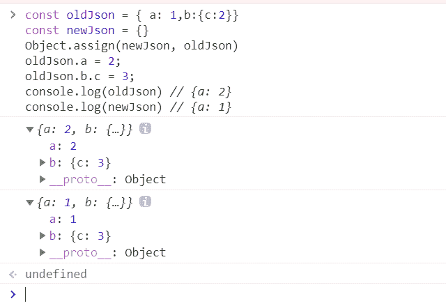

<!--yml
category: 前端
date: 0001-01-01 00:00:00
-->

# 前端手写代码面试题（山月）

# 什么是防抖和节流，他们的应用场景有哪些

> 原文：[https://q.shanyue.tech/fe/code/3.html](https://q.shanyue.tech/fe/code/3.html)

Issue

欢迎在 Gtihub Issue 中回答此问题: [Issue 3(opens new window)](https://github.com/shfshanyue/Daily-Question/issues/3)

Author

回答者: [xiaoai7904(opens new window)](https://github.com/xiaoai7904)

#### 防抖(debounce)

触发高频事件后 n 秒内函数只会执行一次，如果 n 秒内高频事件再次被触发，则重新计算时间

##### 示例代码

```
// 防抖函数
function debounce(fn, wait) {
  let timer;
  return function () {
    let _this = this;
    let args = arguments;
    if (timer) {
      clearTimeout(timer);
    }
    timer = setTimeout(function () {
      fn.apply(_this, args);
    }, wait);
  };
}
// 使用
window.onresize = debounce(function () {
  console.log("resize");
}, 500); 
```

#### 节流(throttle)

高频事件触发，但在 n 秒内只会执行一次，所以节流会稀释函数的执行频率

##### 示例代码

```
// 方式1: 使用时间戳
function throttle1(fn, wait) {
  let time = 0;
  return function () {
    let _this = this;
    let args = arguments;
    let now = Date.now();
    if (now - time > wait) {
      fn.apply(_this, args);
      time = now;
    }
  };
}
// 方式2: 使用定时器
function thorttle2(fn, wait) {
  let timer;
  return function () {
    let _this = this;
    let args = arguments;

    if (!timer) {
      timer = setTimeout(function () {
        timer = null;
        fn.apply(_this, args);
      }, wait);
    }
  };
} 
```

上面`节流`和`防抖`实现方式比较简单，但是已经可以满足日常使用，如果想更近一步了解可以查看[underscore(opens new window)](https://www.bootcss.com/p/underscore/)和[lodash(opens new window)](https://www.lodashjs.com/docs/latest)文档中`debounce`和`thorttle`

Author

回答者: [shfshanyue(opens new window)](https://github.com/shfshanyue)

## 防抖 (debounce)

防抖，顾名思义，防止抖动，以免把一次事件误认为多次，敲键盘就是一个每天都会接触到的防抖操作。

想要了解一个概念，必先了解概念所应用的场景。在 JS 这个世界中，有哪些防抖的场景呢

1.  登录、发短信等按钮避免用户点击太快，以致于发送了多次请求，需要防抖
2.  调整浏览器窗口大小时，resize 次数过于频繁，造成计算过多，此时需要一次到位，就用到了防抖
3.  文本编辑器实时保存，当无任何更改操作一秒后进行保存

代码如下，可以看出来**防抖重在清零 `clearTimeout(timer)`**

```
function debounce(f, wait) {
  let timer;
  return (...args) => {
    clearTimeout(timer);
    timer = setTimeout(() => {
      f(...args);
    }, wait);
  };
} 
```

## 节流 (throttle)

节流，顾名思义，控制水的流量。控制事件发生的频率，如控制为 1s 发生一次，甚至 1 分钟发生一次。与服务端(server)及网关(gateway)控制的限流 (Rate Limit) 类似。

1.  `scroll` 事件，每隔一秒计算一次位置信息等
2.  浏览器播放事件，每个一秒计算一次进度信息等
3.  input 框实时搜索并发送请求展示下拉列表，每隔一秒发送一次请求 (也可做防抖)

代码如下，可以看出来**节流重在加锁 `timer=timeout`**

```
function throttle(f, wait) {
  let timer;
  return (...args) => {
    if (timer) {
      return;
    }
    timer = setTimeout(() => {
      f(...args);
      timer = null;
    }, wait);
  };
} 
```

## 总结 (简要答案)

*   防抖：防止抖动，单位时间内事件触发会被重置，避免事件被误伤触发多次。**代码实现重在清零 `clearTimeout`**。防抖可以比作等电梯，只要有一个人进来，就需要再等一会儿。业务场景有避免登录按钮多次点击的重复提交。
*   节流：控制流量，单位时间内事件只能触发一次，与服务器端的限流 (Rate Limit) 类似。**代码实现重在开锁关锁 `timer=timeout; timer=null`**。节流可以比作过红绿灯，每等一个红灯时间就可以过一批。

Author

回答者: [Janezhang650(opens new window)](https://github.com/Janezhang650)

你好，向请问一下防抖函数的`let _this = this`的作用是什么，这里的`this`不是都指向 window 吗？小白求指教，谢谢！！！

Author

回答者: [0124z(opens new window)](https://github.com/0124z)

防抖函数里面有可能有 this 相关的语句，this 必须指向调用它的对象，而定时器里面指向全局对象 window 是不合适的。

# 如何实现一个简单的 Promise

> 原文：[https://q.shanyue.tech/fe/code/23.html](https://q.shanyue.tech/fe/code/23.html)

Issue

欢迎在 Gtihub Issue 中回答此问题: [Issue 23(opens new window)](https://github.com/shfshanyue/Daily-Question/issues/23)

Author

回答者: [shfshanyue(opens new window)](https://github.com/shfshanyue)

一个简单的 `Promise` 的粗糙实现，关键点在于

1.  当 `pending` 时， `thenable` 函数由一个队列维护
2.  当状态变为 `resolved(fulfilled)` 时，队列中所有 `thenable` 函数执行
3.  当 `resolved` 时， `thenable` 函数直接执行

`rejected` 状态同理

```
class Prom {
  static resolve(value) {
    if (value && value.then) {
      return value;
    }
    return new Prom((resolve) => resolve(value));
  }

  constructor(fn) {
    this.value = undefined;
    this.reason = undefined;
    this.status = "PENDING";

    // 维护一个 resolve/pending 的函数队列
    this.resolveFns = [];
    this.rejectFns = [];

    const resolve = (value) => {
      // 注意此处的 setTimeout
      setTimeout(() => {
        this.status = "RESOLVED";
        this.value = value;
        this.resolveFns.forEach(({ fn, resolve: res, reject: rej }) =>
          res(fn(value))
        );
      });
    };

    const reject = (e) => {
      setTimeout(() => {
        this.status = "REJECTED";
        this.reason = e;
        this.rejectFns.forEach(({ fn, resolve: res, reject: rej }) =>
          rej(fn(e))
        );
      });
    };

    fn(resolve, reject);
  }

  then(fn) {
    if (this.status === "RESOLVED") {
      const result = fn(this.value);
      // 需要返回一个 Promise
      // 如果状态为 resolved，直接执行
      return Prom.resolve(result);
    }
    if (this.status === "PENDING") {
      // 也是返回一个 Promise
      return new Prom((resolve, reject) => {
        // 推进队列中，resolved 后统一执行
        this.resolveFns.push({ fn, resolve, reject });
      });
    }
  }

  catch(fn) {
    if (this.status === "REJECTED") {
      const result = fn(this.value);
      return Prom.resolve(result);
    }
    if (this.status === "PENDING") {
      return new Prom((resolve, reject) => {
        this.rejectFns.push({ fn, resolve, reject });
      });
    }
  }
}

Prom.resolve(10)
  .then((o) => o * 10)
  .then((o) => o + 10)
  .then((o) => {
    console.log(o);
  });

return new Prom((resolve, reject) => reject("Error")).catch((e) => {
  console.log("Error", e);
}); 
```

Author

回答者: [heretic-G(opens new window)](https://github.com/heretic-G)

```
function MyPromise(executor) {
  if (typeof executor !== "function") {
    // throw new Error('Promise resolver 1 is not a function')
  }
  if (this instanceof MyPromise) {
    // throw new Error(`${this} is not a promise`)
  }
  this.PromiseState = "pending";
  this.PromiseFulfillReactions = [];
  this.PromiseRejectReactions = [];
  this.PromiseIsHandled = false;
  this.AlreadyResolved = false;

  let resolve = _Resolve(this);
  let reject = _Reject(this);

  try {
    executor(resolve, reject);
  } catch (e) {
    reject(e);
  }
}

MyPromise.prototype.then = function (onFulfilled, onRejected) {
  let promise = this;
  let capability = NewPromiseCapability();
  return PerformPromiseThen(promise, onFulfilled, onRejected, capability);
};

function _Resolve(promise) {
  return function __Resolve(resolution) {
    if (promise.AlreadyResolved) {
      return undefined;
    }
    promise.AlreadyResolved = true;
    if (resolution === promise) {
      return RejectPromise(promise, TypeError("is same"));
    }
    if (
      (typeof resolution !== "function" && typeof resolution !== "object") ||
      resolution === null
    ) {
      return FulfillPromise(promise, resolution);
    }
    let then;
    try {
      then = resolution.then;
    } catch (e) {
      return RejectPromise(promise, e);
    }
    if (typeof then !== "function") {
      return FulfillPromise(promise, resolution);
    } else {
      let job = NewPromiseResolveThenableJob(promise, resolution, then);
      HostEnqueuePromiseJob(job);
    }
    return undefined;
  };
}

function _Reject(promise) {
  return function __Reject(reason) {
    if (promise.AlreadyResolved) {
      return undefined;
    }
    promise.AlreadyResolved = true;
    RejectPromise(promise, reason);
  };
}

function executor(resolve, reject) {
  this.resolve = resolve;
  this.reject = reject;
}

function NewPromiseCapability() {
  let capability = {
    resolve: undefined,
    reject: undefined,
    promise: undefined,
  };
  capability.promise = new MyPromise(executor.bind(capability));
  return capability;
}

function PerformPromiseThen(
  promise,
  onFulfilled,
  onRejected,
  resultCapability
) {
  let fulfillReaction = {
    Capability: resultCapability,
    Type: "Fulfill",
    Handler: onFulfilled,
  };
  let rejectReaction = {
    Capability: resultCapability,
    Type: "Reject",
    Handler: onRejected,
  };
  if (promise.PromiseState === "pending") {
    promise.PromiseFulfillReactions.push(fulfillReaction);
    promise.PromiseRejectReactions.push(rejectReaction);
  } else if (promise.PromiseState === "fulfilled") {
    let resolution = promise.PromiseResult;
    let job = NewPromiseReactionJob(fulfillReaction, resolution);
    HostEnqueuePromiseJob(job);
  } else {
    if (!promise.PromiseIsHandled) {
    }
    let reason = promise.PromiseResult;
    let job = NewPromiseReactionJob(rejectReaction, reason);
    HostEnqueuePromiseJob(job);
  }
  promise.PromiseIsHandled = true;
  if (!resultCapability) return undefined;
  return resultCapability.promise;
}

function FulfillPromise(promise, resolution) {
  if (promise.PromiseState !== "pending") {
    return undefined;
  }
  let reactions = promise.PromiseFulfillReactions;
  promise.PromiseResult = resolution;
  promise.PromiseRejectReactions = [];
  promise.PromiseFulfillReactions = [];
  promise.PromiseState = "fulfilled";
  TriggerPromiseReactions(reactions, resolution);
}

function RejectPromise(promise, reason) {
  if (promise.PromiseState !== "pending") {
    return undefined;
  }
  let reactions = promise.PromiseRejectReactions;
  promise.PromiseResult = reason;
  promise.PromiseRejectReactions = [];
  promise.PromiseFulfillReactions = [];
  promise.PromiseState = "rejected";
  if (!promise.PromiseIsHandled) {
  }
  TriggerPromiseReactions(reactions, reason);
}

function TriggerPromiseReactions(reactions, argument) {
  reactions.forEach((curr) => {
    let job = NewPromiseReactionJob(curr, argument);
    HostEnqueuePromiseJob(job);
  });
}

function NewPromiseReactionJob(reaction, argument) {
  return function () {
    let capability = reaction.Capability;
    let type = reaction.Type;
    let handler = reaction.Handler;
    let handlerResult;
    let isError = false;
    if (typeof handler !== "function") {
      if (type === "Fulfill") {
        handlerResult = argument;
      } else {
        isError = true;
        handlerResult = argument;
      }
    } else {
      try {
        handlerResult = handler(argument);
      } catch (e) {
        isError = true;
        handlerResult = e;
      }
    }
    if (!capability) return undefined;
    let status;
    if (!isError) {
      status = capability.resolve(handlerResult);
    } else {
      status = capability.reject(handlerResult);
    }
    return status;
  };
}

function NewPromiseResolveThenableJob(promiseToResolve, thenable, then) {
  return function () {
    let resolve = _Resolve(promiseToResolve);
    let reject = _Reject(promiseToResolve);
    promiseToResolve.AlreadyResolved = false;
    let result;
    try {
      result = then.call(thenable, resolve, reject);
    } catch (e) {
      return reject(e);
    }
    return result;
  };
}

function HostEnqueuePromiseJob(job) {
  setTimeout(job, 0);
}

MyPromise.deferred = function () {
  let dfd = {};
  dfd.promise = new MyPromise((resolve, reject) => {
    dfd.resolve = resolve;
    dfd.reject = reject;
  });
  return dfd;
};

module.exports = MyPromise; 
```

Author

回答者: [hsq777(opens new window)](https://github.com/hsq777)

> 一个简单的 `Promise` 的粗糙实现，关键点在于
> 
> 1.  当 `pending` 时， `thenable` 函数由一个队列维护
> 2.  当状态变为 `resolved(fulfilled)` 时，队列中所有 `thenable` 函数执行
> 3.  当 `resolved` 时， `thenable` 函数直接执行
> 
> `rejected` 状态同理
> 
> ```
> class Prom {
>   static resolve(value) {
>     if (value && value.then) {
>       return value;
>     }
>     return new Prom((resolve) => resolve(value));
>   }
> 
>   constructor(fn) {
>     this.value = undefined;
>     this.reason = undefined;
>     this.status = "PENDING";
> 
>     // 维护一个 resolve/pending 的函数队列
>     this.resolveFns = [];
>     this.rejectFns = [];
> 
>     const resolve = (value) => {
>       // 注意此处的 setTimeout
>       setTimeout(() => {
>         this.status = "RESOLVED";
>         this.value = value;
>         this.resolveFns.forEach(({ fn, resolve: res, reject: rej }) =>
>           res(fn(value))
>         );
>       });
>     };
> 
>     const reject = (e) => {
>       setTimeout(() => {
>         this.status = "REJECTED";
>         this.reason = e;
>         this.rejectFns.forEach(({ fn, resolve: res, reject: rej }) =>
>           rej(fn(e))
>         );
>       });
>     };
> 
>     fn(resolve, reject);
>   }
> 
>   then(fn) {
>     if (this.status === "RESOLVED") {
>       const result = fn(this.value);
>       // 需要返回一个 Promise
>       // 如果状态为 resolved，直接执行
>       return Prom.resolve(result);
>     }
>     if (this.status === "PENDING") {
>       // 也是返回一个 Promise
>       return new Prom((resolve, reject) => {
>         // 推进队列中，resolved 后统一执行
>         this.resolveFns.push({ fn, resolve, reject });
>       });
>     }
>   }
> 
>   catch(fn) {
>     if (this.status === "REJECTED") {
>       const result = fn(this.value);
>       return Prom.resolve(result);
>     }
>     if (this.status === "PENDING") {
>       return new Prom((resolve, reject) => {
>         this.rejectFns.push({ fn, resolve, reject });
>       });
>     }
>   }
> }
> 
> Prom.resolve(10)
>   .then((o) => o * 10)
>   .then((o) => o + 10)
>   .then((o) => {
>     console.log(o);
>   });
> 
> return new Prom((resolve, reject) => reject("Error")).catch((e) => {
>   console.log("Error", e);
> }); 
> ```

catch 里面应该是`return Prom.reject(result)`吧

# js 中如何实现 bind

> 原文：[https://q.shanyue.tech/fe/code/32.html](https://q.shanyue.tech/fe/code/32.html)

更多描述

提供以下测试用例，注意第二条测试用例，因此 bind 可实现 `_.partial(func, [partials])` 类似功能

```
function f(b) {
  console.log(this.a, b);
}

//=> 3, 4
f.fakeBind({ a: 3 })(4);

//=> 3, 10
f.fakeBind({ a: 3 }, 10)(11); 
```

相关问题:

*   [【Q032】js 中什么是 softbind，如何实现(opens new window)](https://github.com/shfshanyue/Daily-Question/issues/33)
*   [【Q656】JS 中如何实现 call/apply (代码集合)(opens new window)](https://github.com/shfshanyue/Daily-Question/issues/674)

Issue

欢迎在 Gtihub Issue 中回答此问题: [Issue 32(opens new window)](https://github.com/shfshanyue/Daily-Question/issues/32)

Author

回答者: [shfshanyue(opens new window)](https://github.com/shfshanyue)

**最简单的 `bind` 一行就可以实现，而在实际面试过程中也不会考察你太多的边界条件**

```
Function.prototype.fakeBind = function (obj, ...args) {
  return (...rest) => this.call(obj, ...args, ...rest);
}; 
```

测试一下

```
function f(arg) {
  console.log(this.a, arg);
}

// output: 3, 4
f.bind({ a: 3 })(4);

// output: 3, 4
f.fakeBind({ a: 3 })(4); 
```

Author

回答者: [SageSanyue(opens new window)](https://github.com/SageSanyue)

那我再抄一个加强版吧嘻嘻 《JavaScript 权威指南》P191 ES3 实现 bind

```
if (!Function.prototype.bind) {
  Function.prototype.bind = function(o /*, args */) {
    var self = this, boundArgs = arguments;
    return function () {
      var i, args = [];
      for (i = 1; i < boundArgs.length; i++) {
        args.push(boundArgs[i])
      }
      for (i = 0; i < arguments.length; i++) {
        args.push(arguments[i])
     }
     return self.apply(o, args)
    }
  }
} 
```

# 如何实现 promise.map，限制 promise 并发数

> 原文：[https://q.shanyue.tech/fe/code/89.html](https://q.shanyue.tech/fe/code/89.html)

更多描述

实现一个 promise.map，进行并发数控制，有以下测试用例

```
pMap([1, 2, 3, 4, 5], (x) => Promise.resolve(x + 1));

pMap([Promise.resolve(1), Promise.resolve(2)], (x) => x + 1);

// 注意输出时间控制
pMap([1, 1, 1, 1, 1, 1, 1, 1], (x) => sleep(1000), { concurrency: 2 }); 
```

Issue

欢迎在 Gtihub Issue 中回答此问题: [Issue 89(opens new window)](https://github.com/shfshanyue/Daily-Question/issues/89)

Author

回答者: [dmwin72015(opens new window)](https://github.com/dmwin72015)

没人回答

Author

回答者: [shfshanyue(opens new window)](https://github.com/shfshanyue)

以下代码见 [如何实现 promise.map - codepen(opens new window)](https://codepen.io/shanyue/pen/zYwZXPN?editors=0012)

```
function pMap(list, mapper, concurrency = Infinity) {
  // list 为 Iterator，先转化为 Array
  list = Array.from(list);
  return new Promise((resolve, reject) => {
    let currentIndex = 0;
    let result = [];
    let resolveCount = 0;
    let len = list.length;
    function next() {
      const index = currentIndex;
      currentIndex++;
      Promise.resolve(list[index])
        .then((o) => mapper(o, index))
        .then((o) => {
          result[index] = o;
          resolveCount++;
          if (resolveCount === len) {
            resolve(result);
          }
          if (currentIndex < len) {
            next();
          }
        });
    }
    for (let i = 0; i < concurrency && i < len; i++) {
      next();
    }
  });
} 
```

Author

回答者: [heretic-G(opens new window)](https://github.com/heretic-G)

```
Promise.map = function (queue = [], opt = {}) {
  let limit = opt.limit || 5;
  let queueIndex = 0;
  let completeCount = 0;
  let _resolve;
  let result = Array(queue.length);

  for (let i = 0; i < limit; i++) {
    next(queueIndex++);
  }

  function next(index) {
    if (queue.length === 0) return;
    let curr = queue.shift();
    if (typeof curr === "function") {
      curr = curr();
    }
    Promise.resolve(curr)
      .then(
        (res) => {
          result[index] = res;
        },
        (res) => {
          result[index] = res;
        }
      )
      .finally(() => {
        completeCount += 1;
        if (completeCount === result.length) {
          return _resolve(result);
        }
        next(queueIndex++);
      });
  }
  return new Promise((resolve) => {
    _resolve = resolve;
  });
};

function add(a, b) {
  return Promise.resolve(a + b);
}

function sum(arr) {
  if (arr.length <= 2) {
    return add(arr[0] || 0, arr[1] || 0);
  }
  let mid = (arr.length / 2) | 0;
  let promiseArr = [];
  for (let i = 0; i < mid; i++) {
    promiseArr.push(add(arr[i], arr[mid + i]));
  }
  return Promise.map(promiseArr).then((res) => {
    if (arr.length % 2 !== 0) {
      res.push(arr.pop());
    }
    return sum(res);
  });
} 
```

Author

回答者: [spike2044(opens new window)](https://github.com/spike2044)

```
function pMap(list, mapper, cur) {
  cur = cur || list.length;
  let step = Promise.resolve();
  do {
    let temp = list.splice(0, cur);
    step = step.then(() =>
      Promise.all(
        temp.map((i, index) => Promise.resolve(i).then((e) => mapper(e, index)))
      )
    );
  } while (list.length); 
```

# 如何实现类似 lodash.get 函数

> 原文：[https://q.shanyue.tech/fe/code/199.html](https://q.shanyue.tech/fe/code/199.html)

更多描述

使用 `get` 函数可避免长链的 key 时获取不到属性而出现问题，此时进行异常避免时及其服务，如 `o.a && o.a.b && o.a.b.c && o.a.b.c.d`

实现类似[lodash.get(opens new window)](https://lodash.com/docs/4.17.15#get)，有以下测试用例:

```
const object = { a: [{ b: { c: 3 } }] };

//=> 3
get(object, "a[0].b.c");

//=> 3
get(object, 'a[0]["b"]["c"]');

//=> 10086
get(object, "a[100].b.c", 10086); 
```

问题追问:

**1\. 如何使用 ts 写法来实现 lodash.get 函数？**

Issue

欢迎在 Gtihub Issue 中回答此问题: [Issue 199(opens new window)](https://github.com/shfshanyue/Daily-Question/issues/199)

Author

回答者: [miaooow(opens new window)](https://github.com/miaooow)

function lodashGet(obj,exps){ if(typeof exps !== 'string') return obj if(typeof obj !== 'object') return obj let res = obj const arr = exps.split('.') for(let i=0;i<arr.length;i++){ const exp = arr[i] if(res[exp]){ res = res[exp] } else{ return undefined } } return res }

var obj = {test:{arr:[{name:1}]}}

lodashGet(obj,'test.arr.0.name')

Author

回答者: [shfshanyue(opens new window)](https://github.com/shfshanyue)

代码见 [如何实现类似 lodash.get 函数 - codepen(opens new window)](https://codepen.io/shanyue/pen/jOmxwMv?editors=0012)

```
function get(source, path, defaultValue = undefined) {
  // a[3].b -> a.3.b -> [a, 3, b]
  const paths = path
    .replace(/\[(\w+)\]/g, ".$1")
    .replace(/\["(\w+)"\]/g, ".$1")
    .replace(/\['(\w+)'\]/g, ".$1")
    .split(".");
  let result = source;
  for (const p of paths) {
    result = result?.[p];
  }
  return result === undefined ? defaultValue : result;
} 
```

```
const object = { a: [{ b: { c: 3 } }] };
const result = _.get(object, "a[0].b.c", 1); 
```

Author

回答者: [haotie1990(opens new window)](https://github.com/haotie1990)

```
function getValue(context, path, defaultValue) {
  if (
    Object.prototype.toString.call(context) !== "[object Object]" &&
    Object.prototype.toString.call(context) !== "[object Array]"
  ) {
    return context;
  }
  let paths = [];
  if (Array.isArray(path)) {
    paths = [...path];
  } else if (Object.prototype.toString.call(path) === "[object String]") {
    paths = path
      .replace(/\[/g, ".")
      .replace(/\]/g, "")
      .split(".")
      .filter(Boolean);
  } else {
    paths = [String(path)];
  }
  let result = undefined;
  for (let i = 0; i < paths.length; i++) {
    const key = paths[i];
    result = result ? result[key] : context[key];
    if (result !== null && typeof result !== "undefined") {
      continue;
    }
    return defaultValue || undefined;
  }
  return result;
} 
```

Author

回答者: [heretic-G(opens new window)](https://github.com/heretic-G)

```
// 其实原本是按照lodash实现的 但是这里有个差异是如果属性存在就返回其实没有把目标元素是`undefined`的时候设置回default
function get(arm, params = "", defaultVal) {
  if (typeof params !== "string" && !Array.isArray(params)) {
    throw new Error(`${params} is not string or array`);
  }
  if (!Array.isArray(params)) {
    params = params.split(/\].|[\[.]/);
  }
  for (let i = 0; i < params.length; i++) {
    if (Object.prototype.hasOwnProperty.call(arm, params[i])) {
      arm = arm[params[i]];
    } else {
      return defaultVal;
    }
  }
  return arm;
}

function get(obj, keyStr, defVal = undefined) {
  let matchArr = Array.from(
    keyStr.matchAll(/(\[).*?(\])|(?<=\.).*?(?=\.)|(?<=\.).*?$/g)
  );
  let val = obj;
  for (let i = 0; i < matchArr.length; i++) {
    if (
      (typeof val === "object" && val !== null) ||
      typeof val === "function"
    ) {
      let key = matchArr[i][0];
      if (key[0] === "[") {
        key = key.slice(1, key.length - 1);
      }
      val = obj[key];
    } else {
      return defVal;
    }
  }
  if (val === undefined) {
    return defVal;
  } else {
    return val;
  }
} 
```

```
type strToPoint<S> = S extends `${infer F}["${infer M}`
  ? strToPoint<`${F}.${M}`>
  : S extends `${infer F}"]${infer M}`
  ? strToPoint<`${F}${M}`>
  : S extends `${infer F}['${infer M}`
  ? strToPoint<`${F}.${M}`>
  : S extends `${infer F}']${infer M}`
  ? strToPoint<`${F}${M}`>
  : S extends `${infer F}[${infer M}`
  ? strToPoint<`${F}.${M}`>
  : S extends `${infer F}]${infer M}`
  ? strToPoint<`${F}${M}`>
  : S;

type strPointToArr<
  S,
  A extends string[] = []
> = S extends `${infer F}.${infer M}`
  ? strPointToArr<M, [...A, F]>
  : S extends ""
  ? A
  : [...A, S];

type getReturnType<
  O extends unknown,
  K extends string[],
  D extends unknown = undefined
> = K extends []
  ? O extends undefined
    ? D
    : O
  : O extends Record<string, any>
  ? getReturnType<
      K[0] extends keyof O ? O[K[0]] : undefined,
      K extends [first: infer F, ...args: infer L] ? L : [],
      D
    >
  : D;

let obj = {
  a: [
    1,
    "lisi",
    {
      b: {
        c: 4,
      },
      f: {
        g: "wangwu",
      },
    },
  ],
} as const;

type get<
  O extends Record<string, any>,
  K extends string,
  Def extends unknown = undefined
> = (
  obj: O,
  keyStr: K,
  defVal: Def
) => getReturnType<O, strPointToArr<strToPoint<K>>, Def>;

type zz = get<typeof obj, "a[2][b].c", "123">;
type zzz = get<typeof obj, "d[e]", "defaultVal">; 
```

Author

回答者: [hwb2017(opens new window)](https://github.com/hwb2017)

```
const lodashGet = (
  object: { [key: string]: any },
  path: Array<string> | string,
  defaultValue?: any
): any => {
  let result: any;
  const findArrayPath = (path: Array<string>): any => {
    if (path.length === 0) {
      return (result = defaultValue);
    }
    result = object;
    for (const p of path) {
      if (p in result) {
        result = result[p];
      } else {
        result = defaultValue;
        break;
      }
    }
    return result;
  };
  if (Array.isArray(path)) {
    result = findArrayPath(path);
  } else {
    path.replace;
    let normalizedPath = path.replace(/\.|\[|\]/g, " ").split(/\s+/);
    result = findArrayPath(normalizedPath);
  }
  return result;
};

const object = { a: [{ b: { c: 3 } }] };

console.log(lodashGet(object, "a[0].b.c"));
console.log(lodashGet(object, ["a", "0", "b", "c"]));
console.log(lodashGet(object, "a.b.c", "default")); 
```

Author

回答者: [spike2044(opens new window)](https://github.com/spike2044)

```
function get(obj, keys, defaultValue) {
  let tempObj = obj;
  let arr = [];
  if (typeof keys === "string") {
    let key = "";
    let index = 0;

    while (index < keys.length) {
      const k = keys[index];
      if (["[", "'", '"', ".", "]"].includes(k)) {
        if (key.length) {
          arr.push(key);
        }
        key = "";
      } else {
        key = key + k;
      }
      index = index + 1;
    }
    key && arr.push(key);
  } else {
    arr = keys;
  }

  while (arr.length) {
    tempObj = tempObj[arr.shift()];
    if (tempObj === undefined || tempObj === null) {
      return defaultValue;
    }
  }
  return tempObj;
} 
```

# 如何实现一个深拷贝 (cloneDeep)

> 原文：[https://q.shanyue.tech/fe/code/203.html](https://q.shanyue.tech/fe/code/203.html)

更多描述

```
const obj = {
  re: /hello/,
  f() {},
  date: new Date(),
  map: new Map(),
  list: [1, 2, 3],
  a: 3,
  b: 4,
};

cloneDeep(obj); 
```

Issue

欢迎在 Gtihub Issue 中回答此问题: [Issue 203(opens new window)](https://github.com/shfshanyue/Daily-Question/issues/203)

Author

回答者: [coderwuhe(opens new window)](https://github.com/coderwuhe)

```
const oldJson = { a: 1 };
const newJson = JSON.parse(JSON.stringify(oldJson));
oldJson.a = 2;
console.log(oldJson); // {a: 2}
console.log(newJson); // {a: 1} 
```

Author

回答者: [kucy(opens new window)](https://github.com/kucy)

const oldJson = { a: 1} const newJson = {} Object.assign(newJson, oldJson) oldJson.a = 2 console.log(oldJson) // {a: 2} console.log(newJson) // {a: 1}

Author

回答者: [miaooow(opens new window)](https://github.com/miaooow)

function getType(obj){ return Object.prototype.toString.call(obj).slice(8,-1); } function cloneDeep(obj){ let target = {}; if(getType(obj)==='Object'){ for(let key in obj){ let item = obj[key]; target[key]=cloneDeep(item); } return target; }else if(getType(obj)==='Array'){ return obj.map(item => cloneDeep(item) ) }else{ return obj; } }

var obj = {foo:function(){},bar:1,name:'cat'}

var objClone = cloneDeep(obj)

Author

回答者: [shfshanyue(opens new window)](https://github.com/shfshanyue)

参考: [clone(opens new window)](https://npm.devtool.tech/clone)

1.  如何处理复杂对象，如 `Date`、`Regexp` 等
2.  如何处理循环引用

Author

回答者: [haiifeng(opens new window)](https://github.com/haiifeng)

> const oldJson = { a: 1} const newJson = {} Object.assign(newJson, oldJson) oldJson.a = 2 console.log(oldJson) // {a: 2} console.log(newJson) // {a: 1}

对于深层的复杂类型，assign 其实是浅拷贝 

Author

回答者: [haotie1990(opens new window)](https://github.com/haotie1990)

```
/**
 * 深拷贝关注点:
 * 1\. JavaScript内置对象的复制: Set、Map、Date、Regex等
 * 2\. 循环引用问题
 * @param {*} object
 * @returns
 */
function deepClone(source, memory) {
  const isPrimitive = (value) => {
    return /Number|Boolean|String|Null|Undefined|Symbol|Function/.test(
      Object.prototype.toString.call(value)
    );
  };
  let result = null;

  memory || (memory = new WeakMap());
  // 原始数据类型及函数
  if (isPrimitive(source)) {
    console.log("current copy is primitive", source);
    result = source;
  }
  // 数组
  else if (Array.isArray(source)) {
    result = source.map((value) => deepClone(value, memory));
  }
  // 内置对象Date、Regex
  else if (Object.prototype.toString.call(source) === "[object Date]") {
    result = new Date(source);
  } else if (Object.prototype.toString.call(source) === "[object Regex]") {
    result = new RegExp(source);
  }
  // 内置对象Set、Map
  else if (Object.prototype.toString.call(source) === "[object Set]") {
    result = new Set();
    for (const value of source) {
      result.add(deepClone(value, memory));
    }
  } else if (Object.prototype.toString.call(source) === "[object Map]") {
    result = new Map();
    for (const [key, value] of source.entries()) {
      result.set(key, deepClone(value, memory));
    }
  }
  // 引用类型
  else {
    if (memory.has(source)) {
      result = memory.get(source);
    } else {
      result = Object.create(null);
      memory.set(source, result);
      Object.keys(source).forEach((key) => {
        const value = source[key];
        result[key] = deepClone(value, memory);
      });
    }
  }
  return result;
} 
```

Author

回答者: [iceycc(opens new window)](https://github.com/iceycc)

```
(function (done) {
  if (!done) return;
  // 如何实现一个深拷贝 (cloneDeep)
  const obj = {
    re: /hello/,
    f() {},
    date: new Date(),
    map: new Map(),
    set: new Set(),
    list: [1, 2, 3],
    a: 3,
    b: 4,
    h: {
      name: "wby",
      age: 29,
    },
    e: undefined,
    d: null,
  };
  let utils = getTypes();
  const newObj = cloneDeep(obj);
  console.log(newObj);
  console.log(obj.map === newObj.map);

  function getTypes() {
    let isTypes = {};
    function isTyping(typing) {
      return function (value) {
        return Object.prototype.toString.call(value) === `[object ${typing}]`;
      };
    }
    let types = [
      "Object",
      "Function",
      "RegExp",
      "Map",
      "Set",
      "Date",
      "Array",
      "String",
    ];
    for (let type of types) {
      isTypes[`is${type}`] = isTyping(type);
    }
    return isTypes;
  }

  function cloneDeep(obj, memory) {
    let target = Object.create(null);
    memory || (memory = new WeakMap());
    for (let key in obj) {
      let value = obj[key];
      if (typeof value !== "object" || value === null) {
        target[key] = value;
      } else {
        if (utils.isSet(value)) {
          target[key] = new Set();
          for (const v of value) {
            target[key].add(cloneDeep(v, memory));
          }
        } else if (utils.isMap(value)) {
          target[key] = new Map();
          for (const [k, v] of value.entries()) {
            target[key].set(k, cloneDeep(v, memory));
          }
        } else if (utils.isObject(value)) {
          target[key] = cloneDeep(value);
        } else {
          target[key] = new Object.prototype.constructor(value);
        }
      }
    }
    return target;
  }
})(1); 
```

Author

回答者: [illumi520(opens new window)](https://github.com/illumi520)

```
 function deepCopy(obj) {
          var result = Array.isArray(obj) ? [] : {};
          for (var key in obj) {
            if (obj.hasOwnProperty(key)) {
              if (typeof obj[key] === 'object') {
                result[key] = deepCopy(obj[key]);   //递归复制
              } else {
                result[key] = obj[key];
              }
            }
          }
          return result;
        } 
```

Author

回答者: [jkLennon(opens new window)](https://github.com/jkLennon)

> const oldJson = { a: 1} const newJson = {} Object.assign(newJson, oldJson) oldJson.a = 2 console.log(oldJson) // {a: 2} console.log(newJson) // {a: 1} @kucy 对于数组等引用类型的属性值，Object.assign 还是浅拷贝

# 如何实现一个 flatMap 函数 (头条)

> 原文：[https://q.shanyue.tech/fe/code/229.html](https://q.shanyue.tech/fe/code/229.html)

Issue

欢迎在 Gtihub Issue 中回答此问题: [Issue 229(opens new window)](https://github.com/shfshanyue/Daily-Question/issues/229)

Author

回答者: [DoubleRayWang(opens new window)](https://github.com/DoubleRayWang)

没说不让用 flat；所以有个取巧的办法 const flatMap = arr => arr.flat().map(_ => _);

Author

回答者: [guanwanxiao(opens new window)](https://github.com/guanwanxiao)

```
function flatMap(arr){
    let list = []
    arr.forEach(item=>{
        if(Array.isArray(item)){
            const l = flatMap(item)
            list.push(...l)
        }else{
            list.push(item)
        }
    })
    return list
} 
```

Author

回答者: [shfshanyue(opens new window)](https://github.com/shfshanyue)

`Array.prototype.flatMap` 已经是 EcmaScript 的标准，看一个例子，它的输出是多少？

```
[1, 2, [3], 4].flatMap((x) => x + 1);
//=> [2, 3, '31', 5] 
```

很可惜，不是 `[2, 3, 4, 5]`，原因在于 `flatMap` 实际上是先 `map` 再 `flat`，实现如下

```
Array.prototype.flatMap = function (mapper) {
  return this.map(mapper).flat();
}; 
```

而 `flat` 可以如下实现

```
const flat = (list) => list.reduce((a, b) => a.concat(b), []); 
```

Author

回答者: [haotie1990(opens new window)](https://github.com/haotie1990)

```
Array.prototype.FlatMap = function (callback, thisArgs) {
  return this.reduce((acc, value) => {
    return (acc = acc.concat(callback.call(thisArgs, value)));
  });
}; 
```

Author

回答者: [719676340(opens new window)](https://github.com/719676340)

https://developer.mozilla.org/zh-CN/docs/Web/JavaScript/Reference/Global_Objects/Array/flat

# 如何实现一个 async/await

> 原文：[https://q.shanyue.tech/fe/code/241.html](https://q.shanyue.tech/fe/code/241.html)

Issue

欢迎在 Gtihub Issue 中回答此问题: [Issue 241(opens new window)](https://github.com/shfshanyue/Daily-Question/issues/241)

Author

回答者: [sl1673495(opens new window)](https://github.com/sl1673495)

```
/**
 * async的执行原理
 * 其实就是自动执行generator函数
 * 暂时不考虑genertor的编译步骤（更复杂）
 */

const getData = () =>
  new Promise((resolve) => setTimeout(() => resolve("data"), 1000));

// 这样的一个async函数 应该再1秒后打印data
async function test() {
  const data = await getData();
  console.log("data: ", data);
  const data2 = await getData();
  console.log("data2: ", data2);
  return "success";
}

// async函数会被编译成generator函数 (babel会编译成更本质的形态，这里我们直接用generator)
function* testG() {
  // await被编译成了yield
  const data = yield getData();
  console.log("data: ", data);
  const data2 = yield getData();
  console.log("data2: ", data2);
  return "success";
}

function asyncToGenerator(generatorFunc) {
  return function () {
    const gen = generatorFunc.apply(this, arguments);

    return new Promise((resolve, reject) => {
      function step(key, arg) {
        let generatorResult;
        try {
          generatorResult = gen[key](arg);
        } catch (error) {
          return reject(error);
        }

        const { value, done } = generatorResult;

        if (done) {
          return resolve(value);
        } else {
          return Promise.resolve(value).then(
            function onResolve(val) {
              step("next", val);
            },
            function onReject(err) {
              step("throw", err);
            }
          );
        }
      }
      step("next");
    });
  };
}

const testGAsync = asyncToGenerator(testG);
testGAsync().then((result) => {
  console.log(result);
}); 
```

Author

回答者: [crossz(opens new window)](https://github.com/crossz)

公众号里这篇文章留的 github 网址有误，那个 url 打开 404 ：）

Author

回答者: [shfshanyue(opens new window)](https://github.com/shfshanyue)

参考 `@bebel/runtime` 的实现代码如下，可在 [asyncToGenerator.js(opens new window)](https://cdn.jsdelivr.net/npm/@babel/runtime@7.13.9/helpers/esm/asyncToGenerator.js) 查看源代码

```
function asyncGeneratorStep(gen, resolve, reject, _next, _throw, key, arg) {
  try {
    var info = gen[key](arg);
    var value = info.value;
  } catch (error) {
    reject(error);
    return;
  }

  if (info.done) {
    resolve(value);
  } else {
    Promise.resolve(value).then(_next, _throw);
  }
}

export default function _asyncToGenerator(fn) {
  return function () {
    var self = this,
      args = arguments;
    return new Promise(function (resolve, reject) {
      var gen = fn.apply(self, args);

      function _next(value) {
        asyncGeneratorStep(gen, resolve, reject, _next, _throw, "next", value);
      }

      function _throw(err) {
        asyncGeneratorStep(gen, resolve, reject, _next, _throw, "throw", err);
      }

      _next(undefined);
    });
  };
} 
```

Author

回答者: [qiutian00(opens new window)](https://github.com/qiutian00)

赞赞赞。

Author

回答者: [iceycc(opens new window)](https://github.com/iceycc)

```
(function (done) {
  if (!done) return;
  const getData = () => {
    return new Promise((resolve) => setTimeout(() => resolve("data"), 1000));
  };
  function* testG() {
    // await被编译成了yield
    const data = yield getData();
    console.log("data: ", data);
    const data2 = yield getData();
    console.log("data2: ", data2);
    return "success";
  }
  function genratorWarp(testG) {
    return new Promise((resolve, reject) => {
      let it = testG();
      function next(val) {
        let { value, done } = it.next(val);
        if (done) {
          resolve(value);
        } else {
          Promise.resolve(value).then((data) => {
            next(data);
          }, reject);
        }
      }
      next();
    });
  }
  genratorWarp(testG).then((data) => {
    console.log(data);
  });
})(1); 
```

# 使用 js 实现一个 lru cache

> 原文：[https://q.shanyue.tech/fe/code/251.html](https://q.shanyue.tech/fe/code/251.html)

Issue

欢迎在 Gtihub Issue 中回答此问题: [Issue 251(opens new window)](https://github.com/shfshanyue/Daily-Question/issues/251)

Author

回答者: [mrrs878(opens new window)](https://github.com/mrrs878)

可以借助`Map`实现

```
class LRUCache {
  constructor(limit) {
    this.limit = limit;
    this.cache = new Map();
  }

  get(key) {
    if (!this.cache.has(key)) return undefined;
    const value = this.cache.get(key);
    this.cache.delete(key);
    this.cache.set(key, value);
    return value;
  }

  put(key, value) {
    if (this.cache.has(key)) this.cache.delete(key);
    else if (this.cache.size >= this.limit) {
      this.cache.delete(this.cache.keys().next().value);
    }
    this.cache.set(key, value);
  }
}

// ["LRUCache","put","put","get","put","get","put","get","get","get"]
// [[2],[1,1],[2,2],[1],[3,3],[2],[4,4],[1],[3],[4]]
const lruCache = new LRUCache(2);
lruCache.put(1, 1);
lruCache.put(2, 2);
const res1 = lruCache.get(1);
lruCache.put(3, 3);
const res2 = lruCache.get(2);
lruCache.put(4, 4);
const res3 = lruCache.get(1);
const res4 = lruCache.get(3);
const res5 = lruCache.get(4);

console.log(res1, res2, res3, res4, res5);
// 1 undefined undefined 3 4 
```

Author

回答者: [haotie1990(opens new window)](https://github.com/haotie1990)

LRU (最近最少使用) 缓存机制

*   使用 Map 做数据保存
*   自建双向链表做元素使用频率保存及空间大小控制

# 如何实现 Promise.race

> 原文：[https://q.shanyue.tech/fe/code/314.html](https://q.shanyue.tech/fe/code/314.html)

Issue

欢迎在 Gtihub Issue 中回答此问题: [Issue 314(opens new window)](https://github.com/shfshanyue/Daily-Question/issues/314)

Author

回答者: [codelou(opens new window)](https://github.com/codelou)

`Promise.race = function (promises) { return new Promise((resolve, reject) => { promises.forEach((p,index) => { Promise.resolve(p).then( value => {resolve(value)}, reason => { reject(reason) } ) }) }) }`

Author

回答者: [hwb2017(opens new window)](https://github.com/hwb2017)

```
Promise.race = (promiseArray) => {
  return new Promise((resolve, reject) => {
    promiseArray.forEach((item) => {
      Promise.resolve(item).then(
        (val) => {
          resolve(val);
        },
        (reason) => {
          reject(reason);
        }
      );
    });
  });
}; 
```

# 实现一个 once 函数，记忆返回结果只执行一次

> 原文：[https://q.shanyue.tech/fe/code/406.html](https://q.shanyue.tech/fe/code/406.html)

更多描述

类似于 `lodash.once`

```
const f = (x) => x;

const onceF = once(f);

//=> 3
onceF(3);

//=> 3
onceF(4); 
```

Issue

欢迎在 Gtihub Issue 中回答此问题: [Issue 406(opens new window)](https://github.com/shfshanyue/Daily-Question/issues/406)

Author

回答者: [shfshanyue(opens new window)](https://github.com/shfshanyue)

简单实现如下：

```
function once(f) {
  let result;
  let revoked = false;

  return (...args) => {
    if (revoked) return result;
    const r = f(...args);
    revoked = true;
    result = r;
    return r;
  };
} 
```

测试一下

```
> const f = () => {console.log('call'); return 3;}
< undefined

> once_f = once(f)
< (...args) => {
    if (revoked) return result
    const r = f(...args)
    revoked = true
    result = r
  }

// 第一次调用
> once_f()
< call
< 3

// 第二次调用，没有打印 call
> once_f()
< 3 
```

[once(opens new window)](https://npm.devtool.tech/once) 是社区使用最广泛的一个库，代码实现与上大同小异，然而每月下载量可达上亿，比 vue/react/angular 三者一个月的下载量加起来还要高一倍

# 如何找到当前页面出现次数最多的 HTML 标签

> 原文：[https://q.shanyue.tech/fe/code/418.html](https://q.shanyue.tech/fe/code/418.html)

Issue

欢迎在 Gtihub Issue 中回答此问题: [Issue 418(opens new window)](https://github.com/shfshanyue/Daily-Question/issues/418)

Author

回答者: [shfshanyue(opens new window)](https://github.com/shfshanyue)

这是一道前端基础与编程功底具备的面试题：

*   如果你前端基础强会了解 `document.querySelector(*)` 能够列出页面内所有标签
*   如果你编程能力强能够用**递归**/**正则**快速实现同等的效果

有三种 API 可以列出页面所有标签：

1.  `document.querySelector('*')`，标准规范实现
2.  `$$('*')`，devtools 实现
3.  `document.all`，非标准规范实现

```
> document.querySelectorAll('*')
< NodeList(593) [html, head, meta, meta, meta, meta, meta, meta, meta, title, link#favicon, link, link#MainCss, link#mobile-style, link, link, link, script, script, script, script, script, script, script, link, script, link, link, script, input#_w_brink, body, a, div#home, div#header, div#blogTitle, a#lnkBlogLogo, img#blogLogo, h1, a#Header1_HeaderTitle.headermaintitle.HeaderMainTitle, h2, div#navigator, ul#navList, li, a#blog_nav_sitehome.menu, li, a#blog_nav_myhome.menu, li, a#blog_nav_newpost.menu, li, a#blog_nav_contact.menu, li, a#blog_nav_rss.menu, li, a#blog_nav_admin.menu, div.blogStats, span#stats_post_count, span#stats_article_count, span#stats-comment_count, div#main, div#mainContent, div.forFlow, div#post_detail, div#topics, div.post, h1.postTitle, a#cb_post_title_url.postTitle2.vertical-middle, span, div.clear, div.postBody, div#cnblogs_post_body.blogpost-body, p, p, strong, p, p, p, strong, div.cnblogs_code, pre, span, span, span, span, span, p, span, strong, pre, strong, span, strong, br, br, br, div.cnblogs_code, pre, span, span, p, p, …]
[0 … 99]
[100 … 199]
[200 … 299]
[300 … 399]
[400 … 499]
[500 … 592]
__proto__: NodeList 
```

使用 `document.querySelectorAll` 实现如下

```
// 实现一个 maxBy 方便找出出现次数最多的 HTML 标签
const maxBy = (list, keyBy) =>
  list.reduce((x, y) => (keyBy(x) > keyBy(y) ? x : y));

function getFrequentTag() {
  const tags = [...document.querySelectorAll("*")]
    .map((x) => x.tagName)
    .reduce((o, tag) => {
      o[tag] = o[tag] ? o[tag] + 1 : 1;
      return o;
    }, {});
  return maxBy(Object.entries(tags), (tag) => tag[1]);
} 
```

使用 `element.children` 递归迭代如下 (最终结果多一个 document)

```
function getAllTags(el = document) {
  const children = Array.from(el.children).reduce(
    (x, y) => [...x, ...getAllTags(y)],
    []
  );
  return children;
}

// 或者通过 flatMap 实现
function getAllTags(el = document) {
  const children = Array.prototype.flatMap.call(el.children, (x) =>
    getAllTags(x)
  );
  return [el, ...children];
} 
```

如果你已经快速答了上来，那么还有两道拓展的面试题在等着你

1.  如何找到当前页面出现次数前三多的 HTML 标签
2.  如过多个标签出现次数同样多，则取多个标签

Author

回答者: [Harry3014(opens new window)](https://github.com/Harry3014)

使用`document.querySelectorAll`实现如下（包括可能次数一样多的标签）

```
function getMostFrequentTag() {
  const counter = {};

  document.querySelectorAll("*").forEach((element) => {
    counter[element.tagName] = counter[element.tagName]
      ? counter[element.tagName] + 1
      : 1;
  });

  const orderedTags = Object.entries(counter).sort((tag1, tag2) => {
    if (tag1[1] < tag2[1]) {
      return 1;
    }
    if (tag1[1] > tag2[1]) {
      return -1;
    }
    return 0;
  });

  const result = [];
  for (const tag of orderedTags) {
    if (tag[1] < orderedTags[0][1]) {
      break;
    }
    result.push(tag[0]);
  }
  return result;
} 
```

Author

回答者: [Harry3014(opens new window)](https://github.com/Harry3014)

使用`Element.children`递归实现如下

```
function getMostFrequentTag() {
  const counter = {};

  const traversalElement = (parent) => {
    if (parent.tagName !== undefined) {
      counter[parent.tagName] = counter[parent.tagName]
        ? counter[parent.tagName] + 1
        : 1;
    }
    const children = parent.children;
    for (let i = 0, length = children.length; i < length; i++) {
      traversalElement(children[i]);
    }
  };

  traversalElement(document);

  const orderedTags = Object.entries(counter).sort((tag1, tag2) => {
    if (tag1[1] < tag2[1]) {
      return 1;
    }
    if (tag1[1] > tag2[1]) {
      return -1;
    }
    return 0;
  });

  const result = [];
  for (const tag of orderedTags) {
    if (tag[1] < orderedTags[0][1]) {
      break;
    }
    result.push(tag[0]);
  }
  return result;
} 
```

Author

回答者: [hwb2017(opens new window)](https://github.com/hwb2017)

[codepen demo(opens new window)](https://codepen.io/hwb2017/pen/vYZPPVw)

```
const allElements = document.querySelectorAll("*");
const elementFrequency = Array.from(allElements).reduce((a, b) => {
  a[b.tagName] = a[b.tagName] ? a[b.tagName] + 1 : 1;
  return a;
}, {});
console.log(elementFrequency);

const sortedElementFrequency = Object.entries(elementFrequency).sort(
  (a, b) => b[1] - a[1]
);
console.log(sortedElementFrequency);

const copiedElementFrequency = JSON.parse(
  JSON.stringify(sortedElementFrequency)
);
const mergedElementFrequency = copiedElementFrequency.reduce((a, b) => {
  if (a.length === 0) {
    a.push(b);
    return a;
  }
  let lastItem = a[a.length - 1];
  if (lastItem[1] === b[1]) {
    // if (Array.isArray(lastItem[0])) {
    //   lastItem[0].push(b[0])
    // } else {
    //   lastItem[0] = [lastItem[0], b[0]]
    // }
    lastItem[0] = Array.isArray(lastItem[0])
      ? lastItem[0].concat([b[0]])
      : [lastItem[0], b[0]];
  } else {
    a.push(b);
  }
  return a;
}, []);
console.log(mergedElementFrequency); 
```

# 对以下字符串进行压缩编码

> 原文：[https://q.shanyue.tech/fe/code/419.html](https://q.shanyue.tech/fe/code/419.html)

更多描述

这是一道大厂常考的代码题

*   Input: 'aaaabbbccd'
*   Output: 'a4b3c2d1'，代表 a 连续出现四次，b 连续出现三次，c 连续出现两次，d 连续出现一次

有以下测试用例

```
//=> a4b3c2
encode("aaaabbbcc");

//=> a4b3a4
encode("aaaabbbaaaa");

//=> a2b2c2
encode("aabbcc"); 
```

**如果代码编写正确，则可继续深入：**

*   如果只出现一次，不编码数字，如 aaab -> a3b
*   如果只出现两次，不进行编码，如 aabbb -> aab3
*   如果进行解码数字冲突如何解决

Issue

欢迎在 Gtihub Issue 中回答此问题: [Issue 419(opens new window)](https://github.com/shfshanyue/Daily-Question/issues/419)

Author

回答者: [shfshanyue(opens new window)](https://github.com/shfshanyue)

编写函数 `encode` 实现该功能

> 代码见 [【Q412】对以下字符进行压缩编码 - codepen(opens new window)](https://codepen.io/shanyue/pen/bGWrwWM?editors=0012)

```
function encode(str) {
  const l = [];
  let i = 0;
  for (const s of str) {
    const len = l.length;
    const lastChar = len > 0 ? l[len - 1][0] : undefined;
    if (lastChar === s) {
      l[len - 1][1]++;
    } else {
      l.push([s, 1]);
    }
  }
  return l.map((x) => x.join("")).join("");
}

// 另外一种思路的解法
function encode(str) {
  const l = [];
  let i = -1;
  let lastChar;
  for (const char of str) {
    if (char !== lastChar) {
      lastChar = char;
      i++;
      l[i] = [char, 1];
    } else {
      l[i][1]++;
    }
  }
  return l.flat().join("");
} 
```

测试通过

```
> encode('aaab')
< "a3b1" 
```

但是面试官往往会继续深入

1.  如果只出现一次，不编码数字，如 `aaab -> a3b`
2.  如果只出现两次，不进行编码，如 `aabbb -> aab3`
3.  如果进行解码，碰到数字如何处理？

以下是除数字外的进一步编码

```
function encode(str) {
  const l = [];
  let i = -1;
  let lastChar;
  for (const char of str) {
    if (char !== lastChar) {
      lastChar = char;
      i++;
      l[i] = [char, 1];
    } else {
      l[i][1]++;
    }
  }
  return l
    .map(([x, y]) => {
      if (y === 1) {
        return x;
      }
      if (y === 2) {
        return x + x;
      }
      return x + y;
    })
    .join("");
} 
```

Author

回答者: [LiJinWD(opens new window)](https://github.com/LiJinWD)

const encode = function(input) { let obj = {} for(const key of input) { if(obj[key]) { obj[key]++ } else { obj[key] = 1 } } return Object.entries(obj).flat().join('') }

Author

回答者: [LiJinWD(opens new window)](https://github.com/LiJinWD)

const encode = function(input, n) { let obj = {} for(const key of input) { if(obj[key]) { obj[key]++ } else { obj[key] = 1 } } return Object.entries(obj).flat().join('') // 如果只出现一次，不编码数字 // return Object.entries(obj).flat().join('').replace(/1/gi, '') // 如果只出现 N 次，不进行编码, N 是参数 /_ let objArr = Object.entries(obj); objArr.forEach(item => { if(item[1] == n) { item[1] = (new Array(n - 1)).fill(item[0]).join('') } }) return objArr.flat().join('') _/ }

encode('aaaabbbccd', 2)

Author

回答者: [haiifeng(opens new window)](https://github.com/haiifeng)

```
var doEncode = (str, nums = 0) => {
  const res = str.split("").reduce((sum, cur) => {
    sum[cur] ? sum[cur]++ : (sum[cur] = 1);
    return sum;
  }, {});
  const filteredArr = Object.entries(res).filter((item) => item[1] > nums);
  //const filteredArr= Object.entries(res).map(item=>{item[1]=item[1]>nums?item[1]:'';return item});
  return filteredArr.flat().join("");
};
doEncode("aaaabbbccd"); //"a4b3c2d1"
doEncode("aaaabbbccd", 1); //"a4b3c2"
doEncode("aaaabbbccd", 2); //"a4b3" 
```

Author

回答者: [shfshanyue(opens new window)](https://github.com/shfshanyue)

@haiifeng 注意标记下 js 的语法高亮

Author

回答者: [haotie1990(opens new window)](https://github.com/haotie1990)

```
function encodeString(string) {
  let result = "";
  let stack = [];
  if (!string || !string.length) {
    return result;
  }
  const strArray = string.split("");
  const pick = () => stack[stack.length - 1];
  const concat = () =>
    (result = result + pick() + (stack.length > 1 ? stack.length : ""));

  stack.push(strArray.shift());

  while (strArray.length) {
    const letter = strArray.shift();
    if (pick() !== letter) {
      concat();
      stack.length = 0;
    }
    stack.push(letter);
  }
  if (stack.length) {
    concat();
  }
  return result;
}

console.log(encodeString("aaaabbbccd"));
console.log(encodeString("aaaabbbcc"));
console.log(encodeString("aaaabbbaaaa"));
console.log(encodeString("aabbcc")); 
```

[exercism(opens new window)](https://exercism.io) 上出现了这个题目

```
export default class RunLengthEncoding {
  static encode(input: string): string {
    if (input === "") {
      return input;
    }

    const encoding: string[] = [];

    for (let i = 0; i < input.length; i++) {
      let charCount = 1;

      while (input[i] === input[i + 1]) {
        charCount++;
        i++;
      }

      if (charCount === 1) {
        // 出现一次不编码数字
        encoding.push(input[i]);
      } else {
        encoding.push(input[i] + charCount);
      }
    }

    return encoding.join("");
  }

  static decode(input: string): string {
    if (input === "") {
      return input;
    }

    const decoding: string[] = [];

    for (let i = 0; i < input.length; i++) {
      let charCode = input.charCodeAt(i);
      let charCount: string | number = "";

      while (charCode > 47 && charCode < 58) {
        // 0 ~ 9
        charCount += input[i];
        i++;
        charCode = input.charCodeAt(i);
      }

      if (charCount === "") {
        charCount += "1";
      }

      charCount = Number(charCount);

      while (charCount) {
        decoding.push(input[i]);
        charCount--;
      }
    }

    return decoding.join("");
  }
} 
```

Author

回答者: [Asarua(opens new window)](https://github.com/Asarua)

```
function encode(str, ignore) {
  const container = new Map();
  for (const s of str) {
    container.set(s, (container.get(s) ?? 0) + 1);
  }
  return Array.from(container.entries()).reduce((ret, [char, num]) => {
    if (num === ignore) {
      ret += char.repeat(num);
    } else {
      ret += char + num;
    }
    return ret;
  }, "");
} 
```

Author

回答者: [hwb2017(opens new window)](https://github.com/hwb2017)

最基础功能的实现:

```
const encode = (str) => {
  const encodedArray = Array.from(str).reduce((a, b) => {
    if (a.length === 0) {
      a.push(b, 1);
      return a;
    }
    let lastChar = a[a.length - 2];
    if (lastChar === b) {
      a[a.length - 1] += 1;
    } else {
      a.push(b, 1);
    }
    return a;
  }, []);
  return encodedArray.join("");
}; 
```

Author

回答者: [3N26(opens new window)](https://github.com/3N26)

```
function solution(s, limit) {
  const n = s.length;
  let res = "";
  for (let i = 0, cnt = 0; i < n; i += cnt) {
    cnt = 1;
    while (s[i] === s[i + cnt]) cnt++;
    res += cnt > limit ? s[i] + cnt : s[i].repeat(cnt);
  }
  return res;
} 
```

Author

回答者: [LiJinWD(opens new window)](https://github.com/LiJinWD)

const encode = word => { if(!word) return ""; let ary = word.split(''); let group = {} let result = "" group[ary[0]] = 1 for(let i = 1, j = ary.length; i <= j; i++) { if(ary[i - 1] != ary[i]) { result += Object.entries(group).flat().join('') group = {} group[ary[i]] = 1 } else { group[ary[i]]++ } } return result

}

const encode1 = word => { return word.replace(/1/gi, '') }

const encode2 = word => { let one = word.substring(0, 1) let newWord = '' for(item of word) { newWord += item == 2 ? one : item one = item } return newWord }

Author

回答者: [yuli-lovely(opens new window)](https://github.com/yuli-lovely)

```
function encode(str) {
  let prefix = ""; //初识节点
  let num = 0; //计数器
  let result = ""; //结果
  for (let i = 0; i < str.length; i++) {
    if (i == 0) {
      prefix = str[i];
    }

    if (prefix != str[i] || i == str.length - 1) {
      if (i == str.length - 1) {
        num++;
      }
      if (num == 1 || num == 2) {
        result = result + prefix.repeat(num);
      } else {
        result = result + prefix + num;
      }

      prefix = str[i];
      num = 0;
    }
    num++;
  }
  return result;
} 
```

Author

回答者: [yuli-lovely(opens new window)](https://github.com/yuli-lovely)

```
// number<10--适用下面
function decode(str) {
  let result = "";
  for (let i = 1; i <= str.length; i++) {
    console.log();
    if (typeof parseInt(str[i]) === "number") {
      result = result + str[i - 1].repeat(parseInt(str[i]));
    }
  }
  return result;
}
//全场景适用
function decode2(str) {
  let datas = Array.from(str.matchAll(/[a-z][0-9]*/g));
  let result = "";
  for (elem of datas) {
    elem = elem[0];
    result = result + elem[0];
    if (elem.length > 1) {
      result = result + elem[0].repeat(parseInt(elem.substr(1)) - 1);
    }
  }
  return result;
} 
```

Author

回答者: [JiangHuanLH(opens new window)](https://github.com/JiangHuanLH)

好像没看到用正则的解法，我来补充一下😗 感觉用正则来实现，修改编码条件也挺简单的

```
function encode(str) {
  let res = "";
  const reg = /(\w)\1*/g;
  const matchs = str.match(reg);
  matchs.forEach((item) => {
    if (item.length > 1) {
      res += item[0] + item.length;
    } else {
      res += item[0];
    }
  });

  return res;
} 
```

Author

回答者: [fanfankill(opens new window)](https://github.com/fanfankill)

```
function encode(str) {
  //
  let index = 0;
  let result = "";
  while (index < str.length) {
    let count = 1;
    result += str[index];
    while (str[index] == str[index + 1]) {
      index++;
      count++;
    }
    index++;
    result += count;
  }
  console.log(result);
  return result;
} 
```

# 如何实现一个无限累加的 sum 函数

> 原文：[https://q.shanyue.tech/fe/code/428.html](https://q.shanyue.tech/fe/code/428.html)

更多描述

实现一个 sum 函数如下所示：

```
sum(1, 2, 3).valueOf(); //6
sum(2, 3)(2).valueOf(); //7
sum(1)(2)(3)(4).valueOf(); //10
sum(2)(4, 1)(2).valueOf(); //9
sum(1)(2)(3)(4)(5)(6).valueOf(); // 21 
```

追问:

如果不使用 `valueOf`，可直接进行计算，如下示例，应如何处理。

```
//=> 15
sum(1, 2, 3) + sum(4, 5);

//=> 100
sum(10) * sum(10); 
```

Issue

欢迎在 Gtihub Issue 中回答此问题: [Issue 428(opens new window)](https://github.com/shfshanyue/Daily-Question/issues/428)

Author

回答者: [shfshanyue(opens new window)](https://github.com/shfshanyue)

> 这还是字节、快手、阿里一众大厂最为偏爱的题目，实际上有一点技巧问题。

这是一个关于懒计算的函数，使用 `sum` 收集所有累加项，使用 `valueOf` 进行计算

1.  sum 返回一个函数，收集所有的累加项，使用递归实现
2.  返回函数带有 `valueOf` 属性，用于统一计算

代码见 [【Q421】如何实现无限累加的一个函数(opens new window)](https://codepen.io/shanyue/pen/LYymamZ?editors=0012)，方便测试与调试

```
function sum(...args) {
  const f = (...rest) => sum(...args, ...rest);
  f.valueOf = () => args.reduce((x, y) => x + y, 0);
  return f;
} 
```

Author

回答者: [haiifeng(opens new window)](https://github.com/haiifeng)

> 这是一个关于懒计算的函数，使用 `sum` 收集所有累加项，使用 `valueOf` 进行计算
> 
> 1.  sum 返回一个函数，收集所有的累加项，使用递归实现
> 2.  返回函数带有 `valueOf` 属性，用于统一计算
> 
> ```
> function sum(...args) {
>   const f = (...rest) => sum(...args, ...rest);
>   f.valueOf = () => args.reduce((x, y) => x + y, 0);
>   return f;
> } 
> ```

看了好多遍才理解，大佬果然是大佬。 关键点在于每次调用后返回自己所返回的东西，也就是函数 f。 同时收集每次传进来的参数并做对应的操作。

# 实现一个函数用来解析 URL 的 querystring

> 原文：[https://q.shanyue.tech/fe/code/436.html](https://q.shanyue.tech/fe/code/436.html)

更多描述

示例，如

```
const url = "https://shanyue.tech?a=3&b=4&c=5";

// 解析后得到 qs 如下
const qs = {
  a: 3,
  b: 4,
  c: 5,
}; 
```

镜像问题: [【Q440】实现一个函数用来对 URL 的 querystring 进行编码(opens new window)](https://github.com/shfshanyue/Daily-Question/issues/448)

Issue

欢迎在 Gtihub Issue 中回答此问题: [Issue 436(opens new window)](https://github.com/shfshanyue/Daily-Question/issues/436)

Author

回答者: [shfshanyue(opens new window)](https://github.com/shfshanyue)

关于路由中解析 querystring，无论前端开发还是后端开发都无时无刻在使用这项功能，即使几乎没有人手动解析过它。这里来实现一个简单粗暴的解析函数

1.  如何使用正则解析 qs
2.  如何正确转义汉字
3.  如何正确处理数组
4.  **如何处理各种复杂的嵌套对象**

> 关于如何实现复杂嵌套对象，边界条件过多，强烈推荐一个 npm 库 [qs(opens new window)](https://github.com/ljharb/qs)

为此总结出以下用例用以检查解析函数的正确性

```
// {}
"https://shanyue.tech";

// {a: ''}
"https://shanyue.tech?a";

// {name: '山月'}
"https://shanyue.tech?name=%E5%B1%B1%E6%9C%88";

// {name: '山月', a: 3}
"https://shanyue.tech?name=%E5%B1%B1%E6%9C%88&a=3";

// {name: '山月', a: [3, 4]}
"https://shanyue.tech?name=%E5%B1%B1%E6%9C%88&a=3&a=4";

// {name: '山月', a: 3}
"https://shanyue.tech?name=%E5%B1%B1%E6%9C%88&a=3#hash";

// {name: '1+1=2'}
"https://shanyue.tech?name=1%2B1%3D2"; 
```

纯碎使用 `javascript` 完成解析函数，而不利用浏览器 DOM 特性 API，代码如下所示，细节在注释中体现

```
function parse(url) {
  // 一、夹杂在 ? 与 # 之前的字符就是 qs，使用 /\?([^/?#:]+)#?/ 正则来抽取
  // 使用正则从 URL 中解析出 querystring
  // 二、通过 Optional Chain 来避免空值错误
  const queryString = url.match(/\?([^/?#:]+)#?/)?.[1];

  if (!queryString) {
    return {};
  }

  queryObj = queryString.split("&").reduce((params, block) => {
    // 三、如果未赋值，则默认为空字符串
    const [_k, _v = ""] = block.split("=");
    // 四、通过 decodeURIComponent 来转义字符，切记不可出现在最开头，以防 ?tag=test&title=1%2B1%3D2 出错
    const k = decodeURIComponent(_k);
    const v = decodeURIComponent(_v);

    if (params[k] !== undefined) {
      // 处理 key 出现多次的情况，设置为数组
      params[k] = [].concat(params[k], v);
    } else {
      params[k] = v;
    }
    return params;
  }, {});
  return queryObj;
} 
```

如果引入浏览器特性 API，问题就简单很多迎刃而解，所涉及到的 API 有两个，这里不做展开

1.  `new URL(url)`
2.  `new URLSearchParams(paramsString)`

Author

回答者: [ly023(opens new window)](https://github.com/ly023)

一开始`decodeURIComponent(url)`是否不妥，如果 query string 中的 value 带有`=`等字符并且已经被`encodeURIComponent`，如`http://example.com?tag=test&title=1%2B1%3D2`中`title=1+1=2`，使用 parse 解析的结果是错误的。使用`params[k] = decodeURIComponent(v)`是不是更好

Author

回答者: [shfshanyue(opens new window)](https://github.com/shfshanyue)

@ly023 感谢老哥指正

# JS 如何实现一个 sleep/delay 函数

> 原文：[https://q.shanyue.tech/fe/code/442.html](https://q.shanyue.tech/fe/code/442.html)

更多描述

`sleep` 函数实现较为简单，也常作为对 `Promise` 的代码考察。在日常工作中，特别是 Node 写脚本时，常用它控制频率。

实现一个 sleep 函数格式如下：

```
type sleep = (s: number) => Promise<void>; 
```

**追问:**

实现一个 delay 函数格式如下，在 N 毫秒之后执行函数，并以函数结果作为返回值

```
function delay(func, seconds, ...args) {}

// 在 3s 之后返回 hello, world
await delay((str) => str, 3000, "hello, world");

// 在 3s 之后返回 hello, world，第一个函数可返回 promise
await delay((str) => Promise.resolve(str), 3000, "hello, world"); 
```

Issue

欢迎在 Gtihub Issue 中回答此问题: [Issue 442(opens new window)](https://github.com/shfshanyue/Daily-Question/issues/442)

Author

回答者: [yuuk(opens new window)](https://github.com/yuuk)

```
function delay(time) {
  return new Promise((resolve) => {
    setTimeout(() => {
      resolve();
    }, time);
  });
} 
```

Author

回答者: [canvascat(opens new window)](https://github.com/canvascat)

```
const sleep = (t = 0) => new Promise((resolve) => setTimeout(resolve, t)); 
```

Author

回答者: [canvascat(opens new window)](https://github.com/canvascat)

```
function sleep(milliseconds) {
  var start = new Date().getTime();
  for (var i = 0; i < 1e7; i++) {
    if (new Date().getTime() - start > milliseconds) {
      break;
    }
  }
} 
```

from: [kurento-utils-js(opens new window)](https://github.com/Kurento/kurento-utils-js/blob/1a9d1720f89540a6beae7b1236788a2ee0b9c379/lib/WebRtcPeer.js#L189-L196)

Author

回答者: [shfshanyue(opens new window)](https://github.com/shfshanyue)

`sleep` 函数既是面试中常问到的一道代码题，也是日常工作，特别是测试中常用的一个工具函数。

实现起来较为简单，一行即可实现，代码如下

```
const sleep = (seconds) =>
  new Promise((resolve) => setTimeout(resolve, seconds)); 
```

实现一个 delay 稍微复杂点，代码见 [【Q435】JS 如何实现一个 sleep/delay 函数(opens new window)](https://codepen.io/shanyue/pen/qBmoNRq?editors=0012)

```
function delay(func, seconds, ...args) {
  return new Promise((resolve, reject) => {
    setTimeout(() => {
      Promise.resolve(func(...args))
        .then(resolve)
        .catch(reject);
    }, seconds);
  });
} 
```

使用代码测试：

```
console.log(new Date());
delay(
  (str) => {
    console.log(new Date());
    return str;
  },
  3000,
  "shanyue"
).then((o) => console.log(o)); 
```

Author

回答者: [heretic-G(opens new window)](https://github.com/heretic-G)

```
type resolving<P = any> = (res: P) => void;

function delay<P extends any[], T extends (...args: P) => any = () => null>(
  func: T,
  seconds: number = 0,
  ...args: P
): Promise<ReturnType<T>> {
  let _resolve: resolving<ReturnType<T>>;
  let _reject: resolving;
  setTimeout(() => {
    try {
      _resolve(func(...args));
    } catch (e) {
      _reject(e);
    }
  }, seconds);
  return new Promise((resolve, reject) => {
    _resolve = resolve;
    _reject = reject;
  });
} 
```

Author

回答者: [shfshanyue(opens new window)](https://github.com/shfshanyue)

@heretic-G 如果写成 TS 的话，如何标记 type

Author

回答者: [hengistchan(opens new window)](https://github.com/hengistchan)

```
async function delay(func, second, ...args) {
  return await new Promise((resolve) => {
    setTimeout(() => {
      resolve(func(...args));
    }, second);
  });
}

delay((str) => str, 3000, "Hello world").then((res) => {
  console.log(res);
}); 
```

Author

回答者: [shfshanyue(opens new window)](https://github.com/shfshanyue)

@HengistChan 如果 return promise 的话，应该可以不需要加 async/await

Author

回答者: [shengrongchun(opens new window)](https://github.com/shengrongchun)

使用 setTimeout 有意义吗

# 如何实现一个 sample 函数，从数组中随机取一个元素

> 原文：[https://q.shanyue.tech/fe/code/443.html](https://q.shanyue.tech/fe/code/443.html)

Issue

欢迎在 Gtihub Issue 中回答此问题: [Issue 443(opens new window)](https://github.com/shfshanyue/Daily-Question/issues/443)

Author

回答者: [eriksyuan(opens new window)](https://github.com/eriksyuan)

function sample(arr){ const index = Math.floor(Math.random() * arr.length ) return arr[index] }

Author

回答者: [reveriesMeng(opens new window)](https://github.com/reveriesMeng)

```
Array.prototype.sample = function () {
  if (!Array.isArray(this)) {
    throw new Error("not a Array");
  }

  return this[Math.floor(Math.random() * this.length)];
}; 
```

Author

回答者: [271853754(opens new window)](https://github.com/271853754)

```
function random(n, m) {
  var result = Math.random() * (m + 1 - n) + n;
  while (result > m) {
    result = Math.random() * (m + 1 - n) + n;
  }
  return Math.round(result);
}

Array.prototype.sample = function () {
  if (!Array.isArray(this)) {
    throw new Error("not a Array");
  }

  return this[random(0, this.length - 1)];
}; 
```

Author

回答者: [shfshanyue(opens new window)](https://github.com/shfshanyue)

> Math.random() 函数返回一个浮点, 伪随机数在范围从 0 到小于 1，用数学表示就是 [0, 1)，可以利用它来实现 `sample` 函数

```
Array.prototype.sample = function () {
  return this[Math.floor(Math.random() * this.length)];
}; 
```

Author

回答者: [tangli06(opens new window)](https://github.com/tangli06)

Math.random() 函数返回一个浮点, 伪随机数在范围从 0 到小于 1，用数学表示就是 [0, 1)，可以利用它来实现 sample 函数 Array.prototype.sample = function() { return this[Math.floor(Math.random()*this.length)] }; @shfshanyue 调用时箭头函数 this 不是指向调用数组，写成普通函数有效

Author

回答者: [shfshanyue(opens new window)](https://github.com/shfshanyue)

@tangli06 大意了

# JSONP 的原理是什么，如何实现

> 原文：[https://q.shanyue.tech/fe/code/447.html](https://q.shanyue.tech/fe/code/447.html)

Issue

欢迎在 Gtihub Issue 中回答此问题: [Issue 447(opens new window)](https://github.com/shfshanyue/Daily-Question/issues/447)

Author

回答者: [shfshanyue(opens new window)](https://github.com/shfshanyue)

摘自山月的博客，原文地址: [https://shanyue.tech/code/jsonp/(opens new window)](https://shanyue.tech/code/jsonp/)

## 一个正常的请求: JSON

正常发请求时，`curl` 示例:

```
$ curl https://shanyue.tech/api/user?id=100

{
  "id": 100,
  "name": "shanyue",
  "wechat": "xxxxx",
  "phone": "183xxxxxxxx"
} 
```

使用 `fetch` 发送请求，示例:

```
const data = await fetch("https://shanyue.tech/api/user?id=100", {
  headers: {
    "content-type": "application/json",
  },
  method: "GET",
}).then((res) => res.json()); 
```

请求数据后，使用一个函数来处理数据

```
handleData(data); 
```

## 一个 JSONP 请求

`JSONP`，全称 `JSON with Padding`，为了解决跨域的问题而出现。虽然它只能处理 GET 跨域，虽然现在基本上都使用 CORS 跨域，但仍然要知道它，毕竟**面试会问**。

`JSONP` 基于两个原理:

1.  动态创建 `script`，使用 `script.src` 加载请求跨过跨域
2.  `script.src` 加载的脚本内容为 JSONP: 即 `PADDING(JSON)` 格式

从上可知，使用 `JSONP` 跨域同样需要服务端的支持。`curl` 示例

```
$ curl https://shanyue.tech/api/user?id=100&callback=padding

padding({
  "id": 100,
  "name": "shanyue",
  "wechat": "xxxxx",
  "phone": "183xxxxxxxx"
}) 
```

对于正常的请求有何不同一目了然: **多了一个 callback=padding, 并且响应数据被 padding 包围**，这就是 JSONP

**那请求数据后，如何处理数据呢？此时的 padding 就是处理数据的函数**。我们只需要在前端实现定义好 padding 函数即可

```
window.padding = handleData; 
```

基于以上两个原理，这里实现一个简单 jsonp 函数：

```
function jsonp_simple({ url, onData, params }) {
  const script = document.createElement("script");

  // 一、默认 callback 函数为 padding
  script.src = `${url}?${stringify({ callback: "padding", ...params })}`;

  // 二、使用 onData 作为 window.padding 函数，接收数据
  window["padding"] = onData;

  // 三、动态加载脚本
  document.body.appendChild(script);
}

// 发送 JSONP 请求
jsonp_simple({
  url: "http://localhost:10010",
  params: { id: 10000 },
  onData(data) {
    console.log("Data:", data);
  },
}); 
```

此时会有一个问题: **window.padding 函数会污染全局变量，如果有多个 JSONP 请求发送如何处理？**

**使 jsonp 的回调函数名作为一个随机变量，避免冲突**，代码如下

```
function jsonp({ url, onData, params }) {
  const script = document.createElement("script");

  // 一、为了避免全局污染，使用一个随机函数名
  const cbFnName = `JSONP_PADDING_${Math.random().toString().slice(2)}`;

  // 二、默认 callback 函数为 cbFnName
  script.src = `${url}?${stringify({ callback: cbFnName, ...params })}`;

  // 三、使用 onData 作为 cbFnName 回调函数，接收数据
  window[cbFnName] = onData;

  document.body.appendChild(script);
}

// 发送 JSONP 请求
jsonp({
  url: "http://localhost:10010",
  params: { id: 10000 },
  onData(data) {
    console.log("Data:", data);
  },
}); 
```

## 服务器端代码

`JSONP` 需要服务端进行配合，返回 `JSON With Padding` 数据，代码如下:

```
const http = require("http");
const url = require("url");
const qs = require("querystring");

const server = http.createServer((req, res) => {
  const { pathname, query } = url.parse(req.url);
  const params = qs.parse(query);

  const data = { name: "shanyue", id: params.id };

  if (params.callback) {
    // 服务端将要返回的字符串
    str = `${params.callback}(${JSON.stringify(data)})`;
    res.end(str);
  } else {
    res.end();
  }
});

server.listen(10010, () => console.log("Done")); 
```

## 完整代码附录

完整代码可见[山月博客的 github 仓库(opens new window)](https://github.com/shfshanyue/blog/tree/master/code): [https://github.com/shfshanyue/blog/tree/master/code/jsonp/(opens new window)](https://github.com/shfshanyue/blog/tree/master/code/jsonp/)

**JSONP 实现完整代码:**

```
function stringify(data) {
  const pairs = Object.entries(data);
  const qs = pairs
    .map(([k, v]) => {
      let noValue = false;
      if (v === null || v === undefined || typeof v === "object") {
        noValue = true;
      }
      return `${encodeURIComponent(k)}=${noValue ? "" : encodeURIComponent(v)}`;
    })
    .join("&");
  return qs;
}

function jsonp({ url, onData, params }) {
  const script = document.createElement("script");

  // 一、为了避免全局污染，使用一个随机函数名
  const cbFnName = `JSONP_PADDING_${Math.random().toString().slice(2)}`;
  // 二、默认 callback 函数为 cbFnName
  script.src = `${url}?${stringify({ callback: cbFnName, ...params })}`;
  // 三、使用 onData 作为 cbFnName 回调函数，接收数据
  window[cbFnName] = onData;

  document.body.appendChild(script);
} 
```

**JSONP 服务端适配相关代码:**

```
const http = require("http");
const url = require("url");
const qs = require("querystring");

const server = http.createServer((req, res) => {
  const { pathname, query } = url.parse(req.url);
  const params = qs.parse(query);

  const data = { name: "shanyue", id: params.id };

  if (params.callback) {
    str = `${params.callback}(${JSON.stringify(data)})`;
    res.end(str);
  } else {
    res.end();
  }
});

server.listen(10010, () => console.log("Done")); 
```

**JSONP 页面调用相关代码**

```
<!DOCTYPE html>
<html lang="en">
  <head>
    <meta charset="UTF-8" />
    <title></title>
  </head>
  <body>
    <script src="./index.js" type="text/javascript"></script>
    <script type="text/javascript"> jsonp({
        url: "http://localhost:10010",
        params: { id: 10000 },
        onData(data) {
          console.log("Data:", data);
        },
      }); </script>
  </body>
</html> 
```

## JSONP 实现代码示例演示

*   从中克隆代码: [山月博客的 github 仓库(opens new window)](https://github.com/shfshanyue/blog/tree/master/code)
*   从中克隆代码: [山月博客的 github 仓库(opens new window)](https://github.com/shfshanyue/blog/tree/master/code)
*   从中克隆代码: [山月博客的 github 仓库(opens new window)](https://github.com/shfshanyue/blog/tree/master/code)

### 文件结构

*   `index.js`: jsonp 的简单与复杂实现
*   `server.js`: 服务器接口形式
*   `demo.html`: 前端如何调用 JSONP

### 快速演示

```
// 开启服务端
$ node server.js

// 对 demo.html 起一个服务，并且按照提示在浏览器中打开地址，应该是 http://localhost:5000
// 观察控制台输出 JSONP 的回调结果
$ serve . 
```

# 实现一个函数用来对 URL 的 querystring 进行编码

> 原文：[https://q.shanyue.tech/fe/code/448.html](https://q.shanyue.tech/fe/code/448.html)

更多描述

示例，如

```
const data = {
  a: 3,
  b: 4,
  c: 5,
};

// 对 data 编码后得到 querystring 如下
//=> 'a=3&b=4&c=5'
stringify(data); 
```

镜像问题: [【Q429】实现一个函数用来解析 URL 的 querystring(opens new window)](https://github.com/shfshanyue/Daily-Question/issues/436)

Issue

欢迎在 Gtihub Issue 中回答此问题: [Issue 448(opens new window)](https://github.com/shfshanyue/Daily-Question/issues/448)

Author

回答者: [shfshanyue(opens new window)](https://github.com/shfshanyue)

先上几个测试用例:

```
// a=3&b=4
stringify({ a: 3, b: 4 });

// a=3&b=
stringify({ a: 3, b: null });

// a=3&%E5%B1%B1=%E6%9C%88
stringify({ a: 3, 山: "月" }); 
```

只做一些基本的功能，满足以下条件

1.  对 null/undefined/object 编码为空字符
2.  对 key/value 记得 encodeURIComponent
3.  不考虑数组及嵌套对象等复杂操作

```
function stringify(data) {
  const pairs = Object.entries(data);
  const qs = pairs
    .map(([k, v]) => {
      let noValue = false;
      if (v === null || v === undefined || typeof v === "object") {
        noValue = true;
      }
      return `${encodeURIComponent(k)}=${noValue ? "" : encodeURIComponent(v)}`;
    })
    .join("&");
  return qs;
} 
```

这是一个最简单对 querystring 进行编码的函数，如果需要更复杂的需求如嵌套对象与数组可以参考 [qs(opens new window)](https://github.com/ljharb/qs)

# 实现一个数组扁平化的函数 flatten

> 原文：[https://q.shanyue.tech/fe/code/451.html](https://q.shanyue.tech/fe/code/451.html)

更多描述

`flatten` 模拟 `Array.prototype.flat` 实现，默认展开一层，可传递参数用以展开多层

```
// [1, 2, 3, 4, [5, 6]]
flatten([1, 2, 3, [4, [5, 6]]]);

// [1, 2, 3, 4, 5, 6]
flatten([1, 2, 3, [4, [5, 6]]], 2); 
```

Issue

欢迎在 Gtihub Issue 中回答此问题: [Issue 451(opens new window)](https://github.com/shfshanyue/Daily-Question/issues/451)

Author

回答者: [shfshanyue(opens new window)](https://github.com/shfshanyue)

在 ES2019 之前，可通过 **`reduce` + `concat`** 实现，由于 `Array.prototype.concat` 既可以连接数组又可以连接单项，十分巧妙

```
const flatten = (list) => list.reduce((a, b) => a.concat(b), []); 
```

一个更简单的实现方式是 `Array.prototype.concat` 与 `...` 运算符

```
const flatten = (list) => [].concat(...list); 
```

如果要求深层数组打平，则如下实现

```
const flatten = (list) =>
  list.reduce((a, b) => a.concat(Array.isArray(b) ? flatten(b) : b), []); 
```

如果要求如同原生 API `Array.prototype.flat` 一致的 API，可传入可扁平的深度。代码可见 [【Q443】实现一个数组扁平化的函数 flatten(opens new window)](https://codepen.io/shanyue/pen/xxdjQXG?editors=0012)

```
function flatten(list, depth = 1) {
  if (depth === 0) return list;
  return list.reduce(
    (a, b) => a.concat(Array.isArray(b) ? flatten(b, depth - 1) : b),
    []
  );
} 
```

在 ES2019 之后，可通过 **`Array.prototype.flat`** 直接实现！

Author

回答者: [reveriesMeng(opens new window)](https://github.com/reveriesMeng)

您好作者，您的实现方式最多只能降维一层深度。

```
const flatten = (list) =>
  list.reduce((a, b) => a.concat(Array.isArray(b) ? flatten(b) : b), []); 
```

不仅如此，ES2019 的 flat 还支持传入***depth***来降维指定的深度。

Author

回答者: [shfshanyue(opens new window)](https://github.com/shfshanyue)

@reveriesMeng 好的

Author

回答者: [demon-zhonglin(opens new window)](https://github.com/demon-zhonglin)

```
const flatten = (arr, d = 1) => d > 0 ? arr.reduce((acc, val) => acc.concat(Array.isArray(val) ? flatten(val, d - 1) : val), []) : arr.slice() 
```

Author

回答者: [haotie1990(opens new window)](https://github.com/haotie1990)

```
function flat(array, depth = Number.MAX_VALUE) {
  let result = [...array];
  while (result.some((i) => Array.isArray(i) && depth > 0)) {
    // 注意concat方法的参数valueN，即可是数值也可以是数组，当时数组时存在隐形的展开操作
    // concat方法不改变原数组，返回一个新数组
    result = [].concat(...result);
    depth--;
  }
  return result;
} 
```

Author

回答者: [shfshanyue(opens new window)](https://github.com/shfshanyue)

@haotie1990 原生 API 默认是 1，当然这个题目我也没有规定，不过 depth 用 MAX_SAFE_INTEGER 或者 Infinity 好一些？

而且该 API 也不涉及对数组自身的操作，应该无需 `[...array]`

Author

回答者: [illumi520(opens new window)](https://github.com/illumi520)

function flatten(arr) {
return arr.reduce((result, item)=> { return result.concat(Array.isArray(item) ? flatten(item) : item); }, []); }

Author

回答者: [illumi520(opens new window)](https://github.com/illumi520)

function flatten(arr) { return arr.toString().split(',').map(function(item) { return Number(item); }) }

Author

回答者: [3fuyang(opens new window)](https://github.com/3fuyang)

一种使用迭代器的实现：

```
const flatten = function(target, depth = 1) {
  const copy = [...target]
  for(let i = 0; i < depth; ++i){
    const iter = copy[Symbol.iterator]()
    let item = null
    for(item = iter.next(); !item.done; ){
      // 注意：迭代器并不与可迭代对象某个时刻的快照绑定，而仅仅是用游标来记录遍历可迭代对象的历程，
      // 如果可迭代对象在迭代期间被修改了，那么迭代器也会反映相应的变化
      if(Array.isArray(item.value)){
        const temp = [...item.value]
        let size = temp.length
        for(let j = 0; j < size; ++j){
          item = iter.next()
        }
        copy.splice(copy.indexOf(item.value), 1, ...temp)
      }else{
        item = iter.next()
      }
    }
    /* for(let item of copy){
      if(Array.isArray(item)){
        const temp = [...item]
        copy.splice(copy.indexOf(item), 1, ...temp)
      }
    } */
  }
  return copy
} 
```

# 如何实现一个数组洗牌函数 shuffle

> 原文：[https://q.shanyue.tech/fe/code/455.html](https://q.shanyue.tech/fe/code/455.html)

更多描述

参考链接：https://en.wikipedia.org/wiki/Fisher%E2%80%93Yates_shuffle

```
// 打乱数组，有可能是 [1, 3, 2, 4]，但对原数组没有影响
shuffle([1, 2, 3, 4]); 
```

Issue

欢迎在 Gtihub Issue 中回答此问题: [Issue 455(opens new window)](https://github.com/shfshanyue/Daily-Question/issues/455)

Author

回答者: [shfshanyue(opens new window)](https://github.com/shfshanyue)

先来一个利用 `Array.prototype.sort` 的技巧解法

```
const shuffle = (list) => list.sort((x, y) => Math.random() - 0.5); 
```

使用以下算法可实现洗牌算法:

1.  第 N 项数字与前 N 项数字随机选一相互交换
2.  第 N-1 项数字与前 N-1 项数字随机选一相互交换
3.  ...
4.  第 2 项数字与前 2 项数字随机选一相互交换

代码调试及测试可见 [【Q447】如何实现一个数组洗牌函数 shuffle - codepen(opens new window)](https://codepen.io/shanyue/pen/KKmRqZJ?editors=0012)

```
function shuffle(list) {
  const len = list.length;
  let result = [...list];
  for (let i = len - 1; i > 0; i--) {
    const swapIndex = Math.floor(Math.random() * (i + 1));
    [result[i], result[swapIndex]] = [result[swapIndex], result[i]];
  }
  return result;
} 
```

Author

回答者: [haotie1990(opens new window)](https://github.com/haotie1990)

```
function shuffle(array) {
  let len = array.length;
  let _array = [...array];
  while (len) {
    let index = Math.floor(Math.random() * len--);
    [_array[index], _array[len]] = [_array[len], _array[index]];
  }
  return _array;
} 
```

# 如何实现一个函数 lodash.merge

> 原文：[https://q.shanyue.tech/fe/code/498.html](https://q.shanyue.tech/fe/code/498.html)

Issue

欢迎在 Gtihub Issue 中回答此问题: [Issue 498(opens new window)](https://github.com/shfshanyue/Daily-Question/issues/498)

Author

回答者: [shfshanyue(opens new window)](https://github.com/shfshanyue)

`Array.prototype.flatMap` 已经是 EcmaScript 的标准，看一个例子，它的输出是多少？

```
[1, 2, [3], 4].flatMap((x) => x + 1);
//=> [2, 3, '31', 5] 
```

很可惜，不是 `[2, 3, 4, 5]`，原因在于 `flatMap` 实际上是先 `map` 再 `flat`，实现如下

```
Array.prototype.flatMap = function (mapper) {
  return this.map(mapper).flat();
}; 
```

Author

回答者: [hwb2017(opens new window)](https://github.com/hwb2017)

```
const getRawType = (val) => {
  return Object.prototype.toString.call(val).slice(8, -1);
};
const isPlainObject = (val) => {
  return getRawType(val) === "Object";
};

const isPlainObjectOrArray = (val) => {
  return isPlainObject(val) || Array.isArray(val);
};

const merge = (object, ...sources) => {
  for (const source of sources) {
    for (const key in source) {
      if (source[key] === undefined && key in object) {
        continue;
      }
      if (isPlainObjectOrArray(source[key])) {
        if (
          isPlainObjectOrArray(object[key]) &&
          getRawType(object[key]) === getRawType(source[key])
        ) {
          if (isPlainObject(object[key])) {
            merge(object[key], source[key]);
          } else {
            object[key] = object[key].concat(source[key]);
          }
        } else {
          object[key] = source[key];
        }
      } else {
        object[key] = source[key];
      }
    }
  }
};

// merge array
var object = {
  a: [{ b: 2 }, { d: 4 }],
};
merge(object, { a: [{ c: 3 }, { e: 5 }] });
console.log(object);

// merge object
var object = {
  a: { b: { c: 1 } },
};
merge(object, { a: { b: { d: 2 } } });
console.log(object);

// overwrite primitive value
object = {
  a: { b: 1 },
};
merge(object, { a: { b: 2 } });
console.log(object);

// skip undefined
object = {
  a: { b: 1 },
};
merge(object, { a: { b: undefined } });
console.log(object);

// multiple sources
var object = {
  a: { b: { c: 1, d: [1] } },
};
merge(object, { a: { b: { e: 2 } } }, { a: { b: { d: [2] } } });
console.log(JSON.stringify(object)); 
```

# 如何实现一个 Promise.all

> 原文：[https://q.shanyue.tech/fe/code/500.html](https://q.shanyue.tech/fe/code/500.html)

更多描述

```
await Promise.all([1, 2, 3]);
//-> [1, 2, 3]

await Promise.all([1, Promise.resolve(2), 3]);
//-> [1, 2, 3]

await Promise.all([1, Promise.resolve(2)]);
//-> [1, 2]

await Promise.all([1, Promise.reject(2)]);
//-> Throw Error: 2 
```

Issue

欢迎在 Gtihub Issue 中回答此问题: [Issue 500(opens new window)](https://github.com/shfshanyue/Daily-Question/issues/500)

Author

回答者: [shfshanyue(opens new window)](https://github.com/shfshanyue)

> 代码可在线调试: [如何实现一个 Promise.all - codepen(opens new window)](https://codepen.io/shanyue/pen/JjWEqBL?editors=0012)

有一次头条面试，一道手写题目是：如何手写实现 `promise.all`。

我从来没有想过要手写实现 promise.all 函数，稍微一想，大概就是维护一个数组，把所有 promise 给 resolve 了之后都扔进去，这有啥子好问的。没想到，一上手还稍微有点棘手。

先来看一个示例吧:

```
await Promise.all([1, Promise.resolve(2)]);
//-> [1, 2]

await Promise.all([1, Promise.reject(2)]);
//-> Throw Error: 2 
```

1.  传入一个 Iterable，但大部分情况下是数组，以下以数组代替
2.  传入一个数组，其中可包含 Promise，也可包含普通数据
3.  数组中 Prmise 并行执行
4.  但凡有一个 Promise 被 Reject 掉，Promise.all 失败
5.  保持输出数组位置与输入数组一致
6.  所有数据 resolve 之后，返回结果

```
function pAll(_promises) {
  return new Promise((resolve, reject) => {
    // Iterable => Array
    const promises = Array.from(_promises);
    // 结果用一个数组维护
    const r = [];
    const len = promises.length;
    let count = 0;
    for (let i = 0; i < len; i++) {
      // Promise.resolve 确保把所有数据都转化为 Promise
      Promise.resolve(promises[i])
        .then((o) => {
          // 因为 promise 是异步的，保持数组一一对应
          r[i] = o;

          // 如果数组中所有 promise 都完成，则返回结果数组
          if (++count === len) {
            resolve(r);
          }
          // 当发生异常时，直接 reject
        })
        .catch((e) => reject(e));
    }
  });
} 
```

为了测试，实现一个 sleep 函数

```
const sleep = (seconds) =>
  new Promise((resolve) => setTimeout(() => resolve(seconds), seconds)); 
```

以下示例进行测试，没有问题

```
pAll([1, 2, 3]).then((o) => console.log(o));
pAll([sleep(3000), sleep(2000), sleep(1000)]).then((o) => console.log(o));
pAll([sleep(3000), sleep(2000), sleep(1000), Promise.reject(10000)])
  .then((o) => console.log(o))
  .catch((e) => console.log(e, "<- Error")); 
```

Author

回答者: [haotie1990(opens new window)](https://github.com/haotie1990)

```
Promise.all = function (promises) {
  const len = promises.length;
  const result = new Array(len);
  let countDone = 0;
  return new Promise((resolve, reject) => {
    if (len === 0) {
      resolve(result);
    }
    for (let i = 0; i < len; i++) {
      const promise = promises[i];
      Promise.resolve(promise).then(
        (data) => {
          result[i] = data;
          countDone++;
          if (countDone === len) {
            resolve(result);
          }
        },
        (error) => {
          reject(error);
        }
      );
    }
  });
}; 
```

# 实现一个 inherits 函数进行继承

> 原文：[https://q.shanyue.tech/fe/code/576.html](https://q.shanyue.tech/fe/code/576.html)

更多描述

使用方法如 `inherits(Dog, Animal);`，`Dog` 对 `Animal` 进行了继承

Issue

欢迎在 Gtihub Issue 中回答此问题: [Issue 576(opens new window)](https://github.com/shfshanyue/Daily-Question/issues/576)

Author

回答者: [mrrs878(opens new window)](https://github.com/mrrs878)

```
function inherits(SuperType, SubType) {
  const pro = Object.create(SuperType.prototype);
  pro.constructor = SubType;
  SubType.prototype = pro;
}
function SuperType(friends) {
  this.friends = friends;
}
SuperType.prototype.getFriends = function () {
  console.log(this.friends);
};
function SubType(name, friends) {
  this.name = name;
  SuperType.call(this, friends);
}
inherits(SuperType, SubType);
SubType.prototype.getName = function () {
  console.log(this.name);
};

const tom = new SubType("tom", ["jerry"]);
tom.getName();
// 'tom'
tom.getFriends();
// ['jerry']
tom.friends.push("jack");
tom.getFriends();
// ['jerry', 'jack'] 
```

Author

回答者: [haotie1990(opens new window)](https://github.com/haotie1990)

```
function objectCreate(prototype) {
  const F = function () {};
  F.prototype = prototype || Object.prototype;
  return new F();
}
function inheritPrototype(child, parent) {
  child.prototype = objectCreate(parent.prototype);
  child.prototype.constructor = child;
} 
```

Author

回答者: [shfshanyue(opens new window)](https://github.com/shfshanyue)

TODO

# 如何逆序一个字符串

> 原文：[https://q.shanyue.tech/fe/code/582.html](https://q.shanyue.tech/fe/code/582.html)

更多描述

可以使用 `Array.prototype.reverse.call(s)` 逆序字符串吗

Issue

欢迎在 Gtihub Issue 中回答此问题: [Issue 582(opens new window)](https://github.com/shfshanyue/Daily-Question/issues/582)

Author

回答者: [shfshanyue(opens new window)](https://github.com/shfshanyue)

可以直接调用 API 进行实现:

```
const reverse = (s) => s.split("").reverse().join("");

reverse("hello");
//=> "olleh" 
```

如果不调用 API 实现的话，参考以下代码:

```
function reverse(s) {
  let r = "";
  for (const c of s) {
    r = c + r;
  }
  return r;
}

reverse("hello");
//=> "olleh" 
```

# 给数字添加千位符

> 原文：[https://q.shanyue.tech/fe/code/610.html](https://q.shanyue.tech/fe/code/610.html)

更多描述

```
//=> '123'
numberThousands(123);

//=> '1,234,567'
numberThousands(1234567); 
```

问题追问：

*   如果考虑小数应该如何处理?

Issue

欢迎在 Gtihub Issue 中回答此问题: [Issue 610(opens new window)](https://github.com/shfshanyue/Daily-Question/issues/610)

Author

回答者: [shfshanyue(opens new window)](https://github.com/shfshanyue)

千位符替换可由正则 `/(\d)(?=(\d\d\d)+(?!\d))/` 进行匹配

```
function numberThousands(number, thousandsSeperator = ",") {
  return String(number).replace(
    /(\d)(?=(\d\d\d)+(?!\d))/g,
    "$1" + thousandsSeperator
  );
} 
```

删除的正则或许有点复杂，如果对字符串反转，可以来一个简单的正则

```
function numberThousands(number, thousandsSeperator = ",") {
  const reverse = (str) => str.split("").reverse().join("");
  const str = reverse(String(number)).replace(
    /\d\d\d(?!\d)/g,
    "$1" + thousandsSeperator
  );
  return reverse(str);
} 
```

如果你写不出来正则，也可由一段简单的代码实现

```
function numberThousands(number, thousandsSeperator = ",") {
  const s = String(number);
  let r = "";
  for (let i = s.length - 1; i >= 0; i--) {
    const seperator = (s.length - i - 1) % 3 ? "" : thousandsSeperator;
    r = `${s[i]}${seperator}${r}`;
  }
  return r.slice(0, -1);
} 
```

Author

回答者: [haotie1990(opens new window)](https://github.com/haotie1990)

> 如果你写不出来正则，也可由一段简单的代码实现
> 
> ```
> function toString(number, thousandsSeperator = ",") {
>   const s = String(number);
>   let r = "";
>   for (let i = s.length - 1; i >= 0; i--) {
>     const seperator = (s.length - i - 1) % 3 ? "" : thousandsSeperator;
>     r = `${s[i]}${seperator}${r}`;
>   }
>   return r.slice(0, -1);
> } 
> ```

这个有点问题，如果是带有小数的数字，会有转换异常

Author

回答者: [Asarua(opens new window)](https://github.com/Asarua)

```
function toString(number) {
  return number.toLocaleString();
} 
```

哈哈哈哈，取个巧

Author

回答者: [haotie1990(opens new window)](https://github.com/haotie1990)

```
function numberThousands(number) {
  const numberStr = String(number);
  let result = "";
  let [interger, decimal] = numberStr.split(".");
  while (interger.length > 3) {
    // 倒数三位数字
    let subStr = interger.substring(interger.length - 3);
    interger = interger.replace(subStr, "");
    result = `,${subStr}${result}`;
  }
  if (interger.length) {
    result = `${interger}${result}`;
  }
  return result + (decimal ? `.${decimal}` : "");
} 
```

# 如何实现一个深比较的函数 deepEqual

> 原文：[https://q.shanyue.tech/fe/code/614.html](https://q.shanyue.tech/fe/code/614.html)

Issue

欢迎在 Gtihub Issue 中回答此问题: [Issue 614(opens new window)](https://github.com/shfshanyue/Daily-Question/issues/614)

Author

回答者: [haotie1990(opens new window)](https://github.com/haotie1990)

```
function isEqual(x, y) {
  if (x === y) {
    return true;
  } else if (
    typeof x === "object" &&
    x !== null &&
    typeof y === "object" &&
    y !== null
  ) {
    const keysX = Object.keys(x);
    const keysY = Object.keys(y);
    if (keysX.length !== keysY.length) {
      return false;
    }
    for (const key of keysX) {
      if (!isEqual(x[key], y[key])) {
        return false;
      }
    }
    return true;
  } else {
    return false;
  }
} 
```

Author

回答者: [shfshanyue(opens new window)](https://github.com/shfshanyue)

TODO

# 在 JS 中如何监听 Object 某个属性值的变化

> 原文：[https://q.shanyue.tech/fe/code/620.html](https://q.shanyue.tech/fe/code/620.html)

Issue

欢迎在 Gtihub Issue 中回答此问题: [Issue 620(opens new window)](https://github.com/shfshanyue/Daily-Question/issues/620)

Author

回答者: [txd688(opens new window)](https://github.com/txd688)

```
let obj = {
    a:'元素a',
    b:'元素b'
}
const handle = {
    get:(obj,prop)=>{
        console.log(`正在获取：${prop}`);
        return obj[prop];
    },
    set:(obj,prop,value)=>{
        console.log(`正在修改元素：将${prop}属性设置为${value}`);
        obj[prop] = value;
    }
}

const proxy = new Proxy(obj,handle);

console.log(proxy.a)
//正在获取：a
// 元素a

proxy.a='123'
// 正在修改元素：将a属性设置为123

console.log(proxy);
//Proxy {a: "123", b: "元素b"} 
```

Author

回答者: [shfshanyue(opens new window)](https://github.com/shfshanyue)

在 JS 中可以使用两种方式监听属性值变化

## Proxy

## Object.defineProperty

# 关于字符串编码解码进阶

> 原文：[https://q.shanyue.tech/fe/code/625.html](https://q.shanyue.tech/fe/code/625.html)

更多描述

一道有意思的面试题 例子如下，实现`countOfLetters`

```
countOfLetters("A2B3"); // { A: 2, B: 3 }
countOfLetters("A(A3B)2"); // { A: 7, B: 2}
countOfLetters("C4(A(A3B)2)2"); // { A: 14, B: 4, C: 4 } 
```

Issue

欢迎在 Gtihub Issue 中回答此问题: [Issue 625(opens new window)](https://github.com/shfshanyue/Daily-Question/issues/625)

Author

回答者: [Nctdtman(opens new window)](https://github.com/Nctdtman)

答案：

```
type LetterCounter = {
  // A-Z
  [i: string]: number;
};

function letterAddCount(target: LetterCounter, source: LetterCounter) {
  for (let k in source) {
    target[k] ??= 0;
    target[k] += source[k];
  }
  return target;
}
function letterMultipleCount(target: LetterCounter, multiples: number) {
  for (let i in target) {
    target[i] *= multiples;
  }
  return target;
}
function countOfLetters(str: string) {
  const regex = /[1-9]/;
  const stack: LetterCounter[] = [{}];
  for (let i = 0; i < str.length; i++) {
    const ch = str[i];
    let count = 1;
    if (regex.test(str[i + 1])) count = +str[++i]; // case ( | )
    switch (ch) {
      case "(":
        stack.push({});
        continue;
      case ")":
        const pop = stack.pop()!;
        const last = stack[stack.length - 1];
        letterAddCount(last, letterMultipleCount(pop, count));
        continue;
    } // case A-Z
    const last = stack[stack.length - 1];
    last[ch] ??= 0;
    last[ch] += count;
  }
  return stack.pop();
} 
```

Author

回答者: [haotie1990(opens new window)](https://github.com/haotie1990)

```
function countOfLetters(str) {
  let stack = [];
  const len = str.length;
  const pick = () => stack[stack.length - 1];
  const isNumber = (v) => !Number.isNaN(parseInt(v));
  for (let i = 0; i < len; i++) {
    const s = str[i];
    if (pick() === ")" && isNumber(s)) {
      let subStr = "";
      while (pick() !== "(") {
        let letter = stack.pop();
        if (letter !== ")") {
          if (isNumber(letter)) {
            subStr = +letter * parseInt(s) + subStr;
          } else if (isNumber(subStr.charAt(0))) {
            // 字母后跟着数字则直接拼接
            subStr = letter + subStr;
          } else {
            subStr = letter + s + subStr; // 字母后没有跟数字，需要将外层数字累加
          }
        }
      }
      // 弹出'('
      stack.pop();
      // 重新入栈
      stack = stack.concat(subStr.split(""));
      continue;
    }
    stack.push(s);
  }

  let result = {};
  let count = "";
  while (stack.length) {
    const s = stack.pop();
    if (isNumber(s)) {
      count = s + count;
    } else {
      result[s] = (result[s] || 0) + parseInt(count || "1");
      count = "";
    }
  }
  return result;
} 
```

Author

回答者: [hwb2017(opens new window)](https://github.com/hwb2017)

不用栈，全部用正则实现

```
const countOfLetters = (str) => {
  let frequencyMap = {};
  let regArray = [
    /([a-zA-Z])([a-zA-Z])/g, //AA
    /([a-zA-Z])(\))/g, //A)
    /([a-zA-Z])(\()/g, //A(
    /(\))([a-zA-Z])/g, //)A
    /(\))(\))/g, //))
    /(\))(\()/g, //)(
  ];
  let targetStr = str;
  for (const reg of regArray) {
    targetStr = targetStr.replace(reg, "$11$2");
  }
  // let targetStr = str.replace(/([a-zA-Z]|\))(\(|[a-zA-Z]|\))/g,"$11$2") // 这种写法最后一个测试用例会通过不了
  let unfoldable = /(\([0-9a-zA-Z]*\))([0-9]+)/;
  while (unfoldable.test(targetStr)) {
    targetStr = targetStr.replace(unfoldable, (match, p1, p2) =>
      p1.slice(1, -1).replace(/[0-9]+/g, (count) => +count * p2)
    );
  }
  let matchResult;
  let unit = /[a-zA-Z][0-9]+/g;
  while ((matchResult = unit.exec(targetStr)) !== null) {
    let letter = matchResult[0][0];
    let frequency = matchResult[0].slice(1);
    frequencyMap[letter] = frequencyMap[letter]
      ? frequencyMap[letter] + Number(frequency)
      : +frequency;
  }
  return frequencyMap;
};

console.log(countOfLetters("A2B3"));
console.log(countOfLetters("A(A3B)2"));
console.log(countOfLetters("C4(A(A3B)2)2"));
console.log(countOfLetters("C4(A()2)2"));
console.log(countOfLetters("(A2B3)"));
console.log(countOfLetters("(A11B9)11"));
console.log(countOfLetters("(A2B3)(A5B6)"));
console.log(countOfLetters("(A2B3)C(A5B6)")); 
```

# 如何使用 JS 实现一个发布订阅模式

> 原文：[https://q.shanyue.tech/fe/code/631.html](https://q.shanyue.tech/fe/code/631.html)

更多描述

使用 JS 实现一个发布订阅器，`Event`，示例如下:

```
const e = new Event();

e.on("click", (x) => console.log(x.id));

e.once("click", (x) => console.log(id));

//=> 3
e.emit("click", { id: 3 });

//=> 4
e.emit("click", { id: 4 }); 
```

API 如下：

```
class Event {
  emit(type, ...args) {}

  on(type, listener) {}

  once(type, listener) {}

  off(type, listener) {}
} 
```

Issue

欢迎在 Gtihub Issue 中回答此问题: [Issue 631(opens new window)](https://github.com/shfshanyue/Daily-Question/issues/631)

Author

回答者: [shfshanyue(opens new window)](https://github.com/shfshanyue)

一个简单的订阅发布模式实现如下，主要有两个核心 API

*   `emit`: 发布一个事件
*   `on`: 监听一个事件
*   `off`: 取消一个事件监听

实现该模式，使用一个 events 维护发布的事件：

```
const events = {
  click: [
    {
      once: true,
      listener: callback,
    },
    {
      listener: callback,
    },
  ],
}; 
```

具体实现代码如下所示

```
class Event {
  events = {};

  emit(type, ...args) {
    const listeners = this.events[type];
    for (const listener of listeners) {
      listener.listener(...args);
      if (listener.once) {
        this.off(type, listener.listener);
      }
    }
  }

  on(type, listener) {
    this.events[type] = this.events[type] || [];
    this.events[type].push({ listener });
  }

  once(type, listener) {
    this.events[type] = this.events[type] || [];
    this.events[type].push({ listener, once: true });
  }

  off(type, listener) {
    this.events[type] = this.events[type] || [];
    this.events[type] = this.events[type].filter(
      (listener) => listener.listener !== listener
    );
  }
} 
```

以上代码不够优雅，且有点小瑕疵，再次实现如下，代码可见 [如何实现发布订阅器 - codepen(opens new window)](https://codepen.io/shanyue/pen/WNjprpe?editors=0012)

```
class Event {
  events = {};

  emit(type, ...args) {
    const listeners = this.events[type];
    for (const listener of listeners) {
      listener(...args);
    }
  }

  on(type, listener) {
    this.events[type] = this.events[type] || [];
    this.events[type].push(listener);
  }

  once(type, listener) {
    const callback = (...args) => {
      this.off(type, callback);
      listener(...args);
    };
    this.on(type, callback);
  }

  off(type, listener) {
    this.events[type] = this.events[type] || [];
    this.events[type] = this.events[type].filter(
      (callback) => callback !== listener
    );
  }
}

const e = new Event();

const callback = (x) => {
  console.log("Click", x.id);
};
e.on("click", callback);
e.on("click", callback);

// 只打印一次
const onceCallback = (x) => console.log("Once Click", x.id);
e.once("click", onceCallback);
e.once("click", onceCallback);

//=> 3
e.emit("click", { id: 3 });

//=> 4
e.emit("click", { id: 4 }); 
```

Author

回答者: [heretic-G(opens new window)](https://github.com/heretic-G)

```
class Center {
  eventMap = {};
  on(event, fun) {
    this.#add(event, fun, "on");
  }

  once(event, fun) {
    this.#add(event, fun, "once");
  }

  #add(event, fun, type) {
    if (typeof fun !== "function")
      throw new TypeError(`${fun} is not a function`);
    if (!event) throw new Error(`need type`);
    if (!this.eventMap[event]) {
      this.eventMap[event] = [];
    }
    this.eventMap[event].push({
      event: fun,
      type: type,
    });
  }

  emit(event, ...args) {
    if (this.eventMap[event]) {
      this.eventMap[event] = this.eventMap[event].filter((curr) => {
        curr.data(...args);
        return curr.type !== "once";
      });
    }
  }

  remove(event, fun) {
    if (this.eventMap[event]) {
      this.eventMap[event] = this.eventMap[event].filter((curr) => {
        return curr.event !== fun;
      });
    }
  }
} 
```

Author

回答者: [infjer(opens new window)](https://github.com/infjer)

之前去 B 站面试，还追问了循环订阅如何处理。

Author

回答者: [shfshanyue(opens new window)](https://github.com/shfshanyue)

@infjer 何为循环订阅

Author

回答者: [leblancy(opens new window)](https://github.com/leblancy)

```
class Emitter {
  constructor() {
    this.events = {};
  }

  emit(type, ...args) {
    if (this.events[type] && this.events[type].length > 0) {
      this.events[type].forEach(cb => {
        cb.apply(this, args);
      });
    }
  }

  on(type, cb) {
    if (!this.events[type]) {
      this.events[type] = [];
    }
    this.events[type].push(cb);
  }

  once(type, cb) {
    const func = (...args) => {
      this.off(type, func);
      cb.apply(this, args);
    };

    this.on(type, func);
  }

  off(type, cb) {
    if (!cb) {
      this.events[type] = null;
    } else {
      this.events[type].filter(exec => exec !== cb);
    }
  }
} 
```

# 使用 JS 如何生成一个随机字符串

> 原文：[https://q.shanyue.tech/fe/code/637.html](https://q.shanyue.tech/fe/code/637.html)

更多描述

`random` 接收一个整数作为随机数的个数，最多生成 8 个随机数

```
// 'a839ac'
random(6);

// '8abc'
random(4); 
```

Issue

欢迎在 Gtihub Issue 中回答此问题: [Issue 637(opens new window)](https://github.com/shfshanyue/Daily-Question/issues/637)

Author

回答者: [shfshanyue(opens new window)](https://github.com/shfshanyue)

```
const random = (n) =>
  Math.random()
    .toString(36)
    .slice(2, 2 + n);

random();
// => "c1gdm2"
random();
// => "oir5pp" 
```

# 如何判断一个数值为整数

> 原文：[https://q.shanyue.tech/fe/code/641.html](https://q.shanyue.tech/fe/code/641.html)

Issue

欢迎在 Gtihub Issue 中回答此问题: [Issue 641(opens new window)](https://github.com/shfshanyue/Daily-Question/issues/641)

Author

回答者: [shfshanyue(opens new window)](https://github.com/shfshanyue)

```
// ES6
Number.isInteger(num);

// ES5
if (!Number.isInteger) {
  Number.isInteger = function (num) {
    return typeof num == "number" && num % 1 == 0;
  };
} 
```

# 简述 koa 的中间件原理，手写 koa-compose 代码

> 原文：[https://q.shanyue.tech/fe/code/643.html](https://q.shanyue.tech/fe/code/643.html)

Issue

欢迎在 Gtihub Issue 中回答此问题: [Issue 643(opens new window)](https://github.com/shfshanyue/Daily-Question/issues/643)

Author

回答者: [shfshanyue(opens new window)](https://github.com/shfshanyue)

```
function compose(middlewares) {
  return (ctx) => {
    const dispatch = (i) => {
      const middleware = middlewares[i];
      if (i === middlewares.length) {
        return;
      }
      return middleware(ctx, () => dispatch(i + 1));
    };
    return dispatch(0);
  };
} 
```

Author

回答者: [haotie1990(opens new window)](https://github.com/haotie1990)

```
const middlewares = [];

middlewares.push(async function (ctx, next) {
  console.log("1");
  await next();
  console.log("6");
});

middlewares.push(async function (ctx, next) {
  console.log("2");
  await next();
  console.log("5");
});

middlewares.push(async function (ctx, next) {
  console.log("3");
  await next();
  console.log("4");
});

async function run() {
  const middleware = middlewares.shift();
  await (middleware && middleware({}, run));
}

run(); // expect output: 1 2 3 4 5 6 
```

Author

回答者: [shfshanyue(opens new window)](https://github.com/shfshanyue)

@haotie1990 你这种实现，简洁多了！

Author

回答者: [Asarua(opens new window)](https://github.com/Asarua)

这个好棒

# 实现一个函数 maxBy，根据给定条件找到最大的数组项

> 原文：[https://q.shanyue.tech/fe/code/646.html](https://q.shanyue.tech/fe/code/646.html)

更多描述

类似 `loadash` 如：

```
const data = [{ value: 6 }, { value: 2 }, { value: 4 }];

//=> { value: 6 }
maxBy(data, (x) => x.value); 
```

面试追问:

*   如果最大的项有多个，则多个都返回，如下所示

```
const data = [{ value: 6 }, { value: 2 }, { value: 4 }, { value: 6 }];

//=> [{ value: 6 }, { value: 6 }]
maxBy(data, (x) => x.value); 
```

相关问题：

*   [【Q411】如何找到当前页面出现次数最多的 HTML 标签(opens new window)](https://github.com/shfshanyue/Daily-Question/issues/418)
*   [【Q629】实现一个函数 max，找到数组中最大的一个值/两个值/N 个值(opens new window)](https://github.com/shfshanyue/Daily-Question/issues/647)

Issue

欢迎在 Gtihub Issue 中回答此问题: [Issue 646(opens new window)](https://github.com/shfshanyue/Daily-Question/issues/646)

Author

回答者: [shfshanyue(opens new window)](https://github.com/shfshanyue)

```
const maxBy = (list, keyBy) =>
  list.reduce((x, y) => (keyBy(x) > keyBy(y) ? x : y)); 
```

若需要返回多个项，则使用以下代码

```
const maxBy = (list, keyBy) => {
  return list.slice(1).reduce(
    (acc, x) => {
      if (keyBy(x) > keyBy(acc[0])) {
        return [x];
      }
      if (keyBy(x) === keyBy(acc[0])) {
        return [...acc, x];
      }
      return acc;
    },
    [list[0]]
  );
}; 
```

Author

回答者: [haotie1990(opens new window)](https://github.com/haotie1990)

```
function maxBy(array, keyBy) {
  if (!array || !array.length) {
    return null;
  }
  const length = array.length;
  let max = array[0];
  let result = [max];
  for (let i = 1; i < length; i++) {
    const value = array[i];
    if (keyBy(max) === keyBy(value)) {
      result.push(value);
    } else if (keyBy(max) < keyBy(value)) {
      max = value;
      result = [max];
    }
  }
  if (result.length === 1) {
    return result[0];
  }
  return result;
} 
```

# 实现一个函数 max，找到数组中最大的一个值/两个值/N 个值

> 原文：[https://q.shanyue.tech/fe/code/647.html](https://q.shanyue.tech/fe/code/647.html)

Issue

欢迎在 Gtihub Issue 中回答此问题: [Issue 647(opens new window)](https://github.com/shfshanyue/Daily-Question/issues/647)

Author

回答者: [shfshanyue(opens new window)](https://github.com/shfshanyue)

求最大的一个值：

```
function max(list) {
  if (!list.length) {
    return 0;
  }
  return list.reduce((x, y) => (x > y ? x : y));
} 
```

求最大的两个值：

> 代码见 [找出数组中最大的两个值 - codepen(opens new window)](https://codepen.io/shanyue/pen/vYmyYwQ?editors=1010)

```
function maxTwo(list) {
  let max = -Infinity,
    secondMax = -Infinity;
  for (const x of list) {
    if (x > max) {
      secondMax = max;
      max = x;
    } else if (x > secondMax) {
      secondMax = x;
    }
  }
  return [max, secondMax];
} 
```

如果求 TopN，可使用大顶堆、小顶堆实现，见另一个问题

# 统计字符串中出现次数最多的字符及次数

> 原文：[https://q.shanyue.tech/fe/code/652.html](https://q.shanyue.tech/fe/code/652.html)

更多描述

这是一道大厂面试出现频率超高的编程题

```
//=> ['a', 6]
getFrequentChar("aaabbaaacc");

//=> ['a', 3]
getFrequentChar("aaa"); 
```

Issue

欢迎在 Gtihub Issue 中回答此问题: [Issue 652(opens new window)](https://github.com/shfshanyue/Daily-Question/issues/652)

Author

回答者: [shfshanyue(opens new window)](https://github.com/shfshanyue)

见代码实现: [统计字符串中出现次数最多的字符及次数- codepen(opens new window)](https://codepen.io/shanyue/pen/YzVGjrv?editors=0012)

```
function getFrequentChar(str) {
  const dict = {};
  for (const char of str) {
    dict[char] = (dict[char] || 0) + 1;
  }
  const maxBy = (list, keyBy) =>
    list.reduce((x, y) => (keyBy(x) > keyBy(y) ? x : y));
  return maxBy(Object.entries(dict), (x) => x[1]);
} 
```

以下方案一边进行计数统计一遍进行大小比较，只需要 1 次 `O(n)` 的算法复杂度

```
function getFrequentChar2(str) {
  const dict = {};
  let maxChar = ["", 0];
  for (const char of str) {
    dict[char] = (dict[char] || 0) + 1;
    if (dict[char] > maxChar[1]) {
      maxChar = [char, dict[char]];
    }
  }
  return maxChar;
} 
```

Author

回答者: [cyio(opens new window)](https://github.com/cyio)

```
// entries + sort
function getFrequentChar(str) {
  const dict = {};
  for (const char of str) {
    dict[char] = (dict[char] || 0) + 1;
  }
  let list = Object.entries(dict);
  list.sort((a, b) => b[1] - a[1]);
  return list[0];
}

// test
let r = getFrequentChar("aaabccd");
console.log(r); 
```

Author

回答者: [shfshanyue(opens new window)](https://github.com/shfshanyue)

@cyio 使用 sort 复杂度立马就上去了

Author

回答者: [cyio(opens new window)](https://github.com/cyio)

> @cyio 使用 sort 复杂度立马就上去了

什么复杂度，时间？sort 更快

Author

回答者: [shfshanyue(opens new window)](https://github.com/shfshanyue)

> > @cyio 使用 sort 复杂度立马就上去了
> 
> 什么复杂度，时间？sort 更快

sort 时间复杂度肯定就上去了，它内部的时间复杂度 O(nlogn)，肯定没有手写 maxBy，只需要 On 的复杂度

Author

回答者: [cyio(opens new window)](https://github.com/cyio)

恩， 你说的是对的。不过，实际在 chrome/node 中执行，发现 sort 大部分情况下更快。

```
let s = function () {
  function getFrequentChar(str) {
    const dict = {};
    for (const char of str) {
      dict[char] = (dict[char] || 0) + 1;
    }
    const maxBy = (list, keyBy) =>
      list.reduce((x, y) => (keyBy(x) > keyBy(y) ? x : y));
    return maxBy(Object.entries(dict), (x) => x[1]);
  }

  function getFrequentCharSort(str) {
    const dict = {};
    for (const char of str) {
      dict[char] = (dict[char] || 0) + 1;
    }
    let list = Object.entries(dict);
    //     console.log(list)
    list.sort((a, b) => b[1] - a[1]);
    return list[0];
  }

  function generateRamStr(len, charSet) {
    const chars =
      charSet ||
      "ABCDEFGHIJKLMNOPQRSTUVWXYZabcdefghijklmnopqrstuvwxyz0123456789";
    let randomStr = "";
    for (var i = 0; i < len; i++) {
      randomStr += chars.charAt(Math.floor(Math.random() * chars.length));
    }
    return randomStr;
  }

  let str = generateRamStr(10 ** 5);
  // console.log(str)

  // test
  console.time("reduce");
  let r = getFrequentChar(str);
  console.timeEnd("reduce");
  //  console.log(r)

  console.time("sort");
  let r2 = getFrequentCharSort(str);
  console.timeEnd("sort");
  // console.log(r2)
};

for (let i = 0; i < 10; i++) {
  s();
} 
```

Author

回答者: [cyio(opens new window)](https://github.com/cyio)

恩， 你说的是对的。不过，实际在 chrome/node 中扫行，发现 sort 大部分情况下更快。

```
let s = function () {
  function getFrequentChar(str) {
    const dict = {};
    for (const char of str) {
      dict[char] = (dict[char] || 0) + 1;
    }
    const maxBy = (list, keyBy) =>
      list.reduce((x, y) => (keyBy(x) > keyBy(y) ? x : y));
    return maxBy(Object.entries(dict), (x) => x[1]);
  }

  function getFrequentCharSort(str) {
    const dict = {};
    for (const char of str) {
      dict[char] = (dict[char] || 0) + 1;
    }
    let list = Object.entries(dict);
    //     console.log(list)
    list.sort((a, b) => b[1] - a[1]);
    return list[0];
  }

  function generateRamStr(len, charSet) {
    const chars =
      charSet ||
      "ABCDEFGHIJKLMNOPQRSTUVWXYZabcdefghijklmnopqrstuvwxyz0123456789";
    let randomStr = "";
    for (var i = 0; i < len; i++) {
      randomStr += chars.charAt(Math.floor(Math.random() * chars.length));
    }
    return randomStr;
  }

  let str = generateRamStr(10 ** 5);
  // console.log(str)

  // test
  console.time("reduce");
  let r = getFrequentChar(str);
  console.timeEnd("reduce");
  //  console.log(r)

  console.time("sort");
  let r2 = getFrequentCharSort(str);
  console.timeEnd("sort");
  // console.log(r2)
};

for (let i = 0; i < 10; i++) {
  s();
} 
```

Author

回答者: [shfshanyue(opens new window)](https://github.com/shfshanyue)

@cyio 我试了下，把关于 r/r2 的代码调换下顺序，结果就相反了，明天我搞一个两方各执行一万次的 benchmark 试一试

# 请输出 100 以内的菲波那切数列

> 原文：[https://q.shanyue.tech/fe/code/653.html](https://q.shanyue.tech/fe/code/653.html)

Issue

欢迎在 Gtihub Issue 中回答此问题: [Issue 653(opens new window)](https://github.com/shfshanyue/Daily-Question/issues/653)

Author

回答者: [shfshanyue(opens new window)](https://github.com/shfshanyue)

```
function fib(n) {
  let a = 0,
    b = 1;
  let r = [0];
  while (b < n) {
    r.push(b);
    [a, b] = [b, a + b];
  }
  return r;
} 
```

Author

回答者: [heretic-G(opens new window)](https://github.com/heretic-G)

```
function Fibonacci(n, ac1 = 1, ac2 = 1, arr = [0]) {
  if (n <= ac2) {
    return arr;
  }
  arr.push(ac2);
  return Fibonacci(n, ac2, ac1 + ac2, arr);
} 
```

Author

回答者: [haotie1990(opens new window)](https://github.com/haotie1990)

```
function fibonacciDp(n) {
  const f = [];
  f[0] = 0;
  f[1] = 1;
  for (let i = 2; i < n; i++) {
    f[i] = f[i - 1] + f[i - 2];
  }
  return f;
} 
```

# 如何使用正则匹配一个汉字

> 原文：[https://q.shanyue.tech/fe/code/655.html](https://q.shanyue.tech/fe/code/655.html)

Issue

欢迎在 Gtihub Issue 中回答此问题: [Issue 655(opens new window)](https://github.com/shfshanyue/Daily-Question/issues/655)

Author

回答者: [wangjiayan(opens new window)](https://github.com/wangjiayan)

`/\p{Unified_Ideograph}/u`

Author

回答者: [jkLennon(opens new window)](https://github.com/jkLennon)

var pattern1 = /[\u4e00-\u9fa5]+/g; var contents = "[微笑][撇嘴][发呆][得意][流泪]"; var content = contents.match(pattern1);

# 如何把字符串全部转化为小写格式

> 原文：[https://q.shanyue.tech/fe/code/656.html](https://q.shanyue.tech/fe/code/656.html)

Issue

欢迎在 Gtihub Issue 中回答此问题: [Issue 656(opens new window)](https://github.com/shfshanyue/Daily-Question/issues/656)

Author

回答者: [cyio(opens new window)](https://github.com/cyio)

```
const convert = (str) => str.replace(/[A-Z]/g, (l) => l.toLowerCase());

// test
convert("aCd");
convert("aCd123"); 
```

Author

回答者: [shfshanyue(opens new window)](https://github.com/shfshanyue)

在 ES6+ 中，可直接使用原生 API `String.prototype.toLowerCase()` 实现

如果手写实现，如下所示

```
const lowerCase = (str) => {
  let result = "";
  for (let char of str) {
    const charAt = char.charCodeAt();
    if (charAt <= "Z".charCodeAt() && charAt >= "A".charCodeAt()) {
      char = String.fromCharCode(charAt + 32);
    }
    result += char;
  }
  return result;
};

//=> 'hello'
lowerCase("HELLO");

//=> '山月'
lowerCase("山月"); 
```

Author

回答者: [shfshanyue(opens new window)](https://github.com/shfshanyue)

> ```
> const convert = (str) => str.replace(/[A-Z]/g, (l) => l.toLowerCase());
> 
> // test
> convert("aCd");
> convert("aCd123"); 
> ```

如果不使用 API 如何做

Author

回答者: [Asarua(opens new window)](https://github.com/Asarua)

不使用 API 是指什么

> > ```
> > const convert = (str) => str.replace(/[A-Z]/g, (l) => l.toLowerCase());
> > 
> > // test
> > convert("aCd");
> > convert("aCd123"); 
> > ```
> 
> 如果不使用 API 如何做

Author

回答者: [shfshanyue(opens new window)](https://github.com/shfshanyue)

@Asarua 就是 `toLowerCase`

Author

回答者: [Asarua(opens new window)](https://github.com/Asarua)

> @Asarua 就是 `toLowerCase`

原来如此，那还好，我以为不让用字符串所有的 api

# 如何实现数组函数 reduce

> 原文：[https://q.shanyue.tech/fe/code/658.html](https://q.shanyue.tech/fe/code/658.html)

更多描述

满足以下两个测试用例

```
// => 55
reduce([1, 2, 3, 4, 5, 6, 7, 8, 9, 10], (x, y) => x + y);

// => 155
reduce([1, 2, 3, 4, 5, 6, 7, 8, 9, 10], (x, y) => x + y, 100);

// => NaN
reduce([1, 2, 3, 4, 5, 6, 7, 8, 9, 10], (x, y) => x + y, undefined); 
```

以下有一个特殊的测试用例，**可考虑，可不考虑**

```
// 在 lodash 中为 NaN
// 在原生API 中为 15
reduce([1, 2, 3, 4, 5, , , , , , , , , , ,], (x, y) => x + y); 
```

TC39 规范在此: [https://tc39.es/ecma262/#sec-array.prototype.reduce(opens new window)](https://tc39.es/ecma262/#sec-array.prototype.reduce)。可参考标准，但无需按照标准实现。

Issue

欢迎在 Gtihub Issue 中回答此问题: [Issue 658(opens new window)](https://github.com/shfshanyue/Daily-Question/issues/658)

Author

回答者: [shfshanyue(opens new window)](https://github.com/shfshanyue)

代码见 [如何实现数组函数 reduce(opens new window)](https://codepen.io/shanyue/pen/dyWmLgQ?editors=0012)，可调试与测试用例

```
const reduce = (list, fn, ...init) => {
  let next = init.length ? init[0] : list[0];
  for (let i = init.length ? 0 : 1; i < list.length; i++) {
    next = fn(next, list[i], i);
  }
  return next;
}; 
```

Author

回答者: [haotie1990(opens new window)](https://github.com/haotie1990)

```
Array.prototype.Reduce1 = function(callback, initialValue) {
  if (typeof callback !== 'function') {
    throw new TypeError('callback not a function');
  }

  const array = this;
  const len = array.length;
  let accumulator = null;
  let currentIndex = 0;
  let currentValue = null;
  if (initialValue == null) {
    // 没传入初始值的时候，取数组中第一个非 empty 的值为初始值
    while(currentIndex < len && !(currentIndex in array)) {
      currentIndex++;
    }
    if (currentIndex >= len) {// 未提供initialValue且无法在数组中找到有效值,报错
      throw new Error('array is empty and initialValue is null');
    }
    accumulator = array[currentIndex++];
  } else {
    accumulator = initialValue;
  }

  while (currentIndex < len) {
    if (currentIndex in array) {
      currentValue = array[currentIndex];
      accumulator = callback(accumulator, currentValue, currentIndex, array);
    }
    currentIndex++;
  }
  return accumulator;
} 
```

Author

回答者: [heretic-G(opens new window)](https://github.com/heretic-G)

```
Array.prototype.reduce = function reduce(fun, init) {
  const length = this.length;
  let result;
  let start;
  if (typeof fun !== "function") {
    throw new TypeError("is not fun");
  }
  if (length === 0 && init === undefined) {
    throw new TypeError("");
  }
  if (init !== undefined) {
    result = init;
    start = 0;
  } else {
    for (let i = 0; i < length; i++) {
      if (this.hasOwnProperty(i)) {
        result = this[i];
        start = i + 1;
        break;
      }
    }
    if (start === undefined) {
      throw new TypeError("");
    }
  }

  for (let i = start; i < length; i++) {
    if (this.hasOwnProperty(i)) {
      result = fun(result, this[i], i, this);
    }
  }
  return result;
}; 
```

Author

回答者: [shfshanyue(opens new window)](https://github.com/shfshanyue)

@heretic-G 有点小问题，对于第二个测试用例

```
[1, 2, 3, 4, 5, 6, 7, 8, 9, 10].reduce1((x, y) => x + y, 120);
//=> 120 
```

Author

回答者: [Asarua(opens new window)](https://github.com/Asarua)

```
function reduce(arr, cb, init) {
  const l = arr.length;

  if (!l) {
    if (init) return init;
    else throw new TypeError("Error");
  }

  if (init) {
    for (let i = 0; i < l; i++) {
      init = cb(init, arr[i], i, arr);
    }
    return init;
  } else {
    let final;
    for (let i = 0; i < l; i++) {
      final = cb(!i ? arr[i++] : final, !i ? arr[i++] : arr[i], i, arr);
    }
    return final;
  }
} 
```

Author

回答者: [Kiera569(opens new window)](https://github.com/Kiera569)

```
 Array.prototype._reduce = function(arr, fn, defaultPre) {
  let sum = 0;
  let pre = defaultPre ?? arr[0];
  for(let i = 0; i < arr.length; i+=1) {
    pre = sum;
    sum = fn(pre, arr[i], i, arr);
  }
  return sum;
 } 
```

Author

回答者: [haotie1990(opens new window)](https://github.com/haotie1990)

> 满足以下两个测试用例
> 
> ```
> // => 55
> reduce([1, 2, 3, 4, 5, 6, 7, 8, 9, 10], (x, y) => x + y);
> 
> // => 155
> reduce([1, 2, 3, 4, 5, 6, 7, 8, 9, 10], (x, y) => x + y, 100); 
> ```

@shfshanyue

数组的`map`、`forEach`、`filter`等方法，需要考虑`callback`函数只会在有值的索引上被调用；那些从来没被赋过值或者使用 delete 删除的索引则不会被调用 `[0, , 2 , 3]`

Author

回答者: [shfshanyue(opens new window)](https://github.com/shfshanyue)

@haotie1990 这块确实没想到，我写一下

* * *

我查了下 `lodash.reduce` 没有此测试用例，因此我把它贴在题目描述中，可实现可不实现

# 如何实现 chunk 函数，数组进行分组

> 原文：[https://q.shanyue.tech/fe/code/661.html](https://q.shanyue.tech/fe/code/661.html)

Issue

欢迎在 Gtihub Issue 中回答此问题: [Issue 661(opens new window)](https://github.com/shfshanyue/Daily-Question/issues/661)

Author

回答者: [shfshanyue(opens new window)](https://github.com/shfshanyue)

```
function chunk(list, size) {
  const l = [];
  for (let i = 0; i < list.length; i++) {
    const index = Math.floor(i / size);
    l[index] ??= [];
    l[index].push(list[i]);
  }
  return l;
} 
```

Author

回答者: [haotie1990(opens new window)](https://github.com/haotie1990)

```
function chunk(array, limit) {
  limit = array.length <= limit ? array.length : limit;
  const result = [];
  while (array.length) {
    result.push(array.splice(0, limit));
  }
  return result;
} 
```

Author

回答者: [shfshanyue(opens new window)](https://github.com/shfshanyue)

@haotie1990 这种实现方式很漂亮，但是有可能有副作用，当传入数组时，数组会被置空，可以先 `[...array]` 浅拷贝一份

# 实现一个异步的 sum/add

> 原文：[https://q.shanyue.tech/fe/code/662.html](https://q.shanyue.tech/fe/code/662.html)

更多描述

> 这是一道字节跳动的面试题目，见面经 [某银行前端一年半经验进字节面经(opens new window)](https://juejin.cn/post/6959364219162607630)。山月认为这也是一道水平较高的题目，promise 串行，并行，二分，并发控制，层层递进。

请实现以下 sum 函数，只能调用 add 进行实现

```
/*
  请实现一个 sum 函数，接收一个数组 arr 进行累加，并且只能使用add异步方法

  add 函数已实现，模拟异步请求后端返回一个相加后的值
*/
function add(a, b) {
  return Promise.resolve(a + b);
}

function sum(arr) {} 
```

**追加问题：如何控制 add 异步请求的并发次数**

相关问题：

*   [【Q088】如何实现 promise.map，限制 promise 并发数(opens new window)](https://github.com/shfshanyue/Daily-Question/issues/89)
*   [【Q643】如何实现 chunk 函数，数组进行分组(opens new window)](https://github.com/shfshanyue/Daily-Question/issues/661)

Issue

欢迎在 Gtihub Issue 中回答此问题: [Issue 662(opens new window)](https://github.com/shfshanyue/Daily-Question/issues/662)

Author

回答者: [mtt3366(opens new window)](https://github.com/mtt3366)

```
!(async function () {
  function add(a, b) {
    // return new Promise((resolve)=>{
    //     setTimeout(()=>{
    //         resolve(a+b)
    //     },1000)
    // })
    return Promise.resolve(a + b);
  }
  async function changeArr(arr) {
    //两两相加转化为新数组
    let reArr = [];
    for (let i = 0; i < arr.length; i += 2) {
      if (arr[i + 1] === undefined) {
        //如果是奇数个数组,只把最后一个push进去
        reArr.push(Promise.resolve(arr[i]));
      } else {
        reArr.push(add(arr[i], arr[i + 1]));
      }
    }
    return await Promise.all(reArr);
  }
  async function sum(arr) {
    if (arr.length < 2) {
      //数组长度小于2
      return arr[0];
    }
    let result = await changeArr(arr); //处理数组,两两相加转化为新数组
    if (result.length < 2) {
      //递归结束条件
      return result[0];
    } else {
      return sum(result); //递归两两相加
    }
  }
  const r = await sum([2, 2, 2, 2, 2]);
  console.log(r);
})(); 
```

Author

回答者: [shfshanyue(opens new window)](https://github.com/shfshanyue)

先来一个串行的写法：

```
function sum(arr) {
  if (arr.length === 1) return arr[0];
  return arr.reduce((x, y) => Promise.resolve(x).then((x) => add(x, y)));
} 
```

接下来是并行的写法：

```
function add(x, y) {
  return Promise.resolve(x + y);
}

function chunk(list, size) {
  const l = [];
  for (let i = 0; i < list.length; i++) {
    const index = Math.floor(i / size);
    l[index] ??= [];
    l[index].push(list[i]);
  }
  return l;
}

async function sum(arr) {
  if (arr.length === 1) return arr[0];
  const promises = chunk(arr, 2).map(([x, y]) =>
    y === undefined ? x : add(x, y)
  );
  return Promise.all(promises).then((list) => sum(list));
} 
```

如果需要控制并发数，则可以先实现一个 `pMap` 用以控制并发

```
function pMap(list, mapper, concurrency = Infinity) {
  return new Promise((resolve, reject) => {
    let currentIndex = 0;
    let result = [];
    let resolveCount = 0;
    let len = list.length;
    function next() {
      const index = currentIndex++;
      Promise.resolve(list[index])
        .then((o) => mapper(o, index))
        .then((o) => {
          result[index] = o;
          if (++resolveCount === len) {
            resolve(result);
          }
          if (currentIndex < len) {
            next();
          }
        });
    }
    for (let i = 0; i < concurrency && i < len; i++) {
      next();
    }
  });
}

async function sum(arr, concurrency) {
  if (arr.length === 1) return arr[0];
  return pMap(
    chunk(arr, 2),
    ([x, y]) => {
      return y === undefined ? x : add(x, y);
    },
    concurrency
  ).then((list) => sum(list, concurrency));
} 
```

Author

回答者: [Asarua(opens new window)](https://github.com/Asarua)

```
function add(a, b) {
  return Promise.resolve(a + b);
}

async function sum(arr) {
  let su = 0;
  for (const item of arr) {
    su = await add(su, item);
  }
  return su;
} 
```

Author

回答者: [heretic-G(opens new window)](https://github.com/heretic-G)

```
Promise.map = function (queue = [], opt = {}) {
  let limit = opt.limit || 5;
  let queueIndex = 0;
  let completeCount = 0;
  let _resolve;
  let result = Array(queue.length);

  for (let i = 0; i < limit; i++) {
    next(queueIndex++);
  }

  function next(index) {
    if (queue.length === 0) return;
    let curr = queue.shift();
    if (typeof curr === "function") {
      curr = curr();
    }
    Promise.resolve(curr)
      .then(
        (res) => {
          result[index] = res;
        },
        (res) => {
          result[index] = res;
        }
      )
      .finally(() => {
        completeCount += 1;
        if (completeCount === result.length) {
          return _resolve(result);
        }
        next(queueIndex++);
      });
  }
  return new Promise((resolve) => {
    _resolve = resolve;
  });
};

function add(a, b) {
  return Promise.resolve(a + b);
}

function sum(arr) {
  if (arr.length <= 2) {
    return add(arr[0] || 0, arr[1] || 0);
  }
  let mid = (arr.length / 2) | 0;
  let promiseArr = [];
  for (let i = 0; i < mid; i++) {
    promiseArr.push(add(arr[i], arr[mid + i]));
  }
  return Promise.map(promiseArr).then((res) => {
    if (arr.length % 2 !== 0) {
      res.push(arr.pop());
    }
    return sum(res);
  });
} 
```

Author

回答者: [grace-shi(opens new window)](https://github.com/grace-shi)

串行

```
const sum = (arr) =>
  arr.reduce(async (acc, item) => add(await acc, item), Promise.resolve(0)); 
```

并行

```
const sum = (arr) => {
  if (arr.length === 0) {
    return 0;
  }

  if (arr.length === 1) {
    return arr[0];
  }

  const promiseArr = arr
    .reduce((acc, item, index) => {
      if (index % 2 === 0) {
        acc.push(arr.slice(index, index + 2));
      }
      return acc;
    }, [])
    .map((chunk) =>
      chunk.length === 2 ? add(...chunk) : Promise.resolve(chunk[0])
    );

  return Promise.all(promiseArr).then(sum);
}; 
```

Author

回答者: [mahaoming(opens new window)](https://github.com/mahaoming)

```
function add(a, b) {
  return Promise.resolve(a + b);
}

async function sum(arr) {
  let res = 0;
  if (arr.length === 0) return res;
  if (arr.length === 1) return arr[0];

  let a = arr.pop();
  let b = arr.pop();
  arr.push(await add(a, b));
  return sum(arr);
}

sum([2, 2, 2, 2]).then((res) => {
  console.log(res);
}); 
```

Author

回答者: [shfshanyue(opens new window)](https://github.com/shfshanyue)

@mahaoming 这个思路眼前一亮啊！不过貌似是串行的

> ```
> function add(a, b) {
>   return Promise.resolve(a + b);
> }
> 
> async function sum(arr) {
>   let res = 0;
>   if (arr.length === 0) return res;
>   if (arr.length === 1) return arr[0];
> 
>   let a = arr.pop();
>   let b = arr.pop();
>   arr.push(await add(a, b));
>   return sum(arr);
> }
> 
> sum([2, 2, 2, 2]).then((res) => {
>   console.log(res);
> }); 
> ```

Author

回答者: [lulusir(opens new window)](https://github.com/lulusir)

```
function add(a, b) {
  // return a+b
  return Promise.resolve(a + b);
}

async function sum(arr) {
  if (arr.length <= 2) {
    const r = await add(arr[0] || 0, arr[1] || 0);
    return r;
  } else {
    const len1 = Math.floor(arr.length / 2);
    const s1 = await sum(arr.slice(0, len1));
    const s2 = await sum(arr.slice(len1));
    return s1 + s2;
  }
}
sum([1, 2, 3, 4, 5]).then(console.log); 
```

Author

回答者: [haotie1990(opens new window)](https://github.com/haotie1990)

```
const arr = [1, 2, 3, 4, 5, 6, 7, 8, 9, 10];

function add(a, b) {
  return Promise.resolve(a + b);
}

function sum(arr, add) {
  return arr.reduce((p, c) => {
    return p.then((acc) => {
      if (!acc) {
        acc = 0;
      }
      return add(acc, c);
    });
  }, Promise.resolve());
}

// 将数组拆分，分别计算，最后累加
function sumPoll(arr, add, concurrency = Infinity) {
  const chunks = [];
  const len = arr.length <= concurrency ? arr.length : concurrency;
  while (arr.length) {
    chunks.push(arr.splice(0, len));
  }
  const tasks = [];
  for (const chunk of chunks) {
    tasks.push(
      chunk.reduce(
        (p, c) =>
          p.then((acc) => {
            if (!acc) acc = 0;
            return add(acc, c);
          }),
        Promise.resolve()
      )
    );
  }
  return Promise.all(tasks).then((result) => {
    if (result.length === 1) {
      return result[0];
    }
    return sumPoll(result, add);
  });
}

sumPoll(arr, add, 3).then((result) => console.log(result)); 
```

Author

回答者: [iceycc(opens new window)](https://github.com/iceycc)

```
// 这是一道字节跳动的面试题目，见面经 某银行前端一年半经验进字节面经。山月认为这也是一道水平较高的题目，promise 串行，并行，二分，并发控制，层层递进。
// 请实现以下 sum 函数，只能调用 add 进行实现
/*
    请实现一个 sum 函数，接收一个数组 arr 进行累加，并且只能使用add异步方法
    add 函数已实现，模拟异步请求后端返回一个相加后的值
  */
function add(a, b) {
  return new Promise((resolve) => {
    setTimeout(() => {
      resolve(a + b);
    }, 10);
  });
}

// 异步串行 迭代 + promise
function sum(arr) {
  // Promise.resolve传人一个promise会等传人的promise执行完毕再then
  return arr.reduce((pre, next) => {
    console.log(1);
    // 瞬间循环完，然后会将当前作为一个primise返回到下一个，
    //利用Promise.resolve入参是promise会等待的特点，异步线程会串行相加
    return Promise.resolve(pre).then((x) => add(x, next));
  }, 0);
}
// console.log(sum([1,2,3,4,5]).then(res=>console.log(res)))

// 异步串行 : async await 实现异步串行
async function sum2(arr) {
  let su = 0;
  for (let item of arr) {
    console.log(2); // 等待打印
    su = await add(su, item);
  }
  return su;
}
// console.log(sum2([1,2,3,4,5]).then(res=>console.log(res)))
// 异步串行: genrator实现
function sum3(arr) {
  let sumGen = function* () {
    let su = 0;
    for (let item of arr) {
      su = yield add(su, item);
    }
    return su;
  };
  let it = sumGen();
  function co(it) {
    return new Promise((resolve, reject) => {
      function next(val) {
        let { value, done } = it.next(val);
        if (done) {
          resolve(value);
        } else {
          Promise.resolve(value).then((data) => {
            next(data);
          }, reject);
        }
      }
      next();
    });
  }
  return co(it);
}
// console.log(sum3([1, 2, 3, 4, 5]).then((res) => console.log(res)));

// 并行
async function sum4(arr) {
  if (arr.length == 0) return add(0, 0);
  if (arr.length == 1) return add(0, arr[0]);
  if (arr.length == 2) return add(arr[0], arr[1]);
  let mid = Math.floor(arr.length / 2);
  let [l, r] = await Promise.all([
    sum4(arr.slice(0, mid)),
    sum4(arr.slice(mid)),
  ]);
  return sum4([l, r]);
}
console.log(sum4([1, 2, 3, 4, 5, 6, 7, 8]).then((res) => console.log(res))); 
```

Author

回答者: [shengrongchun(opens new window)](https://github.com/shengrongchun)

function add(a, b) { return Promise.resolve(a + b); }

function sum(arr) { const promises = [] for(let i=0,j=arr.length;i<j;i=i+2) { promises.push(add(arr[i]||0,arr[i+1]||0)) } Promise.all(promises).then((arr)=> { const result = arr.reduce((total,item)=> { return total+item },0) }) }

# 随机生成六位数的手机验证码(重复/不可重复)

> 原文：[https://q.shanyue.tech/fe/code/663.html](https://q.shanyue.tech/fe/code/663.html)

更多描述

> 字节跳动面经一道面试题，见 [https://juejin.cn/post/6959364219162607630(opens new window)](https://juejin.cn/post/6959364219162607630)

相关题目:

*   [【Q447】如何实现一个数组洗牌函数 shuffle(opens new window)](https://github.com/shfshanyue/Daily-Question/issues/455)

Issue

欢迎在 Gtihub Issue 中回答此问题: [Issue 663(opens new window)](https://github.com/shfshanyue/Daily-Question/issues/663)

Author

回答者: [shfshanyue(opens new window)](https://github.com/shfshanyue)

```
const random = (n) => Math.floor(Math.random() * (n + 1));

// 可生成重复的随机验证码
function randomCode() {
  return [0, 0, 0, 0, 0, 0].map(() => random(9));
}

// 不可生成重复的随机验证码
const shuffle = (list) => list.sort((x, y) => Math.random() - 0.5);
const randomUniqueCode = () =>
  shuffle([0, 1, 2, 3, 4, 5, 6, 7, 8, 9]).slice(0, 6);

// 一种比较低效的解法
function randomUniqueCode2() {
  let i = 0;
  let l = [];
  while (i < 6) {
    const x = random(9);
    if (!l.includes(x)) {
      i++;
      l.push(x);
    }
  }
  return l;
} 
```

Author

回答者: [real-jacket(opens new window)](https://github.com/real-jacket)

// 不可重复

```
const numArr = [];
while (numArr.length < 6) {
  let num = parseInt(Math.random() * 10);
  if (numArr.indexOf(num) === -1) {
    numArr.push(num);
  }
} 
```

Author

回答者: [heretic-G(opens new window)](https://github.com/heretic-G)

```
function sample(length) {
  let arr = Array(100)
    .fill(1)
    .map((_, i) => (i / 10) | 0);
  return shuffle(arr, length);
}

function notSample(length) {
  let arr = Array(10)
    .fill(1)
    .map((_, i) => i);
  return shuffle(arr, length);
}

function shuffle(arr, length) {
  let index = 0;
  while (index < length) {
    let changeIndex = arr.length - 1 - index;
    let randomIndex = Math.round(Math.random() * (changeIndex - 1));
    let temp = arr[changeIndex];
    arr[changeIndex] = arr[randomIndex];
    arr[randomIndex] = temp;
    index += 1;
  }
  return arr.slice(arr.length - length).join("");
} 
```

Author

回答者: [liunengnengneng(opens new window)](https://github.com/liunengnengneng)

//可重复的 function liunum() { let yanzheng = '' for (let i = 0; i < 6; i++) { let num = Math.floor(Math.random()*10) yanzheng += num } return yanzheng } let num = liunum() console.log('重复的',num); //不可重复的 function liunum1() { let yanzheng1 = '' for (let j = 0; j < 6; j++) { let num1 = Math.floor(Math.random()*10) if (yanzheng1.indexOf(num1)==-1)yanzheng1 += num1 else j--; } return yanzheng1 } let num1 = liunum1() console.log('不重复的',num1);

Author

回答者: [echoeureka(opens new window)](https://github.com/echoeureka)

```
const randTo = (n: number) => ~~(Math.random() * (n + 1));

const shuffle = (list: Array<any>) => list.sort(() => Math.random() - 0.5);

// 随机生成六位数的手机验证码(重复/不可重复)
const vc = ({ len = 6, repeat = true } = {}) => {
  if (len > 10 && repeat === false) {
    throw new Error("len should less equal than 10 if repeat is false");
  }
  if (repeat) {
    return Array(len)
      .fill(0)
      .map(() => randTo(9));
  } else {
    return shuffle([...Array(10).keys()]).slice(0, len);
  }
};

console.log(vc());
console.log(vc({ len: 9 }));
console.log(vc({ repeat: false }));
console.log(vc({ len: 9, repeat: false }));
console.log(vc({ len: 11, repeat: false })); 
```

Author

回答者: [createhappymemoryforlife(opens new window)](https://github.com/createhappymemoryforlife)

```
const random = (length) => Math.floor(Math.random() * length);

// 重复
const randomCode = () => {
  return [...new Array(6)].map((i) => random(10));
};

// 不重复
const randomUniqueCode = () => {
  let arr = [...new Array(10)].map((_, index) => index);
  return [...new Array(6)].map((i) => {
    const selectIndex = random(arr.length);
    return arr.splice(selectIndex, 1)[0];
  });
}; 
```

# 如何去除字符串首尾空白字符

> 原文：[https://q.shanyue.tech/fe/code/667.html](https://q.shanyue.tech/fe/code/667.html)

更多描述

实现一个 trim 函数，如同原生的 `Array.prototype.trim`，以下有两个测试用例

```
//=> hello
"    hello   ".trim();

//=> hello
"    hello   \t\n".trim(); 
```

Issue

欢迎在 Gtihub Issue 中回答此问题: [Issue 667(opens new window)](https://github.com/shfshanyue/Daily-Question/issues/667)

Author

回答者: [shfshanyue(opens new window)](https://github.com/shfshanyue)

在正则表达式中，`\s` 指匹配一个空白字符，包括空格、制表符、换页符和换行符。等价于`[ \f\n\r\t\v\u00a0\u1680\u180e\u2000-\u200a\u2028\u2029\u202f\u205f\u3000\ufeff]`。

```
const trim = (str) => str.trim || str.replace(/^\s+|\s+$/g, ""); 
```

Author

回答者: [heretic-G(opens new window)](https://github.com/heretic-G)

```
function trim(str = "") {
  str = String(str);
  let left = 0;
  let right = str.length - 1;
  while (/\s/.test(str[left]) && left < right) {
    left += 1;
  }

  while (/\s/.test(str[right]) && left < right) {
    right -= 1;
  }
  return str.slice(left, right + 1);
} 
```

Author

回答者: [createhappymemoryforlife(opens new window)](https://github.com/createhappymemoryforlife)

> ```
> const trim = (str) => str.trim || str.replace(/^\s+|\s+$/g, ""); 
> ```

const trim = str => str.trim?.() || str.replace(/^\s+|\s+$/g, '')

# 实现 intersection，取数组交集

> 原文：[https://q.shanyue.tech/fe/code/673.html](https://q.shanyue.tech/fe/code/673.html)

更多描述

类似 `lodash.intersection`，有以下测试用例

```
//=> [2]
intersection([2, 1], [2, 3]);

//=> [1, 2]
intersection([1, 2, 2], [1, 2, 2]);

//=> [1, 2]
intersection([1, 2, 2], [1, 2, 2], [1, 2]); 
```

Issue

欢迎在 Gtihub Issue 中回答此问题: [Issue 673(opens new window)](https://github.com/shfshanyue/Daily-Question/issues/673)

Author

回答者: [shfshanyue(opens new window)](https://github.com/shfshanyue)

```
const intersection = (...list) => {
  const result = list.reduce((x, y) => x.filter((i) => y.includes(i)));
  return [...new Set(result)];
}; 
```

Author

回答者: [Kiera569(opens new window)](https://github.com/Kiera569)

```
const intersection = (...list) =>
  list.reduce((a, b) => [...new Set(a.filter((item) => b.includes(item)))]); 
```

Author

回答者: [heretic-G(opens new window)](https://github.com/heretic-G)

```
function intersection(...args) {
  if (args.length === 0) return [];
  for (let i = 0; i < args.length; i++) {
    if (!Array.isArray(args[i])) {
      args[i] = [args[i]];
    }
  }
  if (args.length === 1) return [...new Set(args[0])];
  let index = 1;
  let sameArr = args[0];
  while (index < args.length) {
    let tempArr = [];
    for (let i = 0; i < args[index].length; i++) {
      if (sameArr.includes(args[index][i])) {
        tempArr.push(args[index][i]);
      }
    }
    sameArr = tempArr;
    if (sameArr.length === 0) return [];
    index += 1;
  }
  return [...new Set(sameArr)];
} 
```

Author

回答者: [Asarua(opens new window)](https://github.com/Asarua)

```
const intersection = (...args) => [
  ...new Set(args.reduce((prev, next) => prev.filter((v) => next.includes(v)))),
]; 
```

emm，绕了一圈绕回来了

Author

回答者: [shfshanyue(opens new window)](https://github.com/shfshanyue)

@Asarua 去重一下，看第二个示例，而且还有可能是多个数组呀，我去补一下测试用例

Author

回答者: [Asarua(opens new window)](https://github.com/Asarua)

> @Asarua 去重一下，看第二个示例

已改

Author

回答者: [haotie1990(opens new window)](https://github.com/haotie1990)

```
function intersection() {
  const arrays = [].slice.call(arguments, 0);
  const result = arrays.reduce(function (acc, arr) {
    return acc.filter((v) => arr.indexOf(v) !== -1);
  });
  return result.reduce((acc, c) => {
    if (acc.indexOf(c) === -1) {
      acc.push(c);
    }
    return acc;
  }, []);
} 
```

# 实现一个 composeLeft/flow(从左向右) 函数，进行函数合成

> 原文：[https://q.shanyue.tech/fe/code/675.html](https://q.shanyue.tech/fe/code/675.html)

更多描述

实现一个 composeLeft/flow(从左向右) 函数，进行函数合成，类似于 `lodash.flow`

```
const add10 = (x) => x + 10;
const mul10 = (x) => x * 10;
const add100 = (x) => x + 100;

// (10 + 10) * 10 + 100 = 300
flow(add10, mul10, add100)(10); 
```

相关问题: [【Q181】如何实现 compose 函数，进行函数合成(opens new window)](https://github.com/shfshanyue/Daily-Question/issues/182)

Issue

欢迎在 Gtihub Issue 中回答此问题: [Issue 675(opens new window)](https://github.com/shfshanyue/Daily-Question/issues/675)

Author

回答者: [ovarte(opens new window)](https://github.com/ovarte)

// 我这个好理解，不够优雅

```
function compose(fn){
    let args = [].slice.call(arguments)
    return function(){
        let sum = 0
        let params = [].slice.call(arguments)[0]
        for(let i = 0; i< args.length; i++){
            let f = args[i]
            sum += f(params)
        }
        return sum;
    }
} 
```

Author

回答者: [shfshanyue(opens new window)](https://github.com/shfshanyue)

@ovarte 使用 markdown 语法做代码高亮吧，这个 Issue 可以重复编辑，多余的 Issue 可以删掉。另外，这个问题和以前的重复了，我改为了从左到右执行了

Author

回答者: [shfshanyue(opens new window)](https://github.com/shfshanyue)

```
const flow = (...fns) =>
  fns.reduce(
    (f, g) =>
      (...args) =>
        g(f(...args))
  ); 
```

Author

回答者: [heretic-G(opens new window)](https://github.com/heretic-G)

```
function compose(...funArr) {
  return function (...args) {
    let result = args;
    for (let i = 0; i < funArr.length; i++) {
      if (typeof funArr[i] === "function") {
        result = [funArr[i](...result)];
      }
    }
    return result.length === 1 ? result[0] : result;
  };
} 
```

Author

回答者: [haotie1990(opens new window)](https://github.com/haotie1990)

```
/**
 * 创建一个函数。 返回的结果是调用提供函数的结果，
 * this 会绑定到创建函数。 每一个连续调用，
 * 传入的参数都是前一个函数返回的结果
 * @param {Function|Function[]} funcs 要调用的函数
 */
function flow(funcs) {
  if (!Array.isArray(funcs)) {
    funcs = [funcs];
  }
  const context = this;
  return function () {
    let args = [].slice.call(arguments, 0);
    return funcs.reduce((acc, func) => {
      acc = Array.isArray(acc) ? acc : [acc];
      return func.apply(context, acc);
    }, args);
  };
}

const add10 = (x) => x + 10;
const mul10 = (x) => x * 10;
const add100 = (x) => x + 100;

console.log(flow([add10, mul10, add100])(10)); 
```

Author

回答者: [hwb2017(opens new window)](https://github.com/hwb2017)

```
const lodashFlow =
  (...fns) =>
  (...args) =>
    fns.reduce(
      (a, b) => b(+a),
      args.map((a) => +a)
    );

const add10 = (x) => x + 10;
const mul10 = (x) => x * 10;
const add100 = (x) => x + 100;
console.log(lodashFlow(add10, mul10, add100)(10)); 
```

# 实现一个 render/template 函数，可以用以渲染模板

> 原文：[https://q.shanyue.tech/fe/code/678.html](https://q.shanyue.tech/fe/code/678.html)

更多描述

```
const template = '{{ user["name"] }}，今天你又学习了吗 - 用户ID: {{ user.id }}';

const data = {
  user: {
    id: 10086,
    name: "山月",
  },
};

//=> "山月，今天你又学习了吗 - 用户ID: 10086"
render(template, data); 
```

注意:

1.  注意深层嵌套数据
2.  注意 `user['name']` 属性

> 关于复杂的模板编译解析执行，可参考 [mustache(opens new window)](https://github.com/janl/mustache.js) 与 [handlebars.js(opens new window)](https://github.com/handlebars-lang/handlebars.js) :::

Issue

欢迎在 Gtihub Issue 中回答此问题: [Issue 678(opens new window)](https://github.com/shfshanyue/Daily-Question/issues/678)

Author

回答者: [shfshanyue(opens new window)](https://github.com/shfshanyue)

代码可见 [实现一个 render/template 函数，可以用以渲染模板 - codepen(opens new window)](https://codepen.io/shanyue/pen/yLboJQE?editors=0012)

```
function get(source, path, defaultValue = undefined) {
  // a[3].b -> a.3.b -> [a, 3, b]
  const paths = path
    .replace(/\[(\w+)\]/g, ".$1")
    .replace(/\["(\w+)"\]/g, ".$1")
    .replace(/\['(\w+)'\]/g, ".$1")
    .split(".");
  let result = source;
  for (const p of paths) {
    result = result?.[p];
  }
  return result === undefined ? defaultValue : result;
}

function render(template, data) {
  return template.replace(/{{\s+([^\s]+)\s+}}/g, (capture, key) => {
    return get(data, key);
  });
} 
```

Author

回答者: [heretic-G(opens new window)](https://github.com/heretic-G)

```
function render(template, data) {
  return template.replace(/({{).*?(}})/g, function (...args) {
    return Function(`return this.${args[0].slice(2, -2).trim()}`).call(data);
  });
} 
```

Author

回答者: [haotie1990(opens new window)](https://github.com/haotie1990)

```
function template(input, data) {
  const regex = RegExp(/\{\{([\w|\.|\[|\]|"]+)\}\}/, "g");
  let result;
  while ((result = regex.exec(input)) !== null) {
    // input字符串不能修改
    const [pattern, key] = result;
    // 由于改变了原字符串,但regex.lastIndex并未被重置,仍然从此位置开始匹配
    input = input.replace(pattern, eval(`data.${key}`));
    regex.lastIndex = 0; // 重置lastIndex;
  }
  return input;
} 
```

# 给定一个数值，给出它在 IEEE754 的表示，如符号位、指数位与分数位

> 原文：[https://q.shanyue.tech/fe/code/681.html](https://q.shanyue.tech/fe/code/681.html)

更多描述

相关问题：

*   [【Q661】Number 中最大数、最大安全整数、EPSILON 都是多少，原理是什么(opens new window)](https://github.com/shfshanyue/Daily-Question/issues/679)

Issue

欢迎在 Gtihub Issue 中回答此问题: [Issue 681(opens new window)](https://github.com/shfshanyue/Daily-Question/issues/681)

Author

回答者: [shfshanyue(opens new window)](https://github.com/shfshanyue)

代码见: [给定一个数值，给出它在 IEEE754 的表示，如符号位、指数位与分数位 - codepen(opens new window)](https://codepen.io/shanyue/pen/abWLooZ)

```
function formatToBinaryExponent(num) {
  const [int, dec] = String(num)
    .split(/(?=\.)/)
    .map((x) => Number(x).toString(2));
  const exponent = (int.length - 1).toString(2);
  const fraction = int.slice(1) + dec.slice(2);
  return {
    exponent,
    fraction: fraction.slice(0, 52),
    sign: num > 0,
    exact: fraction.length < 52,
  };
}

console.log(formatToBinaryExponent(13.5)); 
```

# 实现二进制与十进制的互相转化的两个函数

> 原文：[https://q.shanyue.tech/fe/code/684.html](https://q.shanyue.tech/fe/code/684.html)

Issue

欢迎在 Gtihub Issue 中回答此问题: [Issue 684(opens new window)](https://github.com/shfshanyue/Daily-Question/issues/684)

Author

回答者: [shfshanyue(opens new window)](https://github.com/shfshanyue)

代码见：[实现二进制与十进制的互相转化的两个函数(opens new window)](https://codepen.io/shanyue/pen/GRmMQgy)

```
function integerToBin(num) {
  // 64
  const result = [];
  while (num / 2) {
    next = num % 2;
    num = Math.floor(num / 2);
    result.unshift(next);
  }
  return result;
}

function fractionalToBin(num) {
  const result = [];
  let i = 0;
  while (num !== 0 && i < 54) {
    num = num * 2;

    next = num >= 1 ? 1 : 0;
    num = num % 1;
    i++;
    result.push(next);
  }
  return result;
}

function decToBinary(num) {
  // 1.5
  const [int, fraction] = String(num)
    .split(/(?=\.)/)
    .map((x, i) => {
      return i === 0 ? integerToBin(x) : fractionalToBin(x);
    });
  return [int, fraction];
}

function binToDec(num) {
  const [_int, _fraction] = String(num).split(".");
  const int = _int.split("").reduceRight((acc, x, i) => {
    return acc + x * 2 ** i;
  }, 0);
  const fraction = _fraction
    ? _fraction.split("").reduce((acc, x, i) => {
        return acc + x * 2 ** -(i + 1);
      }, 0)
    : 0;
  return `${int}${fraction ? "." + fraction.toString().slice(2) : ""}`;
}

console.log(16, integerToBin(16), Number(16).toString(2));
console.log(18, integerToBin(18), Number(18).toString(2));
console.log(0.5, fractionalToBin(0.5), Number(0.5).toString(2));
console.log(0.1, fractionalToBin(0.1), Number(0.1).toString(2));
console.log(1.1, decToBinary(1.1), Number(1.1).toString(2));

console.log(7.875, decToBinary(7.875), Number(7.875).toString(2));
console.log("111.111", binToDec("111.111"), parseInt("111.111", 2)); 
```

Author

回答者: [heretic-G(opens new window)](https://github.com/heretic-G)

```
// 二进制转十进制

function binaryToDecimal(num) {
  let negative = false;
  if (num < 0) {
    num = -num;
    negative = true;
  }
  num += "";
  let point = num.indexOf(".");
  let int;
  let intDecimal = 0;
  let float;
  let floatDecimal = 0;

  if (point > -1) {
    int = num.slice(0, point);
    float = `${num.slice(point + 1)}`;
  } else {
    int = num;
  }
  if (int) {
    for (let i = 0; i < int.length; i++) {
      intDecimal += int[int.length - i - 1] * Math.pow(2, i);
    }
  }

  if (float) {
    for (let i = 0; i < float.length; i++) {
      floatDecimal += float[i] * Math.pow(2, -(i + 1));
    }
  }
  let result = "";
  if (negative) {
    result += "-";
  }
  result += intDecimal + floatDecimal;
  return +result;
} 
```

```
// 十进制转二进制

function decimalToBinary(num) {
  let negative = false;
  if (num < 0) {
    num = -num;
    negative = true;
  }
  num += "";
  let point = num.indexOf(".");
  let int;
  let intBinary = "";
  let float;
  let floatBinary = "";

  if (point > -1) {
    int = num.slice(0, point);
    float = Number(`0${num.slice(point)}`);
  } else {
    int = num;
  }
  if (int) {
    int = +int;
    while (int >= 1) {
      intBinary = (int % 2) + intBinary;
      int = (int / 2) | 0;
    }
  }

  if (float) {
    while (float) {
      float *= 2;
      if (float >= 1) {
        floatBinary += 1;
      } else {
        floatBinary += 0;
      }
      float = float % 1;
    }
  }
  let result = "";
  if (negative) {
    result += "-";
  }
  result += `${intBinary || 0}.${floatBinary}`;
  return result;
} 
```

# 求给定数组中 N 个数相加之和为 sum 所有可能集合

> 原文：[https://q.shanyue.tech/fe/code/692.html](https://q.shanyue.tech/fe/code/692.html)

更多描述

求给定数组中 N 个数相加之和为 sum 所有可能集合，请补充以下代码

```
function fn(arr, n, sum) {} 
```

Issue

欢迎在 Gtihub Issue 中回答此问题: [Issue 692(opens new window)](https://github.com/shfshanyue/Daily-Question/issues/692)

Author

回答者: [shfshanyue(opens new window)](https://github.com/shfshanyue)

TODO

Author

回答者: [heretic-G(opens new window)](https://github.com/heretic-G)

```
function fun(arr, n, sum) {
  let result = [];
  if (arr.length < n) return -1;
  arr.sort((prev, next) => {
    return prev - next;
  });
  function getSum(arr, n, currSum, index, incArr = []) {
    for (let i = index; i < arr.length; i++) {
      let temp = currSum + arr[i];
      if (temp > sum) break;

      if (n > 1) {
        getSum(arr, n - 1, temp, i + 1, [arr[i], ...incArr]);
      }

      if (n === 1 && temp === sum) {
        result.push([arr[i], ...incArr]);
      }
    }
  }
  getSum(arr, n, 0, 0);
  return result;
} 
```

Author

回答者: [haotie1990(opens new window)](https://github.com/haotie1990)

```
function findSumNumbers(array, n, sum) {
  // 枚举所有n个数的组合，判断组合的和等于sum
  let result = [];
  const generateAll = function (index, collection, arr) {
    if (collection.length === n) {
      const s = collection.reduce((acc, c) => (acc += c), 0);
      if (s === sum) {
        result.push(collection);
      }
      return;
    }
    for (let i = 0; i < arr.length; i++) {
      generateAll(index + 1, collection.concat(arr[i]), arr.slice(i + 1));
    }
  };
  generateAll(0, [], array.slice(0));
  return result;
}

findSumNumbers([1, 2, 3, 4, 5, 6, 7, 8, 9, 10], 2, 10);

findSumNumbers([1, 0, -1, 0, -2, 2], 4, 0); 
```

# 如何实现一个 sampleSize 函数，从数组中随机取 N 个元素

> 原文：[https://q.shanyue.tech/fe/code/696.html](https://q.shanyue.tech/fe/code/696.html)

Issue

欢迎在 Gtihub Issue 中回答此问题: [Issue 696(opens new window)](https://github.com/shfshanyue/Daily-Question/issues/696)

Author

回答者: [shfshanyue(opens new window)](https://github.com/shfshanyue)

```
const shuffle = (list) => list.sort((x, y) => Math.random() - 0.5);
const sampleSize = (list, n) => shuffle(list).slice(0, n); 
```

# 实现一个函数 keyBy

> 原文：[https://q.shanyue.tech/fe/code/697.html](https://q.shanyue.tech/fe/code/697.html)

更多描述

类似 [lodash.keyBy(opens new window)](https://lodash.com/docs/4.17.15#keyBy)，这里仅仅考虑第二个参数为函数的情况

```
// Output: {
//   "1": {
//     "id": 1,
//     "name": "山月"
//   },
//   "2": {
//     "id": 2,
//     "name": "shanyue"
//   }
// }
keyBy(
  [
    { id: 1, name: "山月" },
    { id: 2, name: "shanyue" },
  ],
  (x) => x.id
); 
```

Issue

欢迎在 Gtihub Issue 中回答此问题: [Issue 697(opens new window)](https://github.com/shfshanyue/Daily-Question/issues/697)

Author

回答者: [shfshanyue(opens new window)](https://github.com/shfshanyue)

```
function keyBy(list, by) {
  return list.reduce((acc, x) => {
    acc[by(x)] = x;
    return acc;
  }, {});
} 
```

# 实现一个函数 groupBy

> 原文：[https://q.shanyue.tech/fe/code/698.html](https://q.shanyue.tech/fe/code/698.html)

更多描述

类似 [lodash.groupBy(opens new window)](https://lodash.com/docs/4.17.15#groupBy)

```
groupBy(
  [
    { id: 1, name: "山月", sex: "male" },
    { id: 2, name: "张三", sex: "female" },
    { id: 3, name: "李四", sex: "female" },
  ],
  (x) => x.sex
); 
```

Issue

欢迎在 Gtihub Issue 中回答此问题: [Issue 698(opens new window)](https://github.com/shfshanyue/Daily-Question/issues/698)

Author

回答者: [shfshanyue(opens new window)](https://github.com/shfshanyue)

```
function groupBy(collection, by) {
  return collection.reduce((acc, x) => {
    if (acc[by(x)]) {
      acc[by(x)].push(x);
    } else {
      acc[by(x)] = [x];
    }
    return acc;
  }, {});
} 
```

Author

回答者: [heretic-G(opens new window)](https://github.com/heretic-G)

```
function groupBy(data, filter) {
  const map = {};
  data.forEach((curr) => {
    const key = filter(curr);
    if (!map[key]) map[key] = [];
    map[key].push(curr);
  });
  return map;
} 
```

Author

回答者: [JoeWrights(opens new window)](https://github.com/JoeWrights)

```
function groupBy(arr = [], callback) {
  const obj = {};
  const keys = arr.map(callback);
  keys.forEach((key) => {
    obj[key] = [];
  });

  arr.forEach((ele) => {
    obj[callback(ele)].push(ele);
  });

  return obj;
} 
```

# 求正序增长的正整数数组中，其和为 N 的两个数

> 原文：[https://q.shanyue.tech/fe/code/700.html](https://q.shanyue.tech/fe/code/700.html)

更多描述

```
//=> [5, 10]
twoSum([1, 2, 3, 4, 5, 6, 7, 8, 9, 10], 15);

//=> null
twoSum([1, 2, 3, 4, 5, 6, 7, 8, 9, 10], 150); 
```

Issue

欢迎在 Gtihub Issue 中回答此问题: [Issue 700(opens new window)](https://github.com/shfshanyue/Daily-Question/issues/700)

Author

回答者: [shfshanyue(opens new window)](https://github.com/shfshanyue)

TODO

Author

回答者: [hengistchan(opens new window)](https://github.com/hengistchan)

```
const twoSum = (arr, sum) => {
  if (arr.length < 2 || arr[arr.length - 1] + arr[arr.length - 2] < sum) {
    return null;
  }
  const sumList = {},
    res = [];
  for (let i = 0; i < arr.length; i++) {
    let val = arr[i];
    if (sumList[val]) {
      res.push([Math.min(val, sumList[val]), Math.max(val, sumList[val])]);
    } else {
      sumList[sum - val] = val;
    }
  }
  return res.length === 0 ? null : res;
};
twoSum([1, 2, 3, 4, 5, 6, 7, 8, 9, 10], 15); // [[7, 8], [6, 9], [5, 10]] 
```

返回的数组不唯一

Author

回答者: [AaronKwong929(opens new window)](https://github.com/AaronKwong929)

一，常规两数之和

```
var twoSum = function (nums, target) {
  const hash = new Map();
  for (let i = 0; i < nums.length; i++) {
    if (hash.has(target - nums[i])) return [nums[i], nums[target - i]];
    hash.set(nums[i], i);
  }
  return null;
}; 
```

二，双指针 利用题目的提示 “正序增长的正整数数组” 而且例 1 的提示很明显了，左右两个指针 当前和大于目标值，右指针左移 当前和小于目标值，左指针右移 左指针等于右指针，循环中断，返回 null

```
const twoSum = (number, target) => {
  let left = 0,
    right = number.length - 1;
  while (left < right) {
    const sum = number[left] + number[right];
    if (sum === target) return [number[left], number[right]];
    // 等于目标值，返回对应值
    else if (sum < target) left++;
    // 小于目标值，左指针向右移动
    else right--; // 大于目标值，右指针向左移动
  }
  return null;
}; 
```

Author

回答者: [JoeWrights(opens new window)](https://github.com/JoeWrights)

一、获取其中某一种组合

```
function twoSum(arr, target) {
  let first;
  let second;
  arr.forEach((element) => {
    if (arr.includes(target - element)) {
      first = element;
    }
  });
  second = arr.find((ele) => ele === target - first);

  if (!first || !second) return null;

  return [first, second];
} 
```

二、获取所有组合

```
function twoSum(arr, target) {
  let firstArr = [];
  let secondArr = [];
  let result = [];

  arr.forEach((ele) => {
    if (arr.includes(target - ele)) {
      firstArr.push(ele);
    }
  });

  firstArr.forEach((ele) => {
    secondArr.push(target - ele);
  });

  firstArr.forEach((firstEle, i) => {
    secondArr.forEach((secondEle, j) => {
      if (i === j) {
        result.push([firstEle, secondEle]);
      }
    });
  });

  return result.length > 0 ? result : null;
} 
```

Author

回答者: [hwb2017(opens new window)](https://github.com/hwb2017)

双指针法获取所有组合

```
const twoSum = (arr, sum) => {
  if (arr.length <= 1) return [];
  let len = arr.length;
  let left = 0;
  let right = len - 1;
  let result = [];
  while (left < right) {
    let _sum = arr[left] + arr[right];
    if (_sum === sum) {
      result.push([arr[left], arr[right]]);
      left++;
      right--;
    } else if (_sum > sum) {
      right--;
    } else {
      left++;
    }
  }
  return result;
}; 
```

# FizzBuzz，是否能被 3 或 5 整除

> 原文：[https://q.shanyue.tech/fe/code/702.html](https://q.shanyue.tech/fe/code/702.html)

更多描述

输入一个整数，如果能够被 3 整除，则输出 `Fizz`

如果能够被 5 整除，则输出 `Buzz`

如果既能被 3 整数，又能被 5 整除，则输出 `FizzBuzz`

```
//=> 'fizz'
fizzbuzz(3);

//=> 'buzz'
fizzbuzz(5);

//=> 'fizzbuzz'
fizzbuzz(15);

//=> 7
fizzbuzz(7); 
```

Issue

欢迎在 Gtihub Issue 中回答此问题: [Issue 702(opens new window)](https://github.com/shfshanyue/Daily-Question/issues/702)

Author

回答者: [shfshanyue(opens new window)](https://github.com/shfshanyue)

```
function fizzbuzz(n) {
  if (n % 5 === 0 && n % 3 === 0) {
    return "fizzbuzz";
  } else if (n % 3 === 0) {
    return "fizz";
  } else if (n % 5 === 0) {
    return "buzz";
  }
  return n;
} 
```

Author

回答者: [heretic-G(opens new window)](https://github.com/heretic-G)

```
function fizzbuzz(n) {
    let str = ''
    if (n % 3 === 0) {
        str += 'Fizz'
    }
    if (n % 5 ==0 0) {
        str += 'Buzz'
    }
    return str || n
} 
```

# 实现一个函数 camelCase，对变量转化为驼峰命名

> 原文：[https://q.shanyue.tech/fe/code/703.html](https://q.shanyue.tech/fe/code/703.html)

Issue

欢迎在 Gtihub Issue 中回答此问题: [Issue 703(opens new window)](https://github.com/shfshanyue/Daily-Question/issues/703)

Author

回答者: [jyehn(opens new window)](https://github.com/jyehn)

```
//驼峰转短横线
function toKebabCase(str) {
  let res = str.replace(/([A-Z])/g, (all, i) => {
    return "-" + i.toLowerCase();
  });
  if (res.slice(0, 1) === "-") {
    res = res.slice(1); //去除开头的-
  }
  return res;
}
//短横线转驼峰
function toCamelCase(str) {
  return str.replace(/-([a-zA-Z])/g, function (all, i) {
    return i.toUpperCase();
  });
}

console.log(toCamelCase("get-element-by-id"));
console.log(toKebabCase("GetElementById")); 
```

# JS 中如何原生实现 instanceOf

> 原文：[https://q.shanyue.tech/fe/code/710.html](https://q.shanyue.tech/fe/code/710.html)

更多描述

```
function fakeInstanceOf(instance, parent): Boolean {}

//=> true
fakeInstanceOf([], Array);

//=> true
fakeInstanceOf([], Object);

//=> true
fakeInstanceOf((x) => x, Object);

//=> false
fakeInstanceOf("hello", Object); 
```

Issue

欢迎在 Gtihub Issue 中回答此问题: [Issue 710(opens new window)](https://github.com/shfshanyue/Daily-Question/issues/710)

Author

回答者: [shfshanyue(opens new window)](https://github.com/shfshanyue)

```
function fakeInstanceOf(instance, parent) {
  if (typeof instance !== "object" && typeof instance !== "function") {
    return false;
  }
  let proto = instance?.__proto__ || null;
  while (true) {
    if (proto === null) {
      return false;
    }
    if (proto === parent.prototype) {
      return true;
    }
    proto = proto.__proto__;
  }
} 
```

Author

回答者: [ywang305(opens new window)](https://github.com/ywang305)

```
function fakeInstanceOf (instance, parent) {
  if(! instance?.__proto__ ||  ! parent.prototype) return false;
  if( instance.__proto__ === parent.prototype ) return true;
  return fakeInstanceOf(instance, parent.prototype
} 
```

Author

回答者: [heretic-G(opens new window)](https://github.com/heretic-G)

```
function typeObj(val) {
  if ((typeof val === "function" || typeof val === "object") && val !== null) {
    return true;
  } else {
    return false;
  }
}

function instanceOf(left, right) {
  if (!typeObj(right)) {
    throw new Error("error info");
  }
  let hasInstance = right[Symbol.hasInstance];
  if (hasInstance !== undefined && typeof hasInstance === "function") {
    return !!hasInstance.call(right, left);
  } else {
    if (typeof right !== "function") {
      throw new Error("error info");
    }
    if (!typeObj(left)) return false;
    let proto = right.prototype;
    if (!typeObj(proto)) throw new Error("error Info");
    let leftProto = left.prototype;
    while (leftProto !== null) {
      if (leftProto === proto) return true;
      leftProto = leftProto.prototype;
    }
    return false;
  }
} 
```

Author

回答者: [lizheng0515(opens new window)](https://github.com/lizheng0515)

```
// left instanceof right
function _instanceof(left, right) {
  // 构造函数原型
  const prototype = right.prototype;
  // 实列对象属性，指向其构造函数原型
  left = left.__proto__;
  // 查实原型链
  while (true) {
    // 如果为null，说明原型链已经查找到最顶层了，真接返回false
    if (left === null) {
      return false;
    }
    // 查找到原型
    if (prototype === left) {
      return true;
    }
    // 继续向上查找
    left = left.__proto__;
  }
}

const str = "abc";
_instanceof(str, String); // true 
```

Author

回答者: [vandvassily(opens new window)](https://github.com/vandvassily)

```
function fakeInstanceOf(left, right) {
  if (!left) return false;
  if (typeof left !== "object" && typeof left !== "function") return false;
  let proto = left.__proto__;
  const prototype = right.prototype;

  while (proto) {
    if (proto === prototype) {
      return true;
    }
    proto = proto.__proto__;
  }

  return false;
} 
```

# 如何根据 random5 随机生成 [0, 5]，生成一个函数 random7？

> 原文：[https://q.shanyue.tech/fe/code/711.html](https://q.shanyue.tech/fe/code/711.html)

更多描述

已知有一个函数 叫做 `random5`，执行这个函数会随机返回 0-5 之间任意一个数，概率相同。

根据这个 `random5`，实现一个 `random7`，要求执行这个函数后随机返回 0-7 之间任意一个数，概率相同。

这是一道群友分享的百度面经中的问题。

Issue

欢迎在 Gtihub Issue 中回答此问题: [Issue 711(opens new window)](https://github.com/shfshanyue/Daily-Question/issues/711)

Author

回答者: [AaronKwong929(opens new window)](https://github.com/AaronKwong929)

https://www.growingwiththeweb.com/2014/03/given-random5-implement-random7.html 看到一题近似的，不过 random5 和 random7 是返回[0, 5]和[0, 7]

Author

回答者: [Camliar(opens new window)](https://github.com/Camliar)

*   参考 [leetcode 470\. 用 Rand7() 实现 Rand10()(opens new window)](https://leetcode-cn.com/problems/implement-rand10-using-rand7/)-
*   方法：拒绝采样
*   思路：`random5`生成 `[0, 5]`每个数的概率是 $ \frac {1}{6} $， **使用两次** `random` 函数，**相乘**，找到等概率出现的 8 个数就可以，不满足的数据排除掉

|  | 0 | 1 | 2 | 3 | 4 | 5 |
| --- | --- | --- | --- | --- | --- | --- |
| **0** | 0 | 0 | 0 | 0 | 0 | 0 |
| **1** | 0 | 1 | 2 | 3 | 4 | 5 |
| **2** | 0 | 2 | 4 | 6 | 8 | 10 |
| **3** | 0 | 3 | 6 | 9 | 12 | 15 |
| **4** | 0 | 4 | 8 | 12 | 16 | 20 |
| **5** | 0 | 5 | 10 | 15 | 20 | 25 |

|  | **0** | **1** | **2** | **3** | **4** | **5** |
| --- | --- | --- | --- | --- | --- | --- |
| **P** | $\frac{11}{36}$ | $\frac{1}{36}$ | $\frac{2}{36}$ | $\frac{2}{36}$ | $\frac{3}{36}$ | $\frac{2}{36}$ |
|  | **6** | **8** | **9** | **10** | **12** | **15** |
| **P** | $\frac{2}{36}$ | $\frac{2}{36}$ | $\frac{1}{36}$ | $\frac{2}{36}$ | $\frac{2}{36}$ | $\frac{2}{36}$ |
|  | **16** | **20** | **25** |  |  |  |
| **P** | $\frac{1}{36}$ | $\frac{2}{36}$ | $\frac{1}{36}$ |  |  |  |

根据上图可知，我们只需要取 `[1, 2, 3, 5, 6, 8, 9, 12, 15]`,这几个数，对 8 取余后可得到：

| 1 | 2 | 3 | 4 | 5 | 6 | 0 | 1 | 7 |
| --- | --- | --- | --- | --- | --- | --- | --- | --- |
| $\frac{1}{36}$ | $\frac{2}{36}$ | $\frac{3}{36}$ | $\frac{2}{36}$ | $\frac{2}{36}$ | $\frac{2}{36}$ | $\frac{2}{36}$ | $\frac{1}{36}$ | $\frac{2}{36}$ |

至此，我们可以得到等概率的[0, 7] 之间的数，每个数出现的概率为 $\frac{2}{36}$

故，简单粗暴的方式可用以下方式实现：

```
 def random5(self):
        return randint(0, 5)

    def random7(self):
        picked = [1, 2, 3, 5, 6, 8, 9, 12, 15]
        while True:
            rd1 = self.random5()
            rd2 = self.random5()
            if (rd1 * rd2) in picked:
                return (rd1 * rd2) % 8
            rd1 = self.random5()
            rd2 = self.random5() 
```

如果要更进一步优化，减少`random5` 函数的调用，我们就需要优化，如果随机出现的值不在我们采样的范围中时，怎么去减少对函数 `random5` 的调用，具体操作可看到官方题解

Author

回答者: [heretic-G(opens new window)](https://github.com/heretic-G)

```
function rand5() {
  return (Math.random() * 6) | 0;
}

function rand7() {
  while (true) {
    let num = rand5() * 6 + rand5();
    if (num < 32) {
      return num % 8;
    }
  }
} 
```

Author

回答者: [3N26(opens new window)](https://github.com/3N26)

```
function rand5() {
  return (Math.random() * 6) | 0;
}

function rand7() {
  return (rand5() & 1) * 4 + (rand5() & 1) * 2 + (rand5() & 1);
} 
```

# 如何实现一个 ORM 类似的 find 链式调用

> 原文：[https://q.shanyue.tech/fe/code/712.html](https://q.shanyue.tech/fe/code/712.html)

更多描述

如下代码所示，使用 `find` 函数实现链式调用

```
const data = [
  {userId: 8, title: 'title1'},
  {userId: 11, title: 'other'},
  {userId: 15, title: null},
  {userId: 19, title: 'title2'}
];

// 查找data中，符合where中条件的数据，并根据orderBy中的条件进行排序
const result = find(data).where({
  "title": /\d$/   // 这里意思是过滤出数组中，满足title字段中符合 /\d$/的项
}).orderBy('userId', 'desc');  // 这里的意思是对数组中的项按照userId进行倒序排列

//=> 返回 [{ userId: 19, title: 'title2'}, { userId: 8, title: 'title1' }];
console.log(result.value); 
```

Issue

欢迎在 Gtihub Issue 中回答此问题: [Issue 712(opens new window)](https://github.com/shfshanyue/Daily-Question/issues/712)

Author

回答者: [shfshanyue(opens new window)](https://github.com/shfshanyue)

代码见 codepen，[如何实现链式调用(opens new window)](https://codepen.io/shanyue/pen/abWQLZv?editors=0012)

```
function find (data) {
  return {
    data,
    where (match) {
      this.data = this.data.filter((item) => {
        return Object.entries(match).every(([key, value]) => {
          if (value instanceof RegExp) {
            return value.test(item[key])
          }
          return item[key] === value
        })
      })
      return this
    },

    orderBy (key, type) {
      this.data.sort((x, y) => type !== 'desc' ? x[key] - y[key] : y[key] - x[key])
      return this
    }
  }
} 
```

Author

回答者: [haotie1990(opens new window)](https://github.com/haotie1990)

```
function find(data) {
  class FindManager {
    constructor(data) {
      this.data = data;
    }
    where(query) {
      const data = [...this.data];
      return new FindManager(
        data.filter((item) => {
          return Object.entries(query).every(([key, filter]) => {
            if (
              Object.prototype.toString.call(filter).slice(8, -1) === "Regex"
            ) {
              return filter.test(item[key]);
            } else {
              return filter === item[key];
            }
          });
        })
      );
    }
    orderBy(key, order) {
      const data = [...this.data];
      data.sort((a, b) => {
        return order === "asc" ? a[key] - b[key] : b[key] - a[key];
      });
      return new FindManager(data);
    }
    get value() {
      return this.data;
    }
  }
  return new FindManager(data);
} 
```

Author

回答者: [heretic-G(opens new window)](https://github.com/heretic-G)

```
function find(data) {
  const temp = Array.isArray(data) ? [...data] : { ...data };
  let opt = {
    where: function where(opt) {
      return find(
        Object.entries(opt).reduce((prev, [key, match]) => {
          return prev.filter((curr) => {
            return match.test(curr[key]);
          });
        }, this)
      );
    },
    orderBy: function order(key, type) {
      return this.sort((prev, next) => {
        switch (type) {
          case "desc":
            return next - prev;
          case "asc":
            return prev - next;
          default:
            return prev - next;
        }
      });
    },
  };
  Object.setPrototypeOf(opt, Array.prototype);
  Object.setPrototypeOf(temp, opt);
  return temp;
} 
```

Author

回答者: [vandvassily(opens new window)](https://github.com/vandvassily)

```
// 综合一下两位大佬的写法
class Find {
  constructor(data) {
    this.data = [...data];
  }

  where(query) {
    this.data = this.data.filter((item) => {
      return Object.entries(query).every(([key, value]) => {
        if (value instanceof RegExp) {
          return value.test(item[key]);
        } else {
          return item[key] === value;
        }
      });
    });

    return this;
  }

  orderBy(key, type) {
    this.data = this.data.sort((a, b) =>
      type !== "desc" ? a[key] - b[key] : b[key] - a[key]
    );

    return this;
  }

  get value() {
    return this.data;
  }
}

function find(data) {
  return new Find(data);
} 
```

# 实现函数 promisify，把回调函数改成 promise 形式

> 原文：[https://q.shanyue.tech/fe/code/723.html](https://q.shanyue.tech/fe/code/723.html)

Issue

欢迎在 Gtihub Issue 中回答此问题: [Issue 723(opens new window)](https://github.com/shfshanyue/Daily-Question/issues/723)

Author

回答者: [Asarua(opens new window)](https://github.com/Asarua)

```
function promisify(fn) {
  return function (...args) {
    let hasCb = args.some((v) => typeof v === "function");
    if (hasCb) {
      fn(...args);
    } else {
      return new Promise((resolve, reject) => {
        fn(...args, cb);

        function cb(err, data) {
          if (err) {
            reject(err);
          } else {
            resolve(data);
          }
        }
      });
    }
  };
} 
```

Author

回答者: [wangjiayan(opens new window)](https://github.com/wangjiayan)

首先明确 nodeCallback 的规范： 1、回调函数在主函数参数的位置是最后一个 2、回调函数的第一个参数是 error 例如

```
function main(err, b, c, callback) {
  let data = b+c
  callback(err,data)
 } 
```

所以实现的思路就是： 把结果由原先的放在 callback 中返回，改成放在 Promise 中返回

```
const promisify = (fnc) => (...args) => {
  return new Promise((resolve, reject) => {
    fnc.call(this, ...args, function (err, data) {
      if (err) {
        reject(err);
      } else {
        resolve(data);
      }
    });
  });
}; 
```

测试结果：

```
var func1 = function (a, b, c, callback) {
  let rst = a + b + c;
  callback(null, rst);
}; 
```

```
var func2 = promisify(func1);
func2(1, 2, 3).then((rst) => {
  console.log("rst", rst);
}); //输出6 
```

# React

# 当新入职一家公司时，如何快速搭建开发环境并让应用跑起来

> 原文：[https://q.shanyue.tech/fe/react/9.html](https://q.shanyue.tech/fe/react/9.html)

Issue

欢迎在 Gtihub Issue 中回答此问题: [Issue 9(opens new window)](https://github.com/shfshanyue/Daily-Question/issues/9)

Author

回答者: [shfshanyue(opens new window)](https://github.com/shfshanyue)

新人入职新上手项目，如何把它跑起来，这是所有人都会碰到的问题：所有人都是从新手开始的。

有可能你会脱口而出：`npm run dev/npm start`，但实际工作中，处处藏坑，往往没这么简单。

1.  查看是否有 `CI/CD`，如果有跟着 `CI/CD` 部署的脚本跑命令
2.  查看是否有 `dockerfile`，如果有跟着 `dockerfile` 跑命令
3.  查看 npm scripts 中是否有 dev/start，尝试 `npm run dev/npm start`
4.  查看是否有文档，如果有跟着文档走。为啥要把文档放到最后一个？原因你懂的

但即便是十分谨慎，也有可能遇到以下几个叫苦不迭、浪费了一下午时间的坑:

1.  前端有可能在**本地环境启动时需要依赖前端构建时所产生的文件**，所以有时需要**先正常部署一遍，再试着按照本地环境启动 (即需要先 `npm run build` 一下，再 `npm run dev/npm start`)**。(比如，一次我们的项目 npm run dev 时需要 webpack DllPlugin 构建后的东西）
2.  别忘了设置环境变量或者配置文件 (.env/consul/k8s-configmap)

因此，设置一个少的 script，可以很好地避免后人踩坑，更重要的是，可以避免后人骂你，

此时可设置 script hooks，如 `prepare`、`postinstall` 自动执行脚本，来完善该项目的基础设施

```
{
  "scripts": {
    "start": "npm run dev",
    "config": "node assets && node config",
    "build": "webpack",
    // 设置一个钩子，在 npm install 后自动执行，此处有可能不是必须的
    "prepare": "npm run build",
    "dev": "webpack-dev-server --inline --progress"
  }
} 
```

## npm run dev 与 npm start 的区别

对于一个**纯生成静态页面打包**的前端项目而言，它们是没有多少区别的：生产环境的部署只依赖于构建生成的资源，更不依赖 npm scripts。可见 [如何部署前端项目(opens new window)](https://shanyue.tech/frontend-engineering/docker.html)。

使用 `create-react-app` 生成的项目，它的 npm script 中只有 `npm start`

```
{
  "start": "react-scripts start",
  "build": "react-scripts build",
  "test": "react-scripts test",
  "eject": "react-scripts eject"
} 
```

使用 `vuepress` 生成的项目，它的 npm script 中只有 `npm run dev`

```
{
  "dev": "vuepress dev",
  "build": "vuepress build"
} 
```

在一个**面向服务端**的项目中，如 `next`、`nuxt` 与 `nest`。dev 与 start 的区别趋于明显，一个为生产环境，一个为开发环境

*   dev: 在开发环境启动项目，一般带有 watch 选项，监听文件变化而重启服务，此时会耗费大量的 CPU 性能，不宜放在生产环境
*   start: 在生产环境启动项目

在 `nest` 项目中进行配置

```
{
  "start": "nest start",
  "dev": "nest start --watch"
} 
```

Author

回答者: [xwxgjs(opens new window)](https://github.com/xwxgjs)

我的意见和楼上相反，应该先大概看一遍文档…… 文档中会描述本地环境的配置方法

```
查看是否有 CI/CD，如果有跟着 CI/CD 部署的脚本跑命令
查看是否有 dockerfile，如果有跟着 dockerfile 跑命令
查看 npm scripts 中是否有 dev/start，尝试 npm run dev/npm start 
```

大部分公司的开发环境都是本地环境，所以什么 CI/CD、Docker 可以先放到一边

npm run dev/npm start 这个是一般的约定，但不是所有的项目都是这样。所以需要先看 package.json 中的 script 来确定

### npm run dev 和 npm start 的区别？

1.  npm start 是 npm run start 的别名，支持 prestart 和 poststart 钩子

Author

回答者: [linlai163(opens new window)](https://github.com/linlai163)

> 我的意见和楼上相反，应该先大概看一遍文档…… 文档中会描述本地环境的配置方法
> 
> ```
> 查看是否有 CI/CD，如果有跟着 CI/CD 部署的脚本跑命令
> 查看是否有 dockerfile，如果有跟着 dockerfile 跑命令
> 查看 npm scripts 中是否有 dev/start，尝试 npm run dev/npm start 
> ```
> 
> 大部分公司的开发环境都是本地环境，所以什么 CI/CD、Docker 可以先放到一边
> 
> npm run dev/npm start 这个是一般的约定，但不是所有的项目都是这样。所以需要先看 package.json 中的 script 来确定
> 
> ### npm run dev 和 npm start 的区别？
> 
> 1.  npm start 是 npm run start 的别名，支持 prestart 和 poststart 钩子

你是真没吃过文档的亏。。。管他什么公司，文档都有坑。

# 了解 React 中的 ErrorBoundary 吗，它有那些使用场景

> 原文：[https://q.shanyue.tech/fe/react/11.html](https://q.shanyue.tech/fe/react/11.html)

Issue

欢迎在 Gtihub Issue 中回答此问题: [Issue 11(opens new window)](https://github.com/shfshanyue/Daily-Question/issues/11)

Author

回答者: [shfshanyue(opens new window)](https://github.com/shfshanyue)

待答

Author

回答者: [hackftz(opens new window)](https://github.com/hackftz)

从其他文章里看到的 避免错误渲染白屏做异常中间处理的嵌套组件 class ErrorBoundary extends Component { static getDerivedStateFromError() { return { hasError: true }; } state = { hasError: false, }; componentDidCatch(error, info) { // reportError(error, info); } render() { const { hasError } = this.state; const { children } = this.props; if (hasError) { return

系统异常，请稍后再试; } return children; } } function render(Component, props) { const rootElement = document.getElementById("root"); ReactDOM.render( <errorboundary><Component {...props} /></errorboundary> , rootElement ); }

作者：蚂蚁保险体验技术 链接：https://juejin.im/post/5de91d0f51882512400acafd 来源：掘金 著作权归作者所有。商业转载请联系作者获得授权，非商业转载请注明出处。

Author

回答者: [BertieGo(opens new window)](https://github.com/BertieGo)

是 react 内的一个钩子，用于在组件内发生了 js 错误时候的错误处理。 使用场景是在发生 js 报错的时候不至于说白屏，可以转去别的页面提示用户这里报了错，转用别的去到去继续操作。

Author

回答者: [baihech(opens new window)](https://github.com/baihech)

这不就是 try catch 么。。。

Author

回答者: [baihech(opens new window)](https://github.com/baihech)

错误不抛出，交给 catch 处理，然鹅并不能预先知道错误类型。。。

Author

回答者: [libin1991(opens new window)](https://github.com/libin1991)

[前端防御性编程(opens new window)](https://juejin.im/post/5de91d0f51882512400acafd#heading-9)

Author

回答者: [into-piece(opens new window)](https://github.com/into-piece)

了解，在推出之前报错会直接白屏，总是需要我们前端进行手动 try catch，react16 新增了两个生命周期 componentdidcatch 和 static getDerivedStateFromError 从框架级别让我们更方便捕捉异常并显示备用 ui。其实就是在整个 workloop 外面包一层 try catch，报错时候遍历父组件找到这两个生命周期并把堆栈信息塞给生命周期进行判断。

Author

回答者: [into-piece(opens new window)](https://github.com/into-piece)

顺带一句 suspense 的原理好像也是这个

# 有没有使用过 react hooks，它带来了那些便利

> 原文：[https://q.shanyue.tech/fe/react/14.html](https://q.shanyue.tech/fe/react/14.html)

更多描述

有没有使用过 react hooks，它有哪些优缺点？

Issue

欢迎在 Gtihub Issue 中回答此问题: [Issue 14(opens new window)](https://github.com/shfshanyue/Daily-Question/issues/14)

Author

回答者: [shfshanyue(opens new window)](https://github.com/shfshanyue)

依我的看法，`React hooks` 主要解决了状态以及副作用难以复用的场景，除此之外，他对我最大的好处就是在 `Console` 中不会看到重重叠叠相同名字的组件了(HOC)。

目前使用感觉最爽的两个 hook，都是关于请求的。一个是 `apollo-client` 的 `useQuery`，一个是 [swr(opens new window)](https://github.com/zeit/swr)。

Author

回答者: [libin1991(opens new window)](https://github.com/libin1991)

1.HOC 嵌套地狱 2.this 3.逻辑复用 3.tree-shaking

Author

回答者: [JeffWong16(opens new window)](https://github.com/JeffWong16)

个人最喜欢的两个点 1， 再也不用操心讨厌的 this 的问题 2，逻辑复用更加方便，代码逻辑更加清晰

Author

回答者: [Muralitob(opens new window)](https://github.com/Muralitob)

不用去写生命周期了

# 如何使用 react hooks 实现一个计数器的组件

> 原文：[https://q.shanyue.tech/fe/react/15.html](https://q.shanyue.tech/fe/react/15.html)

更多描述

如何使用 react hooks 实现最简单一个计数器的组件

为了保证最最简单化，不需要暂停与开始状态

Issue

欢迎在 Gtihub Issue 中回答此问题: [Issue 15(opens new window)](https://github.com/shfshanyue/Daily-Question/issues/15)

Author

回答者: [Hack-Jay(opens new window)](https://github.com/Hack-Jay)

```
import React, { useState, useEffect } from 'react'
import useCountDown from './useCountDown'

const useCountDown = (num) => {
    const [seconds, setSecond] = useState(num)

    useEffect(() => {
        setTimeout(() => {
            if (seconds > 0) {
                setSecond(c => c - 1);
            }
        }, 1000);
    }, [seconds]);

    return [seconds, setSecond]
}

// use it
const Demo = () => {
    const [seconds, setSecond] = useCountDown(0)
    return (
             <Button
                disable={seconds !== 0}
                onClick={() => setSecond(59)}
            >
                {seconds > 0 ? `${seconds}s后可点击` : '点击开始倒计时'}
            </Button>
        )
} 
```

Author

回答者: [bWhirring(opens new window)](https://github.com/bWhirring)

```
import React, { useEffect, useState } from "react";

function App() {
  const [count, setCount] = useState(0);
  useEffect(() => {
    setInterval(() => {
      setCount((count) => count + 1);
    }, 1000);
  }, []);

  return <h1>{count}</h1>;
} 
```

Author

回答者: [shaul-xu(opens new window)](https://github.com/shaul-xu)

```
import React, { useEffect, useState } from "react";

function App() {
  const [count, setCount] = useState(0);
  useEffect(() => {
    const timer = setInterval(() => {
      setCount((count) => count + 1);
    }, 1000);

    return () => {
      clearInterval(timer);
    };
  }, []);

  return <h1>{count}</h1>;
} 
```

Author

回答者: [shfshanyue(opens new window)](https://github.com/shfshanyue)

代码见 [如何使用 React Hooks 实现计数器组件 - codesandbox(opens new window)](https://codesandbox.io/s/shiyong-react-hooks-ruheshixianyigejishuqi-counter-tc5u1?file=/src/App.js)

可使用 `setTimeout` 与 `setInterval` 实现。

其中，使用 setTimeout 实现时，当页面处于不可见 (`document.hidden = false`) 状态时，将可能会停止计时，建议使用 `setInterval` 实现

```
import { useEffect, useState } from "react";
import "./styles.css";

function CounterWithTimeout() {
  const [count, setCount] = useState(0);
  useEffect(() =>
    setTimeout(() => {
      setCount(count + 1);
    }, 1000)
  );
  return <h1>{count}</h1>;
}

function CounterWithInterval() {
  const [count, setCount] = useState(0);
  useEffect(() => {
    const timer = setInterval(() => {
      setCount((count) => count + 1);
    }, 1000);

    return () => {
      clearInterval(timer);
    };
  }, []);

  return <h1>{count}</h1>;
}

export default function App() {
  return (
    <div>
      <CounterWithTimeout />
      <CounterWithInterval />
    </div>
  );
} 
```

# React 中，cloneElement 与 createElement 各是什么，有什么区别

> 原文：[https://q.shanyue.tech/fe/react/22.html](https://q.shanyue.tech/fe/react/22.html)

Issue

欢迎在 Gtihub Issue 中回答此问题: [Issue 22(opens new window)](https://github.com/shfshanyue/Daily-Question/issues/22)

Author

回答者: [shfshanyue(opens new window)](https://github.com/shfshanyue)

```
React.cloneElement(element, [props], [...children]);

React.createElement(type, [props], [...children]); 
```

直接上 API，很容易得出结论：首参不一样。这也是他们的最大区别：

1.  `cloneElement`，根据 Element 生成新的 Element
2.  `createElement`，根据 Type 生成新的 Element

然而，此时估计还是云里雾里，含糊不清，需要弄清它，首先要明白俩概念

1.  Type
2.  Element

## React.cloneElement 的使用场景

# 使用 react 实现一个通用的 message 组件

> 原文：[https://q.shanyue.tech/fe/react/39.html](https://q.shanyue.tech/fe/react/39.html)

Issue

欢迎在 Gtihub Issue 中回答此问题: [Issue 39(opens new window)](https://github.com/shfshanyue/Daily-Question/issues/39)

# 如何使用 react hooks 实现 useFetch 请求数据

> 原文：[https://q.shanyue.tech/fe/react/67.html](https://q.shanyue.tech/fe/react/67.html)

更多描述

比如设计成 `useFetch` 这种形式，它的 API 应该如何设计

Issue

欢迎在 Gtihub Issue 中回答此问题: [Issue 67(opens new window)](https://github.com/shfshanyue/Daily-Question/issues/67)

Author

回答者: [shfshanyue(opens new window)](https://github.com/shfshanyue)

可以参考 [How to fetch data with React Hooks?(opens new window)](https://www.robinwieruch.de/react-hooks-fetch-data)