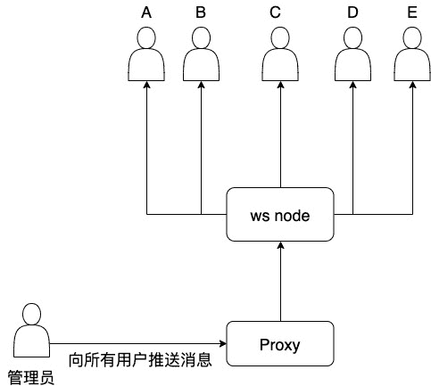
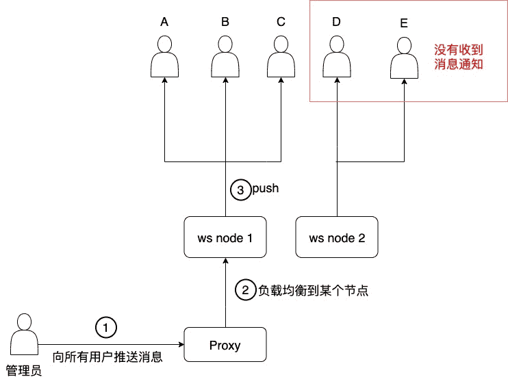
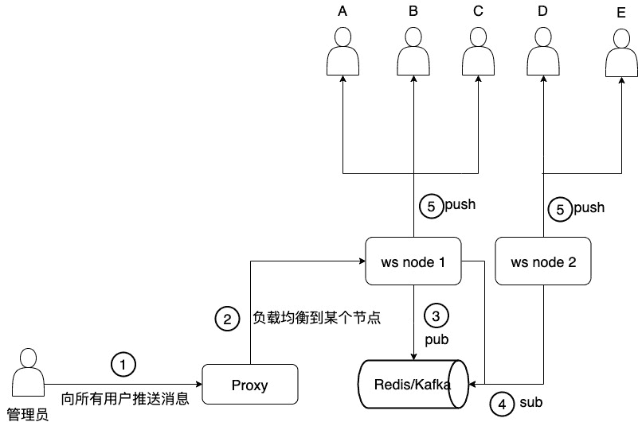
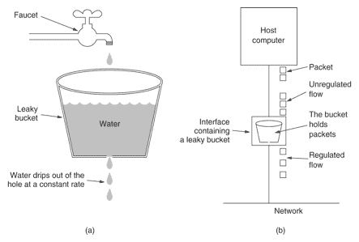
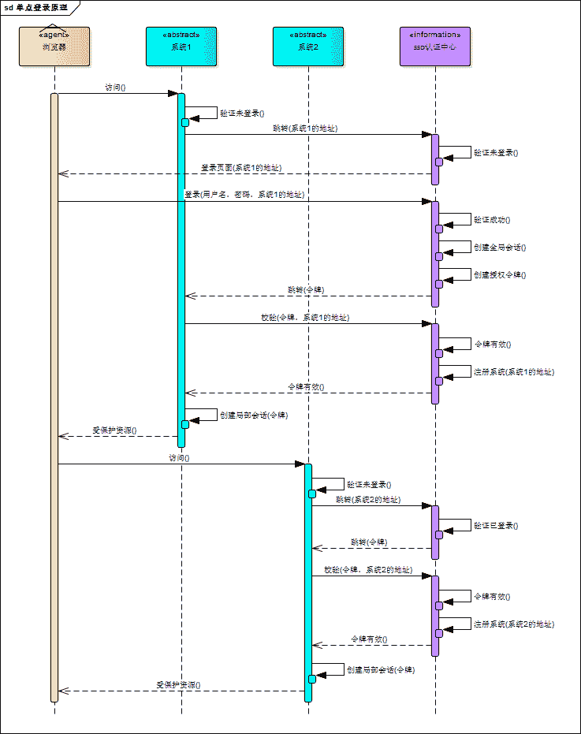

<!--yml
category: 其它
date: 0001-01-01 00:00:00
-->

# 后端基础面试题（山月）

# 生产环境的某个接口报错，如何定位

> 原文：[https://q.shanyue.tech/server/server/6.html](https://q.shanyue.tech/server/server/6.html)

Issue

欢迎在 Gtihub Issue 中回答此问题: [Issue 6(opens new window)](https://github.com/shfshanyue/Daily-Question/issues/6)

Author

回答者: [shfshanyue(opens new window)](https://github.com/shfshanyue)

通常按照以下步骤进行定位

1.  测试环境是否能够复现，若复现在测试环境测试并修复
2.  有没有异常报警系统，如 `sentry`，如果有在 `sentry` 中查看异常堆栈信息以及相关上下文，定位代码
3.  如果堆栈信息不足够找到问题，看有没有链路追踪工具，如 `zipkin`。从 `sentry` 中找到 `requestId/traceId`，通过 `requestId` 结合 `kibana` / `ElasticSearch` 定位相关的数据库日志/上下游服务链路日志
4.  如果以上都不行，查看接口相关代码

既然报错，那么一定会在异常上报系统中找到这条问题进行定位。如果在报警系统中没有定位到问题，可以查看

1.  报警系统是否已限流，致使无法上报
2.  复现异常时，抓包查看报警相关的 API，查看是否已上报

最怕的是那种接口没报错，但是业务方反馈数据有误的问题了，只能开了 debug，进行代码调试了

Author

回答者: [zhangxiaokun(opens new window)](https://github.com/zhangxiaokun)

zipkin sleuth

# 后端的敏感数据在生产环境是如何配置的

> 原文：[https://q.shanyue.tech/server/server/17.html](https://q.shanyue.tech/server/server/17.html)

更多描述

后端的敏感数据在生产环境是如何配置的，如数据库的账号密码，jwt 的 secret，联调上游服务的 token 等

Issue

欢迎在 Gtihub Issue 中回答此问题: [Issue 17(opens new window)](https://github.com/shfshanyue/Daily-Question/issues/17)

Author

回答者: [shfshanyue(opens new window)](https://github.com/shfshanyue)

目前我们的方式是在每次部署之前，在 [vault(opens new window)](https://github.com/hashicorp/vault) 和 [consul(opens new window)](https://github.com/hashicorp/consul) 拉取敏感数据，写在配置文件中

另外，还有几种可选的方案

1.  跟随 `CI/CD` 的环境变量，敏感配置放在 CI 平台
2.  跟随 k8s `secret`/`configMap`，敏感配置放在 k8s 集群
3.  跟随专有的配置服务，如 `consul`/`vault`

# 如何实现一个分布式锁

> 原文：[https://q.shanyue.tech/server/server/21.html](https://q.shanyue.tech/server/server/21.html)

Issue

欢迎在 Gtihub Issue 中回答此问题: [Issue 21(opens new window)](https://github.com/shfshanyue/Daily-Question/issues/21)

Author

回答者: [zhangxiaokun(opens new window)](https://github.com/zhangxiaokun)

mysql,redis,zk redis 效率较高

Author

回答者: [shfshanyue(opens new window)](https://github.com/shfshanyue)

多节点部署就会产生分布式问题，分布式锁由两个词组成，**分布式**和**锁**

1.  分布式: 解决分布式问题就要找一个大家都能够访问到的中介，比如 `Redis`，`Consul`，`Zookeeper`
2.  锁: 解决原子问题，当不存在时便加锁，**不存在** 和 **加锁** 要作为原子进行操作

以下是一个 `redis` 实现的操作

```
# EX 100：100s 的过期时间
# NX: 如果不存在 User:10086，设置成功返回 OK，否则返回 nil，也就是说 100s 之内只有第一次操作返回 OK
set User:10086 Random:shanyue EX 100 NX 
```

# websocket 服务多节点部署时会有什么问题，怎么解决

> 原文：[https://q.shanyue.tech/server/server/24.html](https://q.shanyue.tech/server/server/24.html)

Issue

欢迎在 Gtihub Issue 中回答此问题: [Issue 24(opens new window)](https://github.com/shfshanyue/Daily-Question/issues/24)

Author

回答者: [shfshanyue(opens new window)](https://github.com/shfshanyue)

## 多节点问题

在开始思考分布式会有什么问题时，先来回答一个问题: 服务端如何与客户端交流？

在 ws 服务端，当与客户端连接成功后，会生成一个对象 `connection`，ws 会维护一个与客户端所有连接的 `connections`。如果想要主动推送消息到客户端，只需要调用 API `connection.sendText(message)`。

那如何给所有人广播消息呢？

服务器只需要与它自身的所有连接 `server.connections` 挨个发消息就是广播，所以它只是一个伪广播：我要给群里所有人发消息，但我不能在群里发，只能挨个私发。

### 单节点

当单节点时所有用户都能正常受到通知，流程如下



这时所有用户都能收到消息通知

### 多节点

当多节点时，就会有部分用户无法正常受到通知，从以下流程图中可以很清楚地看到问题所在



**负载到节点 2 的所有用户都没有收到消息通知**

## 如何解决

多节点服务器就会有分布式问题，解决分布式问题就找一个大家都能找到的地，比如说 `Redis`，比如说 `Kafka` 等消息件

改进后流程图如下

1.  需要向所有用户推送消息，请求 websocket 服务
2.  负载均衡到某个节点
3.  该节点向 redis/kafka 推送消息: 向所有用户推送消息通知
4.  所有节点在 redis/kafka 上订阅消息
5.  订阅成功后所有节点向客户端 push 消息



## redis PUBSUB

其中有一个细节是 pub/sub 那里，redis 的 `pubsub` 较 `Kafka` 等消息中间件更为轻便，**最主要的是与 ws 集成的社区方案比较成熟，这点很重要**，如 Node 中的以下两个

*   [graphql subscriptions - redis(opens new window)](https://github.com/davidyaha/graphql-redis-subscriptions)
*   [socket.io-redis(opens new window)](https://github.com/socketio/socket.io-redis)

`pubsub` 在 redis 中的命令如下

*   pub: `publish channel message`
*   sub: `subscribe`

如果我们要订阅 `eat` 这个 `channel` 的话，图示如下


## 进一步追问

面试官见我回答完问题后，又一次追问

**那 websocket 如何向特定的用户组推送消息？**

假如一个学校有以下数据结构

1.  `Class`: 代表班级
2.  `Student`: 代表学生，每个学生都在其中一个班级

那假如要向 `Class:201901` 班级的所有学生发送通知，应该如何实现

欢迎在 Issue 中讨论: [【Q029】websocket 如何向特定用户组推送消息(opens new window)](https://github.com/shfshanyue/Daily-Question/issues/30)

## 小结

借用解决方案的图作为小结


# 如何对接口进行压力测试

> 原文：[https://q.shanyue.tech/server/server/27.html](https://q.shanyue.tech/server/server/27.html)

Issue

欢迎在 Gtihub Issue 中回答此问题: [Issue 27(opens new window)](https://github.com/shfshanyue/Daily-Question/issues/27)

Author

回答者: [shfshanyue(opens new window)](https://github.com/shfshanyue)

```
$ ab

$ wrk

$ siege 
```

Author

回答者: [wanming001(opens new window)](https://github.com/wanming001)

Jmeter

# websocket 如何向特定的用户组推送消息

> 原文：[https://q.shanyue.tech/server/server/30.html](https://q.shanyue.tech/server/server/30.html)

更多描述

假如一个学校有以下数据结构

1.  `Class`: 代表班级
2.  `Student`: 代表学生，每个学生都在其中一个班级

那假如要向 `Class:201901` 班级的所有学生发送通知，应该如何实现

Issue

欢迎在 Gtihub Issue 中回答此问题: [Issue 30(opens new window)](https://github.com/shfshanyue/Daily-Question/issues/30)

Author

回答者: [shfshanyue(opens new window)](https://github.com/shfshanyue)

在 `redis` 处维护一个对象，记录每个 group 所对应的 `connections`/`sockets`

```
{
  'Class:201901': [student1Socket, student2Socket]
} 
```

当 client 刚连入 server 时，便加入某个特定的组，或者叫 room，比如 student01，刚开始连入 server，可能要加入 room：`Student:01`，`Class:201901`，`Group:10086`

# 如何对接口进行限流

> 原文：[https://q.shanyue.tech/server/server/34.html](https://q.shanyue.tech/server/server/34.html)

Issue

欢迎在 Gtihub Issue 中回答此问题: [Issue 34(opens new window)](https://github.com/shfshanyue/Daily-Question/issues/34)

Author

回答者: [shfshanyue(opens new window)](https://github.com/shfshanyue)

一般采用漏桶算法：

1.  漏桶初始为空
2.  API 调用是在往漏桶里注水
3.  漏桶会以一定速率出水
4.  水满时 API 拒绝调用



可以使用 `redis` 的计数器实现

1.  计数器初始为空
2.  API 调用计数器增加
3.  给计数器设置过期时间，隔段时间清零，视为一定速率出水
4.  计数器达到上限时，拒绝调用

当然，这只是大致思路，这时会有两个问题要注意

1.  最坏情况下的限流是额定限流速率的 2 倍
2.  条件竞争问题

不过实际实现时注意以下就好了（话说一般也是调用现成的三方库做限流...)，可以参考我以前的文章 [https://shanyue.tech/post/rate-limit/(opens new window)](https://shanyue.tech/post/rate-limit/)

# 如何设计一个高并发系统

> 原文：[https://q.shanyue.tech/server/server/48.html](https://q.shanyue.tech/server/server/48.html)

Issue

欢迎在 Gtihub Issue 中回答此问题: [Issue 48(opens new window)](https://github.com/shfshanyue/Daily-Question/issues/48)

# 你们后端代码上线部署一次需要多长时间

> 原文：[https://q.shanyue.tech/server/server/102.html](https://q.shanyue.tech/server/server/102.html)

更多描述

关键在于考虑开发人员对项目部署流程的了解

Issue

欢迎在 Gtihub Issue 中回答此问题: [Issue 102(opens new window)](https://github.com/shfshanyue/Daily-Question/issues/102)

Author

回答者: [fmleing(opens new window)](https://github.com/fmleing)

30 分钟左右

Author

回答者: [shfshanyue(opens new window)](https://github.com/shfshanyue)

> 30 分钟左右

那你们部署的流程是什么呢？我觉得半个小时有点多呀

Author

回答者: [fmleing(opens new window)](https://github.com/fmleing)

> > 30 分钟左右
> 
> 那你们部署的流程是什么呢？我觉得半小时有点多呀

估计和 OS 有关，放在测试环境上的是 Linux 比较快，正式环境是 window 就比较慢，使用的是 jekins+tomcat 容器

# 什么是 Basic Auth 和 Digest Auth

> 原文：[https://q.shanyue.tech/server/server/108.html](https://q.shanyue.tech/server/server/108.html)

Issue

欢迎在 Gtihub Issue 中回答此问题: [Issue 108(opens new window)](https://github.com/shfshanyue/Daily-Question/issues/108)

# 权限设计中的 RABC 是指什么

> 原文：[https://q.shanyue.tech/server/server/154.html](https://q.shanyue.tech/server/server/154.html)

Issue

欢迎在 Gtihub Issue 中回答此问题: [Issue 154(opens new window)](https://github.com/shfshanyue/Daily-Question/issues/154)

Author

回答者: [e10101(opens new window)](https://github.com/e10101)

RBAC: Role-Based Access Control?

Author

回答者: [knockkeykey(opens new window)](https://github.com/knockkeykey)

当我们通过角色为某一个用户指定到不同的权限之后，那么该用户就会在 项目中体会到不同权限的功能

# 如何进行代码质量检测

> 原文：[https://q.shanyue.tech/server/server/157.html](https://q.shanyue.tech/server/server/157.html)

Issue

欢迎在 Gtihub Issue 中回答此问题: [Issue 157(opens new window)](https://github.com/shfshanyue/Daily-Question/issues/157)

Author

回答者: [shfshanyue(opens new window)](https://github.com/shfshanyue)

圈复杂度(Cyclomatic complexity)描写了代码的复杂度，可以理解为覆盖代码所有场景所需要的最少测试用例数量。CC 越高，代码则越不好维护

Author

回答者: [Carrie999(opens new window)](https://github.com/Carrie999)

code review

# 如何管理生产环境多个数据库的配置，如何快速连接

> 原文：[https://q.shanyue.tech/server/server/158.html](https://q.shanyue.tech/server/server/158.html)

Issue

欢迎在 Gtihub Issue 中回答此问题: [Issue 158(opens new window)](https://github.com/shfshanyue/Daily-Question/issues/158)

# 当有大量的文本库时，如何做一个字云

> 原文：[https://q.shanyue.tech/server/server/233.html](https://q.shanyue.tech/server/server/233.html)

更多描述

如果对去重的每个字都做计数的话，会不会性能过差

Issue

欢迎在 Gtihub Issue 中回答此问题: [Issue 233(opens new window)](https://github.com/shfshanyue/Daily-Question/issues/233)

# 如何实现单点登录

> 原文：[https://q.shanyue.tech/server/server/262.html](https://q.shanyue.tech/server/server/262.html)

Issue

欢迎在 Gtihub Issue 中回答此问题: [Issue 262(opens new window)](https://github.com/shfshanyue/Daily-Question/issues/262)

Author

回答者: [shfshanyue(opens new window)](https://github.com/shfshanyue)

一张来 [单点登录原理与简单实现(opens new window)](https://images2015.cnblogs.com/blog/797930/201612/797930-20161203152650974-276822362.png) 的图



# 在服务端应用中如何获得客户端 IP

> 原文：[https://q.shanyue.tech/server/server/288.html](https://q.shanyue.tech/server/server/288.html)

Issue

欢迎在 Gtihub Issue 中回答此问题: [Issue 288(opens new window)](https://github.com/shfshanyue/Daily-Question/issues/288)

Author

回答者: [shfshanyue(opens new window)](https://github.com/shfshanyue)

**如果有 `x-forwarded-for` 的请求头，则取其中的第一个 IP，否则取建立连接 socket 的 remoteAddr。**

而 `x-forwarded-for` 基本已成为了基于 proxy 的标准 HTTP 头，格式如下，可见第一个 IP 代表其真实的 IP，可以参考 MDN [X-Forwarded-For(opens new window)](https://developer.mozilla.org/en-US/docs/Web/HTTP/Headers/X-Forwarded-For)

```
X-Forwarded-For: 203.0.113.195, 70.41.3.18, 150.172.238.178
X-Forwarded-For: <client>, <proxy1>, <proxy2> 
```

以下是 `koa` 获取 IP 的方法

```
 get ips() {
    const proxy = this.app.proxy;
    const val = this.get(this.app.proxyIpHeader);
    let ips = proxy && val
      ? val.split(/\s*,\s*/)
      : [];
    if (this.app.maxIpsCount > 0) {
      ips = ips.slice(-this.app.maxIpsCount);
    }
    return ips;
  },

  get ip() {
    if (!this[IP]) {
      this[IP] = this.ips[0] || this.socket.remoteAddress || '';
    }
    return this[IP];
  }, 
```

参见源码: [https://github.com/koajs/koa/blob/master/lib/request.js#L433(opens new window)](https://github.com/koajs/koa/blob/master/lib/request.js#L433)

# 关于 cors 的响应头有哪些

> 原文：[https://q.shanyue.tech/server/server/328.html](https://q.shanyue.tech/server/server/328.html)

Issue

欢迎在 Gtihub Issue 中回答此问题: [Issue 328(opens new window)](https://github.com/shfshanyue/Daily-Question/issues/328)

Author

回答者: [shfshanyue(opens new window)](https://github.com/shfshanyue)

*   `Access-Control-Allow-Origin`
*   `Access-Control-Allow-Methods`
*   `Access-Control-Allow-Headers`
*   `Access-Control-Allow-Credentials`
*   `Access-Control-Expose-Headers`
*   `Access-Control-Max-Age`

关于如何写一个 `cors` 的中间件可以参考 [koajs/cors(opens new window)](https://github.com/koajs/cors)

# 如何实现一个 timeout 的中间件

> 原文：[https://q.shanyue.tech/server/server/353.html](https://q.shanyue.tech/server/server/353.html)

Issue

欢迎在 Gtihub Issue 中回答此问题: [Issue 353(opens new window)](https://github.com/shfshanyue/Daily-Question/issues/353)

# 什么情况下会发送 OPTIONS 请求

> 原文：[https://q.shanyue.tech/server/server/363.html](https://q.shanyue.tech/server/server/363.html)

Issue

欢迎在 Gtihub Issue 中回答此问题: [Issue 363(opens new window)](https://github.com/shfshanyue/Daily-Question/issues/363)

Author

回答者: [nextprops(opens new window)](https://github.com/nextprops)

[搬运地址(opens new window)](https://blog.csdn.net/kahhy/article/details/81563063) 1:请求的方法不是 GET/HEAD/POST 2:POST 请求的 Content-Type 异常 3:请求设置了自定义的 header 字段

Author

回答者: [shfshanyue(opens new window)](https://github.com/shfshanyue)

**当一个请求跨域且不是简单请求时就会发送 `OPTIONS` 请求**

满足以下条件就是一个简单请求:

1.  `Method`: 请求的方法是 `GET`、`POST` 及 `HEAD`
2.  `Header`: 请求头是 `Content-Type`、`Accept-Language`、`Content-Language` 等
3.  `Content-Type`: 请求类型是 `application/x-www-form-urlencoded`、`multipart/form-data` 或 `text/plain`

而在项目中常见的 `Content-Type: application/json` 及 `Authorization: <token>` 为典型的**非简单请求**，在发送请求时往往会带上 `Options`

> 更详细内容请参考 [CORS - MDN(opens new window)](https://developer.mozilla.org/zh-CN/docs/Web/HTTP/Access_control_CORS)

# 如何获取当前系统中的在线用户数 (并发用户数)

> 原文：[https://q.shanyue.tech/server/server/368.html](https://q.shanyue.tech/server/server/368.html)

更多描述

一些 SaaS 系统基于 Pricing 的考虑，会限制团队人数及同时在线数，如何实现

Issue

欢迎在 Gtihub Issue 中回答此问题: [Issue 368(opens new window)](https://github.com/shfshanyue/Daily-Question/issues/368)

Author

回答者: [shfshanyue(opens new window)](https://github.com/shfshanyue)

> 一些 SaaS 系统基于定价策略的考虑，会限制团队人数及同时在线数，如何实现？

通过 `redis` 的 `zset` 可实现并发用户数。

当一个用户请求任何接口时，实现一个 middleware，处理以下逻辑

```
// 当一个用户访问任何接口时，对该用户Id，写入 zset
await redis.zadd(
  `Organization:${organizationId}:concurrent`,
  Date.now(),
  `User:${userId}`
);

// 查询当前机构的并发数
// 通过查询一分钟内的活跃用户来确认并发数，如果超过则抛出特定异常
const activeUsers = await redis.zrangebyscore(
  `Organization:${organizationId}:concurrent`,
  Date.now() - 1000 * 60,
  Date.now()
);

// 查出并发数
const count = activeUsers.length;

// 删掉过期的用户
await redis.zrembyscore(
  `Organization:${organizationId}:concurrent`,
  Date.now() - 1000 * 60,
  Date.now()
); 
```

## 总结

1.  每当用户访问服务时，把该用户的 ID 写入优先级队列，权重为当前时间
2.  根据权重(即时间)计算一分钟内该机构的用户数
3.  删掉一分钟以上过期的用户

# 你们的后端项目的数据库索引做了哪些优化

> 原文：[https://q.shanyue.tech/server/server/384.html](https://q.shanyue.tech/server/server/384.html)

Issue

欢迎在 Gtihub Issue 中回答此问题: [Issue 384(opens new window)](https://github.com/shfshanyue/Daily-Question/issues/384)

# 什么是 oauth2，它解决了什么问题

> 原文：[https://q.shanyue.tech/server/server/404.html](https://q.shanyue.tech/server/server/404.html)

Issue

欢迎在 Gtihub Issue 中回答此问题: [Issue 404(opens new window)](https://github.com/shfshanyue/Daily-Question/issues/404)

# 什么是安全的正则表达式

> 原文：[https://q.shanyue.tech/server/server/430.html](https://q.shanyue.tech/server/server/430.html)

Issue

欢迎在 Gtihub Issue 中回答此问题: [Issue 430(opens new window)](https://github.com/shfshanyue/Daily-Question/issues/430)

Author

回答者: [shfshanyue(opens new window)](https://github.com/shfshanyue)

下边这个正则表达式能把 CPU 跑挂的正则表达式就是一个定时炸弹，回溯次数进入了指数爆炸般的增长。

> 可以参考文章 [浅析 ReDos 原理与实践(opens new window)](https://www.freebuf.com/articles/network/124422.html)

```
const safe = require("safe-regex");
const re = /(x+x+)+y/;

// 能跑死 CPU 的一个正则
re.test("xxxxxxxxxxxxxxxxxxxxxxxxxxxxxxxxxxxxxxxxxxxxx");

// 使用 safe-regex 判断正则是否安全
safe(re); // false 
```

[safe-regex(opens new window)](https://github.com/substack/safe-regex) 能够发现哪些不安全的正则表达式。

# 在 nginx 中如何配置负载均衡

> 原文：[https://q.shanyue.tech/server/server/435.html](https://q.shanyue.tech/server/server/435.html)

Issue

欢迎在 Gtihub Issue 中回答此问题: [Issue 435(opens new window)](https://github.com/shfshanyue/Daily-Question/issues/435)

Author

回答者: [shfshanyue(opens new window)](https://github.com/shfshanyue)

通过 `proxy_pass` 与 `upstream` 即可实现最为简单的负载均衡。如下配置会对流量均匀地导向 `172.168.0.1`，`172.168.0.2` 与 `172.168.0.3` 三个服务器

```
http {
  upstream backend {
      server 172.168.0.1;
      server 172.168.0.2;
      server 172.168.0.3;
  }

  server {
      listen 80;
      location / {
          proxy_pass http://backend;
      }
  }
} 
```

关于负载均衡的策略大致有以下四种种

1.  round_robin，轮询
2.  weighted_round_robin，加权轮询
3.  ip_hash
4.  least_conn

## Round_Robin

轮询，`nginx` 默认的负载均衡策略就是轮询，假设负载三台服务器节点为 A、B、C，则每次流量的负载结果为 ABCABC

## Weighted_Round_Robin

加权轮询，根据关键字 weight 配置权重，如下则平均没来四次请求，会有八次打在 A，会有一次打在 B，一次打在 C

```
upstream backend {
  server 172.168.0.1 weight=8;
  server 172.168.0.2 weight=1;
  server 172.168.0.3 weight=1;
} 
```

## IP_hash

对每次的 IP 地址进行 Hash，进而选择合适的节点，如此，每次用户的流量请求将会打在固定的服务器上，利于缓存，也更利于 AB 测试等。

```
upstream backend {
  server 172.168.0.1;
  server 172.168.0.2;
  server 172.168.0.3;
  ip_hash;
} 
```

## Least Connection

选择连接数最少的服务器节点优先负载

```
upstream backend {
  server 172.168.0.1;
  server 172.168.0.2;
  server 172.168.0.3;
  least_conn;
} 
```

说到最后，**这些负载均衡策略对于应用开发者至关重要，而基础开发者更看重如何实现这些策略**，如这四种负载算法如何实现？请参考以后的文章

# 如何给 graphql 设计合理的 Rate Limit

> 原文：[https://q.shanyue.tech/server/server/439.html](https://q.shanyue.tech/server/server/439.html)

Issue

欢迎在 Gtihub Issue 中回答此问题: [Issue 439(opens new window)](https://github.com/shfshanyue/Daily-Question/issues/439)

Author

回答者: [shfshanyue(opens new window)](https://github.com/shfshanyue)

对于 Rest API 而言可根据特定的 API 来进行*限流(Rate Limit)*设计

然而，GraphQL 只有一个 API，无法根据此来限流，一般情况下根据 `Field` 来进行限流，为了更好地设计及声明限流条件，可自定义 `Directive`，如下所示

```
type Query {
  todos: [Todo!]! @rateLimit(window: "1s", max: 100)
} 
```

可参考以下两个 npm package

*   [graphql-rate-limit(opens new window)](https://github.com/teamplanes/graphql-rate-limit)
*   [graphql-rate-limit-directive(opens new window)](https://github.com/ravangen/graphql-rate-limit)

# 同一进程的线程共享那些资源

> 原文：[https://q.shanyue.tech/server/server/459.html](https://q.shanyue.tech/server/server/459.html)

Issue

欢迎在 Gtihub Issue 中回答此问题: [Issue 459(opens new window)](https://github.com/shfshanyue/Daily-Question/issues/459)

Author

回答者: [shfshanyue(opens new window)](https://github.com/shfshanyue)

*   堆
*   全局变量
*   文件

# 服务器 CPU 过高时如何排查及解决问题

> 原文：[https://q.shanyue.tech/server/server/466.html](https://q.shanyue.tech/server/server/466.html)

Issue

欢迎在 Gtihub Issue 中回答此问题: [Issue 466(opens new window)](https://github.com/shfshanyue/Daily-Question/issues/466)

Author

回答者: [shfshanyue(opens new window)](https://github.com/shfshanyue)

1.  `htop` 查询 CPU 使用率最高的进程
2.  `pidstat` 监控该进程的变化并调试: `pidstat -u -p pid`

# OAuth 2.0 的原理是什么

> 原文：[https://q.shanyue.tech/server/server/496.html](https://q.shanyue.tech/server/server/496.html)

Issue

欢迎在 Gtihub Issue 中回答此问题: [Issue 496(opens new window)](https://github.com/shfshanyue/Daily-Question/issues/496)

# JWT 的原理是什么

> 原文：[https://q.shanyue.tech/server/server/497.html](https://q.shanyue.tech/server/server/497.html)

Issue

欢迎在 Gtihub Issue 中回答此问题: [Issue 497(opens new window)](https://github.com/shfshanyue/Daily-Question/issues/497)

# 什么是认证与授权

> 原文：[https://q.shanyue.tech/server/server/617.html](https://q.shanyue.tech/server/server/617.html)

Issue

欢迎在 Gtihub Issue 中回答此问题: [Issue 617(opens new window)](https://github.com/shfshanyue/Daily-Question/issues/617)

# 判断以下路由，将会响应哪一个路由

> 原文：[https://q.shanyue.tech/server/server/621.html](https://q.shanyue.tech/server/server/621.html)

更多描述

代码见: [多匹配路由 - codesandbox(opens new window)](https://codesandbox.io/s/node-server-duopipeiluyou-lr2l4)

```
const app = new Koa();
const router = new Router();

router.get("/", (ctx, next) => {
  ctx.body = "hello, world";
});

router.get("/api/users/10086", (ctx, next) => {
  console.log(ctx.router);
  ctx.body = {
    userId: 10086,
    direct: true,
  };
});

router.get("/api/users/:userId", (ctx, next) => {
  console.log(ctx.router);
  ctx.body = {
    userId: ctx.params.userId,
  };
});

app.use(router.routes()); 
```

Issue

欢迎在 Gtihub Issue 中回答此问题: [Issue 621(opens new window)](https://github.com/shfshanyue/Daily-Question/issues/621)

Author

回答者: [shfshanyue(opens new window)](https://github.com/shfshanyue)

TODO

# 请简述重新登录 refresh token 的原理

> 原文：[https://q.shanyue.tech/server/server/627.html](https://q.shanyue.tech/server/server/627.html)

Issue

欢迎在 Gtihub Issue 中回答此问题: [Issue 627(opens new window)](https://github.com/shfshanyue/Daily-Question/issues/627)

Author

回答者: [haotie1990(opens new window)](https://github.com/haotie1990)

Refresh Token，将会话管理流程改进如下。

*   客户端使用用户名密码进行认证

*   服务端生成有效时间较短的 Access Token（例如 10 分钟），和有效时间较长的 Refresh Token（例如 7 天）

*   客户端访问需要认证的接口时，携带 Access Token

*   如果 Access Token 没有过期，服务端鉴权后返回给客户端需要的数据

*   如果携带 Access Token 访问需要认证的接口时鉴权失败（例如返回 401 错误），则客户端使用 Refresh Token 向刷新接口申请新的 Access Token

*   如果 Refresh Token 没有过期，服务端向客户端下发新的 Access Token

*   客户端使用新的 Access Token 访问需要认证的接口

Refresh Token 提供了服务端禁用用户 Token 的方式，当用户需要登出或禁用用户时，只需要将服务端的 Refresh Token 禁用或删除，用户就会在 Access Token 过期后，由于无法获取到新的 Access Token 而再也无法访问需要认证的接口。这样的方式虽然会有一定的窗口期（取决于 Access Token 的失效时间），但是结合用户登出时客户端删除 Access Token 的操作，基本上可以适应常规情况下对用户认证鉴权的精度要求。

Author

回答者: [shfshanyue(opens new window)](https://github.com/shfshanyue)

TODO