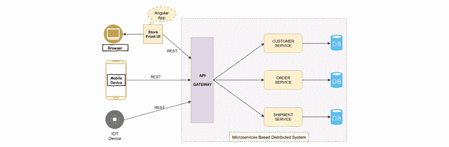
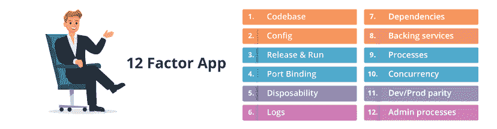
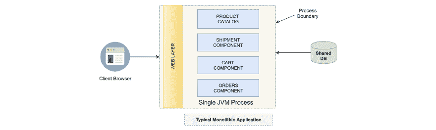

<!--yml
category: 微服务
date: 2022-11-19 13:22:02
-->

# 微服务面试指南一（zthinker）

> 来源：[https://zthinker.com/archives/microservice-interview-1](https://zthinker.com/archives/microservice-interview-1)

1.  [Java内存管理面试指南一](https://zthinker.com/archives/java-memory-interview-1)
2.  [Java基础面试指南一](https://zthinker.com/archives/java-basic-interview-1)
3.  [Java基础面试指南二](https://zthinker.com/archives/java-basic-interview-2)
4.  [Java基础面试指南三](https://zthinker.com/archives/java-basic-interview-3)
5.  [Java基础面试指南四](https://zthinker.com/archives/java-basic-interview-4)
6.  [Java线程面试指南一](https://zthinker.com/archives/java-thread-interview-1)
7.  [Java线程面试指南二](https://zthinker.com/archives/java-thread-interview-2)
8.  [Redis面试指南一](https://zthinker.com/archives/redis-interview-1)
9.  [Kafka面试指南一](https://zthinker.com/archives/kafka-interview-1)
10.  [Spring面试指南一](https://zthinker.com/archives/spring-interview-1)
11.  [SpringBoot面试指南一](https://zthinker.com/archives/springboot-interview-1)
12.  [微服务面试指南一](https://zthinker.com/archives/microservice-interview-1)

微服务是一种架构样式,其结构和应用程序是围绕业务功能组织的松散耦合,可独立维护,可测试和可部署的服务的集合.  

如果您以业务为中心,并且想要在没有技术限制的情况下有效地解决用例或问题,想要无限扩展独立的服务,易于维护和管理以及可独立测试的高可用性无状态服务,那么我们将继续实施微服务架构.

**有两种情况. **

*   如果您已经拥有一个整体应用程序,并且该应用程序的增长到一定程度,在扩展方面存在问题,或者我们无法跨不同项目/平台重新利用组件/模块/服务,则需要这样做. 同时实现新功能是痛苦的,而且更容易出错,并且很难进一步扩展.
*   对于尚未开始实施的新应用程序,我们可以考虑一个有效实施的业务案例,该业务案例将来可以轻松维护,测试和扩展,并且可以同时用于其他项目/产品/平台. .

应该进行单元测试和集成测试,以测试微服务的所有功能. 还应该进行基于组件的测试.

人们应该通过合同测试来断言客户的期望没有打破. 但是,微服务的端到端测试应该仅测试关键流程,因为这些流程很耗时. 测试可以从两个方面进行,消费者驱动的合同测试和消费者方的合同测试.

您还可以利用命令查询职责隔离来查询多个数据库并获得持久数据的组合视图.

在将docker映像动态部署在任何计算机或IP +端口组合上的云环境中,相关服务在运行时很难更新. 仅出于此目的而创建服务发现.

服务发现是在微服务架构下运行的服务之一,它注册在服务网格下运行的所有服务的条目. 所有操作都可以通过REST API获得. 因此,每当服务启动并运行时,各个服务便会向服务发现服务进行注册,并且服务发现服务会保持心跳,以确保这些服务处于活动状态. 这也用于监视服务的目的. 服务发现还有助于在以公平方式部署的服务之间分配请求.

在这种体系结构模式中,客户端不是连接到负载平衡器,而是直接连接到服务注册表并尝试从中获取数据或服务.

一旦获得所有数据,它就会自行进行负载平衡,并直接与需要与之通信的服务联系.

在存在多个代理层并且由于多层通信而发生延迟的情况下,这可能会有好处.

在服务器端发现中,代理层或API网关稍后会尝试连接到服务注册表,然后再调用适当的服务. 客户端在此处连接到该代理层或API网关层.

假设大多数提供商都使用微服务架构,

*   可以通过启动更多容器来增加服务实例的数量来扩展系统.
*   也可以将其应用于微服务层的缓存,因为微服务将是事实的唯一来源,因此缓存的失效可以非常容易地实现,因此可以轻松管理.
*   也可以在API网关层引入缓存,在其中可以定义缓存规则,例如何时使缓存无效.
*   当需求较少时,也可以关闭一些容器. 也就是说,按比例缩小.

微服务架构是一种开发由许多小型自治服务组成的可伸缩,分布式和高度自动化系统的样式. 它不是一项技术,而是SOA衍生出的一种新趋势.

没有单一定义可以完全描述术语“微服务”. 一些著名的作者试图通过以下方式对其进行定义:

1.  微服务是可以协同工作的小型自治服务.
2.  带有边界上下文的松散耦合的面向服务的体系结构.
3.  微服务架构是在架构级别应用单责任原则的自然结果.



**_微服务是SOA的延续. _**

SOA由于其分布式体系结构方法而开始获得发展,并在2006年左右出现,以解决大型单片应用程序的问题.

这些架构(SOA和微服务)都具有一个共同点,即它们都是分布式架构,并且都具有很高的可伸缩性. 在这两种服务中,服务组件都是通过远程访问协议(RMI,REST,SOAP,AMQP,JMS等)进行远程访问的. 两者都是模块化的,通过设计可以松散地耦合在一起,并具有很高的可扩展性. 在轻量级容器,Docker,编排框架(Kubernetes,Mesos)出现之后,微服务在2000年底开始引起关注. 微服务在概念上与SOA有很大的不同-

1.  SOA使用企业服务总线进行通信,而微服务使用REST或其他不太复杂的消息传递系统(AMQP等). 同样,微服务遵循“智能端点和哑点”,这意味着当微服务需要另一个作为依赖时,它应直接使用它,而无需任何路由逻辑/组件来处理管道.
2.  在微服务中,服务部署和管理应该是完全自动化的,而SOA服务通常是在部署整体中实现的.
3.  通常,微服务比SOA趋向要小得多. 这里我们不在这里讨论代码库,因为很少有语言比其他语言更冗长. 我们正在谈论服务本身的范围(问题域). 微服务通常以更好的方式做一件事.
4.  微服务应拥有自己的数据,而SOA可以共享一个公共数据库. 因此,一个微服务不应允许另一个微服务直接更改/读取其数据.
5.  经典SOA更加受平台驱动,而在微服务方面,我们具有很多技术独立性. 每个微服务都可以根据其自身的功能要求拥有自己的技术堆栈. 因此,微服务在各个维度上提供了更多选择.
6.  微服务对外部环境的假设尽可能少. 微服务应管理自己的功能域和数据模型.

有界上下文是域驱动设计中的中心模式. 在有界上下文中,与域相关的所有内容在内部上下文中都是可见的,但对其他有界上下文是不透明的. DDD通过将大型模型划分为不同的有界上下文并明确说明它们之间的相互关系来处理它们.

_整体概念模型问题 _

整个组织的单一概念模型很难处理. 这种统一模型的唯一好处是,在整个企业范围内集成都很容易,但是缺点很多,例如:

1.  首先,很难建立一个适用于整个组织的模型.
2.  其他人(团队)很难理解它.
3.  更改这种共享模型以适应新的业务需求非常困难. 这种变化的影响将在团队之间广泛传播.
4.  任何大型企业都需要一个非常大或抽象的模型.
5.  单个词的含义在组织的不同部门中可能有所不同,因此可能很难提出一个统一的模型. 即使创建了这样的模型,也会在团队中引起很多混乱.

1.  **高凝聚力** -小,专注于做好一件事. 小并不意味着更少的代码行,因为很少有编程语言比其他语言更冗长,但这意味着单个微服务所能满足的最小功能范围.
2.  **松散耦合** -自主-能够独立部署不同服务的能力以及可靠性,这是因为即使另一个服务出现故障,该服务也可以运行.
3.  **限界上下文** -一个微服务供应域中的界上下文. 通过使用该有界上下文的接口,它与域的其余部分进行通信.
4.  围绕业务能力而非技术进行组织.
5.  持续交付和基础设施自动化.
6.  向后兼容的版本控制. 生产环境中甚至可以存在相同微服务的多个版本.
7.  **容错** -如果一项服务失败,它将不会影响系统的其余部分. 例如,如果为电子商务提供评论和评论的微服务失败,则网站的其余部分应运行良好.
8.  分散式数据管理,每个服务拥有其数据库,而不是单个共享数据库. 每个微服务都可以自由选择适合其业务用例的数据库类型(例如,RDBMS用于订单管理,NoSql用于电子商务网站的目录管理)
9.  **最终一致性** -事件驱动的异步更新.
10.  **安全性** -每个微服务都应具有保护其自身资源免受未经授权访问的能力. 这是通过使用无状态安全性机制(例如带有OAuth2的JSON Web令牌(JWT,发音为jot))实现的.

与在应用程序中使用整体式体系结构相比,采用微服务体系结构可带来许多好处,包括:

在单个微服务上工作的分散团队大多彼此独立,因此更改服务不需要与其他团队协调. 这可以导致明显更快的释放周期. 在现实的单片应用程序中,很难实现相同的目标,因为微小的变化可能需要整个系统的回归.

系统架构的微服务风格强调自由文化,单一责任,团队自治,更快的发布迭代和技术多样化.

与单片应用程序不同,微服务没有绑定到一个技术堆栈(Java,.Net,Go,Erlang,Python等). 每个团队都可以自由选择最适合其要求的技术堆栈. 例如,我们可以自由地为微服务选择Java,为其他服务选择c ++,为另一个服务选择Go.

该术语来自“开发”和“运营”的缩写. 这种文化强调产品管理,软件开发和运营团队之间的有效沟通与协作. 如果正确实施DevOps文化,可以缩短开发周期,从而加快产品上市时间.

多语言持久性是关于在单个分布式系统中使用不同的数据库来满足不同的业务需求. 我们在市场上已经有不同的数据库产品,每种产品都可以满足特定的业务需求,例如: 

关系数据库用于满足交易需求(存储财务数据,报告要求等) 

面向文档的数据库用于满足面向文档的需求(例如,产品目录). 文档是无架构的,因此架构中的更改可以轻松容纳到应用程序中.

*   **Cassandra / Amazon DynamoDB**

基于键值对的数据库(用户活动跟踪,分析等). DynamoDB可以存储文档以及键值对.

在内存分布式数据库(用户会话跟踪)中,其主要用作多个微服务之间的分布式缓存.

图表数据库(社交关系,建议等) 

_Polyglot Persistence的 _好处是多方面的,可以在整体以及微服务架构中获得. 任何体面大小的产品都会有各种各样的需求,仅凭一种数据库就无法满足. 例如,如果对特定的微服务没有事务需求,那么使用键值对或面向文档的NoSql比使用事务性RDBMS数据库更好.  

*参考:*[https](https://martinfowler.com/bliki/PolyglotPersistence.html) *:* [//martinfowler.com/bliki/PolyglotPersistence.html](https://martinfowler.com/bliki/PolyglotPersistence.html)

十二要素应用程序是一种用于编写作为服务运行的Web应用程序的最新方法(和/或宣言).



一个代码库,多个部署. 这意味着我们仅应为不同版本的微服务使用一个代码库. 分支可以,但不同的存储库则不行.

明确声明并隔离依赖项. 声明建议不要依赖主机上的软件或库. 每个依赖项都应放入pom.xml或build.gradle文件中.  

将配置存储在环境中. 不要在源代码存储库中提交特定于环境的配置(最重要的是:密码). Spring Cloud Config为分布式系统中的外部化配置提供服务器和客户端支持. 使用Spring Cloud Config Server,您可以集中管理所有环境中应用程序的外部属性.  

将支持服务视为附加资源. 无论您是管理外部服务还是其他团队,微服务都应平等对待外部服务. 例如,即使从属微服务是由您自己的团队开发的,也不要在您的应用程序代码中硬编码从属服务的绝对URL. 例如,不要在RestTemplate中对其他服务的URL进行硬编码,而使用Ribbon(带有或不带有Eureka)来定义URL: 

严格分开构建和运行阶段. 换句话说,您应该能够构建或编译代码,然后将其与特定的配置信息结合起来以创建特定的发行版,然后有意地运行该发行版. 在运行时更改代码应该是不可能的,例如,直接在tomcat中更改类文件. 每个版本的发行版都应该始终有一个唯一的ID,主要是时间戳记. 发布信息应该是不变的,任何更改都应导致新的发布.  

将应用程序作为一个或多个无状态进程执行. 这意味着我们的微服务本质上应该是无状态的,并且不应依赖于内存或文件系统中存在的任何状态. 实际上,状态不属于代码. 因此,没有粘性会话,没有内存中的缓存,没有本地文件系统的存储等. 应该使用分布式缓存(如memcache,ehcache或Redis)代替

通过端口绑定导出服务. 这是关于使您的应用程序独立运行,而不是依赖您要在其中部署的应用程序服务器的运行实例. Spring Boot提供了一种机制,可以创建一个包含所有依赖项和嵌入式servlet容器(jetty或tomcat)的可自我执行的uber jar.  

通过过程模型进行横向扩展. 在十二要素应用程序中,流程是一等公民. 这并不排除各个进程通过运行时VM内的线程或在诸如EventMachine,Twisted或Node.js之类的工具中找到的异步/事件模型来处理其自身的内部多路复用. 但是单个VM只能增长得如此之大(垂直规模),因此应用程序还必须能够跨越多个物理机上运行的多个进程. 十二因子应用程序进程绝不应写入PID文件,而应依赖于操作系统进程管理器,例如systemd-云平台上的分布式进程管理器.  

十二要素应用程序的过程是一次性的,这意味着它们可以立即启动或停止. 这有利于快速弹性扩展,代码或配置更改的快速部署以及生产部署的稳定性. 流程应努力减少启动时间. 理想情况下,从启动命令执行到启动并准备好接收请求或作业的过程需要花费几秒钟的时间. 较短的启动时间为发布过程和扩展提供了更大的灵活性;并且它有助于增强鲁棒性,因为在需要时,流程管理器可以更轻松地将流程移至新的物理机.  

保持开发,暂存和生产尽可能相似. 您的开发环境应该几乎与生产环境相同(例如,避免某些“在我的机器上工作”的问题). 但是,这并不意味着您的操作系统必须是在生产环境中运行的操作系统. Docker可用于为您的微服务创建逻辑隔离.  

将日志视为事件流,仅将所有日志发送到stdout. 但是,大多数Java开发人员不同意这个建议.  

一次性运行管理/管理任务. 例如,应该完全使用单独的过程来运行数据库迁移.

1.  由于生产系统中大量流程的激增,DevOps是必须的. 如何启动和停止服务团队?
2.  分布式计算的复杂性,例如“网络延迟,容错,消息序列化,不可靠的网络,异步o / p处理,应用程序层中不同的负载,分布式事务等”.
3.  如何以最小的努力在大型服务群中进行配置更改?
4.  如何部署单个微服务的多个版本并适当地路由调用?
5.  当微服务开始意外崩溃时,如何断开其与生态系统的连接?
6.  如何隔离发生故障的微服务并避免整个生态系统中的级联故障?
7.  考虑到服务在任何时间点都可能上升或下降,如何以弹性方式发现服务?
8.  如何汇总服务中的日志/指标?如何识别跨微服务范围的单个客户端请求的不同步骤?

微服务体系结构旨在开发可安全扩展的大型分布式系统. 微服务架构相对于整体而言有很多好处,例如:

1.  单体应用是作为一个整体构建的,它通常由3个组件组成–数据库(通常是RDBMS),服务器端可执行文件(部署在tomcat,websphere等中的war文件)和客户端接口(JSP等).
2.  每当我们要添加/更新功能时,开发人员都需要更改这三个组件中的至少一个并将新版本部署到生产中. 整个系统紧密耦合,在选择技术堆栈方面有局限性,凝聚力低.  
3.  当我们需要缩放整体时,可以通过一次又一次地复制大war / ear文件,在多台机器上部署相同版本的整体. 一切都包含在一个可执行文件中.
4.  另一方面,微服务架构由小型的自治服务组成,这些服务由业务功能划分,业务功能主要通过异步方式在网络上相互通信.  


如上面的示例所示,典型的整体eShop应用程序通常是部署在单个JVM进程(tomcat / jboss / websphere等)中的大型war文件. 整体中的不同组件使用进程内通信(例如直接方法调用)相互通信. 一个或多个数据库在整体应用程序的不同组件之间共享.

微服务应该是自主的,并应根据业务功能进行划分. 每个软件组件都应具有单一的明确定义的职责(又称“单一职责原则”),并且应使用“受限上下文”的原则(由“域驱动设计”定义)来创建具有高度凝聚力的软件组件.  

例如,一个电子商务站点可以根据其业务功能分为以下微服务:

负责产品信息,搜索产品,过滤产品和产品方面.

负责管理产品库存(库存/数量和方面).  

收集用户对产品的反馈.

负责创建和管理订单.

在线和离线处理付款(货到付款).

根据订单管理和跟踪货运.

管理用户及其偏好.

根据用户的偏好或过去的购买来推荐新产品.

有关订单,付款和装运的电子邮件和SMS通知.

客户端应用程序(浏览器,移动应用程序)将通过API网关与这些服务进行交互,并将相关信息呈现给用户.

如果要在引导过程中无法找到配置服务器时停止该服务,则需要在微服务的bootstrap.yml中配置以下属性: 

```
spring:
      cloud:
         config:
             fail-fast: true 
```

当引导过程中无法访问config-server时,使用此配置将使微服务启动失败并发生异常.

我们可以启用重试机制,其中微服务将在抛出异常之前重试6次. 我们只需要在类路径中添加spring-retry和spring-boot-starter-aop即可启用此功能.  

build.gradle:- 

```
dependencies {
   compile('org.springframework.boot:spring-boot-starter-aop')
   compile('org.springframework.retry:spring-retry')
   ...
} 
```

良好的经验法则(尽管非特定性)应尽可能小,但应尽可能大,以代表他们拥有的领域概念(由马丁·福勒(Martin Fowler)说)

规模不应成为微服务中的决定因素,而应使用有限上下文原则和单一责任原则将业务能力隔离到单个微服务边界中.

微服务通常很小,但并非所有的小服务都是微服务. 如果任何服务未遵循“绑定上下文原则”,“单一职责原则”等,则它不是微服务,无论其大小如何. 因此,规模并不是服务成为微服务的唯一资格标准.

实际上,微服务的大小在很大程度上取决于您选择的语言(Java,Scala,PHP),因为很少有语言比其他语言更冗长.

微服务通常使用诸如HTTP上的REST之类的简单协议进行集成. 其他通信协议也可以用于集成,例如AMQP,JMS,Kafka等.

通信协议可以大致分为两类:同步通信和异步通信.

RestTemplate,WebClient,FeignClient可用于两个微服务之间的同步通信. 理想情况下,我们应该最小化微服务之间的同步调用数量,因为网络很脆弱并且会引入延迟. 功能区-客户端负载平衡器可用于在RestTemplate顶部更好地利用资源. Hystrix断路器可用于优雅地处理部分故障,而不会对整个生态系统造成连锁影响. 应该不惜一切代价避免分布式提交,相反,我们将选择使用异步通信实现最终的一致性.

在这种类型的通信中,客户端不等待响应,而是仅将消息发送到消息代理. AMQP(如RabbitMQ)或Kafka可用于跨微服务的异步通信,以实现最终的一致性.

1.  您必须使用一些可靠的队列机制(RabbitMQ,AMQP等)在处理HTTP POST / PUT(任何修改数据的)请求时使用异步通信.  
2.  可以在API网关级别将同步通信用于聚合模式. 但是,此聚合除聚合外不应包含任何业务逻辑. 不得在网关上转换数据值,否则,它将无法达到“受限上下文”的目的. 在异步通信中,事件应发布到队列中. 事件包含有关域的数据,它不应该告诉对此数据做什么(操作).  
3.  如果微服务到微服务的通信仍然需要GET操作进行同步通信,那么请认真考虑为有限的上下文重新划分微服务,并在积压/技术债务中创建一些任务.

在业务流程中,我们依靠中央系统以某种方式控制和调用其他微服务来完成给定的任务. 中央系统维护整个工作流程的每个步骤和顺序的状态. 在编排中,每个微服务都像状态机一样工作,并根据其他部分的输入做出反应. 每个服务都知道如何对来自其他系统的不同事件做出反应. 在这种情况下,没有中央命令.

业务流程是紧密耦合的方法,并且是微服务体系结构中的反模式. 鉴于此,应尽可能采用编排的松散耦合方法.

***例***

假设我们要开发一种微服务,该服务将在虚拟的电子商店中发送产品推荐电子邮件. 为了发送建议,我们需要访问位于不同微服务中的用户的订单历史记录.  

在编排方法中,此新的建议微服务将同步调用订购服务并获取相关数据,然后根据其过去的购买量来计算建议. 为一百万用户执行此操作将变得很麻烦,并将两个微服务紧密结合在一起.  

在编排方法中,我们将使用基于事件的异步通信,每当用户进行购买时,订单服务都会发布事件. 推荐服务将监听此事件并开始建立用户推荐. 这是一种松散耦合的方法,具有高度的可扩展性. 在这种情况下,事件并不能说明操作,而只能说明数据.

这个问题没有正确的答案,可能每十分钟,每小时或每周发布一次. 这完全取决于您在软件开发生命周期的不同级别上的自动化程度-构建自动化,测试自动化,部署自动化和监视. 当然还有业务需求-在一次发布中,您关心的低风险变化有多小.

在一个理想的世界中,每个微服务的边界都明确定义(有界上下文),并且给定的服务不会影响其他微服务,您可以轻松地一天完成多次部署而不会造成很大的复杂性.

**部署/发布频率示例**

1.  据记录,亚马逊在2011年5月平均每11.6秒进行一次生产更改.
2.  Github以其积极的工程实践而闻名,平均每天将代码部署到生产中60次.
3.  Facebook每天发布两次.
4.  许多Google服务每周都会发布多个版本,而Google中的几乎所有内容都是在主线上开发的.
5.  Etsy每天部署超过50次.

云原生应用程序(NCA)是一种应用程序开发样式,鼓励在连续交付和分布式软件开发领域轻松采用最佳实践. 这些应用程序是专门为云计算体系结构(AWS,Azure,CloudFoundary等)设计的.

DevOps,持续交付,微服务和容器是开发云原生应用程序的关键概念.

Spring Boot,Spring Cloud,Docker,Jenkins,Git是一些工具,可以帮助您轻松编写Cloud-Native Application.

这是一种将分布式系统开发为小服务集合的体系结构方法. 每个服务负责特定的业务功能,在其自己的流程中运行,并通过HTTP REST API或消息传递(AMQP)进行通信.

它是软件开发人员与IT运营部门之间的合作,其目标是根据客户的需求不断提供高质量的软件.

所有这些都涉及不断不断地自动交付低风险的小批量生产变更. 这样可以更快地收集反馈.

容器(例如Docker)为每个微服务提供逻辑隔离,从而永远消除了“在我的机器上运行”的问题. 与虚拟机相比,它更快,更高效.

Spring Boot和Spring Cloud是开始使用Java语言构建微服务的一个很好的选择. Spring Cloud中有很多模块可以为微服务的不同设计模式提供样板代码,因此Spring Cloud确实可以加快开发过程. 此外,Spring Boot提供了开箱即用的支持,可将servlet容器(tomcat / jetty / undertow)嵌入可执行jar(超级jar)中,以便可以直接从命令行运行这些jar,从而无需部署war文件放入Servlet容器.  

您还可以使用Docker容器将整个可执行程序包运送并部署到云环境中. Docker还可以通过在开发阶段为运行时环境提供逻辑隔离来帮助消除“在我的机器上工作”的问题. 这样,您就可以跨本地和云环境获得可移植性.

Spring Boot使得创建独立的,基于生产级别的基于Spring的应用程序变得容易,您可以通过对Spring平台和第三方库的独到见解来“运行”这些应用程序,以便您大惊小怪.  

Spring Boot的主要功能 

1.  创建独立的Spring应用程序(12要素应用程序样式) 
2.  直接嵌入Tomcat,Jetty或Undertow(无需部署WAR文件) 
3.  提供可靠的入门POM,以简化您的Maven或Gradle配置 
4.  尽可能自动配置Spring 
5.  提供可用于生产的功能,例如指标,运行状况检查和外部化配置 
6.  完全没有代码生成,也不需要XML配置 

您可以使用托管在[https://start.spring.io/的在线工具为项目选择所需的依赖项来创建Spring](https://start.spring.io/%E7%9A%84%E5%9C%A8%E7%BA%BF%E5%B7%A5%E5%85%B7%E4%B8%BA%E9%A1%B9%E7%9B%AE%E9%80%89%E6%8B%A9%E6%89%80%E9%9C%80%E7%9A%84%E4%BE%9D%E8%B5%96%E9%A1%B9%E6%9D%A5%E5%88%9B%E5%BB%BASpring) Boot入门项目.  

任何Spring Boot应用程序的最小最小依赖关系是: 

```
 dependencies {
        compile("org.springframework.boot:spring-boot-starter-web:2.0.4.RELEASE")
}

import org.springframework.boot.*;
import org.springframework.boot.autoconfigure.*;
import org.springframework.stereotype.*;
import org.springframework.web.bind.annotation.*;

@Controller
@EnableAutoConfiguration
public class HelloWorldController {
    @RequestMapping("/")
    @ResponseBody
    String home() {
        return "Hello World!";
    }

    public static void main(String[] args) throws Exception {
        SpringApplication.run(SampleController.class, args);
    }
} 
```

您可以直接运行此类,而无需将其部署到servlet容器中.  

_有用的参考 _

*   Spring Boot Project
*   Spring Boot Starter
*   使用Spring Boot构建应用程序

API网关是一类特殊的微服务,可满足单个客户端应用程序(例如android应用程序,Web应用程序,Angular JS应用程序,iPhone应用程序等)的需求,并为其提供后端资源(微服务)的单个入口,向他们提供跨领域的关注,例如安全性,监视/指标和弹性.  

客户端应用程序可以与每个请求同时访问数十个或数百个微服务,汇总响应并将其转换为满足客户端应用程序的需求. Api Gateway可以使用客户端负载平衡器库(Ribbon)以循环方式在实例之间分配负载. 如果需要,它也可以进行协议转换,即HTTP到AMQP. 它也可以处理受保护资源的安全性.

API网关的功能

1.  Spring Cloud DiscoveryClient集成
2.  请求速率限制(在Spring Boot 2.x中可用)
3.  路径改写
4.  Hystrix断路器集成,具有弹性

顾名思义,零停机时间部署不会在生产环境中造成停机. 这是将更改部署到生产的一种聪明方法,在任何给定时间点,至少有一项服务将对客户可用.

实现此目标的一种方法是蓝色/绿色部署. 在这种方法中,一次部署了一个微服务的两个版本. 但是只有一个版本正在接受真正的请求. 一旦将新版本测试到所需的满意度,就可以从旧版本切换到新版本.

您可以运行冒烟测试套件,以验证该功能在新部署的版本中是否正常运行. 根据冒烟测试的结果,可以发布较新的版本,成为实时版本.

假设您有两个同时运行的服务实例,并且两个实例都在Eureka注册表中注册. 此外,两个实例都使用两个不同的主机名进行部署: 

```
/src/main/resources/application.yml 
  spring.application.name: ticketBooks-service
  ---
  spring.profiles: blue
  eureka.instance.hostname: ticketBooks-service -blue.example.com
  ---
  spring.profiles: green 
```

现在需要对books-service进行api调用的客户端应用程序可能如下所示: 

```
@RestController
@SpringBootApplication
@EnableDiscoveryClient
public class ClientApp {
    @Bean
    @LoadBalanced
    public RestTemplate restTemplate() {
        return new RestTemplate();
    }

    @RequestMapping("/hit-some-api")
    public Object hitSomeApi() {
        return restTemplate().getForObject("https://ticketBooks-service/some-uri", Object.class);
    }
} 
```

现在,当ticketBooks-service-green.example.com停止升级时,它会正常关闭并从Eureka注册表中删除其条目. 但是,直到再次获取注册表(每30秒发生一次),这些更改才会反映在ClientApp中. 因此,长达30秒,ClientApp的@LoadBalanced RestTemplate可能会将请求发送到ticketBooks-service-green.example.com,即使它失败了.  

为了解决这个问题,我们可以在Ribbon客户端负载均衡器中使用Spring Retry支持. 要启用Spring Retry,我们需要执行以下步骤: 

_添加spring-retry到build.gradle依赖项 _

```
compile("org.springframework.boot:spring-boot-starter-aop")
compile("org.springframework.retry:spring-retry") 
```

现在,使用@EnableRetry批注在ClientApp中启用spring-retry机制,如下所示: 

```
 @EnableRetry
@RestController
@SpringBootApplication
@EnableDiscoveryClient
public class ClientApp { 
... 
} 
```

完成此操作后,Ribbon将自动将其自身配置为使用重试逻辑,Ribbon将重试对ticketBooks-service-green.example.com com的任何失败请求(以循环方式). 您可以使用以下属性来自定义此行为: 

```
/src/main/resources/application.yml 
ribbon:
	MaxAutoRetries: 5 
	MaxAutoRetriesNextServer: 5 
	OkToRetryOnAllOperations: true
	OkToRetryOnAllErrors: true 
```

当升级期间数据库发生更改时,部署方案将变得复杂. 有两种不同的方案:1.数据库更改是向后兼容的(例如,添加新的表列)2.数据库更改与应用程序的旧版本不兼容(例如,重命名现有的表列) 

1.  **向后兼容更改**:此方案易于实现,并且可以使用Flyway完全自动化. 我们可以添加脚本以创建新列,并且脚本将在部署时执行. 现在,在蓝/绿部署期间,该应用程序的两个版本(例如v1和v2)将连接到同一数据库. 我们需要确保新添加的列允许空值(顺便说一下,这是向后兼容更改的一部分). 如果一切顺利,那么我们可以关闭旧版本v1,否则可以关闭应用程序v2\.  
2.  **不兼容的数据库更改**:这是一个棘手的情况,在回滚的情况下可能需要手动干预. 假设我们要在数据库中将first_name列重命名为fname. 除了直接重命名,我们还可以创建一个新列fname,并将first_name的所有现有值复制到fname列中,并保持first_name列在数据库中的状态. 我们可以将对fname的非null检查推迟到部署后的成功. 如果部署成功,我们需要在关闭v1之后手动将v1写入first_name的数据迁移到新列(fname). 如果v2部署失败,则需要执行其他操作.  

在实际的生产应用程序中,复杂性可能更大,此类讨论超出了本书的范围.

ACID是数据库事务管理器确保的四个主要属性(原子性,一致性,隔离性和持久性)的首字母缩写.  

在涉及两个或多个实体的事务中,所有记录都已提交,也没有提交.  

数据库事务必须仅遵循包括约束/触发等的特定规则,以允许的方式更改受影响的数据.  

任何进行中的事务(尚未提交)必须与其他任何事务保持隔离.  

提交的记录由数据库保存,这样即使发生故障或数据库重新启动,数据也可以以正确的状态使用.  

在涉及多个数据库的分布式系统中,我们有两种选择来实现ACID遵从性: 

1.  实现ACID遵从性的一种方法是使用两阶段提交(也称为2PC),以确保所有涉及的服务必须提交事务完成或所有事务回滚.
2.  使用最终的一致性,其中不同的微服务拥有的多个数据库最终会通过使用消息传递协议的异步消息传递而变得一致. 最终一致性是弱一致性的一种特定形式.  

理想的情况下,由于微服务架构的脆弱性和复杂性,不建议使用2期提交. 通过最终的一致性,我们可以在分布式系统中达到某种程度的ACID合规性,这应该是正确的方法.

Spring团队整合了一些经过考验的开源项目,这些项目从Pivotal,Netflix等公司整合到一个称为Spring Cloud的Spring项目中. Spring Cloud提供了用于快速构建分布式系统的一些常见设计模式的库和工具,包括:

| 模式类型 | 模式名称 | Spring Cloud Library |
| --- | --- | --- |
| 配置模式 | 分布式/版本化配置管理 | Spring Cloud Config服务器 |
| - | 核心微服务模式 | Spring Boot |
| - | 异步/分布式消息传递 | Spring Cloud Stream (AMQP and Kafka) |
| - | 服务间通信 | RestTemplate和Spring Cloud Feign |
| 路由模式 | 服务注册与发现 | Spring Cloud Netflix Eureka和领事 |
| 路由模式 | 服务路由/ API网关模式 | Spring Cloud Netflix Zuul |
| 弹性模式 | 客户端负载均衡 | Spring Cloud Netflix功能区 |
| - | 断路器和后备模式 | Spring Cloud Netflix Hystrix |
| - | Bulkhead pattern | Spring Cloud / Spring Cloud Netflix Hystrix |
| Logging Patterns | Log Correlation | Spring Cloud Sleuth |
| - | 微服务跟踪 | Spring Cloud Sleuth / Zipkin |
| 安全模式 | 授权与认证 | Spring Cloud Security OAuth2 |
| - | 凭证管理 | Spring Cloud Security OAuth2 / JWT |
| - | 分布式会话 | Spring Cloud OAuth2和Redis |

Spring Cloud使得为Cloud开发,部署和操作JVM应用程序变得非常容易.